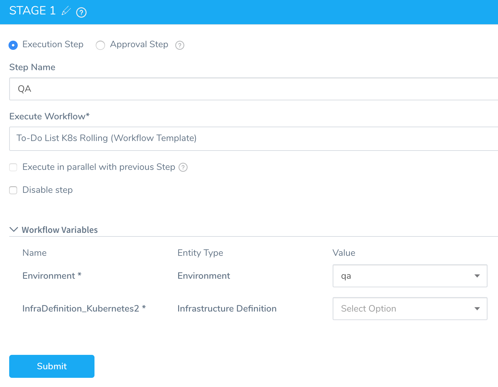
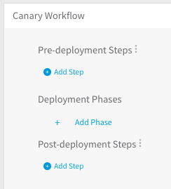
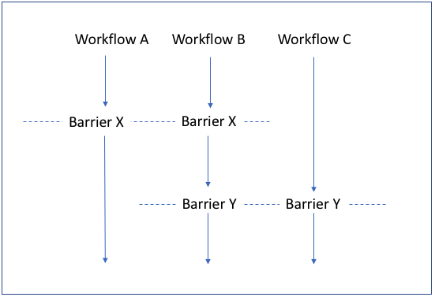
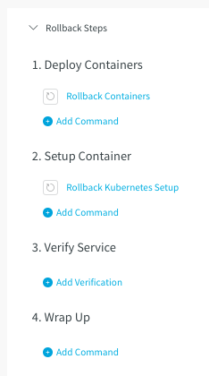
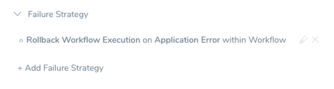
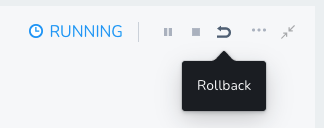

Workflows define the deployment orchestration steps, including how a Service is deployed, verified, rolled back, and more. Some of the common Workflow types are Canary, Blue/Green, and Rolling. An Application might have different deployment orchestration steps for different Environments, each managed in a Workflow.

If you're looking for Workflow How-tos, see the following:

* [Add a Workflow](tags-how-tos.md)
* [Deploy Individual Workflow](deploy-a-workflow.md)
* [Verify Workflow](verify-workflow-new-template.md)
* [Add a Workflow Notification Strategy](add-notification-strategy-new-template.md)
* [Define Workflow Failure Strategy](define-workflow-failure-strategy-new-template.md)
* [Set Workflow Variables](add-workflow-variables-new-template.md)
* [Use Steps for Different Workflow Tasks](add-steps-for-different-tasks-in-a-wor-kflow.md)
* [Add Phases to a Workflow](add-workflow-phase-new-template.md)
* [Synchronize Workflows in your Pipeline Using Barrier](synchronize-workflows-in-your-pipeline-using-barrier.md)
* [Templatize a Workflow](templatize-a-workflow-new-template.md)
* [Clone a Workflow](clone-a-workflow.md)
* [Configure Workflow Using YAML](configure-workflow-using-yaml.md)

### Before You Begin

Before learning about workflows, you should have an understanding of the following:

* [Application Components](../applications/application-configuration.md)
* [Add a Service](../setup-services/service-configuration.md)
* [Add an Environment](../environments/environment-configuration.md)

### Workflow Types

If you are new to deployment strategies, read [Deployment Concepts and Strategies](https://docs.harness.io/article/325x7awntc-deployment-concepts-and-strategies) to learn about common deployment strategies. This will help you understand the deployment strategies Harness Workflows implement.

The following Workflow types are available when creating a Workflow.

* **Basic**  —  A Basic deployment selects nodes and installs a service.See:* [AMI Basic Deployment](https://docs.harness.io/article/rd6ghl00va-ami-deployment)
  * [Lambda Workflows and Deployments](https://docs.harness.io/article/491a6etr7a-4-lambda-workflows-and-deployments)
  * [Helm Workflows and Deployments](https://docs.harness.io/article/m8ra49bqd5-4-helm-workflows)
  * [IIS Workflows and Pipelines](https://docs.harness.io/article/z6ls3tgkqc-4-iis-workflows)
  * [PCF Workflows and Deployments](https://docs.harness.io/article/c92izkztka-create-a-basic-pcf-deployment)
  * Shell Script-based deployments, such as [Build and Deploy Pipelines](https://docs.harness.io/article/181zspq0b6-build-and-deploy-pipelines-overview) and [Traditional Deployments](https://docs.harness.io/article/6pwni5f9el-traditional-deployments-overview).

* **Multi-Service**  —  A Multi-Service uses one or more phases composed of separate steps. |

* **Canary**  —  A Canary deployment rolls out a new app version to small sets of users in separate phases, tests and verifies it at each phase, gradually rolling it out to your entire infrastructure.
  See:
  * [AMI Canary Deployment](https://docs.harness.io/article/agv5t7d156-ami-canary)
  * [Create a Kubernetes Canary Deployment](https://harness.helpdocs.io/article/2xp0oyubjj-create-a-kubernetes-canary-deployment)
  * [ECS Workflows](https://docs.harness.io/article/oinivtywnl-ecs-workflows)
  * [PCF Workflows and Deployments](https://docs.harness.io/article/99bxiqfi1u-create-a-canary-pcf-deployment)

   :::note
   **Kubernetes Canary Workflows:** While you can add multiple phases to a Kubernetes Canary Workflow, you should simply use the Canary and Primary Phases generated by Harness when you add the first two phases. Kubernetes deployments have built-in controls for rolling out in a controlled way. The Canary Phase is a way to test the new build, run your verification, then roll out in the Primary Phase.
   :::

* **Build**  —  A Build deployment simply builds and collects artifacts. You can use it as part of a Pipeline that builds the latest artifact and deploys it, or as the first step in a Pipeline that is executed in response to a source update such as a Git push event.

   :::note
   If you use a Build Workflow in a Pipeline, you cannot select an artifact when you deploy the Pipeline. A Build Workflow tells Harness you will be building the artifact for deployment as part of the Pipeline. Harness will use that artifact for the Pipeline deployment.
   
   See [Build and Deploy Pipelines Overview](https://docs.harness.io/article/181zspq0b6-build-and-deploy-pipelines-overview) and [Using Build Workflows in a Pipeline](https://docs.harness.io/article/slkhuejdkw-6-artifact-build-and-deploy-pipelines#using_build_workflows_in_a_pipeline). 
   
* **Rolling**  —  A Rolling deployment lets you gradually roll out your deployment, enabling and disabling services as necessary.

  See:
  
  * [Create a Kubernetes Rolling Deployment](https://harness.helpdocs.io/article/dl0l34ge8l-create-a-kubernetes-rolling-deployment)
  * [Azure Workflows and Deployments](https://docs.harness.io/article/x87732ti68-4-azure-workflows-and-deployments)


* **Blue/Green**  —  In a Blue/Green deployment, network traffic to your service/artifact is routed between two identical environments called blue (staging) and green (production). Both environments run simultaneously, containing different versions or the service/artifact.

  See:
  * [AMI Blue/Green Deployment](https://docs.harness.io/article/vw71c7rxhp-ami-blue-green)
  * [ECS Blue/Green Workflows](https://docs.harness.io/article/7qtpb12dv1-ecs-blue-green-workflows)
  * [Create a Kubernetes Blue/Green Deployment](https://harness.helpdocs.io/article/ukftzrngr1-create-a-kubernetes-blue-green-deployment)
  * [PCF Workflows and Deployments](https://docs.harness.io/article/52muxcsr1v-create-a-blue-green-pcf-deployment)


When you submit, the Workflow display the steps needed to perform depending on the Workflow type you selected.

### Workflow Variables

You can set variables in the **Workflow Variables** section of your Workflow, and use them in the Workflow step commands and settings.

See [Set Workflow Variables](add-workflow-variables-new-template.md).

For information on variables and expressions, see [Variables and Expressions in Harness](https://docs.harness.io/article/9dvxcegm90-variables) and [Passing Variables into Workflows and Pipelines from Triggers](../expressions/passing-variable-into-workflows.md).

### Template a Workflow

See [Templatize a Workflow](templatize-a-workflow-new-template.md).

You can turn a Workflow into a Workflow template ("templatize it") by using variables for important settings such as Environment, Service, and Infrastructure Definition. When the Workflow is deployed, the user must provide values for the settings you have defined as variables.

When you turn a Workflow into a template, if the Workflow still retains references to the entities it was originally created with (such as a Service), any attempts to delete these entities will result in an error, because the template is still using them. You will need to remove the references from the template before you can delete them.

#### Workflow Templates and Service Types

The Workflow template only works with Services using the same Deployment and Artifact Type as the Service used to create the Workflow. This applies to Services of Deployment Type **Secure Shell (SSH)**.

For example, let's say you created a Workflow using a Service with the Deployment Type **Secure Shell (SSH)** and Artifact Type **JAR**. If you have another Service with the same Deployment Type, but the Artifact Type is **WAR**, the Workflow template will not show it as an option during deployment.

#### Templatize Phases in Canary Workflows

For Canary Workflows, you edit the Phase settings and click the **[T]** next to **Service**. The **[T]** was automatically selected for **Infrastructure Definition** when you clicked the **[T]** for **Environment**.


#### Templatized Workflows in Pipelines

Once you have templatized a Workflow, you can use it in multiple stages of a pipeline.

For example, you can templatize the **Environment** and **Infrastructure Definition** of a Workflow, and then use the same Workflow for both the QA and Production stages of a Pipeline. When you add the Workflow to each stage, you simply provide QA and Production-specific values for **Environment** and **Infrastructure Definition** variables.


|  |  |
| --- | --- |
| **Workflow Variables in QA Stage of Pipeline** | **Workflow Variables in Production Stage of Pipeline** |
|   |  |

### Workflow Phases

In multi-phase deployments, such as a Canary Deployment, Workflow steps are grouped into phases. Here is a Canary Workflow before the phases and sub-steps are added:



:::note
You cannot run a Workflow's phases in parallel. Consider using multiple Workflows.
:::

### Barriers

When deploying interdependent services, such as microservices or a large and complicated application, there might be a need to coordinate the timing of the different components' deployments. A common example is the need to verify a group of services only after *all the services* are deployed successfully.

Harness Workflows address this scenario using barriers. Barriers allow you to synchronize different Workflows in your Pipeline, and control the flow of your deployment systematically.

Barriers have an effect only when two or more Workflows use the same barrier name, and are executed in parallel in a Pipeline. When executed in parallel, both Workflows will cross the barrier at the same time.

If a Workflow fails before reaching its barrier point, the Workflow signals the other Workflows that have the same barrier, and the other Workflows will react as if they failed as well. At that point, each Workflow will act according to its [Failure Strategy](#failure_strategies).

For more information on how to synchronize your Workflows using Barriers, see [Synchronize Workflows in your Pipeline Using Barriers](synchronize-workflows-in-your-pipeline-using-barrier.md).

### Rollback Steps

You define the steps of a Workflow rollback in **Rollback Steps**. Typically you want to rollback failed containers and container orchestration setup. You can also verify that the rollback has restored the last working version of your Service.

Harness performs rollback differently depending on the target platform (deployment type), deployment strategy, and the steps where you can configure how we handle old versions. See [Kubernetes Rollback](https://docs.harness.io/article/v41e8oo00e-kubernetes-rollback) and [ECS Rollbacks](https://docs.harness.io/article/d7rnemtfuz-ecs-rollback) as examples.

In general, during a successful deployment, Harness deletes all old versions of the deployed service except for the last successfully deployed version. This version is kept for rollback. If rollback occurs, Harness restores the last successful version but not the older versions it deleted.

For Docker, Kubernetes, AWS CodeDeploy, and Lambda deployments, Harness rolls back the deployment to the state that received the new code.

In case of a JAR, WAR, RPM, TAR, ZIP and other deployments, Harness provides default rollback steps (Disable, Stop, Deploy, Enable, Wrap-up). You can add custom commands in cases where you need to customize the rollback procedure.

:::note
* If you deploy a Workflow and choose the **Abort** option during the running deployment, the Rollback Steps for the Workflow are not executed. Abort stops the deployment execution without rollback or cleanup. To execute the Rollback Steps, click the **Rollback** button.

* For post-production rollback, see [Rollback Production Deployments](post-deployment-rollback.md).
:::

To set up rollback steps, do the following:

1. In a Workflow, click **Rollback Steps** to see the default steps. Here is an example of the default rollback steps in a Workflow that deploys a Docker image to a Kubernetes cluster:

   

### Notification Strategy

By default, when a Workflow fails, the Account Administrator is notified. You can specify a notification strategy for a Workflow (or for a Workflow phase in a Canary or Multi-Service Workflow) that sends notifications using different criteria.

See [Add a Workflow Notification Strategy](add-notification-strategy-new-template.md).

### Failure Strategies

A Failure Strategy defines how your Workflow handles different failure conditions. For example, if you are deploying a Service to a cluster of 100 nodes, what percentage of connectivity errors would you allow before failing the deployment?

There are two ways to define a failure strategy:

* The **Failure Strategy** settings for the entire Workflow.

  
  
* Step-level failure strategy for a Workflow step section.

  

See [Define Workflow Failure Strategy](define-workflow-failure-strategy-new-template.md).

### Concurrency Strategy

You can edit a Workflow's **Concurrency Strategy** section to override Harness' default [Workflow queuing](workflow-queuing.md) behavior. For details, see [Using Concurrency Strategy to Control Queuing](workflow-queuing.md#concurrency-strategy).


### Rollback a Running Workflow

You can rollback a running Workflow from the **Deployments** page.



To rollback a Production deployment from the Services dashboard, see [Rollback Production Deployments](post-deployment-rollback.md).This **Rollback** option requires the following User Group Account and Application permissions:

* **Account:** `Manage Applications`
* **Application:** `Rollback Workflow`


You can also add the **Rollback Workflow** Application permission via the GraphQL API:


```
mutation {  
  updateUserGroupPermissions(input: {  
    clientMutationId: "123"  
    userGroupId: "Gh9IDnVrQOSjckFbk_NJWg"  
    permissions: {  
      appPermissions: {  
        actions:[ROLLBACK_WORKFLOW]  
        permissionType: ALL  
        applications: {  
          filterType: ALL  
        }  
        deployments: {  
          filterTypes: NON_PRODUCTION_ENVIRONMENTS  
        }  
      }  
    }  
  }) {  
    clientMutationId  
  }  
}
```
#### Rollback Workflow added if Execute Workflow used Previously

All User Groups that had the **Execute Workflow** permission enabled will now have **Rollback Workflow** enabled, also. You can disable it if needed.

#### Platform and Workflow Support

Rollback for running Workflows is currently supported the following platforms and strategies:

* **Kubernetes** deployments: Basic, Blue/Green, Canary, Rolling Workflows.
* **SSH** deployments: Blue/Green, Canary, and Basic Workflows.
* **PCF (Pivotal Cloud Foundry)** deployments: Blue/Green, Canary, and Basic Workflows.
* **WinRM (IIS and .NET)** deployments: Blue/Green, Canary, and Basic Workflows.
* **ECS** deployments: all Workflow types, and both EC2 and Fargate clusters.
* **AMI/ASG** deployments: Blue/Green, Canary, and Basic Workflows.

Harness anticipates expanding this feature to other deployment platforms.

### Next Steps

Read the following topics to build on what you've learned:

* [Add a Workflow](tags-how-tos.md)
* [Deploy Individual Workflow](deploy-a-workflow.md)
* [Add a Workflow Notification Strategy](add-notification-strategy-new-template.md)
* [Define Workflow Failure Strategy](define-workflow-failure-strategy-new-template.md)
* [Synchronize Workflows in your Pipeline Using Barriers](synchronize-workflows-in-your-pipeline-using-barrier.md)
* [Workflow Queuing](workflow-queuing.md)

