This topic outlines how Harness queues Workflows, to prevent conflicts when two or more Workflows simultaneously deploy the same Harness Service to the same Harness Infrastructure Definition.

### Before You Begin

Ensure that you understand the following:

* [Services](../setup-services/service-configuration.md)
* [Workflows](workflow-configuration.md)
* [Infrastructure Definitions](../environments/infrastructure-definitions.md)

### Overview

When multiple Harness Workflows simultaneously deploy to the same infrastructure, this can generate conflicts. To prevent such conflicts, Harness normally places a *resource lock* on the infrastructure, and queues the Workflows in FIFO (First In, First Out) order.

You can override this behavior, as covered [below](#concurrency_strategy). Queuing is particularly valuable for Pipelines that execute multiple Workflows in parallel.

### Limitations

Currently, the following queue limitation is behind a Feature Flag. Contact [Harness Support](mailto:support@harness.io) to enable the feature. Feature Flags can only be removed for Harness Professional and Essentials editions. Once the feature is released to a general audience, it is available for Trial and Community Editions.Harness allows a maximum of **20 Workflow executions** in the queue that locks an infrastructure. Subsequent Workflows using that infrastructure will fail if the queue is full.

The queue limitation is to prevent a misconfigured Trigger or other execution mechanism from overloading your queue and preventing important deployments.

### Using Concurrency Strategy to Control Queuing

By default, Harness Workflows have their **Concurrency Strategy** set to **Acquire lock on the targeted service infrastructure**. This is the setting that enables queuing for shared infrastructure.

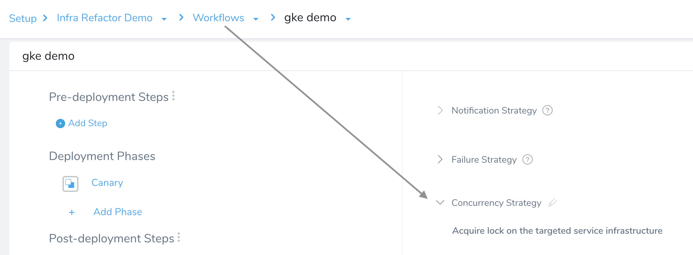

To exempt a Workflow from queuing behavior, click the pencil icon to open the **Concurrency Strategy** dialog shown here. Set the **Concurrency Control** drop-down to **Synchronization not required**, and click **Submit**.

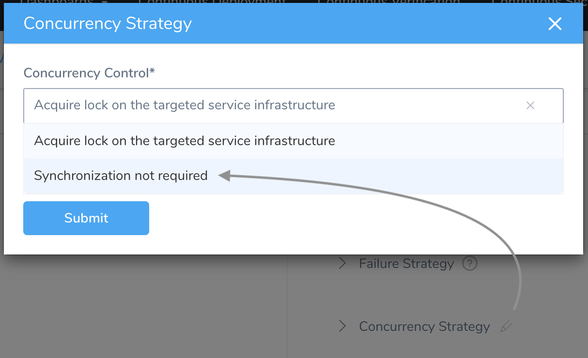

### Synchronization Not Required Best Practices

The golden rule with **Synchronization Not Required** is: Only use a concurrency strategy of **Synchronization Not Required** when it does not matter if multiple Workflows are running concurrently.

For example, if a Workflow simply hits an HTTP endpoint to post a message and message order does not matter, or for some other operation that is already an encapsulated transaction.

When to use **Acquire lock on the targeted service infrastructure**:

* If concurrently running Workflows are acting on the same infrastructure. Running Workflows like this in synch can cause interference in many ways.
* For any Workflow that modifies state over time to reach a new state, it must have a concurrency strategy that causes the Workflows to queue rather than overlap.

### How Harness Locks Infrastructure

Here is an example of how infrastructure locking works. In this Harness [Infrastructure Definition](../environments/infrastructure-definitions.md), the Kubernetes cluster's **Namespace** field is populated by the variable `${workflow.variables.namespace}`:

In this Kubernetes Workflow, we define the corresponding `namespace` variable:

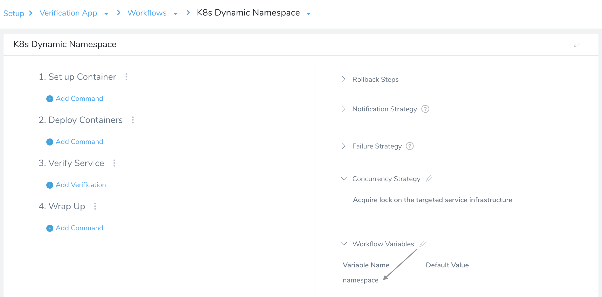

In the **Workflow Variables** dialog, we've assigned the variable no default value:

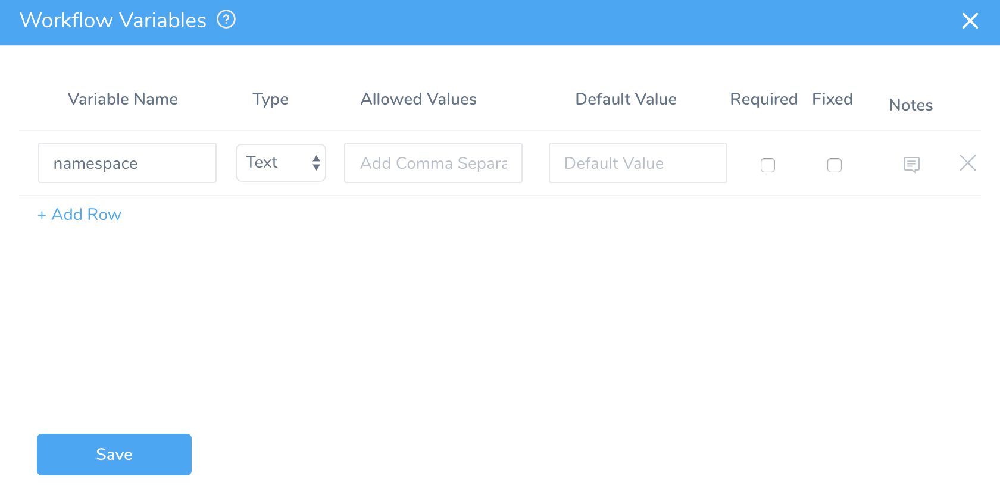

As we begin deployment of this Workflow, we assign the variable the value `target`:

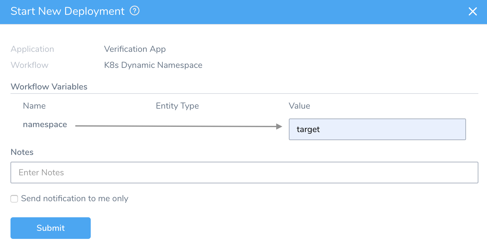

Once the Workflow deploys, the **Details** panel confirms that a lock has been placed on the resulting `namespace: target` and Harness Service combination:

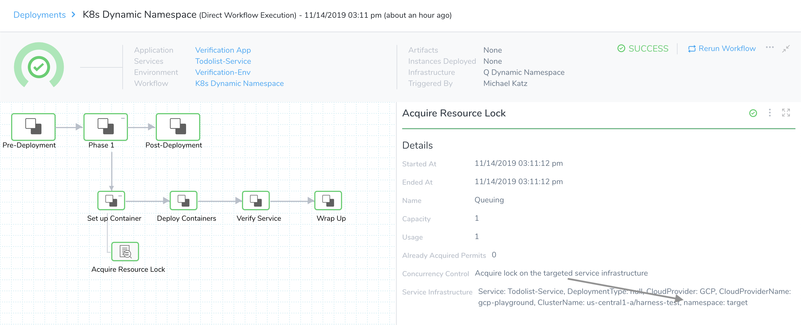

Harness locks on the unique **combination** of namespace and Harness Service. We do not lock the Service from being deployed to another namespace. Harness simply makes the Workflow wait if there is another Workflow running using the same Service and the same namespace together.If we open the details page for the Infrastructure Definition that we started with, it displays a newly created Infrastructure Mapping for the `target` namespace we specified:

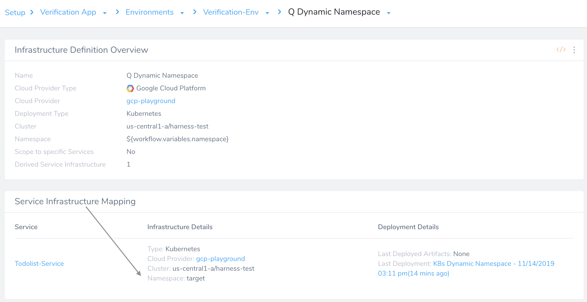

### Acquiring Resource Locks

When pending Workflows are contending for shared infrastructure, Harness uses the above mechanism to place the Workflows in a *resource lock queue*. The first-launched Workflow gets a *resource lock* on this infrastructure, which it holds until its deployment is resolved. This temporarily blocks other Workflows from using the infrastructure—only one Workflow at a time can have a lock on a given infrastructure.

When contending for shared infrastructure, most Workflows will therefore display an **Acquire Resource Lock** step in Harness' Deployments page:

This step appears even if no queue is present, because it's specified by Harness' **Acquire lock on the targeted service infrastructure** [default setting](#concurrency_strategy). There are two exceptions:

* No **Acquire Resource Lock** will appear in Workflows of *Build* deployment type.
* No **Acquire Resource Lock** step will appear in Workflows that have been [configured to ignore queueing](#concurrency_strategy).

Harness seeks to acquire a Resource Lock only once per Workflow. The lock's scope is the current Workflow. The **Acquire Resource Lock** step occurs in the first deployment or setup phase that *follows* any **Pre‑Deployment** phase or step.

This example, using a Pivotal Cloud Foundry Blue/Green Workflow, shows the **Acquire Resource Lock** step's typical position in a deployment:

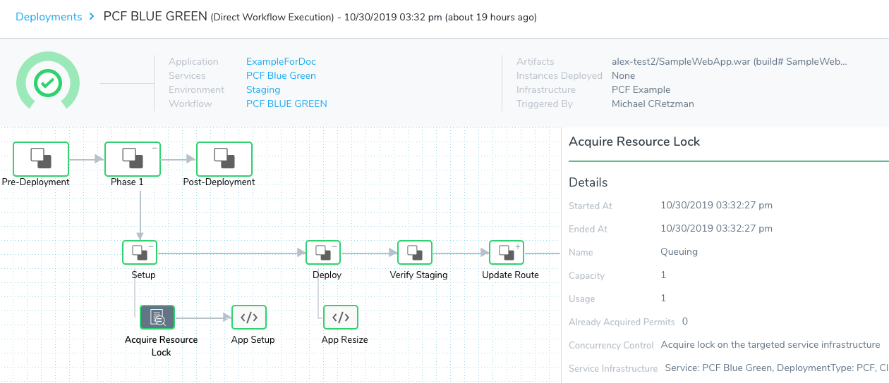

### Queuing in Action

Let's look at a full example of how queuing works. Assume that we have two similar Harness Kubernetes Workflows, `gke demo` and `gke demo-template-clone`. Both deploy to the same infrastructure, because they share the same [Infrastructure Definition](../environments/infrastructure-definitions.md).

When both Workflows are deployed simultaneously, Harness might initiate the deployment of `gke demo` slightly before `gke demo‑template‑clone`. This scenario applies to a Pipeline whose stages run these Workflows in parallel, but in that order:

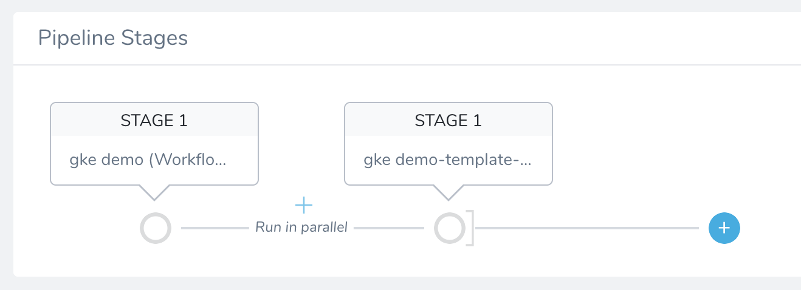

If we examine the `gke demo-template-clone` Workflow's Deployments page, we might initially see something like this:

This deployment is paused at its **Acquire Resource Lock** step. The **Details** panel shows why:

The `gke demo-template-clone` deployment is second in the **Resource Lock Queue**, so it currently has **BLOCKED** status.

Meanwhile, the `gke demo` is first in the queue. If we immediately switch to its Deployments page, we might see something like this:

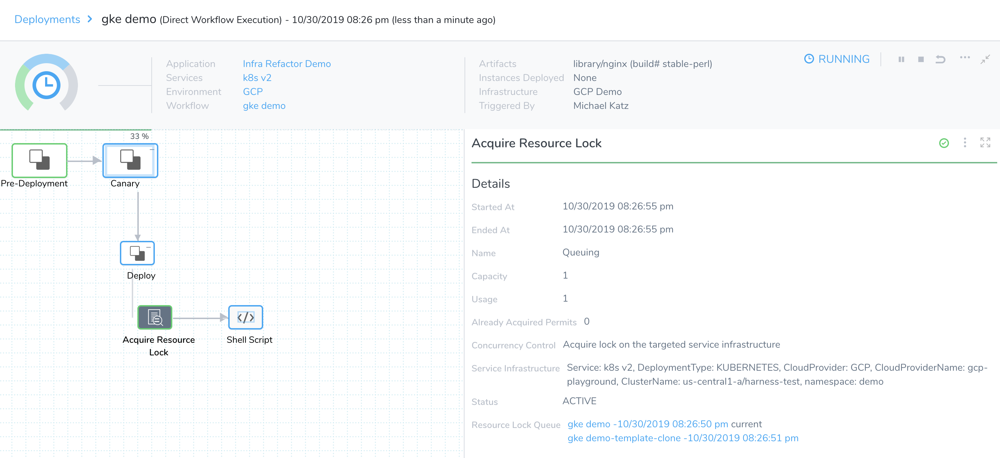

This Workflow's **Acquire Resource Lock** step has completed—it has acquired the lock. The **Details** panel confirms that this first-in-queue deployment has **ACTIVE** status:

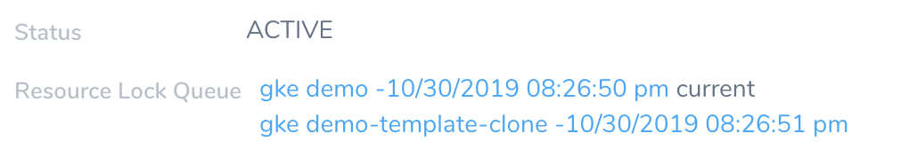

So the `gke demo` Workflow can now proceed through completion:

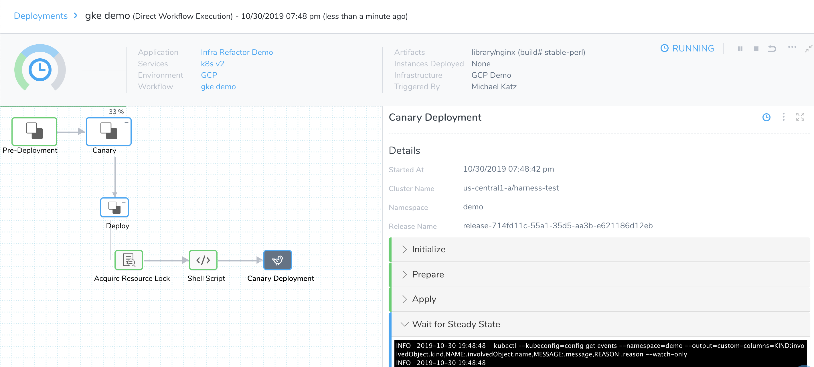

Once the `gke demo` Workflow has completed deployment, this clears the queue. Therefore, the `gke demo‑template‑clone` can now acquire the lock, and proceed to deploy:

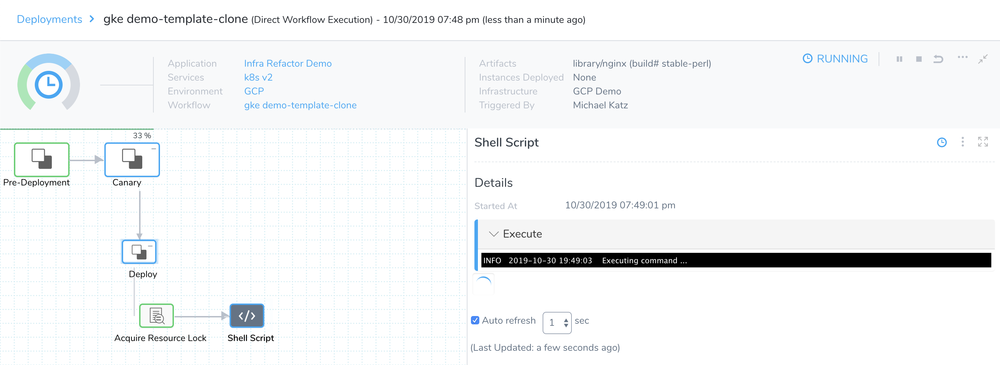

### Queuing with Infrastructure Provisioners

Workflows incorporating [Infrastructure Provisioners](../infrastructure-provisioner/add-an-infra-provisioner.md) are queued the same way as Workflows based on predefined infrastructure. Infrastructure Provisioners commands are always added in the Workflow's **Pre‑Deployment** phase. This sets up the new infrastructure, enabling Harness to properly queue and lock deployments to that infrastructure in the following phase.

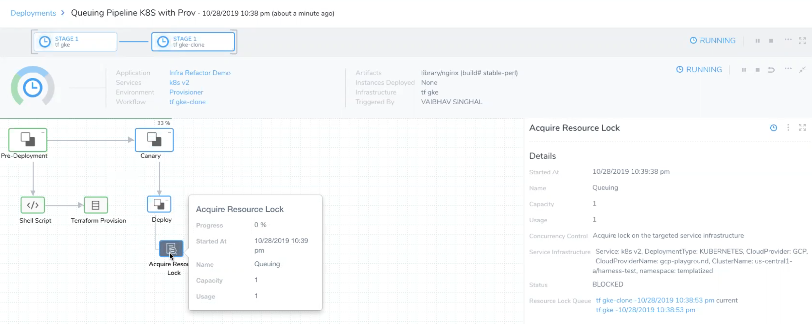

### Next Steps

* To more precisely synchronize multiple Workflows within a Pipeline, use [Barriers](workflow-configuration.md#barriers).
* To queue deployments account-wide, add a Resource Constraint. See [Resource Restrictions](resource-restrictions.md).

