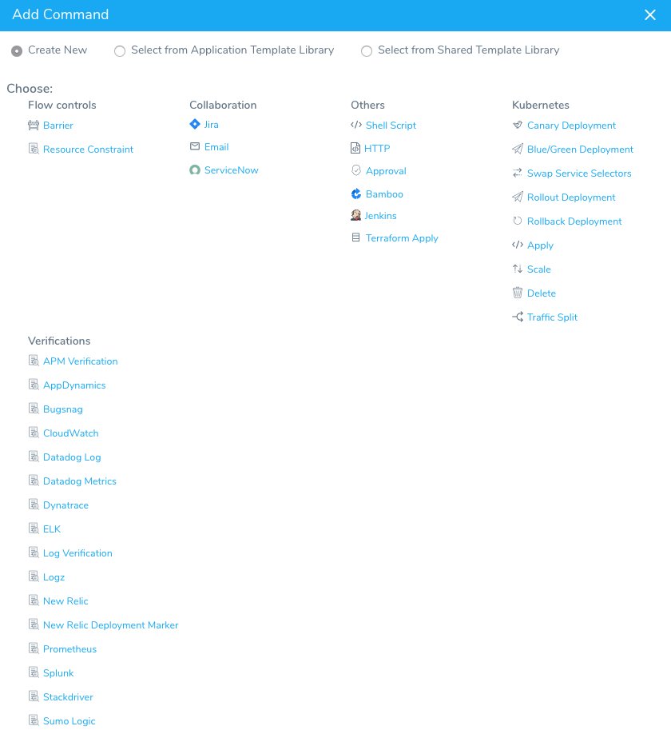
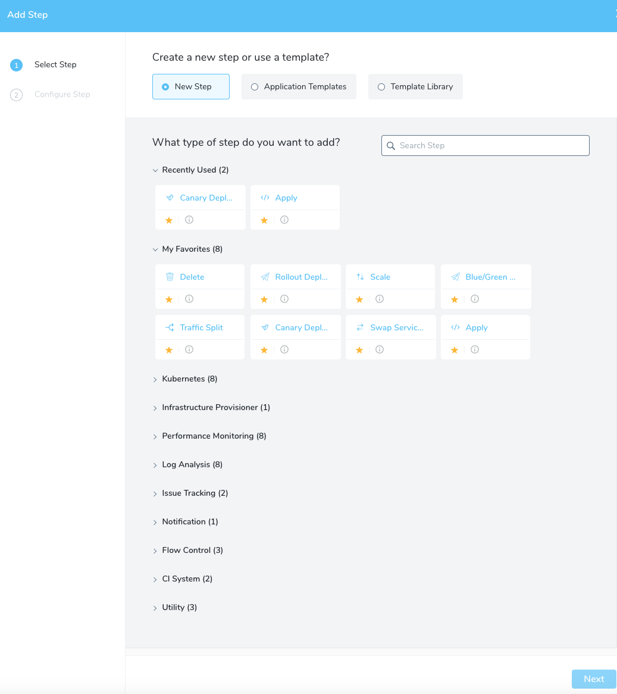
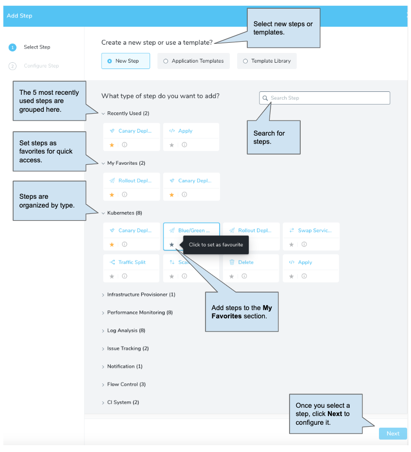
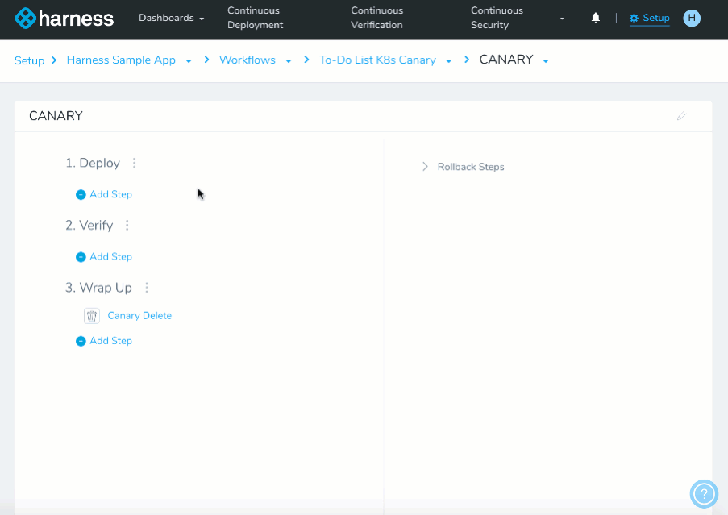

Harness is changing how you add steps in Workflows to offer new features for managing commonly-used steps.

The settings inside each step will remain the same, but the user experience will change slightly.

The new UI for Workflow steps will be implemented soon. This document provides an overview of the changes to help with the transition.

Let's take a look at some of the changes.

### Adding Commands

The following table shows the difference between the current Add Command dialog and the new Add Step UI:

|  |  |
| --- | --- |
| **Adding Commands Currently** | **Add Steps in the New UI** |
|  |  |

The new Add Step UI has the following features:

Here is an animated GIF showing how steps are added in the new UI:

### Do I Have to Do Anything?

No. Your current Workflows and their step settings will not change. The only change is in the user experience.

