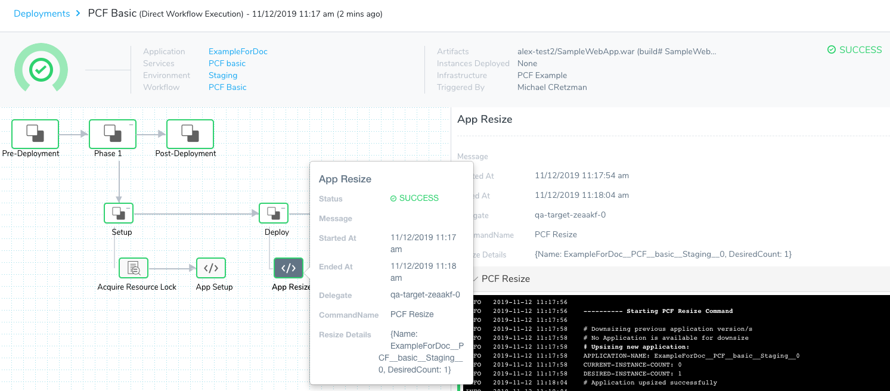
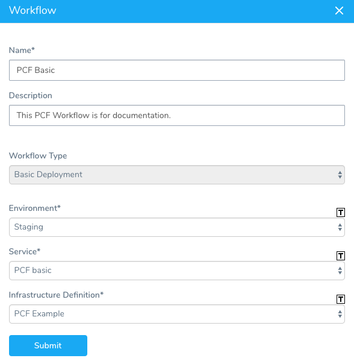
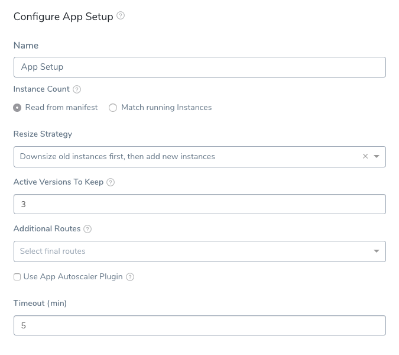
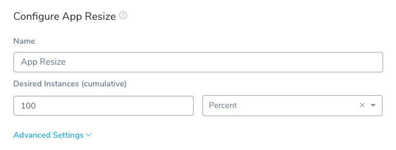
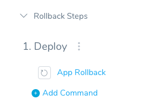
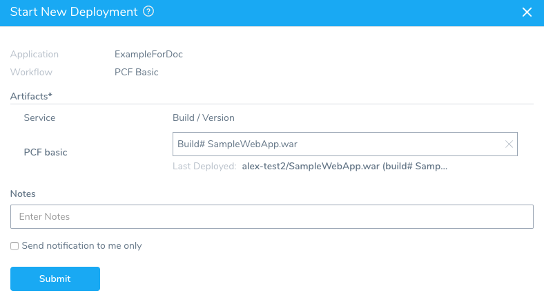

A Tanzu Application Service (formerly PCF) Workflow performing a Basic deployment simply takes your Harness TAS Service and deploys it to your PCF Infrastructure Definition.

Once the TAS app is set up in the Workflow using the **App Setup** command, you can resize the number of instances specified in the Service manifest.yml or App Setup command using the **App Resize** command.

Here is an example of a successful TAS Basic deployment:




### Before You Begin

* See [Connect to Your Target Tanzu Account](connect-to-your-target-pcf-account.md).
* See [Define Your Tanzu Target Infrastructure](define-your-pcf-target-infrastructure.md).

### Step 1: Set Up a TAS Basic Deployment

To set up a TAS Basic deployment, do the following:

1. In your Harness Application, connect to your TAS account, as described in [Connect to Your Target Tanzu Account](connect-to-your-target-pcf-account.md).
2. Create your Harness TAS Service and add the artifact to deploy, as described in [Add Container Images for Tanzu Deployments](add-container-images-for-pcf-deployments.md).
3. Create your TAS Infrastructure Definition, as described in [Define Your Tanzu Target Infrastructure](define-your-pcf-target-infrastructure.md).
4. In your Harness Application, click **Workflows**.
5. Click **Add Workflow**. The **Workflow** dialog appears.
6. Name your Workflow, and then, in **Workflow Type**, select **Basic Deployment**.
7. In **Environment**, select the Environment containing your target Infrastructure Definition.
8. In **Service**, select the TAS Service you want to deploy.
9. In **Infrastructure Definition**, select your target Infrastructure Definition.

When you are done, the dialog will look something like this:



Click **Submit**. The TAS Basic Workflow is created.

### Step 2: App Setup

The App Setup command uses the manifest.yml in your Harness TAS Service to set up your app.



The **Match running instances** setting can be used after your first deployment to override the `instances` setting in the manifest.yml.

To add routes in addition to the routes defined in the Service manifest, select routes in **Additional Routes**.

For information on using the **Use App Autoscaler Plugin** settings, see [Use the App Autoscaler Service](use-the-app-autoscaler-service.md).

In **Timeout**, set how long you want the Harness Delegate to wait for the TAS cloud to respond to API requests before timing out.

In **Delegate Selectors**, select the Selector for the Delegate(s) you want to use. You add Selectors to Delegates to make sure that they're used to execute the command. For more information, see [Select Delegates with Selectors](https://docs.harness.io/article/c3fvixpgsl-select-delegates-for-specific-tasks-with-selectors).

Harness will use Delegates matching the Selectors you add.

If you use one Selector, Harness will use any Delegate that has that Selector.

If you select two Selectors, a Delegate must have both Selectors to be selected. That Delegate might also have other Selectors, but it must have the two you selected.

You can use expressions for Harness built-in variables or Account Default variables in **Delegate Selectors**. When the variable expression is resolved at deployment runtime, it must match an existing Delegate Selector.  
  
For example, if you have a Delegate Selector **prod** and the Workflow is using an Environment also named **prod**, the Delegate Selector can be `${env.name}`. This is very useful when you match Delegate Selectors to Application component names such as Environments, Services, etc. It's also a way to template the Delegate Selector setting.

#### Version Management

Currently, this feature is behind the Feature Flag `CF_APP_NON_VERSIONING_INACTIVE_ROLLBACK`. Contact [Harness Support](mailto:support@harness.io) to enable the feature.For details on how Harness manages Tanzu app names and how this feature impacts naming, see [Tanzu App Naming](tanzu-app-naming-with-harness.md).

### Step 3: App Resize

When you first create your TAS Workflow, the App Resize command is displayed as incomplete. Harness simply needs you to confirm or change the default number of desired instances, **100 Percent**.



You can select to use a percentage of the number specified in your manifest.yml, or if you used the App Setup **Match desired count with current running instances** setting, the current number of running instances. You can also use a count to explicitly set the number of desired instances.

Click **Advanced** to see **Desired Instances - Old Version**. Here you can set the number of instances for the previous version of the app. By default, the app will downsize to the same number as the number of new app instances.

You can only have one App Resize step in a Basic TAS Workflow.

#### Downsize or Retain Instances

Currently, this feature is behind a Feature Flag. Contact [Harness Support](mailto:support@harness.io) to enable the feature. Feature Flags can only be removed for Harness Professional and Essentials editions. Once the feature is released to a general audience, it's available for Trial and Community Editions.  
  
See [New features added to Harness](https://changelog.harness.io/?categories=fix,improvement,new) and [Features behind Feature Flags](https://changelog.harness.io/?categories=early-access) (Early Access) for Feature Flag information.You can choose one of the following resize options:

* **Retain instances:** the number entered in **Advanced Settings** for **Desired Instances - Old App** determines how many instances of the old app will remain running.
* **Downsize instances:** the number entered in **Advanced Settings** for **Desired Instances - Old App** determines how many instances of the old app are downsized.

### Step 4: App Rollback

In **Rollback Steps**, you can see the **App Rollback** command.



There is nothing to set in this command. It is simply the command to rollback to the old version of the app in case of a deployment failure.

##### Deploy a TAS Basic Workflow

To deploy your TAS Basic Workflow, click **Deploy**.



Select the artifact for your new app and click **Submit**. The Workflow is deployed.

The **App Setup** command output shows your app was created successfully:


```
---------- Starting PCF App Setup Command  
  
# Fetching all existing applications   
# No Existing applications found  
  
# Creating new Application  
# Manifest File Content:   
---  
applications:  
- name: ExampleForDoc__PCF__basic__Staging__0  
  memory: ((PCF_APP_MEMORY))  
  instances: 0  
  path: /home/ubuntu/harness-delegate/./repository/pcfartifacts/BY3yUoB7Q3ibJicbwmgn8Q/1573586245429SampleWebApp.war  
  random-route: true  
  
# CF_HOME value: /home/ubuntu/harness-delegate/./repository/pcfartifacts/BY3yUoB7Q3ibJicbwmgn8Q  
# Performing "login"  
API endpoint: api.run.pivotal.io  
Authenticating...  
OK  
  
Targeted org Harness  
Targeted space AD00001863  
  
API endpoint:   https://api.run.pivotal.io (API version: 2.142.0)  
User:           john.doe@harness.io  
Org:            Harness  
Space:          AD00001863  
# Login Successful  
# Performing "cf push"  
Pushing from manifest to org Harness / space AD00001863 as john.doe@harness.io...  
Using manifest file /home/ubuntu/harness-delegate/./repository/pcfartifacts/BY3yUoB7Q3ibJicbwmgn8Q/ExampleForDoc__PCF__basic__Staging__0_1.yml  
Getting app info...  
Creating app with these attributes...  
+ name:        ExampleForDoc__PCF__basic__Staging__0  
  path:        /home/ubuntu/harness-delegate/repository/pcfartifacts/BY3yUoB7Q3ibJicbwmgn8Q/1573586245429SampleWebApp.war  
+ instances:   0  
+ memory:      350M  
  routes:  
+   examplefordocpcfbasicstaging0-zany-waterbuck.cfapps.io  
  
Creating app ExampleForDoc__PCF__basic__Staging__0...  
Mapping routes...  
Comparing local files to remote cache...  
Packaging files to upload...  
Uploading files...  
 0 B / 4.70 KiB    0.00% 4.70 KiB / 4.70 KiB  100.00% 4.70 KiB / 4.70 KiB  100.00% 4.70 KiB / 4.70 KiB  100.00% 4.70 KiB / 4.70 KiB  100.00% 4.70 KiB / 4.70 KiB  100.00% 4.70 KiB / 4.70 KiB  100.00% 1s  
Waiting for API to complete processing files...  
...  
There are no running instances of this process.  
  
# Application created successfully  
# App Details:   
NAME: ExampleForDoc__PCF__basic__Staging__0  
INSTANCE-COUNT: 0  
ROUTES: [examplefordocpcfbasicstaging0-zany-waterbuck.cfapps.io]  
  
 ----------  PCF Setup process completed successfully  
# Deleting any temporary files created
```
Next, the **App Resize** command shows the app instances upsized to the new instance count, in our example, 1.


```
---------- Starting PCF Resize Command  
# Downsizing previous application version/s  
# No Application is available for downsize  
# Upsizing new application:  
APPLICATION-NAME: ExampleForDoc__PCF__basic__Staging__0  
CURRENT-INSTANCE-COUNT: 0  
DESIRED-INSTANCE-COUNT: 1  
# Application upsized successfully   
  
# Application state details after upsize:    
NAME: ExampleForDoc__PCF__basic__Staging__0  
INSTANCE-COUNT: 1  
ROUTES: [examplefordocpcfbasicstaging0-zany-waterbuck.cfapps.io]  
  
Instance Details:  
Index: 0  
State: STARTING  
Disk Usage: 0  
CPU: 0.0  
Memory Usage: 0  
--------- PCF Resize completed successfully
```
You TAS Basic Workflow is complete.

### Next Steps

* [Create a Canary Tanzu Deployment](create-a-canary-pcf-deployment.md)
* [Create a Blue/Green Tanzu Deployment](create-a-blue-green-pcf-deployment.md)

