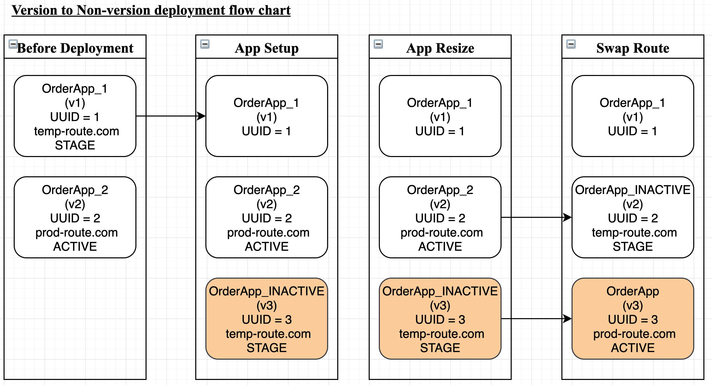
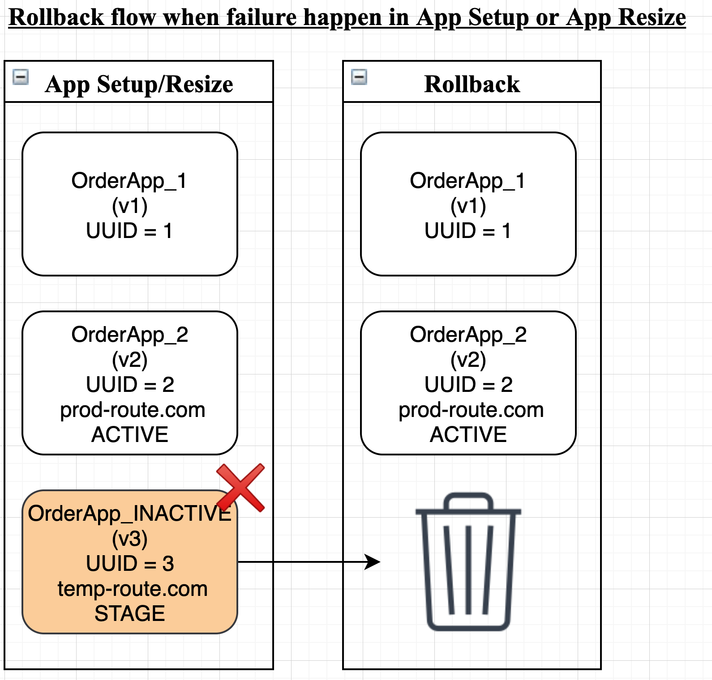
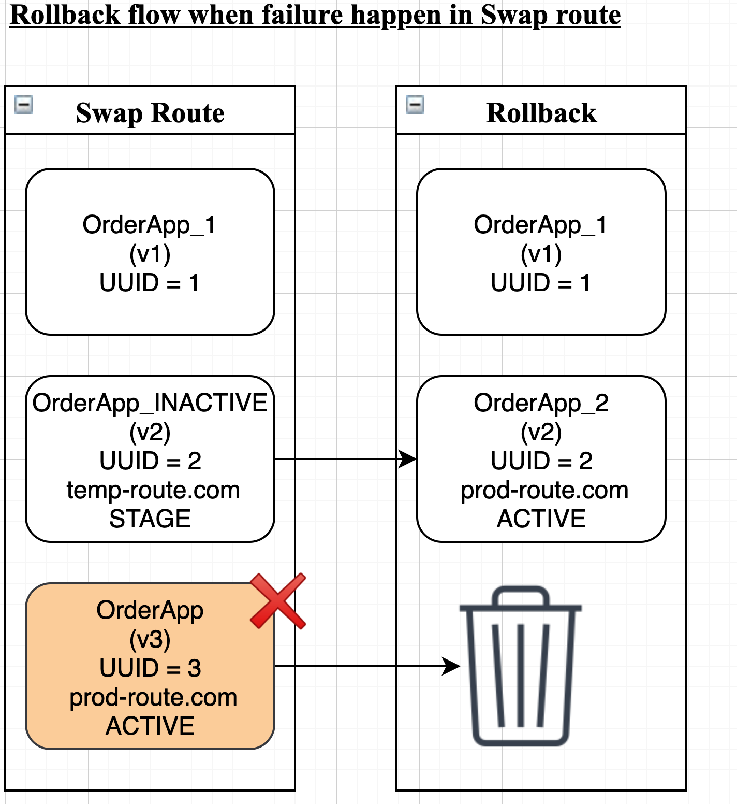
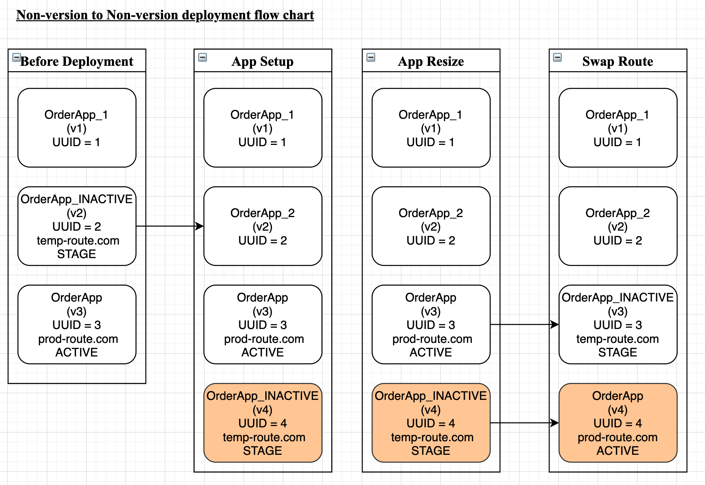
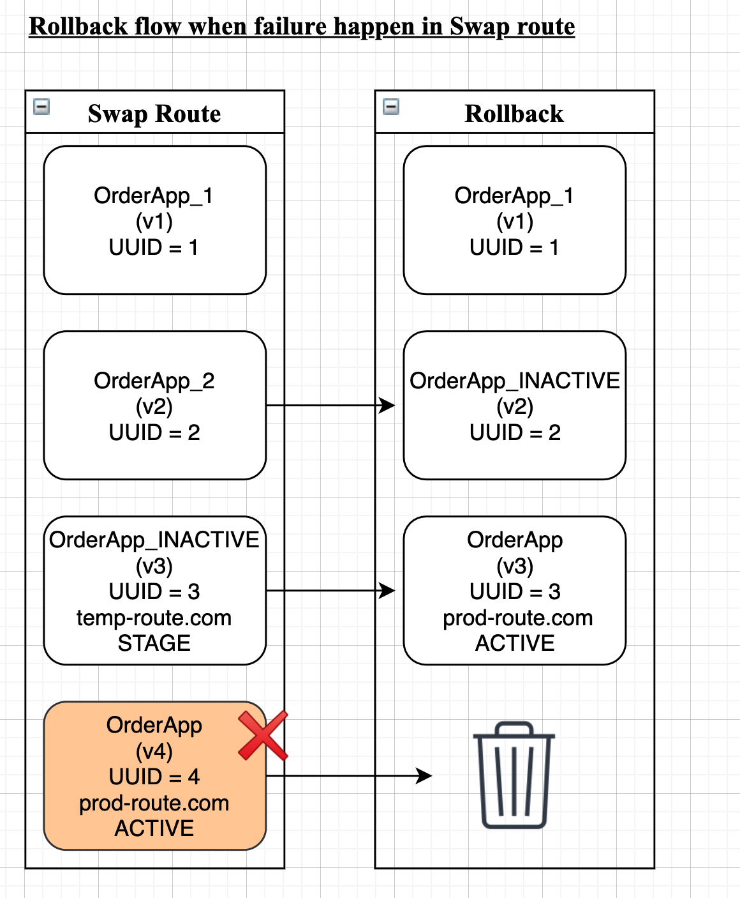
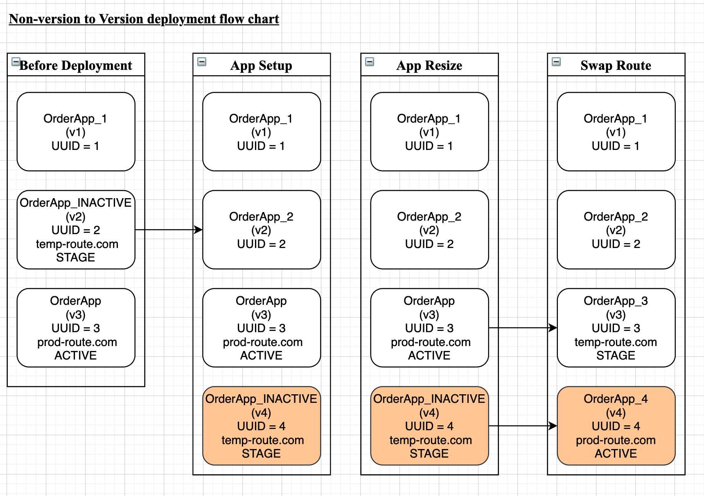
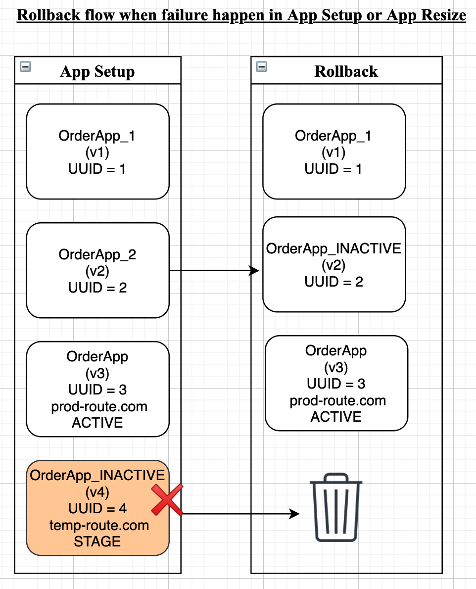
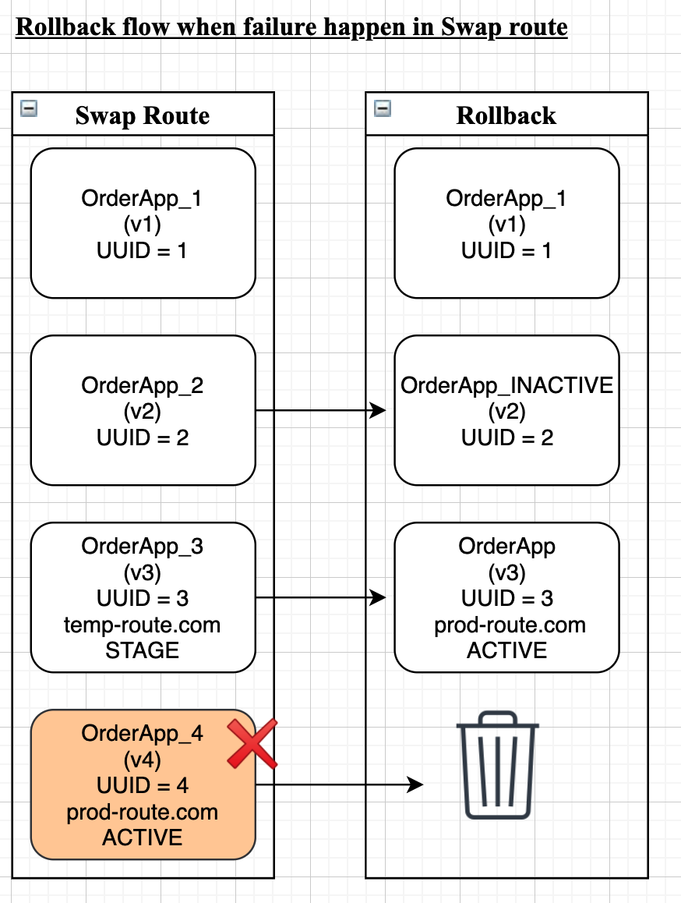

TAS was formerly Pivotal Cloud Foundry (PCF). The variables in this topic use `pcf` as a result. The variables work the same as before. There is no need to change any existing implementations.Harness includes the following variables to help you output TAS deployment information in your Workflows, such as in the [CF Command](run-cf-cli-commands-and-scripts-in-a-workflow.md#step-run-the-cf-cli-command) or the [Shell Script command](https://docs.harness.io/article/1fjrjbau7x-capture-shell-script-step-output).

This topic covers the following:

<!-- TOC start -->
- [Variables List](#variables-list)
    + [`${service.manifest}` ](#servicemanifest)
    + [`${service.manifest.repoRoot}`  ](#servicemanifestreporoot)
    + [`${pcf.newAppRoutes}`  ](#pcfnewapproutes)
    + [`${pcf.newAppName}`  ](#pcfnewappname)
    + [`${pcf.newAppGuid}`  ](#pcfnewappguid)
    + [`${pcf.oldAppName}`  ](#pcfoldappname)
    + [`${pcf.activeAppName}` and `${pcf.inActiveAppName}`  ](#pcfactiveappname-and-pcfinactiveappname)
    + [`${pcf.oldAppGuid}`  ](#pcfoldappguid)
    + [`${pcf.oldAppRoutes}`  ](#pcfoldapproutes)
    + [`${pcf.finalRoutes}`  ](#pcffinalroutes)
    + [`${pcf.tempRoutes}`  ](#pcftemproutes)
    + [`${infra.pcf.cloudProvider.name}`  ](#infrapcfcloudprovidername)
    + [`${infra.pcf.organization}`  ](#infrapcforganization)
    + [`${infra.pcf.space}`  ](#infrapcfspace)
    + [`${host.pcfElement.applicationId}`  ](#hostpcfelementapplicationid)
    + [`${host.pcfElement.displayName}`  ](#hostpcfelementdisplayname)
    + [`${host.pcfElement.instanceIndex}`  Shows the [CF\_INSTANCE\_INDEX](https://docs.cloudfoundry.org/devguide/deploy-apps/environment-variable.html#CF-INSTANCE-INDEX). ](#hostpcfelementinstanceindex-shows-the-cf_instance_indexhttpsdocscloudfoundryorgdevguidedeploy-appsenvironment-variablehtmlcf-instance-index)
- [Harness TAS Environment Variables](#harness-tas-environment-variables)
- [App Name Variables and Blue Green Deployments](#app-name-variables-and-blue-green-deployments)
  * [Version to Non-Version](#version-to-non-version)
    + [Variable Resolution during Successful Deployments](#variable-resolution-during-successful-deployments)
    + [Failure during App Setup or App Resize](#failure-during-app-setup-or-app-resize)
    + [Variable Resolution during App Resize Step Failure](#variable-resolution-during-app-resize-step-failure)
    + [Failure during Swap Route Step](#failure-during-swap-route-step)
    + [Variables Resolution during Swap Route Step Failure](#variables-resolution-during-swap-route-step-failure)
  * [Non-Version to Non-Version](#non-version-to-non-version)
    + [Variables Resolution during Successful Deployments](#variables-resolution-during-successful-deployments)
    + [Failure during the App Setup or App Resize Steps](#failure-during-the-app-setup-or-app-resize-steps)
    + [Variables Resolution during App Setup or App Resize Failure](#variables-resolution-during-app-setup-or-app-resize-failure)
    + [Failure during the Swap Route Step](#failure-during-the-swap-route-step)
    + [Variables Resolution during Swap Route Failure](#variables-resolution-during-swap-route-failure)
  * [Non-Version to Version](#non-version-to-version)
    + [Variables Resolution during a Successful Deployment](#variables-resolution-during-a-successful-deployment)
    + [Failures during the App Setup or App Resize Steps](#failures-during-the-app-setup-or-app-resize-steps)
    + [Variables Resolution during App Setup or App Resize Failure](#variables-resolution-during-app-setup-or-app-resize-failure-1)
    + [Failure during the Swap Route Step](#failure-during-the-swap-route-step-1)
    + [Variables Resolution during the Swap Route Step Failure](#variables-resolution-during-the-swap-route-step-failure)
  * [Notes](#notes)
<!-- TOC end -->

## Variables List

:::note
In Blue/Green deployments, the outputs for the `${pcf.finalRoutes}`, `${pcf.oldAppRoutes}` and `${pcf.tempRoutes}` variables do not change, but the outputs for `${pcf.newAppRoutes}` change as the routes are swapped in the **Swap Routes** or **Rollback** step. Simply put, `${pcf.newAppRoutes}` reflects the routes at a point in time (after the **Swap Routes** or **Rollback** step).
:::

#### `${service.manifest}` 

Refers to the folder containing your manifest files. See [Scripts and Variables](run-cf-cli-commands-and-scripts-in-a-workflow.md#option-scripts-and-variables). 

####  `${service.manifest.repoRoot}`  

Refers to the remote Git repo root folder containing your manifest files. See [Scripts and Variables](run-cf-cli-commands-and-scripts-in-a-workflow.md#option-scripts-and-variables). 

####  `${pcf.newAppRoutes}`  

An array of all the routes defined in your manifest.yml in your Harness Service.

You can reference any route in the array using its index, such as `${pcf.newAppRoutes[0]}`.

You can use the route to create a URL in a script, such as `http://${pcf.newAppRoutes[0]}`.

In a Blue/Green deployment, `${pcf.newAppRoutes}` are the same as `${pcf.tempRoutes}` until the Swap Routes step is run, after which `${pcf.newAppRoutes}` is the same as `${pcf.finalRoutes}`.

:::note 
This variable expression should be used after the **App Setup** step.
::: 

####  `${pcf.newAppName}`  

New app name.

:::note 
This variable expression should be used after the **App Setup** step.
::: 

####  `${pcf.newAppGuid}`  

New app GUID.This variable expression should be used after the **App Setup** step. 

####  `${pcf.oldAppName}`  

Old app name. This is the app that is replaced by your newly deployed app.

:::note 
This variable expression should be used after the **App Setup** step.
::: 

####  `${pcf.activeAppName}` and `${pcf.inActiveAppName}`  

See [App Name Variables and Blue Green Deployments](pcf-built-in-variables.md#app-name-variables-and-blue-green-deployments) below. 

####  `${pcf.oldAppGuid}`  
pcf.tempRoutesOld app GUID.

:::note 
This variable expression should be used after the **App Setup** step.
::: 

####  `${pcf.oldAppRoutes}`  

An array of the routes that were used for the old app.

You can reference any route in the array using its index, such as `${pcf.oldAppRoutes[0]}`.

You can use the route to create a URL in a script, such as `http://${pcf.oldAppRoutes[0]}`.

:::note 
This variable expression should be used after the **App Setup** step.
::: 

#### `${pcf.finalRoutes}`  

An array of the active routes once deployment is successful.This variable expression should be used after the **App Setup** step. 

####  `${pcf.tempRoutes}`  

An array of the temporary routes used for Blue/Green deployments.

:::note 
This variable expression should be used after the **App Setup** step.
::: 

####  `${infra.pcf.cloudProvider.name}`  

The Cloud Provider name used in the Infrastructure Definition set up in the Workflow. 

####  `${infra.pcf.organization}`  

The Organization name used in the Infrastructure Definition set up in the Workflow. 

####  `${infra.pcf.space}`  

The Space name used in the Infrastructure Definition set up in the Workflow. 

####  `${host.pcfElement.applicationId}`  

Shows the TAS app ID [Environment variable](https://docs.cloudfoundry.org/devguide/deploy-apps/environment-variable.html#view-env). Such as you would see in a cf env command:

```
...
{ 
  "VCAP_APPLICATION": {  
    "application_id": "fa05c1a9-0fc1-4fbd-bae1-139850dec7a3",  
    "application_name": "my-app",
    ...
```
 
####  `${host.pcfElement.displayName}`  
 
Shows the TAS app name (`"application_name": "my-app"` in the example above). 
 
####  `${host.pcfElement.instanceIndex}`  Shows the [CF\_INSTANCE\_INDEX](https://docs.cloudfoundry.org/devguide/deploy-apps/environment-variable.html#CF-INSTANCE-INDEX). 

Here is a script that outputs some of the variables:


```
echo ${pcf.newAppRoutes[0]}  
  
echo New App Name: ${pcf.newAppName}  
echo New App GUID:  ${pcf.newAppGuid}  
echo New App Routes:  ${pcf.newAppRoutes}  
  
echo "\n\n"  
echo Old App Name: ${pcf.oldAppName}  
echo Old App GUID:  ${pcf.oldAppGuid}  
echo Old App Routes:  ${pcf.oldAppRoutes}  
  
echo activeRoute: ${pcf.finalRoutes}  
echo inActiveRoute: ${pcf.tempRoutes}  
  
echo ${infra.pcf.cloudProvider.name}  
echo ${infra.pcf.organization}  
echo ${infra.pcf.space}
```
Here is an example of the output:


```
Executing command ...  
  
Basic__demo__pcf__service__DEMO__0-meditating-foo-ii.bar.net  
  
New App Name: Basic__demo__pcf__service__DEMO__0  
New App GUID: ae7269df-9521-409e-b79e-167ee03c46d0  
New App Routes: [Basic__demo__pcf__service__DEMO__0-meditating-foo-ii.bar.net]  
  
\n\n  
Old App Name: null  
Old App GUID: null  
Old App Routes: null  
  
activeRoute: [Basic__demo__pcf__service__DEMO__0-meditating-foo-ii.bar.net]  
inActiveRoute: null  
  
ibmcloud cf  
john.doe@example.com  
dev  
  
Command completed with ExitCode (0)
```
## Harness TAS Environment Variables

For Blue/Green Workflow deployments only, Harness uses the TAS user-provided [environment variable](https://docs.pivotal.io/application-service/2-9/devguide/deploy-apps/environment-variable.html) `HARNESS_STATUS_IDENTIFIER` to identify new and old (active) apps.

When a new app is deployed, the variable is `HARNESS_STATUS_IDENTIFIER : STAGE`.

When Harness swaps route, the variable is updated to `HARNESS_STATUS_IDENTIFIER : ACTIVE` for the new app, and the old app variable becomes `HARNESS_STATUS_IDENTIFIER : STAGE`.

If rollback occurs, Harness restores routes and environment variables for old and new apps.

You can view this `HARNESS_STATUS_IDENTIFIER` variable in the TAS app in the TAS console.

## App Name Variables and Blue Green Deployments

Some Tanzu variables display different information as the [Blue Green deployment](create-a-blue-green-pcf-deployment.md) progresses through its steps:

* `${pcf.oldAppName}`
* `${pcf.newAppName}`
* `${pcf.activeAppName}`
* `${pcf.inActiveAppName}`

Some of these variables can only be resolved after certain steps in the Blue Green deployment, and their resolved values will change based on whether a step was successful.

The variables resolution and changes discussed here apply to when the **App Name with Version History** setting is enabled in the the **App Setup** step, in **Version Management**.

See [App Name with Version History](tanzu-app-naming-with-harness.md#app-name-with-version-history) for details on the setting before proceeding.

There are possible 3 app versioning paths in a deployment with **App Name with Version History** enabled:

* Version to Non-Version
* Non-Version to Non-Version
* Non-Version to Version

In each of the above paths, there could be 4 possible outcomes which Harness encounters:

* Deployment was successful.
* Deployment failed for one of the following reasons:
	+ Failure happened during App Setup
	+ Failure happened during App Resize
	+ Failure happened during or after Swap Route

Let's look at the 3 app versioning paths and how each deployment outcome changes the resolution of the Tanzu variables for each Blue Green Workflow step.

### Version to Non-Version

Let's look at a successful deployment of this use case:



As you can see, the new successful app version has no version suffix in its name and the previous version app has the suffix `_INACTIVE` added.

Let's look at variable resolution during successful and failed deployments.

#### Variable Resolution during Successful Deployments

|  |  |  |  |
| --- | --- | --- | --- |
| **Variables** | **After App Setup step** | **After App Resize step** | **After Swap Route step** |
| `${pcf.oldAppName}` | OrderApp\_2(UUID = 2) | OrderApp\_2(UUID = 2) | OrderApp\_INACTIVE(UUID = 2) |
| `${pcf.newAppName}` | OrderApp\_INACTIVE(UUID = 3) | OrderApp\_INACTIVE(UUID = 3) | OrderApp(UUID = 3) |
| `${pcf.activeAppName}` | OrderApp\_2(UUID = 2) | OrderApp\_2(UUID = 2) | OrderApp(UUID = 3) |
| `${pcf.inActiveAppName}` | OrderApp\_INACTIVE(UUID = 3) | OrderApp\_INACTIVE(UUID = 3) | OrderApp\_INACTIVE(UUID = 2) |

#### Failure during App Setup or App Resize

If deployment fails during the App Setup or App Resize step, the following actions are taken:



The new app version is deleted and the previous app version is restored.

For the previous inactive application (**OrderApp\_1**), the temp routes and environment variable (**STAGE**) are not restored. To restore these, enable the [Upsize inactive Service Option](create-a-blue-green-pcf-deployment.md#upsize-inactive-service-option) in the Rollback step.

#### Variable Resolution during App Resize Step Failure


|  |  |  |  |
| --- | --- | --- | --- |
| **Variables** | **After App Resize step** | **After Swap Rollback step** | **After App Rollback step** |
| `${pcf.oldAppName}` | OrderApp\_2(UUID = 2) | OrderApp\_2(UUID = 2) | OrderApp\_2(UUID = 2) |
| `${pcf.newAppName}` | OrderApp\_INACTIVE(UUID = 3) | OrderApp\_interim(UUID = 3) | NULL |
| `${pcf.activeAppName}` | OrderApp\_2(UUID = 2) | OrderApp\_2(UUID = 2) | OrderApp\_2(UUID = 2) |
| `${pcf.inActiveAppName}` | OrderApp\_INACTIVE(UUID = 3) | OrderApp\_1(UUID = 1) | OrderApp\_1(UUID = 1) |

#### Failure during Swap Route Step



If deployment fails during the Swap Route step, the following actions are taken:

* The new application is deleted.
* The previous active app (UUID = 2) is renamed back to its original name in version mode (OrderApp\_2).
* The prod routes are attached to the active app and temp routes are removed. The environment variable **ACTIVE** is set on the active app.

For the previous inactive application (**OrderApp\_1**), the temp routes and environment variable (**STAGE**) are not restored. To restore these, enable the [Upsize inactive Service Option](create-a-blue-green-pcf-deployment.md#upsize-inactive-service-option) in the Rollback step.

#### Variables Resolution during Swap Route Step Failure


|  |  |  |  |
| --- | --- | --- | --- |
| **Variables** | **After Swap Route step** | **After Swap Rollback step** | **After App Rollback step** |
| `${pcf.oldAppName}` | OrderApp\_INACTIVE(UUID = 2) | OrderApp\_2(UUID = 2) | OrderApp\_2(UUID = 2) |
| `${pcf.newAppName}` | OrderApp(UUID = 3) | OrderApp\_interim(UUID = 3) | NULL |
| `${pcf.activeAppName}` | OrderApp(UUID = 3) | OrderApp\_2(UUID = 2) | OrderApp\_2(UUID = 2) |
| `${pcf.inActiveAppName}` | OrderApp\_INACTIVE(UUID = 2) | OrderApp\_1(UUID = 1) | OrderApp\_1(UUID = 1) |

### Non-Version to Non-Version

First, let's look at a successful deployment:



You can see the previous version OverApp (v3) is given the suffix **INACTIVE** and the new version OrderApp (v4) is not given any suffix.

During the App Setup step:

* Temp routes and the environment variable are removed from the inactive application (**OrderApp\_INACTIVE**).
* The new application is created with suffix **\_\_INACTIVE** in the App Setup step and temp routes are attached to it. The environment variable is set to STAGE.

During the Swap Route step the following actions are taken:

* Prod routes are attached and temp routes are removed from the new application (**OrderApp\_INACTIVE**). The environment variable is set to **ACTIVE**.
* Temp routes are attached and prod routes are removed from the current active application  
(**OrderApp**, **UUID = 3**). The environment variable is set to STAGE.
* New active application is renamed from **OrderApp\_INACTIVE** to **OrderApp**  
(this is in non-versioning mode).
* The current active application is renamed from **OrderApp** to **OrderApp\_INACTIVE**.

#### Variables Resolution during Successful Deployments


|  |  |  |  |
| --- | --- | --- | --- |
| **Variables** | **After App Setup step** | **After App Resize step** | **After Swap Route step** |
| `${pcf.oldAppName}` | OrderApp(UUID = 3) | OrderApp(UUID = 3) | OrderApp\_INACTIVE(UUID = 3) |
| `${pcf.newAppName}` | OrderApp\_INACTIVE(UUID = 4) | OrderApp\_INACTIVE(UUID = 4) | OrderApp(UUID = 4) |
| `${pcf.activeAppName}` | OrderApp(UUID = 3) | OrderApp(UUID = 3) | OrderApp(UUID = 4) |
| `${pcf.inActiveAppName}` | OrderApp\_INACTIVE(UUID = 4) | OrderApp\_INACTIVE(UUID = 4) | OrderApp\_INACTIVE(UUID = 3) |

#### Failure during the App Setup or App Resize Steps

If deployments fails during App Setup or App Resize steps, the following actions are taken:


The state of the previous active application (OrderApp) was not changed and there is nothing to restore. The new application is deleted. The previous inactive application name is restored.

For the previous inactive application (**OrderApp\_INACTIVE**, **UUID = 2**), the temp routes and environment variable (**STAGE**) are not restored. To restore these, enable the [Upsize inactive Service Option](create-a-blue-green-pcf-deployment.md#upsize-inactive-service-option) in the Rollback step.

#### Variables Resolution during App Setup or App Resize Failure


|  |  |  |  |
| --- | --- | --- | --- |
| **Variables** | **After App Resize step** | **After Swap Rollback step** | **After App Rollback step** |
| `${pcf.oldAppName}` | OrderApp(UUID = 3) | OrderApp(UUID = 3) | OrderApp(UUID = 3) |
| `${pcf.newAppName}` | OrderApp\_INACTIVE(UUID = 4) | OrderApp\_interim(UUID = 4) | NULL |
| `${pcf.activeAppName}` | OrderApp(UUID = 3) | OrderApp(UUID = 3) | OrderApp(UUID = 3) |
| `${pcf.inActiveAppName}` | OrderApp\_INACTIVE(UUID = 4) | OrderApp\_INACTIVE(UUID = 2) | OrderApp\_INACTIVE(UUID = 2) |

#### Failure during the Swap Route Step



If deployment fails during the Swap Route step, the following actions are taken:

* The new app is deleted.
* The previous active app (UUID = 3) is renamed back to its original name, **OrderApp**.
* The prod routes are attached and temp routes are removed from the previous app. The environment variable **ACTIVE** is set to the previous app.
* The inactive application (UUID = 2) is renamed to **OrderApp\_INACTIVE**.

For the previous inactive application (**OrderApp\_INACTIVE**, **UUID = 2**), the temp routes and environment variable (**STAGE**) are not restored. To restore these, enable the [Upsize inactive Service Option](create-a-blue-green-pcf-deployment.md#upsize-inactive-service-option) in the Rollback step.

#### Variables Resolution during Swap Route Failure


|  |  |  |  |
| --- | --- | --- | --- |
| **Variables** | **After Swap Route step** | **After Swap Rollback step** | **After App Rollback step** |
| `${pcf.oldAppName}` | OrderApp\_INACTIVE(UUID = 3) | OrderApp(UUID = 3) | OrderApp(UUID = 3) |
| `${pcf.newAppName}` | OrderApp(UUID = 4) | OrderApp\_interim(UUID = 4) | NULL |
| `${pcf.activeAppName}` | OrderApp(UUID = 4) | OrderApp(UUID = 3) | OrderApp(UUID = 3) |
| `${pcf.inActiveAppName}` | OrderApp\_INACTIVE(UUID = 3) | OrderApp\_INACTIVE(UUID = 2) | OrderApp\_INACTIVE(UUID = 2) |

 

### Non-Version to Version

First, let's look at a successful deployment:



During the App Setup step, the following actions are taken:

* Temp routes and the environment variable are removed from inactive application (**OrderApp\_INACTIVE**, **UUID = 2**).
* The new app is created with the suffix **\_\_INACTIVE** in the App Setup step and temp routes are attached to it. The environment variable is set to **STAGE**.

During the Swap Route step, the following actions are taken:

* Prod routes are attached and temp routes are removed from the new app (**OrderApp\_INACTIVE**). The environment variable is set to **ACTIVE**.
* Temp routes are attached and prod routes are removed from the current active application (**OrderApp**). The environment variable is set to **STAGE**.
* The current active application (**UUID = 3**) is renamed from **OrderApp** to **OrderApp\_3**  
(this is in non-versioning mode).
* New active app is renamed from **OrderApp\_INACTIVE** to **OrderApp\_4**.

If you change from non-version to version, in the next deployment the new app is created with the suffix **\_\_INACTIVE**. All the apps will be renamed to version mode during the Swap Route step. Harness follows this method to avoid renaming the active app while it is still in use. From the subsequent deployment, the new app will be created in version mode. For example, in above example the new app will be created with name **OrderApp\_5**.

#### Variables Resolution during a Successful Deployment


|  |  |  |  |
| --- | --- | --- | --- |
| **Variables** | **After App Setup step** | **After App Resize step** | **After Swap Route step** |
| `${pcf.oldAppName}` | OrderApp(UUID = 3) | OrderApp(UUID = 3) | OrderApp\_3(UUID = 3) |
| `${pcf.newAppName}` | OrderApp\_INACTIVE(UUID = 4) | OrderApp\_INACTIVE(UUID = 4) | OrderApp\_4(UUID = 4) |
| `${pcf.activeAppName}` | OrderApp(UUID = 3) | OrderApp(UUID = 3) | OrderApp\_4(UUID = 4) |
| `${pcf.inActiveAppName}` | OrderApp\_INACTIVE(UUID = 4) | OrderApp\_INACTIVE(UUID = 4) | OrderApp\_3(UUID = 3) |

#### Failures during the App Setup or App Resize Steps

If deployment fails during App Setup or App Resize step, the following actions are taken:



The state of the previous active app (**OrderApp**) was not changed so there is nothing to restore. The new app is deleted. The previous inactive app name is restored.

For the previous inactive application (**OrderApp\_INACTIVE**, **UUID = 2**), the temp routes and environment variable (**STAGE**) are not restored. To restore these, enable the [Upsize inactive Service Option](create-a-blue-green-pcf-deployment.md#upsize-inactive-service-option) in the Rollback step.

#### Variables Resolution during App Setup or App Resize Failure


|  |  |  |  |
| --- | --- | --- | --- |
| **Variables** | **After App Resize step** | **After Swap Rollback step** | **After App Rollback step** |
| `${pcf.oldAppName}` | OrderApp(UUID = 3) | OrderApp(UUID = 3) | OrderApp(UUID = 3) |
| `${pcf.newAppName}` | OrderApp\_INACTIVE(UUID = 4) | OrderApp\_interim(UUID = 4) | NULL |
| `${pcf.activeAppName}` | OrderApp(UUID = 3) | OrderApp(UUID = 3) | OrderApp(UUID = 3) |
| `${pcf.inActiveAppName}` |  |  |  |

#### Failure during the Swap Route Step



If there failures during the Swap Route step, the following actions are taken:

* The new app is deleted.
* The previous active app (**UUID = 3**) is renamed back to its original name, **OrderApp**.
* The prod routes are attached and temp routes are removed from previous app. The environment variable ACTIVE is set to it.
* The inactive application (**UUID = 2**) is renamed to **OrderApp\_INACTIVE**.

For the previous inactive application (**OrderApp\_INACTIVE**, **UUID = 2**), the temp routes and environment variable (**STAGE**) are not restored. To restore these, enable the [Upsize inactive Service Option](create-a-blue-green-pcf-deployment.md#upsize-inactive-service-option) in the Rollback step.

#### Variables Resolution during the Swap Route Step Failure


|  |  |  |  |
| --- | --- | --- | --- |
| **Variables** | **After Swap Route step** | **After Swap Rollback step** | **After App Rollback step** |
| `${pcf.oldAppName}` | OrderApp\_3(UUID = 3) | OrderApp(UUID = 3) | OrderApp(UUID = 3) |
| `${pcf.newAppName}` | OrderApp\_4(UUID = 4) | OrderApp\_interim(UUID = 4) | NULL |
| `${pcf.activeAppName}` | OrderApp\_4(UUID = 4) | OrderApp(UUID = 3) | OrderApp(UUID = 3) |
| `${pcf.inActiveAppName}` | OrderApp\_3(UUID = 3) | OrderApp\_INACTIVE(UUID = 2) | OrderApp\_INACTIVE(UUID = 2) |

### Notes

* During rollback, the new app is always deleted in every scenario.
* The variables `${pcf.activeAppName}` and `${pcf.inActiveAppName}` are available only in Blue Green deployments after the App Setup step.
* If deployment fails during the Swap Routes step, then the variables `${pcf.activeAppName}` and `${pcf.inActiveAppName}` might be in inconsistent state.
	+ These variables will hold the right value after the Swap Routes rollback and hence must be used after Swap Routes rollback step.
* If the [Upsize inactive Service Option](create-a-blue-green-pcf-deployment.md#upsize-inactive-service-option) in not enabled then the environment variable **HARNESS\_\_STAGE\_\_IDENTIFIER = STAGE** will not be set to the inactive app during rollback.
	+ In next deployment, the `${pcf.inActiveApp}` variable may not resolve to the correct name as **STAGE** is used to identify inactive app.
* During rollback, the new app name will be changed to `<AppName>__interim` and later deleted. Consequently, `${pcf.newAppName}` will be updated and resolve accordingly.

