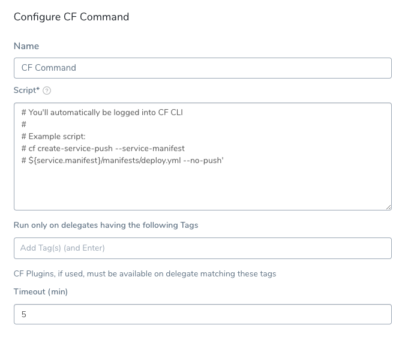
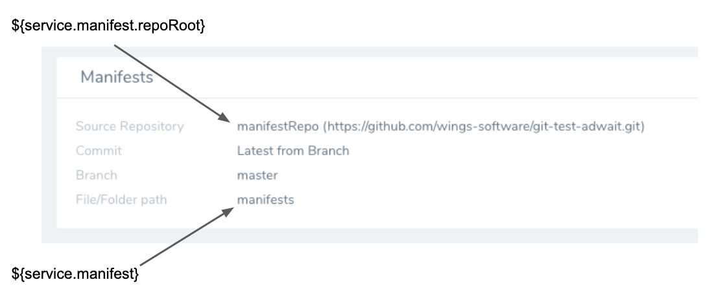
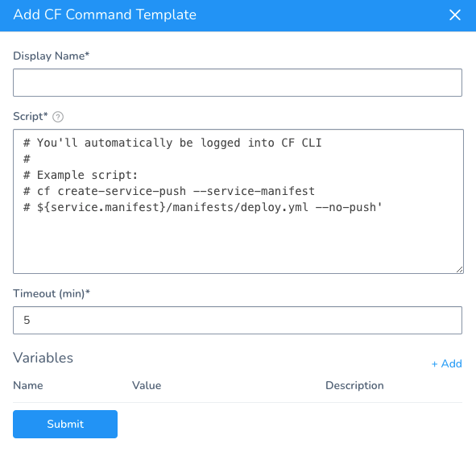
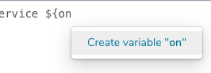
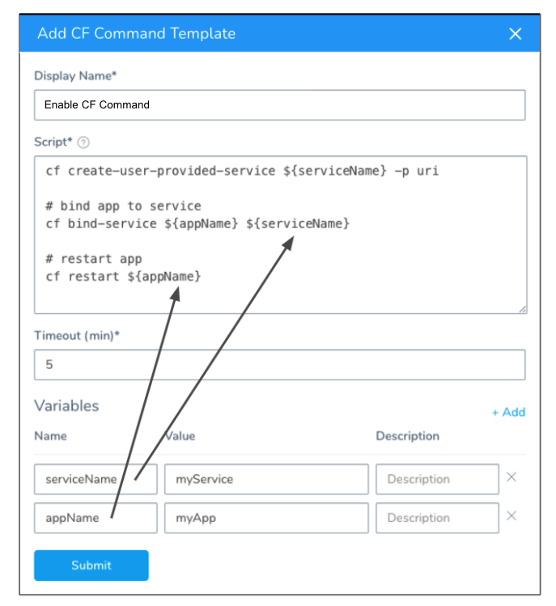
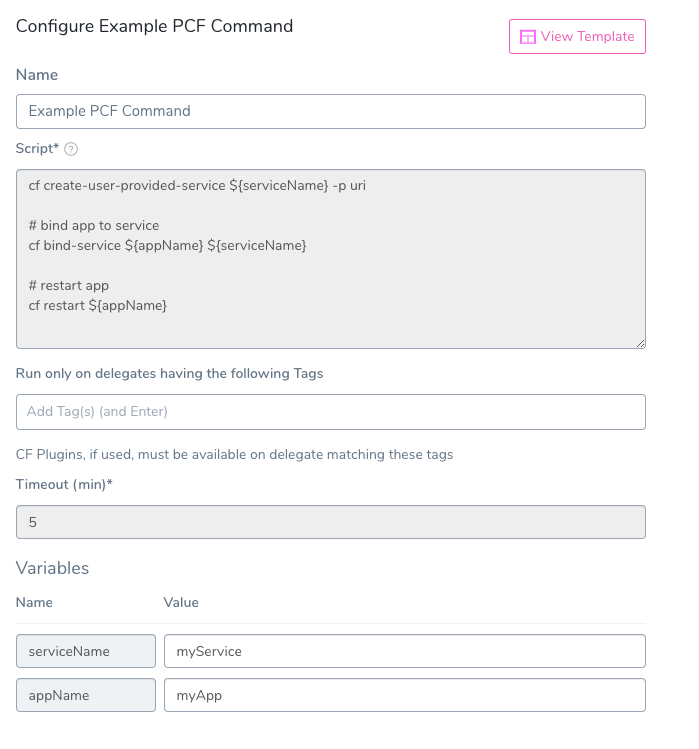
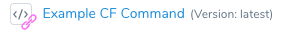

Harness supports Cloud Foundry CLI version 6 and 7. Support for version 7 is behind the Feature Flag `CF_CLI7`. You can read about it in [Add Container Images for Tanzu Deployments](add-container-images-for-pcf-deployments.md).You can use the CF Command to run any [CF CLI command](https://docs.cloudfoundry.org/cf-cli/cf-help.html) or script at any point in your Harness Tanzu (formerly PCF) Workflows.

### Before You Begin

* See [Connect to Your Target Tanzu Account](connect-to-your-target-pcf-account.md).
* See [Define Your Tanzu Target Infrastructure](define-your-pcf-target-infrastructure.md).

### Step: Run the CF CLI Command

Ensure that the Harness Delegate(s) used for your deployment have the correct version of the CF CLI installed. See [Install Cloud Foundry CLI Versions on the Harness Delegate](install-cloud-foundry-cli-6-and-7-on-harness-delegates.md).Here's an overview of the Configure CF Command settings.



You can also use the CF Command to create the service for the [App Autoscaler plugin](https://docs.pivotal.io/application-service/2-7/appsman-services/autoscaler/using-autoscaler-cli.html), as described in [Use CLI Plugins in Harness Tanzu Deployments](use-cli-plugins-in-harness-pcf-deployments.md). The CF Command script does not require `cf login`. Harness performs logins using the credentials in the TAS Cloud Provider set up in the Infrastructure Definition for the Workflow executing the CF Command.

The CF Command has the settings described below.

### Option: Scripts and Variables

You can enter any CF CLI commands and scripts, but be sure to add the CF Command to a point in your Workflow where the targets of the script are available. If you add CF Command before the App Setup step, the new app is not available.

There are two built-in Harness TAS variables you can use to reference the manifest and vars files used by the script:

* If you are using inline Manifest files, the variable `${service.manifest}` refers to the folder containing your manifest files.

[](./static/run-cf-cli-commands-and-scripts-in-a-workflow-35.png)

* If you are using remote Manifest files via a Git repo, `${service.manifest}` refers to the folder containing your manifest files and `${service.manifest.repoRoot}` refers to the root folder of the repo.

[](./static/run-cf-cli-commands-and-scripts-in-a-workflow-37.png)

You can use the variables together to point to different locations. For example, here the manifest.yml file is one folder and the vars.yml is located using a path from the repo root folder:


```
cf create-service-push --service-manifest ${service.manifest}/manifest.yml --no-push --vars-file ${service.manifest.repoRoot}/QA/vars.yml  
cf plugins | grep autoscaling-apps
```
These variables appear when you type `${service` in **Script**:


Environment Service Overrides, such as [Tanzu Manifest Overrides](override-pcf-manifests-and-config-variables-and-files.md), do not apply to or override the `${service.manifest}` variable. The `${service.manifest}` variable only looks in the Harness Service.You can also use variables in your script to templatize paths to manifest files. For example, if your Workflow Environment were templatized (see  [Template a Workflow](https://docs.harness.io/article/m220i1tnia-workflow-configuration#template_a_workflow)), you can use the Environment variable `${env.name}` in your path, like this:

`${service.manifest.repoRoot}/${env.name}/vars.yml`

When the Workflow is deployed, the user will have to provide a name for the Environment to use. The same name will be substituted for `${env.name}` in the path in your script.

This substitution can be useful if you have folder names in your remote Git repo that match Harness Environment names, such as QA and PROD. The same Workflow and CF Command can be used for both Environments and use manifest files in separate repo folders.

Harness checks out manifest files from your repo at deployment runtime. If any files in the repository contain non UTF-8 characters (binary, zip, etc), the checkout fails. For example, sometimes an operating system file such as .DS\_Store files get added to a repo.

### Option: Delegate Selectors

Ensure that the Harness Delegate(s) used for your deployment have the correct version of the CF CLI installed. See [Install Cloud Foundry CLI Versions on the Harness Delegate](install-cloud-foundry-cli-6-and-7-on-harness-delegates.md).In order for the commands in your script to execute, the Harness Delegate(s) running the script must have the CF CLI and any related CF plugins installed.

Unless all of your Harness Delegates have the CF CLI and CF plugins installed, you can refer to the specific Delegates using [Delegate Selectors](https://docs.harness.io/article/h9tkwmkrm7-delegate-installation#delegate_selectors).

In **Run only on delegates having the following selectors**, add the Delegate Selector(s) for the Delegates with the CF CLI and CF plugins installed.

If you do not add any Delegates Selectors to the CF Command, when the CF Command runs, Harness will only use Delegates that have the CF CLI installed.

However, if you are running plugins in CF Command, Harness cannot know which Delegates have the plugins installed.

This is why the **Run only on delegates having the following selectors** setting ensures that CF Command only executes on Delegates that can run the plugins mentioned in the CF Command script.

### Option: Timeout

Set the timeout period for your CF Command. If the command execution hangs beyond the timeout, Harness will fail the step.

### Option: Create and Add CF Command Templates

You can also create CF Command templates in your Application or Account templates. Other users can then use these templates to quickly add the CF Commands to their Workflows.

Here are the steps for creating and adding a CF Command template:

1. Decide on whether you want to use Application or Account templates.  
  
  Application templates can be used by any Workflow in the Application, and Account templates can be used by any Workflow in any Application. For an overview of template, see [Use Templates](../concepts-cd/deployment-types/use-templates.md).  
  For this example, we will create an Application template.

2. In your Application, in **Application Resources**, click **Template Library**.
3. Click **Add Template**, and then click **CF Command**. The CF Command settings appear:
4. Configure the template the same way you would configure the CF Command in a Workflow.
5. In **Variables**, enter the variable names and default values you want to use in the template. When a user adds or links this template to a Workflow, the user will provide the values for the variables.  

  You can also type the variables in the **Script** field and Harness will prompt you to create them:
  
  

  Here's an example showing variables used in the command script:
  
  
  
6. When you are done, click **Submit**.
7. Navigate to a Workflow for a TAS Service.
8. In the **Setup** section on the Workflow steps, click **Add Command**.
9. Select **Application Templates** to select from the command from the Application Template Library.
10. Locate your command and click **Link** or **Copy**. A copied template does not provide version control like a linked template. In this example, we'll click **Link**.  
The CF Command template settings appear.
11. Recommended: Add a Delegate Selector in **Run only on delegates having the following selectors**, as described in [Delegate Selectors](#delegate_selectors).
12. Provide values for the variables, if any.
13. Click **Submit**.

The CF Command template is added to your Workflow.



If you open the template, you can edit the **Run only on delegates having the following selectors** and **Variables** settings.

### Next Steps

* [Use CLI Plugins in Harness Tanzu Deployments](use-cli-plugins-in-harness-pcf-deployments.md)

