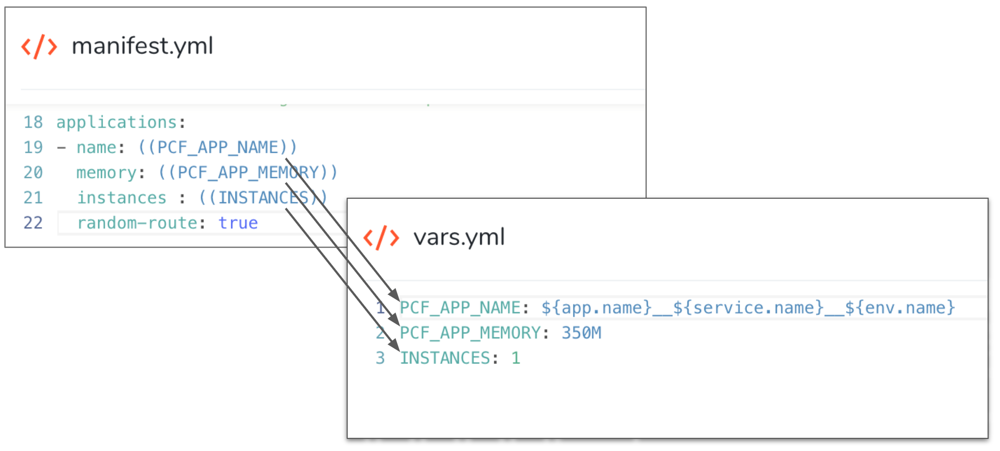
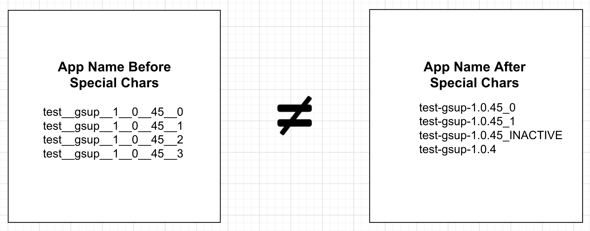

TAS app naming and versioning has a number of options. This topic covers these options and provides examples.


### Default App Naming


By default, the TAS apps deployed by Harness are named using a concatenation of the names of the Harness Application, Service, and Environment, separated by two underscores.


For example, if you have the following names your TAS app is named `MyApp__MyServ__MyEnv`:


* Application: `MyApp`
* Service: `MyServ`
* Environment: `MyEnv`


When you create a TAS Service in Harness, a default vars.yml file is created with the app name following the default naming convention, and the default manifest.yml file uses the name.



You can change the `APP_NAME` in vars.yml and specific a new name for you app and Harness will use that for all deployments. For example:


```
APP_NAME: Order__App
```

#### Default Versioning


By default, Harness appends a numeric suffix to the end of every app release, and increments the number with each subsequent release.


For example, let's say your app name is Order\_\_App. Here's how the first two deployments are named:


1. First deployment: **Order\_\_App\_\_1**.
2. Second deployment: **Order\_\_App\_\_2**.


The previous app version keeps its name: **Order\_\_App\_\_1**.


### App Naming with Version Management


Currently, this feature is behind the Feature Flag `CF_APP_NON_VERSIONING_INACTIVE_ROLLBACK`. Contact [Harness Support](mailto:support@harness.io) to enable the feature.
In a Harness Workflow using a Harness TAS Service, there is an **App Setup** step that uses the manifest.yml in your Harness TAS Service to set up your app.


In App Setup, there is a **Version Management** section that allows you to select how you want your deployed apps versioned. There are two options:


##### Incremental Versioning


The app name is given an incremental suffix with each deployment.


For example, the first time you deploy the app **Order\_\_App** it is **Order\_\_App\_\_0**. The next time this app is deployed the suffix will increase to **\_\_1**.


##### App Name with Version History


When you deploy an app it maintains its name without adding any suffix to the name to indicate its release version. A suffix is added to the previous version of the app.


The first time you deploy the app, Harness creates the app with the name you entered in **App Setup**.


When deploying new versions of that app, Harness uses the same name for the app and renames the previous version of the app with suffix `_INACTIVE`.


For example, if the app is named **Order\_\_App**, the first deployment will use the name **Order\_\_App**. When the next version of the app is deployed, the new version is named **Order\_\_App** and the previous version is now named **Order\_\_App\_\_INACTIVE**.


During rollback, the new app version is deleted and the previous app is renamed without the suffix.


##### Blue Green Deployments and Naming


App naming in Blue Green deployments follows the same patterns as the other deployment strategies, but it is useful to review the Blue Green scenario as it involves multiple stages.


Blue Green deployments involve staging a new app version in a stage environment and then swapping the stage and production routes between the stage and production environments.


When a new app is deployed, the following occurs:


1. During staging by the App Setup step, the new app is given the suffix `__INACTIVE`.
	1. If a failure occurs, the new app version is simply deleted and the current production app is untouched.
2. During the Swap Route step, as the routes are swapped and the new app becomes the production app, the new app name's suffix is changed in one of the following ways:
	1. Default versioning, as explained above in [Default App Naming](#default_app_naming).
	2. Or, if **Version Management** is enabled, the suffix is changed to according to whether you are using **Incremental Versioning** or **App Name with Version History**.
3. The previous app version is then renamed with the suffix `__INACTIVE`.
	1. If there is a failure, the new app version is deleted and the current production app has the `__INACTIVE` suffix removed and its previous name is restored.


### App Naming with Special Characters Support


Currently, this feature is behind the Feature Flag `CF_ALLOW_SPECIAL_CHARACTERS`. Contact [Harness Support](mailto:support@harness.io) to enable the feature.
By default, a TAS app name must consist of alphanumeric characters. Harness supports special characters in TAS app naming.


By default, if your app named is **Order-App** Harness would convert the dash to underscores (**Order\_\_App**), but with special characters support enabled the dash is preserved (**Order-App**).


App name versioning follows the default Harness TAS app naming.


For example, if the app using special characters is named **Order-App**, the first deployment of the app is named **Order-App\_\_1**.


#### Version Management with Special Characters Support


If both the Version Management (described above) and Special Characters features are enabled, the first app version is Order-App. The second app version is **Order-App**, also, and the first app version is renamed **Order-App\_\_INACTIVE**.


#### App Naming Changes after enabling Special Characters Support


After enabling the Special Characters feature, the next deployment will be considered the first deployment and the app name will start with a new family name.


For example, if your app name was **test-gsup-1.0.45**, and you had deployed it 3 times, then all the apps will belong to this family naming


1. test\_\_gsup\_\_1\_\_0\_\_45
2. test\_\_gsup\_\_1\_\_0\_\_45\_\_1
3. test\_\_gsup\_\_1\_\_0\_\_45\_\_2
4. test\_\_gsup\_\_1\_\_0\_\_45\_\_3


After you enable the Special Characters feature and use a special character like a dash, the apps created in the next deployment will belong to a new family name: **test-gsup-1.0.45**.


Consequently, there will be no link between previous deployments and this new deployment. The new deployment is now considered as the first deployment.


This illustration provides examples of before and after enabling the Special Characters feature:




If something goes wrong after enabling the Special Characters feature, rollback will not work because the app family names have changed. Even Blue Green will not work as the previous app will belong to different family.


Similarly, if you attempt a [Post-Prod Rollback](https://docs.harness.io/article/2f36rsbrve-post-deployment-rollback) after a successful deployment, it will not work.


Just remember that after enabling the Special Characters feature the next deployment is considered as a new first deployment. 


If user now disable the FF - CF\_ALLOW\_SPECIAL\_CHARACTERS, then we will move back to the previous family - [test\_\_gsup\_\_1\_\_0\_\_45]

