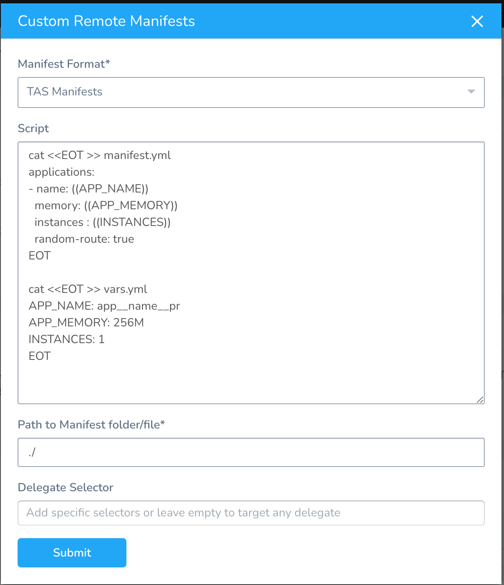

Currently, this feature is behind the Feature Flag `CUSTOM_MANIFEST`. Contact [Harness Support](mailto:support@harness.io) to enable the feature. You can use manifests in a packaged archive with the **Custom Remote Manifests** setting in a Harness Tanzu Service. You add a script to the Service that pulls the package and extracts its contents. Next, you supply the path to the manifest, template, etc.

A Harness TAS Service and Environment are used together when you set up a Harness Workflow to deploy your TAS app. You can configure your Environment to override the manifest path of the Harness TAS Services that deploy to the Environment.

This topic describes how to pull packaged archives, reference their manifest, and override the references at the Environment level.


### Before You Begin

* [Tanzu Application Service (TAS) Quickstart](https://docs.harness.io/article/hy819vmsux-pivotal-cloud-foundry-quickstart)
* [Create a Basic Tanzu Deployment](create-a-basic-pcf-deployment.md)
* [Connect to Your Target Tanzu Account](connect-to-your-target-pcf-account.md).
* [Override Tanzu Manifests and Config Variables and Files](override-pcf-manifests-and-config-variables-and-files.md).

### Supported Platforms and Technologies

See [Supported Platforms and Technologies](https://docs.harness.io/article/220d0ojx5y-supported-platforms).

### Option: Application Manifest API Developed in Custom Manifest

Use Application Manifest API developed in Custom Manifest to use store type: `CUSTOM`. Define a fetching script for packaged manifest and the path to the manifest directory or template along with Delegate Selectors.

### Step 1: Create a Harness Tanzu Service

In your Harness Application, create your TAS Service, as described in [Add Container Images for Tanzu Deployments](add-container-images-for-pcf-deployments.md).

### Step 2: Use Custom Remote Manifests

In your Harness Tanzu Service, in **Manifests**, click more options (︙) and select **Custom Remote Manifests**.

In **Manifest Format**, select **TAS Manifests**.

Now you can add your script to pull the package containing your manifest.

### Step 3: Add Script for Remote Package

In **Script**, enter the script that pulls the package containing your manifest and extracts the manifest from the package. For example:


```
curl -sSf -u "${secrets.getValue("username")}:${secrets.getValue("password")}" -O 'https://mycompany.jfrog.io/module/example/manifest.zip'  
  
unzip manifest.zip
```
You can use Harness Service, Workflow, secrets, and built-in variables in the script.

The script is run on the Harness Delegate selected for deployment.

Harness creates a temporary working directory on the Delegate host for the downloaded package. You can reference the working directory in your script with `WORKING_DIRECTORY=$(pwd)` or `cd $(pwd)/some/other/directory`.

Once you have deployed the Workflow, you can check which Delegate was selected in the **Delegates Evaluated** setting for the Workflow step that used the manifest.

### Step 4: Add Path to Manifests

Once you have a script that extracts your package, you provide Harness with the path to the manifest in the expanded folders and files.

You can use Harness Service, Workflow, and built-in variables in the path.

### Step 5: Add Delegate Selector

In **Delegate Selector**, select the Selector for the Delegate(s) you want to use. You add Selectors to Delegates to make sure that they're used to execute the command. For more information, see [Select Delegates with Selectors](https://docs.harness.io/article/c3fvixpgsl-select-delegates-for-specific-tasks-with-selectors).

Harness will use Delegates matching the Selectors you add.

If you use one Selector, Harness will use any Delegate that has that Selector.

If you select two Selectors, a Delegate must have both Selectors to be selected. That Delegate might also have other Selectors, but it must have the two you selected.

You can use expressions for Harness built-in variables or Account Default variables in **Delegate Selectors**. When the variable expression is resolved at deployment runtime, it must match an existing Delegate Selector.For example, if you have a Delegate Selector **prod** and the Workflow is using an Environment also named **prod**, the Delegate Selector can be `${env.name}`. This is very useful when you match Delegate Selectors to Application component names such as Environments, Services, etc. It's also a way to template the Delegate Selector setting.

### Option: Override Manifests in Environment

You can override Harness Service settings at the Harness Environment level using Service Configuration Overrides. See [PCF Manifest Override.](override-pcf-manifests-and-config-variables-and-files.md#option-2-pcf-manifests-override)

Here's an example overriding Service file locations with new file locations:

From the **Environment**, go to the **Service Configuration Overrides** section, and click **Add Configuration Overrides**. The **Service Configuration Override** settings appear.

In **Service**, select the Tanzu Application Services.

In  **Override Type** options, select TAS manifests.

In **Store Type options,** select Custom.

Custom Manifest Override Configuration gives two options: Inherited script from Service or Define a new script.

Once you have a script that extracts your package, you provide Harness with the path to the manifest in the expanded folders and files.

Once you have a script that extracts your package, you provide Harness with the path to the manifest in the expanded folders and files. Here's an example:

Click **Submit**.

### Option: Use a Harness Artifact Source

Although the **Custom Remote Manifests** option is designed for when the manifest and deployment artifact are in the same package, you can use them separately with **Custom Remote Manifests.**

You must reference the Harness Artifact Source using the [Harness built-in variables](pcf-built-in-variables.md).

### Option: Use Local Script

You can also use a local script to create your manifest in **Custom Remote Manifests**.

You can use Harness Service, Workflow, secrets, and built-in variables in the script using the [Harness built-in variables](pcf-built-in-variables.md).

Here's the script used:

```
Example Scriptcat <<EOT >> vars.yml  
APP\_NAME: my\_app  
APP\_MEMORY: 750M  
INSTANCES: 1  
EOT  
  
  
cat <<EOT >> manifest.yml  
applications:  
- name: ((APP\_NAME))  
 memory: ((APP\_MEMORY))  
 instances : ((INSTANCES))  
 random-route: true  
EOT
```

### Notes

* If the artifact you are deploying with your manifest is public (DockerHub) and does not require credentials, you can use the standard public image reference, such as `image: harness/todolist-sample:11`.

### See Also

* [Preprocess Tanzu Artifacts to Match Supported Types](preprocess-artifacts-to-match-supported-types.md)
* [Tanzu Built-in Variables](pcf-built-in-variables.md)

