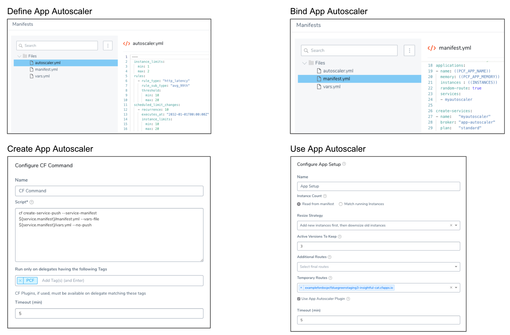
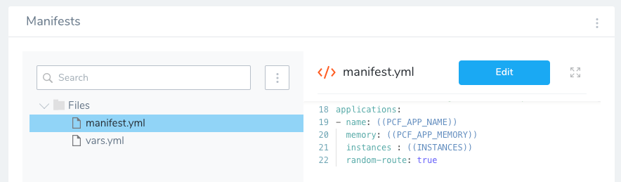
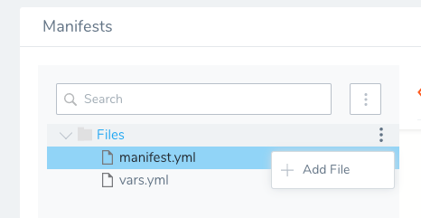
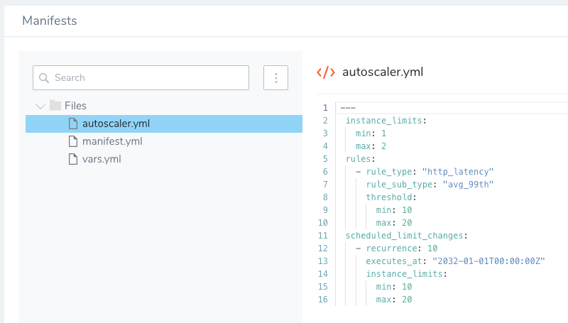

Harness supports Cloud Foundry CLI version 6 and 7. Support for version 7 is behind a Feature Flag. You can read about it in [Add Container Images for Tanzu Deployments](add-container-images-for-pcf-deployments.md).Harness supports [App Autoscaler Plugin release 2.0.233](https://network.pivotal.io/products/pcf-app-autoscaler#/releases/491414).The [App Autoscaler plugin](https://docs.pivotal.io/application-service/2-7/appsman-services/autoscaler/using-autoscaler-cli.html) has first-class support in Harness, enabling you to ensure app performance and control the cost of running apps.


### Before You Begin

* See [Connect to Your Target Tanzu Account](connect-to-your-target-pcf-account.md).
* See [Define Your Tanzu Target Infrastructure](define-your-pcf-target-infrastructure.md).

### Visual Summary

The following diagram illustrates how you can define, bind, create, and use App Autoscaler with the TAS apps deployed by Harness.



### Review: Requirements for App Autoscaler

Ensure that the Harness Delegate(s) used for your deployment have the correct version of the CF CLI installed. See [Install Cloud Foundry CLI Versions on the Harness Delegate](install-cloud-foundry-cli-6-and-7-on-harness-delegates.md).If you are using the App Autoscaler plugin, then autoscaling is applied after the final phase of deployment.

Once all phases are completed and the number of old version instances has reached the desired number, then the final number of instances will be as configured as defined by the Autoscaler.

For example, if a deployment results in 4 new instances, but Autoscaler is set to min 8 and max 10, Harness will set the desired number of instances to the minimum value. So the total number of new instances is 8.

To use App Autoscaler, you must have the following requirements:

The App Autoscaler plugin must be installed on the Delegate(s) that will execute TAS deployments. The steps in this section assume that the App Autoscaler plugin is installed on your Delegates.

Because of limitations in the CF CLI, the best way to install the App Autoscaler plugin on the Delegate is the following:

1. Download the release from the [Pivotal App Autoscaler CLI Plugin](https://network.pivotal.io/products/pcf-app-autoscaler) page.
2. Store the release in a repo in your network that can be accessed by the Harness Delegate. This will allow you to use cURL to copy the release to the Delegate host(s).
3. Install the App Autoscaler plugin on your Delegates using a Delegate Profile.  
This profile will run each time the Delegate is restarted and the CF CLI cannot reinstall the plugin simply, so you must uninstall the plugin and then reinstall it in your Delegate Profile:


```
cf uninstall-plugin "App Autoscaler"  
curl /path/to/release-in-repo  
cf install-plugin local-path/binary
```
Click **View Logs** on the Delegate Profile to see the successful installation.

You can also choose to install the plugin manually on each Delegate using the steps provided by Pivotal, in [Using the App Autoscaler CLI](https://docs.pivotal.io/application-service/2-7/appsman-services/autoscaler/using-autoscaler-cli.html#:~:text=The%20App%20Autoscaler%20automatically%20scales,line%20interface%20(cf%20CLI).).

### Step 1: Define the App Autoscaler Service in Your Manifest File

1. In your Harness TAS Service, select your manifest.yml file and click **Edit**.
2. Add a `create-services` block that describes the App Autoscaler service you want to create:  
    
        create-services:  
        - name:   "myautoscaler"  
          broker: "app-autoscaler"  
          plan:   "standard" 
          ...    

  
Now that the App Autoscaler service is defined in your manifest.yml, you can bind it to the app.

### Step 2: Bind the App Autoscaler Service to Your App

1. In `applications`, add a `services` block with the name of the App Autoscaler service:

      ```
      ...  
        services:  
        - myautoscaler  
        
      create-services:  
      - name:   "myautoscaler"  
        broker: "app-autoscaler"  
        plan:   "standard"  
      ...
      ```
    For more information on services, see the [Pivotal documentation](https://docs.cloudfoundry.org/devguide/deploy-apps/manifest-attributes.html#services-block).

    Now that the App Autoscaler service is defined and bound to your app, you can add an App Autoscaler manifest file that configures the settings for the service.

2. Click **Save** to save your manifest.yml file.

### Step 3: Add Your App Autoscaler Manifest File

App Autoscaler manifest files are described in [Configure with a Manifest](https://docs.pivotal.io/application-service/2-7/appsman-services/autoscaler/using-autoscaler-cli.html#configure-autoscaling) from Pivotal.

1. In your Harness Service, click the options button on **Files**, and then click **Add File**.
2. In **Add File**, enter the name of the App Autoscaler manifest file, such as **autoscaler.yml**. The file is added to the **Manifests** section.  
You can use any name for the App Autoscaler manifest file. Harness will determine which file to use for the service.
3. Select the App Autoscaler manifest file and click **Edit**.
4. Configure your rules, add instance limits, and set scheduled limit changes for the service. Here is an example:  

  ```
   ---  
    instance_limits:  
      min: 1  
      max: 2  
    rules:  
      - rule_type: "http_latency"  
        rule_sub_type: "avg_99th"  
        threshold:  
          min: 10  
          max: 20  
    scheduled_limit_changes:  
      - recurrence: 10  
        executes_at: "2032-01-01T00:00:00Z"  
        instance_limits:  
          min: 10  
          max: 20
  ```
5. Click **Save**. The App Autoscaler manifest file is complete.

### Step 4: Create the App Autoscaler Service Using CF Command

Ensure that the Harness Delegate(s) used for your deployment have the correct version of the CF CLI installed. See [Install Cloud Foundry CLI Versions on the Harness Delegate](install-cloud-foundry-cli-6-and-7-on-harness-delegates.md).To create the App Autoscaler Service, you add a CF Command to your Workflow that uses the [Create-Service-Push](https://plugins.cloudfoundry.org/#Create-Service-Push) plugin.

If the App Autoscaler service is already created and running in your target space, you can skip this step. When Harness deploys the app that is already bound to the App Autoscaler service, it will use the existing App Autoscaler service.

If the App Autoscaler service is already running, you do not need to remove the CF Command from your Workflow. Harness will check to see if the App Autoscaler service exists before creating it.

To create the App Autoscaler service using CF Command, do the following:

1. Open the Harness Workflow that will deploy the Harness Service containing manifests for the app and its bound App Autoscaler service.
2. In your Workflow, click **Add Command** anywhere before the **App Setup** command. Typically, this will be in **Setup**.
3. In **Add Command**, click **CF Command**. **CF Command** appears.
4. In **Script**, enter the following command:  
  

```
cf create-service-push --service-manifest ${service.manifest}/manifest.yml  --vars-file ${service.manifest}/vars.yml --no-push
```
In this example, the app manifest file is named manifest.yml. You can replace manifest.yml with the name of your app manifest. You do not need to specify the name of the App Autoscaler manifest.  
  
For inline manifest files, you can use the `${service.manifest}` variable. For remote manifest files stored in Git, you can use both the `${service.manifest}` and `${service.manifest.repoRoot}` variables. For more information, see [Scripts](run-cf-cli-commands-and-scripts-in-a-workflow.md#option-scripts-and-variables).  
  
The `--no-push` parameter creates the services but does not push the app. The app will be pushed by the **App Setup** command. If you omit `--no-push` then App Setup will create a new revision of the app. For this reason, it is a best practice is always include `--no-push`.
5. Ensure that you enter the Delegate Selectors for the Delegates that have the CF CLI and Create-Service-Push plugin installed. For more information, see [Delegate Selectors](use-cli-plugins-in-harness-pcf-deployments.md#step-3-delegate-selectors).
6. Click **Submit**. The CF Command is added.

### Step 5: Enable App Autoscaler in the App Setup Step

The **App Setup** command in a Workflow includes a **Use App Autoscaler Plugin** setting so you can enable and disable autoscaling as needed.


Select **Use App Autoscalar Plugin** to enable the App Autoscaler service bound to your app.

When you deploy your Workflow, the App Autoscalar service is created using the command `create-service app-autoscaler standard myautoscaler`:


```
# ------------------------------------------   
  
# CF_HOME value: /Users/johndoe/pcf/harness-delegate/repository/pcfartifacts/RR4DmcgKSzylo4enFUK5gw  
# CF_PLUGIN_HOME value: /Users/johndoe  
# Performing "login"  
API endpoint: api.run.pivotal.io  
  
Authenticating...  
OK  
  
Targeted org Harness  
  
Targeted space AD00001863  
  
API endpoint:   https://api.run.pivotal.io (API version: 3.77.0)  
User:           john.doe@harness.io  
Org:            Harness  
Space:          AD00001863  
# Login Successful  
# Executing pcf plugin script :  
Found Service Manifest File: /Users/johndoe/pcf/harness-delegate/repository/pcfartifacts/RR4DmcgKSzylo4enFUK5gw/manifests/deploy.yml  
myautoscaler - will now be created as a brokered service.  
Now Running CLI Command: create-service app-autoscaler standard myautoscaler  
Creating service instance myautoscaler in org Harness / space AD00001863 as adwait.bhandare@harness.io...  
OK  
|  
--no-push applied: Your application will not be pushed to CF ...  
# Exit value =0  
  
 ----------  PCF Run Plugin Command completed successfully
```
### Option: Use an Existing App Autoscaler Service

You might already have the App Autoscaler service running in your target space, and so some of the steps described earlier can be skipped.

If you already have the App Autoscaler service running in your target Pivotal space, then you can simply bind the service in the app manifest file using the `services` parameter and enable the **Use App Autoscalar Plugin** in **App Setup**. You do not need to set up the following:

* You do not need `create-services` in the manifest.yml file for your app.
* You do not need a manifest file for the App Autoscaler service.
* You do not need to use the CF Command and `cf create-service-push` to create the App Autoscaler service.

Including any of these unnecessary components will not cause a problem. Harness automatically checks for an existing App Autoscaler service before creating a new service.

