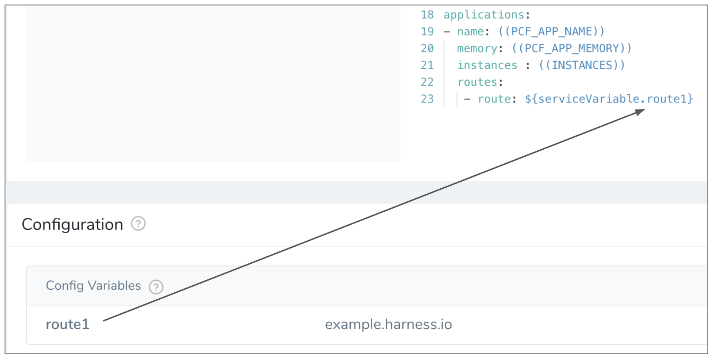
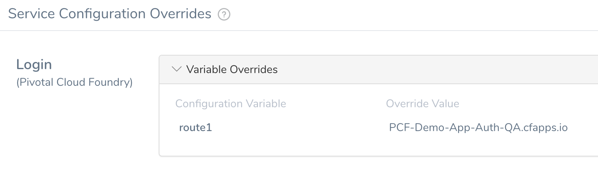

Service Configuration variables and files enable you to specify information in the Harness Service that can be referenced in other parts of the Harness Application. In this topic we'll cover using these Service Configuration variables and files for Tanzu Application Service (TAS, formerly PCF).

### Before You Begin

* See [Connect to Your Target Tanzu Account](connect-to-your-target-pcf-account.md).
* See [Add Container Images for Tanzu Deployments](add-container-images-for-pcf-deployments.md).
* See [Adding and Editing Inline Tanzu Manifest Files](adding-and-editing-inline-pcf-manifest-files.md).
* See [Define Your Tanzu Target Infrastructure](define-your-pcf-target-infrastructure.md).

### Review: Configuration Variables and Files

For example, you can specify a variable in the Service once, and then use it in multiple Workflows without having to manage multiple values.

* **Config Variables** - You can create Service variables to use in your Manifests files, and in Environments and Workflows. Any Service variables are added as environment variables when the app is created in the Pivotal environment (**cf push**). Later, when you want to reference a Service variable, you use the syntax `${serviceVariable.var_name}`.
* **Config Files** - You can upload config files with variables to be used when deploying the Service. Later, when you want to reference a Service config file, you use the syntax `${configFile.getAsString("fileName")}` for unencrypted text files and `${configFile.getAsBase64("fileName")}` for encrypted text files.

For details on configuration variables and files, see [Add Service Config Variables](https://docs.harness.io/article/q78p7rpx9u-add-service-level-config-variables) and [Add Service Config Files](https://docs.harness.io/article/iwtoq9lrky-add-service-level-configuration-files).

### Step: Using Config Variables in Manifests

You can use **Config Variables** in your Service in place of values in manifest.yml and vars.yml.

You can then overwrite this variable in a Harness Environment's **Service Configuration Overrides**, and the new value is used when the Service and Environment are used for deployment.

Overwriting Service variables is described in more detail in TAS Environments.

### Next Steps

* [Define Your Tanzu Target Infrastructure](define-your-pcf-target-infrastructure.md)
* [Override Tanzu Manifests and Config Variables and Files](override-pcf-manifests-and-config-variables-and-files.md)

