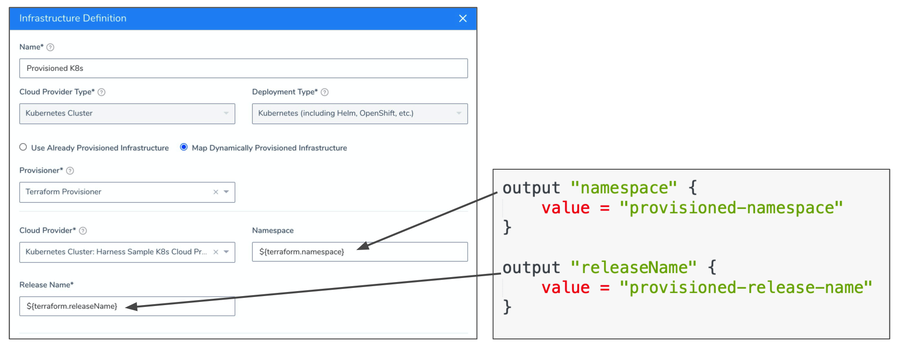
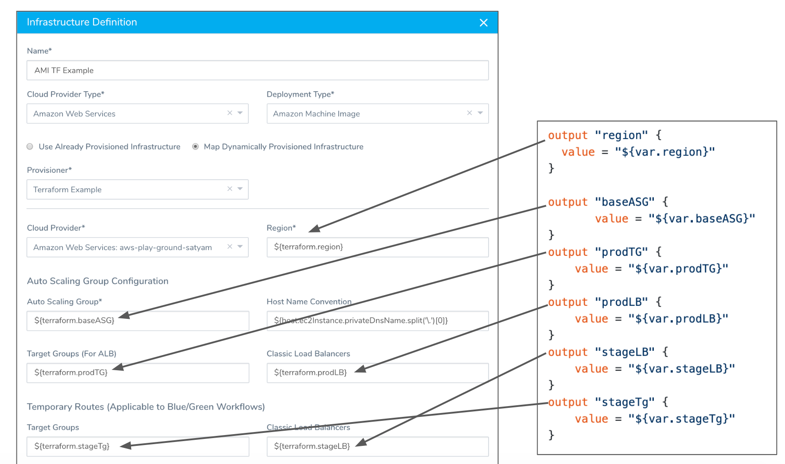
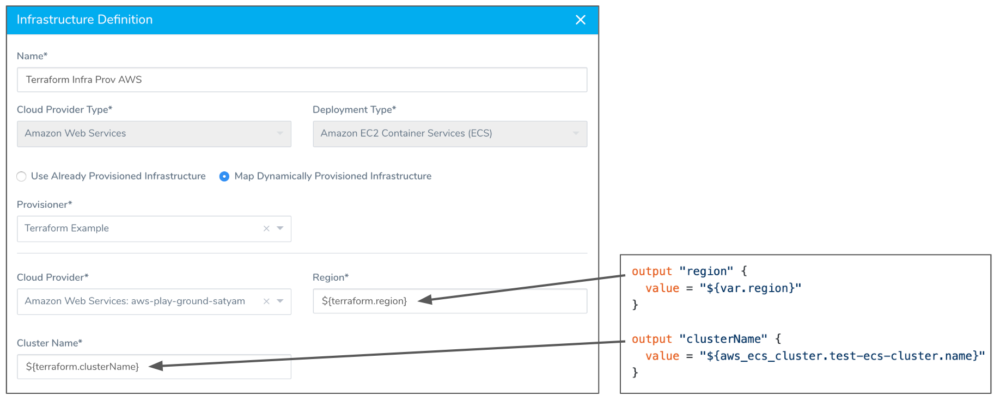
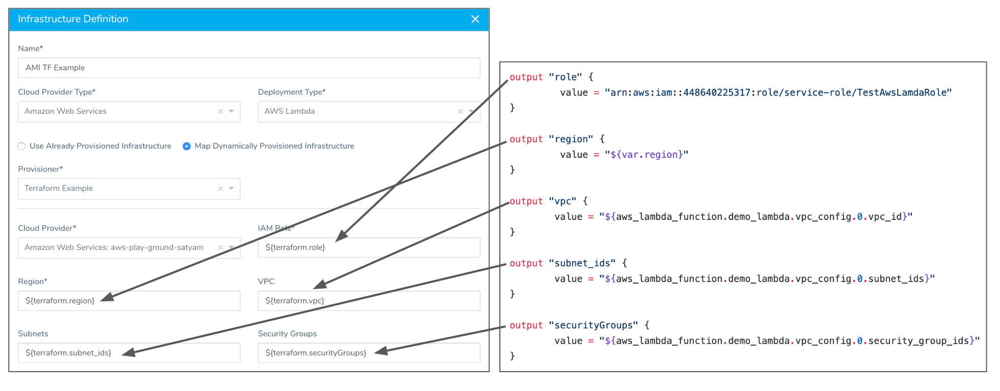
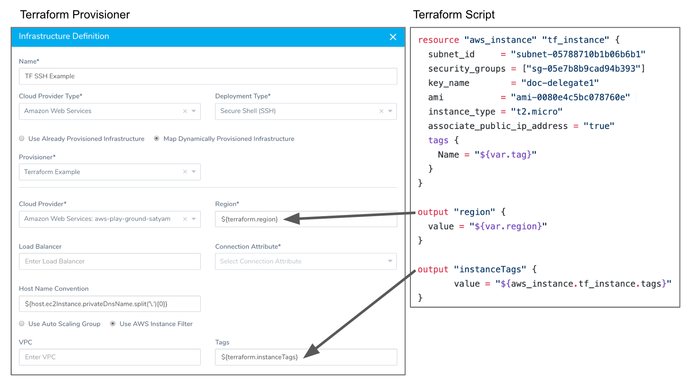
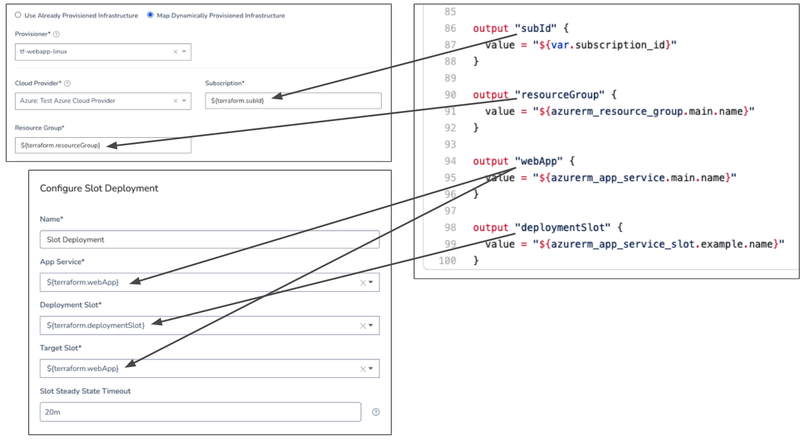

This topic describes how to use a Harness Terraform Infrastructure Provisioner to create a Harness Infrastructure Definition. When you select the **Map Dynamically Provisioned Infrastructure** option in an Infrastructure Definition, you select an Infrastructure Provisioner and then map its outputs to required settings.


Once you are done, you add the Infrastructure Definition to a Workflow as its deployment target. Finally, you add a Terraform Provisioner step to that Workflow to provision the infrastructure.

When the Workflow runs, it provisions the infrastructure using the Terraform Provisioner step and then deploys to the provisioned infrastructure using the Infrastructure Definition.

This topic describes how to map Terraform script outputs for all of the supported platforms.


### Before You Begin

* Get an overview how how Harness supports Terraform — [Terraform Provisioning with Harness](../concepts-cd/deployment-types/terraform-provisioning-with-harness.md).
* Ensure you have your Harness account settings prepared for Terraform — [Set Up Your Harness Account for Terraform](terraform-delegates.md).
* Create a Harness Terraform Infrastructure Provisioner — [Add Terraform Scripts](add-terraform-scripts.md).

### Visual Summary

This topic describes step 2 in the Harness Terraform Provisioning implementation process:


Once you have completed this topic, you can move onto steps 3 through 6 in [Provision using the Terraform Provisioner Step](terraform-provisioner-step.md).

### Limitations

Harness Terraform Infrastructure Provisioner are only supported in Canary and Multi-Service Workflows. For AMI/ASG and ECS deployments, Terraform Infrastructure Provisioners are also supported in Blue/Green Workflows.

### Step: Add the Infrastructure Definition

As noted above, ensure you have done [Set Up Your Harness Account for Terraform](terraform-delegates.md) and [Add Terraform Scripts](add-terraform-scripts.md) before using the Terraform Infrastructure Provisioner to create the Infrastructure Definition.

To use a Terraform Infrastructure Provisioner to create an Infrastructure Definition, do the following:

1. In the same Harness Application where you created the Terraform Infrastructure Provisioner, in an existing Environment, click **Infrastructure Definition**. The **Infrastructure Definition** dialog appears.
2. In **Name**, enter the name for the Infrastructure Definition. You will use this name to select the Infrastructure Definition when you set up Workflows and Workflow Phases.
3. In **Cloud Provider Type**, select the type of Cloud Provider to use to connect to the target platform, such as Amazon Web Services, Kubernetes Cluster, etc.
4. In **Deployment Type**, select the same type of deployment as the Services you plan to deploy to this infrastructure.  
It is Deployment Type that determines which Services can be scoped in **Scope to specific Services** and in Workflow and Phase setup.
5. Click **Map Dynamically Provisioned Infrastructure**.
6. In **Provisioner**, select your Terraform Infrastructure Provisioner.
7. In the remaining settings, map the required fields to your Terraform script outputs. The required fields are described in the option sections below.

You map the Terraform script outputs using this syntax, where `exact_name` is the name of the output:


```
${terraform.*exact\_name*}
```
When you map a Terraform script output to a Harness Infrastructure Definition setting, the variable for the output, `${terraform.exact_name​}`, can be used anywhere in the Workflow that uses that Terraform Provisioner.

### Option 1: Map an Agnostic Kubernetes Cluster

Provisioning Kubernetes is supported with the Kubernetes Cluster Cloud Provider and Google Cloud Platform Cloud Provider, but not the Azure Cloud Provider.Harness supports platform-agnostic Kubernetes cluster connections using its [Kubernetes Cluster Cloud Provider](https://docs.harness.io/article/l68rujg6mp-add-kubernetes-cluster-cloud-provider).

When you set up an Infrastructure Definition using a Kubernetes Cluster Cloud Provider you can map your Terraform script outputs to the required Infrastructure Definition settings.

The agnostic Kubernetes deployment type requires mapping for the **Namespace** and **Release Name** settings.

The following example shows the Terraform script outputs used for the mandatory platform-agnostic Kubernetes deployment type fields:



For information on Kubernetes deployments, see [Kubernetes How-tos](../kubernetes-deployments/kubernetes-deployments-overview.md).

### Option 2: ​Map a GCP Kubernetes Infrastructure​

The GCP Kubernetes deployment type requires the **Cluster Name** and **Namespace** settings.

Provisioning Kubernetes is supported with the Kubernetes Cluster Cloud Provider and Google Cloud Platform Cloud Provider, but not the Azure Cloud Provider.The following example shows the Terraform script outputs used for the mandatory Kubernetes deployment type fields:


For information on Kubernetes deployments, see [Kubernetes How-tos](../kubernetes-deployments/kubernetes-deployments-overview.md).

#### Cluster Name Format

If the cluster is multi-zonal, ensure the resolved value of the Terraform output mapped to **Cluster Name** uses the format `region/name`.

If the cluster is single-zone, ensure the resolved value of the Terraform output mapped to **Cluster Name** uses the format `zone/name`. If you use a `region/name` format, it will result in a 404 error.

See [Types of clusters](https://cloud.google.com/kubernetes-engine/docs/concepts/types-of-clusters) from GCS.

### Option 3: ​Map an AWS AMI Infrastructure​

AMI deployments are the only type that supports Terraform and CloudFormation Infrastructure Provisioners in Blue/Green deployments.The AWS AutoScaling Group deployment type requires the Region and Base Auto Scaling Group fields. The following example shows the Terraform script outputs used for all of the fields:



For detailed information on AMI deployments, see [AMI Basic Deployment](../aws-deployments/ami-deployments/ami-deployment.md). Here is what each of the output values are:

* **Region** - The target AWS region for the AMI deployment.
* **Base Auto Scaling Group** - An existing Auto Scale Group that Harness will copy to create a new Auto Scaling Group for deployment by an AMI Workflow. The new Auto Scaling Group deployed by the AMI Workflow will have unique max and min instances and desired count.
* **Target Groups** - The target group for the load balancer that will support your Auto Scale Group. The target group is used to route requests to the Auto Scale Groups you deploy. If you do not select a target group, your deployment will not fail, but there will be no way to reach the Auto Scale Group.
* **Classic Load Balancers** - A classic load balancer for the Auto Scale Group you will deploy.
* For Blue/Green Deployments only:
	+ **Stage Classic Load Balancers** - A classic load balancer for the stage Auto Scale Group you will deploy.
	+ **Stage Target Groups** - The staging target group to use for Blue Green deployments. The staging target group is used for initial deployment of the Auto Scale Group and, once successful, the Auto Scale Group is registered with the production target group (**Target Groups** selected above).

Harness recommends you use Launch Templates instead of Launch Configurations. With Launch Templates, the AMI root volume size parameter is overwritten as specified in the Launch Template. This prevents conflicts between devices on a base Launch Configuration and the AMI Harness creates.### Option 4: ​Map an AWS ECS Infrastructure​

The ECS deployment type requires the **Region** and **Cluster** fields. The following example shows the Terraform script outputs used for the mandatory ECS deployment type fields:



For information on ECS deployments, see [AWS ECS Deployments Overview](../concepts-cd/deployment-types/aws-ecs-deployments-overview.md).

### Option 5: ​Map an AWS Lambda Infrastructure​

The Lambda deployment type requires the IAM Role and Region fields. The following example shows the Terraform script outputs used for the mandatory and optional Lambda deployment type fields:



### Option 6: ​Map a Secure Shell (SSH) Infrastructure

The Secure Shell (SSH) deployment type requires the **Region** and **Tags** fields. The following example shows the Terraform script outputs used for the mandatory SSH deployment type fields:



### Option 7: Map an Azure Web App

Currently, this feature is behind a Feature Flag. Contact [Harness Support](mailto:support@harness.io) to enable the feature. Feature Flags can only be removed for Harness Professional and Essentials editions. Once the feature is released to a general audience, it is available for Trial and Community Editions.The Azure Web App deployment requires the Subscription and Resource Group in the Infrastructure Definition.

The Web App name and Deployment Slots are mapped in the Deployment Slot Workflow step.

In the following example, `${terraform.webApp}` is used for both the Web App name and Target Slot.



See [Azure Web App Deployments Overview](../azure-deployments/azure-webapp-category/azure-web-app-deployments-overview.md).

Here's an example Terraform script for this type of deployment:
```
variable "subscription_id" {  
}  
variable "client_id" {  
}  
variable "client_secret" {  
}  
variable "tenant_id" {  
}  
  
# Configure the Azure Provider  
provider "azurerm" {  
  # Whilst version is optional, we /strongly recommend/ using it to pin the version of the Provider being used  
  version = "=2.4.0"  
  subscription_id = var.subscription_id  
  client_id       = var.client_id  
  client_secret   = var.client_secret  
  tenant_id       = var.tenant_id  
  features {}  
}  
  
resource "azurerm_resource_group" "main" {  
  name     = "my-terraform-resourceGroup-test"  
  location = "West Europe"  
}  
  
resource "azurerm_app_service_plan" "main" {  
  name                = "AppServicePlan-Terraform-test"  
  location            = azurerm_resource_group.main.location  
  resource_group_name = azurerm_resource_group.main.name  
  kind                = "Linux"  
  reserved            = true  
  
  sku {  
    tier = "Standard"  
    size = "S1"  
  }  
}  
  
resource "azurerm_app_service" "main" {  
  name                = "WebApp-Terraform-test"  
  location            = azurerm_resource_group.main.location  
  resource_group_name = azurerm_resource_group.main.name  
  app_service_plan_id = azurerm_app_service_plan.main.id  
  
  site_config {  
    linux_fx_version = "DOCKER|mcr.microsoft.com/appsvc/staticsite:latest"  
    always_on        = "true"  
  }  
    
  app_settings = {  
    "production_key" = "production_value"  
     WEBSITES_ENABLE_APP_SERVICE_STORAGE = false  
  }  
  
  connection_string {  
    name  = "Database"  
    type  = "SQLServer"  
    value = "Server=some-server.mydomain.com;Integrated Security=SSPI"  
  }  
}  
  
resource "azurerm_app_service_slot" "example" {  
  name                = "terraformStage"  
  app_service_name    = azurerm_app_service.main.name  
  location            = azurerm_resource_group.main.location  
  resource_group_name = azurerm_resource_group.main.name  
  app_service_plan_id = azurerm_app_service_plan.main.id  
  
  site_config {  
    linux_fx_version = "DOCKER|mcr.microsoft.com/appsvc/staticsite:latest"  
    always_on        = "true"  
  }  
    
  app_settings = {  
    "stage_key" = "stage_value"  
     WEBSITES_ENABLE_APP_SERVICE_STORAGE = false  
  }  
  
  connection_string {  
    name  = "Database"  
    type  = "SQLServer"  
    value = "Server=some-server.mydomain.com;Integrated Security=SSPI-stage"  
  }  
}  
  
output "subId" {  
  value = "${var.subscription_id}"  
}  
  
output "resourceGroup" {  
  value = "${azurerm_resource_group.main.name}"  
}  
  
output "webApp" {  
  value = "${azurerm_app_service.main.name}"  
}  
  
output "deploymentSlot" {  
  value = "${azurerm_app_service_slot.example.name}"  
}
```
### Next Steps

Now that the Infrastructure Definition is mapped to the Terraform outputs in your script, the provisioned infrastructure can be used as a deployment target by a Harness Workflow. But the Terraform script must still be run to provision this infrastructure.

To run the Terraform script in your Harness Infrastructure Provisioner and create the infra you defined in Infrastructure Definition, you add a a Terraform Provisioner step to your Workflow.

For steps on adding the Terraform Provisioner step, see [Provision using the Terraform Provisioner Step](terraform-provisioner-step.md).

