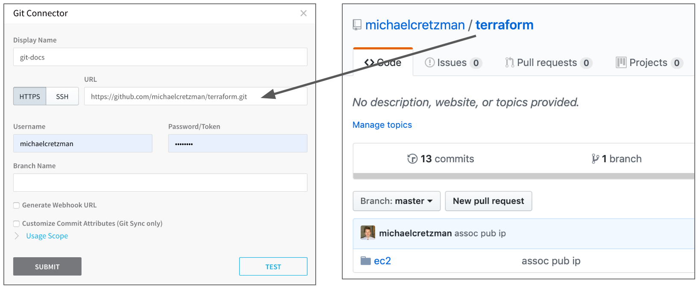
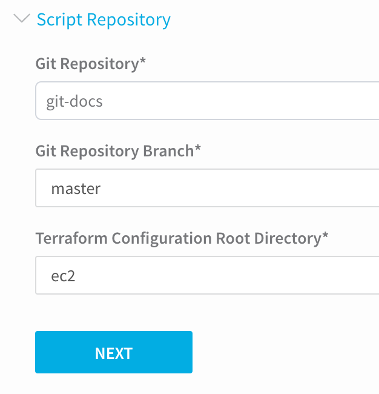

The first step in integrating your Terraform scripts and processes is setting up the necessary Harness account components: Delegates, Cloud Providers, and Source Repo Providers.

This topic describes how to set up these components for Terraform.

Once your account is set up, you can begin integrating your Terraform scripts. See [Add Terraform Scripts](add-terraform-scripts.md).

### Before You Begin

* [Harness Key Concepts](https://docs.harness.io/article/4o7oqwih6h-harness-key-concepts)
* Get an overview of how Harness integrates Terraform: [Terraform Provisioning with Harness](../concepts-cd/deployment-types/terraform-provisioning-with-harness.md)
* [Delegate Installation and Management](https://docs.harness.io/article/h9tkwmkrm7-delegate-installation)
* [Add Cloud Providers](https://docs.harness.io/article/whwnovprrb-cloud-providers)
* [Add Source Repo Providers](https://docs.harness.io/article/ay9hlwbgwa-add-source-repo-providers)

### Step 1: Set Up Harness Delegates

A Harness Delegate performs the Terraform provisioning in your Terraform scripts. When installing the Delegate for your Terraform provisioning, consider the following:

* The Delegate should be installed where it can connect to the target infrastructure. Ideally, this is the same subnet.
* If you are provisioning the subnet dynamically, then you can put the Delegate in the same VPC and ensure that it can connect to the provisioned subnet using security groups.
* The Delegate must also be able to connect to your script repo. The Delegate will pull the scripts at deployment runtime.
* While all Harness Delegates can use Terraform, you might want to select a Delegate type (Shell Script, Kubernetes, ECS, etc) similar to the type of infrastructure you are provisioning.
* If you are provisioning AWS AMIs and ASGs, you'll likely use Shell Script Delegates on EC2 instances or ECS Delegates.
* If you are provisioning Kubernetes clusters, you will likely use Kubernetes Delegates.
1. To install a Delegate, follow the steps in [Delegate Installation and Management](https://docs.harness.io/article/h9tkwmkrm7-delegate-installation). Once the Delegate is installed, it will be listed on the Harness Delegates page.

#### Delegate Selectors

If needed, add a Delegate Selector to your Delegates. When you add a **Terraform Provisioner** step to your Harness Workflows, you can use the Delegate Selector to ensure specific Delegates perform the operations.

If you do not specify a Selector in the **Terraform Provisioner** step, Harness will try all Delegates and then assign the Terraform tasks to the Delegates with Terraform installed.

To add Selectors, see [Delegate Installation and Management](https://docs.harness.io/article/h9tkwmkrm7-delegate-installation).

#### Permissions

The Harness Delegate requires permissions according to the deployment platform and the operations of the Terraform scripts.

In many cases, all credentials are provided by the account used to set up the Harness Cloud Provider.

In some cases, access keys, secrets, and SSH keys are needed. You can add these in Harness [Secrets Management](https://docs.harness.io/article/au38zpufhr-secret-management). You can then select them in the **Terraform Provisioner** step in your Harness Workflows.

For ECS Delegates, you can add an IAM role to the ECS Delegate task definition. For more information, see  [Trust Relationships and Roles](https://docs.harness.io/article/h9tkwmkrm7-delegate-installation#trust_relationships_and_roles).

### Step 2: Install Terraform on Delegates

Terraform must be installed on the Delegate to use a Harness Terraform Provisioner. You can install Terraform manually or use the `INIT_SCRIPT` environment variable in the Delegate YAML.

See [Run Initialization Scripts on Delegates](https://docs.harness.io/article/ul6qktixip-run-initialization-scripts-on-delegates).


```
# Install TF  
microdnf install unzip  
curl -O -L https://releases.hashicorp.com/terraform/1.1.9/terraform_1.1.9_darwin_amd64.zip  
unzip terraform_1.1.9_darwin_amd64.zip  
mv ./terraform /usr/bin/  
# Check TF install  
terraform --version
```
Terraform is now installed on the Delegate.

If you will be using a Cloud Provider that uses Delegate Selectors to identify Delegates (AWS Cloud Provider), add a Selector to this Delegate. For more information, see [Delegate Installation and Management](https://docs.harness.io/article/h9tkwmkrm7-delegate-installation).

The Delegate needs to be able to obtain the Terraform provider you specify in the modules in your Terraform script. For example, `provider "acme"`. On the Delegate, Terraform will download and initialize any providers that are not already initialized.

### Step 3: Set Up the Cloud Provider

Add a Harness Cloud Provider to connect Harness to your target platform (AWS, Kubernetes cluster, etc).

Later, when you use Terraform to define a Harness Infrastructure Definition, you will also select the Cloud Provider to use when provisioning.

When you create the Cloud Provider, you can enter the platform account information for the Cloud Provider to use as credentials, or you can use the Delegate(s) running in the infrastructure to provide the credentials for the Cloud Provider.

If you are provisioning infrastructure on a platform that requires specific permissions, such as AWS AMIs, the account used by the Cloud Provider needs the required policies. For example, to create AWS EC2 AMIs, the account needs the **AmazonEC2FullAccess** policy. See the list of policies in [Add Cloud Providers](https://docs.harness.io/article/whwnovprrb-cloud-providers). For steps on adding an AWS Cloud Provider, see [Amazon Web Services (AWS) Cloud](https://docs.harness.io/article/whwnovprrb-cloud-providers#amazon_web_services_aws_cloud).

When the Cloud Provider uses the installed Delegate for credentials (via its Delegate Selector), it assumes the permissions/roles used by the Delegate.

### Step 4: Connect Harness to Your Script Repo

To use your Terraform script in Harness, you host the script in a Git repo and add a Harness Source Repo Provider that connects Harness to the repo. For steps on adding the Source Repo Provider, see [Add Source Repo Providers](https://docs.harness.io/article/ay9hlwbgwa-add-source-repo-providers).

Here is an example of a Source Repo Provider and the GitHub repo it is using:



In the image above, there is no branch added in the Source Repo Provider **Branch Name** field as this is the master branch, and the **ec2** folder in the repo is not entered in the Source Repo Provider. Later, when you use the Source Repo Provider in your Terraform Provisioner, you can specify the branch and root directory:



If you are using a private Git repo, an SSH key for the private repo is required on the Harness Delegate running Terraform to download the root module. You can copy the SSH key over to the Delegate. For more information, see [Using SSH Keys for Cloning Modules](https://www.terraform.io/docs/enterprise/workspaces/ssh-keys.html) (from HashiCorp) and [Adding a new SSH key to your GitHub account](https://help.github.com/en/articles/adding-a-new-ssh-key-to-your-github-account) (from Github).### Next Steps

Once your account is set up, you can begin integrating your Terraform scripts. See [Add Terraform Scripts](add-terraform-scripts.md).

