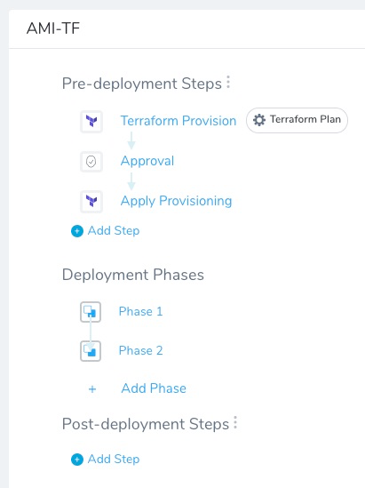
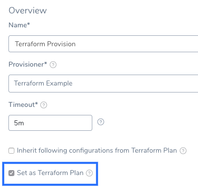
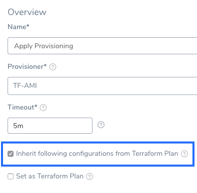

The Terraform Provision and Terraform Apply steps in a Workflow can be executed as a dry run, just like running the [terraform plan](https://www.terraform.io/docs/commands/plan.html) command.

The dry run will refresh the state file and generate a plan, but not apply the plan. You can then set up an Approval step to follow the dry run, followed by the Terraform Provision or Terraform Apply step to apply the plan.

This topic covers using the Terraform Provision and Terraform Apply steps for dry runs only. For steps on applying plans without a dry run, see [Provision using the Terraform Provision Step](terraform-provisioner-step.md) and [Using the Terraform Apply Command](using-the-terraform-apply-command.md).

### Before You Begin

This topic assumes you have read the following:

* [Terraform Provisioning with Harness](../concepts-cd/deployment-types/terraform-provisioning-with-harness.md)
* [Set Up Your Harness Account for Terraform](terraform-delegates.md)
* [Add Terraform Scripts](add-terraform-scripts.md)
* [Map Dynamically Provisioned Infrastructure using Terraform](mapgcp-kube-terraform-infra.md)
* [Provision using the Terraform Provision Step](terraform-provisioner-step.md)

**What the difference between the Terraform Provision or Terraform Apply step?** The Terraform Provision step is used to provision infrastructure and is added in the **Pre-deployment Steps** of a Workflow. The Terraform Apply can be placed anywhere in the Workflow.

### Visual Summary

The following graphic shows a common use of a Terraform dry run in deployments.


1. The dry run is used to verify the provisioning.
2. An Approval step to ensure that the Terraform plan is working correctly.
3. The plan is run and the infrastructure is provisioned.
4. The app is deployed to the provisioned infrastructure.

In a Harness Workflow it looks something like this:



### Limitations

The Terraform Plan is stored in the default Harness Secrets Manager as encrypted text. This is because plans often contain variables that store secrets.

The Terraform plan size must not exceed the secret size limit for secrets in your default Secret Manager. AWS Secrets Manager has a limitation of 64KB. Other supported Secrets Managers support larger file size.

See [Add a Secrets Manager](https://docs.harness.io/article/uuer539u3l-add-a-secrets-manager).

### Step 1: Set Terraform Step as Plan

This step assumes you are familiar with adding the [Terraform Provision](terraform-provisioner-step.md) and [Terraform Apply](using-the-terraform-apply-command.md) steps.

To perform a dry run of your Terraform Provision and Terraform Apply steps, you simply select the **Set as Terraform Plan** option.

That's it. Now this Terraform Provision or Terraform Apply step will run like a `terraform plan` command.

The dry run will refresh the state file and generate a plan but it is not applied. You can then set up an Approval step to follow the dry run, followed by a Terraform Provision or Terraform Apply step to apply the plan.

In the subsequent Terraform Provision or Terraform Apply steps, you will select the **Inherit following configurations from Terraform Plan** option to apply the plan.

This is just like running the `terraform plan` command before a `terraform apply` command.

You can use expressions after a Terraform plan step (Terraform Apply step with **Set as Terraform Plan** enabled) to see the number of resources added, changed, or destroyed. For details, go to [Terraform Plan and Terraform Destroy Changes](https://docs.harness.io/article/aza65y4af6-built-in-variables-list#terraform_plan_and_terraform_destroy_changes).### Option: Export Terraform Plan to Apply Step

This option supports [Terraform version 12](https://www.terraform.io/upgrade-guides/0-12.html) only.When you use **Set as Terraform Plan** in the Terraform Provision or Terraform Apply steps and then use **Inherit following configurations from Terraform Plan** in a subsequent Terraform Provision or Terraform Apply step, Harness does the following:

Harness runs the Terraform provision again and points to the plan, runs a Terraform refresh, then a plan, and finally executes the new plan.

Technically, this is a different plan. If you want use the actual plan because of security or audit requirements, use **Export Terraform Plan to Apply Step** in the previous Terraform Provision step along with **Set as Terraform Plan**.

##### Notes

* If the **Export Terraform Plan to Apply Step** option is enabled in two consecutive Terraform Provision steps, the second Terraform Provision step overwrites the plan from the first Terraform Provision step.
* Harness uses the [Harness Secret Manager](https://docs.harness.io/article/uuer539u3l-add-a-secrets-manager) you have selected as your default in the export process. As a result, the size of the plan you can export is limited to the size of secret that Secret Manager allows.

If Harness detects that a Terraform plan produces no changes then the actual generated Terraform plan file is not be uploaded to the Secret Manager regardless of whether the Terraform Apply step has **Export Terraform Plan to Apply Step** enabled.

### Step 2: Add Approval Step

Harness Workflow Approval steps can be done using Jira, ServiceNow, or the Harness UI. You can even use custom shell scripts. See [Approvals](https://docs.harness.io/article/0ajz35u2hy-approvals).

Add the Approval step after the Terraform Provision or Terraform Apply step where you selected the **Set as Terraform Plan** option.

1. To add the Approval step, click **Add Step**, and select **Approval**.
2. In the **Approval** step, select whatever approval options you want, and then click **Submit**.

Next, we'll add a Terraform Provision or Terraform Apply step after the Approval step to actually run the Terraform Infrastructure Provisioner script.

If the Approval step takes a long time to be approved there is the possibility that a new commit occurs in the Git repo containing for Terraform script. To avoid a problem, when the Workflow performs the dry run, it saves the commit ID of the script file. Later, after the approval, the Terraform Provision step will use the commit ID to ensure that it executes the script that was dry run.### Step 3: Add Terraform Step to Apply Plan

For the Terraform Provision or Terraform Apply step that actually runs the Terraform Infrastructure Provisioner script (`terraform apply`), all you need to do is select the **Inherit following configurations from Terraform Plan** option.

When you select this option, the Terraform Provision or Terraform Apply step inherits the settings of the Terraform Provision or Terraform Apply step that preceded it.

1. After the Approval step, click **Add Step**.
2. Select a **Terraform Provision** or **Terraform Apply** step.
3. In **Name**, enter a name for the step to indicate that it will perform the provisioning. For example, **Apply Provisioning**.
4. In **Provisioner**, select the Harness Terraform Infrastructure Provisioner you want to run. This is the same Terraform Infrastructure Provisioner you selected in the previous Terraform Provision or Terraform Apply step.
5. Select the **Inherit following configurations from Terraform Plan** option.
   
6. Click **Submit**.

You do not need to enter any more settings. The Terraform Provision or Terraform Apply step inherits the settings of the Terraform Provision or Terraform Apply step that preceded it.

Your Workflow now looks something like this:


### Step 4: Deploy

Deploy your Workflow and see the `terraform plan` executed in the first Terraform Provision or Terraform Apply step. Next, approve the Approval step. Finally, see the `terraform apply` executed as part of the final Terraform Provision or Terraform Apply step.

### Review: Terraform Plan Output Variable

If you select the **Set as Terraform Plan** option, you can display the output of the plan using the variable expression `${terraformApply.tfplan}`. For example, you can display the plan output in a [Shell Script](https://docs.harness.io/article/1fjrjbau7x-capture-shell-script-step-output) step.

For help in parsing the plan output, see [Parsing Terraform Plan Output](https://community.harness.io/t/parsing-terraform-plan-output/545) on Harness Community.

The `${terraformApply.tfplan}` expression does not support plan files larger than 15MB.

### Review: Terraform Plan File Output Variable

Currently, this feature is behind the Feature Flag `OPTIMIZED_TF_PLAN`. Contact [Harness Support](mailto:support@harness.io) to enable the feature.If you select the **Set as Terraform Plan** option, you can display the output of the plan using the variable expression `${terraformPlan.jsonFilePath()}`.

The `${terraformPlan.jsonFilePath()}` expression outputs the path to the Terraform plan file on the Harness Delegate that executed the step.

For example, you can display the plan output in a [Shell Script](https://docs.harness.io/article/1fjrjbau7x-capture-shell-script-step-output) step:


```
# Terraform Apply  
#### Using OPA   
opa exec --decision terraform/analysis/authz --bundle policy/ ${terraformPlan.jsonFilePath()}  
  
#### Using OPA daemon  
curl localhost:8181/v0/data/terraform/analysis/authz -d @${terraformPlan.jsonFilePath()}
```
If you use the Terraform Destroy step, you can use the expression `${terraformPlan.destroy.jsonFilePath()}` to output plan used by that step.

### Next Steps

Removing provisioned infrastructure is a common Terraform-related task. You can add this task to your Harness Workflow and automate it. See [Remove Provisioned Infra with Terraform Destroy](terraform-destroy.md).

