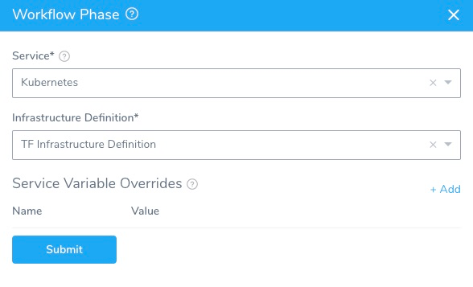

This topic describes how to provision infrastructure using the Workflow **Terraform Provisioner** step.

You use the Terraform Provisioner step in a Workflow to run the Terraform script added in a Harness Terraform Infrastructure Provisioner. This is the same Terraform Infrastructure Provisioner selected in the Workflow's Infrastructure Definition to define the deployment target infrastructure.

During deployment, the Terraform Provisioner step provisions the target deployment infrastructure and then the Workflow deploys to the provisioned infrastructure.

To provision non-target deployment infrastructure, use the Terraform Apply Workflow step. See [Using the Terraform Apply Command](using-the-terraform-apply-command.md).

The Harness Terraform Infrastructure Provisioner is supported in Canary and Multi-Service Workflows only. For AMI/ASG and ECS deployments, the Terraform Infrastructure Provisioner is also supported in Blue/Green Workflows.


### Before You Begin

Ensure you have read the following topics before your add the Terraform Provisioner step to a Workflow:

* [Terraform Provisioning with Harness](../concepts-cd/deployment-types/terraform-provisioning-with-harness.md)
* [Set Up Your Harness Account for Terraform](terraform-delegates.md)
* [Add Terraform Scripts](add-terraform-scripts.md)
* [Map Dynamically Provisioned Infrastructure using Terraform](mapgcp-kube-terraform-infra.md)

You can also run Harness Terraform Infrastructure Provisioner using the Terraform Apply Workflow step. This step is used to provision non-target infrastructure. See [Using the Terraform Apply Command](using-the-terraform-apply-command.md).

**What the difference between the Terraform Provisioner or Terraform Apply step?** The Terraform Provisioner step is used to provision infrastructure and is added in the **Pre-deployment Steps** of a Workflow. The Terraform Apply can run any Harness Terraform Infrastructure Provisioner and can be placed anywhere in the Workflow.In addition, the following related features are documented in other topics:

* **Terraform Dry Run** - The Terraform Provisioner step in the Workflow can be executed as a dry run, just like running the `terraform plan` command. The dry run will refresh the state file and generate a plan. See [Perform a Terraform Dry Run](terraform-dry-run.md).
* **Terraform Destroy** — This is covered in the [Remove Provisioned Infra with Terraform Destroy](terraform-destroy.md).

### Visual Summary

This topic describes steps 3 through 6 in the Harness Terraform Provisioning implementation process:


For step 1, see [Add Terraform Scripts](add-terraform-scripts.md). For step 2, see [Map Dynamically Provisioned Infrastructure using Terraform](mapgcp-kube-terraform-infra.md).

Here is illustration using a deployment:


)1. The **Terraform Provision** step executes pre-deployment to build the infrastructure.
2. The **Infrastructure Definition** is used to select the provisioned nodes.
3. The app is **installed** on the provisioned node.

### Step 1: Add Environment to Workflow

Tp provision target deployment infrastructure in a Workflow, the Workflow Phase(s) needs to be set up with an Infrastructure Definition that uses the Terraform Infrastructure Provisioner.

Setting up this Infrastructure Definition is covered in [Map Dynamically Provisioned Infrastructure using Terraform](mapgcp-kube-terraform-infra.md).

Next, when you create or edit your Canary or Multi-Service Workflow, you add the Environment containing the mapped Infrastructure Definition to your Workflow settings.

Harness Infrastructure Provisioners are only supported in Canary and Multi-Service deployment types. For AMI deployments, Infrastructure Provisioners are also supported in Blue/Green deployments. If you are creating a Blue/Green Workflow for AMI, you can select the Environment and Infrastructure Definition in the Workflow setup settings.To create the Workflow and add the Environment, do the following:

In your Harness Application, click **Workflows**.

Click **Add Workflow**. The Workflow settings appear.

Enter a name and description for the Workflow.

In **Workflow Type**, select **Canary**.

In **Environment**, select the Environment that has the Terraform Provisioner set up in one of its Infrastructure Definitions.

You Workflow settings will look something like this:


Click **SUBMIT**. The new Workflow is created.

By default, the Workflow includes a **Pre-deployment Steps** section. This is where you will add a step that uses your Terraform Provisioner.


Infrastructure Definitions are added in Canary Workflow *Phases*, in the **Deployment Phases** section. You will add the Infrastructure Definition that uses your Terraform Infrastructure Provisioner when you add the Canary Phases, later in this topic.

### Step 2: Add Terraform Step to Pre-deployment Steps

To provision the infrastructure in your Terraform Infrastructure Provisioner, add the **Terraform Provisioner** Step in **Pre-deployment Steps**:

In your Workflow, in **Pre-deployment Steps**, click **Add Step**.

Select **Terraform Provision**. The **Terraform Provision** settings appear.


In **Name**, enter a name for the step. Use a name that describes the infrastructure the step will provision.

In **Provisioner**, select the Harness Terraform Infrastructure Provisioner you set up for provisioning your target infrastructure. Terraform Infrastructure Provisioner setup is covered in [Add Terraform Scripts](add-terraform-scripts.md).

In **Timeout**, enter how long Harness should wait to complete the Terraform Provisioner step before failing the Workflow.

### Option: AWS Cloud Provider, Region, Role ARN

Currently, this feature is behind the Feature Flag `TERRAFORM_AWS_CP_AUTHENTICATION`. Contact [Harness Support](mailto:support@harness.io) to enable the feature.If you want to use a specific AWS role for this step's provisioning, you can select the AWS Cloud Provider, Region, and Role ARN. You can select any of these options, or all of them.

These options allow you to use different roles for different Terraform steps, such as one role for the Terraform Plan step and a different role for the Terraform Provision or Apply steps.

* **AWS Cloud Provider:** the AWS Cloud Provider selected here is used for authentication.  
At a minimum, select the **AWS Cloud Provider** and **Role ARN**. When used in combination with the AWS Cloud Provider option, the Role ARN is assumed by the Cloud Provider you select.  
The **AWS Cloud Provider** setting can be templated.You need to select an AWS Cloud Provider even if the Terraform Infrastructure Provisioner you selected uses a manually-entered template body. Harness needs access to the AWS API via the credentials in the AWS Cloud Provider.
* **Region:** the AWS region where you will be provisioning your resources. If not region is specified, Harness uses `us-east-1`.
* **Role ARN:** enter the Amazon Resource Name (ARN) of an AWS IAM role that Terraform assumes when provisioning. This allows you to tune the step for provisioning a specific AWS resource. For example, if you will only provision AWS S3, then you can use a role that is limited to S3.  
At a minimum, select the **AWS Cloud Provider** and **Role ARN**. When used in combination with the AWS Cloud Provider option, the Role ARN is assumed by the Cloud Provider you select.  
You can also use [Harness variable expressions](https://docs.harness.io/article/9dvxcegm90-variables) in **Role ARN**. For example, you can create a Service or Workflow variable and then enter its expression in **Role ARN**, such as `${serviceVariables.roleARN}` or `${workflow.variables.roleArn}`.

#### Environment Variables

If you use the **AWS Cloud Provider** and/or **Role ARN** options, do not add the following environment variables in the step's **Environment Variables** settings:

* `AWS_ACCESS_KEY_ID`
* `AWS_SECRET_ACCESS_KEY`
* `AWS_SESSION_TOKEN`

Harness generates these keys using the the **AWS Cloud Provider** and/or **Role ARN** options. If you also add these in **Environment Variables**, the step will fail.

### Option: Terraform Plan Settings

The **Inherit following configurations from Terraform Plan**, **Set as Terraform Plan**, and **Export** **Terraform Plan to Apply Step** settings are described in [Perform a Terraform Dry Run](terraform-dry-run.md) and [Using the Terraform Apply Command](using-the-terraform-apply-command.md). Here is a summary.

Essentially, these settings allow you to use your Terraform Provision step as a [Terraform plan dry run](https://www.terraform.io/docs/commands/plan.html) (`terraform plan -out=tfplan`). Each setting provides a different option:

#### Inherit following configurations from Terraform Plan

This setting is used to inherit the settings of a previous Terraform Provision step in the Workflow.

In the previous Terraform Provision step, you select the **Set as Terraform Plan** setting (and, optionally, the **Export Terraform Plan to Apply Step** setting) to run the step as a plan (a dry run).

Next, in a subsequent Terraform Provision or Terraform Apply step, you select **Inherit following configurations from Terraform Plan** to use the plan.

#### Set as Terraform Plan

You select this setting to run this Terraform Provision step as a Terraform plan. In a subsequent Terraform Provision or Terraform Apply step, you select the **Inherit following configurations from Terraform Plan** setting to use the plan and apply it.

Harness runs the Terraform provision again and points to the plan, runs a Terraform refresh, then a plan, and finally executes the new plan. Technically, this is a different plan. If you want use the actual plan because of security or audit requirements, use **Export Terraform Plan to Apply Step**.

If you want to avoid the Terraform refresh, in your Terraform Infrastructure Provisioner, enable the **Skip Terraform Refresh when inheriting Terraform plan** setting. See [Skip Terraform Refresh When Inheriting Terraform Plan](add-terraform-scripts.md#option-2-skip-terraform-refresh-when-inheriting-terraform-plan).

#### Export Terraform Plan to Apply Step

This option supports [Terraform version 12](https://www.terraform.io/upgrade-guides/0-12.html) only.This option is only available if you've selected **Set as Terraform Plan**. Select this option to save this Terraform Provision step as a `tfplan` to be applied in a later **Terraform Apply** step.

Select the [Harness Secret Manager](https://docs.harness.io/article/uuer539u3l-add-a-secrets-manager) to use for the plan.

By default, Harness uses the Harness Secret Manager you have selected as your **default** for the export process.The size of the plan you can export is limited to the size of secret that the Secret Manager you selected allows.

### Option: Enter Input Values

Provide values for any input values in your the Terraform script set up in the Terraform Infrastructure Provisioner used by this Terraform Provision step.

Click **Populate Variables** and Harness will pull all of the input variables from the Terraform script you added to the Terraform Infrastructure Provisioner you selected.


It can table a moment to populate the variables.

Enter a value for each variable in **Input Values**. For encrypted text values, select an Encrypted Text secret from Harness Secrets Management.


For more information, see [Secrets Management](https://docs.harness.io/article/au38zpufhr-secret-management).

#### Use tfvar Files

The **Input Values** section also includes the **Use tfvar files** option for using a variable definitions file instead of using the Terraform script variables.

You can use inline or remote tfvar files.

##### Inline tfvar Files

The path to the variable definitions file is relative to the root of the Git repo specified in the Terraform Provisioner setting. For example, in the following image, the **testing.tfvars** file is located in the repo at `terraform/ec2/testing/testing.tfvars`:


If **Use tfvar files** is selected and there are also **Inline Values**, when Harness loads the variables from the **tfvars** file, the **Inline Values** variables override the variables from the tfvars file.

If you only want to use the tfvars file, make sure to delete the Inline Values.

In **File Path**, you can enter multiple files separated by commas.

You can also use [Workflow variables](https://docs.harness.io/article/766iheu1bk-add-workflow-variables-new-template) in **File Path**. This allows you to make the setting a deployment runtime parameter and to output their values using a [Shell Script](https://docs.harness.io/article/1fjrjbau7x-capture-shell-script-step-output) step.##### Remote tfvar Files

In **Source Repository**, select the Harness [Source Repo Provider](https://docs.harness.io/article/ay9hlwbgwa-add-source-repo-providers) that connects to the repo where your tfvar file is.

Select **Commit ID** or **Branch.**

**Commit ID** also supports [Git tags](https://git-scm.com/book/en/v2/Git-Basics-Tagging).* For **Commit ID**, enter the Git commit ID or Git tag containing the tfvar version you want to use.
* For **Branch**, enter the name of the branch where the tfvar file is located.

In **File Folder Path**, enter the full path from the root of the repo to the tfvar file. You can enter multiple file paths separated by commas.

#### Map and List Variable Type Support

Terraform uses [map variables](https://www.terraform.io/docs/configuration-0-11/variables.html#maps) as a lookup table from string keys to string values, and [list variables](https://www.terraform.io/docs/configuration-0-11/variables.html#lists) for an ordered sequence of strings indexed by integers.

Harness provides support for both Terraform map and list as input values.

For example, here are map and list variables from a Terraform script:


```
variable "map_test" {  
  type    = "map"  
  default = {  
    "foo" = "bar"  
    "baz" = "quz"  
  }  
}  
  
variable "list_test" {  
  type    = "list"  
  default = ["ami-abc123", "ami-bcd234"]  
}
```
In **Inline Values**, you would enter these as text values `map_test` and `list_test` with their defaults in **Value**:


When the Workflow is deployed, the `map_test` and `list_test` variables and values are added using the `terraform plan -var` option to set a variable in the Terraform configuration (see [Usage](https://www.terraform.io/docs/commands/plan.html#usage) from Terraform):


```
...  
terraform plan -out=tfplan -input=false     
...  
**-var='map\_test={foo = "bar", baz = "qux"}'   
-var='list\_test=["ami-abc123", "ami-bcd234"]'**    
...
```
And displayed as outputs:


```
...  
Outputs:  
  
list_test = [  
    ami-abc123,  
    ami-bcd234  
]  
map_test = {  
  baz = qux  
  foo = bar  
}  
...
```
If the map or list you want to add is very large, such as over 128K, you might want to input them using the **Use tfvar files** setting and a values.tfvars file.You can also create an expression in an earlier Workflow step that creates a map or list and enter the expression in **Input Values**. So long as the expression results in the properly formatted map or list value, it will be entered using `terraform plan -var`. See [Set Workflow Variables](https://docs.harness.io/article/766iheu1bk-add-workflow-variables-new-template).Click **Next**. The **Backend Configuration (Remote state)** section appears.

### Option: Backend Configuration (Remote state)

The **Backend Configuration (Remote state)** section contains the remote state values.

Enter values for each backend config (remote state variable), and click **Next**.

The **Additional Settings** section appears.

### Option: Resource Targeting

In **Additional Settings**, you can use the **Target** setting to target one or more specific modules in your Terraform script, just like using the `terraform plan -target` command. See [Resource Targeting](https://www.terraform.io/docs/commands/plan.html#resource-targeting) from Terraform.

For example, in the following image you can see the Terraform script has one resource and two modules and the **Targets** setting displays them as potential targets.


If you have multiple modules in your script and you do not select one in **Targets**, all modules are used.You can also use Workflow variables as your targets. For example, you can create a Workflow variable named **module** and then enter the variable `${workflow.variables.module}` in the **Targets** field. When you deploy the Workflow, you are prompted to provide a value for the variable:


See [Set Workflow Variables](https://docs.harness.io/article/766iheu1bk-add-workflow-variables-new-template).

### Option: Workspaces

Harness supports Terraform [workspaces](https://www.terraform.io/docs/state/workspaces.html). A Terraform workspace is a logical representation of one your infrastructures, such as Dev, QA, Stage, Production.

Workspaces are useful when testing changes before moving to a production infrastructure. To test the changes, you create separate workspaces for Dev and Production.

A workspace is really a different state file. Each workspace isolates its state from other workspaces. For more information, see [When to use Multiple Workspaces](https://www.terraform.io/docs/state/workspaces.html#when-to-use-multiple-workspaces) from Hashicorp.

Here is an example script where a local value names two workspaces, **default** and **production**, and associates different instance counts with each:


```
locals {  
  counts = {  
      "default"=1  
      "production"=3  
  }  
}  
  
resource "aws_instance" "my_service" {  
  ami="ami-7b4d7900"  
  instance_type="t2.micro"  
  count="${lookup(local.counts, terraform.workspace, 2)}"  
  tags {  
         Name = "${terraform.workspace}"  
    }  
}
```
In the workspace interpolation sequence you can see the count is assigned by applying it to the workspace variable (`terraform.workspace`) and that the tag is applied using the variable also.

Harness will pass the workspace name you provide to the `terraform.workspace` variable, thus determining the count. If you provide the name **production**, the count will be **3**.

In the **Workspace** setting, you can simply select the name of the workspace to use.


You can also use a Workflow variable to enter the name in **Workspace**.

Later, when the Workflow is deployed, you can specify the name for the Workflow variable:


This allows you to specify a different workspace name each time the Workflow is run.

You can even set a Harness Trigger where you can set the workspace name used by the Workflow.

This Trigger can then be run in response to different events, such as a Git push. For more information, see [Passing Variables into Workflows and Pipelines from Triggers](https://docs.harness.io/article/revc37vl0f-passing-variable-into-workflows).

When rollbacks occur, Harness will rollback the Terraform state to the previous version of same workspace.

### Option: Select Delegate

In **Delegate Selector**, you can select a specific Harness Delegate to execute the Terraform Provisioning step by selecting the Selector for the Delegate.

For more information on Delegate Selectors, see [Select Delegates with Selectors](https://docs.harness.io/article/c3fvixpgsl-select-delegates-for-specific-tasks-with-selectors).

You can even add a Workflow variable for the Delegate Selector and the use an expression in the **Delegate Selectors** field. When you deploy the Workflow, you will provide the name of the Delegate Selector.


For more information, see [Add Workflow Variables](https://docs.harness.io/article/m220i1tnia-workflow-configuration#add_workflow_variables) and [Passing Variables into Workflows and Pipelines from Triggers](https://docs.harness.io/article/revc37vl0f-passing-variable-into-workflows).

### Option: Add Environment Variables

If the Terraform script used in the Terraform Infrastructure Provisioner you selected uses environment variables, you can provide values for those variables here.

For any environment variable, provide a name, type, and value.

Click **Add**.

Enter a name, type, and value for the environment variable. For example: **TF\_LOG**, **Text**, and `TRACE`.

If you select Encrypted Text, you must select an existing Harness [Encrypted Text secret](https://docs.harness.io/article/ygyvp998mu-use-encrypted-text-secrets).

You can use Harness [Workflow variables](https://docs.harness.io/article/766iheu1bk-add-workflow-variables-new-template) and [expression variables](https://docs.harness.io/article/9dvxcegm90-variables) for the name and value.

Environment variables can also be deleted using the Terraform Destroy step. See [Remove Provisioned Infra with Terraform Destroy](terraform-destroy.md).

### Step 3: Add Infrastructure Definition to Phases

Now that the Workflow **Pre-deployment** section has your Terraform Provisioner step added, you need to add the target Infrastructure Definition where the Workflow will deploy.

This is the same Infrastructure Definition where you mapped your Terraform Infrastructure Provisioner outputs, as described in [Map Dynamically Provisioned Infrastructure using Terraform](mapgcp-kube-terraform-infra.md).

For Canary Workflows, Infrastructure Definitions are added in Phases, in the **Deployment Phases** section.

For AMI deployments, Terraform Infrastructure Provisioners are also supported in Blue/Green Workflows. If you are creating a Blue/Green Workflow for AMI, you can select the Environment and Infrastructure Definition in the Workflow setup settings.

1. In the **Deployment Phases** section, click **Add Phase**. The Workflow Phase settings appear.
2. In **Service**, select the Harness Service to deploy.
3. In **Infrastructure Definition**, select the target Infrastructure Definition where the Workflow will deploy. 
   This is the same Infrastructure Definition where you mapped your Terraform Infrastructure Provisioner outputs, as described in [Map Dynamically Provisioned Infrastructure using Terraform](mapgcp-kube-terraform-infra.md).  
   Here is an example:
   
4. Click **Submit**. Use the same Infrastructure Definition for the remaining phases in your Canary Workflow.

Once you are done, your Workflow is ready to deploy. Let's look at an example below.

### Example: Terraform Deployment

This section describes the deployment steps for a Workflow using the Terraform Provisioner step and deploying to a provisioned AMI.


This is a Canary deployment Workflow, but we are only interested in **Phase 1** where the Terraform provisioning occurs, and the artifact is installed in the provisioned AMI. Phase 2 of the Canary deployment is omitted.In the **Pre-Deployment** section, the **Terraform Provision** step is executed. When you click the step you can see the Terraform command executed in **Details**.


Note the DNS name of the AMI in the `dns` output:


You will see this name used next.

In **Phase 1** of the Canary deployment, click **Select Nodes** to see that Harness has selected the provisioned AMI as the deployment target host. See that it used the same DNS name as the the output in the **Terraform Provision** step:


Lastly, expand the **Deploy Service** step, and then click **Install**. You will see that the DNS name is shown on the arrow leading to install, and that the **Details** section displays the internal Delegate and provisioned target host addresses.


As you can see, the artifact was copied to the provisioned host. Deployment was a success.

### Notes

The following notes discuss rollback of deployments that use Terraform Infrastructure Provisioners.

#### Deployment Rollback

If you have successfully deployed Terraform modules and on the next deployment there is an error that initiates a rollback, Harness will roll back the provisioned infrastructure to the previous, successful version of the Terraform state.

Harness will not increment the serial in the state, but perform a hard rollback to the exact version of the state provided.

Harness determines what to rollback using a combination of the following Harness entities:

`Terraform Infrastructure Provisioner + Environment + Branch + Path + Workspace`

The branch and path refer to the branch and path selected in the **Script Repository** settings in the Terraform Infrastructure Provisioner used by this step.

If you have templated these settings (using Workflow variables), Harness uses the values it obtains at runtime when it evaluates the template variables.

#### Rollback Limitations

If you deployed two modules successfully already, module1 and module2, and then attempted to deploy module3, but failed, Harness will roll back to the successful state of module1 and module2.

However, let's look at the situation where module3 succeeds and now you have module1, module2, and module3 deployed. If the next deployment fails, the rollback will only roll back to the Terraform state with module3 deployed. Module1 and module2 were not in the previous Terraform state, so the rollback excludes them.

### Next Steps

Now that you're familiar with provision using the Terraform Provisioner step, the following topics cover features to help you extend your Harness Terraform deployments:

* [Using the Terraform Apply Command](using-the-terraform-apply-command.md) — The Terraform Apply command allows you to use a Harness Terraform Infrastructure Provisioner at any point in a Workflow.
* [Perform a Terraform Dry Run](terraform-dry-run.md) — The Terraform Provisioner step in the Workflow can be executed as a dry run, just like running the `terraform plan` command. The dry run will refresh the state file and generate a plan.
* [Remove Provisioned Infra with Terraform Destroy](terraform-destroy.md) — As a post-deployment step, you can add a Terraform Destroy step to remove the provisioned infrastructure, just like running the `terraform destroy` command.

