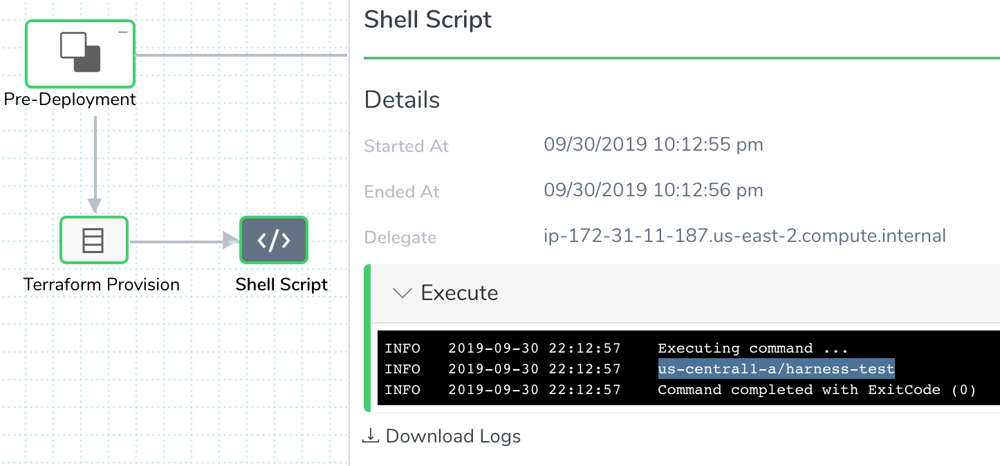

When you use a Terraform Provision or Terraform Apply step in a Workflow, any of the Terraform script outputs in the Terraform script can be used in Workflow settings that follow the step.

You reference a Terraform output with a Harness variable expression in the format `${terraform.output_name}`.

You can reference the output regardless of whether the Terraform Infrastructure Provisioner is used in the Infrastructure Definition in the Workflow settings.This topic demonstrates how to use these expressions in other Workflow steps.

In this topic:

* [Before You Begin](#before_you_begin)
* [Limitations](#limitations)
* [Step 1: Add a Workflow Step](#step_1_add_a_workflow_step)
* [Step 2: Enter the Output Variable Expression](#step_2_enter_the_output_variable_expression)
* [Notes](#notes)

### Before You Begin

This topic assumes you have read the following:

* [Terraform Provisioning with Harness](../concepts-cd/deployment-types/terraform-provisioning-with-harness.md)
* [Set Up Your Harness Account for Terraform](terraform-delegates.md)
* [Add Terraform Scripts](add-terraform-scripts.md)
* [Map Dynamically Provisioned Infrastructure using Terraform](mapgcp-kube-terraform-infra.md)
* [Provision using the Terraform Provision Step](terraform-provisioner-step.md)
* [Using the Terraform Apply Command](using-the-terraform-apply-command.md)

### Limitations

* Terraform outputs are limited to the Workflow where the Terraform plan is applied. You cannot run a Terraform plan in one Workflow in a Pipeline and reference its outputs in another Workflow in a Pipeline.  
You can, however, publish the values of the output variables from a Shell Script step, and then scope that published variable to the Pipeline. Now the output value can be passed to another Workflow in the Pipeline. See [Pass Variables between Workflows](https://docs.harness.io/article/gkmgrz9shh-how-to-pass-variables-between-workflows).
* You can only reference a Terraform output once the Terraform plan has been applied in the same Workflow. If a Terraform Provision or Terraform Apply step is set to run as a plan, you cannot reference its outputs.  
Once the plan has been applied by another Terraform Provision or Terraform Apply step, you can reference the Terraform script outputs. See [Perform a Terraform Dry Run](terraform-dry-run.md).

### Step 1: Add a Workflow Step

This topic assumes you have a Workflow that uses a Terraform Provision or Terraform Apply step.

Add a Workflow step after the Terraform Provision or Terraform Apply step where you want to use the Terraform script outputs.

Typically, you add a [Shell Script](https://docs.harness.io/article/1fjrjbau7x-capture-shell-script-step-output) step.

### Step 2: Enter the Output Variable Expression

In the Shell Script (or other) step, you can reference any Terraform output using the variable expression in the format `${terraform.output_name}`.

For example, let's say you have an output for a Kubernetes cluster name. You can add a Shell Script step in your Workflow and use `echo ${terraform.clusterName}` to print the value.

You can see the Terraform log display the output `clusterName = us-central1-a/harness-test` in the following Terraform Provision step:

Next, you could add a Shell Script step that uses the Terraform output variable `${terraform.clusterName}`:

In the Shell Script step in the deployment, you can see the value `us-central1-a/harness-test` printed:

### Notes

Terraform output expressions cannot be evaluated or published under the following conditions:

* The Shell Script step script uses `exit 0`. Bash exit prevents outputs from being published.
* No Terraform apply is performed by the Terraform Provision or Terraform Apply steps. In some cases, a Terraform plan might be run using the [Set Terraform as Plan](terraform-dry-run.md) option, but no further step performs the Terraform apply. If there is no Terraform apply, there are no output values.

