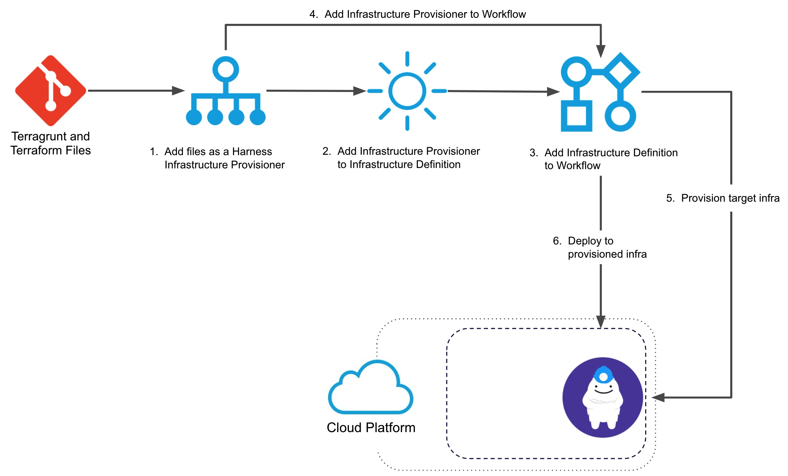

This topic describes how to set up a Harness Infrastructure Provisioner for Terragrunt. You simply link Harness to the repo where your Terragrunt config files are located.

Once the Harness Infrastructure Provisioner is set up, you can use it in two ways:

* Define a deployment target in a Harness Infrastructure Definition. You add that Infrastructure Definition to a Workflow as the deployment target. Next, you add a Terragrunt Provision step to the same Workflow to build the target infrastructure. The Workflow provisions the infrastructure and then deploys to it.
* Provision non-target infrastructure. You can also simply add the Terragrunt Provision step to a Workflow to provision non-target resources.  
In this topic, we will cover provisioning the target infrastructure for a deployment, but the steps to provision other resources are similar.

### Before You Begin

* Get an overview how how Harness supports Terragrunt: [Terragrunt Provisioning with Harness](../concepts-cd/deployment-types/terragrunt-provisioning-with-harness.md).
* Ensure you have your Harness account settings prepared for Terragrunt: [Set Up Your Harness Account for Terragrunt](set-up-your-harness-account-for-terragrunt.md).

### Visual Summary

Here is a visual summary of how you use your and Terragrunt and Terraform files with Harness to provision target infra and then deploy to it:

Here's a 6 minute video walkthrough of Harness-Terragrunt integration:

<!-- Video:
https://harness-1.wistia.com/medias/rpv5vwzpxz-->
<docvideo src="https://www.youtube.com/embed/HYSi2LAaYdc?feature=oembed" />

You can use Terragrunt in Harness to provision any infrastructure, not just the target infrastructure for the deployment.

In this use case, you simply add the Terragrunt Provision step to your Workflow and it runs some Terragrunt commands to provision some non-target resources in your infrastructure.

### Step 1: Add a Terragrunt Provisioner

To set up a Terragrunt Infrastructure Provisioner, do the following:

In your Harness Application, click **Infrastructure Provisioners**.

Click **Add Infrastructure Provisioner**, and then click **Terragrunt**. The **Terragrunt Provisioner** settings appear.

In **Name**, enter the name for this provisioner. You will use this name to select this provisioner in Harness Infrastructure Definitions and Workflows.

Click **Next**. The **Script Repository** section appears. This is where you provide the location of the root module in your Git repo.

### Step 2: Select Your Terragrunt Script Repo

In **Script Repository**, in **Git Repository**, select the [Source Repo Provider](https://docs.harness.io/article/ay9hlwbgwa-add-source-repo-providers) you added for the Git repo where your script is located. See [Set Up Your Harness Account for Terragrunt](set-up-your-harness-account-for-terragrunt.md).

In **Commit**, select **Latest from Branch** or **Specific Commit ID**:

* If you selected **Latest from Branch**, in **Git Repository Branch**, enter the repo branch to use. For example, **master**. For master, you can also use a dot (`.`).
* If you selected **Specific Commit ID**, in **Commit ID**, enter the Git commit ID to use.

In **Path to Terragrunt Root Module**, enter the folder where the root module is located. Enter `.` for root.

### Option: Use Expressions for Script Repository

You can also use expressions in the **Git Repository Branch** and **Path to Terragrunt Root Module** and have them replaced by Workflow variable values when the Terragrunt Provisioner is used by the Workflow.

For example, a Workflow can have variables for **branch** and **path**:

In **Script Repository**, you can enter variables as `${workflow.variables.branch}` and `${workflow.variables.path}`:

When the Workflow is deployed, you are prompted to provide values for the Workflow variables, which are then applied to the **Script Repository** settings.

This allows the same Terragrunt Provisioner to be used by multiple Workflows, where each Workflow can use a different branch and path for the **Script Repository**.

See [Set Workflow Variables](https://docs.harness.io/article/766iheu1bk-add-workflow-variables-new-template).

### Step 3: Select Secret Manager for Terragrunt Plan

In **Terraform Plan Storage Configuration**, select a Secrets Manager to use for encrypting/decrypting and saving the Terraform plan file.

See [Add a Secrets Manager](https://docs.harness.io/article/uuer539u3l-add-a-secrets-manager).

A Terraform plan is a sensitive file that could be misused to alter cloud provider resources if someone has access to it. Harness avoids this issue by never passing the Terraform plan file as plain text.

Harness only passes the Terraform plan between the Harness Manager and Delegate as an encrypted file using a Harness Secrets Manager.

When the `terraform plan` command is run on the Harness Delegate, the Delegate encrypts the plan and saves it to the Secrets Manager you selected. The encrypted data is passed to the Harness Manager.

When the plan is going to be applied, the Harness Manager passes the encrypted data to the Delegate.

The Delegate decrypts the encrypted plan and applies it using the `terraform apply` command.

### Option: Skip Terragrunt Refresh When Inheriting Terraform Plan

To understand this setting, let's review some of the options available later when you will use this Terragrunt Infrastructure Provisioner with a [Terragrunt Provision](provision-using-the-terragrunt-provision-step.md) step in your Workflow.

When you add that step, you can run it as a Terragrunt plan using the **Set as Terragrunt Plan** setting.

Next, you have the option of exporting the Terragrunt plan from one Terragrunt step (using the **Export Terragrunt Plan to Apply Step** setting) and inheriting the Terraform plan in the next Terraform step (using the **Inherit following configurations from Terraform Plan** setting).

Essentially, these settings allow you to use your Terragrunt Provision step as a `terragrunt plan` ([Terraform plan dry run](https://www.terraform.io/docs/commands/plan.html)).

During this inheritance, Harness runs a Terraform refresh, then a plan, and finally executes the new plan.

If do not want Harness to perform a refresh, enable the  **Skip Terragrunt Refresh when inheriting Terraform plan** option in your Terragrunt Infrastructure Provisioner.

When this setting is enabled, Harness will directly apply the plan without reconciling any state changes that might have occurred outside of Harness between `plan` and `apply`.

This setting is available because a Terraform refresh is not always an idempotent command. It can have some side effects on the state even when no infrastructure was changed. In such cases, terraform apply `tfplan` commands might fail.

### Step 4: Complete the Terragrunt Provisioner

When you are done, the **Terragrunt** **Provisioner** will look something like this:

Now you can use this provisioner in both Infrastructure Definitions and Workflows.

### Next Steps

* **Infrastructure Definitions** — Use the Terragrunt Infrastructure Provisioner to define a Harness Infrastructure Definition. You do this by mapping the script outputs from the Terraform module used by the Terragrunt configuration file to the required Harness Infrastructure Definition settings. Harness supports provisioning for many different platforms.  
See: [Map Dynamically Provisioned Infrastructure using Terragrunt](map-terragrunt-infrastructure.md).
* **Workflows** — Once you have created the Infrastructure Definition and added it to a Workflow, you add a Terragrunt Provisioner Step to the Workflow to run your Terragrunt and Terraform files and provision the infra.  
See: [Provision using the Terragrunt Provision Step](provision-using-the-terragrunt-provision-step.md).

