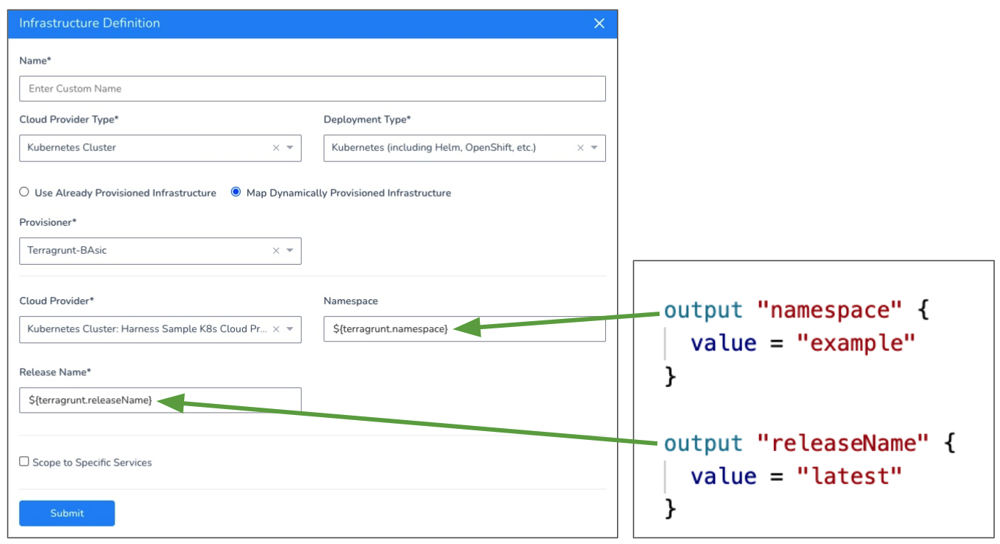

This topic describes how to use a Harness Terragrunt Infrastructure Provisioner to create a Harness Infrastructure Definition. When you select the **Map Dynamically Provisioned Infrastructure** option in an Infrastructure Definition, you select an Infrastructure Provisioner and then map its outputs to required settings.


Once you map the outputs, you add the Infrastructure Definition to a Workflow as its deployment target.

Finally, you add a Terraform Provision step to that Workflow's Pre-deployment section to provision that target infrastructure.

When the Workflow runs, it provisions the infrastructure and then deploys to it.

This topic describes how to map Terraform script outputs for all of the supported platforms.

If you just want to provision non-target infrastructure you don't need to map outputs in the Infrastructure Definition. See [Terragrunt Provisioning with Harness](../concepts-cd/deployment-types/terragrunt-provisioning-with-harness.md) and [Provision using the Terragrunt Provision Step](provision-using-the-terragrunt-provision-step.md).


### Before You Begin

* Get an overview how how Harness supports Terragrunt: [Terragrunt Provisioning with Harness](../concepts-cd/deployment-types/terragrunt-provisioning-with-harness.md).
* Ensure you have your Harness account settings prepared for Terragrunt: [Set Up Your Harness Account for Terragrunt](set-up-your-harness-account-for-terragrunt.md).
* Create a Harness Terragrunt Infrastructure Provisioner: [Add Terragrunt Configuration Files](add-terragrunt-configuration-files.md).

### Visual Summary

Here is a visual summary of how you use your and Terragrunt and Terraform files with Harness to provision target infra and then deploy to it:


Here's a 6-minute video walkthrough of Harness-Terragrunt integration:

<!-- Video:
https://harness-1.wistia.com/medias/rpv5vwzpxz-->
<docvideo src="https://www.youtube.com/embed/HYSi2LAaYdc?feature=oembed" />


### Limitations

Harness Terragrunt Infrastructure Provisioner are only supported in Canary and Multi-Service Workflows. For AMI/ASG and ECS deployments, Terragrunt Infrastructure Provisioners are also supported in Blue/Green Workflows.

Harness has the same support for Terraform Infrastructure Provisioners.

### Step 1: Add Terragrunt Configuration Files

Following the steps in these topics to set up your Harness account for Terragrunt and then connect Harness with your Terragrunt config files using a Terragrunt Infrastructure Provisioner:

1. [Set Up Your Harness Account for Terragrunt](set-up-your-harness-account-for-terragrunt.md).
2. [Add Terragrunt Configuration Files](add-terragrunt-configuration-files.md).

###  Step 2: Add the Infrastructure Definition

As noted above, ensure you have set up your Harness account for Terragrunt and adding a Terragrunt Infrastructure Provisioner before creating the Infrastructure Definition.

To use a Terragrunt Infrastructure Provisioner to create an Infrastructure Definition, do the following:

1. In the same Harness Application where you created the Terragrunt Infrastructure Provisioner, in a new or existing Environment, click **Infrastructure Definition**. The **Infrastructure Definition** settings appear.
2. In **Name**, enter the name for the Infrastructure Definition. You will use this name to select the Infrastructure Definition when you set up Workflows and Workflow Phases.
3. In **Cloud Provider Type**, select the type of Cloud Provider to use to connect to the target platform, such as Amazon Web Services, Kubernetes Cluster, etc.
4. In **Deployment Type**, select the same type of deployment as the Services you plan to deploy to this infrastructure.
5. Click **Map Dynamically Provisioned Infrastructure**.
6. In **Provisioner**, select your Terragrunt Infrastructure Provisioner.
7. In the remaining settings, map the required fields to the script outputs of the Terraform module used by the Terragrunt configuration file of the Terragrunt Infrastructure Provisioner. The required fields are described in the option sections below.

You map the Terraform script outputs using this syntax, where `exact_name` is the name of the output:


```
${terragrunt.exact_name}
```
When you map a Terraform script output to a Harness Infrastructure Definition setting, the variable for the output, `${terragrunt.exact_name​}`, can be used anywhere in the Workflow that uses that Terragrunt Infrastructure Provisioner.

### Option 1: Map a Platform Agnostic Kubernetes Cluster

Provisioning Kubernetes is supported with the Kubernetes Cluster Cloud Provider and Google Cloud Platform Cloud Provider only. For Azure and AWS, use the Kubernetes Cluster Cloud Provider.Harness supports platform-agnostic Kubernetes cluster connections using its [Kubernetes Cluster Cloud Provider](https://docs.harness.io/article/l68rujg6mp-add-kubernetes-cluster-cloud-provider).

When you set up an Infrastructure Definition using a Kubernetes Cluster Cloud Provider you can map your Terraform script outputs to the required Infrastructure Definition settings.

The agnostic Kubernetes deployment type requires mapping for the **Namespace** and **Release Name** settings.

The following example shows the Terraform script outputs used for the mandatory platform-agnostic Kubernetes deployment type fields:



### Option 2: ​Map a GCP Kubernetes Infrastructure​

The GCP Kubernetes deployment type requires that you map the **Cluster Name** setting.

Provisioning Kubernetes is supported with the Kubernetes Cluster Cloud Provider and Google Cloud Platform Cloud Provider only. For Azure and AWS, use the Kubernetes Cluster Cloud Provider.The following example shows the Terraform script outputs used for the mandatory GCP Kubernetes (GKE) deployment type field:


#### Cluster Name Format

If the cluster is multi-zonal, ensure the resolved value of the Terraform output mapped to **Cluster Name** uses the format `region/name`.

If the cluster is single-zone, ensure the resolved value of the Terraform output mapped to **Cluster Name** uses the format `zone/name`. If you use a `region/name` format, it will result in a 404 error.

See [Types of clusters](https://cloud.google.com/kubernetes-engine/docs/concepts/types-of-clusters) from GCS.

### Option 3: ​Map an AWS AMI Infrastructure​

AMI deployments are the only type that supports Terraform and CloudFormation Infrastructure Provisioners in Blue/Green deployments.The AWS AutoScaling Group deployment type requires the Region and Base Auto Scaling Group fields. The following example shows the Terraform script outputs used for all of the fields:


For detailed information on AMI deployments, see [AMI Basic Deployment](../aws-deployments/ami-deployments/ami-deployment.md). Here is what each of the output values are:

* **Region** - The target AWS region for the AMI deployment.
* **Base Auto Scaling Group** - An existing Auto Scale Group that Harness will copy to create a new Auto Scaling Group for deployment by an AMI Workflow. The new Auto Scaling Group deployed by the AMI Workflow will have unique max and min instances and desired count.
* **Target Groups** - The target group for the load balancer that will support your Auto Scale Group. The target group is used to route requests to the Auto Scale Groups you deploy. If you do not select a target group, your deployment will not fail, but there will be no way to reach the Auto Scale Group.
* **Classic Load Balancers** - A classic load balancer for the Auto Scale Group you will deploy.
* For Blue/Green Deployments only:
	+ **Stage Classic Load Balancers** - A classic load balancer for the stage Auto Scale Group you will deploy.
	+ **Stage Target Groups** - The staging target group to use for Blue Green deployments. The staging target group is used for initial deployment of the Auto Scale Group and, once successful, the Auto Scale Group is registered with the production target group (**Target Groups** selected above).

Harness recommends you use Launch Templates instead of Launch Configurations. With Launch Templates, the AMI root volume size parameter is overwritten as specified in the Launch Template. This prevents conflicts between devices on a base Launch Configuration and the AMI Harness creates.### Option 4: ​Map an AWS ECS Infrastructure​

The ECS deployment type requires the **Region** and **Cluster** fields. The following example shows the Terraform script outputs used for the mandatory ECS deployment type fields:


For information on ECS deployments, see [AWS ECS Deployments Overview](../concepts-cd/deployment-types/aws-ecs-deployments-overview.md).

### Option 5: ​Map an AWS Lambda Infrastructure​

The Lambda deployment type requires the IAM Role and Region fields. The following example shows the Terraform script outputs used for the mandatory and optional Lambda deployment type fields:


See [AWS Lambda Quickstart](https://docs.harness.io/article/wy1rjh19ej-aws-lambda-deployments).

### Option 6: ​Map a Secure Shell (SSH) Infrastructure

The Secure Shell (SSH) deployment type requires the **Region** and **Tags** fields. The following example shows the Terraform script outputs used for the mandatory SSH deployment type fields:


See [Traditional (SSH) Quickstart](https://docs.harness.io/article/keodlyvsg5-traditional-ssh-quickstart).

### Option 7: Map an Azure Web App

Currently, this feature is behind a Feature Flag. Contact [Harness Support](mailto:support@harness.io) to enable the feature. Feature Flags can only be removed for Harness Professional and Essentials editions. Once the feature is released to a general audience, it is available for Trial and Community Editions.The Azure Web App deployment requires the Subscription and Resource Group in the Infrastructure Definition.

The Web App name and Deployment Slots are mapped in the Deployment Slot Workflow step.

In the following example, `${terragrunt.webApp}` is used for both the Web App name and Target Slot.


See [Azure Web App Deployments Overview](../azure-deployments/azure-webapp-category/azure-web-app-deployments-overview.md).

### Next Steps

Now that the Infrastructure Definition is mapped to the Terraform outputs, the provisioned infrastructure can be used as a deployment target by a Harness Workflow. But the Terragrunt file and Terraform script must still be run to provision this infrastructure.

To run the Terragrunt file in your Harness Infrastructure Provisioner and create the infra you defined in Infrastructure Definition, you add a a Terragrunt Provisioner step to the pre-deployment section of your Workflow.

For steps on adding the Terragrunt Provisioner step, see [Provision using the Terragrunt Provision Step](provision-using-the-terragrunt-provision-step.md).

