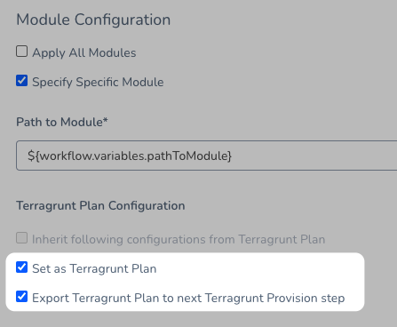
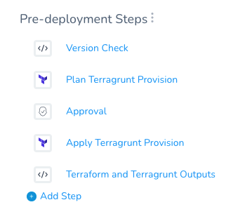

The Terragrunt Provision step in a Workflow can be executed as a dry run, just like running the `terragrunt plan` command.

The dry run will refresh the state file and generate a plan, but not apply the plan. You can then set up an Approval step to follow the dry run, followed by the Terragrunt Provision step to inherit and apply the plan.

This topic covers using the Terragrunt Provision step for dry runs only. For steps on applying plans without a dry run, see [Provision using the Terragrunt Provision Step](provision-using-the-terragrunt-provision-step.md).

### Before You Begin

This topic assumes you have read the following:

* [Terragrunt Provisioning with Harness](../concepts-cd/deployment-types/terragrunt-provisioning-with-harness.md)
* [Set Up Your Harness Account for Terragrunt](set-up-your-harness-account-for-terragrunt.md)
* [Add Terragrunt Configuration Files](add-terragrunt-configuration-files.md)
* [Map Dynamically Provisioned Infrastructure using Terragrunt](map-terragrunt-infrastructure.md)
* [Provision using the Terragrunt Provision Step](provision-using-the-terragrunt-provision-step.md)

### Visual Summary

The following graphic shows a common use of a Terragrunt dry run in deployments.


1. The dry run is used to verify the provisioning.
2. An Approval step to ensure that the Terragrunt plan is working correctly.
3. The plan is run and the infrastructure is provisioned.
4. The app is deployed to the provisioned infrastructure.

In a Harness Workflow it looks something like this:


### Limitations

The Terragrunt and Terraform Plans are stored in the default Harness Secrets Manager as encrypted text. This is because plans often contain variables that store secrets.

The plan size must not exceed the secret size limit for secrets in your default Secret Manager. AWS Secrets Manager has a limitation of 64KB. Other supported Secrets Managers support larger file size.

See [Add a Secrets Manager](https://docs.harness.io/article/uuer539u3l-add-a-secrets-manager).

### Step 1: Set Terragrunt Step as Plan

This step assumes you are familiar with adding the Terragrunt Provision step. See [Provision using the Terragrunt Provision Step](provision-using-the-terragrunt-provision-step.md).

To perform a dry run of your Terragrunt Provision step, you simply select the **Set as Terragrunt Plan** option.


That's it. Now this Terragrunt Provision step will run like a `terragrunt plan` command.

The dry run will refresh the state file and generate a plan but it is not applied. You can then set up an Approval step to follow the dry run, followed by a Terragrunt Provision step to apply the plan.

In the subsequent Terragrunt Provision step, you will select the **Inherit configurations from previous Terragrunt Provision step** option to apply the plan.

This is just like running the `terragrunt plan` command before a `terragrunt apply` command.

### Option: Export Terragrunt Plan to next Terragrunt Provision step

This option supports modules with [Terraform version 12](https://www.terraform.io/upgrade-guides/0-12.html) only.When you use **Set as Terragrunt Plan** in the Terragrunt Provision step and then use **Inherit configurations from previous Terragrunt Provision step** in a subsequent Terragrunt Provision step, Harness does the following:

* Harness runs the Terragrunt provision again and points to the plan, runs a Terragrunt refresh, then a plan, and finally executes the new plan.

Technically, this is a different plan. If you want use the actual plan because of security or audit requirements, use **Export Terragrunt Plan to next Terragrunt Provision step** in the previous Terragrunt Provision step along with **Set as Terragrunt Plan**.



##### Notes

* If the **Export Terragrunt Plan to next Terragrunt Provision step** option is enabled in two consecutive Terragrunt Provision steps, the second Terragrunt Provision step overwrites the plan from the first Terragrunt Provision step.
* Harness uses the [Harness Secret Manager](https://docs.harness.io/article/uuer539u3l-add-a-secrets-manager) you have selected as your default in the export process. As a result, the size of the plan you can export is limited to the size of secret that Secret Manager allows.

### Step 2: Add Approval Step

Harness Workflow Approval steps can be done using Jira, ServiceNow, or the Harness UI. You can even use custom shell scripts. See [Approvals](https://docs.harness.io/article/0ajz35u2hy).

Add the Approval step after the Terragrunt Provision where you selected the **Set as Terragrunt Plan** option.

1. To add the Approval step, click **Add Step**, and select **Approval**.
2. In the **Approval** step, select whatever approval options you want, and then click **Submit**.

Next, we'll add a Terragrunt Provision step after the Approval step to actually run the Terragrunt Infrastructure Provisioner files.

If the Approval step takes a long time to be approved there is the possibility that a new commit occurs in the Git repo containing for Terragrunt or Terraform files. To avoid a problem, when the Workflow performs the dry run, it saves the commit ID of the script file. Later, after the approval, the Terragrunt Provision step will use the commit ID to ensure that it executes the script that was dry run.### Step 3: Add Terragrunt Step to Apply Plan

For the Terragrunt Provision step that actually runs the Terragrunt Infrastructure Provisioner script (`terragrunt` `apply`), all you need to do is select the **Inherit configurations from previous Terragrunt Provision step** option.

When you select this option, the Terragrunt Provision step inherits the settings of the Terragrunt Provision step that preceded it.

After the Approval step, click **Add Step**.

Select or add a **Terragrunt** **Provision** step.

In **Name**, enter a name for the step to indicate that it will perform the provisioning. For example, **Apply Terragrunt Provisioning**.

In **Provisioner**, select the Harness Terragrunt Infrastructure Provisioner you want to run. This is the same Terragrunt Infrastructure Provisioner you selected in the previous Terragrunt Provision step.

Select the **Inherit configurations from previous Terragrunt Provision step** option.


Click **Submit**.

You do not need to enter any more settings. The Terragrunt Provision step inherits the settings of the Terragrunt Provision step that preceded it.

Your Workflow now looks something like this:



### Step 4: Deploy

Deploy your Workflow and see the `terragrunt plan` executed in the first Terragrunt Provision step.


```
Generating ************** plan   
  
terragrunt plan -out=tfplan -input=false   -var-file="/opt/harness-delegate/./terragrunt-working-dir/kmpySmUISimoRrJL6NL73w/235638175/terragrunt-script-repository/variables/local_variables/**************.tfvars"    
Refreshing Terraform state in-memory prior to plan...  
The refreshed state will be used to calculate this plan, but will not be  
persisted to local or remote state storage.  
  
...  
  
This plan was saved to: tfplan  
  
To perform exactly these actions, run the following command to apply:  
    ************** apply "tfplan"  
  
  
Generating json representation of tfplan   
  
terragrunt show -json tfplan  
  
Json representation of tfplan is exported as a variable ${**************Apply.tfplan}   
  
Finished terragrunt plan task
```
Next, approve the Approval step.

Finally, see the `terragrunt apply` executed as part of the final Terragrunt Provision step.


```
terragrunt apply -input=false tfplan  
null_resource.delaymodule3: Creating...  
null_resource.delaymodule3: Provisioning with 'local-exec'...  
null_resource.delaymodule3 (local-exec): Executing: ["/bin/sleep" "5"]  
null_resource.delaymodule3: Creation complete after 5s [id=932665668643318315]  
  
Apply complete! Resources: 1 added, 0 changed, 0 destroyed.  
  
...  
  
State path: **************.tfstate  
  
Outputs:  
  
clusterName = us-central1-a/harness-test  
sleepoutputModule3 = 10  
versionModule3 = 5  
terragrunt output --json > /opt/harness-delegate/./terragrunt-working-dir/kmpySmUISimoRrJL6NL73w/235638175/terragrunt-script-repository/prod-no-var-required/**************-235638175.tfvars  
Finished terragrunt apply task
```
### Next Steps

Removing provisioned infrastructure is a common Terragrunt and Terraform-related task. You can add this task to your Harness Workflow and automate it. See [Remove Provisioned Infra with Terragrunt Destroy](remove-provisioned-infra-with-terragrunt-destroy.md) and [Remove Provisioned Infra with Terraform Destroy](../terraform-category/terraform-destroy.md).

