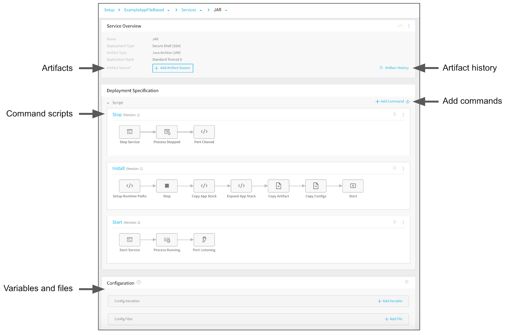

The Harness Secure Shell (SSH) Service contains the application package artifact (file or metadata) and the related commands to execute on the target host. It also included scripts for installing and running an application stack, if needed.

In this topic, we will show you how to create the Service for your application package artifact, add additional scripts, and add an application stack.

### Before You Begin

* [Connect to Your Repos and Target SSH Platforms](connect-to-your-target-ssh-platform.md)
* [Traditional Deployments Overview](traditional-deployments-overview.md)
* [Harness Key Concepts](https://docs.harness.io/article/4o7oqwih6h-harness-key-concepts)

### Step 1: Create a Harness SSH Service

To create a Service for an application package, do the following:

1. In your Application, click **Services**, and then click **Add Service**. The **Add Service** settings appear.
2. In **Name**, enter a name for the Service. You will use this name when selecting this Service in Harness Environments, Workflows, and other components. For more information, see  [Services](https://docs.harness.io/article/eb3kfl8uls-service-configuration).
3. In **Deployment Type**, select **Secure Shell (SSH)**. All file-based Services are Secure Shell (SSH) deployments.The **Artifact Type** and **Application Stack** settings appear.

### Step 2: Select an Artifact Type

In **Artifact Type**, select the file type of your artifact. For example, **Java Archive (JAR)**.

#### Supported Packaging Formats

Harness supports the following traditional deployment packaging formats: WAR, JAR, TAR, RPM, ZIP, Docker, and custom files.

All of these formats are also supported by other Harness deployment types, such as Kubernetes, Helm, PCF, ECS, etc.  This topic is concerned with traditional deployments outside of the container orchestration platforms.

### Option: Select an Application Stack

In **Application Stack**, select the app stack you want to use to as a runtime environment for your application, such as Tomcat.

When the Service is created, it contains the scripts need to install the application stack.


If you are deploying to an existing instance that already has an app stack installed, you can leave **Application Stack** empty. For more information, see  [Add Application Stacks](https://docs.harness.io/article/g26sp2ay68-catalog).

### Review: Secure Shell Service Sections

The Service page has the following important sections:

* **Artifact Source** - The package files you want deployed are added here. In some cases an actual file is obtained, but in most cases metadata is sufficient.
* **Artifact History** - You can manually pull metadata on your artifacts to see their builds and versions.
* **Script** - The scripts to set up your files. These will typically include application stack setup unless your target hosts already have the application stack set up.
* **Add Commands** - You can add new commands from an Application or Shared Template Library, or simply add a blank command and add Harness scripts to it.
* **Configuration** - You can add variables and files to use in your Service scripts. These can be encrypted by Harness, allowing you to use secrets. The variables and files can be overwritten in Environments and Workflows.



### Review: Software Required by Commands

The commands in the Service will be executed on your target hosts, and so any of the software used in the commands must be installed on the target hosts.

For example, the **Port Listening** command uses netcat (nc):


```
...  
nc -v -z -w 5 localhost $port  
...
```
You can install nc on your target hosts simply by running: `yum install -y nc`

You can install the required software by adding an **Exec** command to the Service that installs the software.

### Step 3: Add Your Artifact Source

The Artifact Source for the Service lists the file(s) that you want copied to the target host(s). The Artifact History will manually pull artifact build and version metadata from the Artifact Source.

Before you can add an artifact source, you need to add a Harness Artifact Server or Cloud Provider. 

If your artifact files are located on cloud platform storage like AWS S3, GCP Storage, or Azure Storage, you can add a Cloud Provider. 

If the files are located in a repo such as Artifactory or an automation server such as Jenkins, you can create an Artifact Server.

For more information, see  [Add Artifact Servers](https://docs.harness.io/article/7dghbx1dbl-configuring-artifact-server) and  [Add Cloud Providers](https://docs.harness.io/article/whwnovprrb-cloud-providers).

To add an artifact source, do the following:

1. Click **Add Artifact Source**, and select the repo or cloud platform where the artifact is located. The dialog for the artifact source appears. This guide will use AWS S3 as an example.
2. In **Cloud Provider**, select the Harness Cloud Provider to use to locate your artifact file.
3. In **Bucket**, select the name of the bucket containing your artifact.
4. In **Artifact Path**, click the artifact Harness located in the bucket you selected in Bucket. If the artifact is at the root of the bucket, then just the filename is provided. If the artifact is in a folder, the file path is provided also.  
Harness uses **Metadata Only** to download the file on the target host.  
Metadata is sufficient as it contains enough information for the target host(s) to obtain or build the artifact. Harness stores the metadata.   
During runtime, Harness passes the metadata to the target host(s) where it is used to obtain the artifact(s). Ensure that the target host has network connectivity to the Artifact Server. For more information, see  [Service Types and Artifact Sources](https://docs.harness.io/article/qluiky79j8-service-types-and-artifact-sources).
5. Click SUBMIT. The artifact source is listed.

### Option: View Artifact History

When you add an Artifact Source to the Service, Harness will pull all the build and version history metadata for its artifacts. You can see the results of the pull in **Artifact History** and, if you do not see a build/version you expected, you can manually pull them.

To view the artifact history,  do the following:

1. Click **Artifact History**. This assistant lists the artifact builds and versions Harness has pulled.
2. In the **Artifact History** assistant, click **Manually pull artifact**. The **Manually Select An Artifact** dialog appears.
3. In **Artifact Stream**, click the Artifact Source you added to the Service.
4. In **Artifact**, select an artifact build/version, and then click **SUBMIT**.
5. Click **Artifact History** to view the history.

Now all available artifact builds and version history metadata is displayed.

### See Also

* [Add Scripts for Traditional (SSH) Deployments](add-deployment-specs-for-traditional-ssh-deployments.md)

### Configure As Code

To see how to configure the settings in this topic using YAML, configure the settings in the UI first, and then click the **YAML** editor button.

