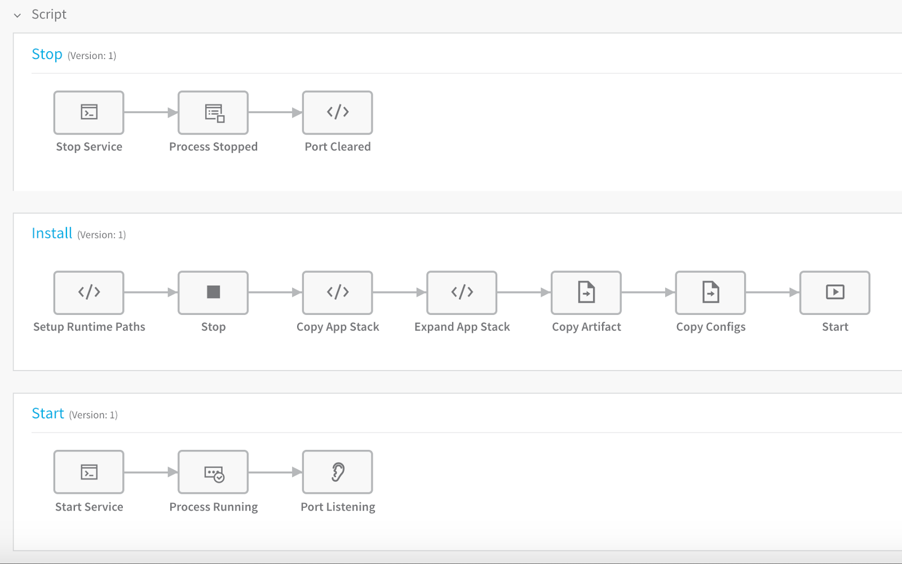
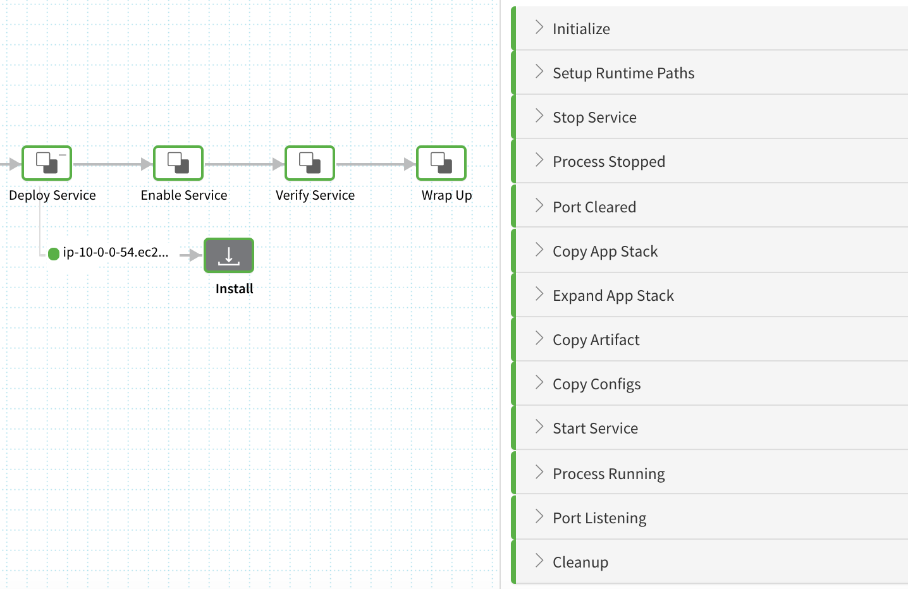
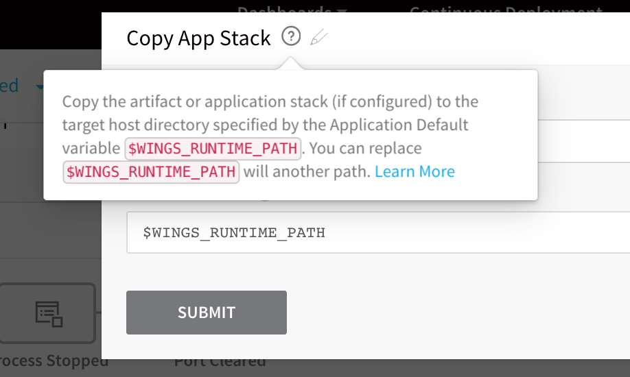

When you create the Harness Secure Shell (SSH) Service, Harness automatically generates the commands and scripts needed to install the app and stack on the target host, copy the file(s) to the correct folder, and start the app.

### Before You Begin

* [Connect to Your Repos and Target SSH Platforms](connect-to-your-target-ssh-platform.md)
* [Traditional Deployments Overview](traditional-deployments-overview.md)
* [Add Artifacts and App Stacks for Traditional (SSH) Deployments](add-artifacts-for-ssh-deployments.md)

### Visual Summary

Here is an example of the default scripts and commands Harness generates when you first create your Secure Shell (SSH) Service:

### Review: Script Execution Order

When you look at the default commands in a file-based Service, their order of execution might be confusing. For example, it looks like they are executed like this: 

But they are actually executed like this: 

The order is clearer when you see the deployment in the **Deployments** page:

### Step 1: Add Commands and Scripts

The default scripts Harness generates will deploy the artifact and app package you add to the Service. No further changes are required.

If you like, you can add commands and scripts using the **Add Command** settings, and by clicking the plus icon in the commands.

All of the scripts include tooltips to explain how to use them:

### Review: Download Artifact and Exec Scripts

The Download Artifact script is supported for Amazon S3, Artifactory, SMB (PowerShell-only), SFTP (PowerShell-only), Azure DevOps artifacts, Nexus, Jenkins, and Bamboo. For other artifact sources, add a new command and use the Exec script to download the artifact. For more information, see  [Exec Script](../model-cd-pipeline/setup-services/service-types-and-artifact-sources.md#exec-script).

### Review: Harness and Custom Variables

You can use Harness built-in variables in your Service scripts, or add your own variables and reference them in your scripts.

For information on Harness built-in variables, see  [What is a Harness Variable Expression?](../../firstgen-platform/techref-category/variables/variables.md). For information on using variables in your scripts, see  [Add Service Config Variables](../model-cd-pipeline/setup-services/add-service-level-config-variables.md) and [Add Service Config Files](../model-cd-pipeline/setup-services/add-service-level-configuration-files.md).

### See Also

* [Set Default Application Directories as Variables](../model-cd-pipeline/applications/set-default-application-directories-as-variables.md)
* [Override Variables at the Infrastructure Definition Level](../kubernetes-deployments/override-variables-per-infrastructure-definition.md)

### Configure As Code

To see how to configure the settings in this topic using YAML, configure the settings in the UI first, and then click the **YAML** editor button.

