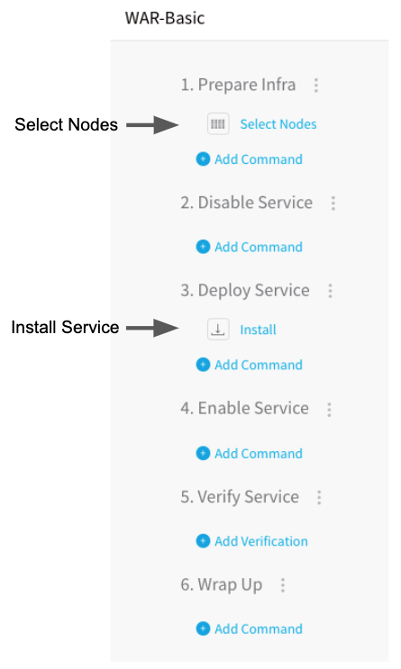
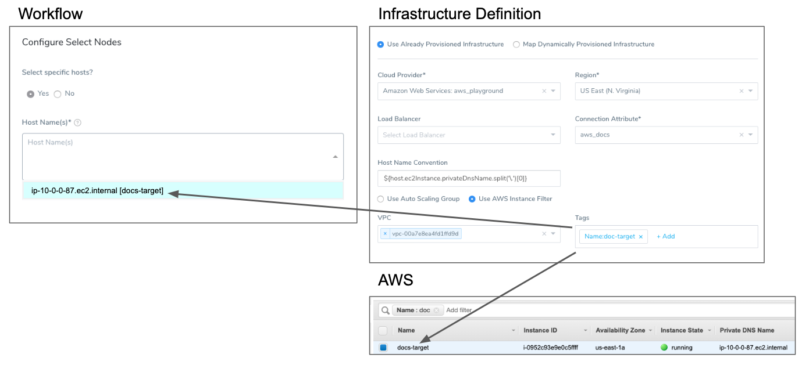
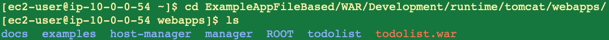

Traditional (SSH) deployments involve obtaining an application package from an artifact source, such as a WAR file in an AWS S3 bucket, and deploying it to a target host, such as a virtual machine.


Typically, the Harness Basic Workflow is used for Traditional deployments, but Harness provides Canary and Rolling Workflows for Traditional deployments also.


In this topic, we will use the Basic Workflow to demonstrate a simple Traditional deployment.


For a Build and Deploy Pipeline using a Traditional deployment, see
 [Artifact Build and Deploy Pipelines Overview](../concepts-cd/deployment-types/artifact-build-and-deploy-pipelines-overview.md).

### Before You Begin


* [Add Artifacts and App Stacks for Traditional (SSH) Deployments](add-artifacts-for-ssh-deployments.md)
* [Connect to Your Repos and Target SSH Platforms](connect-to-your-target-ssh-platform.md)
* [Traditional Deployments Overview](traditional-deployments-overview.md)
* [Harness Key Concepts](https://docs.harness.io/article/4o7oqwih6h-harness-key-concepts)


### Supported Platforms and Technologies


See **SSH** in
 [Supported Platforms and Technologies](https://docs.harness.io/article/220d0ojx5y-supported-platforms).


### Review: Basic Workflows


The Basic deployment Workflow is the most common Workflow type for traditional, package file-based deployments. Basic Workflows simply select nodes in the deployment infrastructure and install and start the application attached to the Harness Service.





### Step 1: Create the Workflow


To create a Basic Workflow for a Traditional deployment, do the following:


1. In your Harness Application, click **Workflows**.
2. In **Workflows**, click **Add Workflow**. The **Workflow** dialog appears.
3. In **Name**, enter a name for the Workflow.
4. In **Workflow Type**, select **Basic Deployment**.
5. In **Environment**, select the Environment where the Infrastructure Definition you defined for your deployment is located.
6. In **Service**, select the SSH Service to be deployed.
7. In **Infrastructure Definition**, select your target infrastructure.
8. Click **SUBMIT**. The Workflow is created.


Let's look at the two default steps in the Workflow, **Select Nodes** and **Install**.


### Step 2: Select Target Nodes


The **Select Nodes** step selects the target hosts from the Infrastructure Definition you defined. You can choose to select a specific host or simply specify the number of instances to select with the Infrastructure Definition criteria.


The following image shows an **Infrastructure Definition** specifying an AWS Region, VPC, and Tags (**Name:doc-target**), the EC2 instance that meets that criteria, and the host name in the Node Select dialog.




For details, see
 [Select Nodes Workflow Step](https://docs.harness.io/article/9h1cqaxyp9-select-nodes-workflow-step).


### Step 3: Install and Run the Application and Stacks


The Install step runs the command scripts in your Service on the target host.


For details, see
 [Install Workflow Step](https://docs.harness.io/article/2q8vjxdjcq-install-workflow-step).


### Review: Rollbacks


There are not many causes for a rollback of a Basic Workflow using application packages. Artifact issues are uncommon because the artifact must be available to the Harness Delegate before you deploy. If the Delegate cannot reach the target host, the deployment
 will fail without changing the target host, and so no rollback is needed.


### Example: Basic Workflow Deployment


The Basic Workflow is the most common deployment of Services deploying application packages. Once you've successfully deployed the Workflow, you can click the **Install** step to see the Service commands and scripts in the **Deployments** page.


You can expand logs for each script in the **Install** step to see the log of its execution by the Harness Delegate. For example, here is the **Copy Artifact** script copying the application package **todolist.war** to
 the runtime location set up in Application Defaults (`$HOME/${app.name}/${service.name}/${env.name}/runtime`):


```
Begin execution of command: Copy Artifact  
  
Connecting to ip-10-0-0-54.ec2.internal ....  
  
Connection to ip-10-0-0-54.ec2.internal established  
  
Begin file transfer todolist.war to ip-10-0-0-54.ec2.internal:/home/ec2-user/ExampleAppFileBased/WAR/Development/runtime/tomcat/webapps  
  
File successfully transferred  
  
Command execution finished with status SUCCESS
```

You can SSH into the target host and see the application package:





### See Also


* [Artifact Build and Deploy Pipelines Overview](../concepts-cd/deployment-types/artifact-build-and-deploy-pipelines-overview.md)
* [Trigger Workflows and Pipelines](https://docs.harness.io/article/xerirloz9a-add-a-trigger-2)


### Configure As Code


To see how to configure the settings in this topic using YAML, configure the settings in the UI first, and then click the **YAML** editor button.

