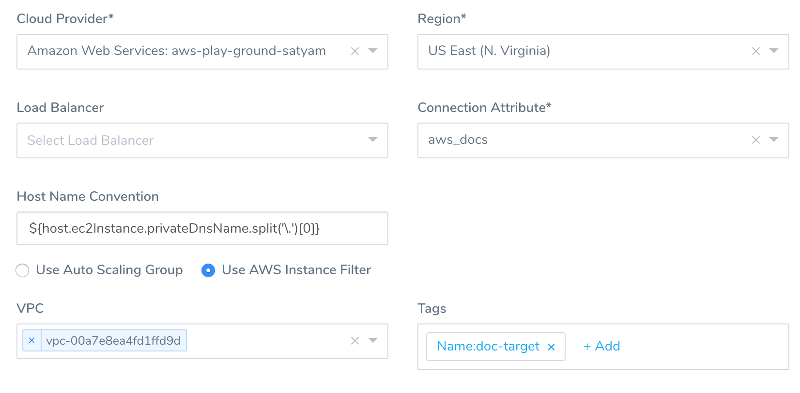

Harness [Infrastructure Definitions](https://docs.harness.io/article/v3l3wqovbe-infrastructure-definitions) specify the target deployment infrastructure for your Harness Services, and the specific infrastructure details for the deployment, like VPC settings.

In this topic, we describe how to add an Infrastructure Definition for your Traditional (SSH) deployment.


### Before You Begin

* [Connect to Your Repos and Target SSH Platforms](connect-to-your-target-ssh-platform.md)
* [Traditional Deployments Overview](traditional-deployments-overview.md)
* [Harness Key Concepts](https://docs.harness.io/article/4o7oqwih6h-harness-key-concepts)

### Review: Target Host Requirements

The MaxSessions setting on the target host(s) must be set to a minimum of 2. This is a requirement for multiplexing.

If MaxSessions is set to 1, the `error JSchException: channel is not opened` can occur during deployment.

The [default for MaxSessions](https://linux.die.net/man/5/sshd_config) is set in **/etc/ssh/sshd\_config** and is 10.

To set MaxSessions, do the following:

1. Edit to /etc/ssh/sshd\_config on the target host(s).
2. Modify **MaxSessions 1** line and change it to **MaxSessions 2** or greater. The default is **MaxSessions 10**.
3. Restart SSD service: `sudo service sshd restart`

### Visual Summary

For example, here is an Infrastructure Definition using an AWS Cloud Provider, and specifies the AWS infrastructure settings for the target AWS VPC and host.


Later, when you create a Workflow, you will select the Service and this Infrastructure Definition.

### Review: Software Required by Commands

The commands in the Service will be executed on your target hosts to identify in the Infrastructure Definition, and so any of the software used in the commands must be installed on the target hosts.

For example, the **Port Listening** command uses netcat (nc):


```
...  
nc -v -z -w 5 localhost $port  
...
```
You can install nc on your target hosts simply by running: `yum install -y nc`

You can install the required software by adding an **Exec** command to the Service that installs the software.

### Step 1: Create an Environment

Environments represent one or more of the deployment infrastructures where you want to deploy your application package files. Within an Environment, you add an Infrastructure Definition for each specific deployment infrastructure, using a Cloud Provider and the specific infrastructure details for the deployment, like VPC settings.

For details on creating an Environment, see  [Environments](https://docs.harness.io/article/n39w05njjv-environment-configuration).

### Step 2: Define Target Infrastructure

As an example, we will create an Infrastructure Definition for an AWS EC2 target infrastructure.

To add an Infrastructure Definition, do the following:

1. In your Harness Application Environment, click **Add Infrastructure Definition**. The **Infrastructure Definition** dialog appears.
2. In **Name**, enter the name you will use when you select this Infrastructure Definition in Workflows.
3. In **Cloud Provider Type**, select the type of Cloud Provider that this Infrastructure Definition will use for connections. For example, select **Amazon Web Services** for AWS EC2 infrastructures.
4. In **Deployment Type**, select the deployment type for the Services that will use this Infrastructure Definition. For example, if you are deploying SSH type Services like JAR, WAR, etc, you would select **Secure Shell (SSH)**.
5. Click **Use Already Provisioned Infrastructure**. If you were using a Harness  [Infrastructure Provisioner](https://docs.harness.io/article/o22jx8amxb-add-an-infra-provisioner), you would select **Map Dynamically Provisioned Infrastructure**.
6. In **Cloud Provider**, select the Cloud Provider you set up to connect Harness to your deployment infrastructure.
7. Fill out the remaining settings. These settings will look different depending on the Cloud Provider you selected. For example, for an AWS Cloud Provider, you will see AWS-specific settings, such as **Region** and **Auto Scaling Group**.  
When you select a region, more settings appear, such as **VPC** and **Tags**.
8. Provide the settings for your infrastructure. For example, here are the settings for an AWS infrastructure that identify the target host using AWS EC2 Tags.



##### Using Variable Expressions in Tags

**Tags** support [Harness variable expressions](https://docs.harness.io/article/9dvxcegm90-variables) from Harness Services, Environment Overrides, Workflows, and secrets.

**Tags** does not support file-based variable expressions.

For example, in **Tags**, `automation:${serviceVariable.automationValue}` and `automation:${workflow.variables.automationValue}` will work, but `automation:${configFile.getAsString("automationFile")}` will **not** work.

1. When you are finished, click **SUBMIT**. The Infrastructure Definition is added.

For AWS Infrastructure Definitions, you can use [Workflow variables](https://docs.harness.io/article/766iheu1bk-add-workflow-variables-new-template) in the **Tags** setting. This allows you to parameterize the **Tags** setting, and enter or select the AWS tags to use when you deploy any Workflow that uses this Infrastructure Definition.### Option: Scope to Specific Service

In **Scope to specific Services**, you can select the Service(s) that you want to use this Infrastructure Definition.

### Review: SSH Key for Connection Attributes

When you set up the Infrastructure Definition in Harness to identify the target host(s) where your file will be deployed, you also add **Connection Attributes** that use a Harness SSH Key secret. This key is used by the Harness Delegate to SSH into the target host.

For more information, see  [Add SSH Keys](https://docs.harness.io/article/gsp4s7abgc-add-ssh-keys).

### See Also

* [Create a Basic Workflow for Traditional (SSH) Deployments](create-a-basic-workflow-for-traditional-ssh-deployments.md)

### Configure As Code

To see how to configure the settings in this topic using YAML, configure the settings in the UI first, and then click the **YAML** editor button.

