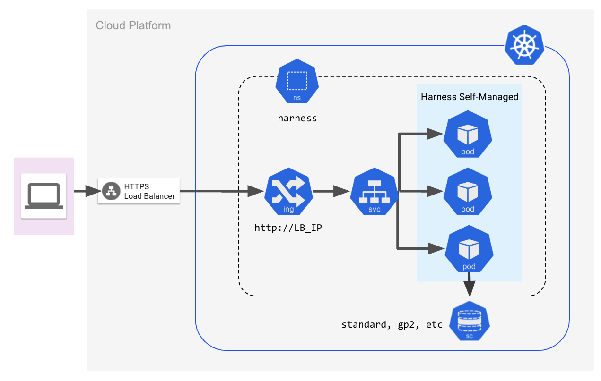
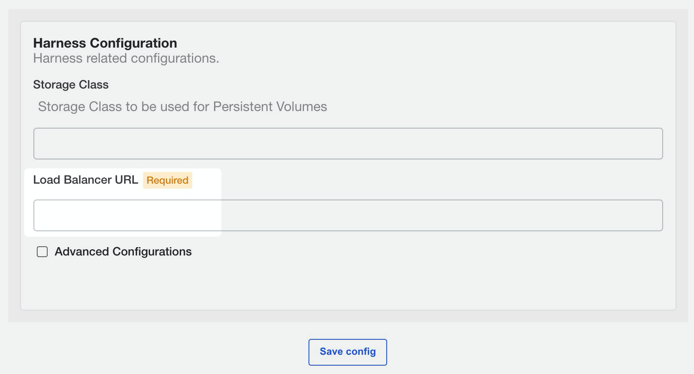

This document lists the infrastructure requirements for installing Harness Self-Managed Enterprise Edition - Kubernetes Cluster in an existing Kubernetes cluster.

### Production Installation

Here are the requirements for each microservice.

| **Microservice** | **Pods** | **CPU / Pod** | **Memory / Pod** | **Total CPU** | **Total Memory** |
| :-- | :-: | :-: | :-: | :-: | :-: |
| Manager | 2 | 2 | 4 | 4 | 8 |
| Verification | 2 | 1 | 3 | 2 | 6 |
| Machine Learning Engine | 1 | 8 | 2 | 8 | 2 |
| UI | 2 | 0.25 | 0.25 | 0.5 | 0.5 |
| MongoDB | 3 | 4 | 8 | 12 | 24 |
| Proxy | 1 | 0.5 | 0.5 | 0.5 | 0.5 |
| Ingress | 2 | 0.25 | 0.25 | 0.5 | 0.5 |
| TimescaleDB | 3 | 2 | 8 | 6 | 24 |
| KOTS Admin Pods |   |   |   | 4 | 8 |
| **Total** |  |  |  | **37.5** | **73.5** |

The KOTS Admin Pods requirements support a full stack. In an existing cluster, they will likely be lower.

### Dev Installation

Here are the requirements for each microservice.

| **Microservice** | **Pods** | **CPU / Pod** | **Memory / Pod** | **Total CPU** | **Total Memory** |
| :-- | :-: | :-: | :-: | :-: | :-: |
| Manager | 1 | 2 | 4 | 2 | 4 |
| Verification | 1 | 1 | 3 | 1 | 3 |
| Machine Learning Engine | 1 | 3 | 2 | 3 | 2 |
| UI | 1 | 0.25 | 0.25 | 0.25 | 0.25 |
| MongoDB | 3 | 2 | 4 | 6 | 12 |
| Proxy | 1 | 0.5 | 0.5 | 0.5 | 0.5 |
| Ingress | 1 | 0.25 | 0.25 | 0.25 | 0.25 |
| TimescaleDB | 1 | 2 | 8 | 2 | 8 |
| Kots Admin Pods |   |   |   | 4 | 8 |
| **Total** |  |  |  | **19** | **38** |

### Recommended Nodes Specifications

Node Specifications: 8 cores vCPU, greater than 12 GB memory.

### Storage Requirements

You should have a Kubernetes Storage Class attached to the Kubernetes cluster.

You need to provide the StorageClass name during installation.

Harness uses a total 1000 GB of space distributed as:

* MongoDB - 3 pods \* 200 GB each = 600 GB
* Timescale DB - 3 pods \* 120 GB each = 360 GB
* Redis: 40 GB total
* Note: For POC installation, total requirement will be: 200 GB total
* MongoDB - 3 pods \* 50 GB each = 150 GB
* Timescale DB - 1 pods \* 20 GB each = 20 GB
* Redis: 30 GB total

### Allowlist and Outbound Access Requirements

Add the following URLs to your allowlist:

* kots.io — Kots pulls the latest versions of the kubectl plugin and Kots admin console.
* app.replicated.com — Kots admin console connects to check for the availability of releases according to your license
* proxy.replicated.com — Proxy your registry to pull your private images.

Outbound access to the following URLs:

* proxy.replicated.com​
* replicated.app
* k8s.kurl.sh​
* app.replicated.com

:::note
Outbound access is required only for **connected installation**. Outbound access is not required for air-gap installation. For more information on installing KOTS in an air-gapped environment, see [Installing on an Existng Cluster](https://kots.io/kotsadm/installing/airgap-packages/).
:::

If your cluster does not have direct outbound connectivity and needs a proxy for outbound connections, use these instructions: [https://docs.docker.com/network/proxy](https://docs.docker.com/network/proxy/) to set up a proxy on the node machines.

### Cluster and Network Architecture

The following diagram illustrates the simple cluster and networking architecture for an Harness Self-Managed Enterprise Edition - Kubernetes Cluster setup.

The following sections go into greater detail.

### Namespace Requirements

In the examples in all Harness Self-Managed Enterprise Edition documentation, we use the `harness` namespace.

If you use a different namespace, make sure you update any `spec` samples provided by Harness.

### Load Balancer

You need to set up a load balancer before installing Harness Self-Managed Enterprise Edition.

During installation, you will provide the load balancer URL in the KOTS admin console.

After Harness Self-Managed Enterprise Edition is installed, the load balancer is used to access the Harness Manager UI using a web browser.

Follow the steps on creating the load balancer as part of the process described in [Harness Self-Managed Enterprise Edition - Kubernetes Cluster Setup](kubernetes-on-prem-existing-cluster-setup.md).

##### Port Mapping for gRPC Traffic

You must also open port 9879 on the load balancer and map it to port 9879 on the ingress controller. This is to support gRPC traffic.

### Trusted Certificate Requirement for Harness Self-Managed Enterprise Edition

Connections to Harness Manager can be secure or unencrypted. This depends on the URL scheme you apply when you configure the load balancer URL during installation (`https://` or `http://`).

To securely connect Harness Delegate and integrations like Github Webhooks to Harness Manager, you must use a publicly trusted certificate. Harness does not support self-signed certificates for connections to Harness Manager.

For connections from Harness Manager to an integration, you can use a self-signed certificate. In this case, you must import the self-signed certificate into the delegate's JRE keystore manually or by using a delegate profile. For information on the use of profiles, see [Run scripts on the delegate using profiles](../../firstgen-platform/account/manage-delegates/run-scripts-on-the-delegate-using-profiles.md).

See [Add Self-Signed Certificates for Delegate Connections](../../firstgen-platform/account/manage-delegates/add-self-signed-certificates-for-delegate-connections.md).

:::note
You can use self-signed certs for TLS connections between the MongoDB that ships with Harness and the Harness microservices. See [Enable TLS/SSL between MongoDB and Harness Components](../vm/on-prem-embedded-cluster-setup.md#enable-tls-ssl-between-mongo-db-and-harness-components).
:::

### Install Harness Self-Managed Enterprise Edition

Now that you have set up the requirements, proceed with installation in [Harness Self-Managed Enterprise Edition - Kubernetes Cluster Setup](kubernetes-on-prem-existing-cluster-setup.md).

