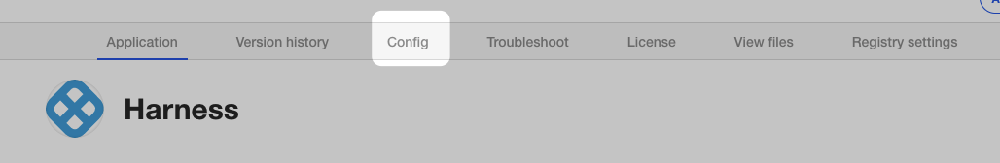
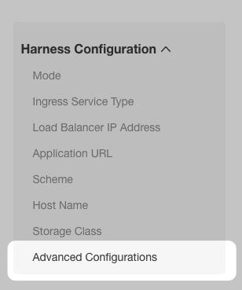
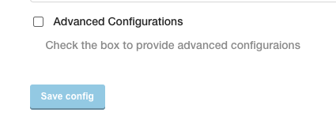
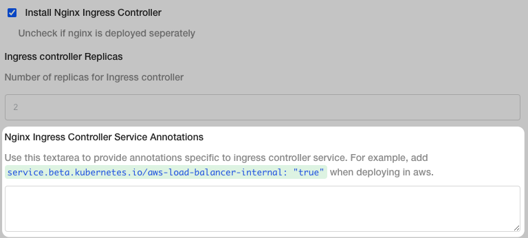

In Harness Self-Managed Enterprise Edition - Kubernetes Cluster, you can annotate the Ingress controller to customize its behavior.

Annotations are done in the KOTS admin tool's Nginx Ingress Controller Service Annotations settings. Next, you simply redeploy.

### Step 1: Open Advanced Configurations

In the KOTs admin tool, click **Config**.

Click **Advanced Configurations**.

Click **Advanced Configurations**.

Scroll down to **Nginx Ingress Controller Service Annotations**.

### Step 2: Annotate Nginx Ingress Controller Service

In **Nginx Ingress Controller Service Annotations**, enter the annotation(s). See [NGINX Ingress Controller Annotations](https://kubernetes.github.io/ingress-nginx/user-guide/nginx-configuration/annotations/) and [Ingress Controllers](https://kubernetes.io/docs/concepts/services-networking/ingress-controllers/) from Kubernetes for examples.

Click **Save Config**.

### Step 3: Deploy

Click **Version History** in the top nav.

Click **Deploy** for the new version.

