This topic covers installing Harness Self-Managed Enterprise Edition - Kubernetes Cluster in an existing Kubernetes cluster.

:::note 
This topic assumes that you are very familiar with Kubernetes, and can perform the standard Kubernetes and managing configurations using [Kustomize](https://kubernetes.io/docs/tasks/manage-kubernetes-objects/kustomization/) overlays.
:::

Harness Self-Managed Enterprise Edition - Kubernetes Cluster uses the [KOTS kubectl plugin](https://kots.io/kots-cli/get-started/) for installation. This topic covers installing KOTS in your existing cluster as part of setting up Harness Self-Managed Enterprise Edition.

Installing Harness Self-Managed Enterprise Edition into an existing Kubernetes cluster is a simple process where you prepare your existing cluster and network, and use the KOTS admin tool and Kustomize to complete the installation and deploy Harness.

## Cluster requirements

Do not perform any of the steps in this topic until you have set up the requirements in the [Harness Self-Managed Enterprise Edition - Kubernetes Cluster: Infrastructure Requirements](existing-cluster-kubernetes-on-prem-infrastructure-requirements.md) topic.

## Summary

Installing Harness in an existing cluster is performed as a [KOTS Existing Cluster Online Install](https://kots.io/kotsadm/installing/installing-a-kots-app/#existing-cluster-or-embedded-kubernetes).

This means that you use an existing Kubernetes cluster, as opposed to bare metal or VMs, and that your cluster makes outbound internet requests for an online installation.

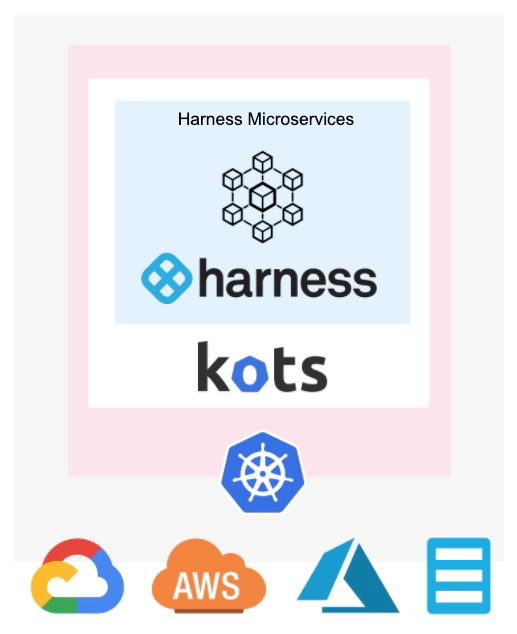

## Step 1: Set up cluster requirements

As stated earlier, follow the steps in the [Harness Self-Managed Enterprise Edition - Kubernetes Cluster: Infrastructure Requirements](existing-cluster-kubernetes-on-prem-infrastructure-requirements.md) topic to ensure you have your cluster set up correctly.

These requirements also include RBAC settings that might require your IT administrator to assist you unless your user account is bound to the `cluster-admin` cluster role.

Specifically, you need to create a KOTS admin role and bind it to the user that will install Harness. You also need to create a Harness `ClusterRole`.

## Step 2: Set up networking requirements

Perform the following steps to ensure that you have the load balancer set up for Harness Self-Managed Enterprise Edition.

Later, when you set up the kustomization for Harness Self-Managed Enterprise Edition, you will provide an IP address for the cluster load balancer settings.

Finally, when you configure the Harness Self-Managed Enterprise Edition application, you will provide the load balancer URL. This URL is what Harness Self-Managed Enterprise Edition users will use.

### Using NodePort?

If you are creating the load balancer's Service type using `NodePort`, create a load balancer that points to any port in the range of 30000 to 32767 on the node pool on which the Kubernetes cluster is running.

If you are using `NodePort`, you can skip to [Install KOTS](/docs/first-gen/fg-sme/k8s/kubernetes-on-prem-existing-cluster-setup.md#install-kots). 


### Set up a static external IP address

You should have a static IP address reserved to expose Harness outside the Kubernetes cluster.

For example, in the GCP console, click **VPC network**, and then click **External IP Addresses**.

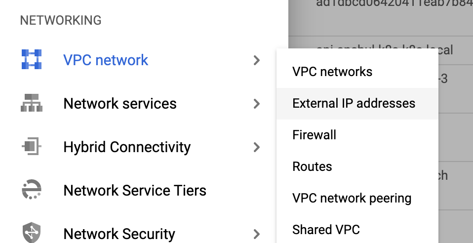

For more information, see [Reserving a static external IP address](https://cloud.google.com/compute/docs/ip-addresses/reserve-static-external-ip-address).

For GCP, the external IP address must be [Premium Tier](https://cloud.google.com/network-tiers/docs/overview#premium_tier).

### Set up DNS

Set up DNS to resolve the Harness Self-Managed Enterprise Edition domain name to the static IP address you reserved in the previous step.

For example, the domain name **harness.abc.com** resolves to the following static IP address:

```
host harness.abc.com  
harness.abc.com has address 192.0.2.0
```

You can test the DNS specification by using the `host <domain_name>` instruction.

## Review: OpenShift clusters

For OpenShift clusters, run the following commands after installing the KOTS plugin, but before installing Harness:


```
oc adm policy add-scc-to-user anyuid -z harness-serviceaccount -n harness
```

```
oc adm policy add-scc-to-user anyuid -z harness-default -n harness
```

```
oc adm policy add-scc-to-user anyuid -z default -n harness
```

For information about installing Harness Delegate on OpenShift, see [Delegates and OpenShift](/docs/first-gen/fg-sme/k8s/kubernetes-on-prem-existing-cluster-setup.md#delegates_and_open_shift).

## Option 1: Disconnected (air-gap) installation

The following steps will install KOTS from your private repository and the Harness Self-Managed Enterprise Edition license and air gap file you obtain from Harness.

1. Download the latest KOTS (kotsadm.tar.gz) release from <https://github.com/replicatedhq/kots/releases>.
2. Push KOTS images to your private registry:  

   ```
   kubectl kots admin-console push-images ./kotsadm.tar.gz <private.registry.host>/harness \  
   --registry-username <rw-username> \  
   --registry-password <rw-password>
   ```
   
3. Obtain the Harness license file from your Harness Customer Success contact or email [support@harness.io](https://mail.google.com/mail/?view=cm&fs=1&tf=1&to=support@harness.io).
4. Obtain the Harness air-gap file from Harness.
5. Log into your cluster.
6. Install KOTS and Harness using the following command:

   ```
   kubectl kots install harness   
   --namespace harness  
   --shared-password <password>   
   --license-file <path to license.yaml>  
   --config-values <path to configvalues.yaml>  
   --airgap-bundle <path to harness-<version>.airgap>  
   --kotsadm-registry <private.registry.url>  
   --registry-username <rw-username>   
   --registry-password <rw-password>
   ```
   
:::note
The `--namespace` parameter uses the namespace you created in [Harness Self-Managed Enterprise Edition - Kubernetes Cluster: Infrastructure Requirements](existing-cluster-kubernetes-on-prem-infrastructure-requirements.md). In this documentation, we use the namespace **harness****.**
:::

:::note
For the `--shared-password` parameter, enter a password for the KOTS admin console. Use this password to log into the KOTS admin tool.
:::

:::note
The `--config-values` parameter is required only for use in `config-values` files, as described in [Config Values](https://kots.io/kotsadm/installing/automating/#config-values) from KOTS.
:::

In terminal, it looks like this:

```
  • Deploying Admin Console  
    • Creating namespace ✓    
    • Waiting for datastore to be ready ✓  
```
The KOTS admin tool URL is provided:

```
  • Waiting for Admin Console to be ready ✓    
  
  • Press Ctrl+C to exit  
  • Go to http://localhost:8800 to access the Admin Console
```

Use the URL provided in the output to open the KOTS admin console in a browser.

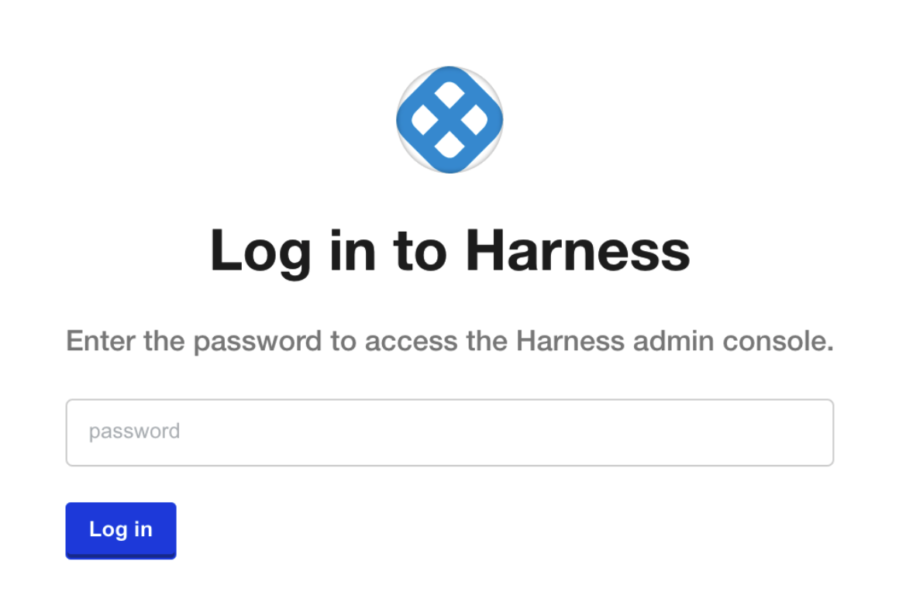Enter the password you provided earlier, and click **Log In**.

You might be prompted to allow a port-forward connection into the cluster.

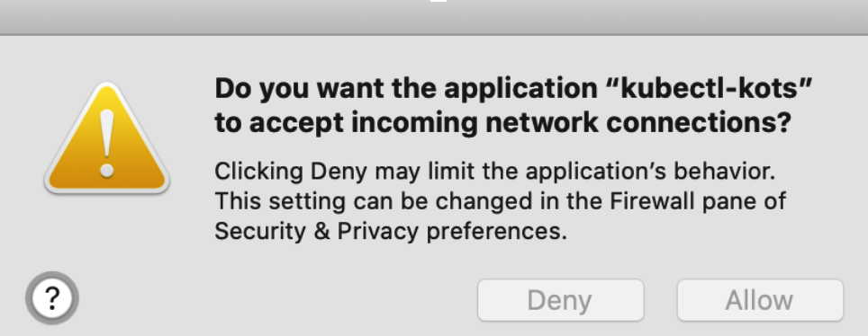

Now that KOTS and Harness are installed, you can perform the necessary configurations.

## Option 2: Connected installation

The following steps will install KOTS and Harness Self-Managed Enterprise Edition online. There is also an option to use a Harness Self-Managed Enterprise Edition airgap file instead of downloading Harness Self-Managed Enterprise Edition.

### Install KOTS plugin

1. Log into your cluster.
2. Install the KOTS kubectl plugin using the following command:

   `curl https://kots.io/install | bash`

The output of the command is similar to this:

   ```
   Installing replicatedhq/kots v1.16.1  
   (https://github.com/replicatedhq/kots/releases/download/v1.16.1/kots_darwin_amd64.tar.gz)...  
   ############################################ 100.0%#=#=-#  #  
   ############################################ 100.0%  
   Installed at /usr/local/bin/kubectl-kots
   ```

To test the installation, run this command:

`kubectl kots --help`

The KOTS documentation appears.

Now that KOTS is installed, you can install Harness Self-Managed Enterprise Edition into your cluster.

### Install KOTS

To install the KOTS Admin tool, enter the following command:

`kubectl kots install harness`

You are prompted to enter the namespace for the Harness installation. This is the namespace you created in [Harness Self-Managed Enterprise Edition - Kubernetes Cluster: Infrastructure Requirements](existing-cluster-kubernetes-on-prem-infrastructure-requirements.md).

In this documentation, we use the namespace **harness**.

In the terminal, it looks like this:

```
Enter the namespace to deploy to: harness  
  • Deploying Admin Console  
    • Creating namespace ✓    
    • Waiting for datastore to be ready ✓  
```

Enter a password for the KOTS admin console and press **Enter**. Use this password to log into the KOTS admin tool.

The KOTS admin tool URL is provided:

```
Enter a new password to be used for the Admin Console: ••••••••  
  • Waiting for Admin Console to be ready ✓    
  
  • Press Ctrl+C to exit  
  • Go to http://localhost:8800 to access the Admin Console
```

Use the URL provided in the output to open the KOTS admin console in a browser.


Enter the password you provided earlier, and click **Log In**.

You might be prompted to allow a port-forward connection into the cluster.


### Upload Your Harness license

Once you are logged into the KOTS admin console, you can upload your Harness license.

Obtain the Harness license file from your Harness Customer Success contact or email [support@harness.io](mailto:support@harness.io).

Drag your license YAML file into the KOTS admin tool:


Next, upload the license file:


Click **Upload license**.

Now that license file is uploaded, you can install Harness.

### Download Harness over the internet

If you are installing Harness over the Internet, click the **download Harness from the Internet** link.

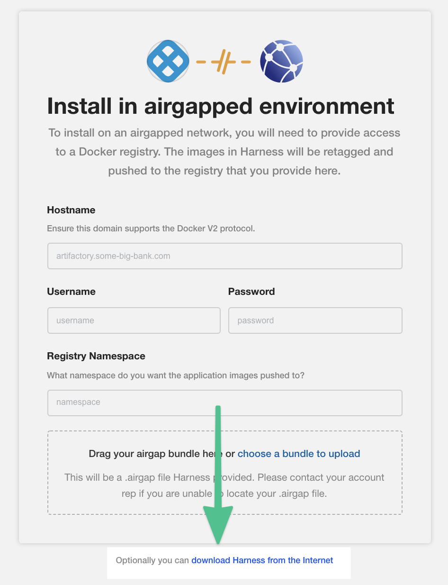

KOTS begins installing Harness into your cluster.

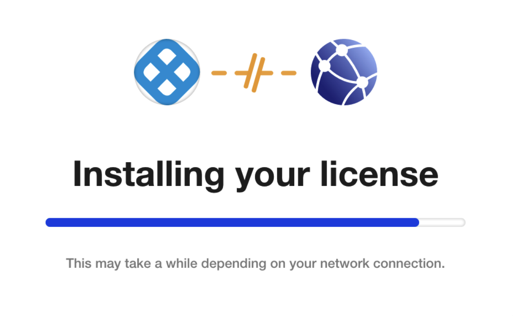

Next, you will configure Harness.

## Step 3: Configure Harness

Now that you have added your license you can configure the networking for the Harness installation.

If the KOTS Admin tool is not running, point `kubectl` to the cluster where Harness is deployed and run the following command: 

`kubectl kots admin-console --namespace harness`

In the KOTS admin tool, the **Configure Harness** settings appear.

Harness Self-Managed Enterprise Edition - Kubernetes Cluster requires that you provide a `NodePort` and Application URL.

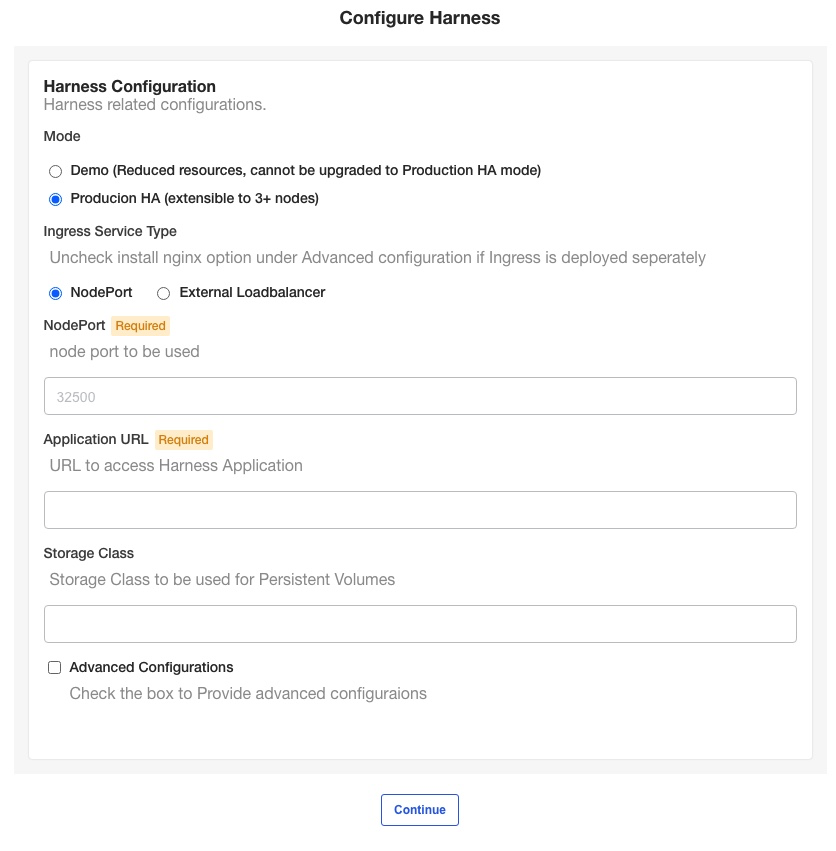

### Mode

* Select **Demo** to run Harness Self-Managed Enterprise Edition in demo mode and experiment with it.
* Select **Production HA** to run a production version of Harness Self-Managed Enterprise Edition.

### Ingress Service Type

By default, `nginx` is used for ingress automatically. If you are deploying `nginx` separately, do the following:

1. Click **Advanced Configurations**.
2. Disable the **Install Nginx Ingress Controller** option.

#### External traffic policy

You can select the external traffic policy for the ingress controller.


Select one of the following:

* Cluster
* Local

For information on how these options work, see [Preserving the client source IP](https://kubernetes.io/docs/tasks/access-application-cluster/create-external-load-balancer/#preserving-the-client-source-ip) from Kubernetes.

### Node port

Enter any port in the range 30000-32767 on the node pool on which the Kubernetes cluster is running.

If you do not enter a port, Harness uses 32500 by default.

### External Loadbalancer

Enter the IP address of the load balancer.

### Application URL

Enter the URL users will enter to access Harness. This is the DNS domain name mapped to the load balancer IP address.

When you are done, click **Continue**.

### Host name

The hostname is the DNS name or IP address of the load balancer.

### Storage class

You can also add a storage class. The name of the storage class depends on the provider where you are hosting your Kubernetes cluster. See [Storage Classes](https://kubernetes.io/docs/concepts/storage/storage-classes/#parameters) from Kubernetes.

If you don't provide a name, Harness will use `default`.

After Self-Managed Enterprise Edition is installed, use the following command to obtain a list of the storage classes in the namespace (in this example, **harness**):

`kubectl get storageclass -n harness`

Enter the name of the storage class.

### Option: Advanced configurations

In the **Advanced Configurations** section, there are a number of advanced settings you can configure. If this is the first time you've set up Harness Self-Managed Enterprise Edition, there's no reason to fine-tune the installation with these settings.

You can change the settings later in the KOTS admin console's Config tab:

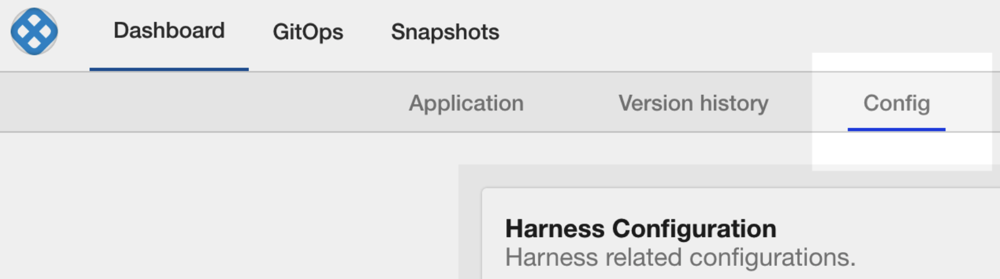

## Step 4: Perform preflight checks

Preflight checks run automatically and verify that your setup meets the minimum requirements.

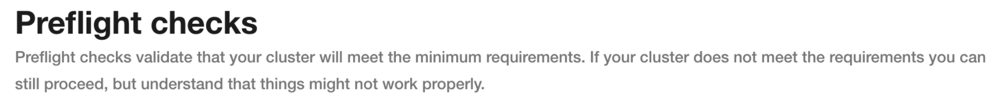

You can skip these checks, but we recommend you let them run.

Fix any issues in the preflight steps. A common example is the message:


```
Your cluster meets the minimum version of Kubernetes, but we recommend you update to 1.15.0 or later.
```

You can update your cluster's version of Kubernetes if you like.

## Step 5: Deploy Harness

When you are finished pre-flight checks, click **Deploy and** **Continue**.

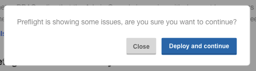

Harness is deployed in a few minutes.

In a new browser tab, go to the following URL, and replace `<LB_URL>` with the URL you entered in the **Application URL** setting in the KOTS admin console:

`<LB_URL>/auth/#/signup`

For example:

`http://harness.mycompany.com/auth/#/signup`

The Harness sign-up page appears.

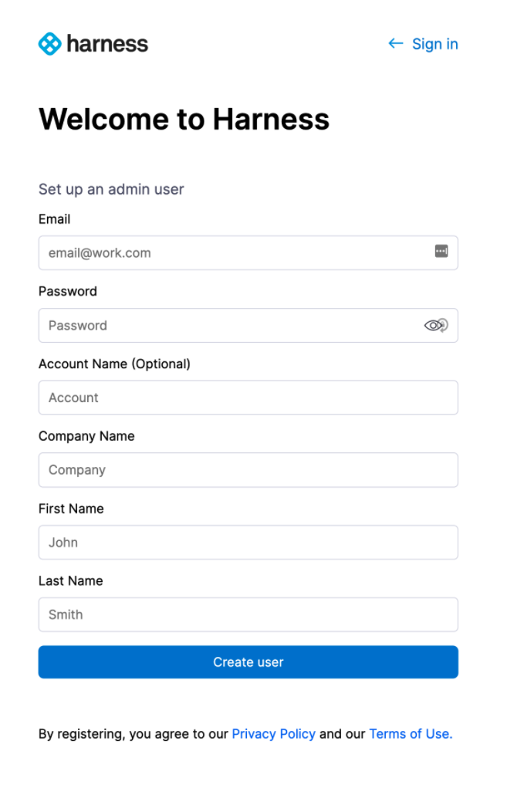

Sign up with a new account and then sign in.


Your new account will be added to the Harness Account Administrators User Group.

See [Managing Users and Groups (RBAC)](../../firstgen-platform/security/access-management-howtos/users-and-permissions.md).

### Future versions

To set up future versions of Harness Self-Managed Enterprise Edition, in the KOTS admin console, in the **Version history** tab, click **Deploy**. The new version is displayed in Deployed version.

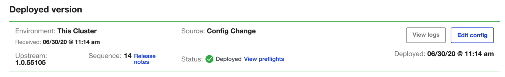

## Important next steps

:::note 
You cannot invite other users to Harness until a Harness delegate is installed and a Harness SMTP Collaboration Provider is configured.
:::

1. Install the Harness Delegate: [Delegate Installation Overview](../../firstgen-platform/account/manage-delegates/delegate-installation-overview.md).

2. Set up an SMTP Collaboration Provider in Harness for email notifications from the Harness Manager: [Add SMTP Collaboration Provider](../../firstgen-platform/account/manage-connectors/add-smtp-collaboration-provider.md).  

   Ensure you open the correct port for your SMTP provider, such as [Office 365](https://support.office.com/en-us/article/server-settings-you-ll-need-from-your-email-provider-c82de912-adcc-4787-8283-45a1161f3cc3).
   
3. [Add a Harness Secrets Manager](../../firstgen-platform/security/secrets-management/add-a-secrets-manager.md). By default, Harness Self-Managed Enterprise Edition installations use the local Harness MongoDB for the default Harness Secrets Manager. This is not recommended. 

After you install Harness Self-Managed Enterprise Edition, configure a new Secret Manager (Vault or AWS, for example). You will need to open your network for the Secret Manager connection.

### Delegates and OpenShift

To deploy Harness Delegate into an OpenShift cluster, edit the YAML for the Kubernetes delegate as described following.

You must add a reference to the OpenShift image.

Here's the default YAML with `harness/delegate:latest`:

```
...  
apiVersion: apps/v1  
kind: StatefulSet  
...  
    spec:  
      containers:  
      - image: harness/delegate:latest
```

Change the `image` entry to `harness/delegate:non-root-openshift`:


```
...  
apiVersion: apps/v1  
kind: StatefulSet  
...  
    spec:  
      containers:  
      - image: harness/delegate:non-root-openshift
```

## Updating Harness

**Do not upgrade Harness past 4 major releases.** Instead, upgrade interim releases until the latest release is installed. A best practice is to upgrade Harness on a monthly basis.

Follow these steps to update your installation of Harness Self-Managed Enterprise Edition.

The steps are similar to how you installed Harness initially.

For more information on updating KOTS and applications, see [Using CLI](https://kots.io/kotsadm/updating/updating-kots-apps/#using-cli) and [Updating the Admin Console](https://kots.io/kotsadm/updating/updating-admin-console/) from KOTS.

### Disconnected (air-gap) installation

The following steps require a private registry, just like the initial installation of Harness.

#### Upgrade Harness

1. Download the latest release from Harness.
2. Run the following command on the cluster hosting Harness, replacing the placeholders:

  ```
  kubectl kots upstream upgrade harness \   
  --airgap-bundle <path to harness-<version>.airgap> \  
  --kotsadm-registry <private.registry.url> \  
  --registry-username <username> \  
  --registry-password <password> \  
  --deploy \  
  -n harness
  ```

#### Upgrade KOTS admin tool

To upgrade the KOTS admin tool, first you will push images to your private Docker registry.

1. Run the following command to push the images, replacing the placeholders:

    ```
    kubectl kots admin-console push-images ./<new-kotsadm>.tar.gz \  
    <private.registry.host>/harness \  
    --registry-username rw-username \  
    --registry-password rw-password
    ```

2. Next, run the following command on the cluster hosting Harness, replacing the placeholders:

    ```
    kubectl kots admin-console upgrade \   
    --kotsadm-registry <private.registry.host>/harness \  
    --registry-username rw-username \  
    --registry-password rw-password \  
    -n harness
    ```

### Connected

The following steps require a secure connection to the Internet, just like the initial installation of Harness.

#### Upgrade Harness

* Run the following command on the cluster hosting Harness:

  ```
  kubectl kots upstream upgrade harness --deploy -n harness
  ```
  
#### Upgrade KOTS admin tool

* Run the following command on the cluster hosting Harness:

  ```
  kubectl kots admin-console upgrade -n harness
  ```
  
## Monitoring Harness

Harness monitoring is performed using the built in monitoring tools.

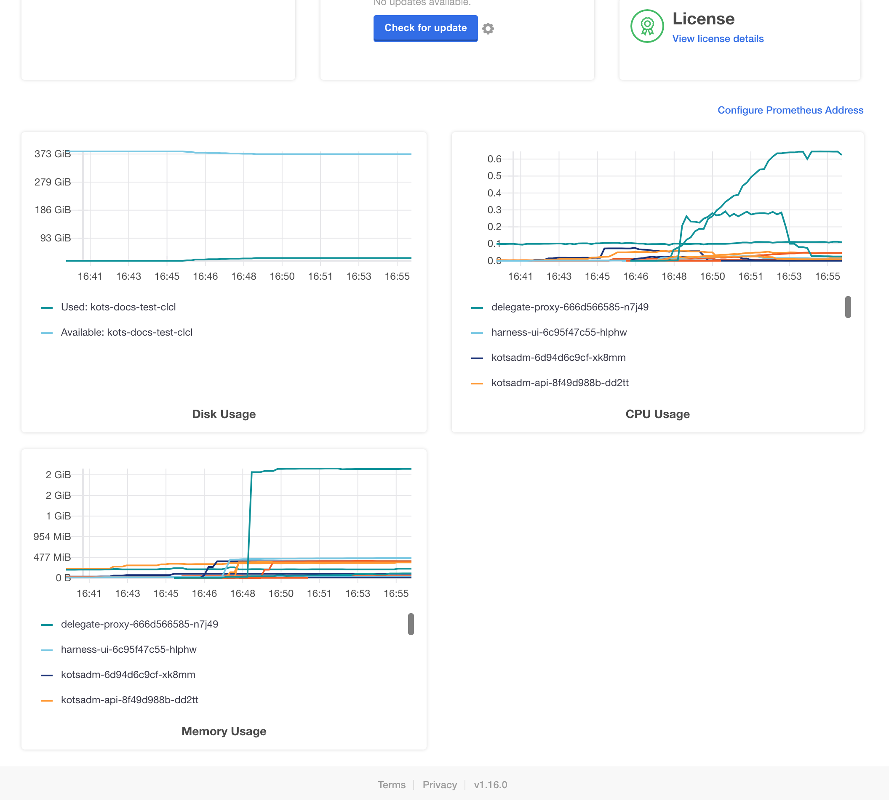

For steps on using the monitoring tools, see [Prometheus](https://kots.io/kotsadm/monitoring/prometheus/) from KOTS.

## License expired

If your license has expired, you will see something like the following:

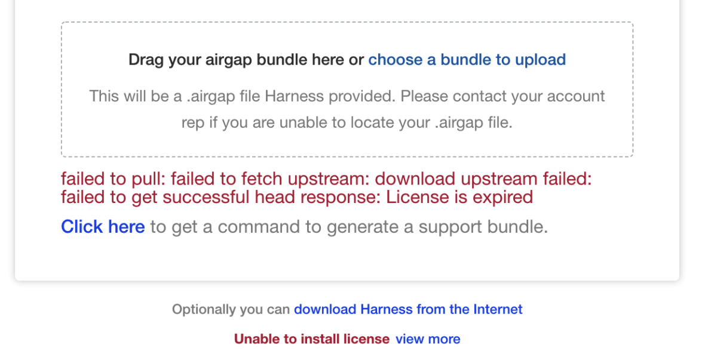

Contact your Harness Customer Success representative or [support@harness.io](mailto:support@harness.io).

## Bring down Harness cluster for planned downtime

If you need to bring down the Harness cluster for any reason, you scale down the Harness Manager and Verification Service deployments to zero replicas. That is sufficient to stop background tasks and remove connections to the database.

Next, optionally, you can scale everything else down if needed, but it is not necessary.

To bring Harness back up, first ensure the Harness MongoDB is scaled up to 3 instances and Redis is scaled up also. Next, scale up the Harness Manager and Verification Service.

## Logging

For Harness Self-Managed Enterprise Edition - Kubernetes Cluster, logs are available as standard out.

Use `kubectl get logs` on any pod to see the logs.

## Enable TLS/SSL between MongoDB and Harness components

You can now enable a TLS/SSL connection between the Harness Self-Managed Enterprise Edition components (microservices) and the MongoDB database that is included in Harness Self-Managed Enterprise Edition.

You can use public or self-signed certs.

Simply select **True** in **Mongo Use SSL** and then upload your ca.pem, client.pem, and mongo.pem files:

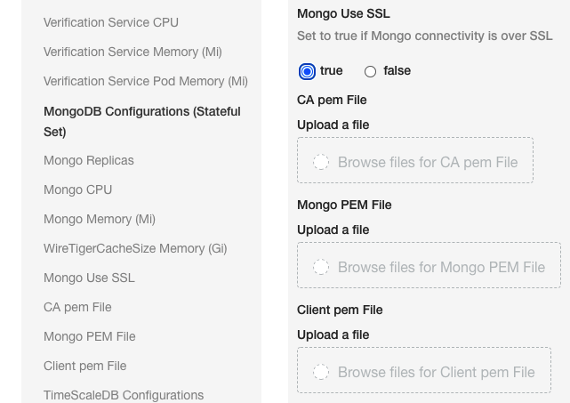

### Instructions for creating self-signed certificates

```
# Create the certificate authority   
  
 openssl req -passout pass:password -new -x509 -days 3650 -extensions v3_ca -keyout ca_private.pem -out ca.pem -subj "/CN=CA/OU=MONGO/O=HARNESS/L=SFO/ST=CA/C=US" -config /usr/local/etc/openssl@1.1/openssl.cnf  
  
# Create client key  
  
openssl req -newkey rsa:4096 -nodes -out client.csr -keyout client.key -subj '/CN=MC/OU=MONGO_CLIENTS/O=HARNESS/L=SFO/ST=CA/C=US'  
Generating a 4096 bit RSA private key  
  
# Create server key  
  
openssl req -newkey rsa:4096 -nodes -out mongo.csr -keyout mongo.key -subj '/CN=*.mongodb-replicaset-chart.<namespace>.svc.cluster.local/OU=MONGO/O=HARNESS/L=SFO/ST=CA/C=US'  
Generating a 4096 bit RSA private key  
  
  
* Change <namespace> to the name of the namespace where Harness is installed. *  
  
# Get client crt  
  
openssl x509 -passin pass:password -sha256 -req -days 365 -in client.csr -CA ca.pem -CAkey ca_private.pem -CAcreateserial -out client_signed.crt  
  
# Get server crt  
  
openssl x509 -passin pass:password -sha256 -req -days 365 -in mongo.csr -CA ca.pem -CAkey ca_private.pem -CAcreateserial -out mongo_signed.crt -extensions v3_req -extfile <(  
cat <<EOF  
[ v3_req ]  
subjectAltName = @alt_names  
  
[ alt_names ]  
DNS.1 = 127.0.0.1  
DNS.2 = localhost  
DNS.3 = *.mongodb-replicaset-chart.<namespace>.svc.cluster.local  
EOF  
)  
# Change <namespace> to the name of the target namespace for the installation
  
# Combine client crt and key to get client.pem  
  
cat client_signed.crt client.key >client.pem  
  
# Combine server crt and key to get mongo.pem  
  
cat mongo_signed.crt mongo.key > mongo.pem

```
Now you have the ca.pem, client.pem and mongo.pem files.

Upload the files into the **Mongo Use SSL** settings.

## Notes

Harness Self-Managed Enterprise Edition installations do not currently support the Harness [Helm Delegate](../../firstgen-platform/account/manage-delegates/using-the-helm-delegate.md).

## Remove previous kustomization for ingress controller

**This option is only needed if you have installed Harness Self-Managed Enterprise Edition previously.** If this is a fresh install, you can go directly to [Configure Harness](/docs/first-gen/fg-sme/k8s/kubernetes-on-prem-existing-cluster-setup.md##step-3-configure-harness).

If you installed Harness Self-Managed Enterprise Edition before, you updated Harness manifests using kustomize for the ingress controller. This is no longer required.

Do the following to remove the kustomization as follows:

1. If you are using a single terminal, close the KOTS admin tool (Ctrl+C).
2. Ensure `kubectl` is pointing to the cluster.
3. Run the following command:

    ```
    kubectl kots download --namespace harness --slug harness
    ```
    
    In this example, Harness is installed in the **harness** namespace. Change the namespace for your configuration. This command downloads the **harness** folder to your current directory.

4. In the **harness** folder, open the file **kustomization.yaml**:

    ```
    vi harness/overlays/midstream/kustomization.yaml 
    ```
    
5. In `patchesStrategicMerge`, **remove** `nginx-service.yaml`.
6. Save the file.
7. Remove the nginx-service.yaml file:

  ```
  rm -rf harness/overlays/midstream/nginx-service.yaml
  ```

8. Upload Harness:

  ```
  kubectl kots upload --namespace harness --slug harness ./harness
  ```

9. Open the KOTS admin tool, and then deploy the uploaded version of Harness.

