This topic covers installing Harness Self-Managed Enterprise Edition - Virtual Machine as a Kubernetes cluster embedded on your target VMs.

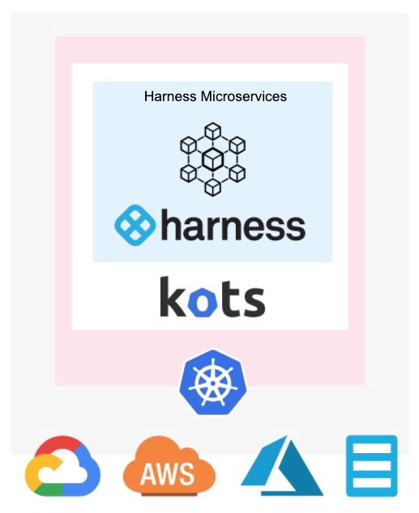

Installing Harness Self-Managed Enterprise Edition into an embedded Kubernetes cluster is a simple process where you prepare your VMs and network, and use the Kubernetes installer kURL and the KOTS plugin to complete the installation and deploy Harness.

Once you have set up Harness on a VM, you can add additional worker nodes by simply running a command.

:::note 
Harness Self-Managed Enterprise Edition uses the open source Kubernetes installer kURL and the KOTS plugin for installation. See [Install with kURL](https://kurl.sh/docs/install-with-kurl/) from kURL and [Installing an Embedded Cluster](https://kots.io/kotsadm/installing/installing-embedded-cluster/) from KOTS. 
:::

## Step 1: Set up VM Requirements

Ensure that your VMs meet the requirements specified in [Harness Self-Managed Enterprise Edition - Virtual Machine: Infrastructure Requirements](embedded-kubernetes-on-prem-infrastructure-requirements.md).

Different cloud platforms use different methods for grouping VMs (GCP instance groups, AWS target groups, etc). Set up your 3 VMs using the platform method that works best with the platform's networking processes.

## Step 2: Set Up Load Balancer and Networking Requirements

Ensure that your networking meets the requirements specified in [Harness Self-Managed Enterprise Edition - Virtual Machine: Infrastructure Requirements](embedded-kubernetes-on-prem-infrastructure-requirements.md).

You will need to have two load balancers, as described in the [Harness Self-Managed Enterprise Edition - Virtual Machine: Infrastructure Requirements](embedded-kubernetes-on-prem-infrastructure-requirements.md).

One for routing traffic to the VMs and one for the in-cluster load balancer.

During installation, you are asked for the IP address of the in-cluster TCP load balancer first.

When you configure the Harness Self-Managed Enterprise Edition application in the KOTS admin console, you are asked for the HTTP load balancer URL.

## Option 1: Disconnected Installation

Disconnected Installation involves downloading the Harness Self-Managed Enterprise Edition archive file onto a jump box, and then copying and the file to each Harness Self-Managed Enterprise Edition host VM you want to use.

One each VM, you extract and install Harness Self-Managed Enterprise Edition.

On your jump box, run the following command to obtain the Harness Self-Managed Enterprise Edition file:


```
curl -LO https://kurl.sh/bundle/harness.tar.gz
```
Copy the file to a Harness Self-Managed Enterprise Edition host and extract it (`tar xvf harness.tar.gz`).

On the VM, install Harness:


```
cat install.sh | sudo bash -s airgap ha
```
This will install the entire Harness Self-Managed Enterprise Edition Kubernetes cluster and all related microservices.

The `ha` parameter is used to set up high availability. If you are not using high availability, you can omit the parameter.

### Provide Load Balancer Settings

First, you are prompted to provide the IP address of the TCP Load Balancer for the cluster HA:


```
The installer will use network interface 'ens4' (with IP address '10.128.0.25')  
Please enter a load balancer address to route external and internal traffic to the API servers.  
In the absence of a load balancer address, all traffic will be routed to the first master.  
Load balancer address:
```
This is the TCP load balancer you created in [Harness Self-Managed Enterprise Edition - Virtual Machine: Infrastructure Requirements](embedded-kubernetes-on-prem-infrastructure-requirements.md).

For example, here is a GCP TCP load balancer with its frontend forwarding rule using port 6443:

Enter the IP address and port of your TCP load balancer (for example, `10.128.0.50:6443`), and press Enter. The installation process will continue. The installation process begins like this:


```
...  
Fetching weave-2.5.2.tar.gz  
Fetching rook-1.0.4.tar.gz  
Fetching contour-1.0.1.tar.gz  
Fetching registry-2.7.1.tar.gz  
Fetching prometheus-0.33.0.tar.gz  
Fetching kotsadm-1.16.0.tar.gz  
Fetching velero-1.2.0.tar.gz  
Found pod network: 10.32.0.0/22  
Found service network: 10.96.0.0/22  
...
```
### Review Configuration Settings

Once the installation process is complete, KOTS provides you with several configuration settings and commands. Save these settings and commands.

* KOTS admin console and password:


```
Kotsadm: http://00.000.000.000:8800  
Login with password (will not be shown again): D1rgBIu21
```

:::note 
If you need to reset your password, enter `kubectl kots reset-password -n default`. You will be prompted for a new password.
:::

* Prometheus, Grafana, and Alertmanager ports and passwords:


```
The UIs of Prometheus, Grafana and Alertmanager have been exposed on NodePorts 30900, 30902 and 30903 respectively.  
To access Grafana use the generated user:password of admin:RF1KuqreN .
```
* kubectl access to your cluster:


```
To access the cluster with kubectl, reload your shell:  
    bash -l
```
* The command to add worker nodes to the installation:


```
To add worker nodes to this installation, run the following script on your other nodes:  
  
curl -sSL https://kurl.sh/harness/join.sh | sudo bash -s kubernetes-master-address=10.128.0.24:6443 kubeadm-token=xxxxx kubeadm-token-ca-hash=shaxxxxxx kubernetes-version=1.15.3 docker-registry-ip=10.96.3.130
```
We will use this command later.

* Add master nodes:


```
To add MASTER nodes to this installation, run the following script on your other nodes  
    curl -sSL https://kurl.sh/harness/join.sh | sudo bash -s kubernetes-master-address=34.71.32.244:6443 kubeadm-to  
ken=c2yack.q7lt3z6yuevqlmtf kubeadm-token-ca-hash=sha256:9db504ecdee08ff6dfa3b299ce95302fe53dd632a2e9356c55e9272db7  
2d60d1 kubernetes-version=1.15.3 cert-key=f0373e812e0657b4f727e90a7286c5b65539dfe7ee5dc535df0a1bcf74ad5c57 control-  
plane docker-registry-ip=10.96.2.100
```
### Log into the Admin Tool

In a browser, enter the Kotsadm link.

The browser displays a TLS warning.


Click **Continue to Setup**.

In the warning page, click **Advanced**, then click **Proceed** to continue to the admin console.

As KOTS uses a self-signed certification, but you can upload your own.

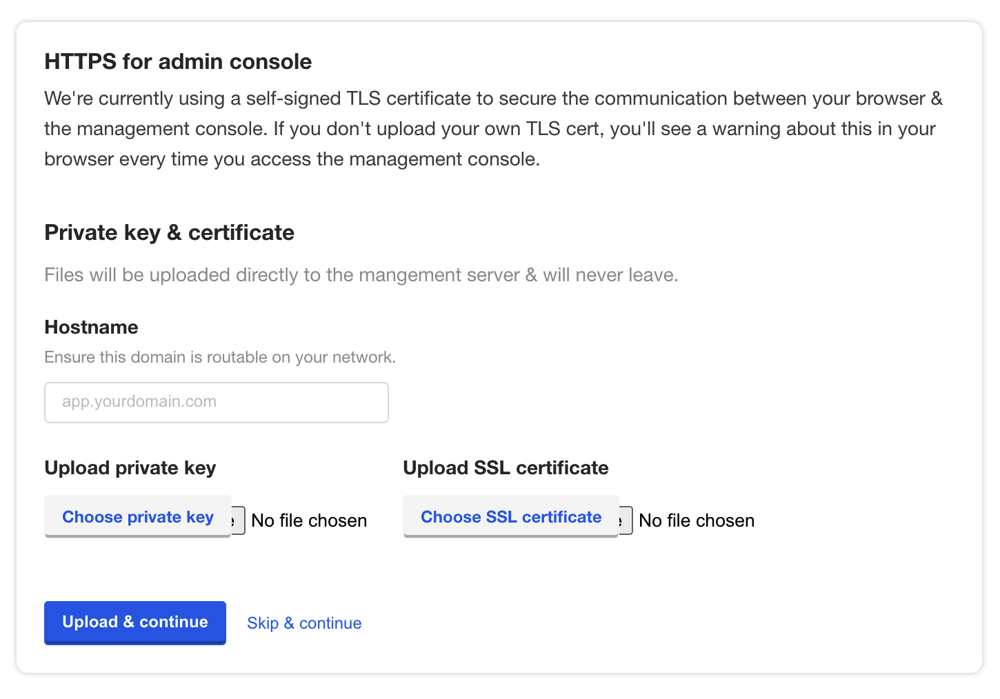

Upload your certificate or click **Skip and continue**.

Log into the console using the password provided in the installation output.


### Upload Your Harness License

Once you are logged into the KOTS admin console, you can upload your Harness license.

Obtain the Harness license file from your Harness Customer Success contact or email [support@harness.io](mailto:support@harness.io).

Drag your license YAML file into the KOTS admin tool:

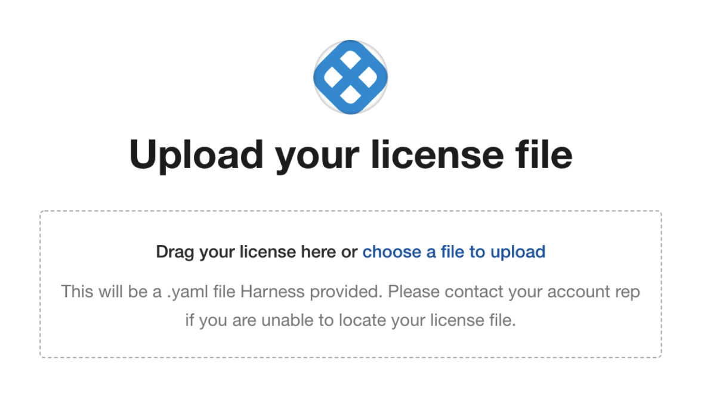

Next, upload the license file:


Now that license file is uploaded, you can install Harness.

Go to [Step 3: Configure Harness](#step_3_configure_harness).

## Option 2: Connected Installation

Once you have your VMs and networking requirements set up, you can install Harness.

Log into one of your VMs, and then run the following command:


```
curl -sSL https://k8s.kurl.sh/harness | sudo bash -s ha
```
This will install the entire Harness Self-Managed Enterprise Edition Kubernetes cluster and all related microservices.

The `-s ha` parameter is used to set up high availability.

### Provide Load Balancer Settings

First, you are prompted to provide the IP address of the TCP Load Balancer for the cluster HA:


```
The installer will use network interface 'ens4' (with IP address '10.128.0.25')  
Please enter a load balancer address to route external and internal traffic to the API servers.  
In the absence of a load balancer address, all traffic will be routed to the first master.  
Load balancer address:
```
This is the TCP load balancer you created in [Harness Self-Managed Enterprise Edition - Virtual Machine: Infrastructure Requirements](embedded-kubernetes-on-prem-infrastructure-requirements.md).

For example, here is a GCP TCP load balancer with its frontend forwarding rule using port 6443:

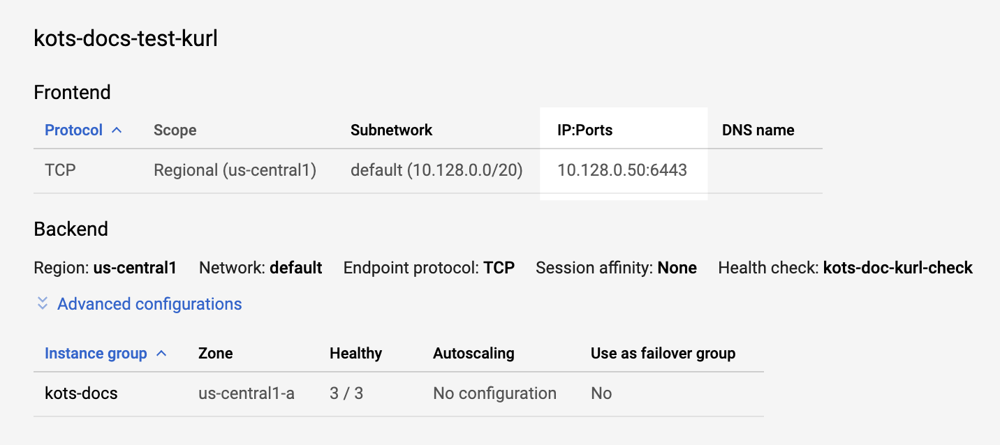Enter the IP address and port of your TCP load balancer (for example, `10.128.0.50:6443`), and press Enter. The installation process will continue. The installation process begins like this:


```
...  
Fetching weave-2.5.2.tar.gz  
Fetching rook-1.0.4.tar.gz  
Fetching contour-1.0.1.tar.gz  
Fetching registry-2.7.1.tar.gz  
Fetching prometheus-0.33.0.tar.gz  
Fetching kotsadm-1.16.0.tar.gz  
Fetching velero-1.2.0.tar.gz  
Found pod network: 10.32.0.0/22  
Found service network: 10.96.0.0/22  
...
```
### Review Configuration Settings

Once the installation process is complete, KOTS provides you with several configuration settings and commands. Save these settings and commands.

* KOTS admin console and password:


```
Kotsadm: http://00.000.000.000:8800  
Login with password (will not be shown again): D1rgBIu21
```
If you need to reset your password, enter `kubectl kots reset-password -n default`. You will be prompted for a new password.* Prometheus, Grafana, and Alertmanager ports and passwords:


```
The UIs of Prometheus, Grafana and Alertmanager have been exposed on NodePorts 30900, 30902 and 30903 respectively.  
To access Grafana use the generated user:password of admin:RF1KuqreN .
```
* kubectl access to your cluster:


```
To access the cluster with kubectl, reload your shell:  
    bash -l
```
* The command to add worker nodes to the installation:


```
To add worker nodes to this installation, run the following script on your other nodes:  
  
curl -sSL https://kurl.sh/harness/join.sh | sudo bash -s kubernetes-master-address=10.128.0.24:6443 kubeadm-token=xxxxx kubeadm-token-ca-hash=shaxxxxxx kubernetes-version=1.15.3 docker-registry-ip=10.96.3.130
```
We will use this command later.

* Add master nodes:


```
To add MASTER nodes to this installation, run the following script on your other nodes  
    curl -sSL https://kurl.sh/harness/join.sh | sudo bash -s kubernetes-master-address=34.71.32.244:6443 kubeadm-to  
ken=c2yack.q7lt3z6yuevqlmtf kubeadm-token-ca-hash=sha256:9db504ecdee08ff6dfa3b299ce95302fe53dd632a2e9356c55e9272db7  
2d60d1 kubernetes-version=1.15.3 cert-key=f0373e812e0657b4f727e90a7286c5b65539dfe7ee5dc535df0a1bcf74ad5c57 control-  
plane docker-registry-ip=10.96.2.100
```
### Log into the Admin Tool

In a browser, enter the Kotsadm link.

The browser displays a TLS warning.

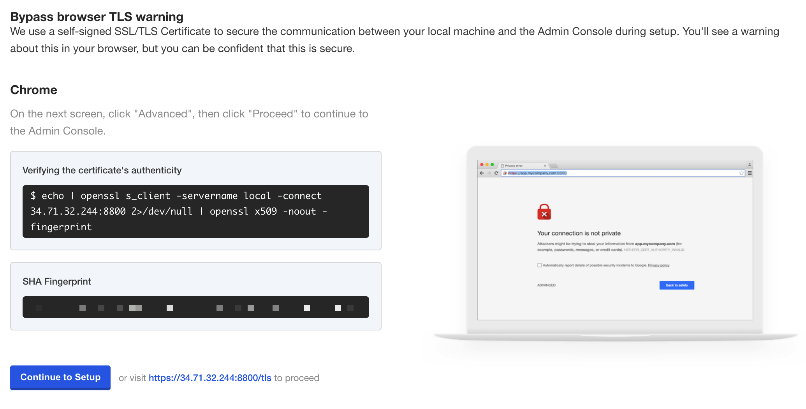

Click **Continue to Setup**.

In the warning page, click **Advanced**, then click **Proceed** to continue to the admin console.

As KOTS uses a self-signed certification, but you can upload your own.


Upload your certificate or click **Skip and continue**.

Log into the console using the password provided in the installation output.

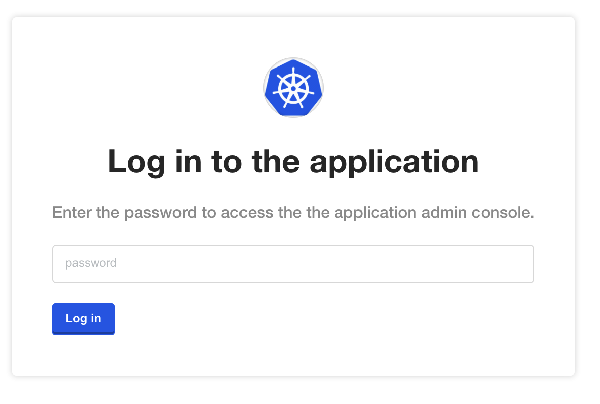

### Upload Your Harness License

Once you are logged into the KOTS admin console, you can upload your Harness license.

Obtain the Harness license file from your Harness Customer Success contact or email [support@harness.io](mailto:support@harness.io).

Drag your license YAML file into the KOTS admin tool:


Next, upload the license file:

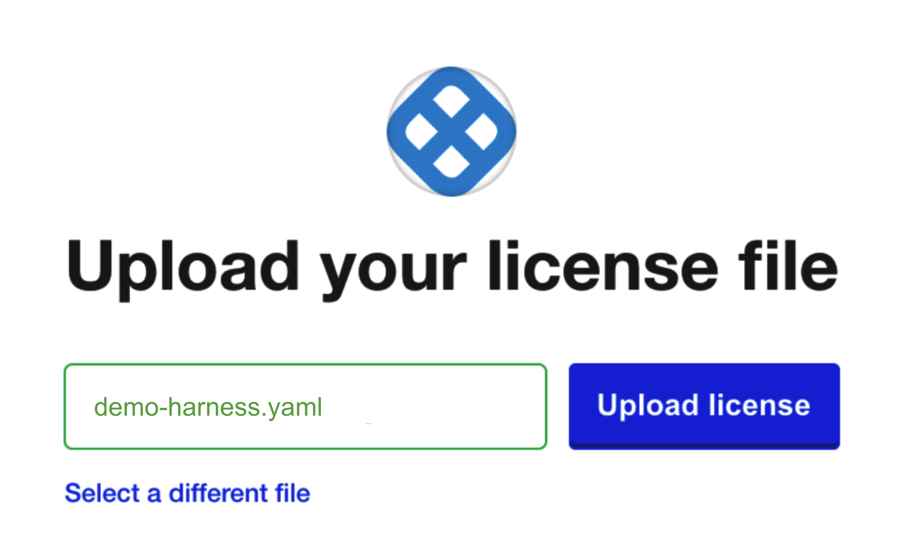

Now that license file is uploaded, you can install Harness.

### Download Harness over the Internet

If you are installing Harness over the Internet, click the **download Harness from the Internet** link.

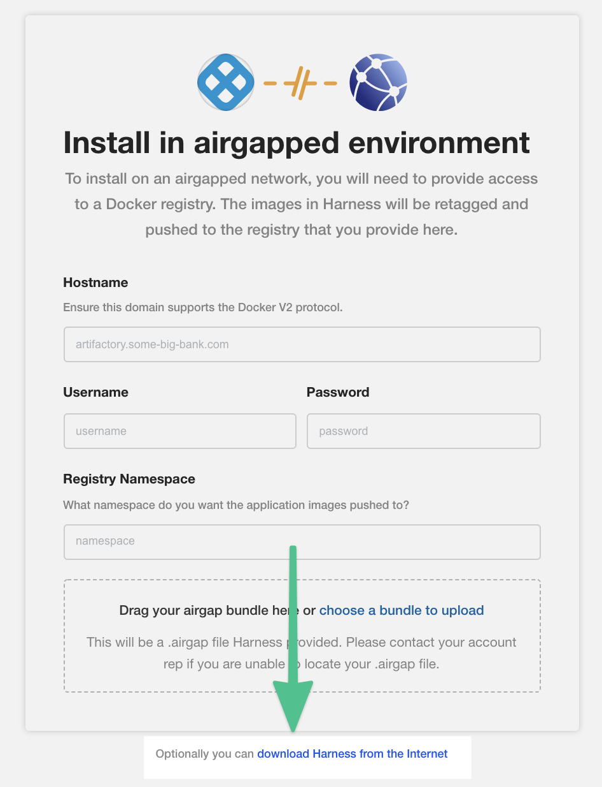KOTS begins installing Harness into your cluster.

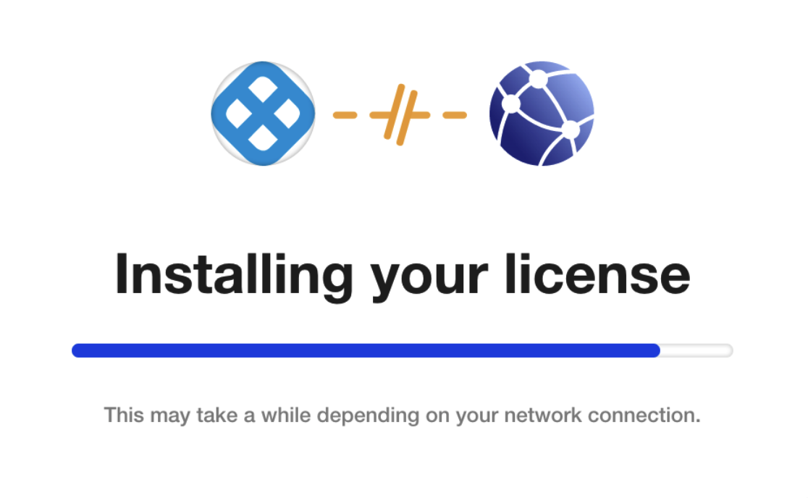Next, you will provide KOTS with the Harness configuration information (Load Balancer URL and NodePort).

## Step 3: Configure Harness

Now that you have added your license you can configure the networking for the Harness installation.

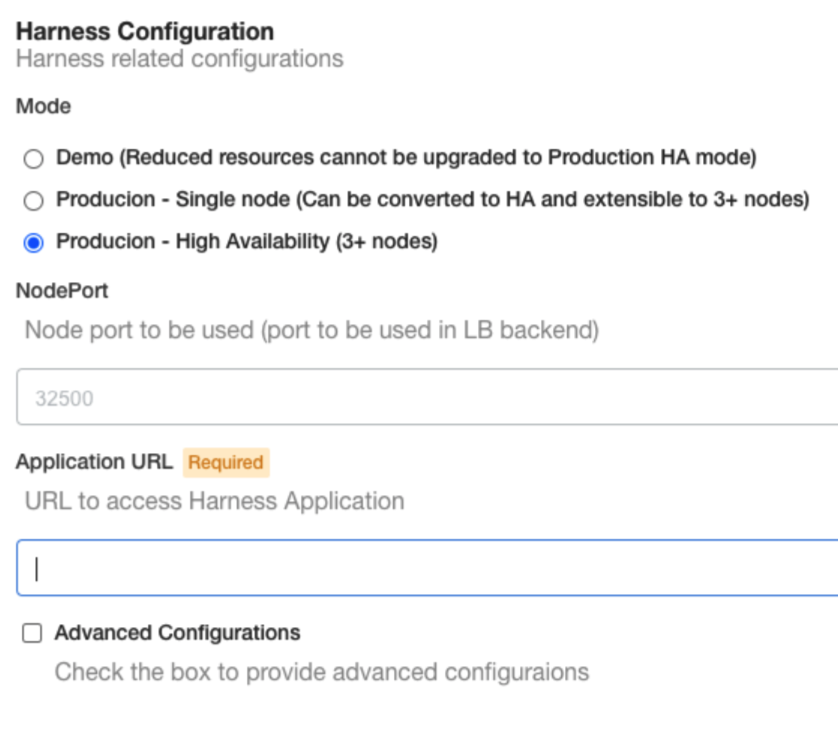

### Mode

* Select **Demo** to run a Harness Self-Managed Enterprise Edition in demo mode and experiment with it.
* Select **Production - Single Node** to run this on one node. You can convert to Production - High Availability later.
* Select **Production** - **High Availability** to run a production version of Harness Self-Managed Enterprise Edition.

In you use **Production - Single Node**, you can convert to **Production - High Availability** later by doing the following:

1. In the KOTS admin console, go to **Cluster Management**.
2. Click **Add a node**. This will generate scripts for joining additional worker and master nodes.

For Disconnected (Airgap) installations, the bundle must also be downloaded and extracted on the remote node prior to running the join script.

### NodePort and Application URL

Harness Self-Managed Enterprise Edition - Virtual Machine requires that you provide a NodePort and Application URL.

1. In **Application URL**, enter the **full URL** for the HTTP load balancer you set up for routing external traffic to your VMs.  
   Include the scheme and hostname/IP. For example, `https://app.example.com`.  
   Typically, this is the frontend IP address for the load balancer. For example, here is an HTTP load balancer in GCP and how you enter its information into **Harness Configuration**.  
   If you have set up DNS to resolve a domain name to the load balancer IP, enter that domain name in **Application URL**.
2. In **NodePort**, enter the port number you set up for load balancer backend: **80**.

   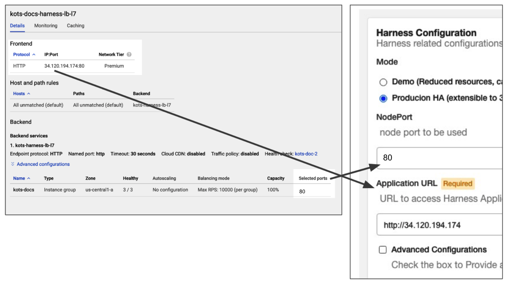
   
   You can also use port 443 for TLS.
   
3. When you are done, click **Continue**.

### Option: Advanced Configurations

In the **Advanced Configurations** section, there are a number of advanced settings you can configure. If this is the first time you are setting up Harness Self-Managed Enterprise Edition, there's no reason to fine tune the installation with these settings.

You can change the settings later in the KOTS admin console's Config tab:


#### Ingress Service Type

By default, nginx is used for Ingress automatically. If you are deploy nginx separately, do the following:

1. Click **Advanced Configurations**.
2. Disable the **Install Nginx Ingress Controller** option.

## Step 4: Perform Preflight Checks

Preflight checks run automatically and verify that your setup meets the minimum requirements.


You can skip these checks, but we recommend you let them run.

Fix any issues in the preflight steps.

## Step 5: Deploy Harness

When you are finished pre-flight checks, click **Deploy and** **Continue**.

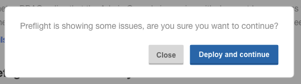

Harness is deployed in a few minutes.

It can take up to 30 minutes when installing the demo version on a system with the minimum recommended specs.In a new browser tab, go to the following URL, replacing `<LB_URL>` with the URL you entered in the **Application URL** setting in the KOTS admin console:

`<LB_URL>/auth/#/signup`

For example:

`http://harness.mycompany.com/auth/#/signup`

The Harness sign up page appears.

Sign up with a new account and then sign in.

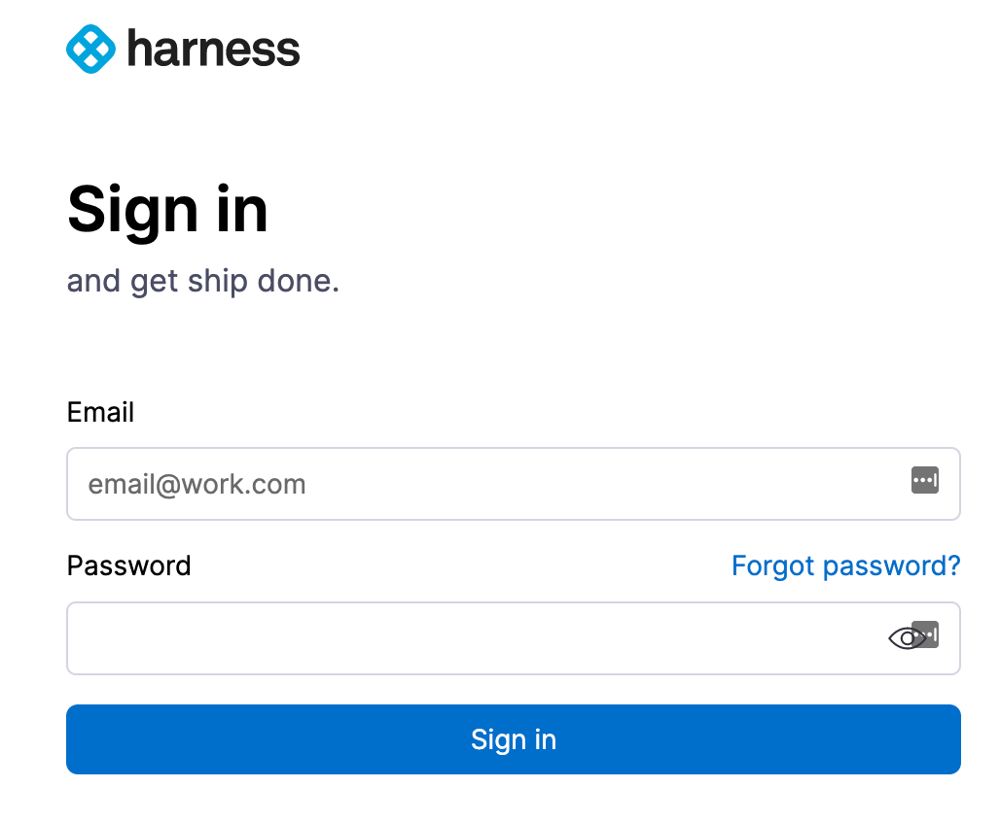Your new account will be added to the Harness Account Administrators User Group.

See [Managing Users and Groups (RBAC)](../../firstgen-platform/security/access-management-howtos/users-and-permissions.md).

### Future Versions

To set up future versions of Harness Self-Managed Enterprise Edition, in the KOTS admin console, in the **Version history** tab, click **Deploy**. The new version is displayed in Deployed version.


## Step 6: Add Worker Nodes

Now that Harness Self-Managed Enterprise Edition is installed in one VM, you can install it on other VMs using the command provided when you installed Harness:


```
To add worker nodes to this installation, run the following script on your other nodes  
    curl -sSL https://kurl.sh/harness/join.sh | sudo bash -s kubernetes-master-address=10.128.0.24:6443 kubeadm-token=xxxxx kubeadm-token-ca-hash=shaxxxxxx kubernetes-version=1.15.3 docker-registry-ip=10.96.3.130
```
Run this on each VM in your group. The installation will begins something like this:


```
...  
Docker already exists on this machine so no docker install will be performed  
Container already exists on this machine so no container install will be performed  
The installer will use network interface 'ens4' (with IP address '10.128.0.44')  
Loaded image: replicated/kurl-util:v2020.07.15-0  
Loaded image: weaveworks/weave-kube:2.5.2  
Loaded image: weaveworks/weave-npc:2.5.2  
Loaded image: weaveworks/weaveexec:2.5.2  
...
```
When installation is complete, you will see the worker join the cluster and preflight checks are performed:


```
⚙  Join Kubernetes node  
+ kubeadm join --config /opt/replicated/kubeadm.conf --ignore-preflight-errors=all  
[preflight] Running pre-flight checks  
validated versions: 19.03.4. Latest  
 validated version: 18.09
```
The worker is now joined.

## Important Next Steps

:::note
**Important:** You cannot invite other users to Harness until a Harness Delegate is installed and a Harness SMTP Collaboration Provider is configured.
:::

1. Install the Harness Delegate: [Delegate Installation and Management](../../firstgen-platform/account/manage-delegates/delegate-installation.md).
2. Set up an SMTP Collaboration Provider in Harness for email notifications from the Harness Manager: [Add SMTP Collaboration Provider](../../firstgen-platform/account/manage-connectors/add-smtp-collaboration-provider.md).  
Ensure you open the correct port for your SMTP provider, such as [Office 365](https://support.office.com/en-us/article/server-settings-you-ll-need-from-your-email-provider-c82de912-adcc-4787-8283-45a1161f3cc3).
3. [Add a Harness Secrets Manager](../../firstgen-platform/security/secrets-management/add-a-secrets-manager.md). By default, Harness Self-Managed Enterprise Edition installations use the local Harness MongoDB for the default Harness Secrets Manager. This is not recommended.  
After Harness Self-Managed Enterprise Edition installation, configure a new Secret Manager (Vault, AWS, etc). You will need to open your network for the Secret Manager connection.

## Updating Harness

:::danger 
**Do not upgrade Harness past 4 major releases.** Instead, upgrades each interim release until you upgrade to the latest release. A best practice is to upgrade Harness once a month.
:::

Please follow these steps to update your Harness Harness Self-Managed Enterprise Edition installation.

The steps are very similar to how you installed Harness initially.

For more information, see [Updating an Embedded Cluster](https://kots.io/kotsadm/updating/updating-embedded-cluster/) from KOTS.

### Disconnected (Airgap)

The following steps require a private registry, just like the initial installation of Harness.

#### Upgrade Harness

1. Download the latest release from Harness.
2. Run the following command on the VM(s) hosting Harness, replacing the placeholders:

```
kubectl kots upstream upgrade harness \   
--airgap-bundle <path to harness-<version>.airgap> \   
--kotsadm-namespace harness-kots \   
-n default
```
#### Upgrade Embedded Kubernetes Cluster and KOTS

1. Download the latest version of Harness:

  ```
  curl -SL -o harnesskurl.tar.gz https://kurl.sh/bundle/harness.tar.gz
  ```

2. Move the tar.gz file to the disconnected VMs.
3. On each VM, run the following command to update Harness:

  ```
  tar xzvf harnesskurl.tar.gz  
  cat install.sh | sudo bash -s airgap
  ```

### Connected

The following steps require a secure connection to the Internet, just like the initial installation of Harness.

#### Upgrade Harness

1. Run the following command on the VMs hosting Harness:

  ```
  kubectl kots upstream upgrade harness -n harness
  ```
  
#### Upgrade Embedded Kubernetes Cluster and KOTS

1. Run the following command on the VMs hosting Harness:

  ```
  curl -sSL https://kurl.sh/harness | sudo bash
  ```

## Monitoring Harness

Harness monitoring is performed using the built in monitoring tools.

When you installed Harness, your were provided with connection information for Prometheus, Grafana, and Alertmanager ports and passwords:


```
The UIs of Prometheus, Grafana and Alertmanager have been exposed on NodePorts 30900, 30902 and 30903 respectively.  
To access Grafana use the generated user:password of admin:RF1KuqreN .
```
For steps on using the monitoring tools, see [Prometheus](https://kots.io/kotsadm/monitoring/prometheus/) from KOTS.

## Enable TLS/SSL between MongoDB and Harness Components

You can now enable a TLS/SSL connection between the Harness Self-Managed Enterprise Edition components (microservices) and the MongoDB database that is included in Harness Self-Managed Enterprise Edition.

You can use public or self-signed certs.

Simply select **True** in **Mongo Use SSL** and then upload your ca.pem, client.pem, and mongo.pem files:

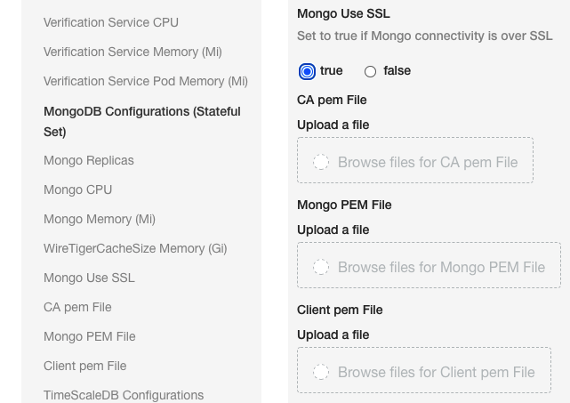

### Instructions for creating self signed certs

```
# Create CA   
  
 openssl req -passout pass:password -new -x509 -days 3650 -extensions v3_ca -keyout ca_private.pem -out ca.pem -subj "/CN=CA/OU=MONGO/O=HARNESS/L=SFO/ST=CA/C=US" -config /usr/local/etc/openssl@1.1/openssl.cnf  
  
# Create Client key  
  
openssl req -newkey rsa:4096 -nodes -out client.csr -keyout client.key -subj '/CN=MC/OU=MONGO_CLIENTS/O=HARNESS/L=SFO/ST=CA/C=US'  
Generating a 4096 bit RSA private key  
  
# Create Server key  
  
openssl req -newkey rsa:4096 -nodes -out mongo.csr -keyout mongo.key -subj '/CN=*.mongodb-replicaset-chart.<namespace>.svc.cluster.local/OU=MONGO/O=HARNESS/L=SFO/ST=CA/C=US'  
Generating a 4096 bit RSA private key  
  
  
* Please change <namespace> to namespace name where Harness is installed / will be installed*  
  
# Get Client crt  
  
openssl x509 -passin pass:password -sha256 -req -days 365 -in client.csr -CA ca.pem -CAkey ca_private.pem -CAcreateserial -out client_signed.crt  
  
# Get Server crt  
  
openssl x509 -passin pass:password -sha256 -req -days 365 -in mongo.csr -CA ca.pem -CAkey ca_private.pem -CAcreateserial -out mongo_signed.crt -extensions v3_req -extfile <(  
cat <<EOF  
[ v3_req ]  
subjectAltName = @alt_names  
  
[ alt_names ]  
DNS.1 = 127.0.0.1  
DNS.2 = localhost  
DNS.3 = *.mongodb-replicaset-chart.<namespace>.svc.cluster.local  
EOF  
)  
# Please change <namespace> to namespace name where Harness is installed / will be installed  
  
# Combine Client crt and key to get client.pem  
  
cat client_signed.crt client.key >client.pem  
  
# Combine Server crt and key to get mongo.pem  
  
cat mongo_signed.crt mongo.key > mongo.pem
```
Now you have the ca.pem, client.pem and mongo.pem files.

Upload all files into the **Mongo Use SSL** settings.

## License Expired

If your license has expired, you will see something like the following:

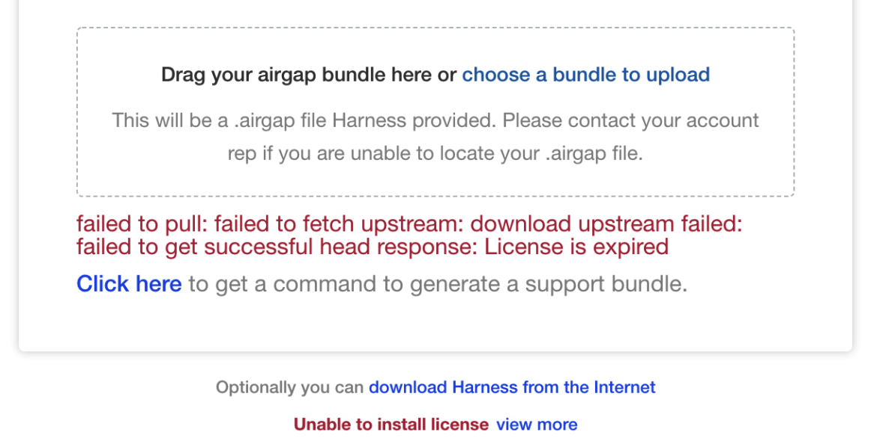Contact your Harness Customer Success representative or [support@harness.io](mailto:support@harness.io).

## Notes

Harness Self-Managed Enterprise Edition installations do not currently support the Harness [Helm Delegate](../../firstgen-platform/account/manage-delegates/using-the-helm-delegate.md).

