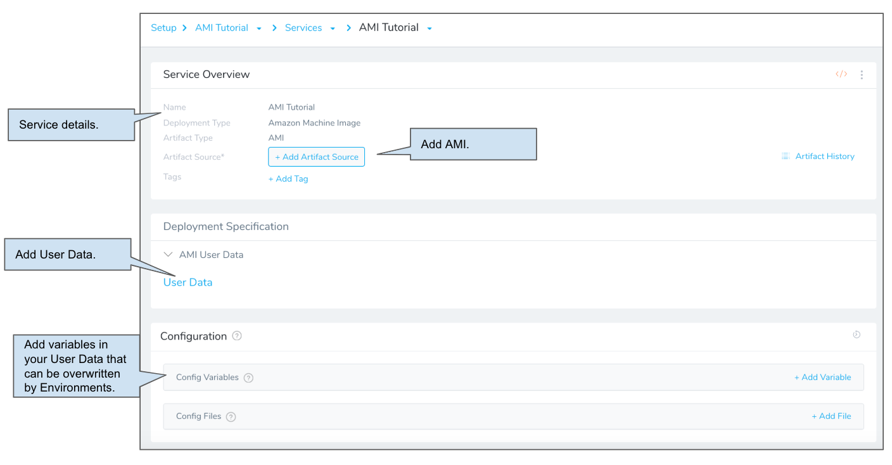
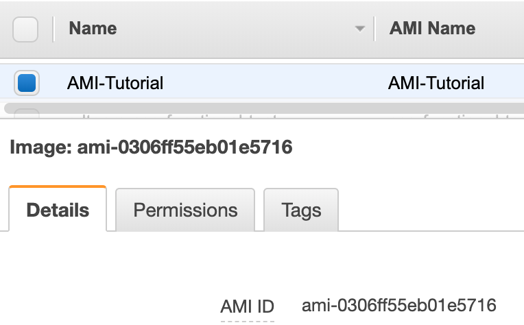
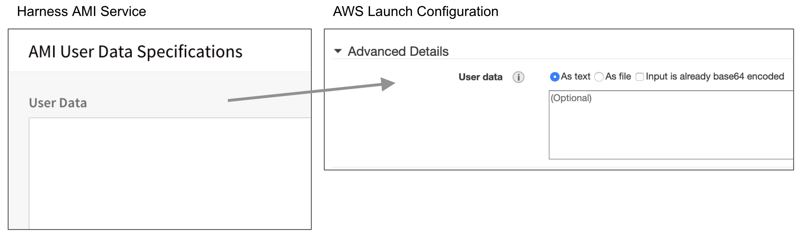
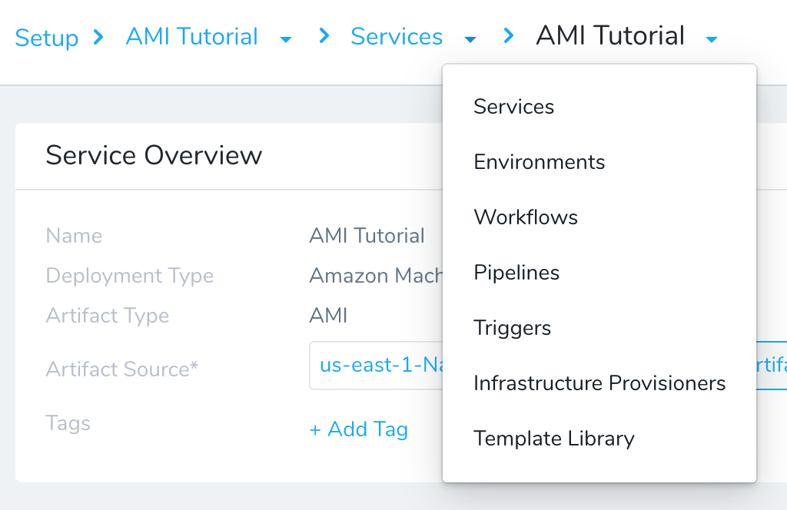
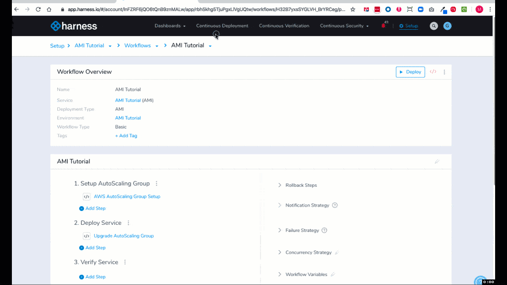
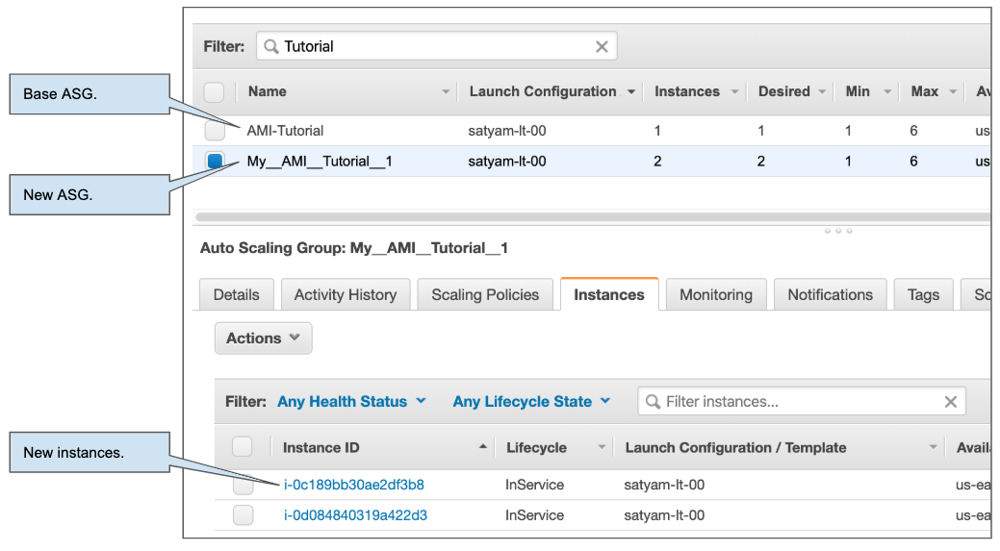

This quickstart shows you how to use existing Amazon Machine Images (AMIs) and AWS Auto Scaling Groups (ASGs) to deploy new ASGs and instances to Amazon Elastic Compute Cloud (EC2) via Harness.

## Objectives

You'll learn how to:

* Set up the AWS IAM and EC2 for the Harness Shell Script Delegate.
* Install the Harness Shell Script Delegate.
* Connect Harness with AWS.
* Specify the AMIs to use for your new instances.
* Specify the ASG to use as a template for new ASGs.
* Set the number of instances to deploy.
* Create and deploy an AMI Basic Workflow.

## Before You Begin

* Review [Harness Key Concepts](../starthere-firstgen/harness-key-concepts.md) to establish a general understanding of Harness.
* **AWS IAM role** — Create an AWS IAM role that has the **AmazonEC2FullAccess** policy. You will apply this role to the EC2 instance you use to host the Harness Shell Script Delegate. This policy gives the Delegate access to the AWS EC2 API.  
See [Creating an IAM Group and Users](https://docs.aws.amazon.com/AWSEC2/latest/UserGuide/security-iam.html#creating-an-iam-group) and [Amazon EC2: Allows Full EC2 Access Within a Specific Region, Programmatically and in the Console](https://docs.aws.amazon.com/IAM/latest/UserGuide/reference_policies_examples_ec2_region.html) from AWS.
* Attach this IAM role to the EC2 instance you create for the Harness Delegate next.
* **EC2 Instance for Harness Shell Script Delegate** — The EC2 instance for the Harness Delegate must meet the following requirements:
	+ Linux/UNIX server.
	+ ​Minimum 1 CPU.
	+ Minimum 8GB RAM. For example, an AWS EC2 instance type such as m5a.xlarge has 16GB of RAM, 8 for the Delegate and 8 for the remaining operations.
	+ Minimum 6GB Disk space.
	+ Create the EC2 Instance in the target region, VPC, and subnet.
* **AMI and Base ASG** — Pick an existing AMI and ASG for Harness to use when creating new instances and ASGs. Harness will use the existing ASG as a template, but it will not resize it all.
* **Tag your AMI** — Tag the existing AMI you picked with **Name: AMI-Tutorial**. You will use this tag to select the AMI in Harness. You can also enter the AMI ID in Harness if you don't want to tag the instance.

## Visual Summary

The following diagram shows the very simple topology for this tutorial:

You will install the Harness Shell Script Delegate on an EC2 instance in your AWS account, select an AMI for creating instances, a base ASG for creating a new ASG, and then deploy the number of new instances you need.

## Step 1: Install and Launch the Shell Script Delegate

First we'll install the Harness Shell Script Delegate on the EC2 instance you set up with the IAM role you created for Harness AMI deployments.

Install the Delegate in the same subnet as your base Auto Scaling Group, using the same security group and the same key pair.

To install the Delegate on your EC2 instance:

1. Sign into the Harness Manager.
2. Click **Setup**, and then click **Harness Delegates**.
3. Click **Download Delegate**, and then click **Shell Script**.
4. Enter a name for the Delegate, and select the **Primary** Profile.
5. Click **Copy Download Link**.  

6. Log into your EC2 instance, paste the Shell Script Delegate command, and hit **Enter**.
7. Once the Delegate is downloaded, unzip it (`tar -zxvf harness-delegate.tar.gz`), change directories into the **harness-delegate** folder and run the start command: `./start.sh`. Ignore any warning about the ulimit.

The Delegate will start and in a few moments you will see it listed in the **Harness Delegates** page.

**Delegate Selectors** — Add a Delegate Selector to the Delegate so you can use this Delegate when you create a Harness AWS Cloud Provider. This will ensure the IAM role applied to the Delegate is used by your AWS Cloud Provider.

1. In the Delegate listing on the **Harness Delegates** page, click **Edit** next to **Selectors**.
2. Type in **AWS-Tutorial**, press **Enter**, and then click **Submit**. The Selector is added to the Delegate.

## Step 2: Add a AWS Cloud Provider

In this section, we will add a Harness AWS Cloud Provider to your Harness account to connect to AWS EC2.

As Harness provides first-class support for [CloudWatch](../continuous-delivery/continuous-verification/continuous-verification-overview/concepts-cv/cloud-watch-verification-overview.md), you can also use the same AWS Cloud Provider for your CloudWatch connection.**Permissions:** The AWS Cloud Provider will assume the IAM Role associated with the Delegate you installed in your VPC.

1. In the Harness Manager, click **Setup**, and then click **Cloud Providers**.
2. Click **Add Cloud Provider**. The **Cloud Provider** dialog appears. Enter the following settings:

	* **Type:** Select **Amazon Web Services**.
	* **Display Name:** Enter **AWS-Tutorial**.
	* **Credentials:** Select **Assume IAM Role on Delegate**.
	* **Delegate Selector:** Select the Delegate Selector you added to your Delegate, **AWS-Tutorial**.

3. Click **Test** and then **Submit**.

Now that the hard part is done, you can quickly set up your AMI deployment in just a few minutes.

## Step 3: Add Your AMI and User Data

Next we'll add the AMI to use when creating you new instances. We'll start by creating a Harness Application.

An Application in Harness represents a logical group of one or more entities, including Services, Environments, Workflows, Pipelines, Triggers, and Infrastructure Provisioners. Applications organize all of the entities and configurations in Harness CD. For more information, see [Harness Key Concepts](../starthere-firstgen/harness-key-concepts.md).

1. In Harness, click **Setup**, and then click **Add Application**. The Application settings appear.
2. Enter the name **AMI-Tutorial** and click **Submit**. The new Application is added.
3. In your new Application, click **Services**. The **Services** page appears.
4. In the **Services** page, click **Add Service**. The **Add** **Service** settings appear. Enter the following settings and then click **Submit**:

	 * **Name:** Enter **AMI Tutorial**.
	 * **Deployment Type:** Select **Amazon Machine Image**.\

The new Service is listed.

Next, we'll select the AMI to use when creating your instances.

1. From the **Service Overview** section, click **Add Artifact Source**, then click **Amazon AMI**.
2. In **Artifact Source**, enter the following settings and click **Submit**.

   * **Cloud Provider:** Select the AWS Cloud Provider you added earlier, **AWS-Tutorial**.
   * **Region:** Select the AWS region where your AMI is located.
   * **AWS Tags:** Add the tag that is used by your AMI, such as **Name: AMI-Tutorial**.

Optionally, in **AmiResource Filters**, you can add AMI ID filters to locate the AMI resource. These are key/value pairs that prepend `ami‑image:` to the AMI ID. For example: `ami‑image:ami‑0981c1b27d2d4f749`.

In the Service's **Deployment Specification** section, you can select the **User Data** link to enter configuration scripts and directives that your AWS instance will run upon launch.

The resulting **User Data** container corresponds to the AWS Launch Instance wizard's **Advanced Details** > **User data** container.

You can enter the same shell scripts and cloud-init directives that AWS will accept through its own UI. For details about scripting requirements, formatting, and options, see Amazon's EC2 [User Data and Shell Scripts](https://docs.aws.amazon.com/AWSEC2/latest/UserGuide/user-data.html#user-data-shell-scripts) documentation. When Harness creates a new instance, it will apply your defined User Data.

For this tutorial we'll skip **User Data**.

Next, you can select the base ASG to use when Harness creates a new ASG for your new AMI instances.

## Step 4: Select the Base ASG

Now that we've added an AMI Service to your Application, we'll define an Environment where your AMI instances will be deployed. 

In an Environment, you specify the base AWS Auto Scaling Group (ASG) as an Infrastructure Definition. Harness will use the existing ASG as a template, but it will not resize it all.

1. Use the breadcrumb navigation to jump to **Environments**.
2. Click **Add Environment**. The **Environment** settings appear. Enter the following settings and click **Submit**:
   * **Name:** Enter **AMI Tutorial**.
   * **Environment Type:** Select **Non-Production**.

   Once you click **Submit**, the new Environment page appears. Next we will add an Infrastructure Definition to identify the related ASG information.

   An [Infrastructure Definition](../continuous-delivery/model-cd-pipeline/environments/environment-configuration.md#add-an-infrastructure-definition) for an AMI deployment specifies the base ASG for deployments, as well as options such as Target Groups and Load Balancers.

   When you create the Harness Workflow later, you will pick this Infrastructure Definition to use for deployment.

3. Click **Add Infrastructure Definition**. The **Infrastructure Definition** dialog appears. Enter the following settings and click **Submit**:

   * **Name:** Enter **AMI Tutorial**.
   * **Cloud Provider Type:** Select **Amazon Web Services**.
   * **Deployment Type:** Select **Amazon Machine Image**.
   * Select the **Use Already Provisioned Infrastructure** setting.
   * **Cloud Provider:** Select the Cloud Provider you added earlier, **AMI-Tutorial**.
   * **Region:** Select the region where you base ASG is located.
   * **Auto Scaling Group:** Select your base ASG, such as **AMI-Tutorial**.

You can leave the rest of the settings. 

This is the last required step to set up the deployment Environment in Harness. With both the Service and Environment set up, you can now proceed to creating a deployment Workflow.

## Step 5: Build an AMI Basic Deployment

This section walks you through creating an AMI Basic Workflow in Harness. By default, Harness AMI Basic Workflows have two default deployment steps:

* **​Setup AutoScaling Group** — Specify how many instances to launch, their resizing order, and their steady state timeout.
* **​Deploy Service** — Specify the number/percentage of instances to deploy within the ASG you've deploying.

1. Use the breadcrumb navigation to jump to **Workflows**, and then click **Add Workflow**. The Workflow settings appear. Enter the following settings and click **Submit**.

   * **Name:** Enter **AMI Tutorial**.
   * **Workflow Type:** Select **Basic Deployment**.
   * **Environment:** Select the Environment you created, **AMI Tutorial**.
   * **Service:** Select the Service you created, **AMI Tutorial**.
   * **Infrastructure Definition:** Select the Infrastructure Definition you created, **AMI Tutorial**.

  The new Basic Workflow appears with the pre-configured steps.

2. Click the **AWS AutoScaling Group Setup** step. This step configures the defaults for the new ASG. Enter the following settings and click **Submit**.

   * **Auto Scaling Group Name:** Enter **My-AMI-Tutorial**.
   * **Instances:** Select **Fixed**.
   * **Max Instances:** Enter **6**.
   * **Min Instances:** Enter **1**.
   * **Desired Instances:** Enter **1**.

   You can leave the rest of the settings. 

3. Click **Upgrade AutoScaling Group**. This step defines the number of instances to deploy in the new ASG, as either a count or percentage. Enter the following settings and click **Submit**.

  * **Desired Instances:** Enter **2**.
  * **Instance Unit Type:** Leave the default, **Count**.

:::note 
The **Desired Instances** value in the **AWS AutoScaling Group Setup** step is used when calculating percentages in the **Desired Instances** field here in **Upgrade AutoScaling Group**. For example, if **Desired Instances** in the **AWS AutoScaling Group Setup** is 4 and you set **Desired instances** here to 25%, then it will deploy 1 instance.
:::

Your AMI Basic Workflow is complete. You can run the Workflow to deploy the new instances to the new ASG.

:::note 
**What happens to the old ASG instances?** Every new AMI/ASG deployment creates a new ASG. The instances in ASGs used by previous deployments are downsized to a max count of 3. Additional instances are detached.
:::

## Step 6: Deploy and Review

Now that the Basic Workflow for AMI is set up, you can click Deploy in the Workflow to deploy it.

1. Click the **Deploy** button. The Deploy settings appear. Enter the following settings:

   * **Artifacts > AMI Tutorial:** Select **Image: AMI-Tutorial**.
   * **Send notification to me only:** Enable this setting if you are doing this tutorial using your corporate Harness account. Enabling this setting will ensure that other users won't be notified on this deployment.

2. Click **Submit**. The deployment executes.

Here's a example of what the deployment looks like typically:

	 
To see the completed deployment, log into your AWS EC2 console. The base ASG, new ASG, and new instances are listed:

You now have two new instances built using the AMI you provided and managed by the new ASG you created.

## Next Steps

In this tutorial, you learned how to:

* Set up the AWS IAM and EC2 for the Harness Shell Script Delegate.
* Install the Harness Shell Script Delegate.
* Connect Harness with AWS.
* Specify the AMIs to use for your new instances.
* Specify the ASG to use as a template for new ASGs.
* Set the number of instances to deploy.
* Create and deploy an AMI Basic Workflow.

Read the following related How-tos:

* [AMI Deployments Overview](../continuous-delivery/aws-deployments/ami-deployments/ami-deployments-overview.md).
* [Triggers](../continuous-delivery/model-cd-pipeline/triggers/add-a-trigger-2.md) show you how to automate deployments in response to different events.
* [CloudFormation Provisioner](../continuous-delivery/aws-deployments/cloudformation-category/cloud-formation-provisioner.md) will show you how to add provisioning as part of your Workflow.

