This quickstart shows you how to deploy a sample Linux app to an AWS Auto Scaling Group (ASG) using an existing CodeDeploy deployment and Harness.

If you are somewhat new to CodeDeploy there are a number of AWS prerequisites to set up, covered in [Before You Begin](#before_you_begin). Once those are set up, the steps in Harness will only take a few minutes.

### Objectives

You'll learn how to:

* Set up the AWS IAM role and EC2 for the Harness Shell Script Delegate.
* Install the Harness Shell Script Delegate.
* Connect Harness with AWS.
* Specify the CodeDeploy application source to use for your new instances.
* Define the CodeDeploy Application, Deployment Group, and Deployment Configuration for your app.
* Create and deploy a CodeDeploy Basic Workflow.

### Before You Begin

Ensure you have the reviewed and set up the following prerequisites before you proceed with this quickstart:

* Review [Harness Key Concepts](../starthere-firstgen/harness-key-concepts.md) to establish a general understanding of Harness.
* **Existing CodeDeploy Deployment** — We will be using Harness to deploy a revision of an existing CodeDeploy deployment.  
If you are new to CodeDeploy, follow [Tutorial: Use CodeDeploy to Deploy an Application to an Amazon EC2 Auto Scaling Group](https://docs.aws.amazon.com/codedeploy/latest/userguide/tutorials-auto-scaling-group.html) from AWS. It is an excellent tutorial that will quickly take you through a CodeDeploy deployment and show you how to create the IAM roles and ASG required by CodeDeploy.  
We will be deploying the CodeDeploy deployment created by this AWS tutorial. You can use a different CodeDeploy deployment you have already set up and deployed.
* **AWS IAM Roles and Policies** - Create the following roles:
	+ **Service Role for CodeDeploy** — Follow the steps in [Step 3: Create a Service Role for CodeDeploy](https://docs.aws.amazon.com/codedeploy/latest/userguide/getting-started-create-service-role.html) from AWS to create a service role named **CodeDeployServiceRole** for EC2/On-Premises deployments.
	+ **IAM Instance Profile** — Follow the steps in [Create an IAM Instance Profile for Your Amazon EC2 Instances](https://docs.aws.amazon.com/codedeploy/latest/userguide/getting-started-create-iam-instance-profile.html) from AWS to create a policy named **CodeDeployDemo-EC2-Permissions** and attach it to a new role named **CodeDeployDemo-EC2-Instance-Profile**.
	+ **IAM Role for the Delegate** — Create an IAM role name **CodeDeployDelegate** for the Harness Delegate with the following policies:
		- **AmazonEC2FullAccess**
		- **AWSCodeDeployRole**
		- **AWSCodeDeployDeployerAccess**
		- **CodeDeployDemo-EC2-Permissions** — This is the IAM Instance Profile policy you created above. This is the policy that provides Get and List permissions for AWS S3.
* **Amazon EC2 Auto Scaling Group** — Follow the steps in [Step 1: Create and Configure the Amazon EC2 Auto Scaling Group](https://docs.aws.amazon.com/codedeploy/latest/userguide/tutorials-auto-scaling-group-create-auto-scaling-group.html) from AWS to set up the Launch Configuration and ASG you'll need.
* **EC2 Instance for Harness Shell Script Delegate** — The EC2 instance for the Harness Delegate must meet the following requirements:
	+ Linux/UNIX server.
	+ ​Minimum 1 CPU.
	+ Minimum 8GB RAM. For example, an AWS EC2 instance type such as **m5a.xlarge** has 16GB of RAM, 8 for the Delegate and 8 for the remaining operations.
	+ Minimum 6GB Disk space.
	+ Create the EC2 Instance in the same region, VPC, and subnet where you will be deploying your app.
	+ Attach the **CodeDeployDelegate** IAM role you created above to this instance.

### Visual Summary

The following diagram shows the very simple topology for this tutorial:

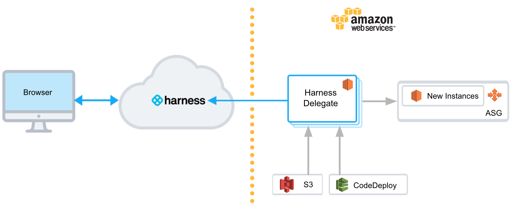You will install the Harness Shell Script Delegate on an EC2 instance in your AWS account, select a CodeDeploy application revision from your S3 bucket, and then deploy the app to the instances in the ASG.

### Step 1: Install and Launch the Shell Script Delegate

First we'll install the Harness Shell Script Delegate on the EC2 instance you set up with the IAM role you created for Harness CodeDeploy deployments. See [Before You Begin](#before_you_begin).

Install the Delegate in the same subnet where you will be deploying your app. It simplifies Harness deployments.To install the Delegate on your EC2 instance:

1. Sign into the Harness Manager.
2. Click **Setup**, and then click **Harness Delegates**.
3. Click **Download Delegate**, and then click **Shell Script**.
4. Enter a name for the Delegate, and select the **Primary** Profile.
5. Click **Copy Download Link**.

   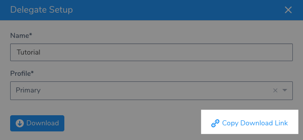
	 
6. Log into your EC2 instance, paste the Shell Script Delegate command, and hit **Enter**.
7. Once the Delegate is downloaded, unzip it (`tar -zxvf harness-delegate.tar.gz`), change directories into the **harness-delegate** folder and run the start command: `./start.sh`. Ignore any warning about the ulimit.

The Delegate will start and in a few moments you will see it listed in the **Harness Delegates** page.

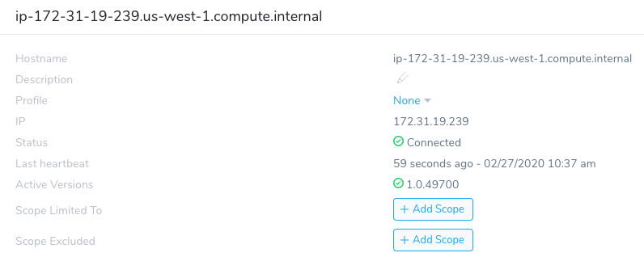

#### Delegate Selector

Add a Delegate Selector to the Delegate so you can use this Delegate when you create a Harness AWS Cloud Provider. This will ensure the IAM role applied to the Delegate is used by your AWS Cloud Provider.

1. In the Delegate listing on the **Harness Delegates** page, click **Edit** next to **Selector**.
2. Type in **codedeploy-tutorial**, press **Enter**, and then click **Submit**.  
  
The Selector is added to the Delegate.

### Step 2: Add an AWS Cloud Provider

In this section, we will add a Harness AWS Cloud Provider to your Harness account to connect to AWS CodeDeploy, EC2, and S3.

As Harness provides first-class support for [CloudWatch](../continuous-delivery/continuous-verification/continuous-verification-overview/concepts-cv/cloud-watch-verification-overview.md), you can also use the same AWS Cloud Provider for your CloudWatch connection.**Permissions:** The AWS Cloud Provider will assume the IAM Role associated with the EC2 host running the Delegate you installed in your VPC.

1. In the Harness Manager, click **Setup**, and then click **Cloud Providers**.
2. Click **Add Cloud Provider**. The **Cloud Provider** dialog appears. Enter the following settings:

   * **Type:** Select **Amazon Web Services**.
   * **Display Name:** Enter **CodeDeploy**.
   * **Credentials:** Select **Assume IAM Role on Delegate**.
   * **Delegate Selector:** Select the Delegate Selector you added to your Delegate, **codedeploy-tutorial**.

2. Click **Test** and then **Submit**.

Now that the hard part is done, you can quickly set up your CodeDeploy deployment in just a few minutes.

### Step 3: Add Your CodeDeploy App

Next we'll add the Linux app to use when performing the CodeDeploy deployment. We'll start by creating a Harness Application.

An Application in Harness represents a logical group of one or more entities, including Services, Environments, Workflows, Pipelines, Triggers, and Infrastructure Provisioners. Applications organize all of the entities and configurations in Harness CD. For more information, see [Harness Key Concepts](../starthere-firstgen/harness-key-concepts.md).

1. In Harness, click **Setup**, and then click **Add Application**. The Application settings appear.
2. Enter the name **CodeDeploy Example** and click **Submit**. The new Application is added.
3. In your new Application, click **Services**. The **Services** page appears.
4. In the **Services** page, click **Add Service**. The **Add** **Service** settings appear. Enter the following settings and then click **Submit**:

   * **Name:** Enter **CodeDeploy Example**.
   * **Deployment Type:** Select **AWS CodeDeploy**.

The new Service is listed.

Next, we'll select the Linux app to use when performing the CodeDeploy deployment.

First, you need to create a bucket and add the app to it. As you know, no two S3 buckets can have the same name. Create an S3 bucket named something similar to **codedeploy-quickstart-sample**.

Download the Linux SampleApp from AWS. This sample contains the required appspec.yml and scripts.

You can find a list of all the download locations in step 19 of [Step 2: Deploy the Application to the Amazon EC2 Auto Scaling Group](https://docs.aws.amazon.com/codedeploy/latest/userguide/tutorials-auto-scaling-group-create-deployment.html#tutorials-auto-scaling-group-create-deployment-console). Here is an example:

<http://s3.amazonaws.com/aws-codedeploy-us-east-1/samples/latest/SampleApp_Linux.zip>

Once the file is downloaded, upload it to your S3 bucket. When you're done your bucket will look something like this:

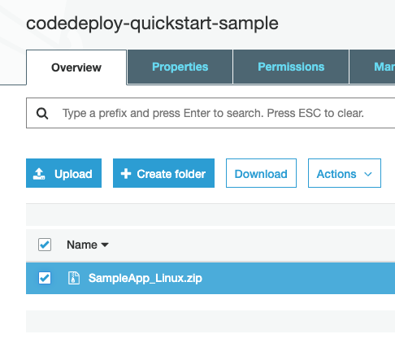

Now we'll add that S3 bucket and file as an Artifact Source in our Harness Service.

1. From the **Service Overview** section, click **Add Artifact Source**, then click **Amazon S3**.
2. In **Artifact Source**, enter the following settings and click **Submit**.

   * **Name:** Enter **SampleApp**.
   * **Cloud Provider:** Select the AWS Cloud Provider you added, **CodeDeploy**.
   * **Bucket:** Select the S3 bucket you used for the SampleApp.
   * **Artifact Path:** Select the SampleApp zip file.

Next, you can tell Harness what existing CodeDeploy deployment settings to use when it deploys the SampleApp.

### Step 4: Define Your CodeDeploy Deployment

Use the breadcrumb navigation to jump to **Environments**.

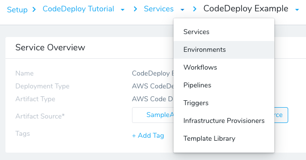

1. Click **Add Environment**. The **Environment** settings appear. Enter the following settings and click **Submit**:

   * **Name:** Enter **CodeDeploy**.
   * **Environment Type:** Select **Non-Production**.

   When you click **Submit**, the new Environment page appears. Next we will add an Infrastructure Definition to identify the related CodeDeploy information.

   An [Infrastructure Definition](../continuous-delivery/model-cd-pipeline/environments/environment-configuration.md#add-an-infrastructure-definition) for a CodeDeploy deployment specifies the CodeDeploy Application Name, Deployment Group, and Deployment Configuration.

  When you create the Harness Workflow later, you will pick this Infrastructure Definition to use for deployment.

2. Click **Add Infrastructure Definition**. The **Infrastructure Definition** dialog appears. Enter the following settings and click **Submit**:

   * **Name:** Enter **CodeDeployTutorial**.
   * **Cloud Provider Type:** Select **Amazon Web Services**.
   * **Deployment Type:** Enter **AWS CodeDeploy**.
   * **Cloud Provider:** Select the AWS Cloud Provider you added earlier, **CodeDeploy**.
   * **Region:** Select the region where your ASG and target instances are located.
   * **Application Name:** Select your existing CodeDeploy Application Name.
   * **Deployment Group:** Select your existing Deployment Group.
   * **Deployment Configuration:** Select **CodeDeployDefault.OneAtATime**.
   * **Host Name Convention:** Leave the default setting.

These settings correspond to your exiting CodeDeploy Deployment details:

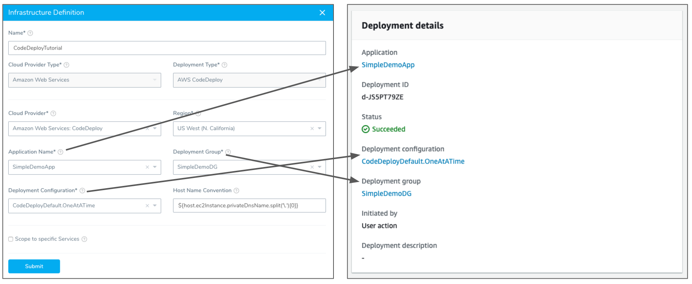

This is the last required step to set up the deployment Environment in Harness. With both the Service and Environment set up, you can now proceed to creating a deployment Workflow.

### Step 5: Build a CodeDeploy Basic Deployment

Next, we'll create a Harness Basic Workflow using the Service, Environment, and Infrastructure Definition you created.

Only Harness Basic deployment strategies are supported for CodeDeploy. See [Supported Platforms and Technologies](../starthere-firstgen/supported-platforms.md).1. Use the breadcrumb navigation to jump to **Workflows**, and then click **Add Workflow**. The Workflow settings appear. Enter the following settings and click **Submit**.

* **Name:** Enter **CodeDeployTutorial**.
* **Workflow Type:** Select **Basic Deployment**.
* **Environment:** Select the Environment you created, **CodeDeploy**.
* **Service:** Select the Service you created, **CodeDeploy Example**.
* **Infrastructure Definition:** Select the Infrastructure Definition you created, **CodeDeployTutorial**.

The new Basic Workflow appears with its steps pre-configured.

Click the **AWS CodeDeploy** step. This step corresponds to several CodeDeploy deployment settings:

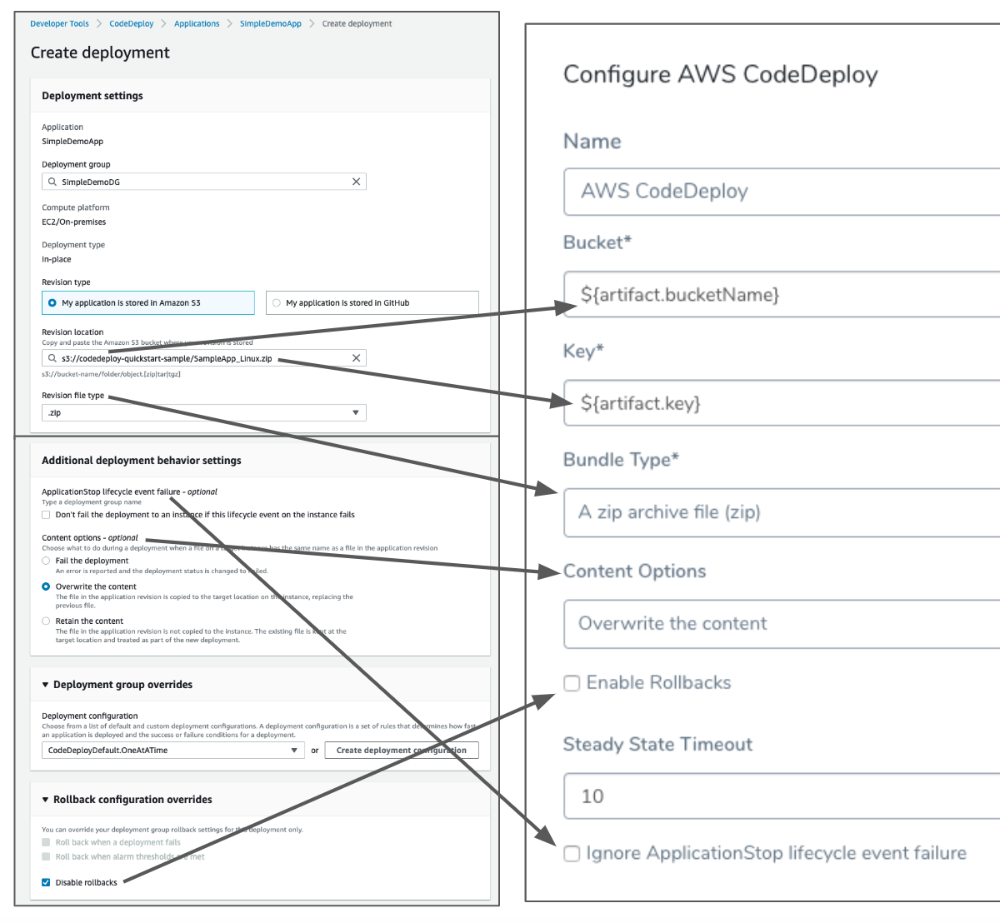

See [Create an EC2/On-Premises Compute Platform Deployment](https://docs.aws.amazon.com/codedeploy/latest/userguide/deployments-create-console.html) from AWS for details.

Review the following settings and click **Submit**.

* **Name:** Use **AWS CodeDeploy**.
* **Bucket:** The variables expression here gets the bucket name from the Harness Service.
* **Key:** The variables expression here gets the artifact URL from the Harness Service.
* **Bundle Type:** Select **zip**.
* **Content Options:** Select **Overwrite the content**.
* **Enable Rollbacks:** Leave this setting empty for this quickstart.
* **Steady State Timeout:** Harness considers steady state a successful deployment. You can control how long Harness waits.
* **Ignore ApplicationStop lifecycle event failure:** Enable this if you want a deployment to an instance to succeed if the ApplicationStop lifecycle event fails.

Your CodeDeploy Basic Workflow is complete. You can run the Workflow to deploy your app to the ASG.

### Step 6: Deploy and Review

Now that the Basic Workflow for CodeDeploy is set up, you can click **Deploy** in the Workflow to deploy it.

1. Click the **Deploy** button. The Deploy settings appear. Enter the following settings:
   **Artifacts** > **CodeDeploy Example**: Select **Build# SampleApp\_Linux.zip**.
	 **Send notification to me only:** Enable this setting if you are doing this quickstart using your corporate Harness account. Enabling this setting will ensure that other users won't be notified on this deployment. 
	 
2. Click **Submit**. The deployment executes.

Here's a example of what the deployment looks like typically:

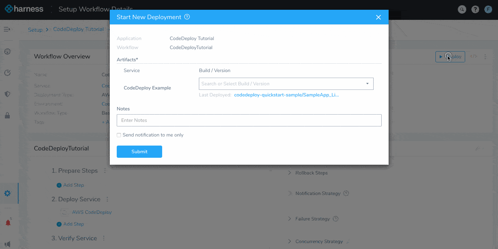

To see the completed deployment, log into your AWS CodeDeploy console, and click the Refresh button to view the latest deployment.

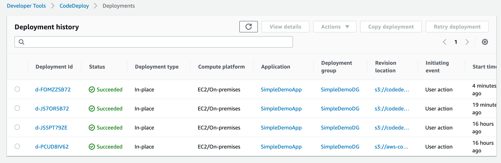

Click the **Deployment Id**.

Scroll to the bottom of the details page to the **Deployment lifecycle events** section.

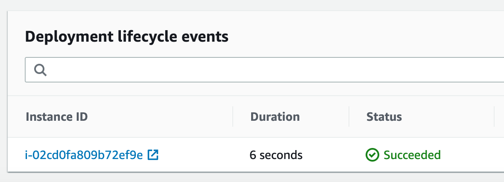

Click the **Instance ID** to launch EC2.

In EC2, the instance is selected. Copy the **Public DNS (IPv4)**, paste it in a browser tab, and then press **Enter**. The **Congratulations** page appears.

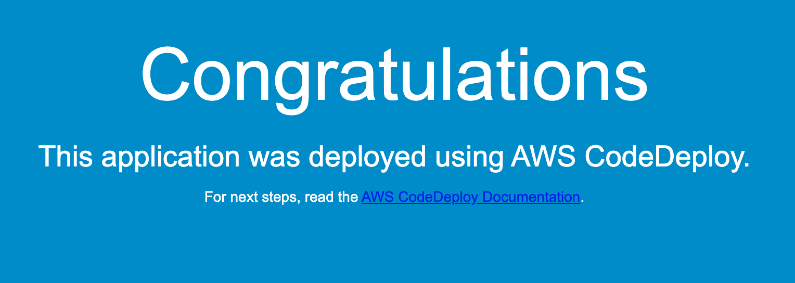

If the page doesn't appear, ensure that the **Inbound rules** for the security group used by the instance has HTTP open.Congratulations! You have completed the quickstart.

### Next Steps

In this quickstart, you learned how to:

* Set up the AWS IAM role and EC2 for the Harness Shell Script Delegate.
* Install the Harness Shell Script Delegate.
* Connect Harness with AWS.
* Specify the CodeDeploy application source to use for your new instances.
* Define the CodeDeploy Application, Deployment Group, Deployment Configuration for your app.
* Create and deploy a CodeDeploy Basic Workflow.

Read the following related How-tos:

* [Triggers](../continuous-delivery/model-cd-pipeline/triggers/add-a-trigger-2.md) show you how to automate deployments in response to different events.
* [CloudFormation Provisioner](../continuous-delivery/aws-deployments/cloudformation-category/cloud-formation-provisioner.md) will show you how to add provisioning as part of your Workflow.

