This quickstart shows you how to deploy a publicly available Docker image to your Amazon Elastic Container Service (ECS) cluster using a Canary Deployment strategy in Harness.

### Objectives

You'll learn how to:

* Set up AWS IAM and ECS for the Harness Delegate and Harness ECS deployments.
* Connect Harness with AWS, your ECS clusters, and Docker Hub.
* Add your Docker images to Harness.
* Define your container and service specs in Harness.
* Create and deploy an ECS Canary Workflow.

Once you have the prerequisites set up, the tutorial should only take about 10 minutes.

### Before You Begin

1. Review [Harness Key Concepts](../starthere-firstgen/harness-key-concepts.md) to establish a general understanding of Harness.
2. Create the following AWS IAM roles and two ECS clusters:

   * ​**ecsInstanceRole** — Ensure this role exists. See [Amazon ECS Instance Role](https://docs.aws.amazon.com/batch/latest/userguide/instance_IAM_role.html) from AWS.
   * **ECS Role for Delegate:** The Harness ECS Delegate requires an IAM role and policies to execute its deployment tasks (API calls, etc). Create a new IAM role named  **ECSDelegate** that contains: **AmazonEC2ContainerServiceforEC2Role**, and **AmazonEC2ContainerServiceRole** from AWS.
	   + **Customer Managed Policy** named **HarnessECS** you create for using Application Auto Scaling. See [Policy JSON Example ](#policy-json-example) below. 

     Attach all of these policies to one IAM role, or attach them all to ecsInstanceRole, and apply that to your ECS cluster as the **Container instance IAM role** when you create it.  
   
	   Once you have your role set up, you can create your clusters.
	 
   * **ECS Cluster for Harness Delegate:** You will need an existing ECS cluster to run the Harness ECS Delegate. The cluster for the Harness ECS Delegate must meet the following requirements:
	   + **EC2 Linux + Networking** cluster.
	   + The ECS Cluster must have a minimum of 8GB memory for the Delegate. A **m5.xlarge** minimum is suggested.
	   + 1 registered container instance.
	   + AWS IAM Role containing the required policies, described above. Apply the role you created to this cluster.  
	     In this tutorial, we will call the ECS cluster for the Delegate, **ecs-tutorial**.
   * **Target ECS Cluster:** The cluster for the Docker image must meet the same specs as the ECS Cluster for Harness Delegate above, except it needs **2 registered container instances**.  
   
	 We'll use two instances to perform Canary deployment: 50% in the first Canary phase, and 50% in the second phase.  
	 
   Also, you can simply use the standard **ecsInstance** role for the **Container instance IAM role**.  
   
	 In this tutorial, we will call the target ECS cluster for the Docker image, **ecs-example**.

The Delegate cluster does not need to be in the same VPC as the target cluster.

:::note
**Need a Cluster?** If you do not have an AWS account, you can use an  [AWS Free Tier account](https://aws.amazon.com/free/) and create an ECS cluster by following the steps in  [ECS Getting Started](https://console.aws.amazon.com/ecs/home?region=us-east-1#/getStarted) from Amazon. If you do have an AWS account and you want to evaluate Harness with ECS, you can simply create a new ECS cluster in your AWS account.
:::

#### Policy JSON Example 

<details>
	<summary>Policy JSON</summary>	

 ```
 {  

	 "Version": "2012-10-17",  

	 "Statement": [  

		 {  

			 "Effect": "Allow",  

			 "Action": [  

				 "ecr:DescribeRepositories",  

				 "ecs:ListClusters",  

				 "ecs:ListServices",  

				 "ecs:DescribeServices",  

				 "ecr:ListImages",  

				 "ecs:RegisterTaskDefinition",  

				 "ecs:CreateService",  

				 "ecs:ListTasks",  

				 "ecs:DescribeTasks",  

				 "ecs:DeleteService",  

				 "ecs:UpdateService",  

				 "ecs:DescribeContainerInstances",  

				 "ecs:DescribeTaskDefinition",  

				 "application-autoscaling:DescribeScalableTargets",  

				 "iam:ListRoles",  

				 "iam:PassRole"  

			 ],  

			 "Resource": "*"  

		 }  

	 ]  

 }  


 ```
</details>   

### Visual Summary

The following diagram shows the very simple topology for this tutorial:

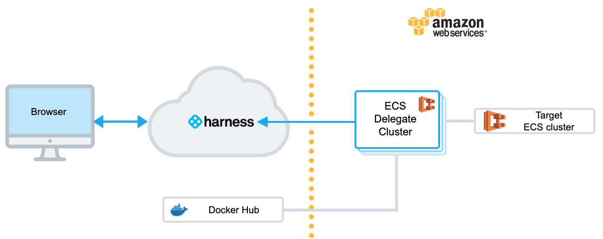You will install the Harness ECS Delegate in an ECS cluster in your AWS account, create a target cluster for deployment, and then use Harness for the rest of the set up and deployment.

### Step 1: Install and Launch the ECS Delegate

For ECS deployments, the Harness ECS Delegate is used to do the following:

* To perform all setup and deployment operations in AWS.
* As credentials for the AWS Cloud Provider.

The following procedure describes how to set up the ECS Delegate and add a Delegate Selector to it so you can use it later when you create the AWS Cloud Provider:

1. Download the ECS Delegate Task Spec.
	1. In **Harness Manager**, click **Setup**, and then click **Harness Delegates**.
	2. Click **Download Delegate**, and click the copy icon next to **ECS Task Spec**.  
	   The **Delegate Setup** dialog appears.
		 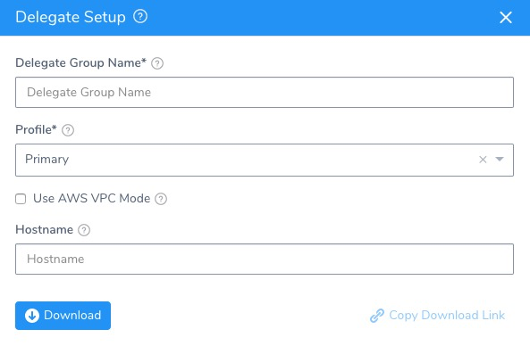
	3. In **Delegate Group Name**, enter the name ecs-tutorial. When you add more ECS Delegates in the future, you can add to this group. All Delegates in this group use the same Task Definition, and share the same Delegate settings, including Selectors. When you change a Selector, it will apply to all Delegates running under that Group.
	4. Leave **Profile** empty.
	5. Do not select **Use AWS VPC Mode**. We are using an EC2 cluster and **Use AWS VPC Mode** runs the ECS Delegate task with a [FARGATE launch type](https://docs.aws.amazon.com/AmazonECS/latest/developerguide/launch_types.html).
	6. Leave **Hostname** empty. ECS will use the default hostname **Harness-ECS-Delegate**.
	7. Click **Download**. The ECS Task Spec is downloaded. Next, you will use the aws CLI to register the ECS Task Spec and then create the ECS service for the ECS Delegate.
2. Register the ECS Task Spec in AWS.
	1. Open a Terminal and navigate to the folder where you downloaded the ECS Task Spec.  
	  
		```
		cd /Users/johnsmith/Desktop/delegates/ECS
		```
	2. Extract the ECS Task Spec download.  
	  	
		```
		tar -zxvf harness-delegate-ecs.tar.gz
		```
	3. Navigate to the extracted folder: `cd harness-delegate-ecs`.
	4. Log into AWS using your AWS Access Key ID and AWS Secret Key ID.  
	  
		```
		aws configure  
		  
		AWS Access Key ID [****************LPAA]: XXXXXXX  
		  
		AWS Secret Access Key [****************4z52]: XXXXXXX
		```
	
	5. Register the ECS task definition using the Harness ECS Task Spec.  
	  
	  ```
	  aws ecs register-task-definition --cli-input-json file://ecs-task-spec.json
	  ```
		
	  The JSON for the task is output.
		 
	6. View the completed task.  	  
	
	  ```
	   aws ecs list-task-definitions
	  ```
		
	The `taskDefinitionArns` is output.
	
3. Using the name of the ECS cluster for the Delegate, **ecs-tutorial**, you will create the ECS service using the Task Definition. The cluster must have a minimum of 8GB of memory (m5ad.xlarge minimum).

4. Create the ECS service for ECS Delegate.

	1. Create the ECS service using the task definition, providing the service name in `--service-name`, cluster name in `--cluster`, and the desired number of tasks in `--desired-count`. The cluster will need a minimum of 8GB of memory per task.    
	
	   ```
	   aws ecs create-service --service-name ecs-tutorial --task-definition harness-delegate-task-spec --cluster ecs-tutorial --desired-count 1
	   ```
	
	  The output will display the JSON for the new service.  
	
		```
		{  
		    "service": {  
		        "status": "ACTIVE",   
		        "serviceRegistries": [],   
		        "pendingCount": 0,   
		        "launchType": "EC2",   
		        "schedulingStrategy": "REPLICA",   
		        "loadBalancers": [],   
		        "placementConstraints": [],   
		        "createdAt": 1579134813.18,   
		        "desiredCount": 1,   
		        "serviceName": "ecs-tutorial",   
		...  
		}
		```
	
	2. View the new service.  
	  
		```
		aws ecs list-services --cluster ecs-tutorial
		```
		
	  The output will display the new service:  
	  	
		```
		{  
		    "serviceArns": [  
		        "arn:aws:ecs:us-east-1:XXXXX:service/ecs-tutorial"  
		    ]  
		}
		```
		
	3. Wait 5 to 10 minutes for ECS to allocate resources for the service.

When ECS is ready, the new service is running in the cluster:

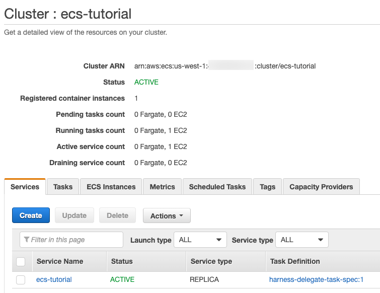

View the new ECS Delegate in Harness Manager.

1. In **Harness Manager**, in the **Installations** page. When the ECS Delegate connects to the Harness Manager, it is listed with a status of **Connected**: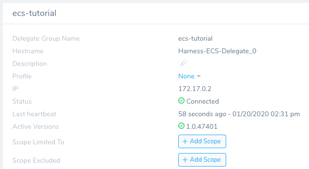Congratulations! You are done installing and running the ECS Delegate.

   Lastly, we'll add a Selector to identify and this Delegate when adding the AWS Cloud Provider later.

   Adding a Selector a Delegate allows you to instruct Harness to connect to AWS using the same IAM role as the ECS Delegate.

1. Once the Delegate is listed in Harness Manager, assign a Selector to the Delegate.
	1. Next to the **Selectors** label in the Delegate listing, click **Edit**.
	2. In the **Edit Selectors** dialog, enter the Selector name, **ecs-tutorial**, and press **Enter**. Click **SUBMIT**. The Selector is listed.

### Step 2: Add a AWS Cloud Provider

A Harness Cloud Provider represents your infrastructure, such as your AWS account. You can use your AWS account credentials to set up the AWS Cloud Provider or the AWS Cloud Provider can assume the credentials used by the Harness ECS Delegate you installed earlier.

In this tutorial, the AWS Cloud Provider will assume the credentials used by the Harness ECS Delegate using the Delegate Selector you applied.

1. In **Harness Manager**, click **Setup**.
2. Click **Cloud Providers**. The **Cloud Providers** page appears.
3. Click **Add Cloud Provider**. The **Cloud Provider** dialog appears.
4. Enter the following settings:

   * **Type:** Select **AWS**.
   * **Display Name:** Enter **ecs-tutorial**.
   * **Assume IAM Role on Delegate:** Enable the **Assume IAM Role on Delegate** option.
   * **Delegate Selector:** Select the Selector you gave the Delegate, **ecs-tutorial**.

Click **Test** and then **Submit** to add the AWS Cloud Provider.

Next, we'll add a Docker Registry Artifact Server so that you can pull a Docker image for the deployment.

### Step 3: Add a Docker Registry Artifact Server

Harness integrates with many different types of repositories and providers. For this tutorial, you will connect to Docker Hub anonymously.

1. In **Setup**, click **Connectors**.
2. Click **Artifact Servers**, and then click **Add Artifact Server**. The **Docker Artifact Server** settings appear.
3. Enter the following settings:

   * **Type:** Select **Docker Registry**.
   * **Display Name:** Enter **Docker Hub**. You will use this name to select this Artifact Server later when you add an artifact to a Harness Service.
   * **Docker Repository URL:** Enter `https://registry.hub.docker.com/v2/`.
   * **Username and Password:** Leave these empty.

4. Click Test, and then click the **SUBMIT** button.

:::note
If the test fails, it is possible that the Harness Delegate you installed cannot connect to `https://registry.hub.docker.com/v2/`. Ensure that the ECS cluster instance where the Delegate is installed can connect to that address.We don't need any other connectors for this tutorial. 
:::

Next, we'll add the Docker image artifact and Kubernetes manifests.

### Step 4: Add Your Artifact and ECS Specs

Now that all your connections are set up, you can start adding your Docker image artifact and the ECS container and service specs for the Docker image.

First, we'll create a Harness Application and Service, and look at the default specs.

The Harness Application represents a logical group of the ECS setup and release process, including the ECS container and service definitions, ECS cluster environment, and deployment workflow steps particular to each service you are deploying. .

1. In **Harness**, click **Setup**, and then click **Add Application**. The **Application** dialog appears.
2. Enter the name **ECS Tutorial**, and click **SUBMIT**. Your new Application appears.

   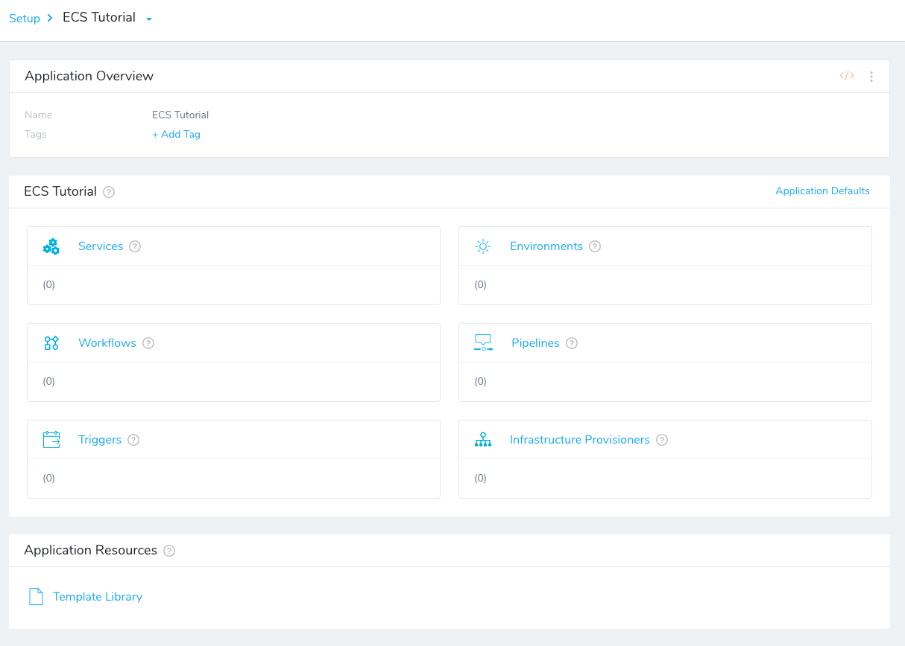
	 
   We won't cover all of the Application entities in this tutorial. We assume you've read  [Learn Harness' Key Concepts](../../getting-started/learn-harness-key-concepts.md).

   To add your specs, you create a Harness Service. Services represent your microservices/apps. You define the sources of app artifacts for those microservices, and you add your ECS specs.

:::note 
Harness Services are different from ECS services. Where a Harness Service describes your microservice, an ECS service is a specified number of task definition instances run and maintained simultaneously in an Amazon ECS cluster. For a detailed description of ECS services, see  [Services](https://docs.aws.amazon.com/AmazonECS/latest/developerguide/ecs_services.html) from AWS.
:::

3. Click **Services**. The **Services** page appears.
4. Click **Add Service**. The **Service** dialog appears.
5. Enter the following settings:

   * **Name:** Enter **MyApp ECS**.
   * **Deployment Type:** Select **Amazon EC2 Container Services (ECS).**

6. Click **SUBMIT**. The new service is listed.

   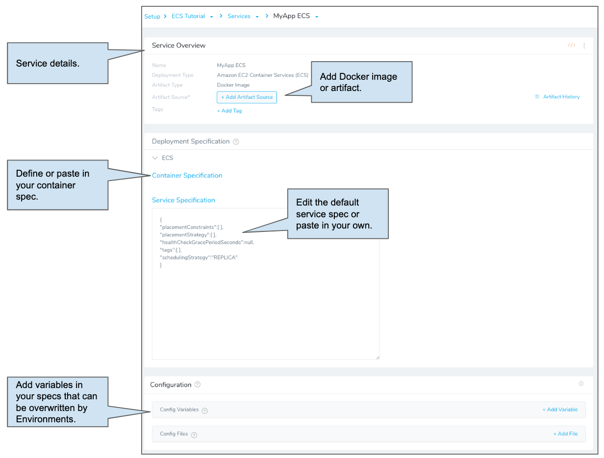
	 
    Next, we will add the Docker image artifact source to the Service: a sample app publicly hosted on Docker Hub.

7. Click **Add Artifact Source** and then click **Docker Registry**. The **Artifact Source - Docker Registry** settings appear.
8. Enter the following settings:

   * **Source Server:** Select the Artifact Server you added earlier, **Docker Hub**.
   * **Docker Image Name:** Enter `harness/todolist-sample`.

9. Click **Submit**. The artifact source is added.

:::note 
You can pull a list of artifacts from the source using **Artifact History**.
:::

   Now that the artifact source is added, you can add your ECS specs.

:::note 
If you are not very familiar with container and service specifications, see these examples from AWS: [Task Definitions for Amazon ECS](https://github.com/aws-samples/aws-containers-task-definitions), [Example Task Definitions](https://docs.aws.amazon.com/AmazonECS/latest/developerguide/example_task_definitions.html).
:::

10. Click **Container Specification** and enter the following settings:

   * **CPU:** Enter **1**.
   * **Memory:** Enter **1000**.
   * Leave the defaults for the rest of the settings.

If you click **Advanced Settings**, you can see the JSON for the container spec. These are the same as the JSON you use in the AWS ECS console for Container Instance **Task Definitions**:

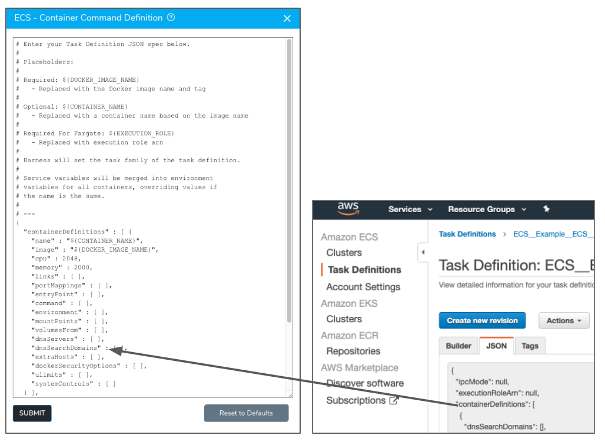

When you create your own container spec, you can simply paste in your own JSON, but be sure to be aware of the placeholders Harness uses:

|  |  |
| --- | --- |
| **Placeholder** | **Description** |
| `${DOCKER_IMAGE_NAME}` | Required. This placeholder is used with the image label in the JSON:`"image" : "${DOCKER_IMAGE_NAME}"`The placeholder is replaced with the Docker image name and tag at runtime. |
| `${CONTAINER_NAME}` | This placeholder is used with the name label in the JSON:`"name" : "${CONTAINER_NAME}"`The placeholder is replaced with a container name based on the Docker image name at runtime. |
| `${EXECUTION_ROLE}` | Required for Fargate. This placeholder is used with the executionRoleArn label in the JSON. For more information, see  [Amazon ECS Task Execution IAM Role](https://docs.aws.amazon.com/AmazonECS/latest/developerguide/task_execution_IAM_role.html) from AWS. |

Click **Submit**. For this tutorial, that's all you need to do here.

Next, we'll look at the ECS service definition for the ECS service we will deploy.

The service definition defines the task definition to use with the service we are deploying for our Docker image, how many instantiations of that task to run, which load balancers (if any) to associate with your tasks, as well as other service parameters.

For this tutorial, there's nothing to change in **Service Specification**. We'll use the common Replica [scheduling strategy](https://docs.aws.amazon.com/AmazonECS/latest/developerguide/ecs_services.html#service_scheduler).

### Step 5: Define Your Target ECS Cluster

Harness uses Environments to represent one or more of your deployment infrastructures, such as Dev, QA, Stage, Production, etc.

In each Environment, you define Infrastructure Definitions to describe your target ECS clusters. A single Infrastructure Definition can be used by multiple Harness ECS Services.

To create the Harness Environment for ECS, do the following:

1. Use the breadcrumb navigation to jump to **Environments**.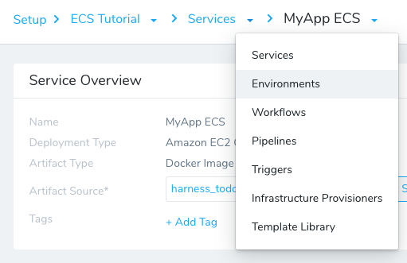
2. Click **Add Environment**. The **Environment** dialog appears. Enter the following settings:

   * **Name:** Enter **ECS Tutorial Cluster**.
   * **Environment Type:** Enter **Non-Production**.

   Click **Submit**. The new Environment appears. Next we will add an Infrastructure Definition to identify the ECS cluster, launch type, and related VPC information.

3. On your Environment page, click **Add Infrastructure Definition**. Enter the following settings:

   * **Name:** Enter **Tutorial Cluster**.
   * **Cloud Provider Type:** Select **Amazon Web Services**.
   * **Deployment Type:** Select **Amazon EC2 Container Services (ECS)**.
   * **Cloud Provider:** Select the AWS Cloud Provider you added for this tutorial, **ecs-tutorial**.
   * **Region:** Select the region where your target ECS cluster is located.
   * **Cluster Name:** Select the target ECS cluster, **ecs-example**. If you are using one cluster for the Delegate and target, then select that cluster.
   * **Launch Type:** Click **EC2 Instances**.

Leave the defaults for the rest of the settings.If you like, you can enter the VPC, Security Groups, and Subnet where your target cluster is located, but it isn't necessary. |

Click **Submit**. The new Infrastructure Definition is added to your Environment.

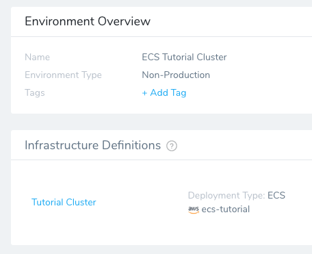

You will select this Environment and Infrastructure Definition when you create your Harness Workflow.

### Step 6: Build a Basic Deployment

Now that you have a Docker image and target ECS cluster, you can create a Harness Workflow to deploy the image to the cluster.

In this tutorial, we will use the popular Canary Deployment strategy. In Canary, all pods in a single cluster are updated incrementally in small phases, with each phase verified as successful before proceeding to the next phase.

1. Use the breadcrumb navigation to jump to **Workflows**, and then click **Add Workflow**. The Workflow settings appear.
2. Enter the following settings:

   * **Name:** Enter **MyApp ECS Canary**.
   * **Workflow Type:** Select **Canary Deployment**.
   * **Environment:** Select the Environment you added earlier, **ECS Tutorial Cluster**.

   Click **SUBMIT**. The new Workflow is displayed.

   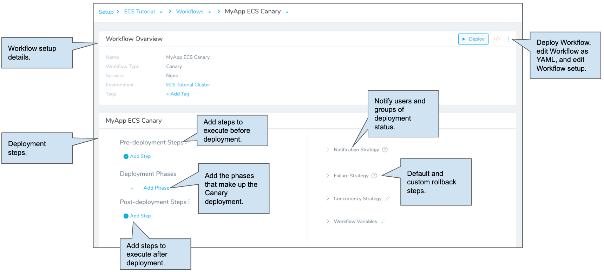

   Next, we will add two phases for the Canary deployment. The first phase will set up your ECS service and then upgrade ECS service instances to 50% of the available ECS service instances.

3. In the Workflow, in **Deployment Phases**, click **Add Phase**. The **Workflow Phase** dialog appears.
4. Enter the following settings:

   * **Service:** Select **MyApp ECS** if it is not already selected.
   * **Infrastructure Definition:** Select the **Tutorial Cluster** you set up earlier.

   Click **Submit**. Here you can steps of Phase 1 of the Workflow.

   [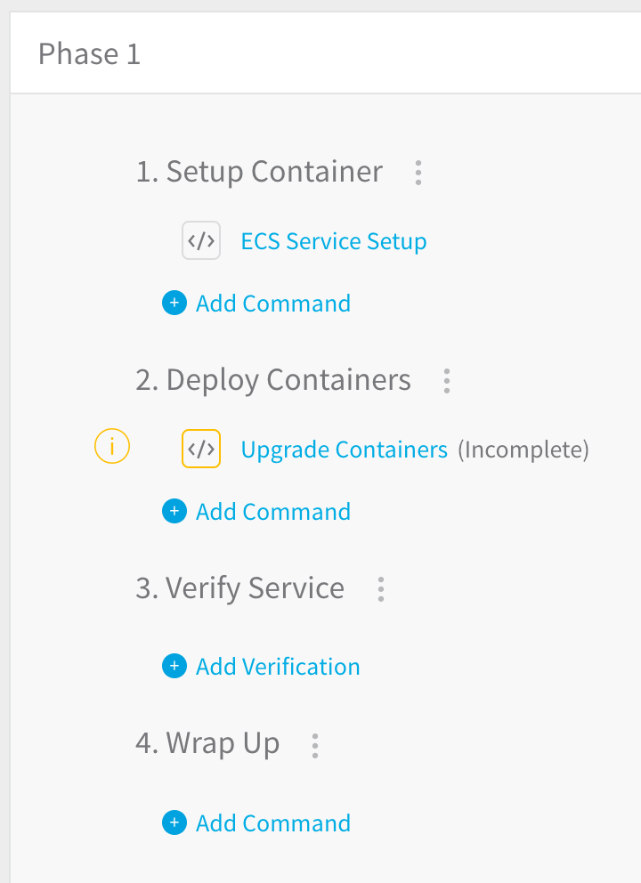](./static/aws-ecs-deployments-119.png)
	 
5. Click **ECS Service Setup**. The **Configure** **ECS Service Setup** settings appear. Enter the following settings:

   * **ECS Service Name:** Leave the default concatenation of the Harness Application, Service, and Environment names.
   * **Desired Instance Count:** Select **Fixed**, and then enter **2** in **Fixed Instances Count**. This is the number of desired ECS service instances for this stage, which suits our Canary strategy.

   Leave the defaults for the rest of the settings.

6. Close or Submit the **ECS Service Setup** dialog to return to the **Phase 1** page.
7. Click **Upgrade Containers**. The **Upgrade Containers** settings appear. Enter the following settings:

   * **Name:** This is simply the name of the step. You can leave the default.
   * **Desired Instances:** Enter **50** and select **Percent**.

   The value in **Desired Instances** relates to the number of ECS service instances set in the **ECS Service Setup** dialog. For example, since you entered **2** in **Fixed** in **ECS Service Setup** and then enter **50 Percent** in **Upgrade Containers**, that means, for this phase, Harness will deploy **1** ECS service instance.

8. Click **SUBMIT**.

9. To add the second Phase of this Canary deployment, click the name of the Workflow **MyApp ECS Canary** in the breadcrumb links to return to the **Workflow** page.

   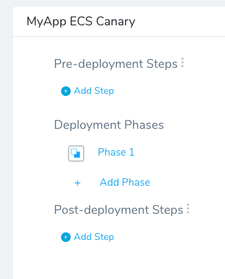
	 
10. Click **Add Phase**. In the **Workflow Phase** dialog, enter the following settings:

    * **Service:** Select **MyApp ECS** if it is not already selected.
    * **Infrastructure Definition:** Select the **Tutorial Cluster** you set up earlier.

11. Click **Submit**. Here you can see the steps of Phase 2 of the Workflow.

    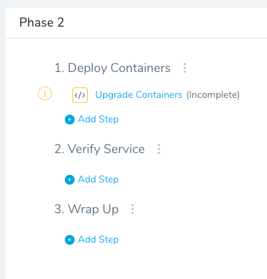
		
    As this is the second phase in the Canary deployment, and will only run if Phase 1 deployed successfully.

    For Phase 2, let's upgrade the number of containers to 100%.

12. Click **Upgrade Containers**. The **Upgrade Containers** dialog appears. Enter the following settings:

   * **Name:** Leave the default name.
   * **Desired Instances:** Enter **100** and **Percent** if it's not already configured.

13. Click **SUBMIT**. This will deploy to the full count of ECS service instances.

The Workflow is complete. You can run the Workflow to deploy the ECS service with the Replica strategy to your ECS cluster.

### Step 7: Deploy and Review

Now that your ECS Canary Workflow is complete you can deploy it to your cluster.

1. If you're not already on the main Workflow page, use the breadcrumb navigation to navigate to **MyApp ECS Canary**.
2. Click the **Deploy** button. The Deploy settings appear. Enter the following settings:

   * **Artifacts** > **MyApp ECS:** Select an artifact from the Artifact Source you added to the Harness Service. In this tutorial, we are using a public Docker image. Select a build/version such as **Tag# 9**.
   * **Send notification to me only:** Enable this setting if you are doing this tutorial using your corporate Harness account. Enabling this setting will ensure that other users won't be notified on this deployment.

3. Click **Submit**. The deployment executes.

Here's a example of what the deployment looks like typically:


### Next Steps

In this tutorial, you learned how to:

* Install and launch a Harness ECS Delegate in a cluster.
* Connect Harness to your ECS cluster and an Artifact Server.
* Add your container and service specs to Harness.
* Create an Infrastructure Definition that targets your cluster.
* Create an ECS Canary Workflow, deploying to 50% in Phase 1 and 100% in Phase 2.
* Deploy your ECS Canary Workflow to your target cluster.

Read the following related How-tos:

* [ECS Deployments Overview](../continuous-delivery/aws-deployments/ecs-deployment/ecs-deployments-overview.md) will show you how to other deployments using different scheduling and deployment strategies.
* [Triggers](../continuous-delivery/model-cd-pipeline/triggers/add-a-trigger-2.md) show you how to automate deployments in response to different events.
* [CloudFormation Provisioner](../continuous-delivery/aws-deployments/cloudformation-category/cloud-formation-provisioner.md) will show you how to add provisioning as part of your Workflow.

