This content is for Harness [FirstGen](../../getting-started/harness-first-gen-vs-harness-next-gen.md). Switch to [NextGen](../../continuous-delivery/deploy-srv-diff-platforms/serverless-lambda-cd-quickstart.mdws you how to deploy a Node.js function to your AWS Lambda service using a Basic Deployment strategy in Harness.

### Objectives

You'll learn how to:

* Set up and verify AWS IAM and EC2 for the Harness Shell Script Delegate.
* Install the Harness Shell Script Delegate.
* Connect Harness with AWS.
* Add your Lambda function file and specification to Harness.
* Create and deploy a Lambda Basic Workflow.

Once you have the prerequisites set up, the tutorial should only take about 10 minutes.

### Before You Begin

1. Review [Harness Key Concepts](../starthere-firstgen/harness-key-concepts.md) to establish a general understanding of Harness.
2. Create an AWS **IAM Role for Harness Lambda Deployments**:  

   Create an IAM role with the following policies attached and use the role when you create the EC2 instance for the Harness Shell Script Delegate:

	 * **​AmazonEC2FullAccess:** Needed for Shell Script Delegate on EC2 instance.
	 * **IAMReadOnlyAccess:** Needed to verify required policies.
	 * **AWSLambdaRole:** Needed to invoke function.
	 * **AWSLambda\_FullAccess** (previously **AWSLambdaFullAccess**)**:** Needed to write to Lambda.
	 * **AmazonS3ReadOnlyAccess:** Needed to pull the function file from S3.
	 
		For example, if the role you created was named `LambdaTutorial`, you can attach the policies like this:

		```
		$ aws iam attach-role-policy --policy-arn arn:aws:iam::aws:policy/AmazonEC2FullAccess --role-name LambdaTutorial  

		$ aws iam attach-role-policy --policy-arn arn:aws:iam::aws:policy/service-role/AWSLambdaRole --role-name LambdaTutorial  

		$ aws iam attach-role-policy --policy-arn arn:aws:iam::aws:policy/IAMReadOnlyAccess --role-name LambdaTutorial  

		$ aws iam attach-role-policy --policy-arn arn:aws:iam::aws:policy/AWSLambdaFullAccess --role-name LambdaTutorial  

		$ aws iam attach-role-policy --policy-arn arn:aws:iam::aws:policy/AmazonS3ReadOnlyAccess --role-name LambdaTutorial  

		```

	 * **AWS Lambda Execution Role** — As a Lambda user, you probably already have the AWS Lambda Execution Role set up. If you do not, follow the steps in [AWS Lambda Execution Role](https://docs.aws.amazon.com/lambda/latest/dg/lambda-intro-execution-role.html) from AWS. You will use this role when you set up an Infrastructure Definition later in the tutorial.
	 
3. Create an EC2 instance for the Harness Shell Script Delegate.  
 The instance must meet the following requirements:
	* Linux/UNIX server.
	* ​Minimum 1 CPU.
	* Minimum 8GB RAM. For example, an AWS EC2 instance type such as **m5a.xlarge** has 16GB of RAM, 8 for the Delegate and 8 for the remaining operations.
	* Minimum 6GB Disk space.
	* Create the EC2 Instance in the same region, VPC, and ideally, one of the subnets used by your functions.
	* Attach the IAM role you created to this instance.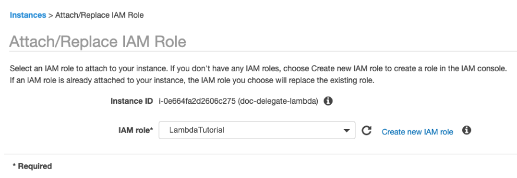
4. Create an AWS S3 bucket or use an existing S3 bucket to upload the function used here.  

   We'll being using a file named **index.js** containing the following function:
		```
		exports.handler = function(event, context, callback) {  
		   console.log("Received event: ", event);  
		   var data = {  
		       "greetings": "Hello, " + event.firstName + " " + event.lastName + "."  
		   };  
		   callback(null, data);  
		}
		```
  
	You can download the zip file here: <https://lambda-tutorial-harness.s3.amazonaws.com/function.zip>.  
	If you want to create the file yourself, in a code editor, create the file **index.js** and paste in the above code. Zip the file and name the zip file function.zip.  
	Upload the function.zip file to a bucket in your AWS S3. In our example, we named the bucket **lambda-harness-tutorial**.

### Visual Summary

The following diagram shows the very simple topology for this tutorial:

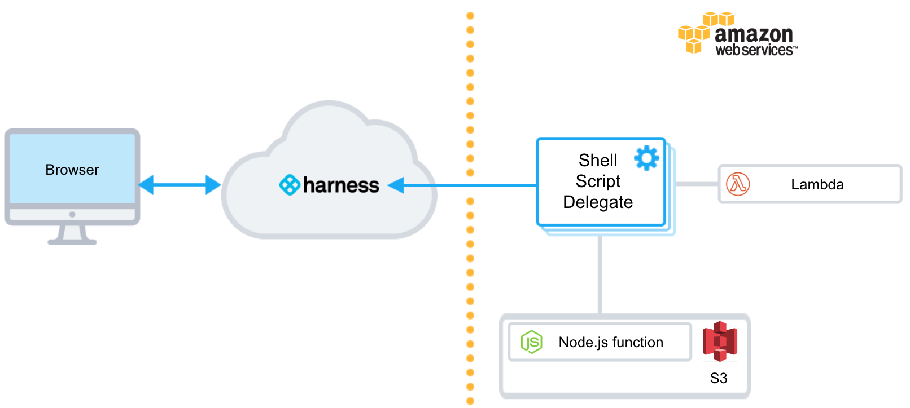You will install the Harness Shell Script Delegate on an EC2 instance in your AWS account, select a target VPC for deployment, and then use Harness to pull a Node.js function from S3 and deploy it to Lambda.

### Step 1: Install and Launch the Shell Script Delegate

First we'll install the Harness Shell Script Delegate on the EC2 instance you set up with the IAM role you created for Harness Lambda deployments.

To install the Delegate on your EC2 instance:

1. Sign into the Harness Manager.
2. Click **Setup**, and then click **Harness Delegates**.
3. Click **Download Delegate**, and then click **Shell Script**.
4. Enter a name for the Delegate, and select the **Primary** Profile.
5. Click **Copy Download Link**.
6. Log into your EC2 instance, paste the Shell Script Delegate command, and hit **Enter**.
7. Once the Delegate is downloaded, unzip it (`tar -zxvf harness-delegate.tar.gz`), change directories into the **harness-delegate** folder and run the start command: `./start.sh`. Ignore any warning about the ulimit.

The Delegate will start and in a few moments you will see it listed in the **Harness Delegates** page.

[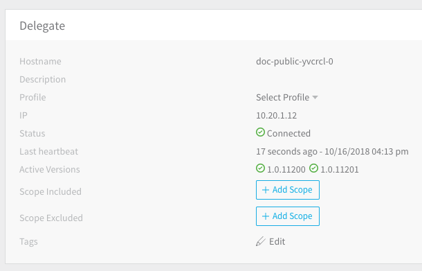](./static/aws-lambda-deployments-23.png)

#### Delegate Selector

Add a Delegate Selector to the Delegate so you can use it when you create a Harness AWS Cloud Provider, in the next step in this tutorial. This will ensure the IAM role applied to the Delegate is used by your AWS Cloud Provider.

1. In the Delegate listing on the **Harness Delegates** page, click **Edit** next to **Selectors**.
2. Type in **AWS-Tutorial**, press **Enter**, and then click **Submit**. The Selector is added to the Delegate.

### Step 2: Add a Harness AWS Cloud Provider

In this section, we will add a Harness AWS Cloud Provider to your Harness account to connect to both AWS S3, Lambda, and the VPC. You can use a single or separate AWS Cloud Providers for the connections, but using a single AWS Cloud Provider is easiest.

As Harness provides first-class support for [CloudWatch](../continuous-delivery/continuous-verification/continuous-verification-overview/concepts-cv/cloud-watch-verification-overview.md), you can also use the same AWS Cloud Provider for your CloudWatch connection.**Permissions:** The AWS Cloud Provider will assume the IAM Role associated with the Delegate you installed in your VPC.

1. In the Harness Manager, click **Setup**, and then click **Cloud Providers**.
2. Click **Add Cloud Provider**. The **Cloud Provider** dialog appears. Enter the following settings:

   * **Type:** Select **Amazon Web Services**.
   * **Display Name:** Enter **AWS-Tutorial**.
   * **Credentials:** Select **Assume IAM Role on Delegate**.
   * **Delegate Selector:** Select the Delegate Selector you added to your Delegate, **AWS-Tutorial**.

3. Click **Test** and then **Submit**.

Now that the hard part is done, you can quickly set up your Lambda deployment in just a few minutes.

### Step 3: Add Your Lambda Function

Now we'll add a Lambda function and configure its Lambda Function Specification. We'll start by creating a Harness Application.

An Application in Harness represents a logical group of one or more entities, including Services, Environments, Workflows, Pipelines, Triggers, and Infrastructure Provisioners. Applications organize all of the entities and configurations in Harness CD. For more information, see [Create an Application](../continuous-delivery/model-cd-pipeline/applications/application-configuration.md).

#### Create a Harness Application

To create the Harness Application, do the following:

1. In Harness, click Setup, and then click **Add Application**. The Application settings appear.
2. Enter the name **Lambda-Tutorial** and click **SUBMIT**. The new Application is added.

   [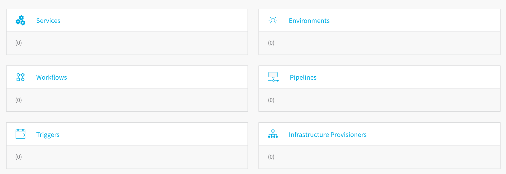](./static/aws-lambda-deployments-25.png)
	 
We won't cover all of the Application entities in this tutorial. We assume you've read [Harness Key Concepts](../starthere-firstgen/harness-key-concepts.md).

#### Create a Harness Service

To add your function and spec, you create a Harness Service. Services represent your microservices, apps, or functions. You define their sources as artifacts and you add your specs.

1. Click **Services**. The **Services** page appears.
2. Click **Add Service**. The **Service** dialog appears.
3. Enter the following settings and click **Submit**:

   * **Name:** Enter **MyFunction**.
   * **Deployment Type:** Select **AWS Lambda**.

   The new Service is listed.

   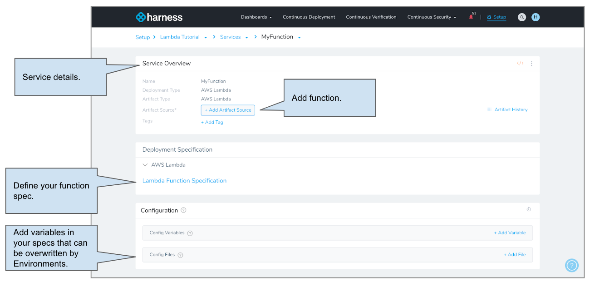
	 
#### Add an Artifact Source

1. Use the AWS S3 bucket to which you uploaded the function.zip file as part of the prerequisites. In our example, we named the bucket **lambda-harness-tutorial**.

	 We use S3 in this quickstart, but Harness supports the following artifact sources with Lambda:

	 * [Jenkins](../firstgen-platform/account/manage-connectors/add-jenkins-artifact-servers.md)
	 * [Artifactory](../firstgen-platform/account/manage-connectors/add-artifactory-servers.md)
	 * [AWS S3](../continuous-delivery/aws-deployments/lambda-deployments/1-delegate-and-connectors-for-lambda.md)
	 * [Nexus](../firstgen-platform/techref-category/cd-ref/artifacts-ref/nexus-artifact-sources.md)
	 * [Custom Artifact Source](../continuous-delivery/model-cd-pipeline/setup-services/custom-artifact-source.md)

2. In your Harness Service, click **Add Artifact Source** and select **Amazon S3**. The Amazon S3 settings appear. Enter the following settings:

   * **Name:** Enter **example-function**.
   * **Cloud Provider:** Select the AWS Cloud Provider you added earlier, **AWS-Tutorial**.
   * **Bucket:** Select the bucket where you uploaded the function.zip file. In our example, we named the bucket **lambda-harness-tutorial**.
   * **Artifact Path:** Select **function.zip**.

   This grabs the file from your AWS S3 bucket, for example:

   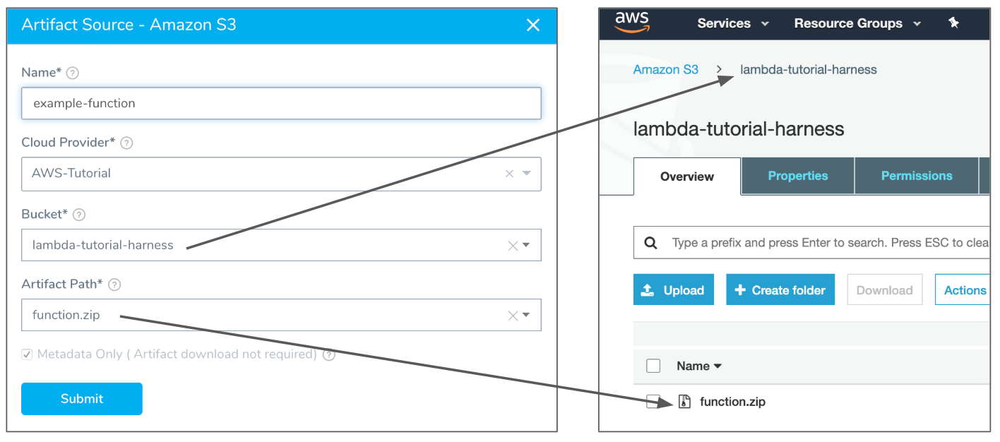

:::note 
The **Meta-data Only** option is selected by default. Harness will not copy the actual zip file. During runtime, Harness passes the metadata to Lambda where it is used to obtain the file.
:::

3. Click **SUBMIT**. The Lambda function file is added as an Artifact Source.

#### Add AWS Lambda Function Specification

Next, we'll add the Lambda Function Specification to provide details about the Lambda functions in the zip file in Artifact Source.

1. Click **Lambda Function Specification**. The **AWS Lambda Function Specifications** dialog appears. Enter the following settings:

:::note 
The details you provide are very similar to the options in the AWS CLI `aws lambda create-function` command. For more information, see  [create-function](https://docs.aws.amazon.com/cli/latest/reference/lambda/create-function.html) from AWS.
:::

   * **Runtime:** Select **nodejs12.x**.
   * **Memory Size** and **Execution Timeout:** Leave the defaults.
   * **Function Name:** Enter **tutorialFunction**.
   * **Handler:** Enter **index.handler**.
   * **Memory Size** and **Execution Timeout** for the function**:** Leave the defaults.

	If you remember the code sample for our function, the value of the **Handler** setting is the file name (**index**) and the name of the exported handler module, separated by a dot. In our example, the handler is **index.handler**.

:::note 
If you had multiple Lambda functions in the zip file in Artifact Source, you could click **Add Function** and provide details for each function.
:::

2. Click **SUBMIT**. Your function is added to the Service.

### Step 4: Define Your Lambda Target Infrastructure

Now that we've added a Lambda Service to your Application, we'll define an Environment where your function will be deployed. In an Environment, you specify the AWS VPC settings as an Infrastructure Definition.

1. Use the breadcrumb navigation to jump to **Environments**.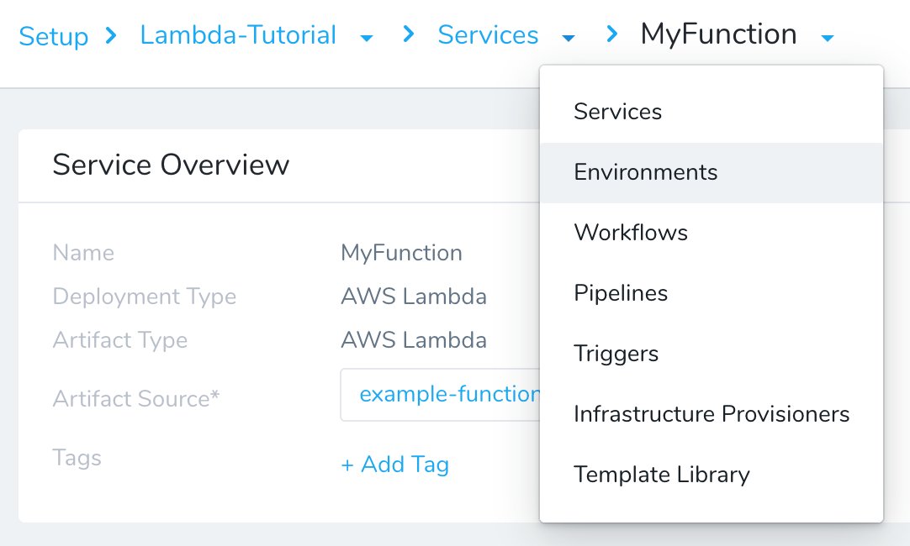
2. Click **Add Environment**. The **Environment** dialog appears. Enter the following settings:

   * **Name:** Enter **LambdaTutorial**.
   * **Environment Type:** Select **Non-Production**.

:::note 
Later on in this tutorial you will see that we use the Environment name as a Lambda Alias. Consequently, the Environment name must meet the Lambda Alias name requirements, which do not permit spaces. Hence, we use **LambdaTutorial** here.
:::

3. Click **SUBMIT**. The new **Environment** page appears. Next we will add an Infrastructure Definition to identify the related VPC information.
4. On your Environment page, click **Add Infrastructure Definition**. Enter the following settings:

:::note 
AWS Lambda uses this information to set up elastic network interfaces (ENIs) that enable your function to connect securely to other resources within your private VPC. For more information and guidelines, see  [Configuring a Lambda Function to Access Resources in an Amazon VPC](https://docs.aws.amazon.com/lambda/latest/dg/vpc.html) from AWS.
:::

   * **Name:** Enter **LambdaTutorialVPC**.
   * **Cloud Provider Type****:** Select **Amazon Web Services**.
   * **Deployment Type:** Select **AWS Lambda**.
   * Select **Use** **Already Provisioned Infrastructure**.
   * **Cloud Provider:** Select the AWS Cloud Provider you added earlier, AWS-Tutorial.
   * **IAM Role:** Select the [AWS Lambda Execution Role](https://docs.aws.amazon.com/lambda/latest/dg/lambda-intro-execution-role.html) that AWS Lambda assumes when it executes your function.
   * **Region:** Select the AWS region where your function will be used.
   * **VPC:** Select the VPC for the function.
   * **Subnets:** Select one or more of the subnets where the Lambda function will access resources.
   * **Security Groups:** Select a security group for the function.

   The **Infrastructure Definition** settings are similar to the `‑‑role` and `‑‑vpc-config` options in the `aws lambda create-function` command. For example:

		```
		$ aws lambda create-function --function-name example-function \       
		--runtime nodejs12.x --handler index.handler --zip-file lambda/function.zip \      
		--role execution-role-arn \       
		--vpc-config SubnetIds=<subnet-ids>,SecurityGroupIds=<security-group-ids>
		```
		
   These are the same as the **Network** section of a Lambda function:

   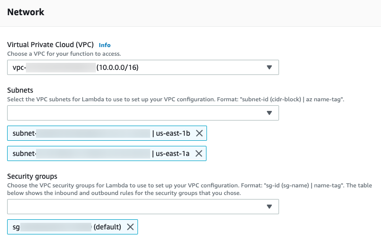

5. Click **Submit**. The new Infrastructure Definition is added to the Harness Environment.

You will select this Environment and Infrastructure Definition when you create your Harness Workflow.

### Step 5: Build a Basic Lambda Workflow

The Lambda Basic Workflow you will create has two steps, generated by Harness automatically:

* **AWS Lambda** - This step deploys the function and also sets the Lambda aliases and tags for the function.
* **Rollback AWS Lambda** - If a deployment fails, this step uses aliases to roll back to the last successful version of a Lambda function.

1. Use the breadcrumb navigation to jump to **Workflows**, and then click **Add Workflow**. The Workflow settings appear.

   * **Name:** Enter **MyFunction Lambda Tutorial**.
   * **Workflow Type:** Select **Basic**.
   * **Environment:** Select the Environment you created earlier, **LambdaTutorial**.
   * **Service:** Select the Service you created earlier, **MyFunction**.
   * **Infrastructure Definition:** Select the Infrastructure Definition you created earlier, **LambdaTutorialVPC**.

2. Click **SUBMIT**. The new Basic Workflow is created and pre-configured with the **AWS Lambda** step.

   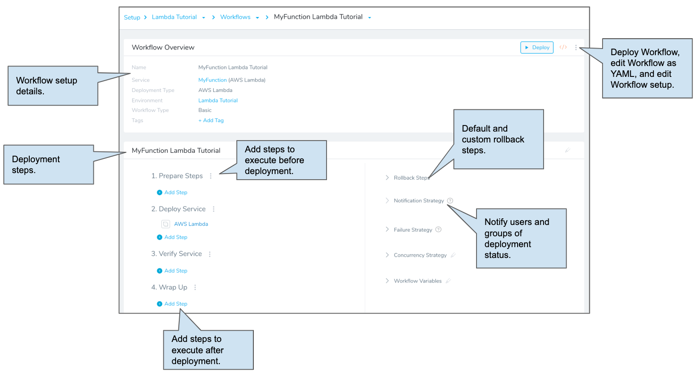
	 
Next, let's look at the pre-configured **AWS Lambda** step.

#### AWS Lambda Step

When you deploy the Workflow, the AWS Lambda step creates the Lambda functions defined in the Service you attached to the Workflow. This is the equivalent of the  [aws lambda create-function](https://docs.aws.amazon.com/cli/latest/reference/lambda/create-function.html) API command.

The next time you run the Workflow, manually or as the result of a  [Trigger](../continuous-delivery/model-cd-pipeline/triggers/add-a-trigger-2.md), the AWS Lambda step updates the Lambda functions. This is the equivalent of the  [aws lambda update-function-configuration](https://docs.aws.amazon.com/cli/latest/reference/lambda/update-function-configuration.html) API command.

1. In the Workflow, click the **AWS Lambda** step. The **Configure** **AWS Lambda** settings appear. Enter or review the following settings:

   * **Name:** Simply the name of the step.
	 * **Aliases:** Lambda [function alias](https://docs.aws.amazon.com/lambda/latest/dg/configuration-aliases.html) for the function you are deploying.
	 * **Tags:** Click **Add**, in **Key**, enter **Name**, and in **Value** enter **tutorialFunction**. |

	The AWS Lambda step in the Workflow applies the alias just like you would using the AWS Lambda console.

	By default, Harness names the alias with the name of the Environment by using the built-in Harness variable **${env.name}**. You can replace this with whatever alias you want, or use other built-in Harness variables by entering **$** and seeing what variables are available.

	You can set the tags for your Lambda functions in the **AWS Lambda** step and, once deployed, you can see the tags in the AWS Lambda console.

2. Click **Submit**.

Your Lambda Workflow is complete. You can run the Workflow to deploy the Lambda function to your AWS Lambda service.

### Step 6: Deploy Your Lambda Function

Now that the Basic Workflow for Lambda is set up, you can click **Deploy** in the Workflow to deploy the Lambda functions in the Harness Service to your AWS Lambda environment.

1. If you're not already on the main Workflow page, use the breadcrumb navigation to navigate to **MyFunction Lambda Tutorial**.
2. Click the **Deploy** button. The Deploy settings appear. Enter the following settings:

   * **Artifacts** > **MyFunction:** Select **Build# function.zip**.
   * **Send notification to me only:** Enable this setting if you are doing this tutorial using your corporate Harness account. Enabling this setting will ensure that other users won't be notified on this deployment.

3. Click **Submit**. The deployment executes.

Here's an example of a typical deployment:

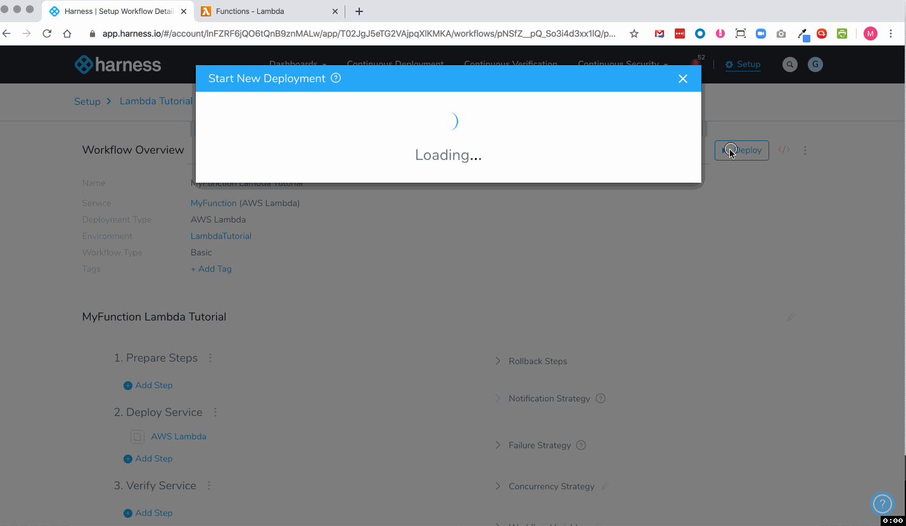

To see the completed deployment, log in to your AWS Lambda console. The Lambda function is listed:

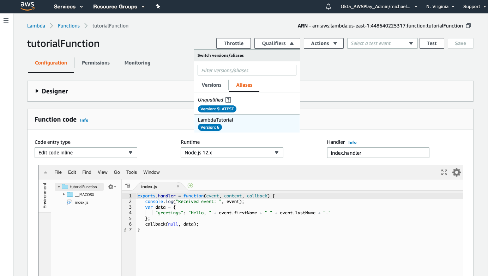

You can also log into AWS and use the  [aws lambda get-function](https://docs.aws.amazon.com/cli/latest/reference/lambda/get-function.html) command to view the function.

#### View Lambda Deployments in the Serverless Functions Dashboard

Harness Manager's Serverless Functions Dashboard offers views of your Lambda deployment data.

Here is an individual Lambda deployment and how it is displayed on the Serverless Functions dashboard:

[](./static/aws-lambda-deployments-34.png)

See  [Serverless Functions Dashboard](../firstgen-platform/techref-category/monitoring-ref/serverless-functions-dashboard.md).

To see your Lambda invocations on the Serverless Dashboard, the  [Execution Role](https://docs.aws.amazon.com/lambda/latest/dg/lambda-intro-execution-role.html) for the Lambda function must have the following policies:

* AmazonEC2FullAccess
* AWSLambdaFullAccess
* AWSLambdaVPCAccessExecutionRole
* AWSLambdaRole
* CloudWatchReadOnlyAccess

### Next Steps

In this tutorial, you learned how to:

* Set up and verify AWS IAM and EC2 for the Harness Shell Script Delegate.
* Install the Harness Shell Script Delegate.
* Connect Harness with AWS.
* Add your Lambda function file and specification to Harness.
* Create and deploy a Lambda Basic Workflow.

Read the following related How-tos:

* [Lambda Deployment Overview](../continuous-delivery/aws-deployments/lambda-deployments/lambda-deployment-overview.md).
* [Triggers](../continuous-delivery/model-cd-pipeline/triggers/add-a-trigger-2.md) show you how to automate deployments in response to different events.
* [CloudFormation Provisioner](../continuous-delivery/aws-deployments/cloudformation-category/cloud-formation-provisioner.md) will show you how to add provisioning as part of your Workflow.

