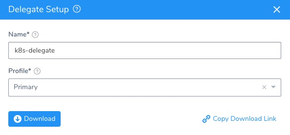
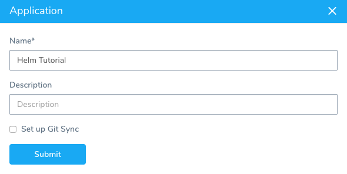
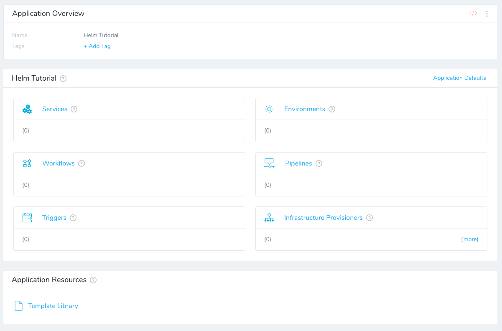
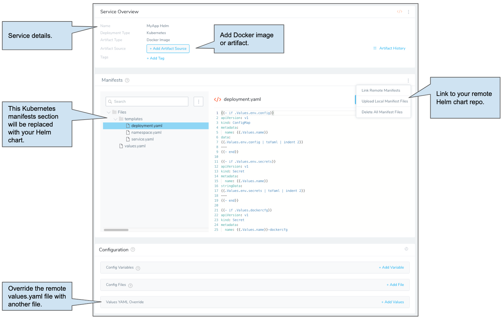
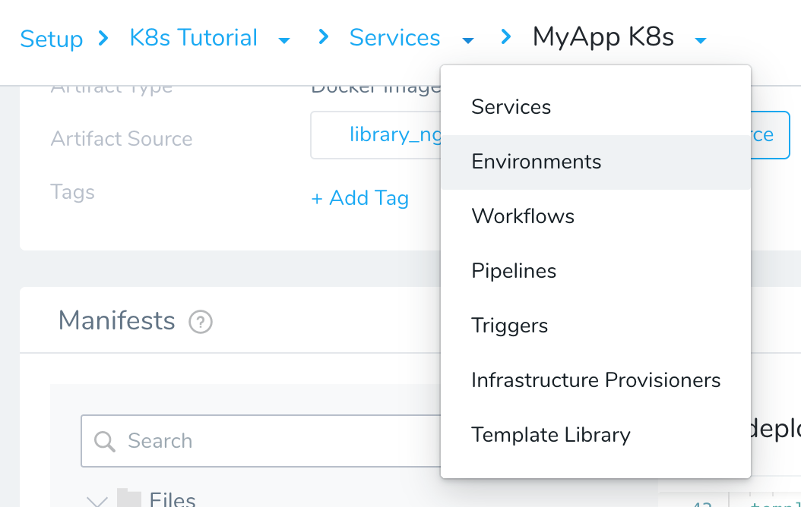
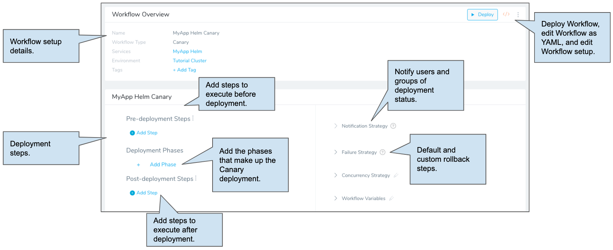
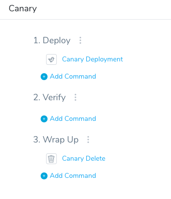
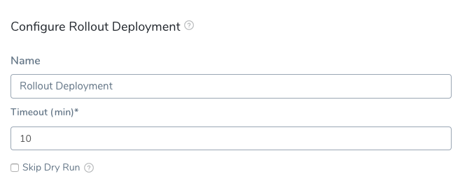
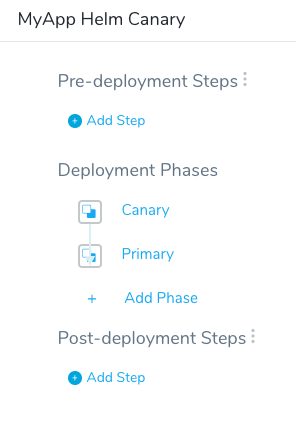

:::note
This content is for Harness [FirstGen](../../get-started/harness-first-gen-vs-harness-next-gen.md). Switch to [NextGen](../../continuous-delivery/deploy-srv-diff-platforms/helm/helm-cd-quickstart.md).
:::

This quickstart shows you how to deploy a publicly available Docker image to your Kubernetes cluster using Helm charts and a Canary Deployment strategy in Harness.

### Objectives

You'll learn how to:

* Install and launch a Harness Kubernetes Delegate in your target cluster.
* Connect Harness to your Kubernetes cluster and Helm Repository Artifact Server.
* Add your remote Helm chart to Harness.
* Create an Infrastructure Definition that targets your cluster and namespace.
* Create a Kubernetes Canary Workflow, using a Canary and Primary (rollout) phase.
* Deploy your Kubernetes Canary Workflow to your target cluster.

Once you have the prerequisites set up, the tutorial should only take about 10 minutes.

### Kubernetes or Helm?

Harness includes both Kubernetes and Helm deployments, and you can use Helm charts in both. Here's the difference:

* Harness [Kubernetes Deployments](/docs/continuous-delivery/deploy-srv-diff-platforms/kubernetes/kubernetes-deployments-overview.md) allow you to use your own Kubernetes manifests or a Helm chart (remote or local), and Harness executes the Kubernetes API calls to build everything without Helm and Tiller needing to be installed in the target cluster.  
Harness Kubernetes deployments also support all deployment strategies (Canary, Blue/Green, Rolling, etc).
* For Harness [Native Helm Deployments](../continuous-delivery/helm-deployment/helm-deployments-overview.md), you must always have Helm and Tiller (for Helm v2) running on one pod in your target cluster. Tiller makes the API calls to Kubernetes in these cases. You can perform a Basic or Rolling deployment strategy only (no Canary or Blue Green). For Harness Native Helm v3 deployments, you no longer need Tiller, but you are still limited to Basic or Rolling deployments.
	+ **Versioning:** Harness Kubernetes deployments version all objects, such as ConfigMaps and Secrets. Native Helm does not.
	+ **Rollback:** Harness Kubernetes deployments will roll back to the last successful version. Native Helm will not. If you did 2 bad Native Helm deployments, the 2nd one will just rollback to the 1st. Harness will roll back to the last successful version.

In this tutorial, we will perform a **Kubernetes with Helm** deployment using Helm charts and not the a native Helm deployment requiring Tiller. Harness recommends you use this method.

#### Native Helm 3 Blog

While this tutorial covers the preferred method of using Harness Kubernetes with Helm charts, the following blog post walks you through creating a native Helm 3 deployment from scratch using Harness, including a video walkthrough: [Welcome to the Harness Family, Helm](https://harness.io/2020/02/welcome-to-the-harness-family-helm-v3/?wvideo=1adpr2fxl1).

### Before You Begin

Review [Harness Key Concepts](../starthere-firstgen/harness-key-concepts.md) to establish a general understanding of Harness.


Set up Your Kubernetes Cluster

Ensure you have a Kubernetes cluster you can use for this tutorial. Your Kubernetes cluster will host the Harness Kubernetes Delegate in one pod and a simple Todolist Docker container in the other pods.

This tutorial is vendor-agnostic. You can use any Kubernetes vendor, such as Google Kubernetes Engine (GKE), Amazon Elastic Kubernetes Service (EKS), or Azure Kubernetes Service (AKS).

If you have a cluster that meets the following requirements, then you can jump to [Step 1: Install and Launch the Kubernetes Delegate](#step_1_install_and_launch_the_kubernetes_delegate):

* **Number of nodes:** 3.
* **Machine type:** 4vCPU
* **Memory:** 12GB RAM and 6GB Disk Space. 8GB RAM is for the Delegate. The remaining memory is for Kubernetes and the Docker container.
* **Networking:** Outbound HTTPS for the Harness connection, and to connect to Docker Hub. Allow TCP port 22 for SSH.

**Need a cluster?** Follow steps from these vendors and ensure your cluster meets the requirements above:

* [Quickstart: Deploy an Azure Kubernetes Service cluster using the Azure CLI](https://docs.microsoft.com/en-us/azure/aks/kubernetes-walkthrough) (node VM size minimum: Standard\_DS3\_v2)
* [Creating a cluster from Google Kubernetes Engine (GKE)](https://cloud.google.com/kubernetes-engine/docs/how-to/creating-a-cluster) (machine type minimum: n1-standard-4)
* [Creating an Amazon EKS Cluster](https://docs.aws.amazon.com/eks/latest/userguide/create-cluster.html) (node type minimum: m5.xlarge)


### Visual Summary

Once you've completed this tutorial, you'll deploy a Docker image to your Kubernetes cluster using a Harness Canary Workflow. Here's what your deployment will look like:


Interested? You're only a few minutes away from doing it yourself. Let's get started.

### Step 1: Install and Launch the Kubernetes Delegate

In this section, we'll download a new Harness Kubernetes Delegate and install and launch it in your target cluster. Running the Delegate as a pod in the same cluster used to deploy the your application is the recommended practice.

For this tutorial, we are using a Kubernetes Delegate, but Harness also includes a Helm Delegate that can be installed in your cluster using Helm or Rancher. See [Using the Helm Delegate](../firstgen-platform/account/manage-delegates/using-the-helm-delegate.md).

Before installing the Delegate, ensure that you have **kubectl** installed in your Kubernetes cluster. For **kubectl** installation steps, see  [Install and Set Up kubectl](https://kubernetes.io/docs/tasks/tools/install-kubectl/) from Kubernetes.
1. Download the Delegate:
	1. Log into Harness.
	2. In the Harness Manager, click **Setup**. **Setup** is where you configure your microservices, their deployment pipelines, and all the building blocks and resources for those pipelines.
	3. Click **Harness Delegates**.
	4. Click **Download Delegate** and then click **Kubernetes YAML**. The Delegate Setup settings appear.
	5. In **Name**, enter the name **k8s-delegate** exactly.
	6. In **Profile**, select the Primary Profile.
	7. Click **Download**. The YAML file for the Kubernetes Delegate, and its README, will download to your computer as an archive.
	8. Open a terminal and navigate to where the Delegate file is located.
	9. Extract the YAML file's folder from the download and then navigate to the Harness Delegate folder that you extracted:

		```
		tar -zxvf harness-delegate-kubernetes.tar.gz  
		  
		cd harness-delegate-kubernetes
		```
		You will connect to your cluster using the terminal so you can simply copy the YAML file over.

2. Install and Launch the Delegate.
	1. Log into your Kubernetes cluster. For example, if your Kubernetes cluster is in Google Cloud Platform, select the cluster, click **Connect**, and from the resulting **Connect to the cluster** setting, copy the **Command-line access command**.
	2. In the terminal you used to navigate to the **harness-delegate** folder, paste the command and press **Enter**.  
	You are now connected to the Kubernetes cluster. If the connection is unsuccessful, ensure that the GCE firewall is not blocking port 22 to your VMs. For more information, see [Debug Running Pods](https://kubernetes.io/docs/tasks/debug/debug-application/debug-running-pod/) from Kubernetes.
	3. Let's quickly confirm that the cluster you created can connect to the Harness platform. Enter the following command:    
	
		```
		wget -p https://app.harness.io/ -O /dev/null
		```
		A successful connection will display the following:  
		  
		```
		HTTP request sent, awaiting response... 200 OK
		```
	
	4. Next, install the Harness Delegate using the **harness-delegate.yaml** file you just downloaded. In the terminal connected to your cluster, run this command:   
		
		```
		kubectl apply -f harness-delegate.yaml
		```
		If you are not using your terminal to connect to your cluster, just copy the **harness-delegate.yaml** file to the cluster and run the command.
	
	5. Run this command to verify that the Delegate pod was created:    
	
		```
		kubectl get pods -n harness-delegate
		```
		It will take a moment for the Delegate to appear in Harness' **Installations** page.

Now you're ready to connect Harness to your artifact server and cluster. After those quick steps, you'll begin creating your deployment.

:::note 
When you onboard your own applications, you might need to install multiple Delegates, depending on their workloads, network segmentation, and firewall zones. Typically, you will need one Delegate for every 300-500 service instances across your applications, and will need one Delegate in each subnet or zone.
:::


### Step 2: Add a Kubernetes Cluster Cloud Provider

A Harness Cloud Provider represents your infrastructure, such as a Kubernetes cluster, AWS account, Google service account, Azure subscription, data center, etc.

The Kubernetes Cluster Cloud Provider you will add now will connect Harness with your Kubernetes cluster using the Delegate you installed.

1. In **Harness Manager**, click **Setup**.
2. Click **Cloud Providers**. On the **Cloud Providers** page, click **Add Cloud Provider**. The Cloud Provider appears.
3. Enter the following settings:

   * **Type:** Select Kubernetes Cluster.
   * **Display Name:** Enter **Helm Tutorial**. You will use this name later to select this Cloud Provider when you create a Harness Infrastructure Definition.
   * **Inherit from selected Delegate:** Enable this option. Since the Delegate is already installed in the target cluster, you can use the Delegate's credentials for this Cloud Provider. This is the recommended configuration.
   * **Delegate Name:** Select the name of the Delegate you installed in your cluster: **k8s-delegate**.
   * **Select Skip Validation:** Enable this option.
   * **Usage Scope:** Don't change this setting. Usage Scope limits the use of a Cloud Provider to specific Harness Applications and Environments. For this tutorial, we will use the default scopes.

4. Click **Test**. Verify that the `The test was successful message` appears, and then click **Submit**.

Your Kubernetes Cloud Provider is set up. Now let's add an Artifact Server for the Helm chart.

### Step 3: Add a Helm Repo Artifact Server

You can add a Helm chart repository as a Harness Artifact Server and then use it in Harness Kubernetes and Helm Services.

A Helm chart repository is an HTTP server that houses an **index.yaml** file and, if needed, packaged charts. For details, see  [The Chart Repository Guide](https://helm.sh/docs/topics/chart_repository/) from Helm.

For this tutorial, we will use a public Helm Repo from Bitnami.

1. In **Setup**, click **Connectors**.
2. Click **Artifact Servers**, and then click **Add Artifact Server**. The **Artifact Server** settings appear.
3. Enter the following settings:

   * **Type:** Select **Helm Repository**.
   * **Display Name:** Enter **Helm Repo**. You will use this name to select this repo later when you add a Helm chart to a Harness Service.
   * **Hosting Platform:** Select **HTTP Server**.
   * **Repository URL:** Enter `https://charts.bitnami.com/bitnami`.
   * **Username and Password:** Leave these empty.

3. Click Test, and then click the **SUBMIT** button.

:::note 
If the test fails, it is possible that the Harness Delegate you installed cannot connect to https://registry.hub.docker.com/v2/. Ensure that the pod where the Delegate is installed can connect to that address.
:::

Now Harness is connected to the Helm repo. We don't need any other connectors for this tutorial. Next, we'll add the Helm chart.

### Step 4: Add Your Helm Chart

Now that all your connections are set up, you can start adding the manifests for your Kubernetes workloads.

First, we'll create a Harness Application and Service, and look at manifests.

1. In **Setup**, click **Add Application**. The Application settings appear.
2. Enter the name **Helm Tutorial** and click **Submit**.

   
	 
	 The Application is created.

   
	 
    We won't cover all of the Application entities in this tutorial. We assume you've read [Harness Key Concepts](../starthere-firstgen/harness-key-concepts.md).

    To add your Helm chart, you create a Harness Service. Services represent your microservices/apps. You define the sources of app artifacts for those microservices, and you add your Helm charts.

3. Click **Services**.
4. In **Services**, click **Add Service**. The Add Service settings appear.
5. Enter the following settings:

   * **Name:** Enter **MyApp Helm**.
   * **Deployment Type:** Select **Kubernetes**.

   Click **Submit**. The new Service page appears.

   
	 
	 Now you can add your Helm chart.

:::note 
**No Artifact Source?** Since your Helm chart uses a publicly available Docker image, you do not need to add a Harness Artifact Source. Harness Artifact Sources are used for private repos and when you want to replace the hardcoded image location in your values.yaml or manifests with a Harness expression that can replaced at runtime.
:::

When you create a Service for your Harness application, you can link to your manifests in a source repo or a Helm chart in a source or Helm repo.

   * **Manifest Format:** Select **Helm Chart from Helm Repository**.
   * **Helm Repository:** Select the Helm Repo Artifact Server you set up earlier, **Helm Repo**.
   * **Chart Name:** Enter **nginx**.
   * **Chart Version:** Leave this empty. If Harness will get the latest chart.

Our artifact is added and the Helm chart is ready. Next, we can define our target cluster and namespace for deployment.

### Step 5: Define Your Target Kubernetes Cluster

Harness uses Environments to represent one or more of your deployment infrastructures, such as Dev, QA, Stage, Production, etc.

In each Environment, you define Infrastructure Definitions to describe your deployment infrastructures. A single Infrastructure Definition can be used by multiple Services, pulling unique Kubernetes namespace values from each Service during deployment.

1. Use the breadcrumb navigation to jump to **Environments**.
2. In **Environments**, click **Add Environment**. The **Environment** settings appear.
3. Enter the following settings:

   * **Name:** Enter **Tutorial Cluster**.
   * **Environment Type:** Select **Non-Production**.

4. Click **Submit**. The Environment is created. Next we will add an Infrastructure Definition to identify the cluster and namespace for our deployment.
5. Click **Add Infrastructure Definition**. The Infrastructure Definition settings appear.
6. Enter the following settings:

   * **Name:** Enter **Tutorial Namespace**.
   * **Cloud Provider Type:** Select **Kubernetes Cluster**.
   * **Deployment Type:** Select **Kubernetes**.
   * **Cloud Provider:** Select the Cloud Provider you added earlier in this tutorial, **Helm Tutorial**.
   * **Namespace:** Enter the namespace you want to use in your cluster. The `default` namespace is entered by default.
   * **Release Name:** Leave the default `release-${infra.kubernetes.infraId}`. Harness uses this name for tracking releases for rollback, etc.

7. Click **Submit**. Your target infrastructure is defined. You can now use it and the Harness Service you set up to build your Canary Workflow.

### Step 6: Build a Canary Deployment

Now that you have a Helm chart and target cluster and namespace, you can create a Harness Workflow to deploy the image to the cluster.

In this tutorial, we will use the popular Canary Deployment strategy. In Canary, all pods in a single cluster are updated incrementally in small phases, with each phase verified as successful before proceeding to the next phase.

:::note 
To learn more about Canary deployments, see [Deployment Concepts and Strategies](../continuous-delivery/concepts-cd/deployment-types/deployment-concepts-and-strategies.md).
:::

1. Use the breadcrumb navigation to jump to **Workflows**, and then click **Add Workflow**. The Workflow settings appears.
2. Enter the following settings:

   * **Name:** Enter **MyApp Helm Canary**.
   * **Workflow Type:** Select **Canary Deployment**.
   * **Environment:** Select the Environment you created earlier, **Tutorial Cluster**.

3. Click **Submit**. The Workflow is created.

   Next, well add the first phase of our Canary Workflow.

4. In **Deployment Phases**, click **Add Phase**. The Add Phase settings appear.
5. Enter the following settings:

   * **Service:** Select the Harness Service you created for this tutorial, **MyApp Helm**.
   * **Infrastructure Definition:** Select the Infrastructure Definition you created for this tutorial, **Tutorial Namespace**.
   * **Service Variable Overrides:** You can leave this setting blank. The purpose of Service Variable Overrides is to let you change any Config Variables created in the Service when the Workflow executes.

6. Click **Submit**. The Phase is added to the Workflow.

   
	 
	 Harness adds the necessary steps automatically, but you can edit or add more as needed.

   Let's take a look at the **Canary Deployment** step. The Canary Deployment step defines how many pods are deployed for a Canary test of the configuration files in your Harness Service manifests.

7. Click the **Canary Deployment** step.
8. Review the following settings:

  * **Instance Unit Type**: You can specify the number of replicas to deploy using **COUNT** or **PERCENTAGE**.
	   + **COUNT:** This is simply the number of replicas.
	   + **PERCENTAGE:** This is a percentage of the replicas defined in your Service manifests files. For example, in you have `replicas: 4` in a manifest in Service, and you enter **50** in **Instances**, then 2 pods are deployed in this Phase step.
   * **Instances:** This is the number of replicas to deploy.
   * **Skip Dry Run:** Do not select this option. By default, Harness uses the `--dry-run` flag on the `kubectl apply` command during the initial commands of this step. If the **Skip Dry Run** option is selected, Harness will not use the `--dry-run` flag.

   For this tutorial, we'll use the default settings.

9. Close **Canary Deployment**.

   The Canary Delete step in the Wrap Up section deletes the workloads deployed successfully in this phase. Once the Canary Deployment step is successful, you don't need those workloads. You can move onto to deploying the workloads in a second phase, confident that they will deploy.

   Next, we'll add the Primary phase using a Kubernetes rolling update.

10. In the breadcrumb navigation, click the name of the Workflow, **MyApp Helm Canary**. This takes you back to the main Workflow page.
11. In **Deployment Phases**, click **Add Phase**.
12. Enter the following settings:

   * **Service:** Select the Harness Service you created for this tutorial, **MyApp Helm**.
   * **Infrastructure Definition:** Select the Infrastructure Definition you created for this tutorial, **Tutorial Namespace**.

13. Click **Submit**. The new phase is added.

   
	 
   Let's take a look at the **Rollout Deployment** step.

   This step performs a standard Kubernetes rolling update, incrementally updating pod instances with new ones. The new pods are scheduled on nodes with available resources. The rolling update Deployment uses the number of pods you specified in the Harness Service Manifests (number of replicas).

14. Click **Rollout Deployment**. The Rollout Deployment settings appear.

    There's nothing to configure in this step. Click **Submit** to exit.

    That's it. The Canary Workflow is complete. Next, we'll deploy the Workflow to your cluster.

15. In the breadcrumb navigation, click the name of the Workflow, **MyApp Helm Canary**. This takes you back to the main Workflow page where both phases are visible.

   
	 
### Step 7: Deploy and Review

Now that your Kubernetes Canary Workflow is complete you can deploy it to your cluster.

1. If you're not already on the main Workflow page, use the breadcrumb navigation to navigate to **MyApp Helm Canary**.
2. Click the **Deploy** button. The Deploy settings appear.
3. Click **Submit**. The deployment executes.

In this tutorial, you learned how to:

* Install and launch a Harness Kubernetes Delegate in your target cluster.
* Connect Harness to your Kubernetes cluster and Helm Repository Artifact Server.
* Add your remote Helm chart to Harness.
* Create an Infrastructure Definition that targets your cluster and namespace.
* Create a Kubernetes Canary Workflow, using a Canary and Primary (rollout) phase.
* Deploy your Kubernetes Canary Workflow to your target cluster.

### Next Steps

Read the following related How-tos:

* [Kubernetes Deployments Overview](/docs/continuous-delivery/deploy-srv-diff-platforms/kubernetes/kubernetes-deployments-overview.md) will show you how to do more advanced deployments using traffic management and advanced Kubernetes Workflow steps.
* [Triggers](../continuous-delivery/model-cd-pipeline/triggers/add-a-trigger-2.md) show you how to automate deployments in response to different events.
* [Infrastructure Provisioners Overview](../continuous-delivery/model-cd-pipeline/infrastructure-provisioner/add-an-infra-provisioner.md) will show you how to add provisioning as part of your Workflow.

