This quickstart shows you how to deploy an IIS website to an AWS EC2 Windows instance using Harness. We will pull a publicly-available IIS Website zip file from Artifactory and deploy it to an EC2 Windows instance in your AWS account.

Harness connects to your target Windows instances using the Windows Remote Management (WinRM) protocol and executes PowerShell commands to deploy your IIS websites. We'll show you how to set up and use both for your IIS deployments.

:::note 
We'll only be deploying an IIS Website, but you can follow the same steps for Harness IIS Application and IIS Virtual Directory deployments. IIS requires that an IIS Website already exists on the target host(s) before deploying an IIS Application and IIS Virtual Directory. For information about IIS sites, applications, and virtual directories, see [Understanding Sites, Applications, and Virtual Directories on IIS 7](https://docs.microsoft.com/en-us/iis/get-started/planning-your-iis-architecture/understanding-sites-applications-and-virtual-directories-on-iis).
:::

### Objectives

You'll learn how to:

* Install and run the Harness Shell Script Delegate on an EC2 host.
* Connect Harness with your AWS account.
* Connect Harness with Artifactory.
* Connect Harness with your target host(s) over WinRM.
* Specify the IIS Website files and Windows settings to use.
* Specify the target Windows host(s) in AWS EC2.
* Create and deploy an IIS Website Basic Workflow.
* Verify deployment in Windows Server.

### Before You Begin

* Review [Harness Key Concepts](../starthere-firstgen/harness-key-concepts.md) to establish a general understanding of Harness.
* **AWS security group for EC2 instances** — Ensure the AWS security group used for the Harness Delegate ECS host and target EC2 Windows instances has the following port settings:
	+ **Outbound rules for Harness —** SSH port 22, HTTP 80, HTTPS port 443.
	+ **Inbound/outbound rules for Harness WinRM connection** — WINRM-HTTP port 5985, WINRM-HTTPS port 5986.
* **EC2 Windows Instance for target host** — In this quickstart we use:
	+ **AMI:** Free tier Microsoft Windows Server 2019 Base (ami-0ed87187d8ca91f34).
	+ **Instance type:** t2.large.
	+ **Tags:** Give the target host the Tag **Name:WinRM**. This will help us select it later.
* **IIS Web Server Role on target host** — Before deploying the IIS website (or IIS application or virtual directory) to your Windows instance, there must be an existing IIS Web Server Role on the instance. For steps on installation, see [Installing the Web Server Role](https://docs.microsoft.com/en-us/iis/web-hosting/web-server-for-shared-hosting/installing-the-web-server-role) from Microsoft.
* **WinRM configured on target host** — When you set up your EC2 Windows instance, add the following PowerShell script in **Step 3: Configure Instance Details** > **User data**:

  WinRM PowerShell Script:

	```
	<powershell>  

	Invoke-Expression ((New-Object System.Net.Webclient).DownloadString('https://raw.githubusercontent.com/ansible/ansible/devel/examples/scripts/ConfigureRemotingForAnsible.ps1'))   

	</powershell>
	```

  Here is an example of the script added in User data:

  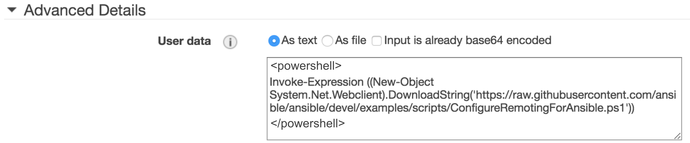
	
	
	To verify that WinRM is running on your Windows instance, log into your Windows instance and run this command:

	```
	winrm e winrm/config/listener
	```

* **EC2 Linux Instance for Harness Shell Script Delegate** - The EC2 Linux instance for the Harness Delegate must meet the following requirements:
	+ Linux/UNIX server.
	+ ​Minimum 1 CPU.
	+ Minimum 8GB RAM. For example, an AWS EC2 instance type such as m5a.xlarge has 16GB of RAM, 8 for the Delegate and 8 for the remaining operations.
	+ Minimum 6GB Disk space.
	+ Outbound Access: HTTP, HTTPS, SSH. This enables the Delegate to communicate with Harness and Artifactory.
	+ IAM role: AmazonEC2FullAccess. This role is not needed for the target EC2 Windows host(s).

Setting up the AWS roles, networking, and instances takes the most time. Once you're done, creating your Harness deployment is quick and easy.

### Visual Summary

The following diagram shows the very simple topology for this tutorial:

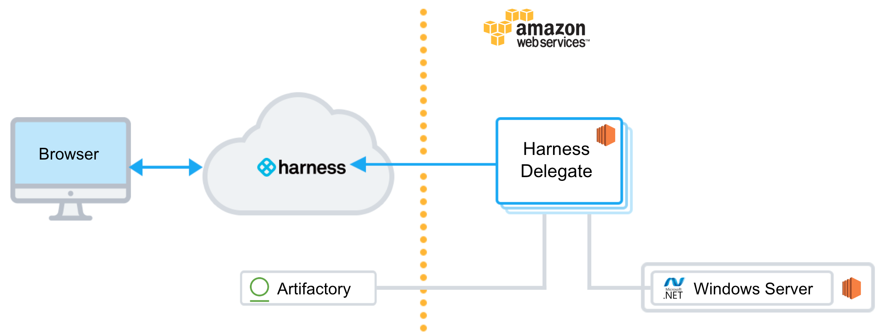

You will install the Harness Shell Script Delegate on an EC2 instance in your AWS account and connect Harness to AWS and Artifactory. Next, you'll set up your IIS website artifact, deployment specs, and target host in Harness. Lastly, you'll create a Basic Workflow and deploy the IIS website to the target host.

### Step 1: Install and Launch the Shell Script Delegate

First we'll install the Harness Shell Script Delegate on the EC2 instance you set up. Ensure that the EC2 instance meets requirements in [Before You Begin](#before_you_begin).

To install the Delegate on your EC2 instance:

1. Sign into the Harness Manager.
2. Click **Setup**, and then click **Harness Delegates**.
3. Click **Download Delegate**, and then click **Shell Script**.
4. Enter a name for the Delegate, and select the **Primary** Profile.
5. Click **Copy Download Link**.  
 
6. Log into your EC2 instance, paste the Shell Script Delegate command, and hit **Enter**.
7. Once the Delegate is downloaded, unzip it (`tar -zxvf harness-delegate.tar.gz`), change directories into the **harness-delegate** folder and run the start command: `./start.sh`. Ignore any warning about the ulimit.

The Delegate will start and in a few moments you will see it listed in the **Harness Delegates** page.

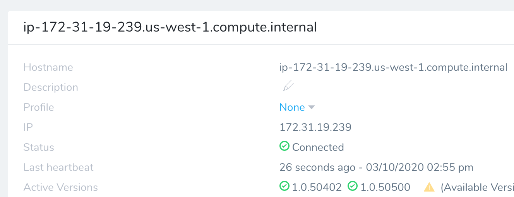


#### Delegate Selector

As a best practice, add a Delegate Selector to the Delegate so you can quickly identify it.

1. In the Delegate listing on the **Harness Delegates** page, click **Edit** next to **Selectors**.
2. Type in **iis-tutorial**, press **Enter**, and then click **Submit**.  
   The Selector is added to the Delegate.

Next we need to add a Harness AWS Cloud Provider to connect Harness to your AWS account. We will use the Delegate you installed to obtain credentials for the AWS Cloud Provider.

### Step 2: Add a AWS Cloud Provider

Next we'll add a Harness AWS Cloud Provider to your Harness account to connect to AWS.

:::note 
As Harness provides first-class support for [CloudWatch](../continuous-delivery/continuous-verification/continuous-verification-overview/concepts-cv/cloud-watch-verification-overview.md), you can also use the same AWS Cloud Provider for your CloudWatch connection.
:::

**Permissions:** The AWS Cloud Provider will assume the IAM Role associated with the Delegate you installed in your VPC.

1. In the Harness Manager, click **Setup**, and then click **Cloud Providers**.
2. Click **Add Cloud Provider**. The **Cloud Provider** dialog appears. Enter the following settings:

   * **Type:** Select **Amazon Web Services**.
   * **Display Name:** Enter **IIS-Tutorial**.
   * **Credentials:** Select **Assume IAM Role on Delegate**.
   * **Delegate Selector:** Select the Delegate Selector you added to your Delegate, **iis-tutorial**.

3. Click **Test** and then **Submit**.

### Step 3: Add the Artifactory Artifact Server

For this tutorial, we'll use a Todo List IIS website artifact, todolist-v3.0.zip, available in a public Harness Artifactory repo.

1. In Harness, click **Setup,** and then click **Connectors**.
2. Click **Artifact Servers**, and then click **Add Artifact Server**. Enter the following settings:

   * **Type:** Select **Artifactory**.
   * **Display Name:** Enter **Artifactory Public**.
   * **Artifactory URL**: Enter **https://harness.jfrog.io/harness**.
   * **Username/password:** Leave these settings empty.

3. Click **Test** and the **Submit**. If the test fails, that means the Delegate can't connect to https://harness.jfrog.io/harness. Make sure that the EC2 instance hosting the Delegate can make outbound connections to https://harness.jfrog.io/harness.

### Step 4: Add the WinRM Connection

WinRM is the management protocol used by Windows to remotely communicate with another server, in our case, Harness. WinRM communicates over HTTP (5985)/HTTPS (5986), and is included in all recent Windows operating systems.

:::note 
See [Before You Begin](iis-net-quickstart.md#before-you-begin) for the WinRM requirements and setup for this quickstart.
:::

To connect the Harness Delegate with your target hosts and perform deployment operations, you add a WinRM connection in Harness:

1. Select **Continuous Security**, and then click **Secrets Management**. The Secrets Management settings appear.
2. Under **Executions Credentials**, click **WinRM Connection**. Click **Add WinRM Connection**. The WinRM Connection settings appear.
3. Enter the following settings:

   * **Display Name:** Enter **IIS Tutorial**.
   * **Auth Scheme:** Select **NTLM**.
   * **Domain:** Leave this empty. If you receive an error when you submit, simply add and remove an empty space and click **Submit** again.
   * **User Name:** Enter **Administrator**.
   * **Password:** Enter the Administrator password for the Windows target host. For EC2, select the EC2 instance in the EC2 console and click Connect. Follow the instructions to get the password.
   * **Use SSL** and **Skip Cert Check:** Select these options.
   * **WinRM Port:** Enter **5986**. Ensure that the security group rules for your target host have HTTP-WINRM (5985) and HTTPS-WINRM (5986) open, as described in [Before You Begin](iis-net-quickstart.md#before-you-begin).

4. Click **Test**. The **WinRM Connectivity Test** appears.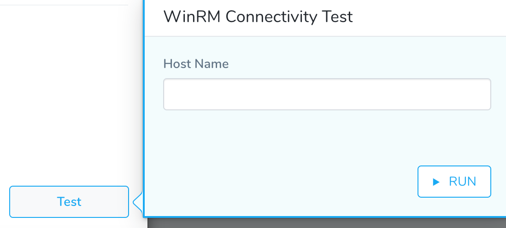
5. Enter the Public DNS (IPv4) of the target EC2 host and click **RUN**. The test will display: **The test was successful.** If the test fails, check that you have the WinRM setup and settings correct.
3. Click **Submit**.

All of your Harness connections are complete. Now we can add the IIS website and define the deployment.

### Step 5: Define the IIS Website

A Harness Application represents your IIS website, its deployment pipelines, and all the building blocks for those pipelines.

First, we'll create a Harness Application and Service, and look at the default IIS website setup.

1. In Harness, click **Setup**, and then click **Add Application**. The Application settings appear.
2. Enter the name **IIS Tutorial**, and click **Submit**. Your new Application appears.

   We won't cover all of the Application entities in this tutorial. We assume you've read [Harness Key Concepts](../starthere-firstgen/harness-key-concepts.md).

   To add your IIS website zip and settings, you create a Harness Service. Services represent your IIS websites, applications, and virtual directories. You define the source of the IIS website artifact and your IIS specs, such as application pool identity.

3. In your Harness Application, click **Services**. On the **Services** page, click **Add Service**. The **Service** dialog appears. Enter the following settings:

   * **Name:** Enter **IIS-Website**.
   * **Deployment Type:** Select **Windows Remote Management (WinRM)**.
   * **Artifact Type:** Select **IIS Website**.

4 Click **Submit**. The new Service is added.

   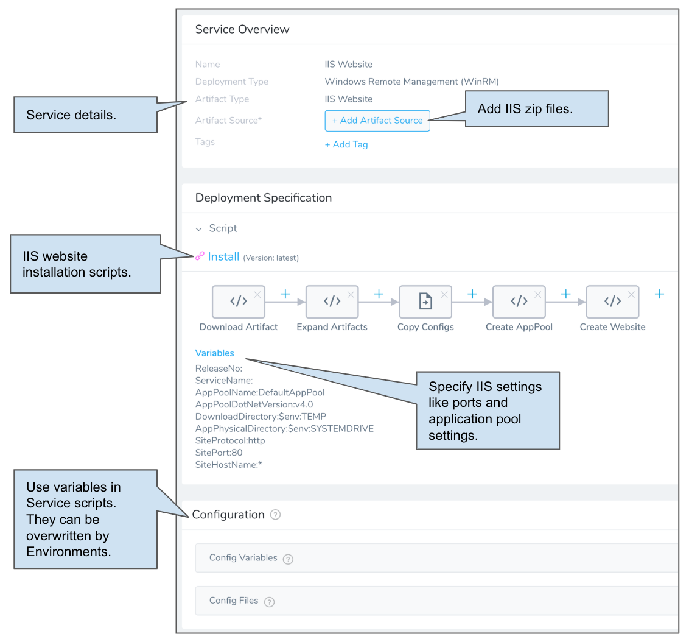
	 
   Next, we'll add the IIS website zip file artifact to the Service.

5 In your Service, click **Add Artifact Source**, and select the **Artifactory** artifact source. Enter the following settings:

   * **Display Name:** Enter **Todo List**.
   * **Source Server:** Select the Artifact Server you created earlier, **Artifactory Public**.
   * **Repository:** Select **iis-website**.
   * **Artifact Path/File Filter:** Enter **todolist-v3.0.zip**.
   * **Metadata Only:** Select this option.

6. Click **Submit**. The artifact is added to the Service. 

Look at the **Script** in **Deployment Specification**. You can see the steps that Harness will perform on the target host during deployment.

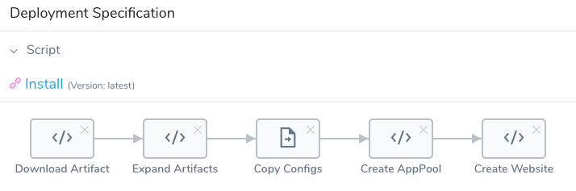

When Harness deploys your website, it downloads your IIS website artifact to your target host, expands it, creates the application pool, and then the website.

Next we'll change the default SitePort variable to ensure that your deployment doesn't have any port conflicts with other services running on your target host.

Click **Variables**. Locate the **SitePort** variable and change its value to `8080`, like this:

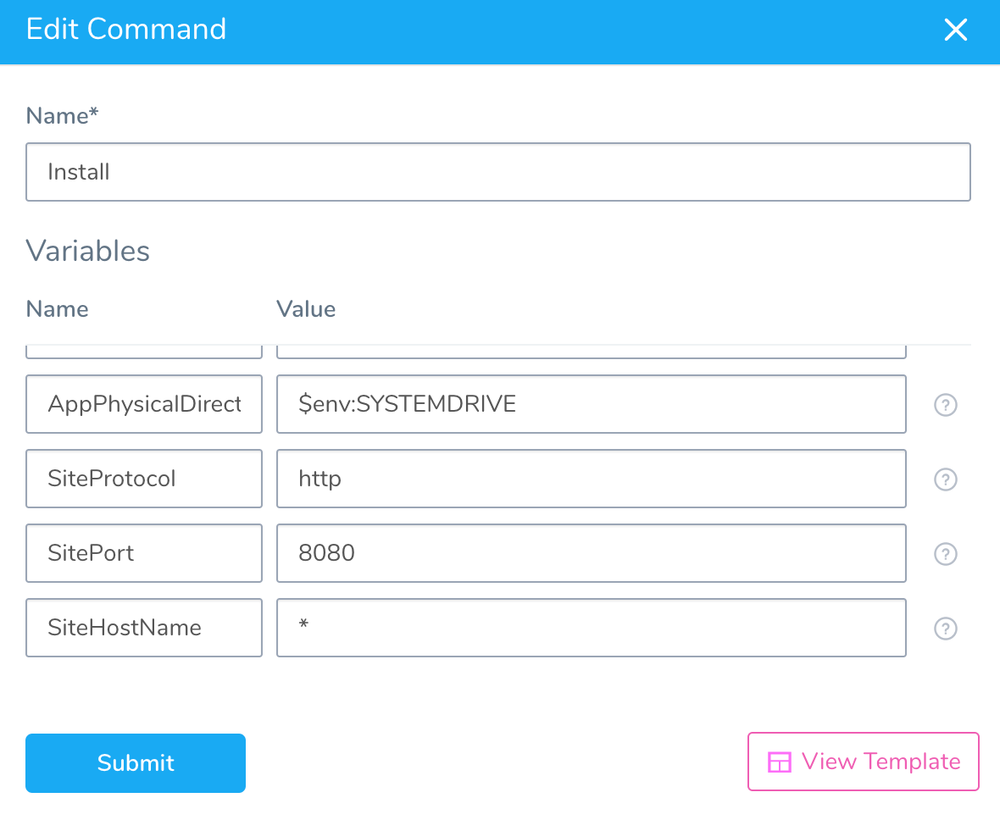

Click **Submit**. The variable is now changed and will be used when you deploy.

Now that we have our IIS website and specs, we can pick our target host.

### Step 6: Specify the Target Windows Host

Harness uses Environments to represent one or more of your deployment infrastructures, such as Dev, QA, Stage, Production, etc.

In each Environment, you define Infrastructure Definitions to describe your target IIS hosts. A single Infrastructure Definition can be used by multiple Harness Services.

1. Use the breadcrumb navigation to jump to **Environments**.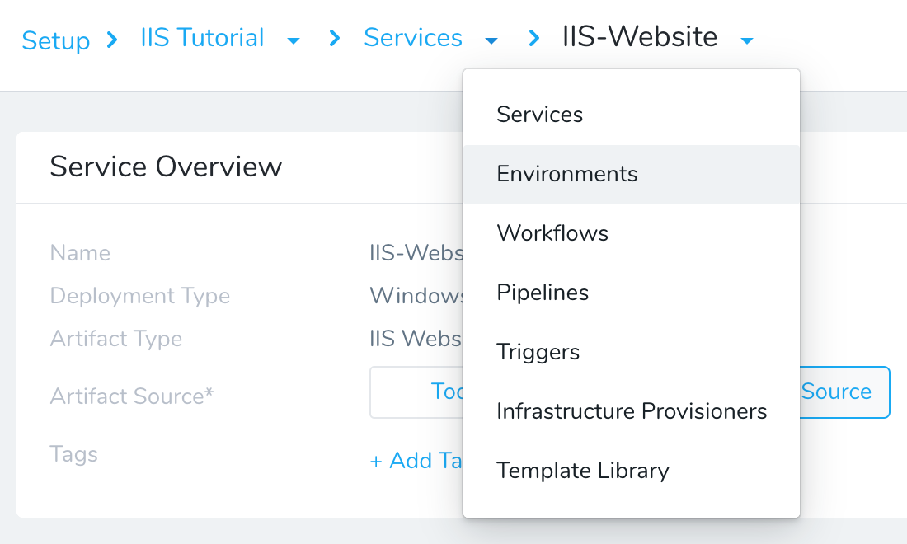
2. Click **Add Environment**. The **Environment** settings appear. Enter the following settings:

   * **Name:** Enter **IIS Tutorial**.
   * **Environment Type:** Select **Non-Production**.

3. Click **Submit**. The new Environment appears. Next we will add an Infrastructure Definition to identify the ECS Windows target host.
4. On your **Environment** page, click **Add Infrastructure Definition**. Enter the following settings:

   * **Name:** Enter **Target Windows Instance**.
   * **Cloud Provider Type:** Select **Amazon Web Services**.
   * **Cloud Provider Type:** Select **Windows Remote Management (WinRM)**.
   * **Use Already Provisioned Infrastructure:** Select this option.
   * **Cloud Provider:** Select the AWS Cloud Provider we added earlier, **IIS-Tutorial**.
   * **Region:** Select the AWS region where your target host is running.
   * **Load Balancer:** Leave this empty.
   * **Connection Attribute:** Select the WinRM Connection you created earlier, **IIS Tutorial**.
   * **Host Name Convention:** Leave the default.
   * **Use AWS Instance Filter:** Select this option.
   * **VPC:** Select the VPC where the target host is running.
   * **Tags:** Enter an EC2 instance Tag to identify the target host. See below.
   * **Host Connection Type:** Leave **Private DNS**.

	For the **Tags** setting, enter an EC2 instance Tag that will identify the target host:

	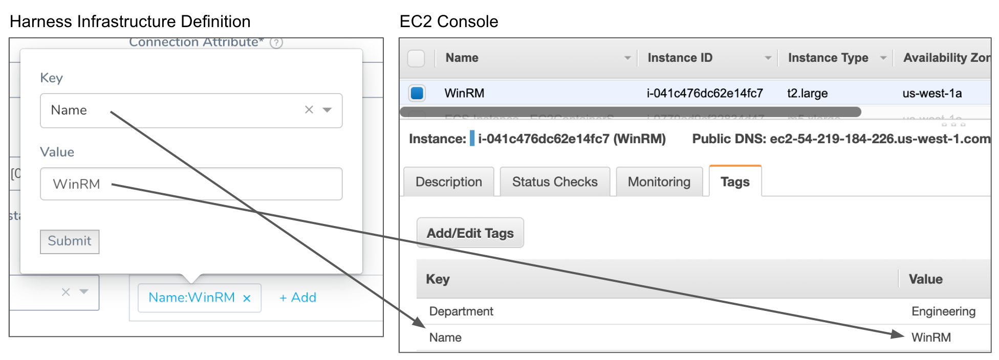

:::note 
For this quickstart, we are deploying to a single target host. You can deploy to multiple target hosts by using Tags to identify them. When you use multiple targets, you can use deployment strategies such as Canary to deploy to a count/percentage of the hosts in phases.
:::

5. Click **Submit**. The new Infrastructure Definition is added to your Environment.

You will select this Environment and Infrastructure Definition when you create your Harness Workflow next.

### Step 7: Set up a IIS Website Basic Workflow

A Basic Workflow simply takes your Harness Service and deploys it to your Infrastructure Definition. It runs the commands in the Service Script section to expand the IIS website artifact, copy configs, create the application pool, and then create the website.

1. Use the breadcrumb navigation to jump to **Workflows**, and then click **Add Workflow**. The Workflow settings appear.
2. Enter the following settings:

   * **Name:** Enter **IIS-Website**.
   * **Workflow Type:** Select **Basic Deployment**.
   * **Environment:** Select the Environment we created earlier, **IIS Tutorial**.
   * **Service:** Select the Service we created earlier, **IIS-Website**.
   * **Infrastructure Definition:** Select the Infrastructure Definition we created earlier, **Target Windows Instance**.

3. Click **Submit**. The IIS Basic Workflow is created.

   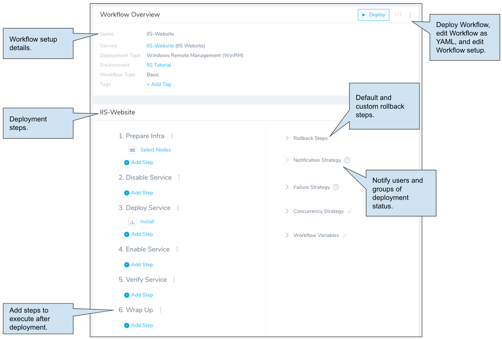
	 
Let's walk through the default steps in the Workflow, **Select Nodes** and **Install**.

Click the **Select Nodes** step. The **Select Nodes** settings appear.

  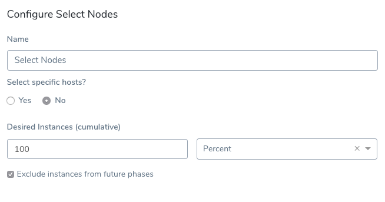Select Nodes let's you specify the number of target instances. You can use a count or percentage. Remember that Harness locates instances based on the **Tags** settings in your Infrastructure Definition.

In **Select specific hosts** click **Yes**. In **Host Name(s)**, click the name of the target host Harness located using the **Tags** settings in your Infrastructure Definition.

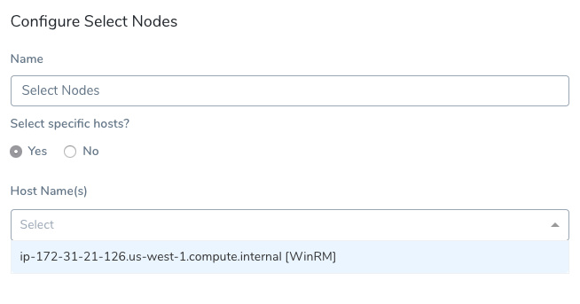

Click **Submit**.

:::note 
Harness supports Basic, Canary, and Rolling deployments for IIS (.NET). In all Workflows you can adjust Select Nodes to fit your needs. For example, in a Canary deployment Workflow, you could set the **Desired Instances** to 50% in the first phase and 100% in the second phase.
:::

Click the **Install** step. There's nothing to configure here. You can simple close the step.

The Workflow is complete. You can run the Workflow to deploy the IIS website to your EC2 Windows host.

### Step 8: Deploy and Review

Now that your IIS website Basic Workflow is complete you can deploy it.

1. If you're not already on the main Workflow page, use the breadcrumb navigation to navigate to the **IIS Tutorial** Workflow.
2. Click the **Deploy** button. The Deploy settings appear. Enter the following settings:

   * **Artifacts** > **IIS-Website**: Select an artifact from the Artifact Source you added to the Harness Service. In this tutorial, we are using a public Artifactory file. Select **Buid# todolist-v3.0.zip**.
   * **Send notification to me only:** Enable this setting if you are doing this tutorial using your corporate Harness account. Enabling this setting will ensure that other users won't be notified of this deployment.

3. Click **Submit**. The deployment executes.

		Here's a example of what the deployment looks like typically:

		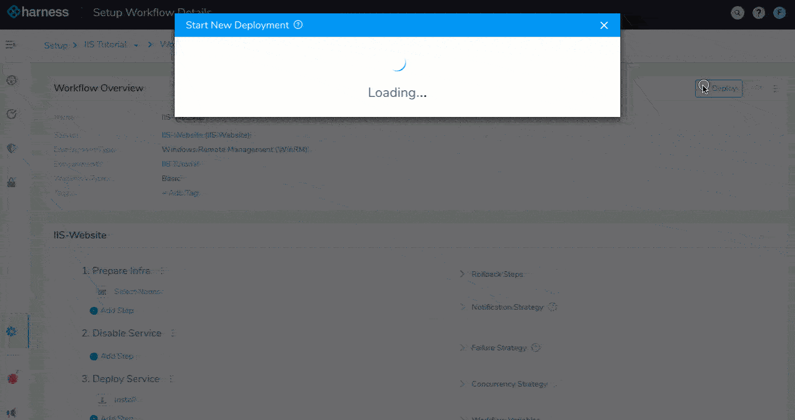

		Now that the deployment was successful, confirm the website was added to the Windows instance:

4. In your Harness **Deployments** page, click the **Install** step.[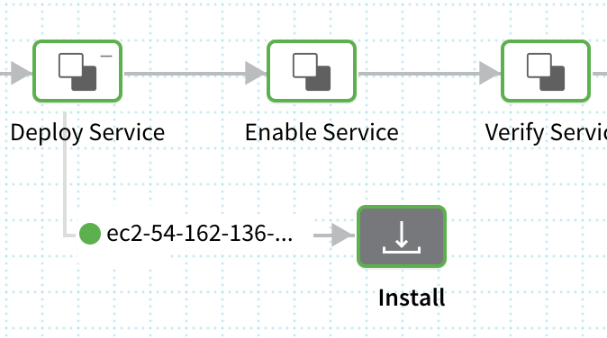](./static/iis-net-quickstart-14.png)
5. Expand the **Create Website** section.[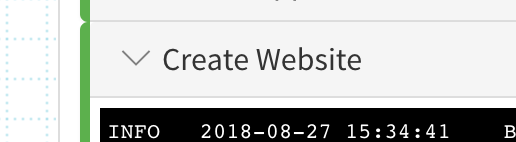](./static/iis-net-quickstart-16.png)
6. In the log, note the location where the website was created:

	```
	INFO 2018-08-27 15:34:43 IIS-website 2 Started C:\Artifacts\IIS-website\relea http :8080:*
	```

7. Connect to your Windows instance via Microsoft Remote Desktop or other console.
8. On the Windows instance, navigate to the location Harness reported to confirm the website was created:[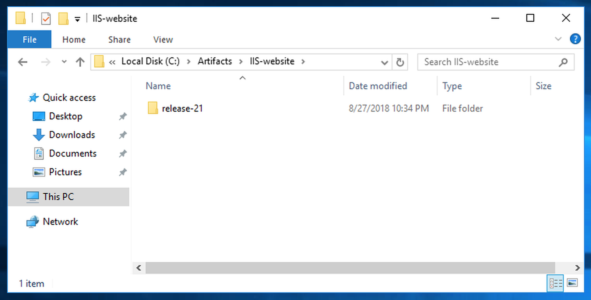](./static/iis-net-quickstart-18.png)

You can see the website is installed.

### Next Steps

In this quickstart, you learned how to:

* Install and run the Harness Shell Script Delegate on an EC2 host.
* Connect Harness with your AWS account.
* Connect Harness with your target host(s) over WinRM.
* Connect Harness with Artifactory.
* Specify the IIS Website files and Windows settings to use.
* Specify the target Windows host(s) in AWS EC2.
* Create and deploy an IIS Website Basic Workflow.
* Verify deployment in Windows Server.

Read the following related How-tos:

* [IIS (.NET) Deployments Overview](../continuous-delivery/concepts-cd/deployment-types/iis-net-deployments-overview.md)
* [IIS Workflows and Pipelines](../continuous-delivery/dotnet-deployments/4-iis-workflows.md)
* [Triggers](../continuous-delivery/model-cd-pipeline/triggers/add-a-trigger-2.md)
* [Pipelines](../continuous-delivery/model-cd-pipeline/pipelines/pipeline-configuration.md)

