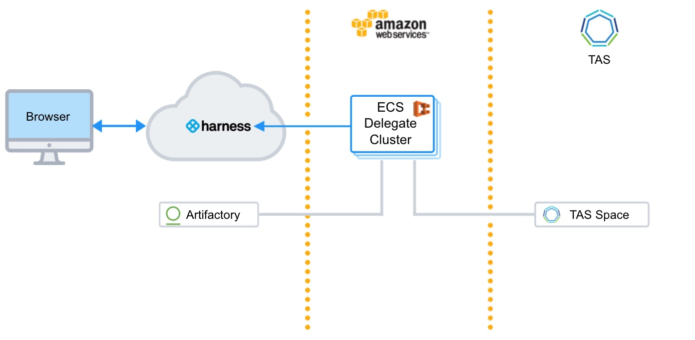
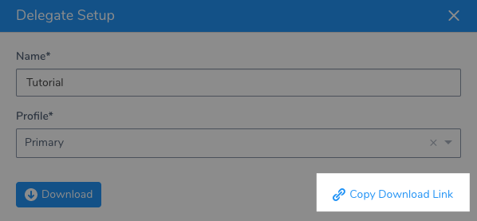
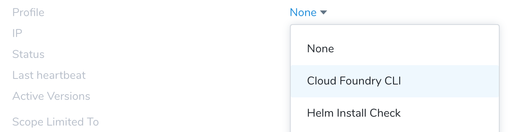
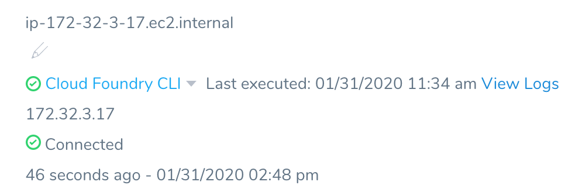
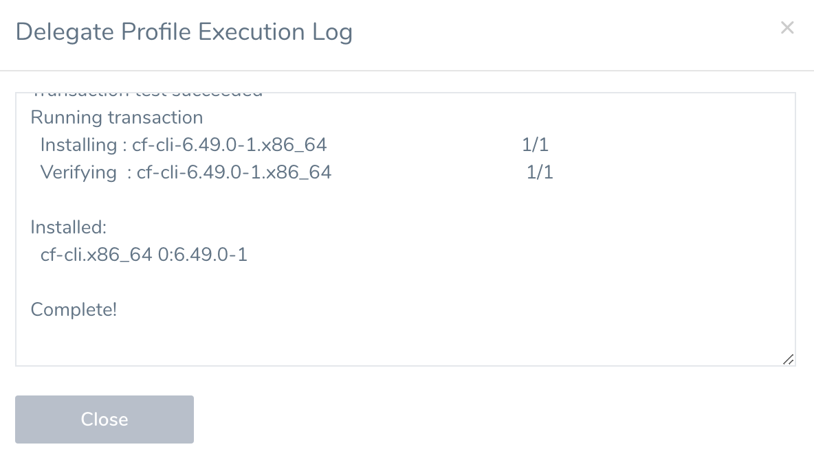
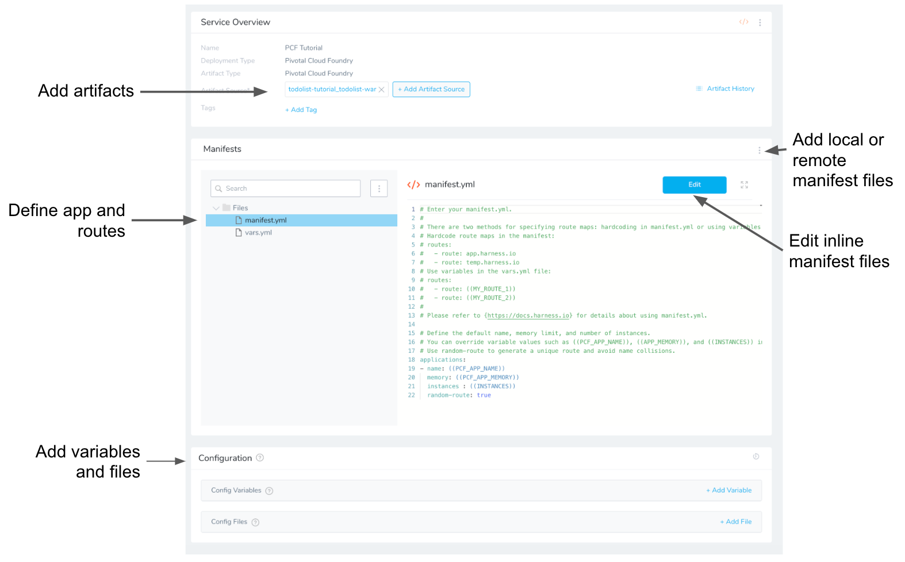
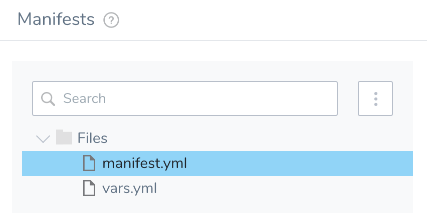
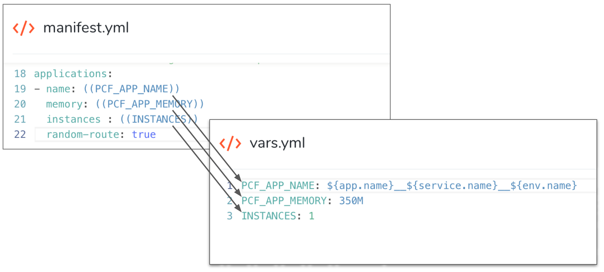
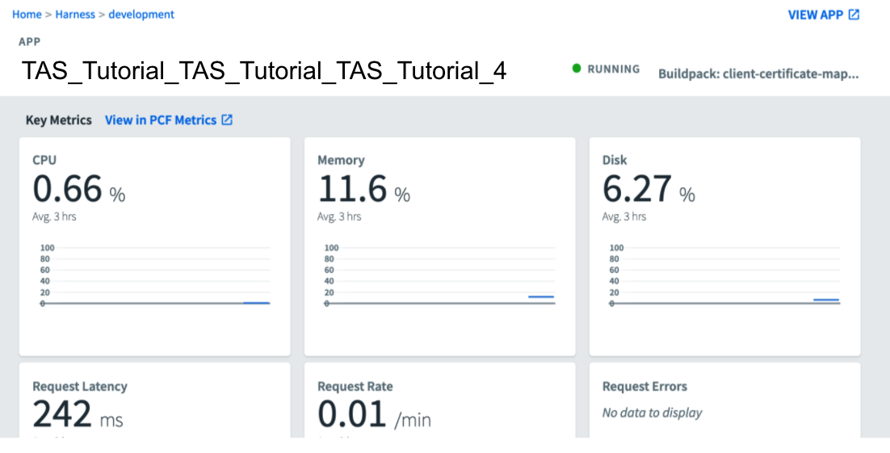

This quickstart shows you how to deploy a publicly available app to your [Tanzu Application Service](https://docs.pivotal.io/application-service/2-11/concepts/overview.html) (TAS, formerly PCF) space using Harness.

## Objectives

You'll learn how to:

* Install and run the Harness Shell Script Delegate on an EC2 host.
* Connect Harness with your TAS account.
* Connect Harness with Artifactory.
* Specify the TAS manifest to use for the app.
* Specify the target TAS org and space.
* Set the number of instances to deploy.
* Create and deploy a TAS Basic Workflow.

## Before You Begin

* Review [Harness Key Concepts](../starthere-firstgen/harness-key-concepts.md) to establish a general understanding of Harness.
* **TAS space** — You will need a TAS space for Harness to deploy the app.
* **EC2 Instance for Harness Shell Script Delegate** — The EC2 instance for the Harness Delegate must meet the following requirements:
	+ Linux/UNIX server.
	+ ​Minimum 1 CPU.
	+ Minimum 8GB RAM. For example, an AWS EC2 instance type such as m5a.xlarge has 16GB of RAM, 8 for the Delegate and 8 for the remaining operations.
	+ Minimum 6GB Disk space.
	+ Outbound Access: HTTP, HTTPS, SSH. This enables the Delegate to communicate with Harness, Artifactory, and your TAS account.
	+ IAM role: The EC2 instance only needs to make connections to Harness and TAS so its permissions are minimal.

Once you have the above prerequisites, the remaining steps in this tutorial will take about 10 minutes.

## Visual Summary

The following diagram shows the very simple topology for this tutorial:



You will install the Harness Shell Script Delegate on an EC2 instance in your AWS account and connect Harness to TAS and Artifactory. Next, you'll set up your artifact, TAS manifests, and target space in Harness. Lastly, you'll create a Basic Workflow and deploy the number of new instances you need.

## Step 1: Install and Launch the Shell Script Delegate

First we'll install the Harness Shell Script Delegate on the EC2 instance you set up. Ensure that the EC2 instance meets the requirements in [Before You Begin](#before_you_begin).

To install the Delegate on your EC2 instance:

1. Sign into the Harness Manager.
2. Click **Setup**, and then click **Harness Delegates**.
3. Click **Download Delegate**, and then click **Shell Script**.
4. Enter a name for the Delegate, and select the **Primary** Profile.
5. Click **Copy Download Link**.

   
6. Log into your EC2 instance, paste the Shell Script Delegate command, and hit **Enter**.
7. Once the Delegate is downloaded, unzip it (`tar -zxvf harness-delegate.tar.gz`), change directories into the **harness-delegate** folder and run the start command: `./start.sh`. Ignore any warning about the ulimit.

   The Delegate will start and in a few moments you will see it listed in the **Harness Delegates** page.

### Delegate Selectors

As a best practice, add a Delegate Selector to the Delegate so you can quickly identify it.

1. In the Delegate listing on the **Harness Delegates** page, click **Edit** next to **Selectors**.
2. Type in **TAS-Tutorial**, press **Enter**, and then click **Submit**.  
The Selector is added to the Delegate.

Next we need to install the CF CLI on the Delegate so it can perform operations on your TAS space.

## Step 2: Add the CF CLI to Delegate

The host running the Harness Delegate must run the CF CLI in order to execute the required commands.

You can follow the steps in [Installing the cf CLI](https://docs.pivotal.io/pivotalcf/2-3/cf-cli/install-go-cli.html) from Pivotal to install the CLI, or you can use a Harness Delegate Profile to install the CLI, described below.

1. In Harness, navigate to the Harness Delegates page if you are not already there.
2. Click **Manage Delegate Profiles**, and then click **Add Delegate Profile**.
3. In **Display Name**, enter **Cloud Foundry CLI**.
4. In **Startup Script**, enter the following script:

		```
		sudo wget -O /etc/yum.repos.d/cloudfoundry-cli.repo https://packages.cloudfoundry.org/fedora/cloudfoundry-cli.repo  
		  
		sudo yum -y install cf-cli
		```
		When you're done the Delegate Profile will look like this:

		
		
5. Click **Submit**.

6. Locate your Delegate, click its **Profile** (**None** by default), and select **Cloud Foundry CLI**.



It will take a few minutes for the CLI to install. When it is installed, a green checkmark appears next to the **Profile** on your Delegate.



If you click View Logs, you can see the installation log:



:::note
The version of the CF CLI you install on the Delegate should always match the TAS features you are using in your Harness TAS deployment. For example, if you are using `buildpacks` in your manifest.yml in your Harness Service, the CLI you install on the Delegate should be version 3.6 or later.
:::

Next, we can use the Delegate to set up Harness' connections to TAS and Artifactory.

## Step 3: Add the Harness TAS Cloud Provider

Harness integrates with many different types of repositories and providers. For this tutorial, you will connect to your TAS account.

:::note
The TAS user account you use must have **Admin**, **Org Manager**, or **Space Manager** role. The user account must be able to update spaces, orgs, and applications. For more information, see [Orgs, Spaces, Roles, and Permissions](https://docs.pivotal.io/pivotalcf/2-3/concepts/roles.html) from Pivotal.
:::

1. In **Setup**, click **Cloud Providers**.
2. Click **Add Cloud Provider**. Enter the following settings:

   * **Type:** Select **Pivotal Cloud Foundry**.
   * **Display Name:** Enter **TAS Tutorial**.
   * **Endpoint URL:** Enter **api.run.pivotal.io**.
   * **Username/Password:** Enter the username and password for your TAS account.

3. Click **Test**, and then click the **SUBMIT** button.

The TAS Cloud Provider is added. Now we can connect to Artifactory where our publicly available app is located.

## Step 4: Add the Artifactory Artifact Server

For this tutorial, we'll use a Todo List app artifact, todolist.war, available in a public Harness Artifactory repo.

1. In Harness, click **Setup,** and then click **Connectors**.
2. Click **Artifact Servers**, and then click **Add Artifact Server**. Enter the following settings:

   * **Type:** Select **Artifactory**.
   * **Display Name:** Enter **Artifactory Public**.
   * **Artifactory URL**: Enter **https://harness.jfrog.io/harness**.
   * **Username/password:** Leave these settings empty.

3. Click **Test** and the **Submit**. If the test fails, that means the Delegate can't connect to https://harness.jfrog.io/harness. Make sure that the EC2 instance hosting the Delegate can make outbound connections to https://harness.jfrog.io/harness.

Now all your connections are set up and you can define your TAS spec.

## Step 5: Add Your Artifact and TAS Specs

A Harness Application represents your TAS apps, their deployment pipelines, and all the building blocks for those pipelines.

First, we'll create a Harness Application and Service, and look at the default TAS specs.

1. In Harness, click **Setup**, and then click **Add Application**. The Application settings appear.
2. Enter the name TAS Tutorial, and click Submit. Your new Application appears.

   We won't cover all of the Application entities in this tutorial. We assume you've read [Harness Key Concepts](../starthere-firstgen/harness-key-concepts.md).

   To add your specs, you create a Harness Service. Services represent your TAS apps. You define the sources of app artifacts and your TAS specs.

3. In your Harness Application, click **Services**. On the **Services** page, click **Add Service**. The **Service** dialog appears. Enter the following settings:

   * **Name:** Enter **TAS Tutorial**.
   * **Deployment Type:** Select **Tanzu Application Services**.

4. Click **SUBMIT**. The new Service is added.

   
	 
   Next, we will add the WAR file artifact to the Service.

5. In your Service, click **Add Artifact Source**, and select the **Artifactory** artifact source. Enter the following settings:

   * **Display Name:** Enter **Todo List**.
   * **Source Server:** Select the Artifact Server you created earlier, **Artifactory Public**.
   * **Repository:** Select **todolist-tutorial**.
   * **Artifact Path/File Filter:** Enter **todolist.war**.
   * **Metadata Only:** Do not select this option.

6. Click **Submit**. The artifact is added to the Service. Next we'll check the **Artifact History** to get a history of the WAR file. This primes the deployment with the history of artifacts.
7. Click **Artifact History**, and then click **Manually pull artifact**.

   
	 
8. Enter the following settings:

   * **Artifact Stream:** Select **Todo List**.
   * **Artifact:** Select **build# todolist.war**.

9. Click **Submit**. 

Now Harness has a history of all the artifacts. When you deploy the app, you can select a build number from this history.

Next, let's look at the Service **Manifests** section.

When you create the TAS Service, the **Manifests** section is created and the default manifest.yml and vars.yml files are added.

[](./static/pivotal-cloud-foundry-quickstart-44.png)

Harness uses a manifest file (manifest.yml) and variables file (vars.yml) for defining the TAS application, instances, and routes. Both files must be in YAML format and can use the **.yaml** or **.yml** extension.

Let's look at these files:

* **manifest.yml** - This file describes your application, host requirements, and routes. For example, the default name, memory limit, and number of instances. You can hardcode values or use variables defined in vars.yml.  
This file follows the TAS app manifest requirements described in [Deploying with App Manifests](https://docs.cloudfoundry.org/devguide/deploy-apps/manifest.html) and [Example Manifest](https://docs.pivotal.io/pivotalcf/2-4/devguide/deploy-apps/manifest.html#minimal-manifest) from Pivotal.
* **vars.yml** - This file is used to maintain variables used in the manifest.yml file.

Here is an example showing how the variables in **manifest.yml** are given values in **vars.yml**:

[](./static/pivotal-cloud-foundry-quickstart-46.png)For this tutorial, we'll use the default manifest files. You do not need to make any changes.

Note that the name for the TAS app in vars.yml is a concatenation of your Harness Application, Service, and Environment names: `PCF_APP_NAME: ${app.name}__${service.name}__${env.name}`. This will help you find the deployed app in your TAS space later.Now that we have our artifact and specs, we can define our target space.

## Step 6: Define Your Target TAS Space

Harness uses Environments to represent one or more of your deployment infrastructures, such as Dev, QA, Stage, Production, etc.

In each Environment, you define Infrastructure Definitions to describe your target TAS space. A single Infrastructure Definition can be used by multiple Harness TAS Services.

1. Use the breadcrumb navigation to jump to **Environments**.
2. Click **Add Environment**. The **Environment** dialog appears. Enter the following settings:

   * **Name:** Enter **TAS Tutorial**.
   * **Environment Type:** Select **Non-Production**.

3. Click **Submit**. The new Environment appears. Next we will add an Infrastructure Definition to identify the TAS space.
4. On your **Environment** page, click **Add Infrastructure Definition**. Enter the following settings:

  * **Name:** Enter **TAS Tutorial**.
  * **Cloud Provider Type:** Select **Tanzu Application Services**.
  * **Deployment Type:** Select **Tanzu Application Services**.
  * **Cloud Provider:** Select the TAS Cloud Provider you added earlier.
  * **Organization:** Select your target TAS org.
  * **Space:** Select your target space.

5. Click **Submit**. The new Infrastructure Definition is added to your Environment.

You will select this Environment and Infrastructure Definition when you create your Harness Workflow next.

## Step 7: Set up a TAS Basic Workflow

A TAS Workflow performing a Basic deployment simply takes your Harness TAS Service and deploys it to your TAS Infrastructure Definition.

Once the TAS app is set up in the Workflow using the **App Setup** command, you can resize the number of instances specified in the Service manifest.yml or App Setup command using the **App Resize** command.

1. Use the breadcrumb navigation to jump to **Workflows**, and then click **Add Workflow**. The Workflow settings appear.
2. Enter the following settings:

   * **Name:** Enter **TAS Tutorial**.
   * **Workflow Type:** Select **Basic Deployment**.
   * **Environment:** Select **TAS Tutorial**.
   * **Service:** Select **TAS Tutorial**.
   * **Infrastructure Definition:** Select **TAS Tutorial**.


3. Click **Submit**. The TAS Basic Workflow is created.

   There's nothing to change in the default Workflow settings. We simply need to open and confirm the defaults.

  We'll walk through the default steps in the Workflow, **App Step** and **App Resize**.

4. Click **App Setup**. The App Setup command uses the manifest.yml in your Harness TAS Service to set up your app. We'll confirm the defaults.

   * **Name:** This is the name of the step.
   * **Instance Count:** The number of instances for your app. By default, we use the `INSTANCES` settings from the vars.yml in your Service **Manifests** section. The **Match running instances** setting can be used after your first deployment to override the `instances` setting in the manifest.yml.
   * **Existing Versions To Keep:** The number of previous app versions to downsize and keep.
   * **Additional Routes:** Any additional routes to add to the mapping configured in the Service manifest.
   * **Use App Autoscaler Plugin:** This setting can be used if the [App Autoscaler plugin](https://docs.pivotal.io/application-service/2-7/appsman-services/autoscaler/using-autoscaler-cli.html) service running in your target Pivotal space and bound to the app you are deploying.

5. Click **Submit**.
6. Click **App Resize**. The App Resize command is displayed as incomplete. Harness simply needs you to confirm the default number of desired instances, **100 Percent**.

   * **Name:** This is the name of the step.
   * **Desired Instances:** A percentage of the number specified in your manifest.yml, or if you used the **App Setup Match desired count with current running instances** setting, the current number of running instances. You can also use **Count** to explicitly set the number of desired instances.

7. Click **Submit**.

The Workflow is complete. You can run the Workflow to deploy the app to your TAS space.

## Step 8: Deploy and Review

Now that your TAS Basic Workflow is complete you can deploy it to your space.

1. If you're not already on the main Workflow page, use the breadcrumb navigation to navigate to the **TAS Tutorial** Workflow.
2. Click the **Deploy** button. The Deploy settings appear. Enter the following settings:

   * **Artifacts** > **TAS Tutorial**: Select an artifact from the Artifact Source you added to the Harness Service. In this tutorial, we are using a public Artifactory file. Select **Buid# todolist.war**.
   * **Send notification to me only:** Enable this setting if you are doing this tutorial using your corporate Harness account. Enabling this setting will ensure that other users won't be notified of this deployment.

3. Click **Submit**. The deployment executes.

You now have a Todo List app deployed to your TAS space. Remember the app name is a concatenation of your Harness Application, Service, and Environment names: `${app.name}__${service.name}__${env.name}`:



Click **VIEW APP** to see the running app.

## Next Steps

In this tutorial, you learned how to:

* Install and run the Harness Shell Script Delegate on an EC2 host.
* Connect Harness with your TAS account.
* Connect Harness with Artifactory.
* Specify the TAS manifest to use for the app.
* Specify the target TAS org and space.
* Set the number of instances to deploy.
* Create and deploy a TAS Basic Workflow.

Read the following related How-tos:

* [Tanzu Application Service How-tos](https://developer.harness.io/docs/category/tanzu-application-service-formerly-pivotal) which include Canary and Blue/Green TAS deployments.
* [Triggers](../continuous-delivery/model-cd-pipeline/triggers/add-a-trigger-2.md) show you how to automate deployments in response to different events.
* [Infrastructure Provisioners Overview](../continuous-delivery/model-cd-pipeline/infrastructure-provisioner/add-an-infra-provisioner.md) will show you how to add provisioning as part of your Workflow.

