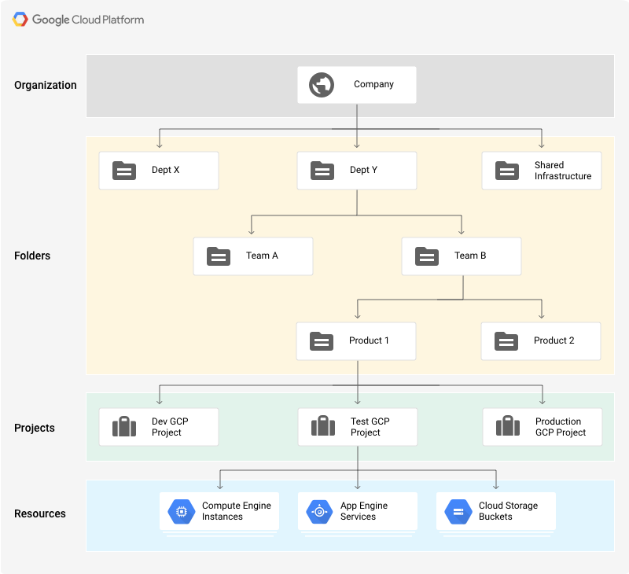

This article addresses some frequently asked questions about Harness Cloud Cost Management (CCM) (formerly Continuous Efficiency).

<!-- TOC start -->
- [Setup](#setup)
  * [AWS](#aws)
    + [What types of access do you need for my AWS master account?](#what-types-of-access-do-you-need-for-my-aws-master-account)
    + [Can I provide you access to a CUR report in my linked account instead?](#can-i-provide-you-access-to-a-cur-report-in-my-linked-account-instead)
    + [What types of access do you get to my accounts?](#what-types-of-access-do-you-get-to-my-accounts)
    + [Do you import the data into your account?](#do-you-import-the-data-into-your-account)
    + [Do I need a Harness Delegate to get started with AWS?](#do-i-need-a-harness-delegate-to-get-started-with-aws)
  * [GCP](#gcp)
    + [Do you import the data into your BigQuery account?](#do-you-import-the-data-into-your-bigquery-account)
    + [What is the typical hierarchy of GCP cost organizations?](#what-is-the-typical-hierarchy-of-gcp-cost-organizations)
  * [Kubernetes](#kubernetes)
    + [Do I need a Harness Delegate to get started with the Kubernetes cluster?](#do-i-need-a-harness-delegate-to-get-started-with-the-kubernetes-cluster)
    + [What prerequisites do I need to be aware of? I understand these are part of the installation checks you make, but I’d like to be prepared before I begin.](#what-prerequisites-do-i-need-to-be-aware-of-i-understand-these-are-part-of-the-installation-checks-you-make-but-id-like-to-be-prepared-before-i-begin)
    + [Do I need to ensure the Metrics Server is installed for EKS?](#do-i-need-to-ensure-the-metrics-server-is-installed-for-eks)
    + [Do I need 8GB of memory for my Delegate? Can I do it with 3GB?](#do-i-need-8gb-of-memory-for-my-delegate-can-i-do-it-with-3gb)
- [Azure](#azure)
    + [Do I need a Harness Delegate to get started connecting to Azure?](#do-i-need-a-harness-delegate-to-get-started-connecting-to-azure)
    + [What types of access do you get to my accounts?](#what-types-of-access-do-you-get-to-my-accounts-1)
- [Status](#status)
    + [How frequently do you process cost data for the Kubernetes cluster, AWS, and GCP?](#how-frequently-do-you-process-cost-data-for-the-kubernetes-cluster-aws-and-gcp)
    + [How long do I need to wait before data appears for the Kubernetes cluster?](#how-long-do-i-need-to-wait-before-data-appears-for-the-kubernetes-cluster)
    + [How long do I need to wait before data appears for AWS? Why?](#how-long-do-i-need-to-wait-before-data-appears-for-aws-why)
    + [How long do I need to wait before data appears for GCP? Why?](#how-long-do-i-need-to-wait-before-data-appears-for-gcp-why)
    + [How often is data processed overall in CCM?](#how-often-is-data-processed-overall-in-ccm)
    + [Why can’t I see my data in the past 2 hours?](#why-cant-i-see-my-data-in-the-past-2-hours)
    + [Why is my cluster data showing events last collected since <x days/hours> ago?](#why-is-my-cluster-data-showing-events-last-collected-since-x-dayshours-ago)
- [Efficiency Score](#efficiency-score)
    + [Is the efficiency score configurable? Why not?](#is-the-efficiency-score-configurable-why-not)
    + [Does the efficiency score take into account overall cloud costs? How is it computed?](#does-the-efficiency-score-take-into-account-overall-cloud-costs-how-is-it-computed)
- [Idle Cost](#idle-cost)
    + [What specific actions can I take to bring my idle costs down?](#what-specific-actions-can-i-take-to-bring-my-idle-costs-down)
- [Unallocated Cost](#unallocated-cost)
    + [What specific actions can I take to bring my unallocated costs down?](#what-specific-actions-can-i-take-to-bring-my-unallocated-costs-down)
- [Recommendations](#recommendations)
    + [Are the recommendations configurable?](#are-the-recommendations-configurable)
    + [How do the recommendations compare to Vertical Pod Autoscaler (VPA)?](#how-do-the-recommendations-compare-to-vertical-pod-autoscaler-vpa)
    + [What are the key differences between burstable and guaranteed? When do I need to apply which?](#what-are-the-key-differences-between-burstable-and-guaranteed-when-do-i-need-to-apply-which)
    + [Can you automate how it is applied?](#can-you-automate-how-it-is-applied)
    + [Do you take into account the seasonality and trends of my workload data?](#do-you-take-into-account-the-seasonality-and-trends-of-my-workload-data)
    + [What about Horizontal Pod Autoscaler (HPA)?](#what-about-horizontal-pod-autoscaler-hpa)
- [Cost Events](#cost-events)
    + [What types of events does CCM handle today?](#what-types-of-events-does-ccm-handle-today)
    + [How are these relevant to help me cut costs?](#how-are-these-relevant-to-help-me-cut-costs)
- [Node Optimization](#node-optimization)
    + [How can I optimize my nodes based on the information I get from CE?](#how-can-i-optimize-my-nodes-based-on-the-information-i-get-from-ce)
    + [Do I get a spot or on-demand recommendations today?](#do-i-get-a-spot-or-on-demand-recommendations-today)
- [Non-cluster](#non-cluster)
  * [AWS](#aws-1)
  * [Does CCM tie cost data back into the savings plan in AWS?](#does-ccm-tie-cost-data-back-into-the-savings-plan-in-aws)
    + [Does CCM tie cost data to make Reserved Instance (RI) recommendations?](#does-ccm-tie-cost-data-to-make-reserved-instance-ri-recommendations)
    + [Does CCM take into account my RI purchases and discounts?](#does-ccm-take-into-account-my-ri-purchases-and-discounts)
  * [GCP](#gcp-1)
    + [Does CCM take into account Committed Usage Discounts (CUDs), Sustained Use Discounts (SUDs)?](#does-ccm-take-into-account-committed-usage-discounts-cuds-sustained-use-discounts-suds)
    + [Does CCM take into account custom discounts or rewards?](#does-ccm-take-into-account-custom-discounts-or-rewards)
    + [What about some services I purchased via the marketplace?](#what-about-some-services-i-purchased-via-the-marketplace)
- [Reporting/Scheduling and Cost Governance](#reportingscheduling-and-cost-governance)
    + [Do you support custom reporting to our finance teams?](#do-you-support-custom-reporting-to-our-finance-teams)
    + [Do you support custom dashboard creation? What if I want to share configurable dashboards on a scheduled basis to my business users?](#do-you-support-custom-dashboard-creation-what-if-i-want-to-share-configurable-dashboards-on-a-scheduled-basis-to-my-business-users)
- [On-premise and Other Clouds](#on-premise-and-other-clouds)
    + [Does CCM support on-prem workloads? What about the other types of infra? OpenShift, VMware, etc.?](#does-ccm-support-on-prem-workloads-what-about-the-other-types-of-infra-openshift-vmware-etc)
    + [Can I manually enter cost data or upload a rate card?](#can-i-manually-enter-cost-data-or-upload-a-rate-card)
    + [What about other clouds? IBM, Oracle, etc.? Do you support the Kubernetes cluster running on these clouds?](#what-about-other-clouds-ibm-oracle-etc-do-you-support-the-kubernetes-cluster-running-on-these-clouds)
- [APIs](#apis)
    + [Can we export CCM data?](#can-we-export-ccm-data)
- [Cost Anomaly Detection](#cost-anomaly-detection)
    + [Does CCM detects cost spikes and cost drops?](#does-ccm-detects-cost-spikes-and-cost-drops)
    + [How many days of data does CCM analyze to predict the cost anomalies?](#how-many-days-of-data-does-ccm-analyze-to-predict-the-cost-anomalies)
    + [How does cost anomaly detection works?](#how-does-cost-anomaly-detection-works)
    + [Can I change the thresholds defined in the algorithm?](#can-i-change-the-thresholds-defined-in-the-algorithm)
    + [Does the cost anomaly detection algorithm keep an account of the recurring events (seasonalities) that happen on a daily, weekly, or monthly basis?](#does-the-cost-anomaly-detection-algorithm-keep-an-account-of-the-recurring-events-seasonalities-that-happen-on-a-daily-weekly-or-monthly-basis)
    + [Does Harness CCM send notifications for the cost anomalies?](#does-harness-ccm-send-notifications-for-the-cost-anomalies)
- [General](#general)
   + [What is the typical hierarchy of AWS/GCP/Azure?](#what-is-the-typical-hierarchy-of-awsgcpazure)
<!-- TOC end -->

### Setup

#### AWS

##### What types of access do you need for my AWS master account?

* CCM doesn't need access to your master account. CCM only needs access to the cost and usage report (CUR) stored in your S3 bucket in the master/payer account.
	+ If you don't have access to your master account to create a CUR in the S3 bucket, contact your IT or security teams to get the required permissions. In doing so, we get `read-only` access to the cost data along with a list of all the member (or linked) accounts. CE does not get access to any other privileges.
	+ If you have a consolidated billing setup, this is the only way for CCM to get access to your billing data.
* If you would like to limit access to specific accounts from a cost visibility standpoint, you can deselect specific member accounts (or whitelist linked/member accounts). Contact the Harness Support team to whitelist or blacklist the accounts for which you want to limit visibility. This functionality will be available via UI soon.
* See [Connect to Your AWS Master Account](../cloud-cost-management/setup-cost-visibility/enable-continuous-efficiency-for-aws.md#step-connect-to-your-aws-master-account).

##### Can I provide you access to a CUR report in my linked account instead?

CUR report has data for all the linked accounts. It is a limitation on the AWS side to selectively whitelist/blacklist accounts in the report. 

##### What types of access do you get to my accounts?

CCM gets `read-only` access to the cost data along with a list of all the member (or linked) accounts. CCM does not get access to any other privileges. 

##### Do you import the data into your account?

The CUR reports are imported into our account. CE stores them securely with `read-only` access. 

##### Do I need a Harness Delegate to get started with AWS?

No. You need Harness Delegate only when connecting to a Kubernetes cluster, such as an EKS cluster.

#### GCP

##### Do you import the data into your BigQuery account?

Yes. 

##### What is the typical hierarchy of GCP cost organizations?

##### Do I need a Harness Delegate to get started connecting to GCP?

No. You need Harness Delegate only when connecting to a Kubernetes cluster, such as GKE.

#### Kubernetes

##### Do I need a Harness Delegate to get started with the Kubernetes cluster?

Yes. Delegate is necessary for the Kubernetes cluster.

You can choose to use a single Delegate for accessing multiple Kubernetes clusters. See [Set Up Cost Visibility for Kubernetes Using an Existing Delegate](../cloud-cost-management/setup-cost-visibility/enable-continuous-efficiency-for-kubernetes.md).

##### What prerequisites do I need to be aware of? I understand these are part of the installation checks you make, but I’d like to be prepared before I begin.

Check if you have installed the Kubernetes Metrics Server and provided permissions to the Delegate to access your cluster.

* If the Delegate is already running in the Kubernetes cluster that you want to monitor, see [Set Up Cost Visibility for Kubernetes Using an Existing Delegate](../cloud-cost-management/setup-cost-visibility/enable-continuous-efficiency-for-kubernetes.md).
* If you are connecting your Kubernetes cluster to CE, see [Set Up Cost Visibility for Kubernetes](../cloud-cost-management/setup-cost-visibility/enable-ce-by-adding-a-delegate.md).

##### Do I need to ensure the Metrics Server is installed for EKS?

Yes. Metrics Server is installed by default on GKE and AKS clusters. 

##### Do I need 8GB of memory for my Delegate? Can I do it with 3GB?

You could do with 3GB if you intend to use the Delegate just for CE. 

### Azure

##### Do I need a Harness Delegate to get started connecting to Azure?

No. You need Harness Delegate only when connecting to a Kubernetes cluster, such as AKS.

##### What types of access do you get to my accounts?

CCM gets only read permissions to the storage account in which the billing data export is available.

### Status

##### How frequently do you process cost data for the Kubernetes cluster, AWS, and GCP?

* For the Kubernetes cluster, data is processed hourly. It would take between 2-3 hours for your data to show up in the Cost Explorer after it is connected. See [Analyze Cost for Kubernetes](../cloud-cost-management/root-cost-analysis/analyze-cost-trends-across-clusters.md).
* For AWS and GCP it takes about 24 hours for the data to be available for viewing and analysis. See [Analyze Cost for AWS](../cloud-cost-management/root-cost-analysis/analyze-cost-trends-for-aws.md) and [Analyze Cost for GCP](../cloud-cost-management/root-cost-analysis/analyze-cost-for-gcp.md).

##### How long do I need to wait before data appears for the Kubernetes cluster?

It would take between 2-3 hours.

##### How long do I need to wait before data appears for AWS? Why?

AWS billing data is synced once every 24 hours. You will see up to 24 hours delay for data to show up for AWS.

##### How long do I need to wait before data appears for GCP? Why?

GCP billing data is synced once every 24 hours. You will see up to 24 hours delay for data to show up for GCP.

##### How often is data processed overall in CCM?

* For clusters, billing data is generated hourly.
* Recommendations are generated daily.
* For AWS and GCP, data is synced daily.

##### Why can’t I see my data in the past 2 hours?

Kubernetes events are collected continuously. The jobs to convert these events to cost data run every hour with 1-hour latency.

##### Why is my cluster data showing events last collected since <x days/hours> ago?

Delegates running in Kubernetes clusters are regularly sending us cluster events as they happen. This message indicates the last time an event is received from the cluster. This is useful for health information. An event in the last 20 minutes indicates a healthy state.

### Efficiency Score

##### Is the efficiency score configurable? Why not?

Efficiency score is not configurable at the moment. The efficiency score objectively represents how well your cluster resources are utilized.

5% buffer of the total cost is allowed while computing the unallocated resources and 30% for idle resources. A baseline of 65% is defined for utilized resources. So your utilization need not be at the capacity to get a perfect score. See [Efficiency Score](../cloud-cost-management/concepts-ccm/a-cost-explorer-walkthrough.md#efficiency-score).

##### Does the efficiency score take into account overall cloud costs? How is it computed?

It takes only the cluster resources into account and not the overall cloud costs. Efficiency score is derived from the total and idle (and or unallocated) spend of your resources. 

### Idle Cost

##### What specific actions can I take to bring my idle costs down?

Idle costs are when pods are utilizing more resources than they actually need.

1. Identify the namespaces/workloads having higher idle costs.
2. Drill down into their usage.
3. [Optimize Kubernetes cluster costs with resource recommendations](../cloud-cost-management/ccm-recommendations/recommendations.md).

### Unallocated Cost

##### What specific actions can I take to bring my unallocated costs down?

Unallocated costs are when a Kubernetes cluster has excessive resources allocated than needed by the workloads.

1. Check if cluster autoscaler is enabled. If not, please talk to Harness and enable it.
2. If autoscaler is enabled on GKE it can be [tweaked](https://cloud.google.com/kubernetes-engine/docs/concepts/cluster-autoscaler#autoscaling_profiles) to scale down.
3. Look into unallocated costs by nodes. See if there are nodes that are disproportionately bigger and causing most of the unallocated cost and can be downsized.

### Recommendations

##### Are the recommendations configurable?

Currently, not. Harness is working on providing this functionality.

##### How do the recommendations compare to Vertical Pod Autoscaler (VPA)?

The algorithm is similar. Both should provide similar recommendations as of now. This might change in the future as the recommendations algorithm is modified based on the learnings.

##### What are the key differences between burstable and guaranteed? When do I need to apply which?

The key difference between the burstable and guaranteed recommendations is in the tradeoff between predictable performance and cost. If you choose a burstable recommendation, more pods can fit on the same node so there is a cost-saving. But if there is any resource pressure on the underlying node, there will be throttling or eviction to free up resources. If you need more predictable performance, use guaranteed recommendations. See [Optimize Kubernetes Cluster Costs With Resource Recommendations](../cloud-cost-management/ccm-recommendations/recommendations.md).

##### Can you automate how it is applied?

Currently, it cannot be automated.

##### Do you take into account the seasonality and trends of my workload data?

Seasonality is not taken into account in recommendations.

##### What about Horizontal Pod Autoscaler (HPA)?

HPA on CPU/memory is not recommended along with workload recommendations. HPA on other custom metrics is ok.

### Cost Events

##### What types of events does CCM handle today?

* Changes to well-known Kubernetes workload types:
	+ Deployment
	+ StatefulSet
	+ DaemonSet
	+ CronJob
	+ Job
	+ ReplicaSet
* Service deployments that were triggered through Harness.

##### How are these relevant to help me cut costs?

Every event is associated with an estimated cost change. By correlating the cost trend graph with the events that occurred at the same time, it can be deduced what events might have contributed to a particular change in cost trend. See [Perform Root Cost Analysis](../cloud-cost-management/root-cost-analysis/perform-root-cause-analysis.md).

### Node Optimization

##### How can I optimize my nodes based on the information I get from CE?

You can check the unallocated costs for a cluster. If the number is very high, you may consider reducing the size of the cluster. See [Root Cost Analysis for Nodes](../cloud-cost-management/root-cost-analysis/perform-root-cause-analysis.md#option-4-root-cost-analysis-for-nodes).

##### Do I get a spot or on-demand recommendations today?

Not at the moment. They are available out-of-the-box (OOTB) for free from the AWS cost explorer.

### Non-cluster

#### AWS

#### Does CCM tie cost data back into the savings plan in AWS?

No.

##### Does CCM tie cost data to make Reserved Instance (RI) recommendations?

No. They are available OOTB for free from the AWS cost explorer. 

##### Does CCM take into account my RI purchases and discounts?

Yes, the data from your CUR is read which is the source of truth on how you are billed monthly. 

#### GCP

##### Does CCM take into account Committed Usage Discounts (CUDs), Sustained Use Discounts (SUDs)?

Yes. Once you connect your GCP account, the data is read from your GCP billing API and the discounts are also applied as per your eligibility. The true costs with the discounts can be viewed on the Cost Explorer page. See [Analyze Discounts](../cloud-cost-management/root-cost-analysis/analyze-cost-for-gcp.md#step-analyze-discounts).

##### Does CCM take into account custom discounts or rewards?

Yes, if they are part of your billing. 

##### What about some services I purchased via the marketplace?

They show up in the Cost Explorer.

### Reporting/Scheduling and Cost Governance

##### Do you support custom reporting to our finance teams?

Yes. You can get a weekly report or subscribe to your finance team or any member in your organization to get a cost report. See [Enable Cost Reports Using Email](../cloud-cost-management/cost-report/set-communications.md) and [Set Up Slack Notifications](../cloud-cost-management/cost-report/set-up-slack-notifications.md).

##### Do you support custom dashboard creation? What if I want to share configurable dashboards on a scheduled basis to my business users?

Yes, you can use Perspectives to create your own customized explorer view. See [Create Cost Perspectives](../cloud-cost-management/ccm-perspectives/perspectives.md). You can add a report sharing schedule to share the custom view with your business users. See [Share Your Cost Perspective Report](../cloud-cost-management/ccm-perspectives/share-report-in-cost-perspectives.md).

### On-premise and Other Clouds

##### Does CCM support on-prem workloads? What about the other types of infra? OpenShift, VMware, etc.?

CE supports:

* OpenShift on AWS and GCP
* KOPS-managed clusters
* On-prem Kubernetes clusters with custom pricing (manual input) and
* Rancher with custom pricing

See [CE Coverage](../../cloud-cost-management/get-started/overview.md#ccm-coverage) and [Supported Kubernetes Management Platform](../../get-started/supported-platforms-and-technologies.md#cloud-cost-management).

##### Can I manually enter cost data or upload a rate card?

Yes, but please reach out to Harness as this requires a back-end manual entry. This functionality will be available via UI shortly.

##### What about other clouds? IBM, Oracle, etc.? Do you support the Kubernetes cluster running on these clouds?

Kubernetes cluster running on infrastructure outside of AWS, GCP, or Azure is not supported.

### APIs

##### Can we export CCM data?

Data can be exported via Graph QL APIs. You can export data using these APIs and combine them with other financial reporting data. See [Use Cost Explorer APIs](../cloud-cost-management/cost-explorer-apis/ce-cost-explorer-apis.md).

### Cost Anomaly Detection

##### Does CCM detects cost spikes and cost drops?

Currently, only cost spikes are detected. This might change in the future as the algorithm learns and improves the prediction.

##### How many days of data does CCM analyze to predict the cost anomalies?

CCM analyzes 15 to 60 days of data to predict the cost.

##### How does cost anomaly detection works?

CCM uses [statistical anomaly detection techniques](../cloud-cost-management/ccm-anomaly-detection/detect-cost-anomalies-with-ce.md#anomaly-detection-techniques) and [Forecasting at scale](https://peerj.com/preprints/3190/) to determine the cost anomalies. For more information, see [How Cost Anomaly Detection Works?](../cloud-cost-management/ccm-anomaly-detection/detect-cost-anomalies-with-ce.md#how-cost-anomaly-detection-works).

##### Can I change the thresholds defined in the algorithm?

No, you cannot change the defined threshold.

##### Does the cost anomaly detection algorithm keep an account of the recurring events (seasonalities) that happen on a daily, weekly, or monthly basis?

Yes, it keeps an account of the seasonalities. However, the algorithm needs to learn these recurring events before it accounts for these seasonalities.

##### Does Harness CCM send notifications for the cost anomalies?

Yes, Harness CCM sends a notification to the configured Slack channel. For more information, see [Set Up Notifications for Cost Anomalies](../cloud-cost-management/ccm-anomaly-detection/set-up-notifications-for-cost-anomalies.md).

### General

##### What is the typical hierarchy of AWS/GCP/Azure?

|  |  |  |  |
| --- | --- | --- | --- |
|  | **AWS** | **GCP** | **Azure** |
| Hierarchy | Linked Accounts | Folders/Projects | Subscriptions |
| Key/ Value Pairs | Tags | Labels | Tags |
| Tags Applied | Most services resources and accounts | Most services resources and projects | Most services resources and Azure resource groups |

