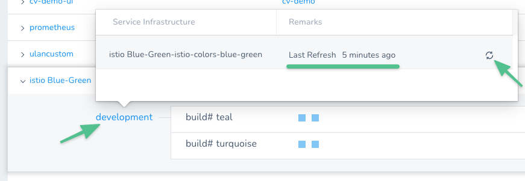
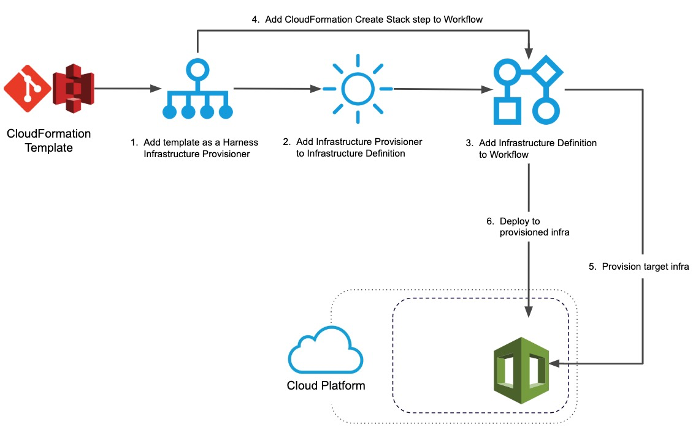
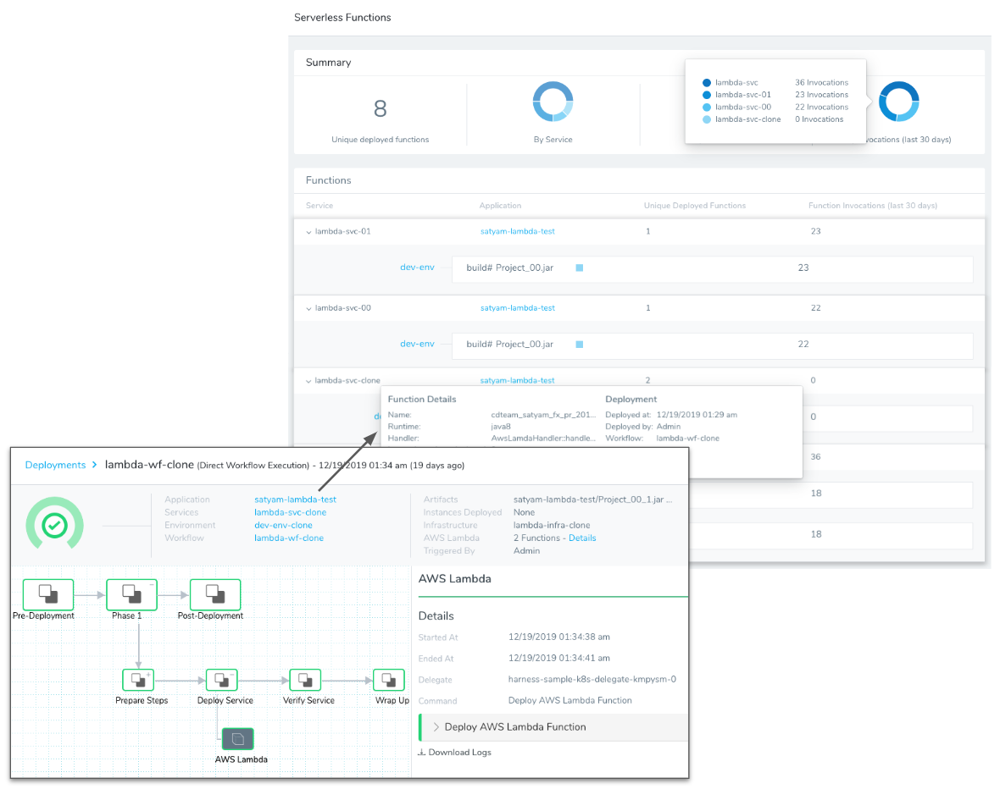
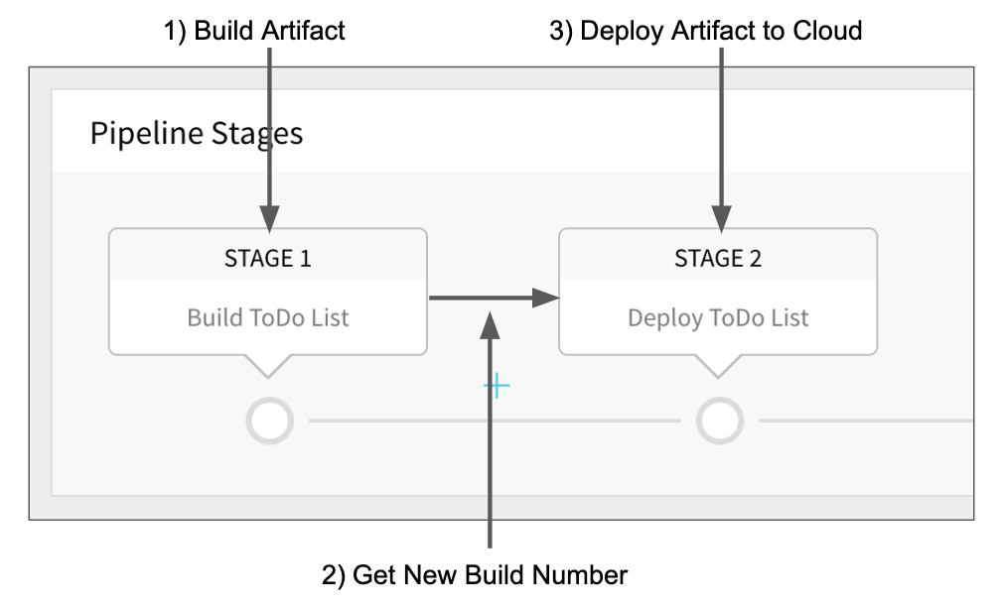
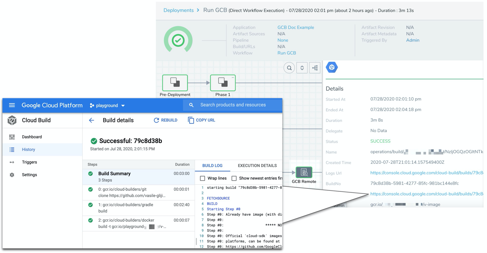
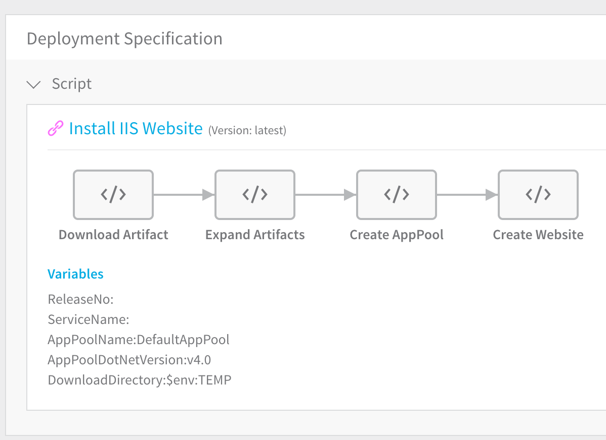
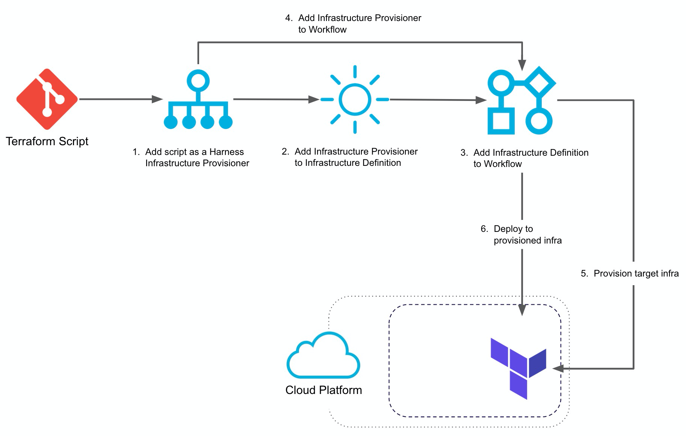
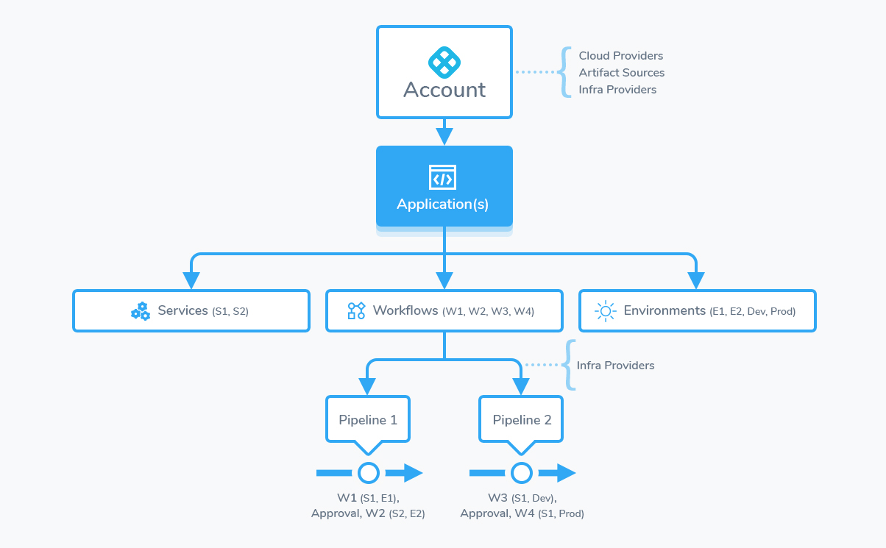

This article addresses some frequently asked questions about Harness Continuous Deployments (CD).

<!-- TOC start -->
- [Before You Begin](#before-you-begin)
- [General](#general)
  - [What can I deploy using Harness?](#what-can-i-deploy-using-harness)
  - [What is a Service Instance in Harness?](#what-is-a-service-instance-in-harness)
  - [How often does Harness Sync with my Deployed Service Instances?](#how-often-does-harness-sync-with-my-deployed-service-instances)
  - [What if I add more Service Instance infrastructure outside of Harness?](#what-if-i-add-more-service-instance-infrastructure-outside-of-harness)
  - [When is a Service Instance removed?](#when-is-a-service-instance-removed)
  - [If the instance/pod is in a failed state does it still count towards the service instance count?](#if-the-instancepod-is-in-a-failed-state-does-it-still-count-towards-the-service-instance-count)
  - [What deployment strategies can I use?](#what-deployment-strategies-can-i-use)
  - [How do I filter deployments on the Deployments page?](#how-do-i-filter-deployments-on-the-deployments-page)
  - [How do I know which Harness Delegates were used in a deployment?](#how-do-i-know-which-harness-delegates-were-used-in-a-deployment)
  - [Can I export deployment logs?](#can-i-export-deployment-logs)
  - [Can I restrict deployments to specific User Groups?](#can-i-restrict-deployments-to-specific-user-groups)
  - [Can I deploy a Workflow to multiple infrastructures at the same time?](#can-i-deploy-a-workflow-to-multiple-infrastructures-at-the-same-time)
  - [Can I resume a failed deployment?](#can-i-resume-a-failed-deployment)
  - [Can I pause all deployments?](#can-i-pause-all-deployments)
- [AWS AMI/ASG](#aws-amiasg)
  - [What is a Harness AMI/ASG deployment?](#what-is-a-harness-amiasg-deployment)
  - [Are public AMIs supported?](#are-public-amis-supported)
  - [Can I do traffic shifting with AMI/ASG deployments?](#can-i-do-traffic-shifting-with-amiasg-deployments)
  - [How does Harness rollback and downsize old ASGs?](#how-does-harness-rollback-and-downsize-old-asgs)
- [AWS AMI/ASG with Spotinst](#aws-amiasg-with-spotinst)
  - [Do you support Spotinst?](#do-you-support-spotinst)
  - [Can I do traffic shifting with Spotinst deployments?](#can-i-do-traffic-shifting-with-spotinst-deployments)
  - [Can I perform verification on Spotinst traffic shifting?](#can-i-perform-verification-on-spotinst-traffic-shifting)
- [AWS ECS](#aws-ecs)
  - [What is a Harness ECS deployment?](#what-is-a-harness-ecs-deployment)
  - [What ECS strategies can I use?](#what-ecs-strategies-can-i-use)
  - [What deployment strategies can I use?](#what-deployment-strategies-can-i-use-1)
  - [What limitations are there on ECS deployments?](#what-limitations-are-there-on-ecs-deployments)
  - [Can I do traffic shifting with AMI/ASG deployments?](#can-i-do-traffic-shifting-with-amiasg-deployments-1)
  - [What ECS networking strategies can I use?](#what-ecs-networking-strategies-can-i-use)
  - [Do Harness support ECS auto scaling?](#do-harness-support-ecs-auto-scaling)
  - [Can I use ECS definitions in my repo?](#can-i-use-ecs-definitions-in-my-repo)
  - [Can I deploy sidecar containers?](#can-i-deploy-sidecar-containers)
  - [Can I run an ECS task?](#can-i-run-an-ecs-task)
- [AWS CloudFormation](#aws-cloudformation)
  - [Does Harness support AWS CloudFormation?](#does-harness-support-aws-cloudformation)
  - [Do I need to deploy an application to use CloudFormation?](#do-i-need-to-deploy-an-application-to-use-cloudformation)
  - [Are Harness Service Instances counted with CloudFormation provisioning?](#are-harness-service-instances-counted-with-cloudformation-provisioning)
  - [Does Harness support AWS Serverless Application Model (SAM) templates?](#does-harness-support-aws-serverless-application-model-sam-templates)
  - [What deployment strategies can I use CloudFormation with?](#what-deployment-strategies-can-i-use-cloudformation-with)
- [AWS Lambda](#aws-lambda)
  - [What is a Harness Lambda deployment?](#what-is-a-harness-lambda-deployment)
  - [How many Service Instances (SIs) would 1 Lambda function consume in Harness?](#how-many-service-instances-sis-would-1-lambda-function-consume-in-harness)
  - [What artifact servers are support for Lambda deployments?](#what-artifact-servers-are-support-for-lambda-deployments)
  - [Can I monitor my Lambda function deployments?](#can-i-monitor-my-lambda-function-deployments)
- [Azure](#azure)
  - [What Azure deployments does Harness support?](#what-azure-deployments-does-harness-support)
  - [What does an Azure virtual machine scale set (VMSS) deployment involve?](#what-does-an-azure-virtual-machine-scale-set-vmss-deployment-involve)
  - [What operation systems are supported for VMSS?](#what-operation-systems-are-supported-for-vmss)
  - [What deployment strategies can I use with VMSS?](#what-deployment-strategies-can-i-use-with-vmss)
  - [What does an Azure ACR to AKS deployment involve?](#what-does-an-azure-acr-to-aks-deployment-involve)
- [CI/CD: Artifact Build and Deploy Pipelines](#cicd-artifact-build-and-deploy-pipelines)
  - [What is a Harness Artifact Build and Deploy deployment?](#what-is-a-harness-artifact-build-and-deploy-deployment)
  - [What can I deploy using Artifact Build and Deploy?](#what-can-i-deploy-using-artifact-build-and-deploy)
  - [How do I create the build Workflow?](#how-do-i-create-the-build-workflow)
  - [How do I create the deploy Workflow?](#how-do-i-create-the-deploy-workflow)
  - [How do I build the Artifact Build and Deploy Pipeline?](#how-do-i-build-the-artifact-build-and-deploy-pipeline)
- [Google Cloud Builds](#google-cloud-builds)
  - [What is a Harness Google Cloud Build deployment?](#what-is-a-harness-google-cloud-build-deployment)
  - [Can I pull the GCB spec from my repo?](#can-i-pull-the-gcb-spec-from-my-repo)
  - [Can I use an existing GCB trigger?](#can-i-use-an-existing-gcb-trigger)
  - [Can I use GCB substitutions?](#can-i-use-gcb-substitutions)
  - [What formats are supported for config files?](#what-formats-are-supported-for-config-files)
- [Native Helm](#native-helm)
  - [What is a Harness Native Helm deployment?](#what-is-a-harness-native-helm-deployment)
  - [What Helm versions does Harness support?](#what-helm-versions-does-harness-support)
  - [Can I upgrade my Native Helm deployment from Helm 2 to Helm 3?](#can-i-upgrade-my-native-helm-deployment-from-helm-2-to-helm-3)
  - [Can I deploy Helm charts without adding an artifact source to Harness?](#can-i-deploy-helm-charts-without-adding-an-artifact-source-to-harness)
- [IIS (.NET)](#iis-net)
  - [What is a Harness IIS (.NET) deployment?](#what-is-a-harness-iis-net-deployment)
  - [How do I set up a WinRM on my target hosts?](#how-do-i-set-up-a-winrm-on-my-target-hosts)
  - [How do I set up a WinRM connection in Harness?](#how-do-i-set-up-a-winrm-connection-in-harness)
  - [How do I create a Pipeline that deploys all my IIS components?](#how-do-i-create-a-pipeline-that-deploys-all-my-iis-components)
- [Kubernetes](#kubernetes)
  - [What is a Harness Kubernetes deployment?](#what-is-a-harness-kubernetes-deployment)
  - [What workloads can Harness deploy in a Kubernetes cluster?](#what-workloads-can-harness-deploy-in-a-kubernetes-cluster)
  - [For Kubernetes, does Harness count only pods as a service instance (SI)? What about a ConfigMap or a Secret?](#for-kubernetes-does-harness-count-only-pods-as-a-service-instance-si-what-about-a-configmap-or-a-secret)
  - [How is Harness sure that a pod is a service instance?](#how-is-harness-sure-that-a-pod-is-a-service-instance)
  - [If I create a pod using Harness and keep managing it, is it still counted as a service instance?](#if-i-create-a-pod-using-harness-and-keep-managing-it-is-it-still-counted-as-a-service-instance)
  - [Does Harness support OpenShift?](#does-harness-support-openshift)
  - [Can I use Helm?](#can-i-use-helm)
  - [Can I deploy Helm charts without adding an artifact source to Harness?](#can-i-deploy-helm-charts-without-adding-an-artifact-source-to-harness-1)
  - [Can I use OpenShift?](#can-i-use-openshift)
  - [Can I run Kubernetes jobs?](#can-i-run-kubernetes-jobs)
  - [Can I deploy a Kubernetes resources using CRDs?](#can-i-deploy-a-kubernetes-resources-using-crds)
  - [Can I deploy resources outside of the main Kubernetes workload?](#can-i-deploy-resources-outside-of-the-main-kubernetes-workload)
  - [Can I ignore a manifest during deployment?](#can-i-ignore-a-manifest-during-deployment)
  - [Can I pull an image from a private registry?](#can-i-pull-an-image-from-a-private-registry)
  - [Can I use remote sources for my manifests?](#can-i-use-remote-sources-for-my-manifests)
  - [Can I provision Kubernetes infrastructure?](#can-i-provision-kubernetes-infrastructure)
  - [What deployment strategies can I use with Kubernetes?](#what-deployment-strategies-can-i-use-with-kubernetes)
  - [Can I create namespaces during deployment?](#can-i-create-namespaces-during-deployment)
  - [Do you support Kustomize?](#do-you-support-kustomize)
  - [Can I use Ingress traffic routing?](#can-i-use-ingress-traffic-routing)
  - [Can I perform traffic splitting with Istio?](#can-i-perform-traffic-splitting-with-istio)
  - [Can I perform traffic splitting without Istio?](#can-i-perform-traffic-splitting-without-istio)
  - [Can I scale my pods up and down?](#can-i-scale-my-pods-up-and-down)
  - [How do I delete Kubernetes resources?](#how-do-i-delete-kubernetes-resources)
  - [Can I use Helm 3 with Kubernetes?](#can-i-use-helm-3-with-kubernetes)
  - [Can I use Helm Chart Hooks in Kubernetes Deployments?](#can-i-use-helm-chart-hooks-in-kubernetes-deployments)
- [Tanzu Application Service (TAS)](#tanzu-application-service-tas)
  - [What is a Harness TAS deployment?](#what-is-a-harness-tas-deployment)
  - [Can I use TAS plugins?](#can-i-use-tas-plugins)
  - [Can I use remote resource files?](#can-i-use-remote-resource-files)
  - [What deployment strategies can I use with TAS?](#what-deployment-strategies-can-i-use-with-tas)
  - [Can I run CF CLI commands and scripts during deployment?](#can-i-run-cf-cli-commands-and-scripts-during-deployment)
  - [What CF CLI version does Harness support?](#what-cf-cli-version-does-harness-support)
  - [Can I use the App Autoscaler Service?](#can-i-use-the-app-autoscaler-service)
- [Terraform](#terraform)
  - [How does Harness support Terraform?](#how-does-harness-support-terraform)
  - [Do I need to deploy an application to use Terraform?](#do-i-need-to-deploy-an-application-to-use-terraform)
  - [Are Harness Service Instances counted with Terraform provisioning?](#are-harness-service-instances-counted-with-terraform-provisioning)
  - [What deployment strategies can I use Terraform with?](#what-deployment-strategies-can-i-use-terraform-with)
  - [Can I perform a Terraform dry run?](#can-i-perform-a-terraform-dry-run)
  - [Can I remove resources provisioned with Terraform?](#can-i-remove-resources-provisioned-with-terraform)
- [Traditional (SSH)](#traditional-ssh)
  - [What is a Harness Traditional (SSH) deployment?](#what-is-a-harness-traditional-ssh-deployment)
  - [Can I add Application Stacks?](#can-i-add-application-stacks)
  - [Can I add scripts to my Traditional (SSH) deployment?](#can-i-add-scripts-to-my-traditional-ssh-deployment)
  - [What types of deployment strategies can I use with Traditional (SSH) deployment?](#what-types-of-deployment-strategies-can-i-use-with-traditional-ssh-deployment)
- [Configure as Code](#configure-as-code)
  - [Can I create my deployments using YAML?](#can-i-create-my-deployments-using-yaml)
  - [Can I sync my Harness account or application with my repo?](#can-i-sync-my-harness-account-or-application-with-my-repo)
  - [Can I view Git sync activity?](#can-i-view-git-sync-activity)
  - [Can Harness troubleshoot Git sync errors?](#can-harness-troubleshoot-git-sync-errors)
  - [Does Harness support GitOps?](#does-harness-support-gitops)
- [Uncommon Deployment Platforms](#uncommon-deployment-platforms)
  - [What is a Harness Custom Deployment?](#what-is-a-harness-custom-deployment)
  - [Does Harness support custom artifact repositories?](#does-harness-support-custom-artifact-repositories)
  - [Does Harness support custom provisioners?](#does-harness-support-custom-provisioners)
  - [Does Harness support custom approvals?](#does-harness-support-custom-approvals)
- [Harness Applications](#harness-applications)
  - [What is a Harness Application?](#what-is-a-harness-application)
- [Harness Services](#harness-services)
  - [What is a Harness Service?](#what-is-a-harness-service)
- [Artifacts](#artifacts)
  - [What artifact sources can I use?](#what-artifact-sources-can-i-use)
  - [Does Harness support Azure DevOps?](#does-harness-support-azure-devops)
- [Harness Environments](#harness-environments)
  - [What is a Harness Environment?](#what-is-a-harness-environment)
- [Harness Infrastructure Definitions](#harness-infrastructure-definitions)
- [Harness Workflows](#harness-workflows)
  - [What is a Harness Workflow?](#what-is-a-harness-workflow)
  - [How are deployment strategies implemented as Workflows?](#how-are-deployment-strategies-implemented-as-workflows)
  - [Are Workflow deployments to the same infrastructure queued?](#are-workflow-deployments-to-the-same-infrastructure-queued)
- [Harness Pipelines](#harness-pipelines)
  - [What is a Harness Pipeline?](#what-is-a-harness-pipeline)
  - [Can I skip Pipeline stages?](#can-i-skip-pipeline-stages)
  - [Can I create a Pipeline template?](#can-i-create-a-pipeline-template)
  - [Are Pipeline deployments to the same infrastructure queued?](#are-pipeline-deployments-to-the-same-infrastructure-queued)
- [Harness Infrastructure Provisioners](#harness-infrastructure-provisioners)
  - [What is a Harness Infrastructure Provisioner?](#what-is-a-harness-infrastructure-provisioner)
- [Harness Triggers](#harness-triggers)
  - [What is a Harness Trigger?](#what-is-a-harness-trigger)
  - [Can I pause triggers?](#can-i-pause-triggers)
- [Approvals](#approvals)
  - [What is a Harness Approval?](#what-is-a-harness-approval)
  - [What can I use for Approvals?](#what-can-i-use-for-approvals)
- [Harness Variables Expressions](#harness-variables-expressions)
  - [What are Harness Variable Expressions?](#what-are-harness-variable-expressions)
  - [Are there built-in variables?](#are-there-built-in-variables)
  - [Where can I use variables?](#where-can-i-use-variables)
  - [Can I pass variables into Workflows and Pipelines?](#can-i-pass-variables-into-workflows-and-pipelines)
  - [How can I override variables?](#how-can-i-override-variables)
  - [Can I use JSON and XML in my expressions?](#can-i-use-json-and-xml-in-my-expressions)
<!-- TOC end -->

### Before You Begin

* [Harness Key Concepts](../starthere-firstgen/harness-key-concepts.md)
* [Supported Platforms and Technologies](../starthere-firstgen/supported-platforms.md)

### General

For an overview of Harness' support for platforms, methodologies, and related technologies, see [Supported Platforms and Technologies](../starthere-firstgen/supported-platforms.md).

#### What can I deploy using Harness?

Harness [supports all of the most common platforms](../starthere-firstgen/supported-platforms.md) and deployment use cases. For example, you can deploy applications to cloud platforms, VM images and auto scaling groups, CI/CD pipelines, and dynamically build infrastructure.

Always start with the Quickstarts in [Start Here](/docs/category/quickstarts-1/). These will take you from novice to advanced Harness user in a matter of minutes.

The following topics will walk you through how Harness implements common deployments according to platforms and scenarios:

* [​AMI (Amazon Machine Image)](../continuous-delivery/aws-deployments/ami-deployments/ami-deployment.md)
* [​AWS Elastic Container Service (ECS)](../continuous-delivery/aws-deployments/ecs-deployment/ecs-deployments-overview.md)
* [AWS Lambda](/docs/category/aws-lambda-deployments)
* [​Azure](/docs/category/azure-deployments-and-provisioning)
* [CI/CD: Artifact Build and Deploy Pipelines](#cicd-artifact-build-and-deploy-pipelines)
* [Google Cloud](/docs/category/google-cloud)
* [Native Helm](/docs/category/native-helm-deployments)
* [​IIS (.NET)](../continuous-delivery/dotnet-deployments/iis-net-deployment.md)
* [​Kubernetes](/docs/category/kubernetes-deployments) (includes Helm, OpenShift, etc)
* [Tanzu Application Service (TAS)](#tanzu_application_service_tas)
* [​Traditional Deployments](../continuous-delivery/traditional-deployments/traditional-deployments-overview.md)
* [Custom Deployments](/docs/category/custom-deployments)

Also, other key platforms that help you make your CD powerful and efficient:

* [Terraform](/docs/category/terraform)
* [CloudFormation](/docs/category/aws-cloudformation)
* [Configuration as Code](/docs/category/configuration-as-code) (work exclusively in YAML and sync with your Git repos)
* [Harness GitOps](/docs/category/harness-git-based-how-tos)

For topics on general CD modeling in Harness, see [Model Your CD Pipeline](/docs/category/model-your-cd-pipeline).

#### What is a Service Instance in Harness?

Harness licensing is determined by the services you deploy.

See the **Pricing FAQ** at [Harness Pricing](https://harness.io/pricing/).

#### How often does Harness Sync with my Deployed Service Instances?

Harness syncs just after the deployment and then It syncs every 10 minutes.

You can check the status using the **Instances** section of the **Services** dashboard by hovering over the Environment.

You can also sync on demand using the **Refresh** icon. You don't need to rerun the deployment.

#### What if I add more Service Instance infrastructure outside of Harness?

If you increase the Harness-deployed service instance infrastructure outside of Harness, Harness considers this increase part of the service instance infrastructure and licensing is applied.

See the **Pricing FAQ** at [Harness Pricing](https://harness.io/pricing/).

#### When is a Service Instance removed?

If Harness cannot find the service instance infrastructure it deployed, it removes it from the Services dashboard.

If Harness cannot connect to the service instance infrastructure, it will retry until it determines if the service instance infrastructure is still there.

#### If the instance/pod is in a failed state does it still count towards the service instance count?

Harness performs a steady state check during deployment and requires that each instance/pod reach a healthy state.

A Kubernetes liveness probe failing later would mean the pod is restarted. Harness continues to count it as a service instance.

A Kubernetes readiness probe failing later would mean traffic is no longer routed to the pods. Harness continues to count pods in that state.

Harness does not count an instance/pod if it no longer exists. For example, if the replica count is reduced.

#### What deployment strategies can I use?

Harness supports all deployment strategies, such as blue/green, rolling, and canary.

See [Deployment Concepts and Strategies](../continuous-delivery/concepts-cd/deployment-types/deployment-concepts-and-strategies.md).

#### How do I filter deployments on the Deployments page?

You can filter deployments on the the Deployments page according to multiple criteria, and save these filters as a quick way to filter deployments in the future.

See [Filtering Deployments](../continuous-delivery/concepts-cd/deployments-overview/filtering-deployments.md).

#### How do I know which Harness Delegates were used in a deployment?

Harness displays which Delegate performed a task in the Deployments page. You simply click on a command in a deployment's graph and select **View Delegate Selection** in its details.

See [View the Delegates Used in a Deployment](../continuous-delivery/concepts-cd/deployments-overview/view-the-delegates-used-in-a-deployment.md).

#### Can I export deployment logs?

Yes. Large enterprises want to save deployment information to their centralized archives for years to come. Harness includes deployment exports to serve this need.

Deployment exports give you control over what is stored and audited and allows you to save deployment information in your archives.

Harness also provides an API for deployment exports, enabling you to extract logs programmatically.

See [Export Deployment Logs](../continuous-delivery/concepts-cd/deployments-overview/export-deployment-logs.md).

#### Can I restrict deployments to specific User Groups?

Yes. Using Harness RBAC functionality, you can restrict the deployments a User Group may perform to specific Harness Applications and their subordinate Environments.

Restricting a User Group's deployments to specific Environments enables you to manage which target infrastructures are impacted by your different teams. For example, you can have Dev environments only impacted by Dev teams, and QA environments only impacted by QA teams.

See [Restrict Deployment Access to Specific Environments](../continuous-delivery/concepts-cd/deployments-overview/restrict-deployment-access-to-specific-environments.md).

#### Can I deploy a Workflow to multiple infrastructures at the same time?

Yes. Harness lets you deploy a single Workflow to several infrastructures.

First you template the Infrastructure Definition setting, add the Workflow to a Pipeline, and then select multiple infrastructures when you deploy the Pipeline.

Next, Harness reruns the same Workflow for each infrastructure, in parallel.

See [Deploy a Workflow to Multiple Infrastructures Simultaneously](../continuous-delivery/concepts-cd/deployments-overview/deploy-to-multiple-infrastructures.md).

#### Can I resume a failed deployment?

Yes. You can resume Pipeline deployments that fail during execution.

Factors like changes to resource access or infrastructure issues can cause deployment failure. In such a scenario, rerunning an entire Pipeline can be costly and also time-consuming.

Harness provides an option to resume your Pipeline deployment from the first failed stage or any successfully executed stage before that. Fix the error that caused the failure and then resume your deployment. This also helps you avoid rerunning stages, such as Build Workflow that have built and collected an artifact.

The subsequent stages from where you select to resume your deployment from, get executed. Stages preceding the one you selected are not executed again.

See [Resume Pipeline Deployments](../continuous-delivery/concepts-cd/deployments-overview/resume-a-pipeline-deployment.md).

#### Can I pause all deployments?

Yes. You can stop all of your deployments using Harness Deployment Freeze.

Deployment Freeze is a Harness Governance feature that stops all Harness deployments, including their Triggers. A deployment freeze helps ensure stability during periods of low engineering and support activity, such as holidays, trade shows, or company events.

See [Pause All Triggers using Deployment Freeze](../continuous-delivery/model-cd-pipeline/triggers/freeze-triggers.md).

### AWS AMI/ASG

For an overview of Harness' support for platforms, methodologies, and related technologies, see [Supported Platforms and Technologies](../starthere-firstgen/supported-platforms.md).

#### What is a Harness AMI/ASG deployment?

Harness uses existing Amazon Machine Images (AMIs) and AWS Auto Scaling Groups (ASGs) to deploy new ASGs and instances to Amazon Elastic Compute Cloud (EC2).

You can deploy using basic, canary, and blue/green strategies.

See [AWS AMI Quickstart](../first-gen-quickstarts/aws-ami-deployments.md) and [AWS AMI Deployments Overview](../continuous-delivery/concepts-cd/deployment-types/aws-ami-deployments-overview.md).

#### Are public AMIs supported?

No. Harness only supports private AMIs.

AWS EC2 allows you to share an AMI so that all AWS accounts can launch it. AMIs shared this way are called public AMIs. Harness does not support public AMIs.

#### Can I do traffic shifting with AMI/ASG deployments?

Yes. Harness provides two methods:

* **Incrementally Shift Traffic** — In this Workflow strategy, you specify a Production Listener and Rule with two Target Groups for the new ASG to use. Next you add multiple **Shift Traffic Weight** steps.  
Each Shift Traffic Weight step increments the percentage of traffic that shifts to the Target Group for the new ASG.  
Typically, you add Approval steps between each Shift Traffic Weight to verify that the traffic may be increased.
* **Instantly Shift Traffic** — In this Workflow strategy, you specify Production and Stage Listener Ports and Rules to use, and then a **Swap Production with Stage** step swaps all traffic from Stage to Production.

See [AMI Blue/Green Deployment](../continuous-delivery/aws-deployments/ami-deployments/ami-blue-green.md).

#### How does Harness rollback and downsize old ASGs?

Harness identifies the ASGs it deploys using the Harness Infrastructure Definition used to deploy it. During deployments, Harness tags the new ASG with an Infrastructure Definition ID.

It uses that ID to identify the previous ASG version(s), and downsize them.

See [How Does Harness Downsize Old ASGs?](../continuous-delivery/concepts-cd/deployment-types/aws-ami-deployments-overview.md#how-does-harness-downsize-old-as-gs).

### AWS AMI/ASG with Spotinst

For an overview of Harness' support for platforms, methodologies, and related technologies, see [Supported Platforms and Technologies](../starthere-firstgen/supported-platforms.md).

#### Do you support Spotinst?

Yes. You can configure and execute AMI/ASG deployments—using Blue/Green and Canary strategies—via the Spotinst Elastigroup management platform.

See [AMI Spotinst Elastigroup Deployments Overview](../continuous-delivery/concepts-cd/deployment-types/ami-spotinst-elastigroup-deployments-overview.md).

#### Can I do traffic shifting with Spotinst deployments?

Yes. There are two Blue/Green deployment options for Spotinst, defined by the traffic-shifting strategy you want to use:

* **Incrementally Shift Traffic** — In this Workflow, you specify a Production Listener and Rule with two Target Groups for the new Elastigroup to use. Next you add multiple **Shift Traffic Weight** steps.  
Each Shift Traffic Weight step increments the percentage of traffic that shifts to the Target Group for the new Elastigroup.  
Typically, you add Approval steps between each Shift Traffic Weight to verify that the traffic may be increased.
* **Instantly Shift Traffic** — In this Workflow, you specify Production and Stage Listener Ports and Rules to use, and then a **Swap Production with Stage** step swaps all traffic from Stage to Production.

See [Spotinst Blue/Green Deployments Overview](../continuous-delivery/aws-deployments/ami-deployments/ami-elastigroup.md#blue-green-deployments-overview).

#### Can I perform verification on Spotinst traffic shifting?

Yes, for SpotInst Blue/Green deployments.

See [Configure Spotinst Traffic Shift Verification](../continuous-delivery/aws-deployments/ami-deployments/configure-traffic-split-verification.md).

### AWS ECS

For an overview of Harness' support for platforms, methodologies, and related technologies, see [Supported Platforms and Technologies](../starthere-firstgen/supported-platforms.md).

#### What is a Harness ECS deployment?

Harness deploys applications to an AWS ECS cluster.

See [AWS ECS Quickstart](../first-gen-quickstarts/aws-ecs-deployments.md) and [AWS ECS Deployments Overview](../continuous-delivery/concepts-cd/deployment-types/aws-ecs-deployments-overview.md).

#### What ECS strategies can I use?

Harness supports the following ECS strategies:

* Replica Strategy.
* Daemon Strategy.

See [ECS Services](../continuous-delivery/aws-deployments/ecs-deployment/ecs-services.md).

#### What deployment strategies can I use?

Harness supports:

* Canary Deployment with Replica Scheduling.
* Basic Deployment with Daemon Scheduling.
	+ See [ECS Workflows](../continuous-delivery/aws-deployments/ecs-deployment/ecs-workflows.md).
* Blue/Green Workflow.
	+ See [ECS Blue/Green Workflows](../continuous-delivery/aws-deployments/ecs-deployment/ecs-blue-green-workflows.md).

#### What limitations are there on ECS deployments?

Harness ECS deployments have the following limits:

* For EC2, the required `${DOCKER_IMAGE_NAME}` placeholder must be in your task definition. See [Review: Task Definition Placeholders](../continuous-delivery/aws-deployments/ecs-deployment/use-ecs-task-and-service-definitions-in-git-repos.md#review-task-definition-placeholders).
* For Fargate, the required `${EXECUTION_ROLE}` placeholder must be in your task definition. See [Review: Task Definition Placeholders](../continuous-delivery/aws-deployments/ecs-deployment/use-ecs-task-and-service-definitions-in-git-repos.md#review-task-definition-placeholders).
* You can use remote files for the task definition and the service definitions, or you can use a remote task definition and inline service specification.
* You cannot use an inline task definition and remote service specification.
* Remote files must be in JSON format. See [Use Remote ECS Task and Service Definitions in Git Repos](../continuous-delivery/aws-deployments/ecs-deployment/use-ecs-task-and-service-definitions-in-git-repos.md).
* Remote files must be formatted to meet ECS JSON formatting standards. See [task definition](https://docs.aws.amazon.com/AmazonECS/latest/developerguide/task_definition_parameters.html) and [service definition](https://docs.aws.amazon.com/AmazonECS/latest/developerguide/service_definition_parameters.html) parameters from AWS.
* Remote definition files are supported for Git repos only. AWS S3 buckets will be supported in the near future.

#### Can I do traffic shifting with AMI/ASG deployments?

Yes. There are two types of ECS Blue/Green deployments in Harness:

* **Elastic Load Balancer (Classic, ALB, and NLB)** - Using two Target Groups in the ELB, each with its own listener, traffic between the stage and production environments is swapped each time a new service is deployed and verified.

Both ALB and Network ELB are supported.* **Route 53** **DNS** - Using a AWS Service Discovery namespace containing two service discovery services, and a Route 53 zone that hosts CNAME (alias) records for each service, Harness swaps traffic between the two service discovery services. The swap is achieved using [Weighted Routing](https://docs.aws.amazon.com/Route53/latest/DeveloperGuide/routing-policy.html#routing-policy-weighted), where Harness assigns each CNAME record a relative weight that corresponds with how much traffic to send to each resource.

See [ECS Blue/Green Workflows](../continuous-delivery/aws-deployments/ecs-deployment/ecs-blue-green-workflows.md).

#### What ECS networking strategies can I use?

Harness supports the following ECS networking features:

* awsvpc Network Mode.
* Service Discovery.

See [ECS Services](../continuous-delivery/aws-deployments/ecs-deployment/ecs-services.md).

#### Do Harness support ECS auto scaling?

Yes. Auto Scaling adjusts the ECS desired count up or down in response to CloudWatch alarms.

See [AWS Auto Scaling with ECS](../continuous-delivery/aws-deployments/ecs-deployment/ecs-workflows.md#aws-auto-scaling-with-ecs).

#### Can I use ECS definitions in my repo?

Yes. You can use your Git repo for task and/or service definition JSON files. At deployment runtime, Harness will pull these files and use them to create your containers and services.

This remote definition support enables you to leverage the build tooling and scripts you use currently for updating the definitions in your repos.

See [Use Remote ECS Task and Service Definitions in Git Repos](../continuous-delivery/aws-deployments/ecs-deployment/use-ecs-task-and-service-definitions-in-git-repos.md).

#### Can I deploy sidecar containers?

Yes. You can deploy sidecar containers using a single Harness ECS Service and Workflow.

In the Harness Service for ECS, in addition to the spec for the Main Container used by Harness, you simply add container specs for however many sidecar containers you need.

See [Deploy Multiple ECS Sidecar Containers](../continuous-delivery/aws-deployments/ecs-deployment/deploy-multiple-containers-in-a-single-ecs-workflow.md).

#### Can I run an ECS task?

Yes. In addition to deploying tasks as part of your [standard ECS deployment](../first-gen-quickstarts/aws-ecs-deployments.md), you can use the ECS Run Task step to run individual tasks separately as a step in your ECS Workflow.

The ECS Run Task step is available in all ECS Workflow types.

See [Run an ECS Task](../continuous-delivery/aws-deployments/ecs-deployment/run-an-ecs-task.md).

### AWS CloudFormation

For an overview of Harness' support for platforms, methodologies, and related technologies, see [Supported Platforms and Technologies](../starthere-firstgen/supported-platforms.md).

#### Does Harness support AWS CloudFormation?

Yes. Harness has first-class support for [AWS CloudFormation](https://aws.amazon.com/cloudformation/) as an infrastructure provisioner.

You can use CloudFormation in your Workflows to provision the target infrastructure for your deployment on the fly.

Here is an overview of the process:

See [CloudFormation Provisioning with Harness](../continuous-delivery/concepts-cd/deployment-types/cloud-formation-provisioning-with-harness.md).

#### Do I need to deploy an application to use CloudFormation?

No. You do not need to deploy artifacts via Harness Services to use CloudFormation provisioning in a Workflow.

You can simply set up a CloudFormation Provisioner and use it in a Workflow to provision infrastructure without deploying any artifact. In Harness documentation, we include artifact deployment as it is the ultimate goal of Continuous Delivery.

#### Are Harness Service Instances counted with CloudFormation provisioning?

No. Harness Service Instances (SIs) are not consumed and no additional licensing is required when a Harness Workflow uses CloudFormation to provision resources.

When Harness deploys artifacts via Harness Services to the provisioned infrastructure in the same Workflow or Pipeline, SIs licensing is consumed.

See the **Pricing FAQ** at [Harness Pricing](https://harness.io/pricing/).

#### Does Harness support AWS Serverless Application Model (SAM) templates?

No. Harness CloudFormation integration does not support AWS Serverless Application Model (SAM) templates. Only standard [AWS CloudFormation templates](https://docs.aws.amazon.com/AWSCloudFormation/latest/UserGuide/cfn-whatis-concepts.html#w2ab1b5c15b7).

#### What deployment strategies can I use CloudFormation with?

For most deployments, Harness Infrastructure Provisioners are only supported in Canary and Multi-Service types. For AMI/ASG and ECS deployments, Infrastructure Provisioners are also supported in Blue/Green deployments.

### AWS Lambda

For an overview of Harness' support for platforms, methodologies, and related technologies, see [Supported Platforms and Technologies](../starthere-firstgen/supported-platforms.md).

#### What is a Harness Lambda deployment?

Harness has first-class support for AWS Lambda deployments, enabling you to deploy your functions without having to worry about compute constraints or complexity.

Setting up a Lambda deployment is as simple as adding your function zip file, configuring function compute settings, and adding aliases and tags. Harness takes care of the rest of the deployment, making it consistent, reusable, and safe with automatic rollback.

See [AWS Lambda Quickstart](../first-gen-quickstarts/aws-lambda-deployments.md) and [AWS Lambda Deployments Overview](../continuous-delivery/concepts-cd/deployment-types/aws-lambda-deployments-overview.md).

#### How many Service Instances (SIs) would 1 Lambda function consume in Harness?

1 service instance equals 5 serverless functions. There's no limit on the calls made using those functions.

#### What artifact servers are support for Lambda deployments?

Harness supports the following artifact sources with Lambda:

* [Jenkins](../firstgen-platform/account/manage-connectors/add-jenkins-artifact-servers.md)
* [Artifactory](../firstgen-platform/account/manage-connectors/add-artifactory-servers.md)
* [AWS S3](../continuous-delivery/aws-deployments/lambda-deployments/1-delegate-and-connectors-for-lambda.md)
* [Nexus](../firstgen-platform/techref-category/cd-ref/artifacts-ref/nexus-artifact-sources.md)
* [Custom Artifact Source](../continuous-delivery/model-cd-pipeline/setup-services/custom-artifact-source.md)

#### Can I monitor my Lambda function deployments?

Yes. You can view your Lambda function deployments in the [Serverless Functions Dashboard](../firstgen-platform/techref-category/monitoring-ref/serverless-functions-dashboard.md).

See [View Lambda Deployments in the Serverless Functions Dashboard](../continuous-delivery/aws-deployments/lambda-deployments/view-lamba-deployments-in-the-serverless-functions-dashboard.md).

### Azure

For an overview of Harness' support for platforms, methodologies, and related technologies, see [Supported Platforms and Technologies](../starthere-firstgen/supported-platforms.md).

#### What Azure deployments does Harness support?

Harness supports the following Azure service deployments:

* Azure Virtual Machine Scale Set (VMSS). See [Azure Virtual Machine Scale Set Deployments Overview](../continuous-delivery/azure-deployments/vmss-howtos/azure-virtual-machine-scale-set-deployments.md).
* Azure Container Registry to Azure Kubernetes Service. See [Azure ACR to AKS Deployments Overview](../continuous-delivery/azure-deployments/aks-howtos/azure-deployments-overview.md) and [Azure Kubernetes Service (AKS) Deployments Overview](../continuous-delivery/concepts-cd/deployment-types/azure-kubernetes-service-aks-deployments-overview.md). This includes Harness Native Helm and Kubernetes deployments.
* Secure Shell (SSH). Deploy application package files and a runtime environment to Azure VMs. See [Traditional Deployments (SSH) Overview](../continuous-delivery/concepts-cd/deployment-types/traditional-deployments-ssh-overview.md).
* IIS (.NET) via Windows Remote Management (WinRM). See [IIS (.NET) Deployment Overview](../continuous-delivery/dotnet-deployments/iis-net-deployment.md).

#### What does an Azure virtual machine scale set (VMSS) deployment involve?

To deploy an Azure virtual machine scale set (VMSS) using Harness, you only need to provide two things: an instance image and a base VMSS template.

Harness creates a new VMSS from the base VMSS template and adds instances using the instance image you provided.

See [Azure Virtual Machine Scale Set Deployments Overview](../continuous-delivery/azure-deployments/vmss-howtos/azure-virtual-machine-scale-set-deployments.md).

#### What operation systems are supported for VMSS?

Linux and Windows VMSS deployments are supported.

#### What deployment strategies can I use with VMSS?

Harness supports basic, canary, and blue/green.

See: [Create an Azure VMSS Basic Deployment](../continuous-delivery/azure-deployments/vmss-howtos/create-an-azure-vmss-basic-deployment.md), [Create an Azure VMSS Canary Deployment](../continuous-delivery/azure-deployments/vmss-howtos/create-an-azure-vmss-canary-deployment.md), and [Create an Azure VMSS Blue/Green Deployment](../continuous-delivery/azure-deployments/vmss-howtos/create-an-azure-vmss-blue-green-deployment.md).

#### What does an Azure ACR to AKS deployment involve?

This deployment involves deploying a Docker image from Azure ACR to Azure AKS using Harness. Basically, the Harness deployment does the following:

* **Docker Image** - Pull Docker image from Azure ACR.
* **Kubernetes Cluster** - Deploy the Docker image to a Kubernetes cluster in Azure AKS in a Kubernetes Rolling Deployment.

See [Azure ACR to AKS Deployments Overview](../continuous-delivery/azure-deployments/aks-howtos/azure-deployments-overview.md).

### CI/CD: Artifact Build and Deploy Pipelines

For an overview of Harness' support for platforms, methodologies, and related technologies, see [Supported Platforms and Technologies](../starthere-firstgen/supported-platforms.md).

#### What is a Harness Artifact Build and Deploy deployment?

Artifact Build and Deploy Pipelines involve two Workflows, Artifact Build and Deploy, executed in succession by a Pipeline. 

1. **Build Workflow** - The Build Workflow connects to your Artifact Server and runs a build, such as a Jenkins job that creates a WAR file or an AMI and deposits it in a repo. Next, the Workflow connects to the repo and pulls the built artifact/metadata into Harness. Now the new artifact is awaiting deployment.
2. **Deploy Workflow** - The Deploy Workflow obtains the new artifact from Harness and deploys it to the target deployment environment.
3. **Pipeline** - The Pipeline runs the Build Workflow followed by the Deploy Workflow, and the latest artifact is deployed.

See [Artifact Build and Deploy Pipelines Overview](../continuous-delivery/concepts-cd/deployment-types/artifact-build-and-deploy-pipelines-overview.md).

#### What can I deploy using Artifact Build and Deploy?

You can build and deploy any application, such as a file-based artifact like a WAR file or an AWS AMI/ASG.

For an AMI Artifact Build and Deploy Pipeline, the only difference from the File-based Example is that the Harness Service is an AMI type and the Deploy Workflow deploys the AMI instances in an Auto Scaling Group.

#### How do I create the build Workflow?

A Build Workflow doesn't require a deployment environment, unlike other Harness Workflows. It simply runs a build process via Jenkins, Bamboo, or Shell Script, and then saves the artifact to an explicit path.

See [Create the Build Workflow for Build and Deploy Pipelines](../continuous-delivery/build-deploy/3-build-workflow.md).

#### How do I create the deploy Workflow?

The Deploy Workflow takes the artifact you built in the Build Workflow by using the Service you created for the Artifact Source.

Then the Deploy Workflow installs the build into the nodes in the Environment.

See [Create the Deploy Workflow for Build and Deploy Pipelines](../continuous-delivery/build-deploy/5-deploy-workflow.md).

#### How do I build the Artifact Build and Deploy Pipeline?

An Artifact Build and Deploy Pipeline simply runs your Build Workflow followed by your Deploy Workflow. The Deploy Workflow uses the Harness Service you set up to get the new build number.

See [Create the Build and Deploy Pipeline](../continuous-delivery/build-deploy/6-artifact-build-and-deploy-pipelines.md).

### Google Cloud Builds

For an overview of Harness' support for platforms, methodologies, and related technologies, see [Supported Platforms and Technologies](../starthere-firstgen/supported-platforms.md).

#### What is a Harness Google Cloud Build deployment?

Google Cloud Build (GCB) can import source code from a variety of repositories or cloud storage spaces, execute a build to your specifications, and produce artifacts such as Docker containers or Java archives.

Harness GCB integration lets you do the following:

* Run GCB builds as part of your Harness Workflow.
* Run GCB builds using config files inline or in remote Git repos.
* Execute GCB Triggers, including substituting specific variables at build time.

See [Run Google Cloud Builds](../continuous-delivery/google-cloud/trigger-google-cloud-builds.md).

#### Can I pull the GCB spec from my repo?

Yes. You can specify the repo where your build config file and its related files are located.

#### Can I use an existing GCB trigger?

Yes. If you have created a [Cloud Build trigger](https://cloud.google.com/cloud-build/docs/automating-builds/create-manage-triggers) for your Cloud Build you can execute it in your Workflow.

See [Execute Existing GCB Trigger](../continuous-delivery/google-cloud/trigger-google-cloud-builds.md#option-3-execute-existing-gcb-trigger).

#### Can I use GCB substitutions?

Yes. GCB lets you use substitutions for specific variables at build time. You can do this in the Harness Google Cloud Build step, also.

#### What formats are supported for config files?

Harness only supports the use of JSON in inline and remote build config files. If you use a GCB trigger in the Google Cloud Build step, the config file it uses can be either YAML or JSON.

### Native Helm

For an overview of Harness' support for platforms, methodologies, and related technologies, see [Supported Platforms and Technologies](../starthere-firstgen/supported-platforms.md).

#### What is a Harness Native Helm deployment?

Harness includes both [Kubernetes](../first-gen-quickstarts/kubernetes-quickstart.md) and [Native Helm](../continuous-delivery/concepts-cd/deployment-types/helm-deployments-overview.md) deployments, and you can use Helm charts in both. Here's the difference:

* Harness [Kubernetes Deployments](/docs/continuous-delivery/deploy-srv-diff-platforms/kubernetes/kubernetes-deployments-overview.md) allow you to use your own Kubernetes manifests or a Helm chart (remote or local), and Harness executes the Kubernetes API calls to build everything without Helm and Tiller needing to be installed in the target cluster.  
Harness Kubernetes deployments also support all deployment strategies (Canary, Blue/Green, Rolling, etc).
* For Harness [Native Helm Deployments](../continuous-delivery/helm-deployment/helm-deployments-overview.md), you must always have Helm and Tiller (for Helm v2) running on one pod in your target cluster. Tiller makes the API calls to Kubernetes in these cases. You can perform a Basic or Rolling deployment strategy only (no Canary or Blue Green). For Harness Native Helm v3 deployments, you no longer need Tiller, but you are still limited to Basic or Rolling deployments.
	+ **Versioning:** Harness Kubernetes deployments version all objects, such as ConfigMaps and Secrets. Native Helm does not.
	+ **Rollback:** Harness Kubernetes deployments will roll back to the last successful version. Native Helm will not. If you did 2 bad Native Helm deployments, the 2nd one will just rollback to the 1st. Harness will roll back to the last successful version.

See [Native Helm Deployments Overview](../continuous-delivery/concepts-cd/deployment-types/helm-deployments-overview.md).

For a quick tutorial on using Helm with a Harness Kubernetes deployment, see the [Helm Quickstart](../first-gen-quickstarts/helm-quickstart.md).

#### What Helm versions does Harness support?

Harness supports Helm v2 and v3.

See [Harness Continuous Delivery Supports Helm V3](https://harness.io/2020/02/welcome-to-the-harness-family-helm-v3/?wvideo=1adpr2fxl1).

#### Can I upgrade my Native Helm deployment from Helm 2 to Helm 3?

Yes. When you create your native [Helm deployments](../continuous-delivery/helm-deployment/helm-deployments-overview.md) in Harness, you can choose to use Helm 2 or [Helm 3](https://helm.sh/blog/helm-3-released/).

If you have already created native Helm 2 deployments, you can upgrade your deployments to Helm 3.

See [Upgrade Native Helm 2 Deployments to Helm 3](../continuous-delivery/helm-deployment/upgrade-native-helm-2-deployments-to-helm-3.md).

#### Can I deploy Helm charts without adding an artifact source to Harness?

Yes. Typically, Harness Kubernetes and Native Helm deployments using Helm charts involve adding your artifact (image) to Harness in addition to your chart. The chart refers to the artifact you added to Harness (via its values.yaml). During deployment, Harness deploys the artifact you added to Harness and uses the chart to manage it.

In addition to this method, you can also simply deploy the Helm chart without adding your artifact to Harness. Instead, the Helm chart identifies the artifact. Harness installs the chart, gets the artifact from the repo, and then installs the artifact. We call this a *Helm chart deployment*.

See [Deploy Helm Charts](../continuous-delivery/kubernetes-deployments/deploy-a-helm-chart-as-an-artifact.md).

### IIS (.NET)

For an overview of Harness' support for platforms, methodologies, and related technologies, see [Supported Platforms and Technologies](../starthere-firstgen/supported-platforms.md).

#### What is a Harness IIS (.NET) deployment?

Harness deploys an IIS Website, Application, and Virtual Directory as separate Harness Services. For all service types, Harness automatically creates the Deployment Specifications, which you can customize.

For example, the **Deployment Specification** section of the Harness Service is automatically filled with the Install IIS Website template, which pulls the artifact, expands it, creates the Application Pool (AppPool) and creates the website.

Most often, you deploy your Workflows in the following order in a Harness Pipeline:

1. IIS Website Workflow.
2. IIS Application Workflow.
3. IIS Virtual Directory Workflow.

Harness provides PowerShell and WinRM support to execute Workflows and communicate within the Microsoft ecosystem.

See the [IIS (.NET) Quickstart](../first-gen-quickstarts/iis-net-quickstart.md) and [IIS (.NET) Deployments Overview](../continuous-delivery/concepts-cd/deployment-types/iis-net-deployments-overview.md).

#### How do I set up a WinRM on my target hosts?

WinRM is a management protocol used by Windows to remotely communicate with another server, in our case, the Harness Delegate.

\WinRM communicates over HTTP (5985)/HTTPS (5986), and is included in all recent Windows operating systems.

See:

* [Set Up WinRM in Azure](../continuous-delivery/dotnet-deployments/1-delegate-and-connectors-for-iis.md#set-up-win-rm-in-azure)
* [Set Up WinRM in AWS](../continuous-delivery/dotnet-deployments/1-delegate-and-connectors-for-iis.md#set-up-win-rm-in-aws)

#### How do I set up a WinRM connection in Harness?

You set up a WinRM connection from Harness to your target hosts using the Harness WinRM Connection settings.

See [Add WinRM Connection Credentials](../firstgen-platform/security/secrets-management/add-win-rm-connection-credentials.md).

#### How do I create a Pipeline that deploys all my IIS components?

Once you have the Harness Services for IIS website, application, and virtual directory, and the Harness Environment for your target infrastructure, you create Harness Workflows to deploy the IIS website, application, and virtual directory Services.

Once you have Workflows for your IIS website, application, and virtual directory set up, you can create a Harness Pipeline that deploys them in the correct order. For IIS, you must deploy them in the order website, application, and then virtual directory.

See [IIS Workflows and Pipelines](../continuous-delivery/dotnet-deployments/4-iis-workflows.md).

### Kubernetes

For an overview of Harness' support for platforms, methodologies, and related technologies, see [Supported Platforms and Technologies](../starthere-firstgen/supported-platforms.md).

#### What is a Harness Kubernetes deployment?

Harness takes the artifacts and Kubernetes manifests you provide and deploys them to the target Kubernetes cluster. You can simply deploy Kubernetes objects via manifests and you can provide manifests using remote sources and Helm charts.

See the [Kubernetes Quickstart](../first-gen-quickstarts/kubernetes-quickstart.md) and [Kubernetes Deployments Overview](../continuous-delivery/concepts-cd/deployment-types/kubernetes-overview.md).

For detailed instructions on using Kubernetes in Harness, see the [Kubernetes How-tos](/docs/category/kubernetes-deployments).

#### What workloads can Harness deploy in a Kubernetes cluster?

See [What Can I Deploy in Kubernetes?](../firstgen-platform/techref-category/cd-ref/platforms-ref/what-can-i-deploy-in-kubernetes.md).

#### For Kubernetes, does Harness count only pods as a service instance (SI)? What about a ConfigMap or a Secret?

Only pods. Only pods will consume SI licenses. ConfigMaps and Secrets do not consume SI licenses.

See the **Pricing FAQ** at [Harness Pricing](https://harness.io/pricing/).

#### How is Harness sure that a pod is a service instance?

Harness tracks the workloads it deploys. Harness checks every 10 minutes using the Kubernetes API to see how many pods are currently running for the given workload.

#### If I create a pod using Harness and keep managing it, is it still counted as a service instance?

Yes. Sidecar containers within pods (log proxy, service mesh proxy) do not consume SI licenses. Harness licenses by pod, not the number of containers in a pod.

See the **Pricing FAQ** at [Harness Pricing](https://harness.io/pricing/).

#### Does Harness support OpenShift?

Yes. Harness supports [DeploymentConfig](https://docs.openshift.com/container-platform/4.1/applications/deployments/what-deployments-are.html), [Route](https://docs.openshift.com/enterprise/3.0/architecture/core_concepts/routes.html), and [ImageStream](https://docs.openshift.com/enterprise/3.2/architecture/core_concepts/builds_and_image_streams.html#image-streams) across Canary, Blue Green, and Rolling deployment strategies. Please use `apiVersion: apps.openshift.io/v1` and not `apiVersion: v1`.

You can leverage Kubernetes list objects as needed without modifying your YAML for Harness.

When you deploy, Harness will render the lists and show all the templated and rendered values in the log.

Harness supports:

* List
* NamespaceList
* ServiceList
* For Kubernetes deployments, these objects are supported for all deployment strategies (Canary, Rolling, Blue/Green).
* For Native Helm, these objects are supported for Basic deployments.

If you run `kubectl api-resources` you should see a list of resources, and `kubectl explain` will work with any of these.

See [Using OpenShift with Harness Kubernetes](../continuous-delivery/kubernetes-deployments/using-open-shift-with-harness-kubernetes.md).

#### Can I use Helm?

Yes. Harness Kubernetes deployments support Helm v2 and v3.

Harness supports Helm charts in both its Kubernetes and Native Helm implementations. There are important differences:

* **Harness Kubernetes Deployments** allow you to use your own Kubernetes manifests or a Helm chart (remote or local), and Harness executes the Kubernetes API calls to build everything without Helm and Tiller needing to be installed in the target cluster.
* Harness Kubernetes deployments also support all deployment strategies (Canary, Blue/Green, Rolling, etc).
* For **Harness Native Helm Deployments**, you must always have Helm and Tiller running on one pod in your target cluster. Tiller makes the API calls to Kubernetes in these cases.
* Harness Native Helm deployments only support Basic deployments.

#### Can I deploy Helm charts without adding an artifact source to Harness?

Yes. Typically, Harness Kubernetes deployments using Helm charts involve adding your artifact (image) to Harness in addition to your chart. The chart refers to the artifact you added to Harness (via its values.yaml). During deployment, Harness deploys the artifact you added to Harness and uses the chart to manage it.

In addition to this method, you can also simply deploy the Helm chart without adding your artifact to Harness. Instead, the Helm chart identifies the artifact. Harness installs the chart, gets the artifact from the repo, and then installs the artifact. We call this a *Helm chart deployment*.

See [Deploy Helm Charts](../continuous-delivery/kubernetes-deployments/deploy-a-helm-chart-as-an-artifact.md).

#### Can I use OpenShift?

Yes. Harness supports OpenShift for Kubernetes deployments.

See [Using OpenShift with Harness Kubernetes](../continuous-delivery/kubernetes-deployments/using-open-shift-with-harness-kubernetes.md).

#### Can I run Kubernetes jobs?

Yes. In Harness Kubernetes deployments, you define Jobs in the Harness Service **Manifests**. Next you add the **Apply** step to your Harness Workflow to execute the Job.

See [Run Kubernetes Jobs](../continuous-delivery/kubernetes-deployments/run-kubernetes-jobs.md).

#### Can I deploy a Kubernetes resources using CRDs?

Yes. Harness supports all Kubernetes default resources, such as Pods, Deployments, StatefulSets, DaemonSets, etc. For these resources, Harness supports steady state checking, versioning, displays instances on Harness dashboards, performs rollback, and other enterprise features.

In addition, Harness provides many of the same features for Kubernetes [custom resource](https://kubernetes.io/docs/tasks/extend-kubernetes/custom-resources/custom-resource-definitions/) deployments using Custom Resource Definitions (CRDs). CRDs are resources you create that extend the Kubernetes API to support your application.

Harness supports CRDs for both Kubernetes and OpenShift. There is no difference in their custom resource implementation.See [Deploy Kubernetes Custom Resources using CRDs](../continuous-delivery/kubernetes-deployments/create-kubernetes-crd-deployments.md).

#### Can I deploy resources outside of the main Kubernetes workload?

Yes. By default, the Harness Kubernetes Workflow will deploy all of the resources you have set up in the Service **Manifests** section.

In some cases, you might have resources that you do not want to deploy as part of the main Workflow deployment, but want to apply as another step in the Workflow. For example, you might want to deploy an additional resource only after Harness has verified the deployment of the main resources in the Service **Manifests** section.

Workflows include an **Apply** step that allows you to deploy any resource you have set up in the Service **Manifests** section.

See [Deploy Manifests Separately using Apply Step](../continuous-delivery/kubernetes-deployments/deploy-manifests-separately-using-apply-step.md).

#### Can I ignore a manifest during deployment?

You might have manifest files for resources that you do not want to deploy as part of the main deployment.

Instead, you tell Harness to ignore these files and then apply them separately using the Harness [Apply step](../continuous-delivery/kubernetes-deployments/deploy-manifests-separately-using-apply-step.md).

Or you can simply ignore them until you wish to deploy them as part of the main deployment.

See [Ignore a Manifest File During Deployment](../continuous-delivery/kubernetes-deployments/ignore-a-manifest-file-during-deployment.md).

#### Can I pull an image from a private registry?

Typically, If the Docker artifact source is in a private registry, Harness has access to that registry using the credentials set up in the Harness [Add Artifact Servers](../firstgen-platform/account/manage-connectors/configuring-artifact-server.md).

If some cases, your Kubernetes cluster might not have the permissions needed to access a private Docker registry. For these cases, the default values.yaml file in Service **Manifests** section contains `dockercfg: ${artifact.source.dockerconfig}` . This key will import the credentials from the Docker credentials file in the artifact.

See [Pull an Image from a Private Registry for Kubernetes](../continuous-delivery/kubernetes-deployments/pull-an-image-from-a-private-registry-for-kubernetes.md).

#### Can I use remote sources for my manifests?

You can use your Git repo for the configuration files in **Manifests** and Harness uses them at runtime. You have the following options for remote files:

* **Kubernetes Specs in YAML format** - These files are simply the YAML manifest files stored on a remote Git repo. See [Link Resource Files or Helm Charts in Git Repos](../continuous-delivery/kubernetes-deployments/link-resource-files-or-helm-charts-in-git-repos.md).
* **Helm Chart from Helm Repository** - Helm charts files stored in standard Helm syntax in YAML on a remote Helm repo. See [Use a Helm Repository with Kubernetes](../continuous-delivery/kubernetes-deployments/use-a-helm-repository-with-kubernetes.md).
* **Helm Chart Source Repository** - These are Helm chart files stored in standard Helm syntax in YAML on a remote Git repo or Helm repo. See [Link Resource Files or Helm Charts in Git Repos](../continuous-delivery/kubernetes-deployments/link-resource-files-or-helm-charts-in-git-repos.md).
* **Kustomization Configuration** — kustomization.yaml files stored on a remote Git repo. See [Use Kustomize for Kubernetes Deployments](../continuous-delivery/kubernetes-deployments/use-kustomize-for-kubernetes-deployments.md).
* **OpenShift Template** — OpenShift params file from a Git repo. See [Using OpenShift with Harness Kubernetes](../continuous-delivery/kubernetes-deployments/using-open-shift-with-harness-kubernetes.md).

Remote files can also use Go templating.#### Do you support Go templating for Kubernetes manifests?

Yes. you can use [Go templating](https://godoc.org/text/template) and Harness built-in variables in combination in your **Manifests** files.

See [Use Go Templating in Kubernetes Manifests](../continuous-delivery/kubernetes-deployments/use-go-templating-in-kubernetes-manifests.md).

#### Can I provision Kubernetes infrastructure?

Yes, you can use Terraform. You can provision the target Kubernetes infrastructure as part of a pre-deployment step in your Workflow. When the Workflow runs, it builds your Kubernetes infrastructure first, and then deploys to the new infrastructure.

See [Provision Kubernetes Infrastructures](../continuous-delivery/kubernetes-deployments/provision-kubernetes-infrastructures.md).

#### What deployment strategies can I use with Kubernetes?

You can use canary, rolling, and blue/green. See:

* [Create a Kubernetes Canary Deployment](../continuous-delivery/kubernetes-deployments/create-a-kubernetes-canary-deployment.md)
* [Create a Kubernetes Rolling Deployment](../continuous-delivery/kubernetes-deployments/create-a-kubernetes-rolling-deployment.md)
* [Create a Kubernetes Blue/Green Deployment](../continuous-delivery/kubernetes-deployments/create-a-kubernetes-blue-green-deployment.md)

#### Can I create namespaces during deployment?

Yes. You can create namespaces on the fly using different methods:

* [Create Kubernetes Namespaces based on InfraMapping](../continuous-delivery/kubernetes-deployments/create-kubernetes-namespaces-based-on-infra-mapping.md)
* [Create Kubernetes Namespaces with Workflow Variables](../continuous-delivery/kubernetes-deployments/create-kubernetes-namespaces-with-workflow-variables.md)

#### Do you support Kustomize?

Yes. Harness supports [Kustomize](https://kustomize.io/) kustomizations in your Kubernetes deployments. You can use overlays, multibase, plugins, sealed secrets, etc, just as you would in any native kustomization.

See [Use Kustomize for Kubernetes Deployments](../continuous-delivery/kubernetes-deployments/use-kustomize-for-kubernetes-deployments.md).

#### Can I use Ingress traffic routing?

Yes. You can route traffic using the Ingress rules defined in your Harness Kubernetes Service.

See [Set up Kubernetes Ingress Rules](../continuous-delivery/kubernetes-deployments/set-up-kubernetes-ingress-rules.md).

#### Can I perform traffic splitting with Istio?

Yes. Harness supports Istio 1.2 and above.

See [Set Up Kubernetes Traffic Splitting](../continuous-delivery/kubernetes-deployments/set-up-kubernetes-traffic-splitting.md).

#### Can I perform traffic splitting without Istio?

Yes. You can progressively increase traffic to new application versions using Ingress resources, Harness annotations, and the [Apply](../continuous-delivery/kubernetes-deployments/deploy-manifests-separately-using-apply-step.md) step.

See [Traffic Splitting Without Istio](../continuous-delivery/kubernetes-deployments/traffic-splitting-without-istio.md).

#### Can I scale my pods up and down?

Yes. When you deploy a Kubernetes workload using Harness, you set the number of pods you want in your manifests and in the deployment steps.

With the Scale step, you can scale this number of running pods up or down, by count or percentage.

See [Scale Kubernetes Pods](../continuous-delivery/kubernetes-deployments/scale-kubernetes-pods.md).

#### How do I delete Kubernetes resources?

Harness includes a Delegate step to remove any deployed Kubernetes resources.

See [Delete Kubernetes Resources](../continuous-delivery/kubernetes-deployments/delete-kubernetes-resources.md).

#### Can I use Helm 3 with Kubernetes?

Yes. You can use Helm 3 charts in both Kubernetes and Native Helm Services.

You can select Helm 3 when you create the Service, or upgrade Helm 2 to Helm 3.

See [Upgrade to Helm 3 Charts in Kubernetes Services](../continuous-delivery/kubernetes-deployments/upgrade-to-helm-3-charts-in-kubernetes-services.md).

#### Can I use Helm Chart Hooks in Kubernetes Deployments?

Yes. You can use [Helm chart hooks](https://helm.sh/docs/topics/charts_hooks/) in your Kubernetes deployments to intervene at specific points in a release cycle.

See [Use Helm Chart Hooks in Kubernetes Deployments](../continuous-delivery/kubernetes-deployments/use-helm-chart-hooks-in-kubernetes-deployments.md).

### Tanzu Application Service (TAS)

For an overview of Harness' support for platforms, methodologies, and related technologies, see [Supported Platforms and Technologies](../starthere-firstgen/supported-platforms.md).

#### What is a Harness TAS deployment?

Harness provides support for TAS (formerly Pivotal Cloud Foundry) app development and deployment platform for public and private clouds, including route mapping.

Harness takes the artifacts and TAS specs you provide and deploys them to the target TAS Organization and Space.

See [Tanzu Application Service (TAS) Quickstart](../first-gen-quickstarts/pivotal-cloud-foundry-quickstart.md) and [Tanzu Application Service Deployment Overview](../continuous-delivery/concepts-cd/deployment-types/pivotal-cloud-foundry-deployments-overview.md).

#### Can I use TAS plugins?

You can use CLI plugins in your deployments. The App Autoscaler plugin has first-class support in Harness, enabling you to ensure app performance and control the cost of running apps. See [Use CLI Plugins in Harness Tanzu Deployments](../continuous-delivery/pcf-deployments/use-cli-plugins-in-harness-pcf-deployments.md).

#### Can I use remote resource files?

Yes. You can upload local and remote Manifest and Variable files.

See [Upload Local and Remote Tanzu Resource Files](../continuous-delivery/pcf-deployments/upload-local-and-remote-pcf-resource-files.md).

#### What deployment strategies can I use with TAS?

Basic, canary, and blue/green are all supported.

See:

* [Create a Basic Tanzu Deployment](../continuous-delivery/pcf-deployments/create-a-basic-pcf-deployment.md)
* [Create a Canary Tanzu Deployment](../continuous-delivery/pcf-deployments/create-a-canary-pcf-deployment.md)
* [Create a Blue/Green Tanzu Deployment](../continuous-delivery/pcf-deployments/create-a-blue-green-pcf-deployment.md)

#### Can I run CF CLI commands and scripts during deployment?

Yes. You can run any [CF CLI command](https://docs.cloudfoundry.org/cf-cli/cf-help.html) or script at any point in your Harness TAS Workflows.

See [Run CF CLI Commands and Scripts in a Workflow](../continuous-delivery/pcf-deployments/run-cf-cli-commands-and-scripts-in-a-workflow.md).

#### What CF CLI version does Harness support?

Harness supports Cloud Foundry CLI version 6 only. Support for version 7 is pending.

#### Can I use the App Autoscaler Service?

Yes. The [App Autoscaler plugin](https://docs.pivotal.io/application-service/2-7/appsman-services/autoscaler/using-autoscaler-cli.html) has first-class support in Harness, enabling you to ensure app performance and control the cost of running apps.

Harness supports [App Autoscaler Plugin release 2.0.233](https://network.pivotal.io/products/pcf-app-autoscaler#/releases/491414).

See [Use the App Autoscaler Service](../continuous-delivery/pcf-deployments/use-the-app-autoscaler-service.md).

### Terraform

For an overview of Harness' support for platforms, methodologies, and related technologies, see [Supported Platforms and Technologies](../starthere-firstgen/supported-platforms.md).

#### How does Harness support Terraform?

Harness lets you use Terraform to provision infrastructure as part of your deployment process. Harness can provision any resource that is supported by a Terraform [provider or plugin](https://www.terraform.io/docs/configuration/providers.html).

You can use Terraform in your Workflows to provision the target infrastructure for your deployment on the fly.

Here is an overview of the process:

See [Terraform Provisioning with Harness](../continuous-delivery/concepts-cd/deployment-types/terraform-provisioning-with-harness.md) and [Terraform How-tos](../continuous-delivery/terraform-category/terrform-provisioner.md).

#### Do I need to deploy an application to use Terraform?

You do not need to deploy artifacts via Harness Services to use Terraform provisioning in a Workflow. You can simply set up a Terraform Provisioner and use it in a Workflow to provision infrastructure without deploying any artifact. In Harness documentation, we include artifact deployment as it is the ultimate goal of Continuous Delivery.

See [Using the Terraform Apply Command](../continuous-delivery/terraform-category/using-the-terraform-apply-command.md).

#### Are Harness Service Instances counted with Terraform provisioning?

Harness Service Instances (SIs) are not consumed and no additional licensing is required when a Harness Workflow uses Terraform to provision resources. When Harness deploys artifacts via Harness Services to the provisioned infrastructure in the same Workflow or Pipeline, SIs licensing is consumed.

See the **Pricing FAQ** at [Harness Pricing](https://harness.io/pricing/).

#### What deployment strategies can I use Terraform with?

Terraform Infrastructure Provisioners are only supported in Canary and Multi-Service deployment types. For AMI/ASG and ECS deployments, Terraform Infrastructure Provisioners are also supported in Blue/Green deployments.

The **Terraform Provision** and **Terraform Rollback** commands are available in the **Pre-deployment** section and the **Terraform Destroy** command is available in the **Post-deployment** section.

#### Can I perform a Terraform dry run?

Yes. The Terraform Provision and Terraform Apply steps in a Workflow can be executed as a dry run, just like running the [terraform plan](https://www.terraform.io/docs/commands/plan.html) command.

The dry run will refresh the state file and generate a plan, but not apply the plan. You can then set up an Approval step to follow the dry run, followed by the Terraform Provision or Terraform Apply step to apply the plan.

See [Perform a Terraform Dry Run](../continuous-delivery/terraform-category/terraform-dry-run.md).

#### Can I remove resources provisioned with Terraform?

Yes. You can add a **Terraform Destroy** Workflow step to remove any provisioned infrastructure, just like running the `terraform destroy` command. See [destroy](https://www.terraform.io/docs/commands/destroy.html) from Terraform.

See [Remove Provisioned Infra with Terraform Destroy](../continuous-delivery/terraform-category/terraform-destroy.md).

### Traditional (SSH)

For an overview of Harness' support for platforms, methodologies, and related technologies, see [Supported Platforms and Technologies](../starthere-firstgen/supported-platforms.md).

#### What is a Harness Traditional (SSH) deployment?

Traditional deployments involve obtaining an application package from an artifact source, such as a WAR file in an AWS S3 bucket, and deploying it to a target host, such an AWS AMI.

You can perform traditional deployments to AWS and Azure, and to any server on any platform via a platform agnostic [Physical Data Center](../firstgen-platform/account/manage-connectors/add-physical-data-center-cloud-provider.md) connection. In all cases, you simply set up a Harness Infrastructure Definition and target the hosts on the platform.

See [Traditional Deployments (SSH) Overview](../continuous-delivery/concepts-cd/deployment-types/traditional-deployments-ssh-overview.md).

For a Build and Deploy Pipeline using a Traditional deployment, see [Artifact Build and Deploy Pipelines Overview](../continuous-delivery/concepts-cd/deployment-types/artifact-build-and-deploy-pipelines-overview.md).#### Can I target specific hosts during deployment?

Yes. You can choose to deploy to specific hosts when you start or rerun a Workflow whose Service uses the [Secure Shell (SSH) Deployment Type](../continuous-delivery/traditional-deployments/traditional-deployments-overview.md).

See [Target Specific Hosts During Deployment](../continuous-delivery/model-cd-pipeline/workflows/specific-hosts.md).

#### Can I add Application Stacks?

Yes. You can upload and select the app stack you want to use to as a runtime environment for your application, such as Tomcat.

See [Add Application Stacks](../firstgen-platform/account/manage-appstacks/catalog.md) and [Add Artifacts and App Stacks for Traditional (SSH) Deployments](../continuous-delivery/traditional-deployments/add-artifacts-for-ssh-deployments.md).

#### Can I add scripts to my Traditional (SSH) deployment?

yes. When you create the Harness Secure Shell (SSH) Service, Harness automatically generates the commands and scripts needed to install the app and stack on the target host, copy the file(s) to the correct folder, and start the app.

You can add more scripts to the Service.

See [Add Scripts for Traditional (SSH) Deployments](../continuous-delivery/traditional-deployments/add-deployment-specs-for-traditional-ssh-deployments.md).

#### What types of deployment strategies can I use with Traditional (SSH) deployment?

Harness supports the following strategies:

* Basic
* Canary
* Rolling

See [Create a Basic Workflow for Traditional (SSH) Deployments](../continuous-delivery/traditional-deployments/create-a-basic-workflow-for-traditional-ssh-deployments.md).

### Configure as Code

#### Can I create my deployments using YAML?

Yes. Harness Configuration As Code allows you to configure settings like Pipelines, Triggers, Workflows, Environments, and Services in Harness using YAML. Nearly everything you can do in the Harness platform GUI, you can do in YAML as well.

See [Configuration as Code Overview](../firstgen-platform/config-as-code/configuration-as-code.md) and [Harness YAML Code Reference](../firstgen-platform/techref-category/configuration-as-code-yaml/harness-yaml-code-reference.md).

#### Can I sync my Harness account or application with my repo?

Yes, both.

You can sync your Harness account with a Git repo. The Harness account information can be synced with one repo and the Applications in your account can be synced separately with other repos or branches.

You can sync any of your Harness Applications with your Git repo. Harness Applications are set up and managed with Git separately from the Account-level sync.

|  |  |
| --- | --- |
|  |  |

See:

* [Harness Account-Level Git Sync](../firstgen-platform/config-as-code/harness-account-level-sync.md)
* [Harness Application-Level Git Sync](../firstgen-platform/config-as-code/harness-application-level-sync.md)
* [Delink Git Sync](../firstgen-platform/config-as-code/delink-git-sync.md)
* [Edit Harness Components as YAML](../firstgen-platform/config-as-code/edit-the-code-in-harness.md)

#### Can I view Git sync activity?

Yes. Once you have synched your Harness account or Applications with your Git repo(s), you can view bi-directional activity between Harness and your repos using **Git Sync Activity**.

Git Sync Activity provides you with a granular, commit-by-commit audit of every change and ensures that you are fully aware of all Git activity with your Harness account and Applications.

See [View Harness Git Sync Activity](../firstgen-platform/config-as-code/view-harness-git-sync-activity.md).

#### Can Harness troubleshoot Git sync errors?

Yes. Harness you diagnose errors you might encounter during the Harness Git sync process. For example, when you sync a Harness Application or account with a Git repo, or when you sync an Application or Workflow in Git with Harness.

See [Diagnose Git Sync Errors](../firstgen-troubleshooting/diagnose-git-errors.md).

#### Does Harness support GitOps?

Yes. Harness includes many features to help with GitOps.

See [Harness GitOps Overview](../continuous-delivery/harness-git-based/harness-git-ops.md).

You can create a Harness Application template you can sync and clone in Git for onboarding new teams.

Often, teams create an Application template for engineering leads or DevOps engineers. Each team then gets a clone of the Application in Git that they can modify for their purposes.

Development teams can then deploy consistently without using the Harness UI to create their Applications from scratch. They simply change a few lines of YAML vis scripts and deploy their application.

See [Onboard Teams Using GitOps](../continuous-delivery/harness-git-based/onboard-teams-using-git-ops.md).

### Uncommon Deployment Platforms

Harness provides deployment support for all of the major artifact, approval, provisioner, and cloud platforms.

This section describes how Harness provides features for uncommon, custom platforms.

For an overview of Harness' support for platforms, methodologies, and related technologies, see [Supported Platforms and Technologies](../starthere-firstgen/supported-platforms.md).

#### What is a Harness Custom Deployment?

Harness provides deployment support for all of the major platforms.

In some cases, you might be using a platform that does not have first class support in Harness. For these situations, Harness provides a custom deployment option.

Custom deployments use shell scripts to connect to target platforms, obtain target host information, and execute deployment steps.

See [Create a Custom Deployment](../continuous-delivery/custom-deployments/create-a-custom-deployment.md).

#### Does Harness support custom artifact repositories?

Yes. For enterprises that use a custom repository, Harness provides the Custom Artifact Source to add their custom repository to the Service.

See [Using Custom Artifact Sources](../continuous-delivery/model-cd-pipeline/setup-services/custom-artifact-source.md).

#### Does Harness support custom provisioners?

Yes. Harness has first-class support for [Terraform](../continuous-delivery/concepts-cd/deployment-types/terraform-provisioning-with-harness.md) and AWS [CloudFormation](../continuous-delivery/concepts-cd/deployment-types/cloud-formation-provisioning-with-harness.md) provisioners, but to support different provisioners, or your existing shell script implementations, Harness includes the Shell Script Infrastructure Provisioner.

See [Shell Script Provisioner](../continuous-delivery/model-cd-pipeline/infrastructure-provisioner/ssh-provisioner-category/shell-script-provisioner.md).

#### Does Harness support custom approvals?

Yes. Harness provides first-class support for the following common approval tools:

* [Jira Approvals](../continuous-delivery/model-cd-pipeline/approvals/jira-based-approvals.md)
* [ServiceNow Approvals](../continuous-delivery/model-cd-pipeline/approvals/service-now-ticketing-system.md)
* [Harness UI Approvals](../continuous-delivery/model-cd-pipeline/approvals/approvals.md)

You can also add approval steps in Pipelines and Workflows using a custom shell script ticketing system.

See [Custom Shell Script Approvals](../continuous-delivery/model-cd-pipeline/approvals/shell-script-ticketing-system.md).

### Harness Applications

#### What is a Harness Application?

A Harness **Application** represents a group of microservices, their deployment pipelines, and all the building blocks for those pipelines. Harness represents your microservice using a logical group of one or more entities: Services, Environments, Workflows, Pipelines, Triggers, and Infrastructure Provisioners. Applications organize all of the entities and configurations in Harness CI/CD. 

See [Create an Application](../continuous-delivery/model-cd-pipeline/applications/application-configuration.md) and [Create Default Application Directories and Variables](../continuous-delivery/model-cd-pipeline/applications/set-default-application-directories-as-variables.md).

### Harness Services

For an overview of Harness' support for platforms, methodologies, and related technologies, see [Supported Platforms and Technologies](../starthere-firstgen/supported-platforms.md).

#### What is a Harness Service?

Services represent your microservices/apps. You define where the artifacts for those services come from, and you define the container specs, configuration variables, and files for those services.

See [Add Specs and Artifacts using a Harness Service](../continuous-delivery/model-cd-pipeline/setup-services/service-configuration.md), [Add a Docker Artifact Source](../continuous-delivery/model-cd-pipeline/setup-services/add-a-docker-image-service.md), and [Service Types and Artifact Sources](../continuous-delivery/model-cd-pipeline/setup-services/service-types-and-artifact-sources.md).

### Artifacts

For an overview of Harness' support for platforms, methodologies, and related technologies, see [Supported Platforms and Technologies](../starthere-firstgen/supported-platforms.md).

#### What artifact sources can I use?

Harness supports all of the common repos.

The following table lists the artifact types, such as Docker Image and AMI, and the Artifact Sources' support for metadata.

Legend:

* **M** - Metadata. This includes Docker image and registry information. For AMI, this means AMI ID-only.
* **Blank** - Not supported.

|  |  |  |  |  |  |  |  |  |  |  |  |
| --- | --- | --- | --- | --- | --- | --- | --- | --- | --- | --- | --- |
| **Sources** | **Docker Image**(Kubernetes/Helm) | **AWS** **AMI** | **AWS CodeDeploy** | **AWS Lambda** | **JAR** | **RPM** | **TAR** | **WAR** | **ZIP** | **TAS** | **IIS** |
| Jenkins |  |  | M | M | M | M | M | M | M | M | M |
| Docker Registry | M |  |  |  |  |  |  |  |  | M |  |
| Amazon S3 |  |  | M | M | M | M | M | M | M | M | M |
| Amazon AMI |  | M |  |  |  |  |  |  |  |  |  |
| Elastic Container Registry (ECR) | M |  |  |  |  |  |  |  |  | M |  |
| Azure Reg | M |  |  |  |  |  |  |  |  |  |  |
| Azure DevOps Artifact |  |  | M |  | M | M | M | M | M | M | M |
| GCS |  |  | M |  |  | M | M | M | M | M | M |
| GCR | M |  |  |  |  |  |  |  |  | M |  |
| Artifactory | M |  | M | M | M | M | M | M | M | M | M |
| Nexus | M |  | M | M | M | M | M | M | M | M | M |
| Bamboo |  |  | M |  | M | M | M | M | M | M | M |
| SMB |  |  | M |  | M | M | M | M | M | M | M |
| SFTP |  |  | M |  | M | M | M | M | M | M | M |

See [Service Types and Artifact Sources](../continuous-delivery/model-cd-pipeline/setup-services/service-types-and-artifact-sources.md).

For uncommon repos, see [Using Custom Artifact Sources](../continuous-delivery/model-cd-pipeline/setup-services/custom-artifact-source.md).

#### Does Harness support Azure DevOps?

Yes. You can add an Azure DevOps Artifact Server as a Harness Connector, and then use that Connector in your Service to add the Azure DevOps organization, project, feed, and package name.

See [Add an Azure DevOps Artifact Source](../continuous-delivery/model-cd-pipeline/setup-services/add-an-azure-dev-ops-artifact-source.md).

### Harness Environments

#### What is a Harness Environment?

Environment organize your deployment infrastructures, such as Dev, QA, Stage, Production, etc.

See [Add an Environment](../continuous-delivery/model-cd-pipeline/environments/environment-configuration.md).

### Harness Infrastructure Definitions

The Infrastructure Definition is where you specify the target infrastructure for your deployment. This can be a VM, Kubernetes or ECS cluster, TAS space, etc.

The target infrastructure can be an existing infrastructure or an infrastructure provisioner, such as Terraform or CloudFormation, set up as a Harness [Infrastructure Provisioner](../continuous-delivery/model-cd-pipeline/infrastructure-provisioner/add-an-infra-provisioner.md).

For every deployment you create, you will define an Infrastructure Definition as a target for your deployment.

See [Add an Infrastructure Definition](../continuous-delivery/model-cd-pipeline/environments/infrastructure-definitions.md).

### Harness Workflows

#### What is a Harness Workflow?

Workflows define the deployment orchestration steps, including how a Service is deployed, verified, rolled back, and more.

Some of the common Workflow types are Canary, Blue/Green, and Rolling. An Application might have different deployment orchestration steps for different Environments, each managed in a Workflow.

See:

* [Add a Workflow](../continuous-delivery/model-cd-pipeline/workflows/tags-how-tos.md)
* [Deploy Individual Workflow](../continuous-delivery/model-cd-pipeline/workflows/deploy-a-workflow.md)
* [Verify Workflow](../continuous-delivery/model-cd-pipeline/workflows/verify-workflow-new-template.md)
* [Add a Workflow Notification Strategy](../continuous-delivery/model-cd-pipeline/workflows/add-notification-strategy-new-template.md)
* [Define Workflow Failure Strategy](../continuous-delivery/model-cd-pipeline/workflows/define-workflow-failure-strategy-new-template.md)
* [Set Workflow Variables](../continuous-delivery/model-cd-pipeline/workflows/add-workflow-variables-new-template.md)
* [Use Steps for Different Workflow Tasks](../continuous-delivery/model-cd-pipeline/workflows/add-steps-for-different-tasks-in-a-wor-kflow.md)
* [Add Phases to a Workflow](../continuous-delivery/model-cd-pipeline/workflows/add-workflow-phase-new-template.md)
* [Synchronize Workflows in your Pipeline Using Barrier](../continuous-delivery/model-cd-pipeline/workflows/synchronize-workflows-in-your-pipeline-using-barrier.md)
* [Templatize a Workflow](../continuous-delivery/model-cd-pipeline/workflows/templatize-a-workflow-new-template.md)
* [Clone a Workflow](../continuous-delivery/model-cd-pipeline/workflows/clone-a-workflow.md)

For a list of all Workflow topics, see [Add Workflows](/docs/category/add-workflows).

#### How are deployment strategies implemented as Workflows?

When you create a Harness Workflow, you specify the deployment strategy for the Workflow, such as canary or blue/green.

See [Deployment Concepts and Strategies](../continuous-delivery/concepts-cd/deployment-types/deployment-concepts-and-strategies.md) and [Workflow Types](../continuous-delivery/model-cd-pipeline/workflows/workflow-configuration.md#workflow-types).

#### Are Workflow deployments to the same infrastructure queued?

Yes. To prevent too many Workflows or Pipelines from being deployed to the same infrastructure at the same time, Harness uses Workflow queuing. See [Workflow Queuing](../continuous-delivery/model-cd-pipeline/workflows/workflow-queuing.md).

### Harness Pipelines

#### What is a Harness Pipeline?

Pipelines define your release process using multiple Workflows and Approvals in sequential and/or parallel stages.

Pipelines can involve multiple Services, Environments, and Workflows. A Pipeline can be triggered either manually or using [Triggers](../continuous-delivery/model-cd-pipeline/triggers/add-a-trigger-2.md).

See [Create a Pipeline](../continuous-delivery/model-cd-pipeline/pipelines/pipeline-configuration.md).

#### Can I skip Pipeline stages?

Yes. You can use skip conditions to control how Pipeline stages execute.

For example, you could evaluate a branch name to determine which Stage to run. If the branch name is not **master**, you could skip a Workflow that deploys from the master branch.

See [Pipeline Skip Conditions](../continuous-delivery/model-cd-pipeline/pipelines/skip-conditions.md).

#### Can I create a Pipeline template?

Yes. Pipeline templates allow you to use one Pipeline with multiple Services and Infrastructure Definitions and a single Environment.

You template a Pipeline by replacing these settings with variable expressions. Each time you run the Pipeline, you provide values for these expressions.

See [Create Pipeline Templates](../continuous-delivery/model-cd-pipeline/pipelines/templatize-pipelines.md) and [Onboard Teams Using GitOps](../continuous-delivery/harness-git-based/onboard-teams-using-git-ops.md).

#### Are Pipeline deployments to the same infrastructure queued?

Yes. To prevent too many Workflows or Pipelines from being deployed to the same infrastructure at the same time, Harness uses Workflow queuing. See [Workflow Queuing](../continuous-delivery/model-cd-pipeline/workflows/workflow-queuing.md).

### Harness Infrastructure Provisioners

For an overview of Harness' support for platforms, methodologies, and related technologies, see [Supported Platforms and Technologies](../starthere-firstgen/supported-platforms.md).

#### What is a Harness Infrastructure Provisioner?

Harness Infrastructure Provisioners define deployment infrastructure blueprints from known Infrastructure-as-Code technologies, such as Terraform and CloudFormation, and map their output settings to provision the infrastructure. Infrastructure Provisioners enable Harness Workflows to provision infrastructure on the fly when deploying Services.

See:

* [Terrform Provisioner](../continuous-delivery/terraform-category/terrform-provisioner.md)
* [Using the Terraform Apply Command](../continuous-delivery/terraform-category/using-the-terraform-apply-command.md)
* [CloudFormation Provisioner](../continuous-delivery/aws-deployments/cloudformation-category/cloud-formation-provisioner.md)
* [Shell Script Provisioner](../continuous-delivery/model-cd-pipeline/infrastructure-provisioner/ssh-provisioner-category/shell-script-provisioner.md)

### Harness Triggers

#### What is a Harness Trigger?

Triggers automate deployments using a variety of conditions, such as Git events, new artifacts, schedules, and the success of other Pipelines.

To trigger Workflows and Pipeline using the Harness GraphQL API, see [Trigger Workflows or Pipelines Using GraphQL API](../firstgen-platform/techref-category/api/trigger-workflow-or-a-pipeline-using-api.md).#### How can I trigger a deployment?

Harness provides multiple methods for triggering deployments.

See:

* [Trigger Deployments when Pipelines Complete](../continuous-delivery/model-cd-pipeline/triggers/trigger-a-deployment-on-pipeline-completion.md)
* [Schedule Deployments using Triggers](../continuous-delivery/model-cd-pipeline/triggers/trigger-a-deployment-on-a-time-schedule.md)
* [Trigger Deployments using Git Events](../continuous-delivery/model-cd-pipeline/triggers/trigger-a-deployment-on-git-event.md)
* [Trigger a Deployment using cURL](../continuous-delivery/model-cd-pipeline/triggers/trigger-a-deployment-using-c-url.md)
* [Trigger a Deployment when a File Changes](../continuous-delivery/model-cd-pipeline/triggers/trigger-a-deployment-when-a-file-changes.md)

#### Can I pause triggers?

Yes. You can stop all of your Harness Triggers from executing deployments using Harness Deployment Freeze.

Deployment Freeze is a Harness Governance feature that stops all Harness deployments, including their Triggers. A deployment freeze helps ensure stability during periods of low engineering and support activity, such as holidays, trade shows, or company events.

See [Pause All Triggers using Deployment Freeze](../continuous-delivery/model-cd-pipeline/triggers/freeze-triggers.md).

### Approvals

For an overview of Harness' support for platforms, methodologies, and related technologies, see [Supported Platforms and Technologies](../starthere-firstgen/supported-platforms.md).

#### What is a Harness Approval?

Approvals are Workflow or Pipeline steps you can use to approve or reject deployments during execution.

#### What can I use for Approvals?

 Harness provides the following approval options and integrations:

* [Harness UI Approvals](../continuous-delivery/model-cd-pipeline/approvals/approvals.md)
* [Jira Approvals](../continuous-delivery/model-cd-pipeline/approvals/jira-based-approvals.md)
* [ServiceNow Approvals](../continuous-delivery/model-cd-pipeline/approvals/service-now-ticketing-system.md)
* [Custom Shell Script Approvals](../continuous-delivery/model-cd-pipeline/approvals/shell-script-ticketing-system.md)

### Harness Variables Expressions

#### What are Harness Variable Expressions?

Harness variable expressions are used to parameterize settings in your Harness components, create environment variables, and create templates that can be used by your team.

You can create your own variable expressions to pass information through your Pipeline, or use built-in expressions to reference most of the settings and deployment information in Harness.

See [What is a Harness Variable Expression?](../firstgen-platform/techref-category/variables/variables.md).

#### Are there built-in variables?

Yes. Harness includes many built-in variables for each platform integration and common deployment components.

See [Built-in Variables List](../firstgen-platform/techref-category/variables/built-in-variables-list.md).

#### Where can I use variables?

Everywhere. Whenever you have a Harness field that permits variables, begin by typing `${` and the variables available to that entity are displayed.

The variables used in Harness follow a naming convention that describes where they can be used. When you select a variable, it helps to understand the naming convention, as there might be numerous variables from which to choose.

For example, an account-level variable created in **Account Defaults** begins with the namespace **account.defaults** followed by the variable name. The reference for an Account Defaults variable named **productName** is `${account.defaults.productName}`.

See [Availability and Scope of Harness Variables](../firstgen-platform/techref-category/variables/harness-variable-availability.md).

#### Can I pass variables into Workflows and Pipelines?

Yes. You can create variables and pass them into a Workflow or Pipeline from a Trigger.

You can also pass variables between Workflows.

See [Passing Variables into Workflows and Pipelines from Triggers](../continuous-delivery/model-cd-pipeline/expressions/passing-variable-into-workflows.md) and [Pass Variables between Workflows](../continuous-delivery/model-cd-pipeline/expressions/how-to-pass-variables-between-workflows.md).

#### How can I override variables?

You can override a lot of variable values in order to templatize and customize deployment settings.

These overrides have priority. For example, you can override a Service variable in an Environment and a Workflow.

See [Variable Override Priority](../firstgen-platform/techref-category/variables/variable-override-priority.md).

#### Can I use JSON and XML in my expressions?

Yes. Harness includes JSON and XML functors you can use to select contents from JSON and XML sources. These functors reduce the amount of shell scripting needed to pull JSON and XML information into your Harness Workflow steps.

See [JSON and XML Functors](../firstgen-platform/techref-category/variables/json-and-xml-functors.md).

