This article addresses some frequently asked questions about Harness Continuous Verification (CV).

<!-- TOC start -->
- [Before You Begin](#before-you-begin)
- [General](#general)
  <!-- * [What Is Continuous Verification (CV)?](#what-is-continuous-verification-cv) -->
  * [How can Harness help verify my applications and services?](#how-can-harness-help-verify-my-applications-and-services)
  * [What does Harness do with my APM/Time-Series data?](#what-does-harness-do-with-my-apmtime-series-data)
  * [What does Harness do with my log data?](#what-does-harness-do-with-my-log-data)
  * [Why Perform Continuous Verification?](#why-perform-continuous-verification)
  * [How is Harness more dynamic than rules-based learning?](#how-is-harness-more-dynamic-than-rules-based-learning)
  * [Does Harness use Machine Learning (ML)?](#does-harness-use-machine-learning-ml)
- [24/7 Service Guard](#247-service-guard)
  * [What is Harness 24/7 Service Guard?](#what-is-harness-247-service-guard)
  * [Does 24/7 Service Guard show deployment verifications?](#does-247-service-guard-show-deployment-verifications)
  * [What can I see in the 24/7 Service Guard dashboard?](#what-can-i-see-in-the-247-service-guard-dashboard)
- [Verifying Deployments](#verifying-deployments)
  * [When Does Harness Verify Deployments?](#when-does-harness-verify-deployments)
  * [How Does Harness Perform Continuous Verification?](#how-does-harness-perform-continuous-verification)
  * [What is Previous Analysis?](#what-is-previous-analysis)
  * [Can I change the baseline for Previous Analysis?](#can-i-change-the-baseline-for-previous-analysis)
  * [What is Analysis Time Duration?](#what-is-analysis-time-duration)
  * [Which providers support each analysis strategy?](#which-providers-support-each-analysis-strategy)
  * [What Harness deployment strategy supports each analysis strategy?](#what-harness-deployment-strategy-supports-each-analysis-strategy)
  * [Are there verification Best Practices?](#are-there-verification-best-practices)
- [Verification Results](#verification-results)
  * [What are some of the verification results?](#what-are-some-of-the-verification-results)
- [Tuning Verification Feedback](#tuning-verification-feedback)
  * [Can I tune the verification results to improve analysis?](#can-i-tune-the-verification-results-to-improve-analysis)
  * [How do I tune feedback?](#how-do-i-tune-feedback)
  * [Can I tune thresholds?](#can-i-tune-thresholds)
  * [Can I see the API calls performed during verification?](#can-i-see-the-api-calls-performed-during-verification)
  * [Can I file tickets on verification events?](#can-i-file-tickets-on-verification-events)
- [Continuous Verification Metric Types](#continuous-verification-metric-types)
  * [How do you identify anomalies?](#how-do-you-identify-anomalies)
- [AppDynamics Verification](#appdynamics-verification)
  * [How do you integrate with AppDynamics?](#how-do-you-integrate-with-appdynamics)
  * [Do you support AppDynamics Lite?](#do-you-support-appdynamics-lite)
  * [Can I reuse my AppDynamics verification setup?](#can-i-reuse-my-appdynamics-verification-setup)
  * [Can I use Harness to set required Controller environment variables?](#can-i-use-harness-to-set-required-controller-environment-variables)
- [Bugsnag Verification](#bugsnag-verification)
  * [How do you integrate with Bugsnag?](#how-do-you-integrate-with-bugsnag)
  * [Can you monitor my browser-based apps with Bugsnag?](#can-you-monitor-my-browser-based-apps-with-bugsnag)
- [CloudWatch Verification](#cloudwatch-verification)
  * [How do you integrate with CloudWatch?](#how-do-you-integrate-with-cloudwatch)
  * [What CloudWatch metrics can I use for Verification?](#what-cloudwatch-metrics-can-i-use-for-verification)
- [Datadog Verification](#datadog-verification)
  * [How do you integrate with Datadog?](#how-do-you-integrate-with-datadog)
  * [What platforms are supported for Datadog verification?](#what-platforms-are-supported-for-datadog-verification)
- [Dynatrace Verification](#dynatrace-verification)
  * [How do you integrate with Dynatrace?](#how-do-you-integrate-with-dynatrace)
  * [Is there a Dynatrace Verification use case?](#is-there-a-dynatrace-verification-use-case)
- [Elasticsearch Verification](#elasticsearch-verification)
  * [How do you integrate with Elasticsearch?](#how-do-you-integrate-with-elasticsearch)
- [Logz.io Verification](#logzio-verification)
  * [How do you integrate with Logz?](#how-do-you-integrate-with-logz)
  * [Can I use Logz Pro or Community?](#can-i-use-logz-pro-or-community)
- [New Relic Verification](#new-relic-verification)
  * [How do you integrate with New Relic?](#how-do-you-integrate-with-new-relic)
  * [What type of transactions can I use?](#what-type-of-transactions-can-i-use)
  * [Can I use a deployment marker?](#can-i-use-a-deployment-marker)
- [Prometheus Verification](#prometheus-verification)
  * [How do you integrate with Prometheus?](#how-do-you-integrate-with-prometheus)
- [Splunk Verification](#splunk-verification)
  * [How do you integrate with Splunk?](#how-do-you-integrate-with-splunk)
- [Google Operations (formerly Stackdriver) Verification](#google-operations-formerly-stackdriver-verification)
  * [How do you integrate with Google Operations?](#how-do-you-integrate-with-google-operations)
- [Sumo Logic Verification](#sumo-logic-verification)
  * [How do you integrate with Sumo Logic?](#how-do-you-integrate-with-sumo-logic)
- [Instana Verification](#instana-verification)
  * [How do you integrate with Instana?](#how-do-you-integrate-with-instana)
- [Uncommon Metrics and Logging Providers](#uncommon-metrics-and-logging-providers)
  * [How do you integrate with other metrics and logging provider?](#how-do-you-integrate-with-other-metrics-and-logging-provider)
<!-- TOC end -->

### Before You Begin

* [Harness Key Concepts](../starthere-firstgen/harness-key-concepts.md)
* [Supported Platforms and Technologies](../starthere-firstgen/supported-platforms.md)

### General

For an overview of Harness' support for platforms, methodologies, and related technologies, see [Supported Platforms and Technologies](../starthere-firstgen/supported-platforms.md).

<!--
#### What Is Continuous Verification (CV)?

Here's a one-minute video summary of how Harness helps you monitor the health of your deployments through a streamlined, comprehensive interface:

 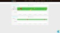
 
 -->

#### How can Harness help verify my applications and services?

Harness' Continuous Verification (CV) approach simplifies verification. First, Harness aggregates monitoring from multiple providers into one dashboard. Second, Harness uses machine learning to identify normal behavior for your applications. This allows Harness to identify and flag anomalies in future deployments, and to perform automatic rollbacks.

See [What Is Continuous Verification (CV)?](../continuous-delivery/continuous-verification/continuous-verification-overview/concepts-cv/what-is-cv.md).

See the following Harness blogs:

 [Can you apply Machine Learning to Continuous Delivery?](http://www.harness.io/blog/how-to-do-continuous-delivery-for-machine-learning-systems)

 [How Harness Eliminates False Positives with Neural Nets](http://www.harness.io/blog/eliminate-false-positives-with-neural-nets)

#### What does Harness do with my APM/Time-Series data?

Harness Continuous Verification uses real-time, semi-supervised machine learning to model and predict your service's behavior. We then apply anomaly-detection techniques to the modeled representation, to predict regressions in behavior or performance.

#### What does Harness do with my log data?

Harness Continuous Verification can consume data from log providers like Sumo Logic and Elastic/ELK.

Using semi-supervised machine learning, Harness analyzes and extracts clusters of log messages, based on textual and contextual similarity. This builds a further signature (model) of your service's current state and future behavior.

Using this learned signature—and using real-time comparisons of the current signature to past versions—Harness then predict service anomalies and regressions, starting at deployment time and extending beyond.

#### Why Perform Continuous Verification?

In traditional application performance monitoring, you either manually watch dashboards, or write rules to define risk. But once you adopt continuous delivery, these approaches won't scale.

Rules-based alerting relies on static rules, but with continuous delivery, your application data is highly dynamic. Your environment changes at accelerating velocity; the entropy of your system increases; and things break.

Ideally, then, performance monitoring under continuous delivery should be configuration-free: Users should not need to add rules at all.

This implies a machine learning–based approach. Over time, unsupervised ML models models can analyze data from multiple monitoring providers, and can then predict your system's future behavior, identify anomalies, and respond to those anomalies.

#### How is Harness more dynamic than rules-based learning?

In traditional application performance monitoring, you either manually watch dashboards, or write rules to define risk. But once you adopt continuous delivery, these approaches won't scale.

Rules-based alerting relies on static rules, but with continuous delivery, your application data is highly dynamic. Your environment changes at accelerating velocity; the entropy of your system increases; and things break.

Ideally, performance monitoring under continuous delivery should be configuration-free: Users should not need to add rules at all.

#### Does Harness use Machine Learning (ML)?

Yes. Over time, unsupervised ML models models can analyze data from multiple monitoring providers, and can then predict your system's future behavior, identify anomalies, and respond to those anomalies.

Harness' semi-supervised ML takes this approach a step further. You can tune Harness' learning engine to generate alerts targeted to *your* service and environment. Compared to coarse, basic rules, this provides a much more flexible basis for pausing or rolling back deployments.

Given the requirement for fast failure detection (low mean time to detect, or MTTD), and the vast amount of log data that can be generated by monitoring your services, Harness' semi-supervised ML drastically improves your MTTR (mean time to respond) to failures.

### 24/7 Service Guard

For an overview of Harness' support for platforms, methodologies, and related technologies, see [Supported Platforms and Technologies](../starthere-firstgen/supported-platforms.md).

#### What is Harness 24/7 Service Guard?

Harness 24/7 Service Guard:

* Collects all of your monitoring and verification tools into a single dashboard.
* Applies Harness Continuous Verification unsupervised machine-learning to detect regressions and anomalies across transactions and events.
* Lets you drill down to the individual issue and open it in the related tool.

Harness 24/7 Service Guard gives DevOps operational visibility across all your monitoring tools in all your production environments.

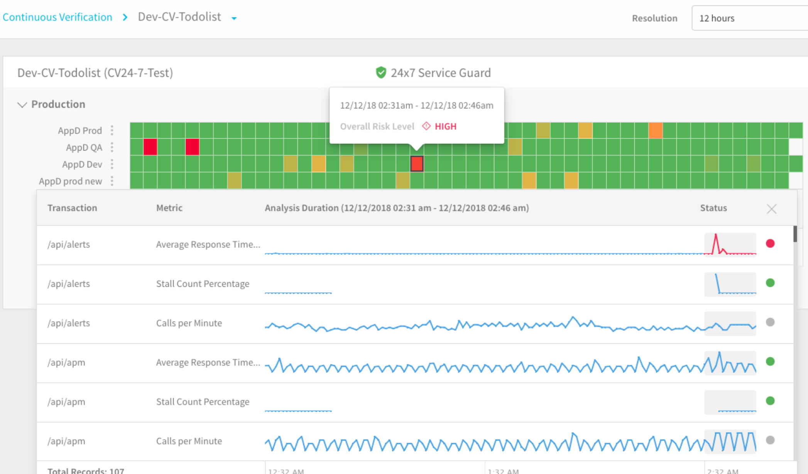

See [24/7 Service Guard Overview](../continuous-delivery/continuous-verification/continuous-verification-overview/concepts-cv/24-7-service-guard-overview.md).

For an introduction to 24/7 Service Guard's uses cases and design, see the Harness Blog post, [Harness 24/7 Service Guard Empowers Developers with Total Operational Control](http://www.harness.io/blog/harness-24-7-service-guard).

#### Does 24/7 Service Guard show deployment verifications?

Yes. The following image shows how the Continuous Verification dashboard includes both 24/7 Service Guard and Harness Deployments verification.

[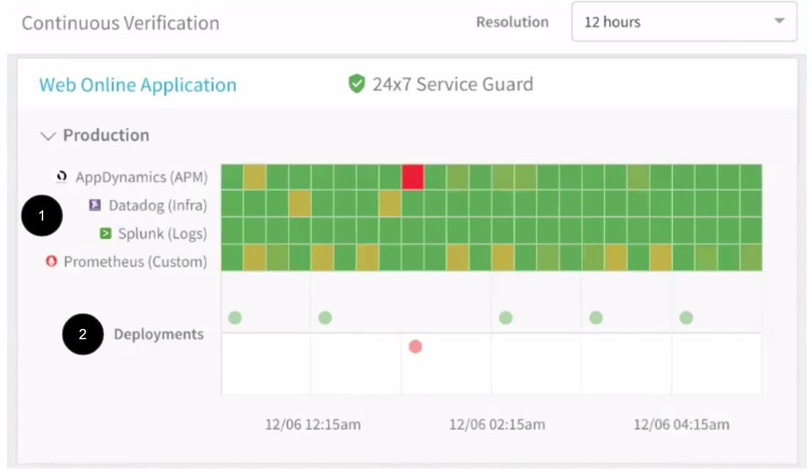](./static/continuous-verification-faqs-26.png)

1. 24/7 Service Guard detection.

2. Harness Deployments verification.

For 24/7 Service Guard, the queries you define to collect logs are specific to the application or service you want monitored. Verification is at the application/service level. This is unlike Workflows, where verification is performed at the host/node/pod level.

#### What Machine Learning does 24/7 Service Guard do?

24/7 Service Guard applies:

* Predictive machine learning models for short-term behavior:
	+ Applies deep neural nets to short-term history.
	+ Detects unusual patterns due to spikes.
	+ Adapts to drift over deployments.
* Applies memory models for long term behavior:
	+ Learns historical/cyclical trends.
	+ Quantifies app reliability over Web and business transactions, based on the history of anomalous behavior.
	+ Quantifies the importance of different Web and business transactions, based on app usage over short- and long-term periods.

#### What can I see in the 24/7 Service Guard dashboard?

The following image describes the 24/7 Service Guard dashboard for the application.

[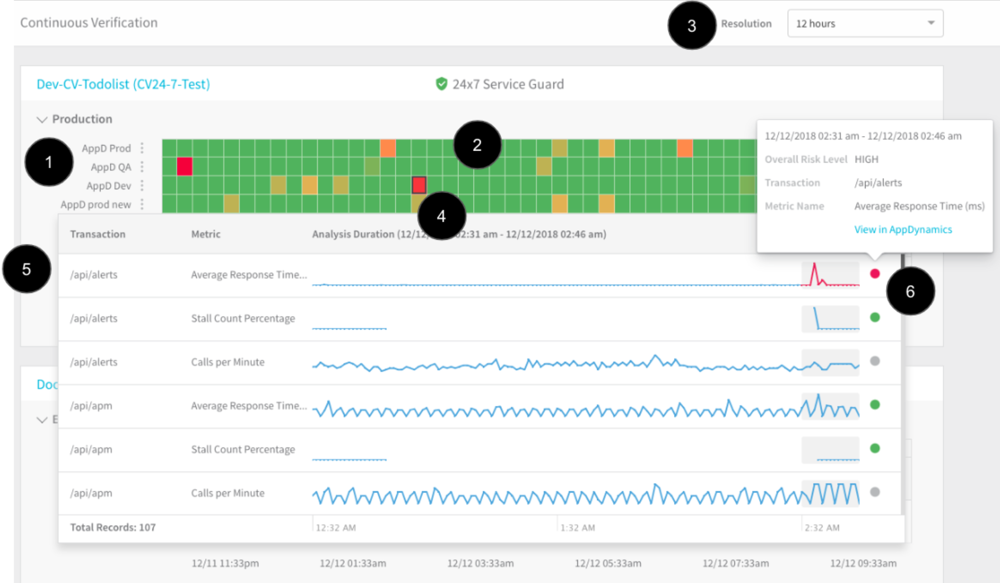](./static/continuous-verification-faqs-28.png)

1. **Monitoring sources:** Verification and metrics providers, such as AppDynamics, etc. For a list of the verification providers supported by Harness, see [Continuous Verification](../continuous-delivery/continuous-verification/continuous-verification-overview/concepts-cv/what-is-cv.md).
2. **Heat map:** The heat map is generated using the application and the monitoring sources. Each square is a time segment.
3. **Time resolution:** You can go high-level (for example, 30 days) or low-level (12 hours).
4. **Performance regressions:** Red and yellow are used to highlight regressions and anomalies. The colors indicate the Overall Risk Level for the monitoring segment.
5. **Transactions analysis:** Click a square to see the machine-learning details for the monitoring segment. The analysis details show the transactions for the monitoring segment. High-risk transactions are listed first.
6. **Drill-in to find the cause of the regression or anomaly:** When you click the dot for a transaction, you get further details and you can click a link to open the transaction in the monitoring tool. This allows you to go into the monitoring tool and find the root cause of the regression (specific queries, events, etc).

### Verifying Deployments

For an overview of Harness' support for platforms, methodologies, and related technologies, see [Supported Platforms and Technologies](../starthere-firstgen/supported-platforms.md).

#### When Does Harness Verify Deployments?

At deployment time, Harness' **Deployment Verification** feature validates your artifacts, and then validates the individual service instances to which you've deployed.

[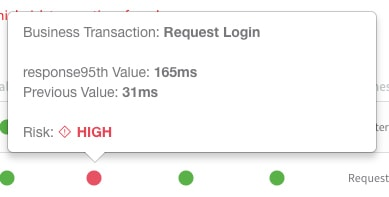](./static/continuous-verification-faqs-30.png)

Deployment Verification verifies the first 15 minutes of deployments. Deployment verification is set up using a Harness Workflow.

For an excellent example of Deployment Verification, see the Harness Blog post, [How Build.com Rolls Back Production in 32 Seconds](https://harness.io/customers/case-studies/automated-ci-cd-rollback/).

See [When Does Harness Verify Deployments?](../continuous-delivery/continuous-verification/continuous-verification-overview/concepts-cv/when-verify.md).

#### How Does Harness Perform Continuous Verification?

Harness Continuous Verification can consume and analyze performance metrics and/or log data from your choice of providers. This topic covers your choice of analysis strategies: Previous Analysis and Canary Analysis.

Each strategy has a different combination of load (datasets) and granularity:

|  |  |  |
| --- | --- | --- |
| **Analysis Strategy** | **Load** | **Granularity** |
| Previous | Synthetic | Container level |
| Canary | Real user traffic | Container level |

#### What is Previous Analysis?

In Previous Analysis, Harness compares the metrics received for the nodes deployed in each Workflow Phase with metrics received for all the nodes during the previous deployment. 

Remember that verification steps are used only after you have deployed successfully at least once: In order to verify deployments and find anomalies, Harness needs data from previous deployments.

For example, if Phase 1 deploys app version 1.2 to node A, the metrics received from the APM during this deployment are compared to the metrics for nodes A, B, and C (all the nodes) during the previous deployment (version 1.1). Previous Analysis is best used when you have predictable load, such as in a QA environment.

#### Can I change the baseline for Previous Analysis?

Yes. By default in a Previous Analysis strategy, Harness uses the Continuous Verification data of the last successful Workflow execution **with data** as the baseline for the current analysis. This is an automatic setting, but you can select a specific deployment as a new baseline.

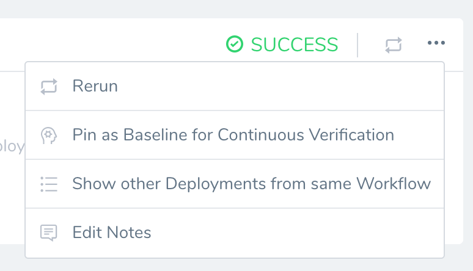

#### What is Canary Analysis?

For Canary Analysis, Harness compares the metrics received for all old app version nodes with the metrics for the new app version nodes. The nodes deployed in each Workflow Phase are compared with metrics received for all of the existing nodes hosting the application.

In the following example, a Prometheus verification step is using Canary Analysis to compare a new node with two previous nodes:

[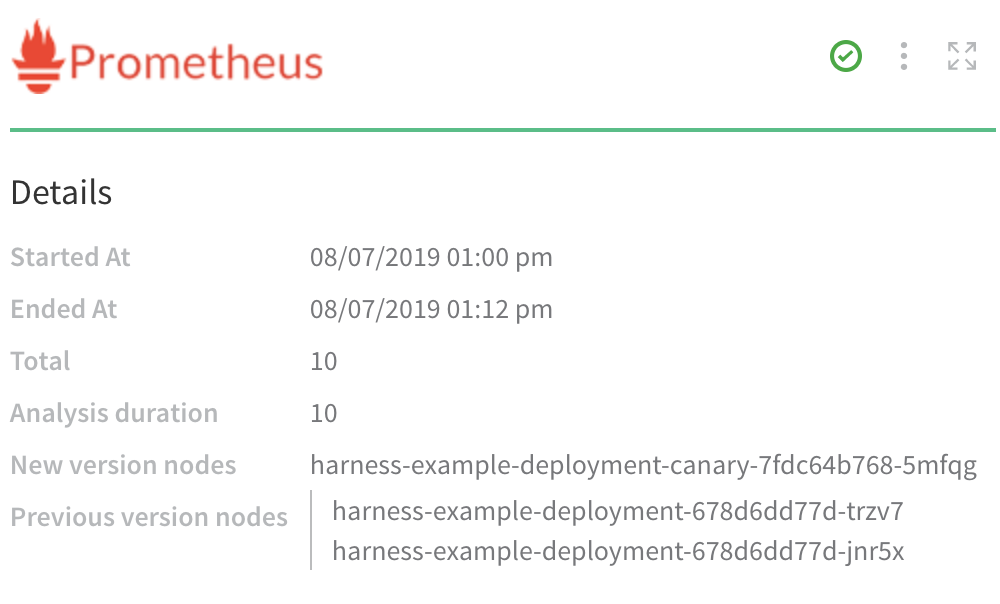](./static/continuous-verification-faqs-33.png)For example, if Phase 1 deploys to 25% of your nodes, the metrics received for the new app versions on these nodes are compared with metrics received for the old app versions on these nodes.

The metrics are taken for the period of time defined in **Analysis Time duration**.

#### What is Analysis Time Duration?

This is the number of data points Harness uses. If you enter 10 minutes, Harness will take the first 10 minutes worth of the log/APM data points and analyze it.

The length of time it takes Harness to analyze the 10 min of data points depends on the number of instances being analyzed and the monitoring tool. If you have a 1000 instances, it can take some time to analyze the first 10 minutes of all of their logs/APM data points.

The recommended Analysis Time Duration is 10 minutes for logging providers and 15 minutes for APM and infrastructure providers.

Harness waits 2-3 minutes to allow enough time for the data to be sent to the verification provider before it analyzes the data. This wait time is a standard with monitoring tools. So, if you set the **Analysis Time Duration** to 10 minutes, it includes the initial 2-3 minute wait, and so the total sample time is 13 minutes.

See [CV Strategies, Tuning, and Best Practices](../continuous-delivery/continuous-verification/continuous-verification-overview/concepts-cv/cv-strategies-and-best-practices.md).

#### Which providers support each analysis strategy?

The following table lists which analysis strategies are supported for each Verification Provider.

|  |  |  |
| --- | --- | --- |
| **Provider** | **Previous** | **Canary** |
| AppDynamics | Yes | Yes |
| NewRelic | Yes | Yes |
| DynaTrace | Yes | Yes |
| Prometheus | Yes | Yes |
| SplunkV2 | Yes | Yes |
| ELK | Yes | Yes |
| Sumo | Yes | Yes |
| Datadog Metrics | Yes | Yes |
| Datadog Logs | Yes | Yes |
| CloudWatch | Yes | Yes |
| Custom Metric Verification | Yes | Yes |
| Custom Log Verification | Yes | Yes |
| BugSnag | Yes | No |
| Stackdriver Metrics | Yes | Yes |
| Stackdriver Logs | Yes | Yes |

#### What Harness deployment strategy supports each analysis strategy?

The following table lists which analysis strategies are supported in each deployment type.

|  |  |
| --- | --- |
| **Deployment Type** | **Analysis Supported** |
| Basic | Previous |
| Canary | Canary |
| BlueGreen | Previous, |
| Rolling | Previous |
| Multi-service | No |
| Build  | No |
| Custom | No |

#### Are there verification Best Practices?

Yes. When picking an analysis strategy, there are several factors to consider, such as the type of deployment, in which Phase of the Workflow to add verification, and whether the number of instances/nodes/etc are consistent between deployments.  

See [Verification Best Practices](../continuous-delivery/continuous-verification/continuous-verification-overview/concepts-cv/cv-strategies-and-best-practices.md#verification-best-practices).

### Verification Results

For an overview of Harness' support for platforms, methodologies, and related technologies, see [Supported Platforms and Technologies](../starthere-firstgen/supported-platforms.md).

#### What are some of the verification results?

The following diagrams call out some of the main analysis elements.

Here is an example of the badges and summaries provided in the header.

[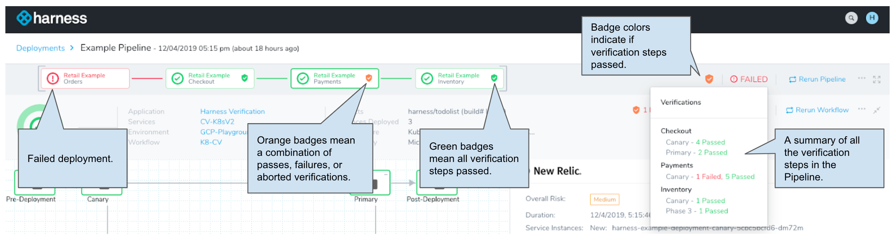](./static/continuous-verification-faqs-35.png) 

Here is an example showing a few of the elements for log analysis.

[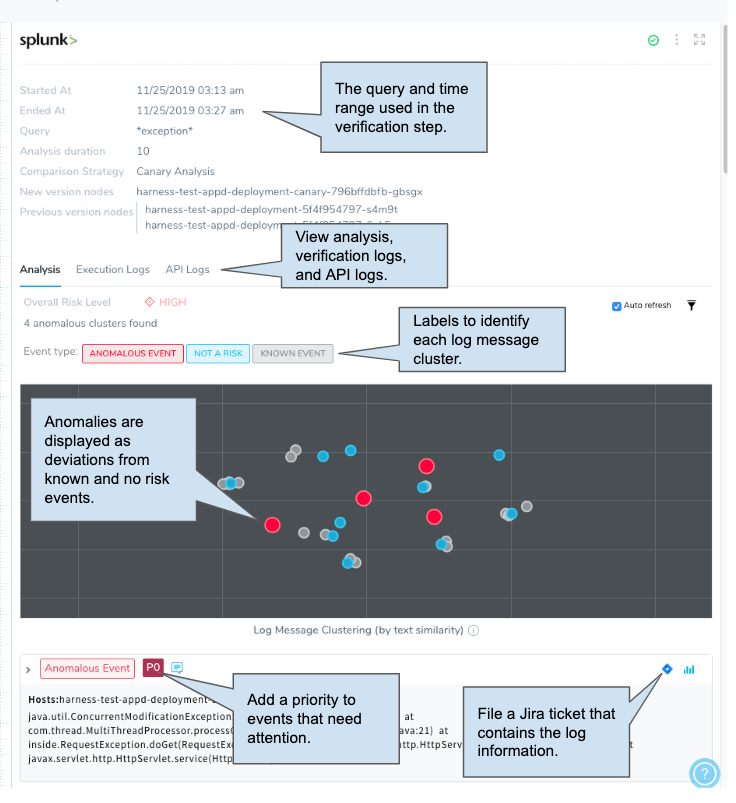](./static/continuous-verification-faqs-37.png)

Here is an example showing a few of the elements for metric analysis:

[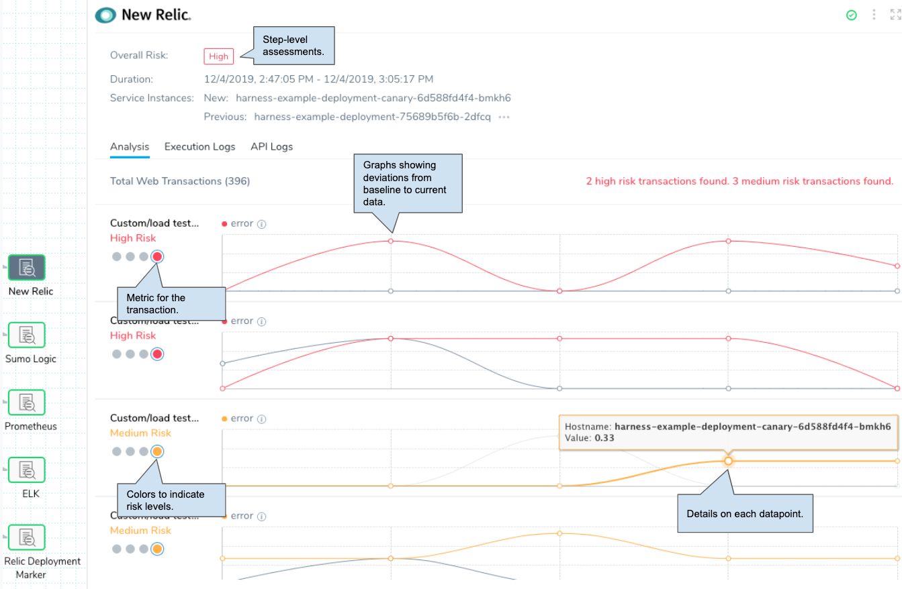](./static/continuous-verification-faqs-39.png)

The following sections describe the different verification elements in more detail.

See [Verification Results Overview](../continuous-delivery/continuous-verification/continuous-verification-overview/concepts-cv/deployment-verification-results.md).

### Tuning Verification Feedback

For an overview of Harness' support for platforms, methodologies, and related technologies, see [Supported Platforms and Technologies](../starthere-firstgen/supported-platforms.md).

#### Can I tune the verification results to improve analysis?

Of course. For each of the verification events, you can perform various operations to improve analysis and reactions to events.

#### How do I tune feedback?

You can refine the verification analysis Harness performs on your application's logging data by providing feedback that clarifies verification events. For example, Harness might flag an event as a **Not a Risk** event, but you might like to increase the priority to a **P1**.

[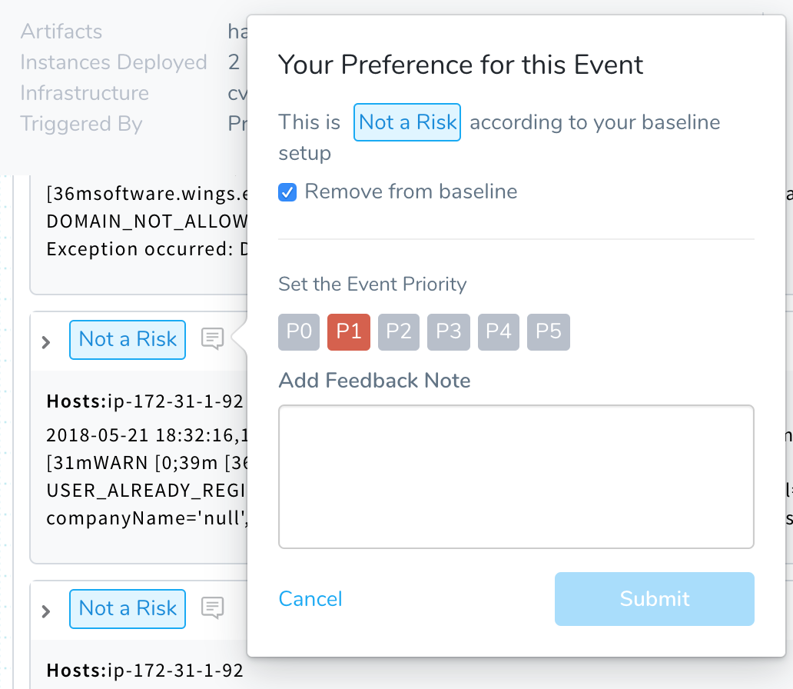](./static/continuous-verification-faqs-41.png)You can update the priority level for an event in a Workflow deployment or in 24/7 Service Guard, and it is applied to events for the Service. It is not specific to that Workflow. 

See:

* [Harness Verification Feedback Overview](../continuous-delivery/continuous-verification/continuous-verification-overview/concepts-cv/harness-verification-feedback-overview.md)
* [Refine 24/7 Service Guard Verification Analysis](../continuous-delivery/continuous-verification/tuning-tracking-verification/refine-24-7-service-guard-verification-analysis.md)
* [Refine Deployment Verification Analysis](../continuous-delivery/continuous-verification/tuning-tracking-verification/refine-deployment-verification-analysis.md)

#### Can I tune thresholds?

In your deployment verification results, you can customize the threshold of each metric/transaction for a Harness Service in a Workflow.

[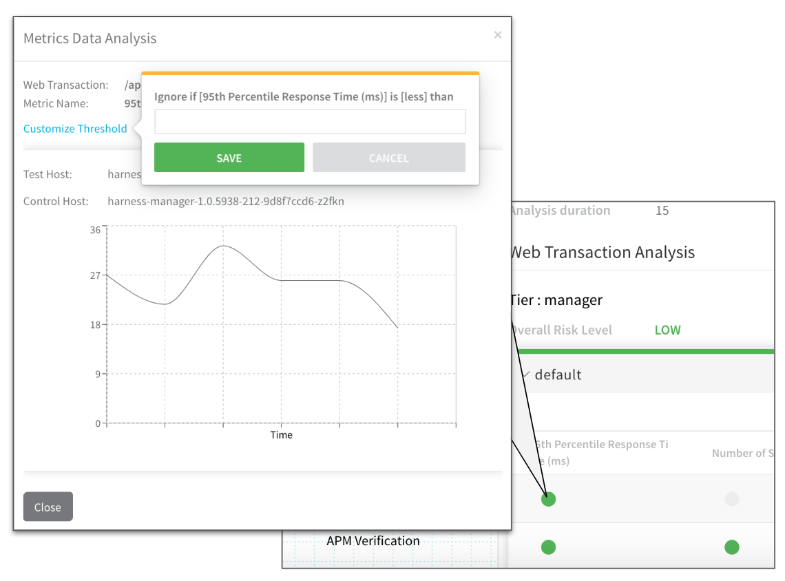](./static/continuous-verification-faqs-43.png)You can tune each specific metric for each Harness Service to eliminate noise. 

The example above helps you refine the response time. This means if the response time is less than the value entered in **Ignore if [95th Percentile Response Time (ms)] is [less]** then Harness will not mark it as a failure even if it is an anomaly.

Let's say the response time was around 10ms and it went to 20ms. Harness' machine-learning engine will flag it as an anomaly because it jumped 100%. If you add a threshold configured to ignore a response time is less than 100ms, then Harness will not flag it.

You can adjust the threshold for any metric analysis. The following example shows how you can adjust the min and max of host memory comparisons.

[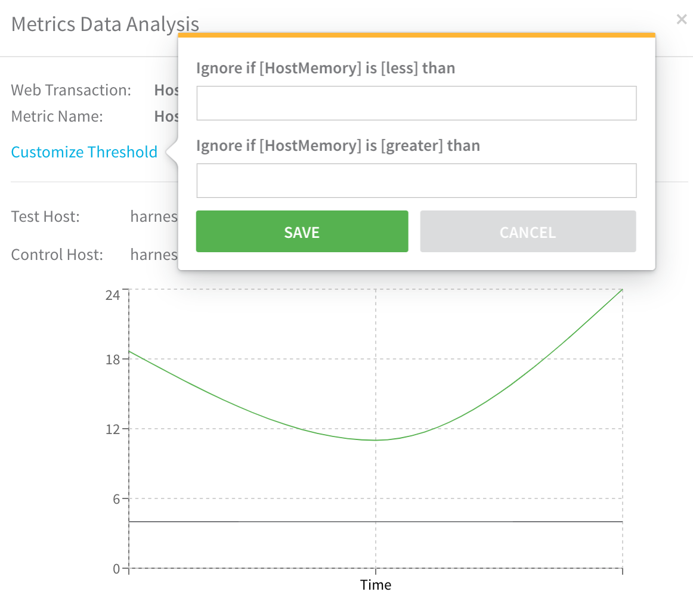](./static/continuous-verification-faqs-45.png)

#### Can I apply custom thresholds?

Yes. You can use custom thresholds to define two types of rules that override normal verification behavior:

* **Ignore Hints** that instruct Harness to skip certain metrics/value combinations from verification analysis.
* **Fast-Fail Hints** that cause a Workflow to enter a failed state.

Here are the **Criteria** and **Value** options available for the metric you've selected:

|  |  |
| --- | --- |
| **Criteria** | **Value** |
| Absolute Value | Enter a literal value of the selected metric. In Ignore Hints, observed values **Less than** this threshold will be skipped from verification analysis. In Fast-Fail Hints, use the **Range Selector** drop-down to select whether observed values **Less than** or **Greater than** your threshold **Value** will move the Workflow to a failed state. |
| Percentage Deviation | Enter a threshold percentage at which to either skip the metric from analysis (Ignore Hints), or fail the Workflow (Fast-Fail Hints). Units here are percentages, so entering `3` will set the threshold at a 3% anomaly from the norm. |
| Deviation | This also sets a threshold deviation from the norm. But here, the units are not percentages, but literal values of the selected metric. |

See [Apply Custom Thresholds to Deployment Verification](../continuous-delivery/continuous-verification/tuning-tracking-verification/custom-thresholds.md).

#### Can I see the API calls performed during verification?

You can view each API call and response between Harness and a verification provider by selecting **View 3rd Party API Calls** in the deployment's verification details.

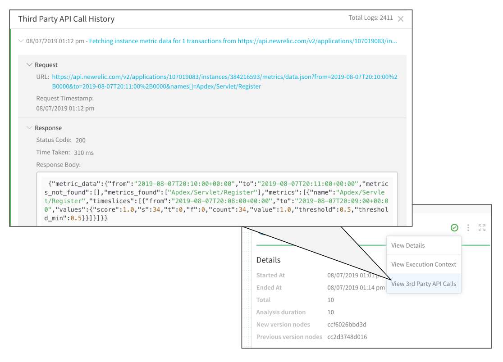

#### Can I review event distribution?

You can view the event distribution for each event by clicking the graph icon:

[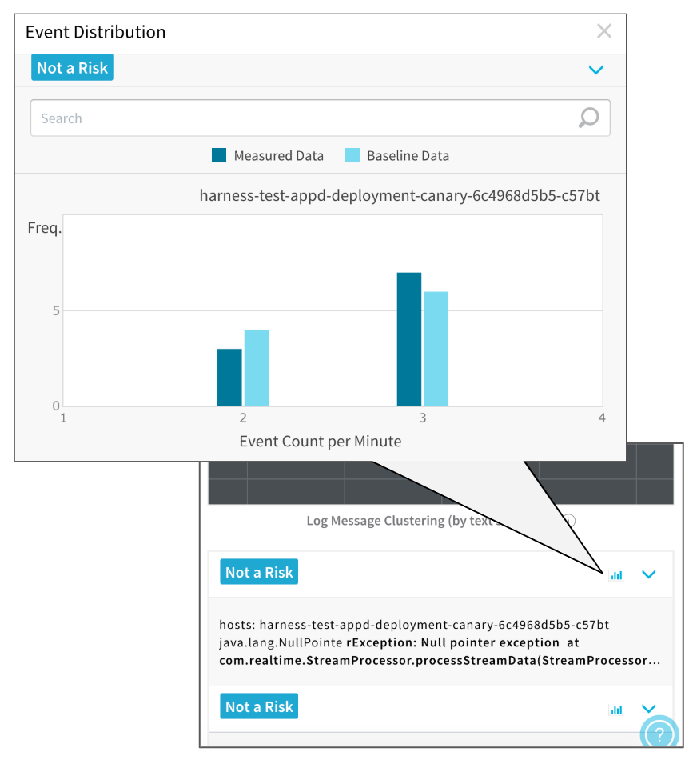](./static/continuous-verification-faqs-48.png)The Event Distribution will show you the measured and baseline data, allowing you to see why the comparison resulted in an anomaly. 

#### Can I file tickets on verification events?

Yes. You can create a Jira ticket from a Harness Verification event, either in a deployment or in 24/7 Service Guard.

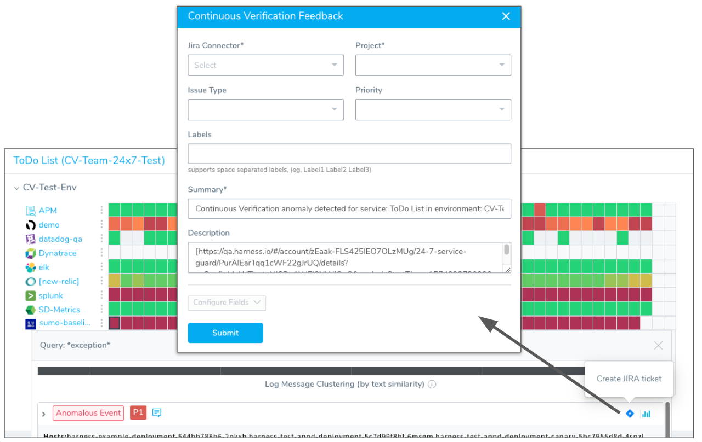See [File Jira Tickets on Verification Events](../continuous-delivery/continuous-verification/tuning-tracking-verification/jira-cv-ticket.md).

### Continuous Verification Metric Types

For an overview of Harness' support for platforms, methodologies, and related technologies, see [Supported Platforms and Technologies](../starthere-firstgen/supported-platforms.md).

#### How do you identify anomalies?

When you select a metric, the previously deployed host data or baseline is used as a yardstick for identifying the anomalies during this verification.

While any change can be flagged as an anomaly, the learning engine takes into account the significance of the change and the ratio associated with the existing pattern. 

All the metrics that lie within the default threshold values will be excluded from the analysis and will always result in low risk.

See [Continuous Verification Metric Types](../continuous-delivery/continuous-verification/continuous-verification-overview/concepts-cv/continuous-verification-metric-types.md).

See also:

* [Default Delta](../continuous-delivery/continuous-verification/continuous-verification-overview/concepts-cv/continuous-verification-metric-types.md#default-delta)
* [Default Ratio](../continuous-delivery/continuous-verification/continuous-verification-overview/concepts-cv/continuous-verification-metric-types.md#default-ratio)
* [Error Rate](../continuous-delivery/continuous-verification/continuous-verification-overview/concepts-cv/continuous-verification-metric-types.md#error-rate)
* [Response Time](../continuous-delivery/continuous-verification/continuous-verification-overview/concepts-cv/continuous-verification-metric-types.md#response-time)
* [Throughput](../continuous-delivery/continuous-verification/continuous-verification-overview/concepts-cv/continuous-verification-metric-types.md#throughput)
* [Infra/Infrastructure](../continuous-delivery/continuous-verification/continuous-verification-overview/concepts-cv/continuous-verification-metric-types.md#infra-infrastructure)
* [Apdex](../continuous-delivery/continuous-verification/continuous-verification-overview/concepts-cv/continuous-verification-metric-types.md#apdex)

### AppDynamics Verification

For an overview of Harness' support for platforms, methodologies, and related technologies, see [Supported Platforms and Technologies](../starthere-firstgen/supported-platforms.md).

#### How do you integrate with AppDynamics?

Harness Continuous Verification integrates with AppDynamics to verify your deployments and live production applications using the following Harness features:

* **24/7 Service Guard** - Monitors your live, production applications.
* **Deployment Verification** - Monitors your application deployments, and performs automatic rollback according to your criteria.

|  |  |
| --- | --- |
| **Microservices Environment using AppDynamics** | **Harness Verification and Impact Analysis** |
| 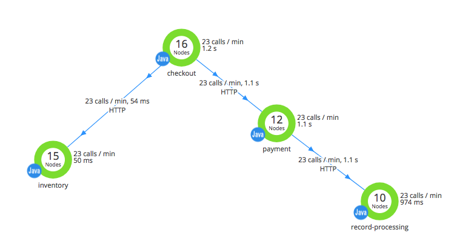 | 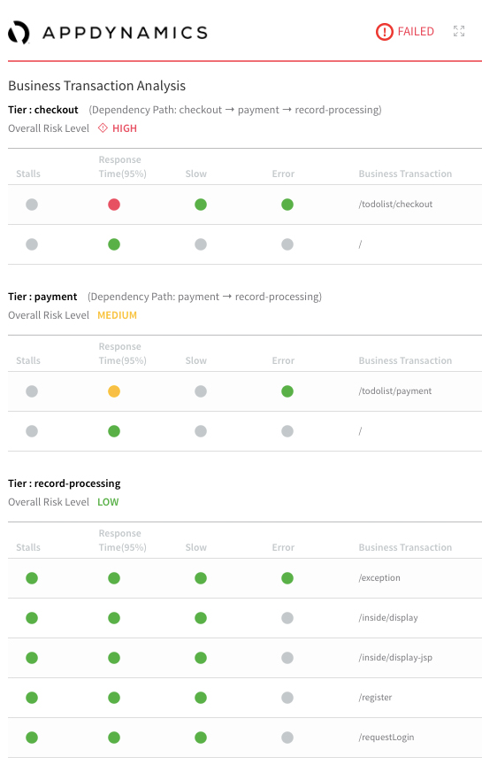 |

AppDynamics announced a new partnership with Harness to help customers embrace continuous delivery and understand the business impact of every application deployment.

See [Introducing Harness Service Impact Verification for AppDynamics](https://harness.io/2018/05/introducing-harness-service-impact-verification-for-appdynamics/).

#### Do you support AppDynamics Lite?

No. Harness does not support [AppDynamics Lite](https://www.appdynamics.com/lite/).

If you set up AppDynamics with Harness using an AppDynamics Pro Trial account and the trial expires, you will be using AppDynamics Lite and it will not work with Harness.

If you require more flexibility than the standard integration outlined here, you also have the option to [AppDynamics as a Custom APM](../continuous-delivery/continuous-verification/custom-metrics-and-logs-verification/connect-to-app-dynamics-as-a-custom-apm.md).

#### Can I reuse my AppDynamics verification setup?

Yes. You can template the setup and supply new settings at deployment runtime.

See [Templatize AppDynamics Verification](../continuous-delivery/continuous-verification/appdynamics-verification/templatize-app-dynamics-verification.md).

#### Can I use Harness to set required Controller environment variables?

Yes. See [Set AppDynamics Environment Variables](../continuous-delivery/continuous-verification/appdynamics-verification/app-dynamics-environment-variables.md).

### Bugsnag Verification

For an overview of Harness' support for platforms, methodologies, and related technologies, see [Supported Platforms and Technologies](../starthere-firstgen/supported-platforms.md).

#### How do you integrate with Bugsnag?

Harness Continuous Verification integrates with Bugsnag to verify your deployments and live production applications using the following Harness features:

* **24/7 Service Guard** - Monitors your live, production applications.
* **Deployment Verification** - Monitors your application deployments, and performs automatic rollback according to your criteria.

|  |  |
| --- | --- |
| **Reporting with Bugsnag** | **Harness Analysis** |
| 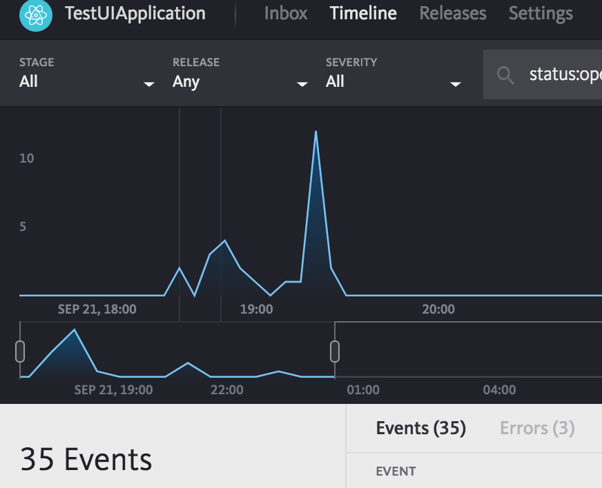 | 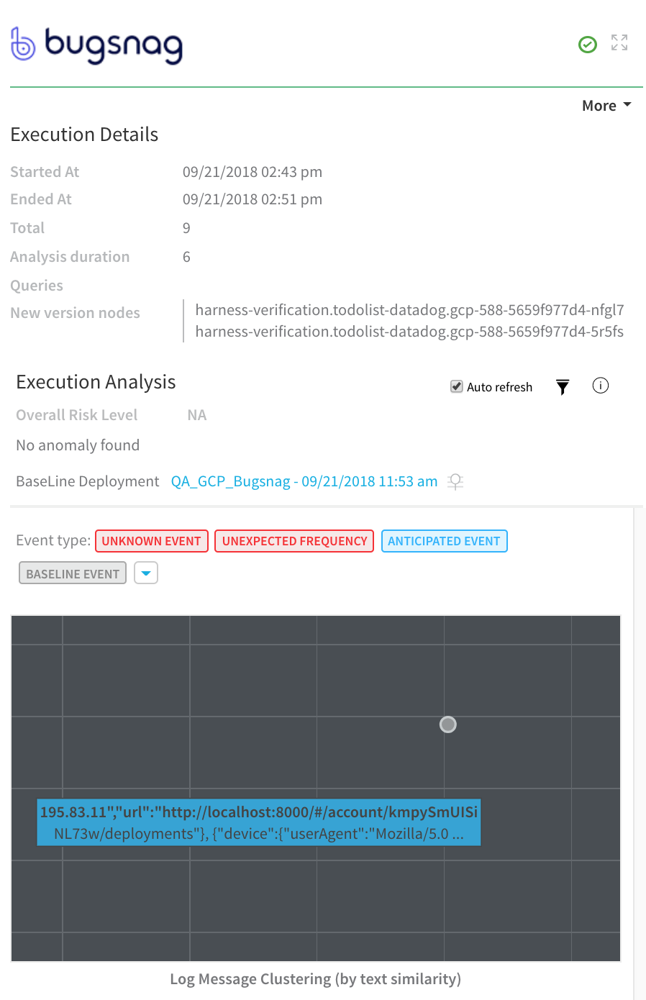 |

See [Bugsnag Verification Overview](../continuous-delivery/continuous-verification/continuous-verification-overview/concepts-cv/bugsnag-verification-overview.md).

#### Can you monitor my browser-based apps with Bugsnag?

Yes. Bugsnag is particularly useful for browser-based apps, as it collects browser information as part of its exception and error capture.

This can helpful in determining if a new version of a browser is causing problems for users. Here is an example from Bugsnag:

Once you have deployed your app via Harness, you can add host/node-focused verification to your Harness workflow using another [Verification Provider](../continuous-delivery/continuous-verification/continuous-verification-overview/concepts-cv/what-is-cv.md), and use Bugsnag to focus on browser-based issues. Here is an example of a Harness verification where other verification tools have been used to verify host/node issues, and Bugsnag is added as the last verification step to capture browser-based issues:

[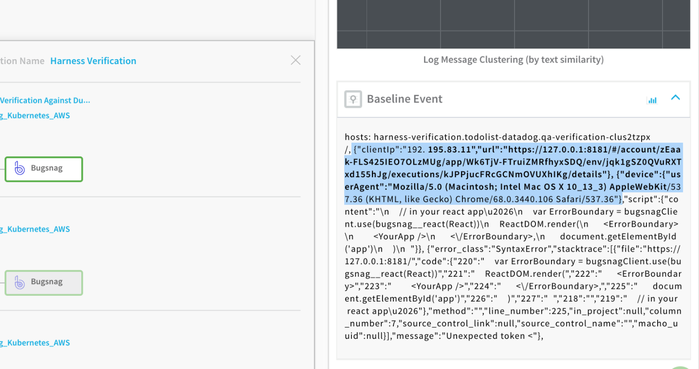](./static/continuous-verification-faqs-53.png)When you set up Bugsnag as a verification step in a Harness workflow, you can indicate if your app is browser-based. When Harness arrives at the Bugsnag verification step, Harness will ignore deployment host or node information and focus on browser-based data. This browser focus enables you to capture browser issues on their own after you have already ensured that the deployment host/node environment is running correctly.

Harness can now use this browser data with the machine-learning in its Continuous Verification and determine what events are causing errors or have to the potential to cause errors in the future.

### CloudWatch Verification

For an overview of Harness' support for platforms, methodologies, and related technologies, see [Supported Platforms and Technologies](../starthere-firstgen/supported-platforms.md).

#### How do you integrate with CloudWatch?

Harness Continuous Verification integrates with CloudWatch to verify your deployments and live production applications using the following Harness features:

* **24/7 Service Guard** - Monitors your live, production applications.
* **Deployment Verification** - Monitors your application deployments, and performs automatic rollback according to your criteria.

This document describes how to set up these Harness Continuous Verification features and monitor your deployments and production applications using its unsupervised machine-learning functionality.

|  |  |
| --- | --- |
| **Monitoring with CloudWatch** | **Harness Analysis** |
| 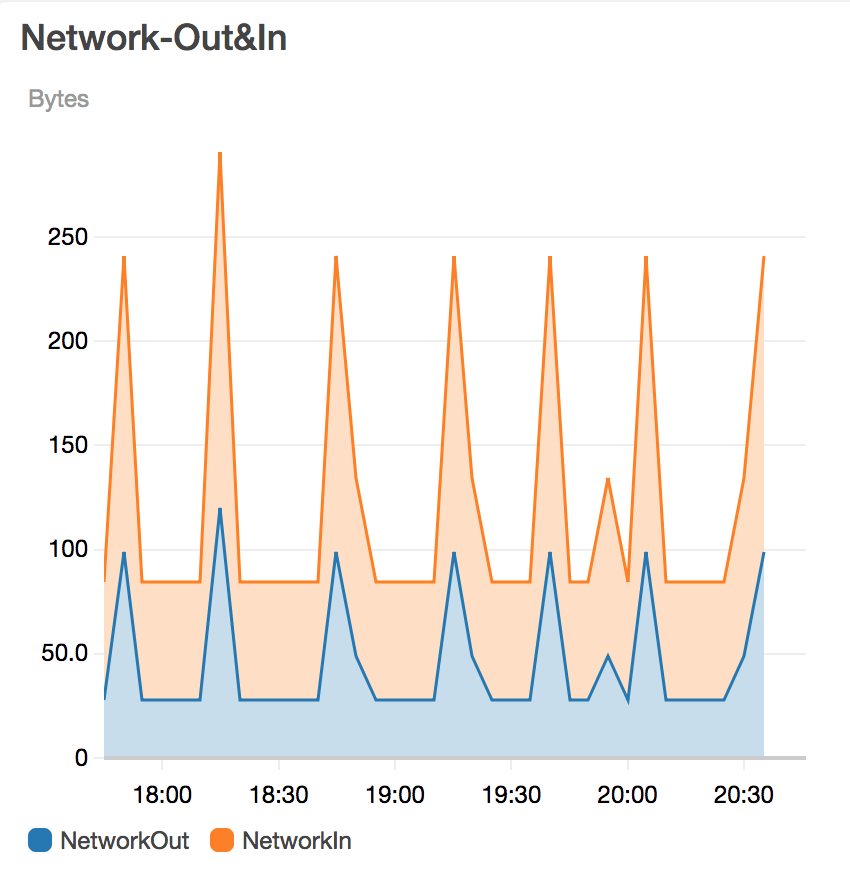 | 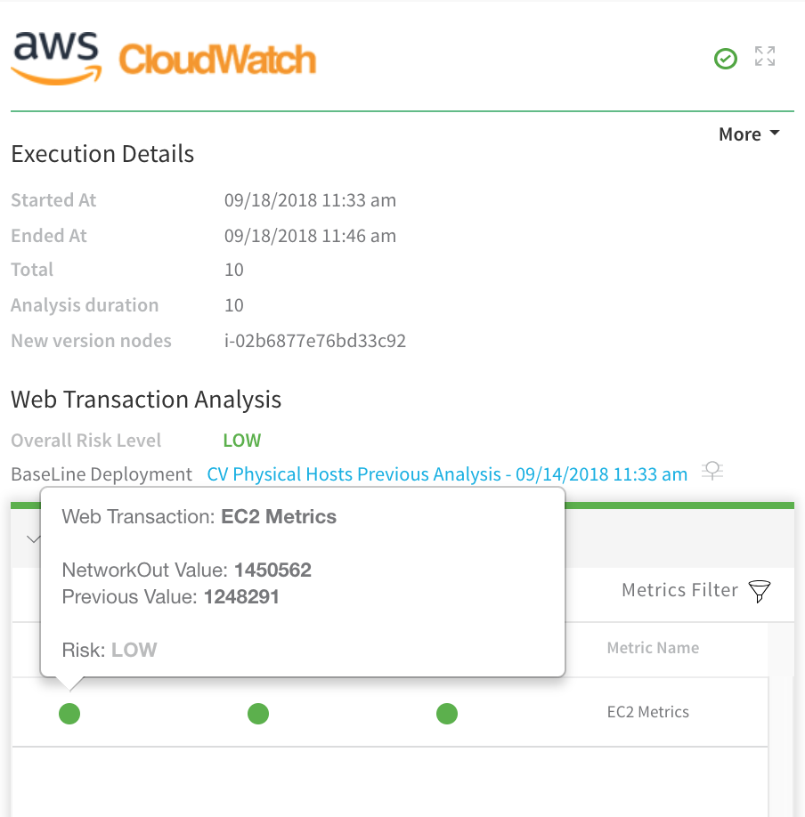 |

See [CloudWatch Verification Overview](../continuous-delivery/continuous-verification/continuous-verification-overview/concepts-cv/cloud-watch-verification-overview.md).

#### What CloudWatch metrics can I use for Verification?

Verification is limited to EC2 instance and ELB-related metrics data.

### Datadog Verification

At this time, Datadog **Deployment Verification** is supported for Harness **Kubernetes** and **ECS Service** deployments only. To add deployment verification in Workflows for other Service types, use [Datadog as a Custom APM](../continuous-delivery/continuous-verification/custom-metrics-and-logs-verification/connect-to-datadog-as-a-custom-apm.md) and your Datadog monitoring. Datadog is fully supported for all Services in **24/7 Service Guard**.For an overview of Harness' support for platforms, methodologies, and related technologies, see [Supported Platforms and Technologies](../starthere-firstgen/supported-platforms.md).

#### How do you integrate with Datadog?

Harness Continuous Verification integrates with Datadog to verify your deployments and live production applications using the following Harness features:

* **24/7 Service Guard** - Monitors your live, production applications.
* **Deployment Verification** - Monitors your application deployments, and performs automatic rollback according to your criteria.

|  |  |
| --- | --- |
| **Analysis with Datadog** | **Harness Analysis** |
| 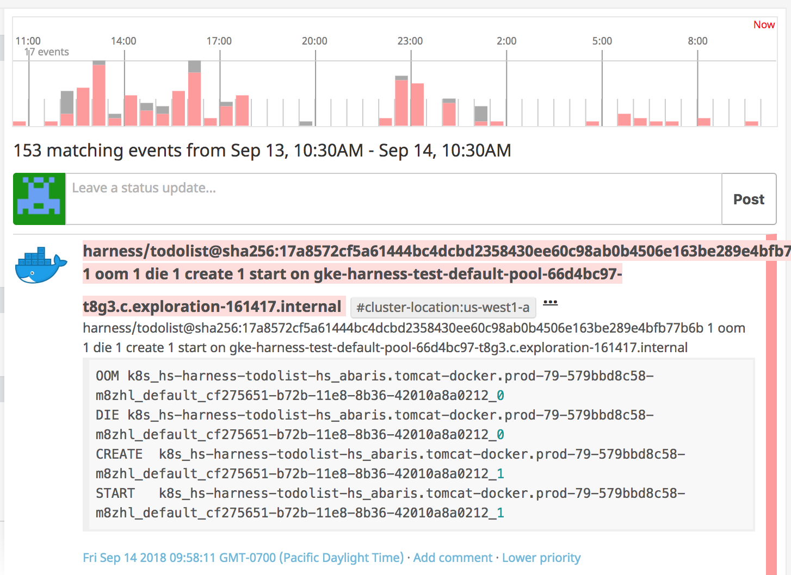 | 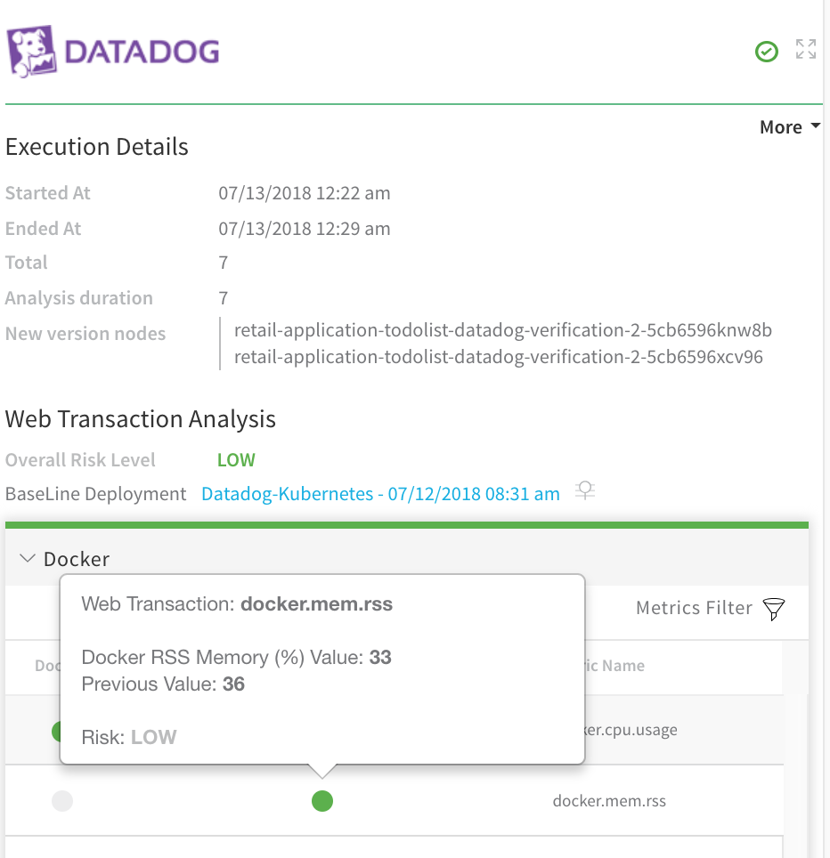 |

See [Datadog Verification Overview](../continuous-delivery/continuous-verification/continuous-verification-overview/concepts-cv/datadog-verification-overview.md) and this overview of Harness' integration with Datadog APM: [Harness Extends Continuous Verification To Datadog](https://harness.io/2018/05/harness-extends-continuous-verification-datadog/).

#### What platforms are supported for Datadog verification?

At this time, Datadog **Deployment Verification** is supported for Harness **Kubernetes** and **ECS Service** deployments only.

To add deployment verification in Workflows for other Service types, use [Datadog as a Custom APM](../continuous-delivery/continuous-verification/custom-metrics-and-logs-verification/connect-to-datadog-as-a-custom-apm.md) and your Datadog monitoring. Datadog is fully supported for all Services in **24/7 Service Guard**.

### Dynatrace Verification

For an overview of Harness' support for platforms, methodologies, and related technologies, see [Supported Platforms and Technologies](../starthere-firstgen/supported-platforms.md).

#### How do you integrate with Dynatrace?

With its Dynatrace integration, Harness can deploy and verify the performance of artifacts instantly in every environment. When a new artifact is deployed, Harness automatically connects to Dynatrace and starts analyzing the application/service performance data to understand the real business impact of each deployment.

Harness applies unsupervised machine learning (Hidden Markov models and Symbolic Aggregate Representation) to understand whether performance deviated for key business transactions and flags performance regressions accordingly.

|  |  |
| --- | --- |
| **Analysis with Dynatrace** | **Harness Analysis** |
|  | 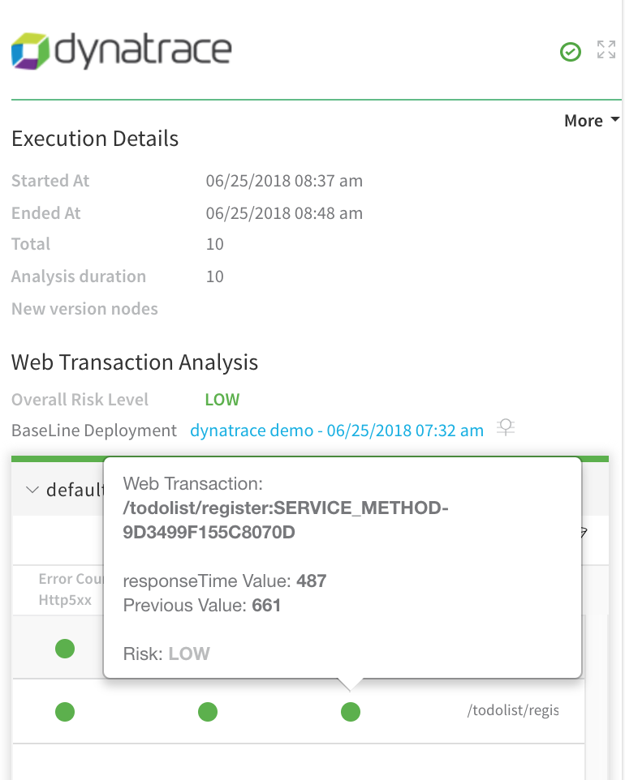 |

See [Dynatrace Verification Overview](../continuous-delivery/continuous-verification/continuous-verification-overview/concepts-cv/dynatrace-verification-overview.md).

#### Is there a Dynatrace Verification use case?

Yes. One of our early customers, Build.com, used to verify production deployments with 5-6 team leads manually analyzing monitoring data and log files.

This process took each team lead 60 minutes, and occurred 3 times a week. That’s 1,080 minutes, or 18 hours, of team lead time spent on verification.

With Harness, Build.com reduced verification time to just 15 minutes, and also enabled automatic rollback to occur in production.

See [Harness Extends Continuous Verification To Dynatrace](https://harness.io/2018/02/harness-extends-continuous-verification-dynatrace/).

### Elasticsearch Verification

For an overview of Harness' support for platforms, methodologies, and related technologies, see [Supported Platforms and Technologies](../starthere-firstgen/supported-platforms.md).

#### How do you integrate with Elasticsearch?

Harness Continuous Verification integrates with ELK to verify your deployments and live production applications using the following Harness features:

* **24/7 Service Guard** - Monitors your live, production applications.
* **Deployment Verification** - Monitors your application deployments, and performs automatic rollback according to your criteria.

|  |  |
| --- | --- |
| **Exceptions with Elasticsearch via Kibana** | **Harness Analysis of Elasticsearch Verification** |
| 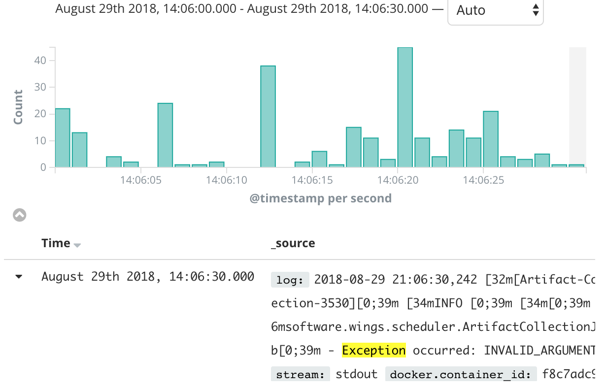 | 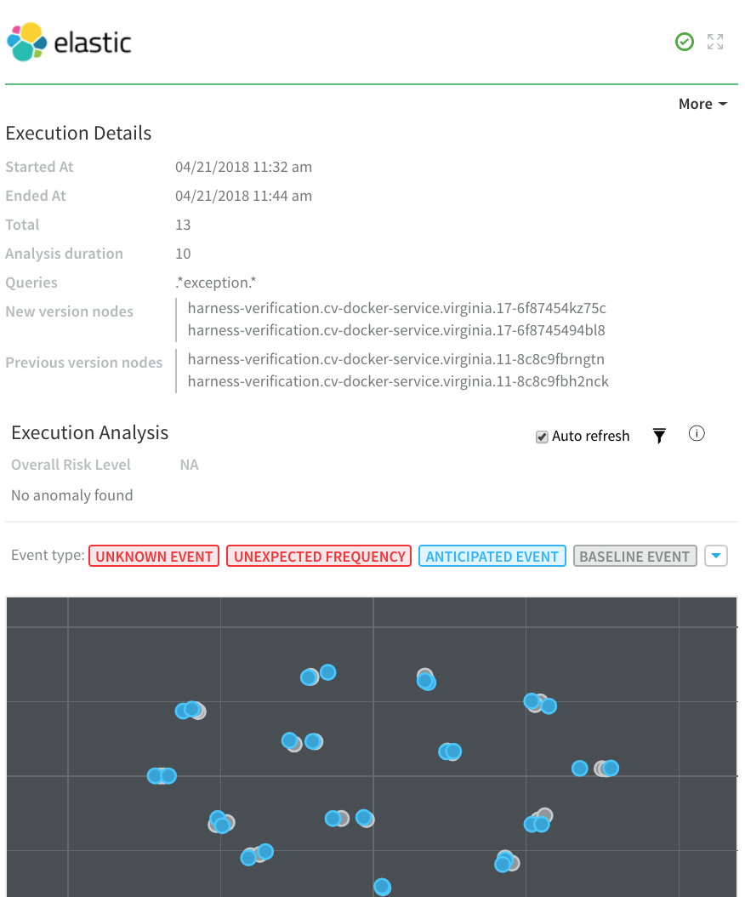 |

See:

* [Connect to Elasticsearch (ELK)](../continuous-delivery/continuous-verification/elk-elasticsearch-verification/1-elasticsearch-connection-setup.md)
* [Monitor Applications 24/7 with Elasticsearch](../continuous-delivery/continuous-verification/elk-elasticsearch-verification/2-24-7-service-guard-for-elasticsearch.md)
* [Verify Deployments with Elasticsearch](../continuous-delivery/continuous-verification/elk-elasticsearch-verification/3-verify-deployments-with-elasticsearch.md)
* [Troubleshoot Verification with Elasticsearch](../continuous-delivery/continuous-verification/elk-elasticsearch-verification/4-troubleshooting-elasticsearch.md)

### Logz.io Verification

For an overview of Harness' support for platforms, methodologies, and related technologies, see [Supported Platforms and Technologies](../starthere-firstgen/supported-platforms.md).

#### How do you integrate with Logz?

Harness can analyze Logz.io data and analysis to verify, rollback, and improve deployments. To apply this analysis to your deployments, you set up Logz.io as a verification step in a Harness Workflow.

See:

* [Connect to Logz.io](../continuous-delivery/continuous-verification/logz-io-verification/logz-verification-provider.md)
* [Verify Deployments with Logz.io](../continuous-delivery/continuous-verification/logz-io-verification/verify-deployments-with-logz-io.md)

#### Can I use Logz Pro or Community?

No. You must have a Logz.io Enterprise account to generate the API tokens required to integrate with Harness. (Logz.io Pro and Community accounts do not support token generation.)

### New Relic Verification

For an overview of Harness' support for platforms, methodologies, and related technologies, see [Supported Platforms and Technologies](../starthere-firstgen/supported-platforms.md).

#### How do you integrate with New Relic?

Harness Continuous Verification integrates with New Relic to verify your deployments and live production applications using the following Harness features:

* **24/7 Service Guard**- Monitors your live, production applications.
* **Deployment Verification**- Monitors your application deployments, and performs automatic rollback according to your criteria.

|  |  |
| --- | --- |
| **Web Transactions in New Relic** | **Web Transactions analyzed in Harness** |
| 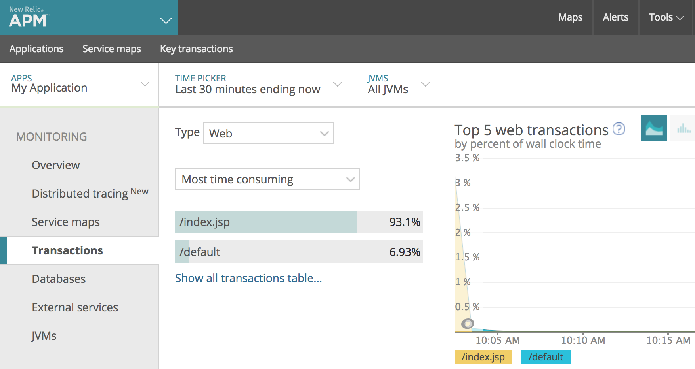 | 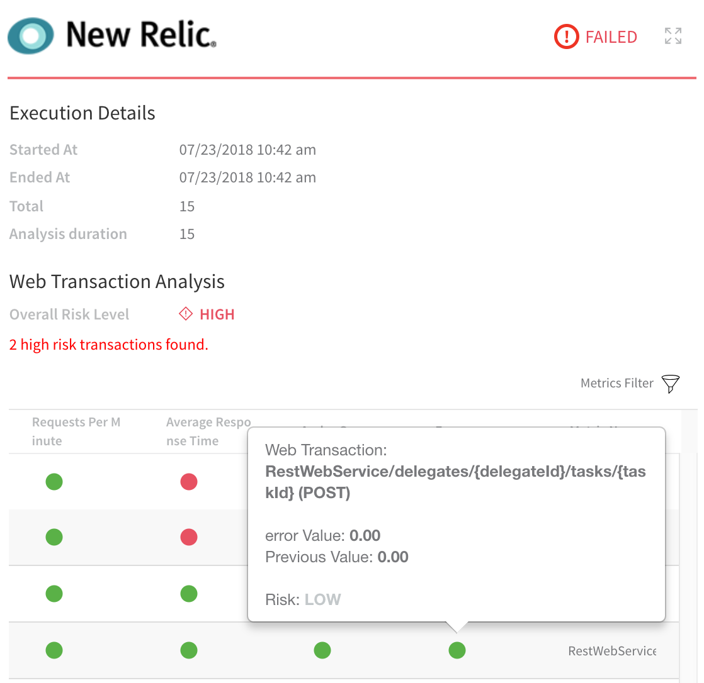 |

See [New Relic Verification Overview](../continuous-delivery/continuous-verification/continuous-verification-overview/concepts-cv/new-relic-verification-overview.md).

See also:

* [Connect to New Relic](../continuous-delivery/continuous-verification/new-relic-verification/1-new-relic-connection-setup.md)
* [Monitor Applications 24/7 with New Relic](../continuous-delivery/continuous-verification/new-relic-verification/2-24-7-service-guard-for-new-relic.md)
* [New Relic Deployment Marker](../continuous-delivery/continuous-verification/new-relic-verification/3-new-relic-deployment-marker.md)
* [Verify Deployments with New Relic](../continuous-delivery/continuous-verification/new-relic-verification/4-verify-deployments-with-new-relic.md)
* [Troubleshoot New Relic](../continuous-delivery/continuous-verification/new-relic-verification/5-troubleshooting-new-relic.md)

#### What type of transactions can I use?

Verification analysis is limited to **Web** **Transactions** only. In **New Relic**, in your application, click **Transactions**, and in **Type**, click **Web.**

#### Can I use a deployment marker?

Yes. You can use the New Relic REST API v2 to record Harness deployments and then view them in the New Relic APM **Deployments** page and in the **Event** log list on the **Overview** page.

See [New Relic Deployment Marker](../continuous-delivery/continuous-verification/new-relic-verification/3-new-relic-deployment-marker.md).

For more information, see [REST API Procedures](https://docs.newrelic.com/docs/apm/new-relic-apm/maintenance/record-deployments#api) from New Relic.

### Prometheus Verification

For an overview of Harness' support for platforms, methodologies, and related technologies, see [Supported Platforms and Technologies](../starthere-firstgen/supported-platforms.md).

#### How do you integrate with Prometheus?

Prometheus integrates with Harness to verify the performance of microservices instantly in every environment.

When you use Prometheus with Harness Service Guard 24/7, or when you deploy a new microservice via Harness, Harness automatically connects to Prometheus and starts analyzing the multi-dimensional data model to understand what exceptions and errors are new or might cause problems for your microservice performance and quality.

Here is an example of a deployment Pipeline Stage verified using Prometheus.

[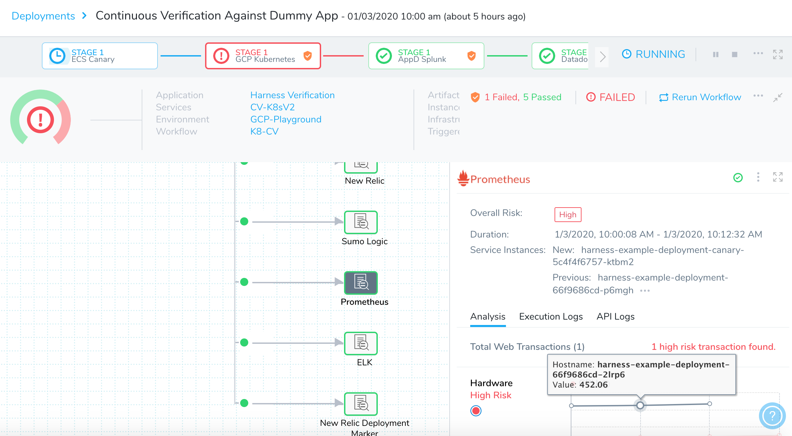](./static/continuous-verification-faqs-55.png)See:

* [Prometheus Verification Overview](../continuous-delivery/continuous-verification/continuous-verification-overview/concepts-cv/prometheus-verification-overview.md)
* [Connect to Prometheus](../continuous-delivery/continuous-verification/prometheus-verification/1-prometheus-connection-setup.md)
* [Monitor Applications 24/7 with Prometheus](../continuous-delivery/continuous-verification/prometheus-verification/2-24-7-service-guard-for-prometheus.md)
* [Verify Deployments with Prometheus](../continuous-delivery/continuous-verification/prometheus-verification/3-verify-deployments-with-prometheus.md)

See this Harness blog: [Automating Deployment Health Checks with Prometheus and Harness Continuous Delivery](http://www.harness.io/blog/verifying-ci-cd-pipelines-prometheus)

### Splunk Verification

For an overview of Harness' support for platforms, methodologies, and related technologies, see [Supported Platforms and Technologies](../starthere-firstgen/supported-platforms.md).

#### How do you integrate with Splunk?

Harness Continuous Verification integrates with Splunk to verify your deployments and live production applications using the following Harness features:

* **24/7 Service Guard**- Monitors your live, production applications.
* **Deployment Verification**- Monitors your application deployments, and performs automatic rollback according to your criteria.

For example, once you have integrated Splunk with your microservice or app, you can add a Splunk verification step to your Harness workflows and Harness will use Splunk to verify the performance and quality of your deployments and apply Harness machine-learning verification analysis to Splunk data.

|  |  |
| --- | --- |
| **Verification with Splunk Enterprise** | **Harness Analysis** |
| 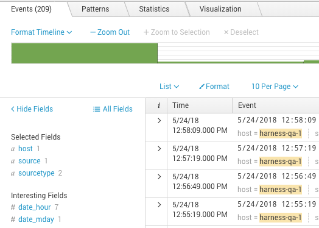 | 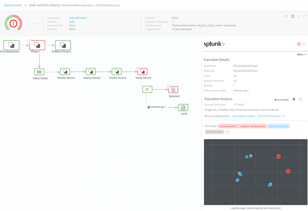 |

See:

* [Splunk Verification Overview](../continuous-delivery/continuous-verification/continuous-verification-overview/concepts-cv/splunk-verification-overview.md)
* [Connect to Splunk](../continuous-delivery/continuous-verification/splunk-verification/1-splunk-connection-setup.md)
* [Monitor Applications 24/7 with Splunk](../continuous-delivery/continuous-verification/splunk-verification/2-24-7-service-guard-for-splunk.md)
* [Verify Deployments with Splunk](../continuous-delivery/continuous-verification/splunk-verification/3-verify-deployments-with-splunk.md)

### Google Operations (formerly Stackdriver) Verification

For an overview of Harness' support for platforms, methodologies, and related technologies, see [Supported Platforms and Technologies](../starthere-firstgen/supported-platforms.md).

#### How do you integrate with Google Operations?

Harness Continuous Verification integrates with Google Operations to verify your deployments and live production applications using the following Harness features:

* **24/7 Service Guard** – Monitors your live, production applications.
* **Deployment Verification** – Monitors your application deployments, and performs automatic rollback according to your criteria.

|  |  |
| --- | --- |
| **Verification with Stackdriver** | **Harness Analysis** |
| 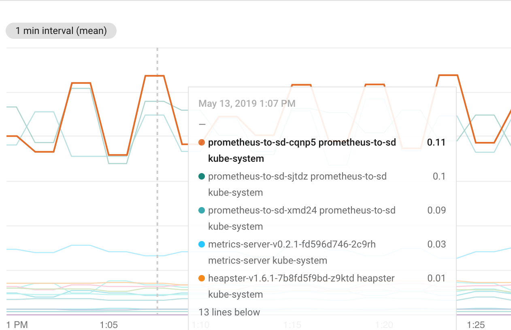 | 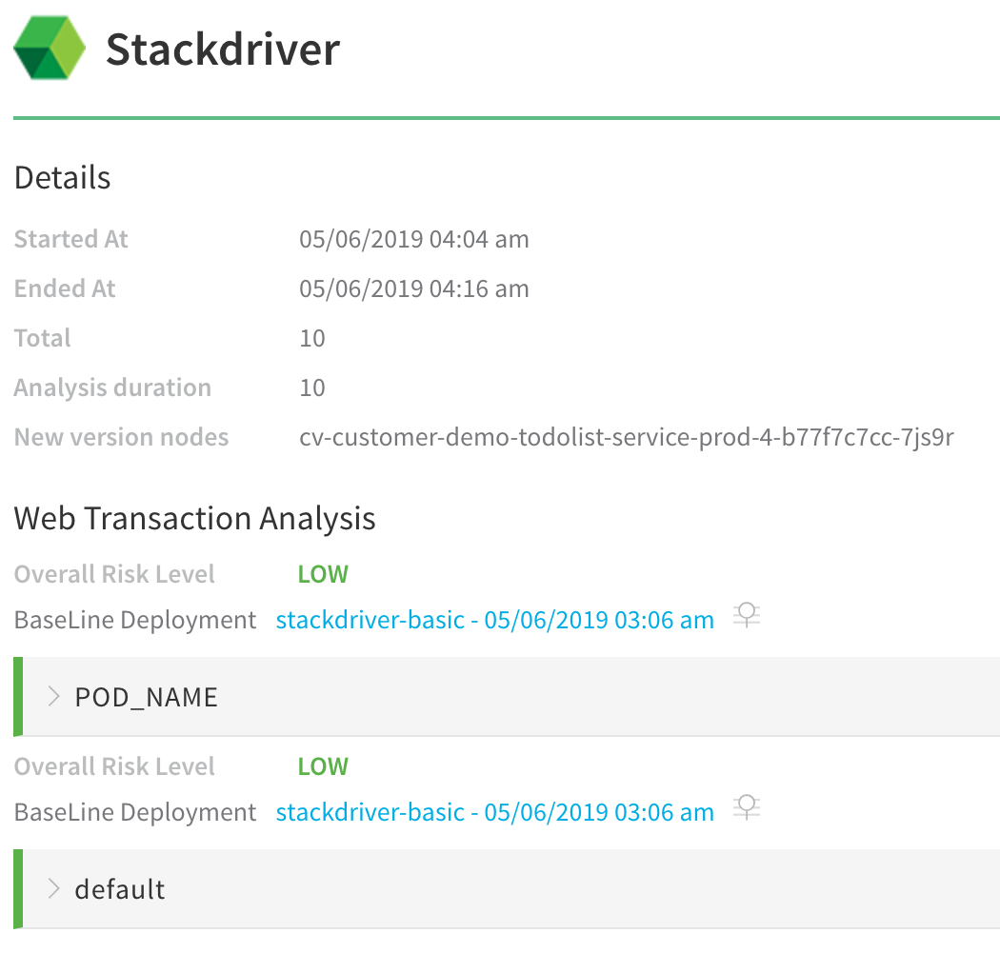 |

See:

* [Google Operations (formerly Stackdriver) Overview](../continuous-delivery/continuous-verification/continuous-verification-overview/concepts-cv/stackdriver-and-harness-overview.md)
* [Connect to Stackdriver](../continuous-delivery/continuous-verification/stackdriver-verification/stackdriver-connection-setup.md)
* [Verify Deployments with Stackdriver Logging](../continuous-delivery/continuous-verification/stackdriver-verification/3-verify-deployments-with-stackdriver.md)
* [Verify Deployments with Stackdriver Metrics](../continuous-delivery/continuous-verification/stackdriver-verification/verify-deployments-with-stackdriver-metrics.md)
* [Monitor Applications 24/7 with Stackdriver Logging](../continuous-delivery/continuous-verification/stackdriver-verification/2-24-7-service-guard-for-stackdriver.md)
* [Monitor Applications 24/7 with Stackdriver Metrics](../continuous-delivery/continuous-verification/stackdriver-verification/monitor-applications-24-7-with-stackdriver-metrics.md)

See this Harness blog: [Harness Introduces StackDriver Support for Automated Canary Deployments and Health Checks](http://www.harness.io/blog/stackdriver-automated-canary-deployments).

### Sumo Logic Verification

For an overview of Harness' support for platforms, methodologies, and related technologies, see [Supported Platforms and Technologies](../starthere-firstgen/supported-platforms.md).

#### How do you integrate with Sumo Logic?

Harness Continuous Verification integrates with Sumo Logic to verify your deployments and live production applications, using the following Harness features:

* **24/7 Service Guard** – Monitors your live, production applications.
* **Deployment Verification** – Monitors your application deployments, and performs automatic rollback according to your criteria.

|  |  |
| --- | --- |
| **Search with Sumo Logic** | **Harness Analysis** |
| 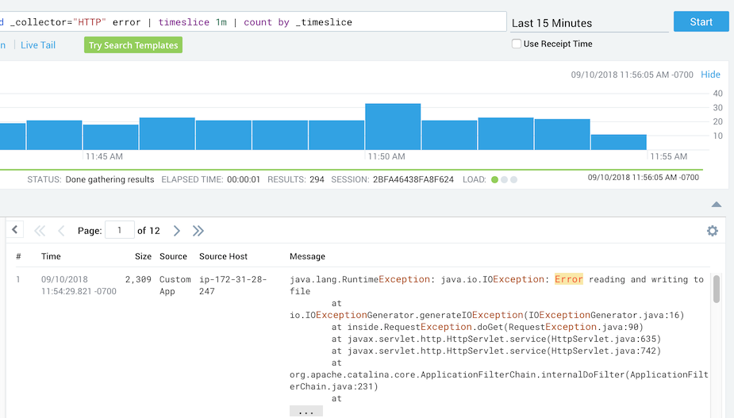 | 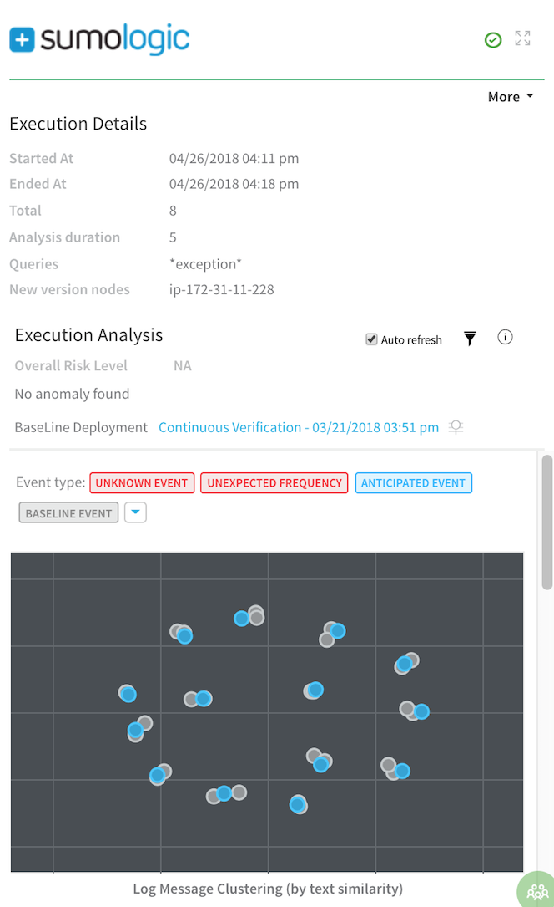 |

See:

* [Sumo Logic Verification Overview](../continuous-delivery/continuous-verification/continuous-verification-overview/concepts-cv/sumo-logic-verification-overview.md)
* [Connect to Sumo Logic](../continuous-delivery/continuous-verification/sumo-logic-verification/1-sumo-logic-connection-setup.md)
* [Monitor Applications 24/7 with Sumo Logic](../continuous-delivery/continuous-verification/sumo-logic-verification/2-24-7-service-guard-for-sumo-logic.md)
* [Verify Deployments with Sumo Logic](../continuous-delivery/continuous-verification/sumo-logic-verification/3-verify-deployments-with-sumo-logic.md)

### Instana Verification

For an overview of Harness' support for platforms, methodologies, and related technologies, see [Supported Platforms and Technologies](../starthere-firstgen/supported-platforms.md).

#### How do you integrate with Instana?

Harness Continuous Verification integrates with Instana to verify your deployments and live production applications using the following Harness features:

* **24/7 Service Guard** - Monitors your live, production applications.
* **Deployment Verification** - Monitors your application deployments, and performs automatic rollback according to your criteria.

|  |  |
| --- | --- |
| **Analysis with Instana** | **Harness Analysis** |
| 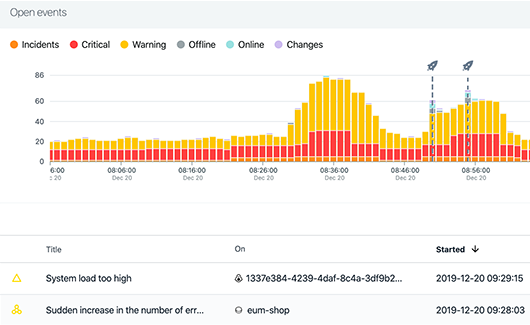 | 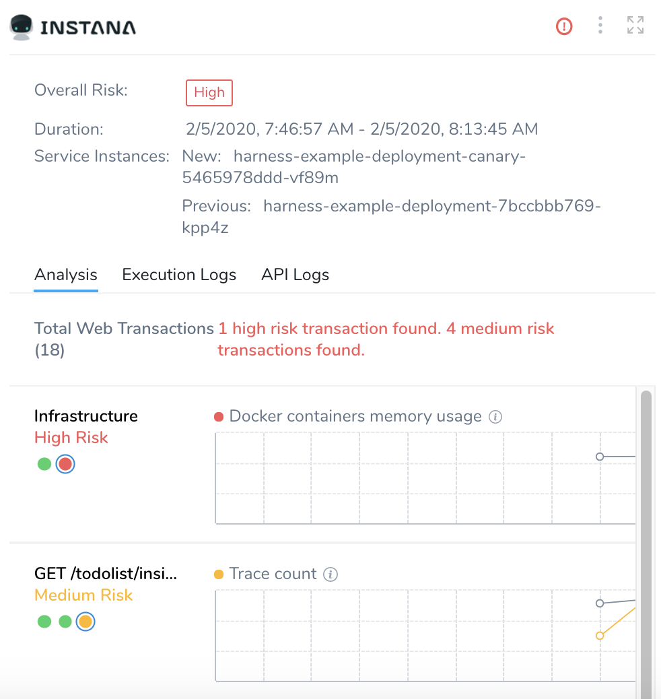 |

See:

* [Instana Verification Overview](../continuous-delivery/continuous-verification/continuous-verification-overview/concepts-cv/instana-verification-overview.md)
* [Instana Connection Setup](../continuous-delivery/continuous-verification/instana-verification/instana-connection-setup.md)
* [24/7 Service Guard for Instana](../continuous-delivery/continuous-verification/instana-verification/instana-service-guard.md)
* [Verify Deployments with Instana](../continuous-delivery/continuous-verification/instana-verification/instana-verify-deployments.md)

### Uncommon Metrics and Logging Providers

For an overview of Harness' support for platforms, methodologies, and related technologies, see [Supported Platforms and Technologies](../starthere-firstgen/supported-platforms.md).

#### How do you integrate with other metrics and logging provider?

Harness includes first-class support for all of the major APM and logging vendors, but there are cases where a custom APM is needed.

You can monitor your deployments using Harness' unsupervised machine-learning functionality and Custom APMs.

See:

* [Custom Verification Overview](../continuous-delivery/continuous-verification/custom-metrics-and-logs-verification/custom-verification-overview.md)
* [Connect to Custom Verification for Custom Metrics](../continuous-delivery/continuous-verification/custom-metrics-and-logs-verification/connect-to-custom-verification-for-custom-metrics.md)
* [Connect to Custom Verification for Custom Logs](../continuous-delivery/continuous-verification/custom-metrics-and-logs-verification/connect-to-custom-verification-for-custom-logs.md)
* [Monitor Applications 24/7 with Custom Metrics](../continuous-delivery/continuous-verification/custom-metrics-and-logs-verification/monitor-applications-24-7-with-custom-metrics.md)
* [Monitor Applications 24/7 with Custom Logs](../continuous-delivery/continuous-verification/custom-metrics-and-logs-verification/monitor-applications-24-7-with-custom-logs.md)
* [Verify Deployments with Custom Metrics](../continuous-delivery/continuous-verification/custom-metrics-and-logs-verification/verify-deployments-with-custom-metrics.md)
* [Verify Deployments with Custom Logs](../continuous-delivery/continuous-verification/custom-metrics-and-logs-verification/verify-deployments-with-custom-logs.md)
* [Connect to Datadog as a Custom APM](../continuous-delivery/continuous-verification/custom-metrics-and-logs-verification/connect-to-datadog-as-a-custom-apm.md)
* [Verify Deployments with Datadog as a Custom APM](../continuous-delivery/continuous-verification/custom-metrics-and-logs-verification/verify-deployments-with-datadog-as-a-custom-apm.md)
* [Connect to AppDynamics as a Custom APM](../continuous-delivery/continuous-verification/custom-metrics-and-logs-verification/connect-to-app-dynamics-as-a-custom-apm.md)
* [Verify Deployments with AppDynamics as a Custom APM](../continuous-delivery/continuous-verification/custom-metrics-and-logs-verification/verify-deployments-with-app-dynamics-as-a-custom-apm.md)

