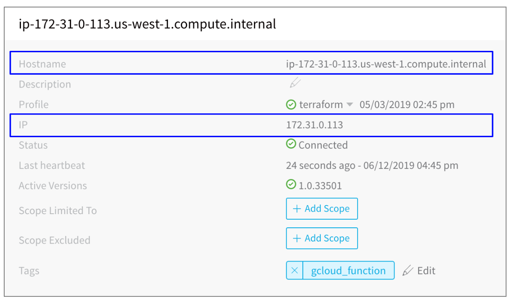
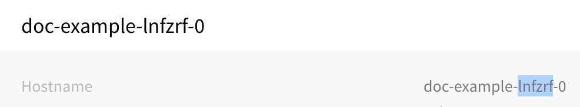
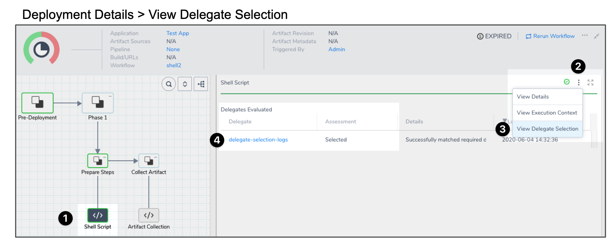
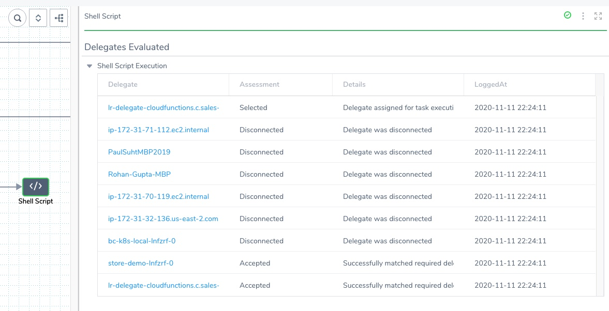
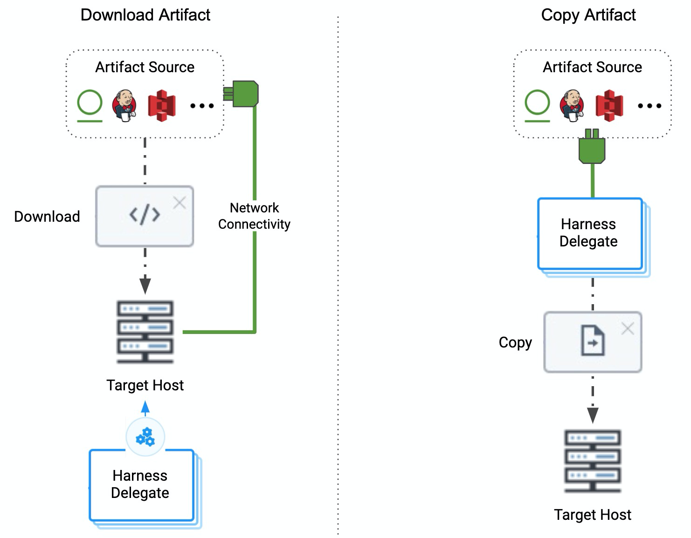

This article addresses some frequently asked questions about Harness Delegates.

### Before You Begin

* [Harness Key Concepts](../starthere-firstgen/harness-key-concepts.md)
* [Supported Platforms and Technologies](../starthere-firstgen/supported-platforms.md)

### General

For an overview of Harness' support for platforms, methodologies, and related technologies, see [Supported Platforms and Technologies](../starthere-firstgen/supported-platforms.md).

#### What is the Harness Delegate?

The Harness Delegate is a service you run in your local network or VPC to connect all of your artifact, infrastructure, collaboration, verification and other providers with the Harness Manager.

The Harness Platform has two components:

* **Harness Manager** - Harness Manager is where your deployment configuration is stored and your pipelines are managed and executed. Harness Manager is available either as SaaS (running in the Harness cloud) or as On-Prem (running in your infrastructure).
* **Harness Delegate** - The Harness Delegate is software you install in your environment that connects to the Harness Manager and performs tasks by connecting to your container orchestration platforms, artifact repositories, monitoring systems, etc.

#### How is the Delegate updated?

The Delegate updates automatically. The Delegate installation also installs a **Watcher** program that checks the Harness cloud periodically for new versions.

Watcher checks regularly with the Harness cloud to see what published Delegate versions should be running. Watcher ensures there is exactly one Delegate process of each published version running.

If there is a published version that is not running, Watcher downloads the jar file for that version securely over HTTPS, installs it, and updates the Delegate connection to the Harness Manager. There is no downtime.

#### How Does Harness Manager Identify Delegates?

All Delegates are identified by your Harness account ID. But, depending on the type of Delegate, there are additional factors.

For Delegates running on virtual machines, such as the Shell Script and Docker Delegates running on an AWS EC2 instance, the Delegate is identified by the combination of **Hostname** and **IP**:

Therefore, if the hostname or IP changes on the VM, the Delegate cannot be identified by the Harness Manager. The IP used is the private IP. The Delegate connects to the Harness Manager, but the Harness Manager does not initiate a connection to the Delegate, and so the public IP address of the Delegate is not needed, typically.

For Kubernetes and ECS Delegates, the IP can change if a pod is rescheduled, for example. Consequently, Kubernetes Delegates are identified by a suffix using a unique six letter code in their **Hostname** (the first six letters that occur in your account ID):

ECS Delegates are identified by the **Hostname** entered when the ECS Delegate Task Spec is downloaded

#### What data does the Delegate send to the Harness Manager?

The Delegate and the Harness Manager (via SaaS) establish a Secure WebSocket channel (WebSocket over TLS) to send new Delegate task event notifications (not the tasks themselves) and exchange connection heartbeats. In the case that the WebSocket connection is dropped, the Harness Delegate falls back to outbound-only, polling-based task fetch.

* **Heartbeat** - The Delegate sends a [heartbeat](https://en.wikipedia.org/wiki/Heartbeat_(computing)) to let the Harness Manager know that it is running.
* **Deployment data** - The information from the API executions the Delegate performs are sent to the Manager for display in the **Deployments** page.
* **Time series and log data for Continuous Verification** - The Delegate connects to the verification providers you have configured and sends their data to the Manager for display in Harness Continuous Verification.

#### Can I whitelist IPs for the Harness Delegate?

Yes. See [Whitelist Harness Domains and IPs](../firstgen-platform/techref-category/account-ref/delegate-ref/whitelist-harness-domains-and-ips.md).

#### Do I need separate Delegates for different isolated environments?

No. Delegates connect to the Harness Manager and are tested for connectivity to resources and tasks.

Harness Cloud Providers and Connectors only use Delegates that can connect to their resources and perform their tasks.

You could even have a Delegate in one cloud platform use a resource in a separate cloud platform so long as there is connectivity.

### Delegate Installation

For an overview of Harness' support for platforms, methodologies, and related technologies, see [Supported Platforms and Technologies](../starthere-firstgen/supported-platforms.md).

#### What types of Delegate are there?

Harness provides different types of Delegates to give you flexibility in how you manage deployments.

In many cases, you will use a Kubernetes Delegate for Kubernetes deployments, and an ECS Delegate for ECS deployments, and so on.

But you are not limited to using a Delegate of the same type as your deployment platform. You can use a Shell Script Delegate running in a VM with a Kubernetes deployment, although that is more complicated to set up initially.

For information on targeting Delegates to different Kubernetes namespaces, see [Target Delegates to Specific Namespaces](../firstgen-platform/account/manage-delegates/enable-delegate-to-deploy-to-multiple-kubernetes-namespaces.md).You can install the following types of Delegates:

* [Install the Harness Kubernetes Delegate](../firstgen-platform/account/manage-delegates/install-kubernetes-delegate.md)
* [Install the Harness Shell Script Delegate](../firstgen-platform/account/manage-delegates/install-shellscript-delegate.md)
* [Install the Harness ECS Delegate](../firstgen-platform/account/manage-delegates/install-ecs-delegate.md)
* [Install the Harness Helm Delegate](../firstgen-platform/account/manage-delegates/using-the-helm-delegate.md)
* [Install the Harness Docker Delegate](../firstgen-platform/account/manage-delegates/install-docker-delegate.md)

#### Where do I install the Harness Delegate?

* **Evaluating Harness** - When evaluating Harness, you might want to install the Delegate locally. Ensure that it has access to the artifact sources, deployment environments, and verification providers you want to use with Harness.
* **Development, QA, and Production** - The Delegate should be installed behind your firewall and in the same VPC as the micro-services you are deploying. The Delegate must have access to the artifact servers, deployment environments, and cloud providers it needs.

#### When do I install the Harness Delegate?

As explained in [Harness Key Concepts](../starthere-firstgen/harness-key-concepts.md), when you set up Harness for the first time, you install a Harness Delegate in your target infrastructure (for example, Kubernetes cluster, ECS cluster, EC2 subnet, Pivotal Cloud Foundry space, etc). Once the Delegate is installed, you can set up the resources and model your release process.

#### How many Delegates do I need to run?

Typically, you will need one Delegate for every 300-500 service instances across your applications.

See [Delegate High Availability (HA)](../firstgen-platform/account/manage-delegates/delegate-installation.md#delegate-high-availability-ha).

#### Can I limit Delegate registration?

Yes. Harness users should limit the Delegates registered in their Harness accounts to only those Delegates they need and trust. Controlling which Delegates are installed helps make your deployments safer, predictable, and dependable.

You can use the Delegate Profile Approval feature to approve or reject Delegates attempting to register in your Harness Account.

In addition to administration benefits, Delegate Profile Approval is a security feature that ensures only Delegates from trusted sources register in your account.See [Approve or Reject Harness Delegates](../firstgen-platform/account/manage-delegates/approve-or-reject-harness-delegates.md).

#### Can I automate Delegate installation?

Yes. You can use a simple script to support GitOps scenarios where you want to name, configure, and install a Harness Kubernetes Delegate from a repo.

Developers often need to create Delegates in multiple cluster in their environments (DEV, UAT, SIT, STAGE, PROD, etc). This script method gives developers a quick alternative to using the manual process in the Harness Manager.

See [Automate Harness Kubernetes Delegate Setup](../firstgen-platform/account/manage-delegates/automate-harness-kubernetes-delegate-setup.md).

### Delegate Requirements

For an overview of Harness' support for platforms, methodologies, and related technologies, see [Supported Platforms and Technologies](../starthere-firstgen/supported-platforms.md).

#### What are the Delegate system requirements?

* Linux/UNIX server or container.
* ​Minimum 1 CPU.
* Minimum 8GB RAM — There is a cap of 4GB per Delegate, but when the Delegate is updating there might be two Delegates running. Hence, the minimum is 8GB.  
Ensure that you provide the minimum memory for the Delegate and enough memory for the host/node system. For example, an AWS EC2 instance type such as m5a.xlarge has 16GB of RAM, 8 for the Delegate and 8 for the remaining operations.
* Minimum 6GB Disk space.
* Access to artifact servers, deployment environments, and cloud providers.

#### What are the Delegate network requirements?

The following network requirements are for connectivity between the Harness Delegate you run in your network and the **Harness Manager** (SaaS or On-Prem), and for your browser connection to the Harness Manager.

All network connections from your local network to Harness SaaS are outbound-only.* HTTPS port 443 outbound from the Delegate to Harness.
* HTTPS port 443 from your browser to Harness.
* Delegate requirements: The Delegate will need API/SSH/HTTP access to the providers you add to Harness, such as:
	+ Cloud Providers.
	+ Verification Providers.
	+ Artifact Servers (repos).
	+ Source repositories.
	+ Collaboration Providers.
	+ SSH access to target physical and virtual servers.

See [Delegate Connection Requirements](../firstgen-platform/techref-category/account-ref/delegate-ref/connectivity-and-permissions-requirements.md).

#### What are the Delegate access requirements?

* The Harness Delegate does NOT require root account access, but the Kubernetes, ECS, and Docker Delegates run as root by default. This is to enable the Delegate to install applications using Delegate Profiles (apt-get, etc). If you do not need to install applications using Delegate Profiles, then you can use a non-root account or install the application without the Delegate.
* If you do not run the Delegate as root, be aware that you cannot install any software using a Delegate Profile.

#### What are the Delegate limitations for deployments?

* The daily deployment limit is 100 deployments every 24 hours. The hourly limit is 40 deployments and is designed to detect any atypical upsurge of deployments. Contact Harness to increase this limit.
* You might need to install multiple Delegates depending on how many Continuous Delivery tasks you do concurrently, and on the compute resources you are providing to each Delegate. Typically, you will need one Delegate for every 300-500 service instances across your applications.

#### Can I configure Delegate proxy settings?

Yes. All of the Delegate settings include proxy settings you can use to change how the Delegate connects to the Harness Manager.

By default, the Harness Delegate uses HTTP and HTTPS in its Proxy Scheme settings.See [Configure Delegate Proxy Settings](../firstgen-platform/account/manage-delegates/configure-delegate-proxy-settings.md).

### Delegate selection

For an overview of Harness' support for platforms, methodologies, and related technologies, see [Supported Platforms and Technologies](../starthere-firstgen/supported-platforms.md).

#### How Does the Harness Manager pick Delegates for tasks?

When a task is ready to be assigned, the Harness Manager first validates its lists of Delegates to see which Delegate should be assigned the task.

The following information describes how the Harness Manager validates and assigns tasks to a Delegate:

* **Heartbeats** - Running Delegates send heartbeats to the Harness Manager in 1 minute intervals. If the Manager does not have a heartbeat for a Delegate when a task is ready to be assigned, it will not assign the task to that Delegate.
* **Selectors and Scoping** - For more information, see [Delegate Selectors](../firstgen-platform/account/manage-delegates/delegate-installation.md#delegate-selectors), [Delegate Scope](https://harness.helpdocs.io/article/h9tkwmkrm7-delegate-installation#delegate_scope), and [Map Tasks to Delegates and Profiles](../firstgen-platform/account/manage-delegates/map-tasks-to-delegates-and-profiles.md).
* **Whitelisting** - Once a Delegate has been validated for a task, it is whitelisted for that task and will likely be used again for that task. The whitelisting criteria is the URL associated with the task, such as a connection to a cloud platform, repo, or API. A Delegate is whitelisted for all tasks using that URL. The Time-To-Live (TTL) for the whitelisting is 6 hours, and the TTL is reset with each successful task validation.
* **Blacklisting** - If a Delegate fails to perform a task that Delegate is blacklisted for that task and will not be tried again. TTL is 5 minutes. This is true if there is only one Delegate and even if the Delegate is selected for that task with a Selector, such as with a Shell Script command in a Workflow.

#### How do Workflow steps relate to Delegates?

Every task performed in a Workflow is assigned to a Delegate. The same Delegate could be used for multiple tasks. You can also select Delegates in the settings of some steps.

See [Select Delegates with Selectors](../firstgen-platform/account/manage-delegates/select-delegates-for-specific-tasks-with-selectors.md).

Tasks are organized into categories by Harness. You can map task categories to specific Delegates.

See [Delegate Task Category Mapping](../firstgen-platform/account/manage-delegates/map-tasks-to-delegates-and-profiles.md).

#### Can I pick a Delegate for a Workflow step?

Yes, for some steps like the [Shell Script Workflow step](../continuous-delivery/model-cd-pipeline/workflows/capture-shell-script-step-output.md).

You add a Selector to a Delegate, or a Profile used by that Delegate, and then you pick that Selector in the step. When the step is executed, Harness will use the Delegate using that Selector.

See [Select Delegates with Selectors](../firstgen-platform/account/manage-delegates/select-delegates-for-specific-tasks-with-selectors.md).

Tasks are organized into categories by Harness. You can map task categories to specific Delegates.

See [Delegate Task Category Mapping](../firstgen-platform/account/manage-delegates/map-tasks-to-delegates-and-profiles.md).

#### Can I see what Delegate was used for a Workflow step?

Yes, for some steps.

Each task performed by a Harness deployment is assigned to a Delegate. Knowing which Delegate was used for a task can be useful when diagnosing issues, or when planning on infrastructure changes.

Harness displays which Delegate performed a task in the Deployments page. You simply click on a command in a deployment's graph and select **View Delegate Selection** in its details.

The following illustration shows you how to view Delegate selection for each deployment task:

1. Select a command in the deployment graph.
2. Click the *more options* button (**︙**) in the command's details
3. Select **View Delegate Selection**.
4. Click the Delegate name to see the Delegate on the **Harness Delegates** page.

The table can display which Delegates were selected, disconnected, and accepted but not selected:

See [View the Delegates Used in a Deployment](../continuous-delivery/concepts-cd/deployments-overview/view-the-delegates-used-in-a-deployment.md).

### Running scripts and installations on Delegates

For an overview of Harness' support for platforms, methodologies, and related technologies, see [Supported Platforms and Technologies](../starthere-firstgen/supported-platforms.md).

#### Can I run scripts on Delegate hosts using Harness?

Yes.

A Delegate Profile enables you to run a startup script on the host/container/pod for a Harness Delegate when the Delegate is installed, or any time after that. You can create a single Delegate Profile and apply it to multiple Delegates.

See [Run Scripts on Delegates using Profiles](../firstgen-platform/account/manage-delegates/run-scripts-on-the-delegate-using-profiles.md).

#### Can I install software on Delegate hosts using Harness?

Yes. You can install software using a Delegate Profile, as described above.

See [Run Scripts on Delegates using Profiles](../firstgen-platform/account/manage-delegates/run-scripts-on-the-delegate-using-profiles.md).

For a list of common Profile scripts that install software, see [Common Delegate Profile Scripts](../firstgen-platform/techref-category/account-ref/delegate-ref/common-delegate-profile-scripts.md).

#### What can I run in a Profile?

You can add any commands supported on the host/container/pod running the Delegate. Linux shell commands are most common. If kubectl, Helm, or Docker is running on the host/container/pod where you install the Delegate, then you can use their commands.

The base image for the Delegate is Ubuntu 18.04 or later, and so any default Ubuntu packages may be used in the Delegate Profile script.

All Delegates include cURL and unzip as part of their installation package, and so you may use cURL and unzip in your Delegate Profile scripts without installing them. 

#### When is the Profile Executed?

Delegate Profiles are applied under the following conditions:

* **New Delegate** - If you add a Delegate Profile when you create the Delegate, the profile commands are executed after the Delegate is started.
* **Running Delegate** - If you apply a Delegate Profile to a running Delegate, either by applying it as a new profile or switching the Delegate’s current profile, the profile commands are executed immediately.
* **Edited Profile** - If you edit a Delegate Profile, the new commands in the profile are applied to all Delegates using the profile.

#### Can I use secrets like passwords in a Delegate Profile?

Yes. To use secrets in a Delegate Profile, create encrypted text in Harness Secrets Management for the credentials, set its **Usage Scope** to **Scope to Account**, and then use variable names for those credentials in the Delegate Profile.

You must set **Usage Scope** to **Scope to Account** to use the secret in a Delegate Profile. Once it is set to **Scope to Account**, the secret can be used in a Delegate Profile only.See [Use Secrets in a Delegate Profile](../firstgen-platform/account/manage-delegates/use-a-secret-in-a-delegate-profile.md).

### Installing Certificates on the Delegate

For an overview of Harness' support for platforms, methodologies, and related technologies, see [Supported Platforms and Technologies](../starthere-firstgen/supported-platforms.md).

#### Can I import certificates on the Delegate host?

Yes. By default, the Delegate uses a trusted certificate to connect to the Harness Manager over HTTPS.

For the Harness SaaS edition, you can add a self-signed certificates on the Delegate host using a Delegate Profile, or by simply importing the certificate on the host.

See [Add Self-Signed Certificates for Delegate Connections](../firstgen-platform/account/manage-delegates/add-self-signed-certificates-for-delegate-connections.md).

### Copying and downloading artifacts using the Delegate

For an overview of Harness' support for platforms, methodologies, and related technologies, see [Supported Platforms and Technologies](../starthere-firstgen/supported-platforms.md).

#### How does the Delegate download or copy an artifact to the target host?

For container-based deployments such as Kubernetes, the Delegate pulls the artifact from a repository to the target container.

For artifact file-based deployments, such [Traditional SSH](../continuous-delivery/concepts-cd/deployment-types/traditional-deployments-ssh-overview.md), the Delegate copies or downloads the artifact to the target hosts.

The Delegate uses artifact metadata to download or copy an artifact. Whether it copies or downloads depends on whether you are using the Copy Artifact or Download Artifact commands.

The Copy Artifact command is supported for Artifact Sources that use Artifactory, Amazon S3, Jenkins, Bamboo, and Nexus.

For SSH and WinRM Service types, the Download Artifact script is supported for many artifact sources, such as Amazon S3, Artifactory, Azure, and SMB and SFTP (Powershell-only) artifact sources.

For all Service types, the Exec script can be added to the Service to use the artifact source metadata and copy or download the artifact.

When copying or downloading artifacts, Harness uses metadata in the following ways.

See [Service Types and Artifact Sources](../continuous-delivery/model-cd-pipeline/setup-services/service-types-and-artifact-sources.md).

### Delegate and Kubernetes namespaces

For an overview of Harness' support for platforms, methodologies, and related technologies, see [Supported Platforms and Technologies](../starthere-firstgen/supported-platforms.md).

#### What Kubernetes namespace does the Delegate use?

By default, Harness Delegates deploy to all namespaces in a Kubernetes cluster.

The Delegate resides in a namespace in the target cluster with a service account attached to it. The service account uses a ClusterRole for permission to deploy to all namespaces in the cluster.

#### Can I install the Delegate in other namespaces?

Yes, you can use a distributed model.

This model places a Delegate in each namespace in the cluster. It limits each Delegate to deploying into its own namespace.

Here is the illustration of the distributed model:

In this model, each team uses their own Delegate for their deployments into their own namespace.

The distributed model is more complex, but it prevents a team member from deploying into the wrong namespace.

See [Target Delegates to Specific Namespaces](../firstgen-platform/account/manage-delegates/enable-delegate-to-deploy-to-multiple-kubernetes-namespaces.md).

### Delegate high availability (HA)

For an overview of Harness' support for platforms, methodologies, and related technologies, see [Supported Platforms and Technologies](../starthere-firstgen/supported-platforms.md).

#### Does the Delegate support high availability (HA)?

Yes. You might need to install multiple Delegates depending on how many deployment tasks you do concurrently, and on the compute resources you are providing to each Delegate. Typically, you will need one Delegate for every 300-500 service instances across your applications.

In addition to compute considerations, you can enable High Availability (HA) for Harness Delegates. HA simply involves installing multiple Delegates in your environment.

See [Delegate High Availability (HA)](../firstgen-platform/account/manage-delegates/delegate-installation.md#delegate-high-availability-ha).

### Troubleshooting the Delegate

For an overview of Harness' support for platforms, methodologies, and related technologies, see [Supported Platforms and Technologies](../starthere-firstgen/supported-platforms.md).

#### What are common problems with the Delegate?

Most Delegate issues are:

* Delegate does not meet system, network, or access requirements. See [Delegate Requirements and Limitations](../firstgen-platform/account/manage-delegates/delegate-requirements-and-limitations.md) and [Delegate Connection Requirements](../firstgen-platform/techref-category/account-ref/delegate-ref/connectivity-and-permissions-requirements.md).
* Delegate is not running.
* Delegate does not have required permissions. The Delegate uses the credentials you enter in Harness Connectors, such as Cloud Providers and Artifact Servers.  
In most cases, this is a user account. In some cases, the host/pod/container running the Delegate has a user, profile, or IAM account assigned to it, and the Harness Connector is inheriting those credentials.  
The credentials used by the Delegate must have the roles and permissions required to perform the task. For example, if the account used for an AWS Cloud Provider does not have the roles required for ECS deployments, then it will fail.  
The Harness Deployment will show which Workflow step failed because of Delegate permission issues.  
See the permissions required for the [Harness Connector](../firstgen-platform/account/manage-connectors/harness-connectors.md) used for the failed task.

