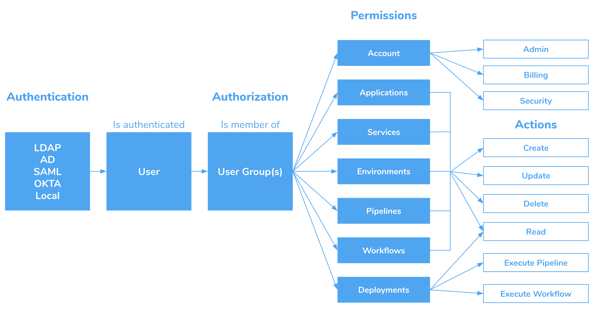
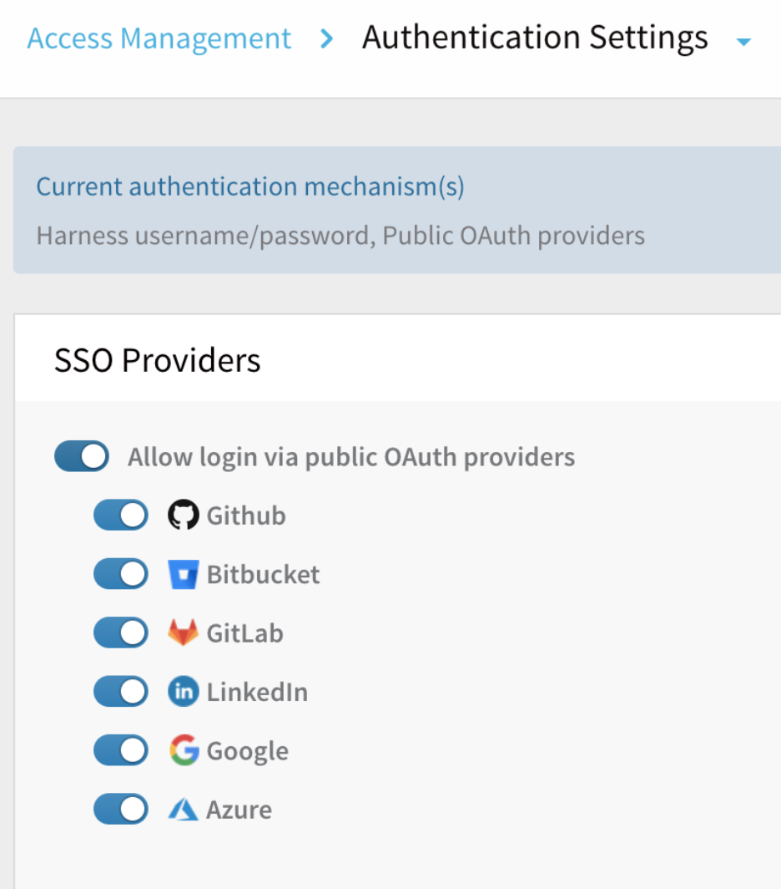
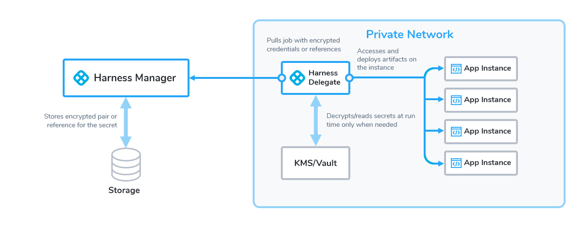
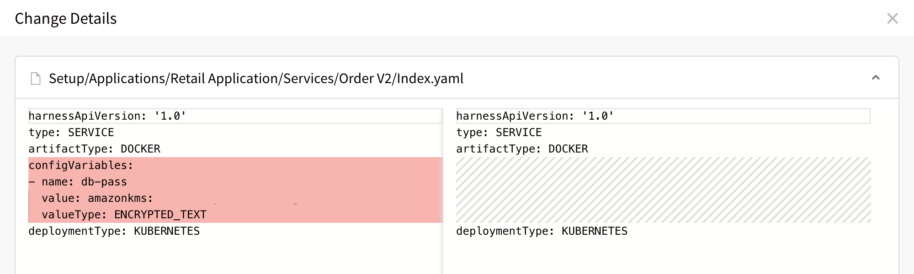
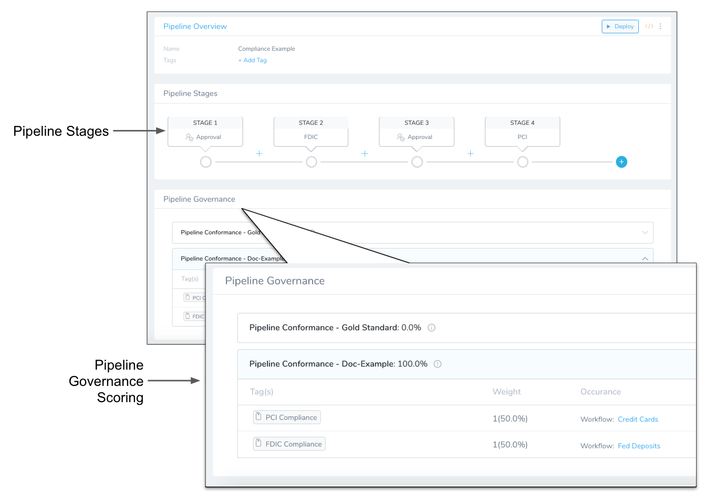
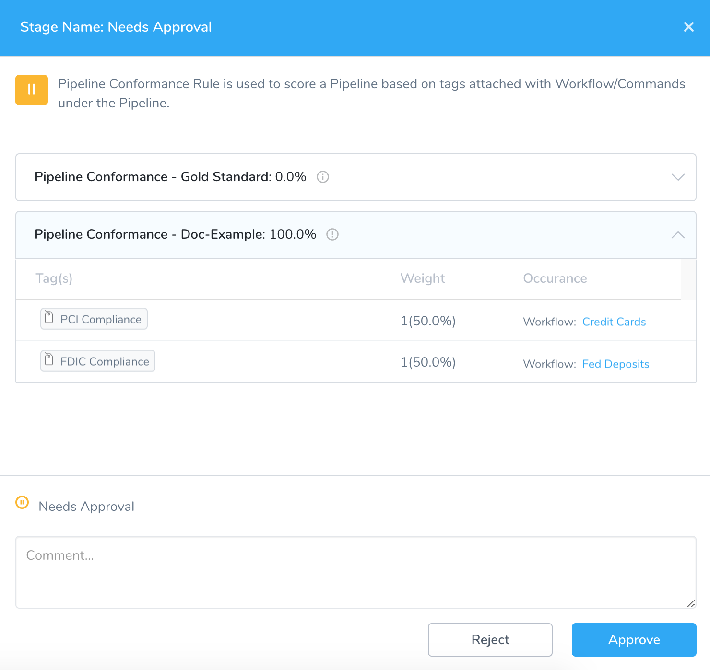

This content is for Harness [FirstGen](../../getting-started/harness-first-gen-vs-harness-next-gen.md). Switch to [NextGen](../../frequently-asked-questions/harness-faqs/harness-security-faqs.md).This article addresses some frequently asked questions about Harness security features.

<!-- TOC start -->
- [Before You Begin](#before-you-begin)
- [General](#general)
  * [What security features does Harness provide?](#what-security-features-does-harness-provide)
  * [Are Delegate communications secure?](#are-delegate-communications-secure)
  * [What data does the Delegate send to the Harness Manager?](#what-data-does-the-delegate-send-to-the-harness-manager)
- [Harness ​Role-based access control (RBAC)](#harness-role-based-access-control-rbac)
  * [How does Harness implement RBAC?](#how-does-harness-implement-rbac)
  * [How are users added?](#how-are-users-added)
  * [Can users be added dynamically?](#can-users-be-added-dynamically)
  * [Are there best practices for setting up Harness users?](#are-there-best-practices-for-setting-up-harness-users)
- [Harness Authentication](#harness-authentication)
  * [How are Harness users authenticated?](#how-are-harness-users-authenticated)
  * [How is SAML SSO supported?](#how-is-saml-sso-supported)
  * [Can I adjust password policies?](#can-i-adjust-password-policies)
  * [Do you support Single Sign-On (SSO)?](#do-you-support-single-sign-on-sso)
  * [Do you support Two-Factor Authentication (2FA)?](#do-you-support-two-factor-authentication-2fa)
- [Secrets Management](#secrets-management)
  * [How are secrets managed in Harness?](#how-are-secrets-managed-in-harness)
  * [Where can I use a secret?](#where-can-i-use-a-secret)
  * [How do I create a secret?](#how-do-i-create-a-secret)
  * [How do I use a secret?](#how-do-i-use-a-secret)
  * [Can I limit a secret to certain users?](#can-i-limit-a-secret-to-certain-users)
  * [Can I use my existing secrets in Harness?](#can-i-use-my-existing-secrets-in-harness)
  * [Can I migrate secrets between secrets managers?](#can-i-migrate-secrets-between-secrets-managers)
  * [Are my secrets exposed in logs?](#are-my-secrets-exposed-in-logs)
  * [Can I view all my setup events and changes in Harness?](#can-i-view-all-my-setup-events-and-changes-in-harness)
  * [Can I view deployment history?](#can-i-view-deployment-history)
  * [What can I see in the audit trail?](#what-can-i-see-in-the-audit-trail)
  * [Can I filter audit events?](#can-i-filter-audit-events)
- [Governance](#governance)
  * [Does Harness provide governance features?](#does-harness-provide-governance-features)
  * [How do set up governance?](#how-do-set-up-governance)
- [IP Whitelisting](#ip-whitelisting)
  * [Can I whitelist IPs for connections to my Harness accounts?](#can-i-whitelist-ips-for-connections-to-my-harness-accounts)
  * [Can I whitelist IPs for the Harness Delegate?](#can-i-whitelist-ips-for-the-harness-delegate)
- [API Keys](#api-keys)
  * [Can I register Harness with third-party apps?](#can-i-register-harness-with-third-party-apps)
  * [Is there a limit on how many API calls I can make?](#is-there-a-limit-on-how-many-api-calls-i-can-make)
  * [Can I use an API key to track deployments?](#can-i-use-an-api-key-to-track-deployments)
<!-- TOC end -->

### Before You Begin

* [Harness Key Concepts](../starthere-firstgen/harness-key-concepts.md)
* [Supported Platforms and Technologies](../starthere-firstgen/supported-platforms.md)

### General

For an overview of Harness' support for platforms, methodologies, and related technologies, see [Supported Platforms and Technologies](../starthere-firstgen/supported-platforms.md).

#### What security features does Harness provide?

Harness includes:

* [Users and User Groups](../firstgen-platform/security/access-management-howtos/users-and-permissions.md)
* [Role-based access control (RBAC)](../firstgen-platform/security/access-management-howtos/users-and-permissions.md)
* [Single sign-on (SSO)](../firstgen-platform/security/access-management-howtos/sso-provider-overview.md)
* [Password policies](../firstgen-platform/security/access-management-howtos/authentication-settings.md#enforcing-password-policies)
* [Two-Factor Authentication](../firstgen-platform/security/access-management-howtos/login-settings.md)
* [Domain name restriction](../firstgen-platform/security/access-management-howtos/authentication-settings.md#restricting-email-domains)
* [IP Whitelisting](../firstgen-platform/security/access-management-howtos/access-management.md)
* [Support for common and custom secrets managers](../firstgen-platform/security/secrets-management/secret-management.md)
* [Encryption for all 3rd party account info](../firstgen-platform/security/secrets-management/use-encrypted-text-secrets.md#step-3-using-the-encrypted-text-in-connectors)
* [Encrypted text](../firstgen-platform/security/secrets-management/use-encrypted-text-secrets.md)
* [Encrypted files](../firstgen-platform/security/secrets-management/use-encrypted-file-secrets.md)
* [SSH connection credentials](../firstgen-platform/security/secrets-management/add-ssh-keys.md)
* [SSH with Kerberos](../firstgen-platform/security/secrets-management/use-ssh-key-via-kerberos-for-server-authentication.md)
* [WinRM connection credentials](../firstgen-platform/security/secrets-management/add-win-rm-connection-credentials.md)
* [WinRM with Kerberos](../firstgen-platform/security/secrets-management/use-win-rm-connection-via-kerberos-for-server-authentication.md)
* [Auditing](../firstgen-platform/security/auditing-howtos/audit-trail.md)
* [Governance](../firstgen-platform/security/governance-howtos/pipeline-governance.md)
* [Deployment Freezing](../firstgen-platform/security/governance-howtos/deployment-freeze.md)

#### Are Delegate communications secure?

Yes. All network connections from the Delegate in your local network or VPC to Harness SaaS are HTTPS outbound-only.

See [Harness Delegate FAQs](harness-delegate-faqs.md).

#### What data does the Delegate send to the Harness Manager?

The Delegate and the Harness Manager (via SaaS) establish a Secure WebSocket channel (WebSocket over TLS) to send new Delegate task event notifications (not the tasks themselves) and exchange connection heartbeats. In the case that the WebSocket connection is dropped, the Harness Delegate falls back to outbound-only, polling-based task fetch.

* **Heartbeat** - The Delegate sends a [heartbeat](https://en.wikipedia.org/wiki/Heartbeat_(computing)) to let the Harness Manager that it is running.
* **Deployment data** - The information from the API executions the Delegate performs are sent to the Manager for display in the **Deployments** page.
* **Time series and log data for Continuous Verification** - The Delegate connects to the verification providers you have configured and sends their data to the Manager for display in Harness Continuous Verification.

See [Harness Delegate FAQs](harness-delegate-faqs.md).

### Harness ​Role-based access control (RBAC)

For an overview of Harness' support for platforms, methodologies, and related technologies, see [Supported Platforms and Technologies](../starthere-firstgen/supported-platforms.md).

#### How does Harness implement RBAC?

Harness provides Role-Based Access Control (RBAC) via User and User Group Account and Application permissions.

Here is an overview of Harness RBAC. It shows how a user is authenticated via its User settings and authorized via its User Group Account and Application Permissions.

[](./static/harness-security-faq-57.png)See [Managing Users and Groups (RBAC)](../firstgen-platform/security/access-management-howtos/users-and-permissions.md).

#### How are users added?

When you add Harness users manually, they are added using email addresses. When a user is added, they receive an email invite to the Harness account.

#### Can users be added dynamically?

Yes, you can leverage your existing user management infrastructure by adding them using OAuth 2.0, LDAP, SAML, and SCIM.

See:

* [Single Sign-On (SSO) with OAuth 2.0](../firstgen-platform/security/access-management-howtos/single-sign-on-sso-with-oauth-2-0.md)
* [Single Sign-On (SSO) with LDAP](../firstgen-platform/security/access-management-howtos/sso-ldap.md)
* [Single Sign-On (SSO) with SAML](../firstgen-platform/security/access-management-howtos/single-sign-on-sso-with-saml.md)
* [Provision Users and Groups with OneLogin (SCIM)](../firstgen-platform/security/access-management-howtos/provision-users-with-one-login.md)
* [Provisioning Users with Okta (SCIM)](../firstgen-platform/security/access-management-howtos/scim-okta.md)
* [Provision Azure AD Users and Groups (SCIM)](../firstgen-platform/security/access-management-howtos/provision-azure-ad-users-and-groups-scim.md)

#### Are there best practices for setting up Harness users?

Yes, you can add users for the most common application release scenario. This involves separate Harness User Groups for app devs, DevOps engineers, and release approvers.

See [Set Up RBAC for Application Release Process](../firstgen-platform/security/access-management-howtos/rbac-setup-in-harness.md).

### Harness Authentication

For an overview of Harness' support for platforms, methodologies, and related technologies, see [Supported Platforms and Technologies](../starthere-firstgen/supported-platforms.md).

#### How are Harness users authenticated?

The default method is email address and password.

You can use several other methods:

* [Single Sign-On (SSO) with OAuth 2.0](../firstgen-platform/security/access-management-howtos/single-sign-on-sso-with-oauth-2-0.md)
* [Single Sign-On (SSO) with LDAP](../firstgen-platform/security/access-management-howtos/sso-ldap.md)
* [Single Sign-On (SSO) with SAML](../firstgen-platform/security/access-management-howtos/single-sign-on-sso-with-saml.md)

#### How is SAML SSO supported?

See [SAML SSO FAQs](../firstgen-platform/security/access-management-howtos/single-sign-on-sso-with-saml.md#saml-sso-fa-qs).

#### Can I adjust password policies?

Yes. You can adjust:

* [Strength](../firstgen-platform/security/access-management-howtos/authentication-settings.md#enforcing-password-strength)
* [Expiration](../firstgen-platform/security/access-management-howtos/authentication-settings.md#enforcing-password-expiration) (refresh) period
* [Lockout Policy](../firstgen-platform/security/access-management-howtos/authentication-settings.md#enforcing-lockout-after-failed-logins) after failed logins

#### Do you support Single Sign-On (SSO)?

Yes. Uou can enable Harness logins via a range of single sign-on mechanisms. Enable the **Allow login via public OAuth providers** slider to expose sliders for enabling individual [OAuth](../firstgen-platform/security/access-management-howtos/single-sign-on-sso-with-oauth-2-0.md) providers.

See:

* [Single Sign-On (SSO) with OAuth 2.0](../firstgen-platform/security/access-management-howtos/single-sign-on-sso-with-oauth-2-0.md)
* [Single Sign-On (SSO) with LDAP](../firstgen-platform/security/access-management-howtos/sso-ldap.md)
* [Single Sign-On (SSO) with SAML](../firstgen-platform/security/access-management-howtos/single-sign-on-sso-with-saml.md)

#### Do you support Two-Factor Authentication (2FA)?

Yes. Two-Factor Authentication (2FA) can be managed in two ways:

* **Individual user:** You can set up 2FA for your own **User Profile** without impacting other user accounts.
* **All account users:** If you have **Manage Account** permissions, you can enforce 2FA for all users in Harness. First, you set up 2FA for your own account, and then you can enforce 2FA account-wide in the Harness account's **Login Settings**.

See [Two-Factor Authentication](../firstgen-platform/security/access-management-howtos/login-settings.md).

### Secrets Management

For an overview of Harness' support for platforms, methodologies, and related technologies, see [Supported Platforms and Technologies](../starthere-firstgen/supported-platforms.md).

#### How are secrets managed in Harness?

Using common secrets managers. Google Cloud Key Management Service is the default Secrets Manager in Harness.

You can use your own secrets manager with Harness. Harness integrates with all of the common secret managers:

* [Add a Google Cloud KMS Secrets Manager](../firstgen-platform/security/secrets-management/add-a-google-cloud-kms-secrets-manager.md)
* [Add an AWS Secrets Manager](../firstgen-platform/security/secrets-management/add-an-aws-secrets-manager.md)
* [Add an AWS KMS Secrets Manager](../firstgen-platform/security/secrets-management/add-an-aws-kms-secrets-manager.md)
* [Add an Azure Key Vault Secrets](../firstgen-platform/security/secrets-management/azure-key-vault.md)
* [Add a HashiCorp Vault Secrets Manager](../firstgen-platform/security/secrets-management/add-a-hashi-corp-vault-secrets-manager.md)

You can configure and make use of other Secrets Managers using the Custom Secrets Manager: [Add and Use a Custom Secrets Manager](../firstgen-platform/security/secrets-management/add-and-use-a-custom-secrets-manager.md).

This diagram shows how Harness handles secrets:

[](./static/harness-security-faq-60.jpg)#### What kind of secrets are supported?

Harness supports:

* [Encrypted text](../firstgen-platform/security/secrets-management/use-encrypted-text-secrets.md)
* [Encrypted files](../firstgen-platform/security/secrets-management/use-encrypted-file-secrets.md)
* [SSH connection credentials](../firstgen-platform/security/secrets-management/add-ssh-keys.md)
* [SSH with Kerberos](../firstgen-platform/security/secrets-management/use-ssh-key-via-kerberos-for-server-authentication.md)
* [WinRM connection credentials](../firstgen-platform/security/secrets-management/add-win-rm-connection-credentials.md)
* [WinRM with Kerberos](../firstgen-platform/security/secrets-management/use-win-rm-connection-via-kerberos-for-server-authentication.md)

#### Where can I use a secret?

You use secrets in many places in Harness.

You use secrets for credentials for Harness connections to third party integrations, such as cloud platform, git repos, and artifact servers.

You use secrets in Harness connections to target infrastructure, such as SSH keys, and also when passing credentials as part of infrastructure provisioning.

You use secrets in [Shell Script Workflow steps](../continuous-delivery/model-cd-pipeline/workflows/capture-shell-script-step-output.md), as part of your Bash and PowerShell scripts.

You use secrets in Delegate Profiles, which as scripts Harness runs on the hosts/containers/pods running the Harness Delegate.

#### How do I create a secret?

In Harness Secrets Management, you pick a type of secret, and then enter the secret or upload the file.

See:

* [Use Encrypted Text Secrets](../firstgen-platform/security/secrets-management/use-encrypted-text-secrets.md)
* [Use Encrypted File Secrets](../firstgen-platform/security/secrets-management/use-encrypted-file-secrets.md)

#### How do I use a secret?

In most cases, you select the encrypted text or file secret you created as part of the credentials or value for a setting.

You can also reference a secret using an expression.

You reference a text secret in a script using the expression `${secrets.getValue("secret_name")}`.

You can reference a file secret using the expression `${configFile.getAsBase64("secret_name")}` or `${configFile. getAsString("secret_name")}`.

See:

* [Use Encrypted Text Secrets](../firstgen-platform/security/secrets-management/use-encrypted-text-secrets.md)
* [Use Encrypted File Secrets](../firstgen-platform/security/secrets-management/use-encrypted-file-secrets.md)

#### Can I limit a secret to certain users?

Yes, you can scope Secrets Managers and their secrets, and then you can decrease the scope the secrets further, if needed.

See:

* [Scope Secret Managers to Applications and Environments](../firstgen-platform/security/secrets-management/scope-secret-managers-to-applications-and-environments.md)
* [Restrict Secrets Usage](../firstgen-platform/security/secrets-management/restrict-secrets-usage.md)

#### Can I use my existing secrets in Harness?

Yes. If you already have secrets created in a secrets manager such as HashiCorp Vault or AWS Secrets Manager, you do not need to re-create the existing secrets in Harness.

Harness does not query the secrets manager for existing secrets, but you can create a secret in Harness that references an existing secret in HashiCorp Vault or AWS Secrets Manager.

No new secret is created in those providers. If you delete the secret in Harness, it does not delete the secret in the provider.

See [Reference Existing Secret Manager Secrets](../firstgen-platform/security/secrets-management/reference-existing-secrets.md).

#### Can I migrate secrets between secrets managers?

Yes. Harness Secrets Management supports the ability to migrate your secrets between secrets managers.

See [Migrate Secrets between Secrets Managers](../firstgen-platform/security/secrets-management/migrate-secrets-between-secrets-managers.md).

#### Are my secrets exposed in logs?

No. Text secrets are not exposed. Harness sanitizes logs and secrets are masked.

See [Secrets and Log Sanitization](../firstgen-platform/techref-category/techref-security/secrets-and-log-sanitization.md).

File secrets are not masked in Harness logs. As noted above they can be encoded in different formats, but they are not masked from users.### Auditing

For an overview of Harness' support for platforms, methodologies, and related technologies, see [Supported Platforms and Technologies](../starthere-firstgen/supported-platforms.md).

#### Can I view all my setup events and changes in Harness?

Yes. Harness provides auditing of events for many Harness account, Applications, and Application components. The Audit Trail enables you to track and review all events in one place.

See [Audit Trail](../firstgen-platform/security/auditing-howtos/audit-trail.md).

#### Can I view deployment history?

The Audit Trail feature covers events in accounts and Applications. To see your deployment history use Harness Manager's **Continuous Deployment**. See [Filtering Deployments](../continuous-delivery/concepts-cd/deployments-overview/filtering-deployments.md).

#### What can I see in the audit trail?

For each event, you can see details such as:

* Date and time.
* User who made the change (**Updated By**).
* Underlying REST API call (**Event Source**).
* Harness entity and Application affected (**Resource**).
* Details summary.
* YAML diff.

#### Can I set a date range for an audit?

Yes. You can restrict the Audit Trail's displayed events by date and time, or define detailed filters by these and other criteria.

#### Can I filter audit events?

Yes, extensively. You can set multiple conditions on the events displayed.

You can save your filters, also.

See [Modify the Audit Trail View](../firstgen-platform/security/auditing-howtos/audit-trail.md#modify-the-audit-trail-view).

### Governance

For an overview of Harness' support for platforms, methodologies, and related technologies, see [Supported Platforms and Technologies](../starthere-firstgen/supported-platforms.md).

#### Does Harness provide governance features?

Yes. Harness Pipeline Governance feature enables you to measure how conformant your Pipelines are with your regulatory and operations standards.

See [Pipeline Governance](../firstgen-platform/security/governance-howtos/pipeline-governance.md).

#### How do set up governance?

Using Harness Pipeline Governance is a simple process. After you create Workflows that perform or verify some regulatory operation, you describe them using [Tags](../firstgen-platform/account/tags/tags.md).

Next, you use those Tags to create rules in a Pipeline Governance Standard. You assign a weight to each rule to indicate how important it is.

The standards are used to score the conformance of Pipelines. A score lets you measure the conformance level of the Workflows a Pipeline contains.

You can see the score before you deploy a Pipeline, and during Pipeline Approval steps.

Below is an example of a Pipeline Governance Standard and how a Pipeline Approval step measures conformance with the standard during deployment:

[](./static/harness-security-faq-63.png)#### When can I measure conformance?

Before and during deployment.

When you open a Pipeline in Harness, you will see all of the Pipeline Governance Standards available to it, and their individual scores.

[](./static/harness-security-faq-65.png)Approval steps in Pipelines display the Pipeline Governance Standards available to that Pipeline.

For example, here is an Approval step in a Pipeline displaying two standards and their scores:



### IP Whitelisting

For an overview of Harness' support for platforms, methodologies, and related technologies, see [Supported Platforms and Technologies](../starthere-firstgen/supported-platforms.md).

#### Can I whitelist IPs for connections to my Harness accounts?

Yes. You can whitelist the IP addresses that may access your Harness account.

You can enter individual IP addresses or a CIDR (Classless Inter-Domain Routing) block.

Once you add and enable an IP Whitelist, only users connecting from the IP address/CIDR block may log into Harness.

See [IP Whitelist Management](../firstgen-platform/security/access-management-howtos/access-management.md).

#### Can I whitelist IPs for the Harness Delegate?

No. Harness IP Whitelisting is for user connections to a Harness account. It will not perform IP whitelisting for Harness Delegate connections.

### API Keys

For an overview of Harness' support for platforms, methodologies, and related technologies, see [Supported Platforms and Technologies](../starthere-firstgen/supported-platforms.md).

#### Can I register Harness with third-party apps?

Yes, by using Harness API keys.

To integrate Harness with some third-party apps, you need to register Harness with the app and then supply a Harness API key.

The API key is a simple encrypted string that other applications can use to access Harness without a private Harness account.

See [API Keys](../firstgen-platform/security/access-management-howtos/api-keys.md).

#### Is there a limit on how many API calls I can make?

Yes. The Harness API has a usage rate limit of **1 query per second per API Key**. If the rate limit is reached, you will receive this response in the API call:


```
Too Many requests. Throttled. Max QPS: 1.0
```
#### Can I use an API key to track deployments?

Yes. Once you have generated an API key in Harness, deployment status can be tracked by making a REST call to Harness.

For more information, see [Add a Trigger](../continuous-delivery/model-cd-pipeline/triggers/add-a-trigger-2.md#manual-triggers-and-github-webhooks).

