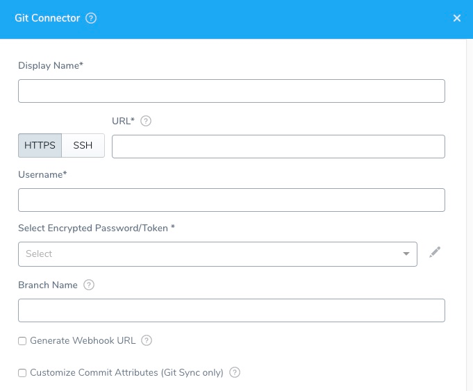

This topic outlines how to use [AWS CodeCommit](https://docs.aws.amazon.com/codecommit/latest/userguide/welcome.html) as a source repo with your Harness account and Applications. You can pull source files, such as manifests, specs, and config files, from your Source Repo as part of setting up your Harness Service and other entities.

:::note
CodeCommit is supported as a Source Repo only. It cannot be used with [Harness Git Sync](../../config-as-code/configuration-as-code.md).
:::

## Before You Begin

Ensure your Git repo is initialized (`git init`) before connecting Harness to it.

### Fetching very large repos

:::note
Currently, this feature is behind the feature flag `OPTIMIZED_GIT_FETCH_FILES`. Contact [Harness Support](mailto:support@harness.io) to enable the feature.
:::

Harness performs a `git clone` to fetch files. If the fetch is timing out, it can be because the repo is too large for the network connection to fetch it before timing out. To fetch very large repos, enable the feature flag `OPTIMIZED_GIT_FETCH_FILES`. When this feature flag is enabled, Harness will use provider-specific APIs to improve performance.

Some important notes:

* If you enable `OPTIMIZED_GIT_FETCH_FILES`, you must use a **token** for authentication. Passwords are not supported.
* If you enable `OPTIMIZED_GIT_FETCH_FILES`, all of the files and folders must be in the same directory. You cannot fetch files outside of the repo or use symlinks.

## Step: Add Source Repo Provider

To add a source repo, do the following:

1. Click **Setup**.
2. Click **Connectors**.
3. Click **Source Repo Providers**, and then click **Add Source Repo Provider**. The **Git Connector** settings appear.

## Step: Display Name

Enter a name for the repo connection. This is the name you will select when you sync your Harness account and applications in [Configuration as Code](../../config-as-code/configuration-as-code.md).You could create a Source Repo Provider for the Harness admin account, such as **Admin\_CodeCommit**. Later, you can create a Source Repo account for each Harness user, such as **J\_User\_CodeCommit**.

## Step: Provider

Currently, this feature is behind the Feature Flag `OPTIMIZED_GIT_FETCH_FILES`. Contact [Harness Support](mailto:support@harness.io) to enable the feature.In **Provider**, select **Git**.

## Step: Git Repo or Git Account

You can add a connection to your entire Git account (org) or just a repo in the account. Selecting a Git account (org) enables you to use one Source Repo Connector for all of your subordinate repos.

Later when you test this connection, you will use a repo in the account.

In either case, when you use the Connector later in Harness, you will specify which repo to use.

## Step: HTTPS/SSH

Select **HTTPS** or **SSH** for the connection. You will need to provide the protocol-relevant URL in **URL**. If you use Two-Factor Authentication for your Git repo, connect over **HTTPS** or **SSH**.

For SSH, ensure that the key is not OpenSSH, but rather RSA or another algorithm. To generate an SSHv2 key, use:   
`ssh-keygen -t rsa -m PEM`   
The `rsa` and `-m PEM` ensure that the key is RSA.  
Next, follow the prompts to create the PEM key. For more information, see the  [ssh-keygen man page](https://linux.die.net/man/1/ssh-keygen) and [Connecting to GitHub with SSH](https://help.github.com/en/github/authenticating-to-github/connecting-to-github-with-ssh).

## Step: URL

Enter the URL for your Git repo. Ensure that it matches the option you selected in [HTTPS/SSH](#https-ssh).

Currently, **Git Account** is in Beta and behind a Feature Flag. Contact [Harness Support](https://mail.google.com/mail/?view=cm&fs=1&tf=1&to=support@harness.io) to enable the feature.If you selected **Git Repo** in **Type**, enter the full URL for the repo, such as `https://github.com/account-name/repo-name`.

If you selected **Git Account** in **Type**, enter the URL without the repo name, like `https://github.com/account-name`. When you use this Source Repo Provider in a Harness setting you will be prompted to provide a repo name.

## Step: Username and Password/Token

In **Select Encrypted Password/Token**, select or create a new [Harness Encrypted Text secret](../../security/secrets-management/use-encrypted-text-secrets.md) for the credentials of your CodeCommit user account.

:::note
If you have set up Two-Factor Authentication in your Git repo, then you need to generate a personal access token in your repo and enter that token in the **Password/Token** field.
:::
:::note
If you enable `OPTIMIZED_GIT_FETCH_FILES`, you must use a **token** for authentication. Passwords are not supported.
:::

## Step: SSH Key

If you selected **SSH** as the connection protocol, you must add the **SSH Key** for use with the connection.

In **SSH Key**, select or create a new [Harness Encrypted Text secret](../../security/secrets-management/use-encrypted-text-secrets.md).

If you added a key in Harness Secrets Management, you can select it here. To add a new key, click the drop-down and select **Add New SSH Key**. The **SSH Configuration** dialog appears.

In **User Name**, enter the **SSH Key ID** that was generated when you uploaded your SSH public key to CodeCommit.

In **Credentials**, paste in the key or key file path, enter a display name, and then click **Submit**.

## Step: Branch Name

If you selected **Git Repo** in **Type**, enter the branch name to sync with Harness, such as **master**, **dev**, or **myAppName**. Do not enter the full URL to the branch.

:::note
Names may not contain characters from the Emoticons unicode block.
:::

## Step: Customize Commit Attributes

Do not use this option with CodeCommit.

CodeCommit is supported as a Source Repo only. It cannot be used with [Harness Git Sync](../../config-as-code/configuration-as-code.md).

## Step: Usage Scope

For HTTPS connections, usage scope is inherited from the secret you entered in **Select Encrypted Password/Token**.

For SSH, connections, select the Harness Applications and Environments where the connection may be used.

## Step: Test and Save

To finish configuring this Source Repo Provider:

1. Click **Test**. Harness verifies the settings you entered. If you selected **Git Account** in **Type**, you need to provide a subordinate repo to test with.
2. When testing is successful, click **Submit**. This Source Repo Provider is now added to Harness.

