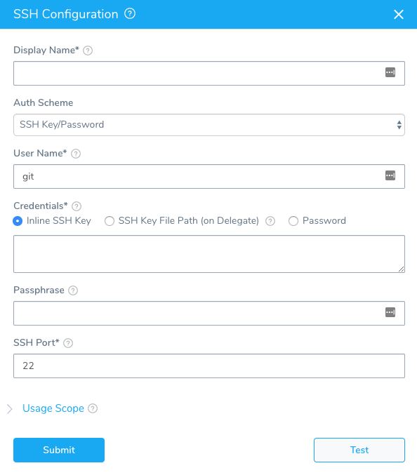
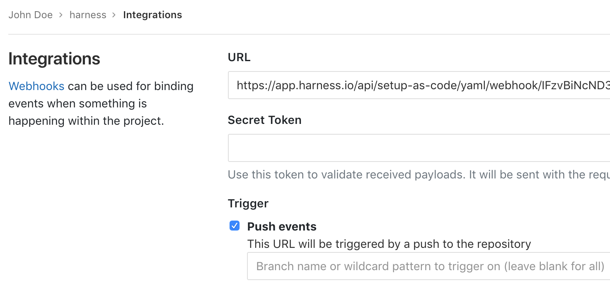

This topic outlines how to start syncing your Harness account and applications with one or more GitLab repositories. You add these repos as Source Repo Providers in Harness.

## Before You Begin

* [Add Source Repo Providers](add-source-repo-providers.md)

:::note
Ensure your Git repo is initialized (`git init`) before connecting Harness to it.
:::

### Limitations

* One Harness Application cannot be in multiple repos.
* Before Harness syncs with your Git repo, it will confirm that all Harness' settings are in a valid state. If a connection is not working—for example, a connection to an Artifact Server or Cloud Provider—Harness will not sync with your Git repo.

### Fetching very large repos

:::note
Currently, this feature is behind the feature flag `OPTIMIZED_GIT_FETCH_FILES`. Contact [Harness Support](mailto:support@harness.io) to enable the feature.
:::

Harness performs a `git clone` to fetch files. If the fetch is timing out, it can be because the repo is too large for the network connection to fetch it before timing out. To fetch very large repos, enable the feature flag `OPTIMIZED_GIT_FETCH_FILES`. When this feature flag is enabled, Harness will use provider-specific APIs to improve performance.

Some important notes:

* If you enable `OPTIMIZED_GIT_FETCH_FILES`, you must use a **token** for authentication. Passwords are not supported.
* If you enable `OPTIMIZED_GIT_FETCH_FILES`, all of the files and folders must be in the same directory. You cannot fetch files outside of the repo or use symlinks.

## Step: Add Source Repo Provider

To add a source repo, do the following:

1. Click **Setup**.
2. Click **Connectors**.
3. Click **Source Repo Providers**, and then click **Add Source Repo Provider**. The **Git Connector** settings appear.

## Step: Display Name

Enter a name for the repo connection. This is the name you will select when you sync your Harness account and applications in [Configuration as Code](../../config-as-code/configuration-as-code.md).You could create a Source Repo Provider for the Harness admin account, such as **Admin\_GitLab**. Later, you can create a Source Repo account for each Harness user, such as **J\_User\_GitLab**.

## Step: Provider

:::note
Currently, this feature is behind the Feature Flag `OPTIMIZED_GIT_FETCH_FILES`. Contact [Harness Support](mailto:support@harness.io) to enable the feature.
:::

In **Provider**, select **GitLab**.

## Step: Git Repo or Git Account

You can add a connection to your entire Git account or just a repo in the account. Selecting a Git account enables you to use one Source Repo Connector for all of your subordinate repos.

Later when you test this connection, you will use a repo in the account.

In either case, when you use the Connector later in Harness, you will specify which repo to use.

## Step: HTTPS/SSH

Select **HTTPS** or **SSH** for the connection. You will need to provide the protocol-relevant URL in **URL**. If you use Two-Factor Authentication for your Git repo, connect over **HTTPS** or **SSH**.

:::note
For SSH, ensure that the key is not OpenSSH, but rather RSA or another algorithm. To generate an SSHv2 key, use:   
`ssh-keygen -t rsa -m PEM`   
The `rsa` and `-m PEM` ensure that the key is RSA.  
Next, follow the prompts to create the PEM key. For more information, see the  [ssh-keygen man page](https://linux.die.net/man/1/ssh-keygen) and [Connecting to GitHub with SSH](https://help.github.com/en/github/authenticating-to-github/connecting-to-github-with-ssh).
:::

To sync with GitLab, you will need to generate a SSH key pair and add the SSH key to your GitLab account. For more information, see [Generating a new SSH key pair](https://gitlab.com/help/ssh/README#generating-a-new-ssh-key-pair) from GitLab.

## Step: URL

Enter the URL for your Git repo. Ensure that it matches the option you selected in [**HTTPS/SSH**](#step-httpsssh).

If you selected **Git Repo** in **Type**, enter the full URL for the repo, such as `https://github.com/account-name/repo-name`.

If you selected **Git Account** in **Type**, enter the URL without the repo name, like `https://github.com/account-name`. When you use this Source Repo Provider in a Harness setting you will be prompted to provide a repo name.

## Step: Username and Password/Token

In **Select Encrypted Password/Token**, select or create a new [Harness Encrypted Text secret](../../security/secrets-management/use-encrypted-text-secrets.md) for the credentials of your Gitlab user account.

:::note
If you have set up Two-Factor Authentication in your Git repo, then you need to generate a personal access token in your repo and enter that token in the **Password/Token** field.
:::

:::note
If you enable `OPTIMIZED_GIT_FETCH_FILES`, you must use a **token** for authentication. Passwords are not supported.### 
:::

## Step: SSH Key

If you selected **SSH** as the connection protocol, you must add the **SSH Key** for use with the connection. If you added a key in Harness Secrets Management, you can select it here. For more information, see [Secrets Management](../../security/secrets-management/secret-management.md#ssh). To add a new key, click the drop-down and select **Add New SSH Key**. The **SSH Configuration** dialog appears.

In **User Name**, enter **git**. Ensure that it is lowercase.

:::note
**git** is the only value you should use in **User Name**.
:::

In **Credentials**, paste in the key or key file path, enter a display name, and then click **Submit**.

## Step: Branch Name

Enter the branch name to sync with Harness, such as **master**, **dev**, or **myAppName**. Do not enter the full URL to the branch.

:::note
Names may not contain characters from the Emoticons unicode block.
:::

## Option: Delegate Selector

If you want this Connector to use one or more specific Delegates, use a Delegate Selector. If you do not use a Selector, Harness will select a Delegate that has worked in the past for this type of Connector.

In **Delegate Selector**, select the Selector for the Delegate(s) you want this Connector to use. You add Selectors to Delegates to make sure that they're used to execute the command. For more information, see [Select Delegates with Selectors](../manage-delegates/select-delegates-for-specific-tasks-with-selectors.md).

Harness will use Delegates matching the Selectors you add.

If you use one Selector, Harness will use any Delegate that has that Selector.

If you select two Selectors, a Delegate must have both Selectors to be selected. That Delegate might also have other Selectors, but it must have the two you selected.

## Step: Generate Webhook URL

Enable this checkbox if you want to sync Harness with your repo bidirectionally. Changes made on either end will be synced. If you simply want Harness changes synched unidirectionally with the repo, disable this checkbox. When you use this Source Repo Provider to sync a Harness application to a repo bidirectionally, any account or application that uses this Source Repo provider will be synced bidirectionally. For more information, see [Configuration as Code](../../config-as-code/configuration-as-code.md).

## Step: Customize Commit Attributes (Git Sync Only)

When Harness commits or pushes a change to Git as part of syncing, it uses **Harness.io** and **support@harness.io** as the author and commit email address of that commit.

In some cases, you might have strong pre-commit limitations on who may or may not commit. In that case, you need to provide an author name and email that is approved to push on that repo. You can add an **Author Name** and **Author Email** address that will be applied whenever Harness syncs with the Git repo.

## Option: Using the Webhook

If you selected the **Generate Webhook URL** option when adding your **Source Repo Provider**, the **Generated Webhook URL** dialog appears. Copy the URL and use it in your repo to enable your repo to sync changes to Harness.

### GitLab

Use the **Push events** trigger.

## Step: Test and Save

To finish configuring this Source Repo Provider:

1. In the **Git Connector** settings, click **Test**. If you selected **Git Account** in **Type**, you need to provide a subordinate repo to test with.  
Harness verifies the settings you entered.
2. When testing is successful, click **Submit**. This Source Repo Provider is now added to Harness.

## Next Steps

* Once a Source Repo Provider is set up, you can use it—at the Harness account level and Application level—to sync your account and/or applications with your Git repo. See [Configuration as Code](../../config-as-code/configuration-as-code.md).

* To trigger Harness workflows and pipelines using Git Webhooks, see [Add a Trigger](../../../continuous-delivery/model-cd-pipeline/triggers/add-a-trigger-2.md).

* To sync and clone a Harness Application template in Git, see [Onboard Teams Using GitOps](../../../continuous-delivery/harness-git-based/onboard-teams-using-git-ops.md).

