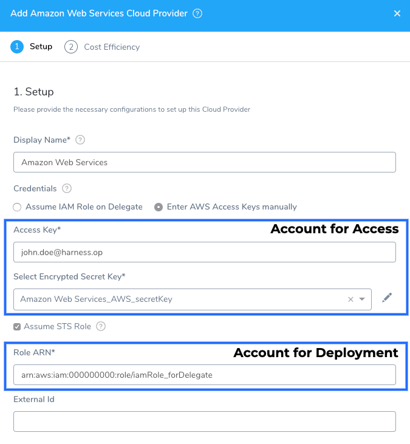

AWS is used as a Harness Cloud Provider for obtaining artifacts, deploying services, and for verifying deployments using [CloudWatch Verification Overview](../../../continuous-delivery/continuous-verification/continuous-verification-overview/concepts-cv/cloud-watch-verification-overview.md).

This topic explains how to set up the AWS Cloud Provider, and the IAM roles and policies needed by the AWS account used in the Cloud Provider.

:::note
**Recommended:** Install and run a Harness Delegate (ECS Delegate in an ECS cluster, Shell Script Delegate on an EC2 instance, etc) in the same VPC as the AWS resources you will use, and then use the Delegate for the AWS Cloud Provider credentials. This is the easiest method to connect to AWS. For more information, see [Delegate Installation and Management](../manage-delegates/delegate-installation.md).
:::

:::caution
The [DescribeRegions](https://docs.aws.amazon.com/AWSEC2/latest/APIReference/API_DescribeRegions.html) action is required for all AWS Cloud Providers regardless of what AWS service you are using for your target infrastructure.
:::

In this topic:

* [Before You Begin](#before-you-begin)
* [Review: Use Kubernetes Cluster Cloud Provider for EKS](#review-use-kubernetes-cluster-cloud-provider-for-eks)
* [Review: Switching IAM Policies](#review-switching-iam-policies)
* [Step 1: Add the Cloud Provider](#step-1-add-the-cloud-provider)
* [Step 2: Display Name](#step-2-display-name)
* [Step 3: Credentials](#step-3-credentials)
* [Review: AWS Security Token Service (STS)](#review-aws-security-token-service-sts)
* [Review: AWS GovCloud and Override Default Region](#review-aws-gov-cloud-and-override-default-region)
* [Review: AWS IAM Roles and Policies](add-amazon-web-services-cloud-provider.md#review-aws-iam-roles-and-policies)
* [All AWS Cloud Providers: DescribeRegions Required](#all-aws-cloud-providers-describe-regions-required)
* [Policies Required: Elastic Container Registry (ECR)](#policies-required-elastic-container-registry-ecr)
* [Policies Required: Amazon S3](#policies-required-amazon-s3)
* [Policies Required: ECS (Existing Cluster)](#policies-required-ecs-existing-cluster)
* [Policies Required: AWS AMI/ASG Deployments](add-amazon-web-services-cloud-provider.md#policies-required-aws-ami-asg-deployments)
* [Policies Required: AWS CodeDeploy](#policies-required-aws-code-deploy)
* [Policies Required: AWS EC2](#policies-required-aws-ec2)
* [Policies Required: Amazon Lambda](#policies-required-amazon-lambda)
* [Artifact Support for Download and Copy](add-amazon-web-services-cloud-provider.md#artifact-support-for-download-and-copy)

## Before You Begin

* See [Harness Key Concepts](../../../starthere-firstgen/harness-key-concepts.md).

## Review: Use Kubernetes Cluster Cloud Provider for EKS

If you want to connect Harness to Elastic Kubernetes Service (Amazon EKS), use the platform-agnostic [Kubernetes Cluster Cloud Provider](add-kubernetes-cluster-cloud-provider.md).

## Review: Switching IAM Policies

If the IAM role used by your AWS Cloud Provider does not have the policies required by the AWS service you want to access, you can modify or switch the role.

This entails changing the role assigned to the AWS account or Harness Delegate your AWS Cloud Provider is using.

When you switch or modify the IAM role used by the Cloud Provider, it might take up to 5 minutes to take effect.

## Step 1: Add the Cloud Provider

To add a cloud provider to your Harness account, do the following:

1. Click **Setup**, and then click **Cloud Providers**.
2. Click **Add Cloud Provider** and select **Amazon Web Services**.

The **Add Amazon Web Services Cloud Provider** panel appears.

## Step 2: Display Name

Choose a name for this provider. This is to differentiate AWS providers in Harness. It is not the actual AWS account name.

## Step 3: Credentials

:::note
Ensure that the AWS IAM roles applied to the credentials you use (the Harness Delegate or the access key) includes the policies needed by Harness to deploy to the target AWS service. See [Review: AWS Permissions](add-amazon-web-services-cloud-provider.md#review-aws-permissions) below.
:::
:::caution
The [DescribeRegions](https://docs.aws.amazon.com/AWSEC2/latest/APIReference/API_DescribeRegions.html) action is required for all AWS Cloud Providers regardless of what AWS service you are using for your target infrastructure.
:::

### Assume the IAM Role on Delegate

This is the recommended method.

If you selected **Assume the IAM Role on Delegate**, in **Delegate Selector**, enter the Selector of the Delegate that this Cloud Provider will use for all connections. For information about Selectors, see [Select Delegates for Specific Tasks with Selectors](../manage-delegates/select-delegates-for-specific-tasks-with-selectors.md).

:::note
Presently, Harness does not support **Assume the IAM Role of the Delegate** with the Download Artifact command in a Harness Service. If you are using Download Artifact, use the Access and Secret Key settings in the AWS Cloud Provider.
:::

### Enter AWS Access Keys manually

If you selected **Enter AWS Access Keys manually**, enter your Access Key and your Secret Key.

For secrets and other sensitive settings, select or create a new [Harness Encrypted Text secret](../../security/secrets-management/use-encrypted-text-secrets.md).

For more information, see [Access Keys (Access Key ID and Secret Access Key)](https://docs.aws.amazon.com/general/latest/gr/aws-sec-cred-types.html#access-keys-and-secret-access-keys) from AWS.

:::note
The AWS [IAM Policy Simulator](https://docs.aws.amazon.com/IAM/latest/UserGuide/access_policies_testing-policies.html) is a useful tool for evaluating policies and access.
:::

### Use IRSA (IAM roles for service accounts)

Select **Use IRSA** if you want to have the Harness Kubernetes Delegate in AWS EKS use a specific IAM role when making authenticated requests to resources.

By default, the Harness Kubernetes Delegate uses a ClusterRoleBinding to the **default** service account. Instead, you can use AWS IAM roles for service accounts (IRSA) to associate a specific IAM role with the service account used by the Harness Kubernetes Delegate.

:::note
See [IAM roles for service accounts](https://docs.aws.amazon.com/eks/latest/userguide/iam-roles-for-service-accounts.html) from AWS.
:::

Setting up this feature requires a few more steps than other methods, but it is a simple process.

:::note
The following steps are for a new Delegate installation and new AWS Cloud Provider. If you updating an existing Delegate and AWS Cloud Provider, you can simply edit the Delegate YAML for your existing Delegate as described below, and select the **Use IRSA** option in your AWS Cloud Provider.
:::

1. Create the IAM role with the policies you want the Delegate to use. The policies you select with depend on what AWS resources you are deploying via the Delegate. See the different **Policies Required** sections in this document.
2. In the cluster where the Delegate will be installed, create a service account and attach the IAM role to it.

Here is an example of how to create a new service account in the cluster where you will install the Delegate and attach the IAM policy to it:


```
eksctl create iamserviceaccount \  
    --name=cdp-admin \  
    --namespace=default \  
    --cluster=test-eks \  
    --attach-policy-arn=<policy-arn> \  
    --approve \  
    --override-existing-serviceaccounts —region=us-east-1
```
3. In Harness, download the Harness Kubernetes Delegate YAML file. See [Install the Harness Kubernetes Delegate](../manage-delegates/install-kubernetes-delegate.md).
4. Open the Delegate YAML file in text editor.
5. Add service account with access to IAM role to Delegate YAML.

There are two sections in the Delegate YAML that you must update.

First, update the `ClusterRoleBinding` by adding the subject name of the service account with the attached IAM role.

Old `ClusterRoleBinding`:


```
---  
apiVersion: rbac.authorization.k8s.io/v1beta1  
kind: ClusterRoleBinding  
metadata:  
  name: harness-delegate-cluster-admin  
subjects:  
  - kind: ServiceAccount  
    name: default  
    namespace: harness-delegate  
roleRef:  
  kind: ClusterRole  
  name: cluster-admin  
  apiGroup: rbac.authorization.k8s.io  
---
```
New `ClusterRoleBinding` (for example, using the name `cdp-admin`):


```
---  
apiVersion: rbac.authorization.k8s.io/v1beta1  
kind: ClusterRoleBinding  
metadata:  
  name: harness-delegate-cluster-admin  
subjects:  
  - kind: ServiceAccount  
    name: cdp-admin  
    namespace: harness-delegate  
roleRef:  
  kind: ClusterRole  
  name: cluster-admin  
  apiGroup: rbac.authorization.k8s.io  
---
```
Next, update StatefulSet spec with the new `serviceAccountName`.

Old StatefulSet spec `serviceAccountName`:


```
...  
    spec:  
      containers:  
      - image: harness/delegate:latest  
        imagePullPolicy: Always  
        name: harness-delegate-instance  
        ports:  
          - containerPort: 8080  
...
```
New StatefulSet spec serviceAccountName (for example, using the name `cdp-admin`):


```
...  
    spec:  
      serviceAccountName: cdp-admin  
      containers:  
      - image: harness/delegate:latest  
        imagePullPolicy: Always  
        name: harness-delegate-instance  
        ports:  
          - containerPort: 8080  
...
```
6. Save the Delegate YAML file.
7. Install the Delegate in your EKS cluster and register the Delegate with Harness. See [Install the Harness Kubernetes Delegate](../manage-delegates/install-kubernetes-delegate.md).

:::note
When you install the Delegate in the cluster, the serviceAccount you added is used and the environment variables `AWS_ROLE_ARN` and `AWS_WEB_IDENTITY_TOKEN_FILE` are added automatically by EKS.1. Create a new AWS Cloud Provider.
:::

8. In **Credentials**, select **Use IRSA**.
9. In **Delegate Selector**, select the Delegate you used.
10. Click **Test** to verify the Delegate credentials.

## Review: AWS Security Token Service (STS)

:::note
Assume STS Role is supported for EC2 and ECS. It is supported for EKS if you use the IRSA option, described above.
:::
:::caution
The [DescribeRegions](https://docs.aws.amazon.com/AWSEC2/latest/APIReference/API_DescribeRegions.html) action is required for all AWS Cloud Providers regardless of what AWS service you are using for your target infrastructure.
:::

If you want to use one AWS account for the connection, but you want to deploy in a different AWS account, use the **Assume STS Role** option. This option uses the [AWS Security Token Service](https://docs.aws.amazon.com/IAM/latest/UserGuide/id_credentials_temp.html) (STS) feature.

In this scenario, the AWS account used for AWS access in **Credentials** will assume the IAM role you specify in **Role ARN** setting.



:::note
The Harness Delegate(s) always runs in the account you specify in **Credentials** via **Access/Secret Key** or **Assume IAM Role on Delegate**.
:::

To assume the role in **Role ARN**, the AWS account in **Credentials** must be trusted by the role. The trust relationship is defined in the **Role ARN** role's trust policy when the role is created. That trust policy states which accounts are allowed to give that access to users in the account.

:::note
You can use **Assume STS Role** to establish trust between roles in the same account, but cross-account trust is more common.
:::

The assumed role in **Role ARN** must have all the IAM policies required to perform your Harness deployment, such as [Amazon S3](cloud-providers.md#amazon-s3), [ECS (Existing Cluster)](cloud-providers.md#ecs-existing-cluster), and [AWS EC2](cloud-providers.md#aws-ec2) policies. For more information, see [Assuming an IAM Role in the AWS CLI](https://docs.aws.amazon.com/cli/latest/userguide/cli-configure-role.html) from AWS.

To use [AWS Security Token Service](https://docs.aws.amazon.com/IAM/latest/UserGuide/id_credentials_temp.html) (STS) for cross-account access, do the following:

1. Select the **Assume STS Role** option.
2. In **Role ARN**, enter the Amazon Resource Name (ARN) of the role that you want to assume. This is an IAM role in the target deployment AWS account.
3. (Optional) In **External ID**, if the administrator of the account to which the role belongs provided you with an external ID, then enter that value. For more information, see [How to Use an External ID When Granting Access to Your AWS Resources to a Third Party](https://docs.aws.amazon.com/IAM/latest/UserGuide/id_roles_create_for-user_externalid.html) from AWS.

:::note
The AWS [IAM Policy Simulator](https://docs.aws.amazon.com/IAM/latest/UserGuide/access_policies_testing-policies.html) is a useful tool for evaluating policies and access.
:::

## Review: AWS GovCloud and Override Default Region

:::note
Currently, this feature is behind the Feature Flag `AWS_OVERRIDE_REGION`. Contact [Harness Support](mailto:support@harness.io) to enable the feature.
:::

By default, Harness uses the **us-east-1** region to test the credentials for the Cloud Provider.

If you want to use an [AWS GovCloud](https://aws.amazon.com/govcloud-us/faqs/) account for this Cloud Provider, use the **Override Default Region** option.

In **Region**, select the GovCloud region you want to use.

GovCloud is used by organizations such as government agencies at the federal, state, and local level, as well as contractors, educational institutions. It is also used for regulatory compliance with these organizations.

### Restrictions

You can access AWS GovCloud with AWS GovCloud credentials (AWS GovCloud account access key and AWS GovCloud IAM user credentials).

You cannot access AWS GovCloud with standard AWS credentials. Likewise, you cannot access standard AWS regions using AWS GovCloud credentials.

## Review: AWS IAM Roles and Policies

:::caution
The [DescribeRegions](https://docs.aws.amazon.com/AWSEC2/latest/APIReference/API_DescribeRegions.html) action is required for all AWS Cloud Providers regardless of what AWS service you are using for your target infrastructure.
:::

The AWS role policy requirements depend on what AWS services you are using for your artifacts and target infrastructure (ECR, S3, EC2, ECS, etc).

In this topic, we have called out the deployment scenario, such as Lambda and AMI deployments.

Here are the user and access type requirements that you need to consider.

**User:** Harness requires the IAM user be able to make API requests to AWS. For more information, see [Creating an IAM User in Your AWS Account](http://docs.aws.amazon.com/IAM/latest/UserGuide/id_users_create.html) from AWS.

**User Access Type:** **Programmatic access**. This enables an access key ID and secret access key for the AWS API, CLI, SDK, and other development tools.

As described below, `DescribeRegions` is required for all AWS Cloud Provider connections.

## All AWS Cloud Providers: DescribeRegions Required

:::caution
The [DescribeRegions](https://docs.aws.amazon.com/AWSEC2/latest/APIReference/API_DescribeRegions.html) action is required for all AWS Cloud Providers regardless of what AWS service you are using for your target infrastructure.
:::

Harness needs a policy with the `DescribeRegions` action so that it can list the available regions for you when you define your target architecture.

Create a [Customer Managed Policy](https://docs.aws.amazon.com/IAM/latest/UserGuide/access_policies_managed-vs-inline.html#customer-managed-policies), add the `DescribeRegions` action to list those regions, and add that to any role used by the Cloud Provider.


```
{  
    "Version": "2012-10-17",  
    "Statement": [  
        {  
            "Sid": "VisualEditor0",  
            "Effect": "Allow",  
            "Action": "ec2:DescribeRegions",  
            "Resource": "*"  
        }  
    ]  
}
```
## Policies Required: Elastic Container Registry (ECR**)**

**Policy Name**:`AmazonEC2ContainerRegistryReadOnly`.

**Policy ARN:** `arn:aws:iam::aws:policy/AmazonEC2ContainerRegistryReadOnly`.

**Description:** Provides read-only access to Amazon EC2 Container Registry repositories.

**Policy JSON:**


```
{  
  "Version": "2012-10-17",  
  "Statement": [  
      {  
              "Effect": "Allow",  
              "Action": [  
                  "ecr:GetAuthorizationToken",  
                  "ecr:BatchCheckLayerAvailability",  
                  "ecr:GetDownloadUrlForLayer",  
                  "ecr:GetRepositoryPolicy",  
                  "ecr:DescribeRepositories",  
                  "ecr:ListImages",  
                  "ecr:DescribeImages",  
                  "ecr:BatchGetImage"  
              ],  
              "Resource": "*"  
      }  
  ]  
}
```
## Policies Required: Amazon S3

There are two policies required:

* The Managed Policy **AmazonS3ReadOnlyAccess**.
* The [Customer Managed Policy](https://docs.aws.amazon.com/IAM/latest/UserGuide/access_policies_managed-vs-inline.html#customer-managed-policies) you create using `ec2:DescribeRegions`.

:::note
The AWS [IAM Policy Simulator](https://docs.aws.amazon.com/IAM/latest/UserGuide/access_policies_testing-policies.html) is a useful tool for evaluating policies and access.
:::

**Policy Name**: `AmazonS3ReadOnlyAccess`.

**Policy ARN:** `arn:aws:iam::aws:policy/AmazonS3ReadOnlyAccess`.

**Description:** Provides read-only access to all buckets via the AWS Management Console.

**Policy JSON:**


```
{  
  "Version": "2012-10-17",  
  "Statement": [  
    {  
      "Effect": "Allow",  
      "Action": [  
        "s3:Get*",  
        "s3:List*"  
      ],  
      "Resource": "*"  
    }  
  ]  
}
```
**Policy Name:** `HarnessS3`.

**Description:** Harness S3 policy that uses EC2 permissions. This is a customer-managed policy you must create. In this example we have named it `HarnessS3`.

**Policy JSON:**


```
{  
    "Version": "2012-10-17",  
    "Statement": [  
        {  
            "Sid": "VisualEditor0",  
            "Effect": "Allow",  
            "Action": "ec2:DescribeRegions",  
            "Resource": "*"  
        }  
    ]  
}
```
:::note
If you want to use an S3 bucket that is in a separate account than the account used to set up the AWS Cloud Provider, you can grant cross-account bucket access. For more information, see [Bucket Owner Granting Cross-Account Bucket Permissions](https://docs.aws.amazon.com/AmazonS3/latest/dev/example-walkthroughs-managing-access-example2.html) from AWS.
:::

## Policies Required: ECS (Existing Cluster)

:::note
**Recommended:** Install and run the Harness ECS Delegate in the ECS cluster, and then use the AWS Cloud Provider to connect to that cluster using the Harness ECS Delegate you installed. This is the easiest method to connect to a ECS cluster. 
For more information, see [Installation Example: Amazon Web Services and ECS](../manage-delegates/delegate-installation.md#installation-example-amazon-web-services-and-ecs).
:::

Ensure that you add the IAM roles and policies to your ECS cluster when you create it. You cannot add the IAM roles and policies to an existing ECS cluster. You can add policies to whatever role is already assigned to an existing ECS cluster.

In addition to the default ECS role, **ecsInstanceRole**, these policies are required:

* The Managed Policy **AmazonEC2ContainerServiceforEC2Role** from AWS.
* The Managed Policy **AmazonEC2ContainerServiceRole** from AWS.
* The [Customer Managed Policy](https://docs.aws.amazon.com/IAM/latest/UserGuide/access_policies_managed-vs-inline.html#customer-managed-policies) you create using [Application Auto Scaling](https://docs.aws.amazon.com/autoscaling/application/APIReference/Welcome.html).

Attach these policies to the **ecsInstanceRole** role, and apply that to your ECS cluster when you create it. For information on **ecsInstanceRole**, see [Amazon ECS Instance Role](https://docs.aws.amazon.com/batch/latest/userguide/instance_IAM_role.html) from AWS.

:::note
The AWS [IAM Policy Simulator](https://docs.aws.amazon.com/IAM/latest/UserGuide/access_policies_testing-policies.html) is a useful tool for evaluating policies and access.
:::

### ELB, ALB, and ECS

**Policy Name**: `AmazonEC2ContainerServiceforEC2Role`.

**Policy ARN:** `arn:aws:iam::aws:policy/AmazonEC2ContainerServiceforEC2Role`.

**Description:** Makes calls to the Amazon ECS API. For more information, see [Amazon ECS Container Instance IAM Role](https://docs.aws.amazon.com/AmazonECS/latest/developerguide/instance_IAM_role.html) from AWS.

**Policy JSON:**


```
{  
    "Version": "2012-10-17",  
    "Statement": [  
        {  
            "Effect": "Allow",  
            "Action": [  
                "ecs:CreateCluster",  
                "ecs:DeregisterContainerInstance",  
                "ecs:DiscoverPollEndpoint",  
                "ecs:Poll",  
                "ecs:RegisterContainerInstance",  
                "ecs:StartTelemetrySession",  
                "ecs:UpdateContainerInstancesState",  
                "ecs:Submit*",  
                "ecr:GetAuthorizationToken",  
                "ecr:BatchCheckLayerAvailability",  
                "ecr:GetDownloadUrlForLayer",  
                "ecr:BatchGetImage",  
                "logs:CreateLogStream",  
                "logs:PutLogEvents"  
            ],  
            "Resource": "*"  
        }  
    ]  
}
```
**Policy Name**: `AmazonEC2ContainerServiceRole`.

**Policy ARN:** `arn:aws:iam::aws:policy/service-role/AmazonEC2ContainerServiceRole`.

**Description:** Default policy for Amazon ECS service role.


```
{  
    "Version": "2012-10-17",  
    "Statement": [  
        {  
            "Effect": "Allow",  
            "Action": [  
                "ec2:AuthorizeSecurityGroupIngress",  
                "ec2:Describe*",  
                "elasticloadbalancing:DeregisterInstancesFromLoadBalancer",  
                "elasticloadbalancing:DeregisterTargets",  
                "elasticloadbalancing:Describe*",  
                "elasticloadbalancing:RegisterInstancesWithLoadBalancer",  
                "elasticloadbalancing:RegisterTargets"  
            ],  
            "Resource": "*"  
        }  
    ]  
}
```
**Policy Name:** `HarnessECS`.

**Description:** Harness ECS policy. This is a customer-managed policy you must create. In this example we have named it `HarnessECS`.

**Policy JSON:**


```
{  
    "Version": "2012-10-17",  
    "Statement": [  
        {  
            "Effect": "Allow",  
            "Action": [  
                "ecr:DescribeRepositories",  
                "ecs:ListClusters",  
                "ecs:ListServices",  
                "ecs:DescribeServices",  
                "ecr:ListImages",  
                "ecs:RegisterTaskDefinition",  
                "ecs:CreateService",  
                "ecs:ListTasks",  
                "ecs:DescribeTasks",  
                "ecs:DeleteService",  
                "ecs:UpdateService",  
                "ecs:DescribeContainerInstances",  
                "ecs:DescribeTaskDefinition",  
                "application-autoscaling:DescribeScalableTargets",  
                "iam:ListRoles",  
                "iam:PassRole"  
            ],  
            "Resource": "*"  
        }  
    ]  
}
```
### Notes

* There is a limit on how many policies you can attach to a IAM role. If you exceed the limit, copy the permissions JSON under **Action**, create a single custom policy, and add them to the policy.
* Due to an AWS limitation, Harness is unable to limit the three actions for ECS to `Create`, `Update`, and `DeleteService` for just a specific cluster/resource. This limitation is why we require `Resource *`.
* **ECS with Public Docker Registry:** All ECS permissions are required.
* **ECS with Private Docker Registry:** All ECS permissions are required. Also, the Docker agent on the container host should be configured to authenticate with the private registry. Please refer to AWS documentation [here](http://docs.aws.amazon.com/AmazonECS/latest/developerguide/private-auth.html).
* **ECS with ECR:** For ECS and ECR, all permissions are required.
* **ECS with GCR:** This is currently not supported.

### Auto Scaling with ECS

For Auto Scaling, the AWS Managed policy **AWSApplicationAutoscalingECSServicePolicy** should be attached to the default **ecsInstanceRole** role, and applied to your ECS cluster when you create it.

For information on **AWSApplicationAutoscalingECSServicePolicy**, see [Amazon ECS Service Auto Scaling IAM Role](https://docs.aws.amazon.com/AmazonECS/latest/developerguide/autoscale_IAM_role.html) from AWS. For information on **ecsInstanceRole**, see [Amazon ECS Instance Role](https://docs.aws.amazon.com/batch/latest/userguide/instance_IAM_role.html) from AWS.

**Policy Name:** `AWSApplicationAutoscalingECSServicePolicy`.

**Policy ARN:** `arn:aws:iam::aws:policy/AWSApplicationAutoscalingECSServicePolicy`.

**Description:** Describes your CloudWatch alarms and registered services, as well as permissions to update your Amazon ECS service's desired count on your behalf.

**Policy JSON:**


```
{  
    "Version": "2012-10-17",  
    "Statement": [  
        {  
            "Effect": "Allow",  
            "Action": [  
                "ecs:DescribeServices",  
                "ecs:UpdateService",  
                "cloudwatch:PutMetricAlarm",  
                "cloudwatch:DescribeAlarms",  
                "cloudwatch:DeleteAlarms"  
            ],  
            "Resource": [  
                "*"  
            ]  
        }  
    ]  
}
```
### Policies Required: AWS AMI/ASG Deployments

For details on these deployments, see [AWS AMI Quickstart](../../../first-gen-quickstarts/aws-ami-deployments.md) and [AMI How-tos](/docs/category/aws-ami-deployments).

#### Provisioned and Static Hosts

**Policy Name**: `AmazonEC2FullAccess`.

**Policy ARN:** `arn:aws:iam::aws:policy/AmazonEC2FullAccess`.

**Description:** Provides full access to Amazon EC2 via the AWS Management Console.

**Policy JSON:**


```
{  
  "Version": "2012-10-17",  
  "Statement": [  
    {  
      "Action": "ec2:*",  
      "Effect": "Allow",  
      "Resource": "*"  
    },  
    {  
      "Effect": "Allow",  
      "Action": "elasticloadbalancing:*",  
      "Resource": "*"  
    },  
    {  
      "Effect": "Allow",  
      "Action": "cloudwatch:*",  
      "Resource": "*"  
    },  
    {  
      "Effect": "Allow",  
      "Action": "autoscaling:*",  
      "Resource": "*"  
    }  
  ]  
}
```
### Tagging

AMI Blue/Green deployments require AWS tags. Please create the following custom policy and apply it to the IAM role used by the AWS Cloud Provider (access key or IAM role applied to the Harness Delegate).

This is a customer managed policy. Here we call it `HarnessAmiTagging`.

**Policy Name:** `HarnessAmiTagging`.

**Description:** Enables AWS tagging for Harness AMI Blue/Green deployments.

**Policy JSON:**


```
{  
  "Version": "2012-10-17",  
  "Statement": [  
    {  
      "Effect": "Allow",  
      "Action": [  
        "autoscaling:CreateOrUpdateTags",  
        "autoscaling:DeleteTags",  
        "autoscaling:DescribeTags"  
      ],  
      "Resource": "*"  
    }  
  ]  
}
```
### Policies Required: AWS CodeDeploy

The AWS [IAM Policy Simulator](https://docs.aws.amazon.com/IAM/latest/UserGuide/access_policies_testing-policies.html) is a useful tool for evaluating policies and access.There are two policies required**:** **AWSCodeDeployRole** and **AWSCodeDeployDeployerAccess**.

**Policy Name:** `AWSCodeDeployRole`.

**Policy ARN:** `arn:aws:iam::aws:policy/service-role/AWSCodeDeployRole`.

**Description:** Provides CodeDeploy service access to expand tags and interact with Auto Scaling on your behalf.

**Policy JSON:**


```
{  
  "Version": "2012-10-17",  
  "Statement": [  
    {  
      "Effect": "Allow",  
      "Action": [  
        "autoscaling:CompleteLifecycleAction",  
        "autoscaling:DeleteLifecycleHook",  
        "autoscaling:DescribeAutoScalingGroups",  
        "autoscaling:DescribeLifecycleHooks",  
        "autoscaling:PutLifecycleHook",  
        "autoscaling:RecordLifecycleActionHeartbeat",  
        "autoscaling:CreateAutoScalingGroup",  
        "autoscaling:UpdateAutoScalingGroup",  
        "autoscaling:EnableMetricsCollection",  
        "autoscaling:DescribeAutoScalingGroups",  
        "autoscaling:DescribePolicies",  
        "autoscaling:DescribeScheduledActions",  
        "autoscaling:DescribeNotificationConfigurations",  
        "autoscaling:DescribeLifecycleHooks",  
        "autoscaling:SuspendProcesses",  
        "autoscaling:ResumeProcesses",  
        "autoscaling:AttachLoadBalancers",  
        "autoscaling:PutScalingPolicy",  
        "autoscaling:PutScheduledUpdateGroupAction",  
        "autoscaling:PutNotificationConfiguration",  
        "autoscaling:PutLifecycleHook",  
        "autoscaling:DescribeScalingActivities",  
        "autoscaling:DeleteAutoScalingGroup",  
        "ec2:DescribeInstances",  
        "ec2:DescribeInstanceStatus",  
        "ec2:TerminateInstances",  
        "tag:GetTags",  
        "tag:GetResources",  
        "sns:Publish",  
        "cloudwatch:DescribeAlarms",  
        "elasticloadbalancing:DescribeLoadBalancers",  
        "elasticloadbalancing:DescribeInstanceHealth",  
        "elasticloadbalancing:RegisterInstancesWithLoadBalancer",  
        "elasticloadbalancing:DeregisterInstancesFromLoadBalancer",  
        "elasticloadbalancing:DescribeTargetGroups",  
        "elasticloadbalancing:DescribeTargetHealth",  
        "elasticloadbalancing:RegisterTargets",  
        "elasticloadbalancing:DeregisterTargets"  
      ],  
      "Resource": "*"  
    }  
  ]  
}  

```
**Policy Name:** `AWSCodeDeployDeployerAccess`.

**Policy ARN:** `arn:aws:iam::aws:policy/AWSCodeDeployDeployerAccess`.

**Description:** Provides access to register and deploy a revision.

**Policy JSON:**


```
{  
  "Version": "2012-10-17",  
  "Statement": [  
    {  
      "Action": [  
        "codedeploy:Batch*",  
        "codedeploy:CreateDeployment",  
        "codedeploy:Get*",  
        "codedeploy:List*",  
        "codedeploy:RegisterApplicationRevision"  
      ],  
      "Effect": "Allow",  
      "Resource": "*"  
    }  
  ]  
}  

```
## Policies Required: AWS EC2

:::note
The AWS [IAM Policy Simulator](https://docs.aws.amazon.com/IAM/latest/UserGuide/access_policies_testing-policies.html) is a useful tool for evaluating policies and access.
:::

### Provisioned and Static Hosts

**Policy Name**: `AmazonEC2FullAccess`.

**Policy ARN:** `arn:aws:iam::aws:policy/AmazonEC2FullAccess`.

**Description:** Provides full access to Amazon EC2 via the AWS Management Console.

**Policy JSON:**


```
{  
  "Version": "2012-10-17",  
  "Statement": [  
    {  
      "Action": "ec2:*",  
      "Effect": "Allow",  
      "Resource": "*"  
    },  
    {  
      "Effect": "Allow",  
      "Action": "elasticloadbalancing:*",  
      "Resource": "*"  
    },  
    {  
      "Effect": "Allow",  
      "Action": "cloudwatch:*",  
      "Resource": "*"  
    },  
    {  
      "Effect": "Allow",  
      "Action": "autoscaling:*",  
      "Resource": "*"  
    }  
  ]  
}  

```
#### **Trusted entities**

Newly created roles under Amazon EC2 have trusted entities listed as **ec2.amazonaws.com**. For ECS, this needs to be updated with **ecs.amazonaws.com**. See the AWS documentation at [Amazon ECS Service Scheduler IAM Role](http://docs.aws.amazon.com/AmazonECS/latest/developerguide/service_IAM_role.html).

## Policies Required: Amazon Lambda

The IAM role attached to your Delegate host (either an EC2 instance or ECS Task) must have the AWSLambdaRole policy attached. The policy contains the `lambda:InvokeFunction` needed for Lambda deployments.

:::note
For details on connecting Lambda with S3 across AWS accounts, see [How do I allow my Lambda execution role to access my Amazon S3 bucket?](https://aws.amazon.com/premiumsupport/knowledge-center/lambda-execution-role-s3-bucket/) from AWS.
:::

**Policy Name**: `AWSLambdaRole`.

**Policy ARN:** `arn:aws:iam::aws:policy/service-role/AWSLambdaRole`.

**Description:** Default policy for AWS Lambda service role.

**Policy JSON:**


```
{  
    "Version": "2012-10-17",  
    "Statement": [  
        {  
            "Effect": "Allow",  
            "Action": [  
                "lambda:InvokeFunction"  
            ],  
            "Resource": [  
                "*"  
            ]  
        }  
    ]  
}
```
For more information, see [Identity-based IAM Policies for AWS Lambda](https://docs.aws.amazon.com/lambda/latest/dg/access-control-identity-based.html) from AWS.

:::note 
Ensure that the IAM role assigned to the Delegate has the **IAMReadOnlyAccess** (arn:aws:iam::aws:policy/IAMReadOnlyAccess) policy attached. This enables Harness to ensure that AWSLambdaRole policy is attached.
:::

## Artifact Support for Download and Copy

See [Service Types and Artifact Sources](../../../continuous-delivery/model-cd-pipeline/setup-services/service-types-and-artifact-sources.md).

