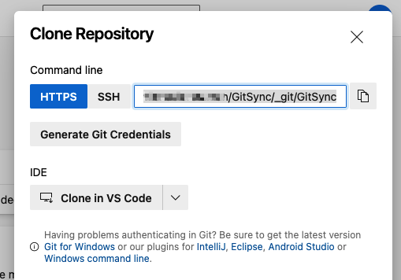
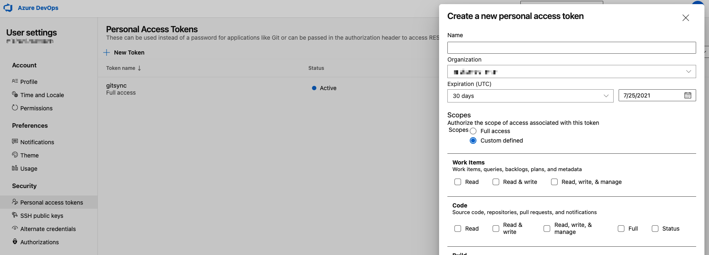
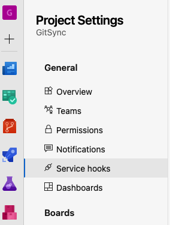
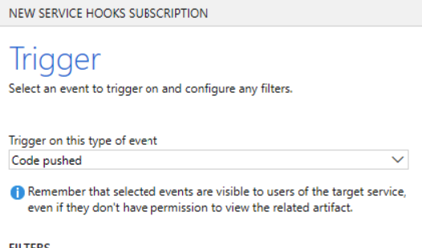
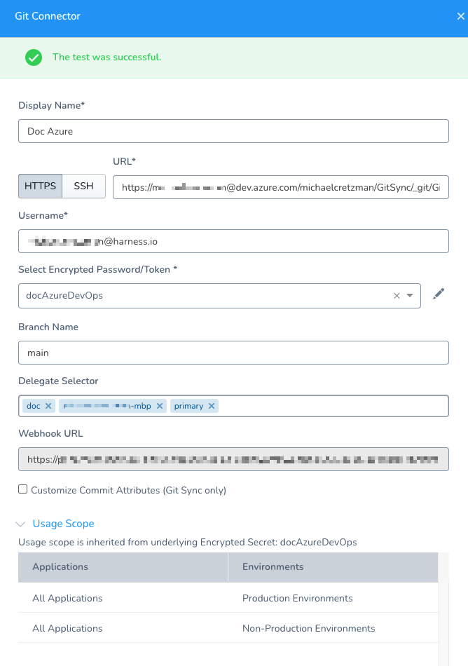

This topic outlines how to connect Harness accounts and applications with one or more Azure DevOps repositories. You add these repos as Source Repo Providers in Harness.

## Before You Begin

* [Configuration as Code Overview](../../config-as-code/configuration-as-code.md): you can synch your Harness account or applications with a repo and work entirely from Git.
* [Link Resource Files or Helm Charts in Git Repos](../../../continuous-delivery/kubernetes-deployments/link-resource-files-or-helm-charts-in-git-repos.md): this is an example of using a Source Repo Provider to pull remote Kubernetes manifest files. Source Repo Providers are used in many other Harness components.

:::note
Ensure your Git repo is initialized (`git init`) before connecting Harness to it.
:::

## Limitations

* One Harness Application cannot be in multiple repos.
* Before Harness syncs with your Git repo, it will confirm that all Harness' settings are in a valid state. If a connection is not working Harness will not sync with your Git repo.
* Harness does not support Azure DevOps [squash merge pull requests](https://docs.microsoft.com/en-us/azure/devops/repos/git/merging-with-squash) with Harness [Configuration as Code](../../config-as-code/configuration-as-code.md) (Git sync with Harness).
* Harness performs a `git clone` to fetch files. If the fetch is timing out, it can be because the repo is too large for the network connection to fetch it before timing out. To fetch very large repos, enable the feature flag `OPTIMIZED_GIT_FETCH_FILES`. When this feature flag is enabled, Harness will use provider-specific APIs to improve performance.  
:::note
If you enable `OPTIMIZED_GIT_FETCH_FILES`, you must use a **token** for authentication. Passwords are not supported.
:::

:::note
Currently, this feature is behind the feature flag `OPTIMIZED_GIT_FETCH_FILES`. Contact [Harness Support](mailto:support@harness.io) to enable the feature.
:::

### Current Azure DevOps Support in Harness

Azure DevOps support is limited for the following Harness features:

* [Google Cloud Builds](../../../continuous-delivery/google-cloud/trigger-google-cloud-builds.md): pulling build spec from Azure DevOps repo is not supported.
* [Harness Triggers](../../../continuous-delivery/model-cd-pipeline/triggers/add-a-trigger-2.md): not supported with Azure DevOps.

## Step: Add Source Repo Provider

To add a source repo, do the following:

1. Click **Setup**.
2. Click **Connectors**.
3. Click **Source Repo Providers**, and then click **Add Source Repo Provider**. The **Git Connector** settings appear.

## Step: Display Name

Enter a name for the repo connection.

This is the name you will select when you sync your Harness account and applications in [Configuration as Code](../../config-as-code/configuration-as-code.md) or other settings where you use the repo.

## Step: Provider

Currently, this feature is behind the Feature Flag `OPTIMIZED_GIT_FETCH_FILES`. Contact [Harness Support](mailto:support@harness.io) to enable the feature.In **Provider**, select **Git**.

## Step: URL

Enter the URL for your DevOps repo, depending on what you selected in **Type**.

Select **HTTPS** or **SSH** for the connection. You will need to provide the protocol-relevant URL in **URL**. If you use Two-Factor Authentication for your Git repo, connect over **HTTPS** or **SSH**.

:::note
For SSH, ensure that the key is not OpenSSH, but rather PEM format. To generate an SSHv2 key, use: `ssh-keygen -t rsa -m PEM` The `rsa` and `-m PEM` ensure the algorithm and that the key is PEM.Next, follow the prompts to create the PEM key. For more information, see the  [ssh-keygen man page](https://linux.die.net/man/1/ssh-keygen) and [Connecting to GitHub with SSH](https://help.github.com/en/github/authenticating-to-github/connecting-to-github-with-ssh).
:::

In your DevOps repo, click **Clone**, and then copy the URL.

:::note
Make sure you copy the URL from Azure and not form it yourself. Azure replaces spaces and other formatting with the correct values and ensures the link will work.
:::

## Step: Credentials

Enter your Azure user name.

Enter a password or token.

For token, in Azure, create a Personal Access Token (PAT).

Next, add the token to Harness as a Harness Secret.

Enter the PAT in the secret and select the secret in **Select Encrypted Password/Token**.

:::note
If you enable `OPTIMIZED_GIT_FETCH_FILES`, you must use a **token** for authentication. Passwords are not supported.
:::

## Step: Branch Name

Enter the branch name to sync with Harness, such as **master**, **dev**, or **myAppName**. Do not enter the full URL to the branch.

:::note
Names may not contain characters from the Emoticons unicode block.
:::

## Option: Delegate Selector

If you want this Connector to use one or more specific Delegates, use a Delegate Selector. If you do not use a Selector, Harness will select a Delegate that has worked in the past for this type of Connector.

In **Delegate Selector**, select the Selector for the Delegate(s) you want this Connector to use. You add Selectors to Delegates to make sure that they're used to execute the command. For more information, see [Select Delegates with Selectors](../manage-delegates/select-delegates-for-specific-tasks-with-selectors.md).

Harness will use Delegates matching the Selectors you add.

If you use one Selector, Harness will use any Delegate that has that Selector.

If you select two Selectors, a Delegate must have both Selectors to be selected. That Delegate might also have other Selectors, but it must have the two you selected.

## Option: Customize Commit Attributes (Git Sync Only)

When Harness commits or pushes a change to Git as part of syncing, it uses Harness.io and support@harness.io as the author and commit email address of that commit.

In some cases, you might have strong pre-commit limitations on who may or may not commit. In that case, you need to provide an author name and email that is approved to push on that repo. You can add an Author Name and Author Email address that will be applied whenever Harness syncs with the Git repo.

## Step: Generate Webhook URL

Enable this checkbox if you want to sync Harness with your repo bidirectionally. Changes made on either end will be synced.

If you simply want Harness changes synched unidirectionally with the repo, disable this checkbox.

When you use this Source Repo Provider to sync a Harness application to a repo bidirectionally, any account or application that uses this Source Repo provider will be synced bidirectionally.

For more information, see [Configuration as Code](../../config-as-code/configuration-as-code.md).

## Option: Using the Webhook

If you selected the **Generate Webhook URL** option when adding your **Source Repo Provider**, the **Generated Webhook URL** dialog appears. Copy the URL and use it in your repo to enable your repo to sync changes to Harness.

For steps on setting this up in your repo, see [Webhooks](https://docs.microsoft.com/en-us/azure/devops/service-hooks/services/webhooks?view=azure-devops) from Azure. The Webhook is added in **Project Settings** > **Service hooks**.

The Azure Service Hook must use **Code pushed** as its **Trigger on this type of event**.

## Step: Test and Save

To finish configuring this Source Repo Provider:

1. In the **Git Connector** settings, click **Test**.  
Harness verifies the settings you entered.

2. When testing is successful, click **Submit**. This Source Repo Provider is now added to Harness.

## Next Steps

* Once a Source Repo Provider is set up, you can use it—at the Harness account level and Application level—to sync your account and/or applications with your Git repo. See [Configuration as Code](../../config-as-code/configuration-as-code.md).
* To trigger Harness workflows and pipelines using Git Webhooks, see [Add a Trigger](../../../continuous-delivery/model-cd-pipeline/triggers/add-a-trigger-2.md).
* To sync and clone a Harness Application template in Git, see [Onboard Teams Using GitOps](../../../continuous-delivery/harness-git-based/onboard-teams-using-git-ops.md).

