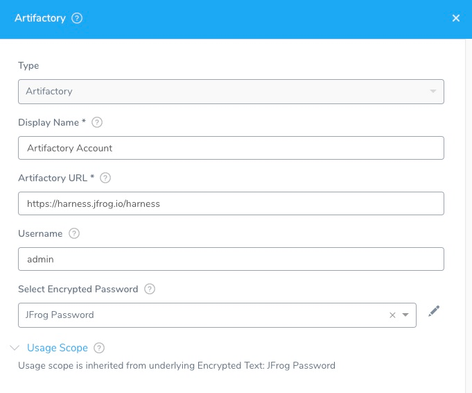

Harness supports both cloud and on-prem versions of Artifactory. Connect your Artifactory artifact servers with Harness.

## Before You Begin

* See [Harness Key Concepts](../../../starthere-firstgen/harness-key-concepts.md).

## Visual Summary

Here's an example of the Artifactory Sources configuration.

## Review: Artifactory Permissions

Make sure the following permissions are granted to the user:

* Privileged User is required to access API, whether Anonymous or a specific username (username and passwords are not mandatory).
* Read permission to all Repositories.

If used as a Docker Repo, user needs:

* List images and tags
* Pull images

See [Managing Permissions: JFrog Artifactory User Guide](https://www.jfrog.com/confluence/display/RTF/Managing+Permissions)

## Review: Label Support

Docker labels are supported for Docker images in Artifactory.

You can reference a label using this expression in a [Shell Script](../../../continuous-delivery/model-cd-pipeline/workflows/capture-shell-script-step-output.md) step:

`${artifact.label.get("<label-key>")}`

See [Built-in Variables List (FirstGen)](../../techref-category/variables/built-in-variables-list.md).

## Step 1: Select Artifactory Server

To connect to an artifact server, do the following:

1. Click **Setup**.
2. Click **Connectors**.
3. Click **Artifact Servers**.
4. Click **Add Artifact Server**.
5. In **Type**, select **Artifactory**.

## Step 2: Display Name

Enter a name for the Artifactory Server. This is the name you will use to identify this connection when adding an Artifact Source to a Harness Service.

## Step 3: Artifactory URL

In the **Artifactory URL** field, ensure that you enter in your base URL followed by your module name.

For most artifacts, use **https://mycompany.jfrog.io/*****module\_name***.

In some cases, you can use **https://*****server\_name*****/artifactory/*****module\_name***.

The URL really depends on how you have set up Artifactory, and whether it is local, virtual, remote, or behind a proxy.

To ensure you use the correct URL, copy it from your Artifactory settings.

See [Repository Management](https://www.jfrog.com/confluence/display/JFROG/Repository+Management) from JFrog.

## Step 4: Credentials and Usage Scope

Enter the credentials.

For secrets and other sensitive settings, select or create a new [Harness Encrypted Text secret](../../security/secrets-management/use-encrypted-text-secrets.md).

Usage Scope is determined by the secret you selected.

## Step 5: Delegate Selector

Select the Delegate Selector(s) of the Delegate(s) you want this Connector to use.

When Harness needs to run a task, it makes a connection to a resource via its Delegates. Harness selects the best Delegate according to its history or it round-robins between Delegates. See [How Does Harness Manager Pick Delegates?](../manage-delegates/delegate-installation.md#how-does-harness-manager-pick-delegates).

In a few cases, you might want Harness to select specific Delegates. In these cases, you can use Delegate Selectors.

See [Select Delegates with Selectors](../manage-delegates/select-delegates-for-specific-tasks-with-selectors.md).

## Step 6: Skip Validation

Select **Skip Validation** to skip credential verification and creation or update process.

## See Also

* [Add a Docker Artifact Source](../../../continuous-delivery/model-cd-pipeline/setup-services/add-a-docker-image-service.md)

