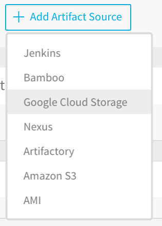

Amazon AWS and Google Cloud Platform are added to Harness as **Cloud Providers**, but they may also be used as artifact servers in a Harness Service.

You simply add them as Cloud Providers, and then when you are adding an artifact in a Harness Service, the AWS S3 and Google Cloud Storage options will be available.

Here is what the Artifact Source list looks like in a Harness service when AWS S3 and Google Cloud Storage have been as added as Cloud Providers:

For information on how to add AWS and GCP as Cloud Providers, see:

* [Add Amazon Web Services Cloud Provider](add-amazon-web-services-cloud-provider.md)
* [Add Google Cloud Platform Cloud Provider](add-google-cloud-platform-cloud-provider.md)

