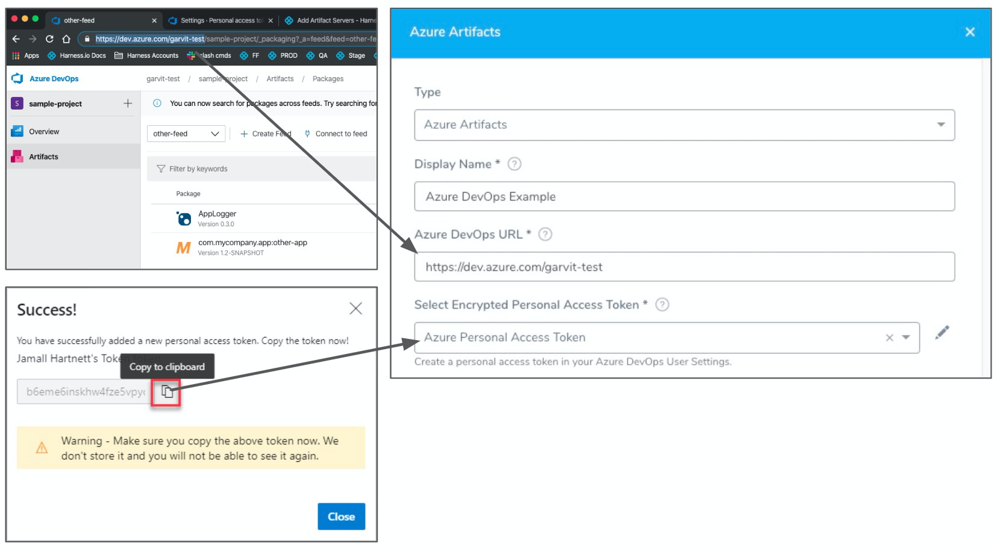
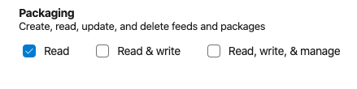

Azure Artifacts package feeds are added to Harness as Azure Artifacts Servers.

:::note
The package types supported currently are NuGet and Maven.
:::note

In this topic:

* [Before You Begin](#before-you-begin)
* [Visual Summary](#visual-summary)
* [Step 1: Select Azure DevOps Artifact Server](#step-1-select-azure-dev-ops-artifact-server)
* [Step 2: Display Name](#step-2-display-name)
* [Step 3: Azure DevOps URL](#step-3-azure-dev-ops-url)
* [Step 4: Personal Access Token](#step-4-personal-access-token)
* [Next Steps](#next-steps)

## Before You Begin

* See [Harness Key Concepts](../../../starthere-firstgen/harness-key-concepts.md).

## Visual Summary

Here's a summary of Azure DevOps Artifact Server connection setup.

The Azure Artifacts connection has the following settings.

## Step 1: Select Azure DevOps Artifact Server

To connect to an artifact server, do the following:

1. Click **Setup**.
2. Click **Connectors**.
3. Click **Artifact Servers**.
4. Click **Add Artifact Server**.
5. In **Type**, click **Azure Artifacts**.

## Step 2: Display Name

Enter a name for the Artifact Server. This is the name you will use to identify this connection when adding an Artifact Source to a Harness Service.

## Step 3: Azure DevOps URL

This is the URL in your browser when you are in the Azure DevOps *organization* containing the projects and feed(s) you want to use.

For example, in this URL, `https://dev.azure.com/garvit-test/sample-project/_packaging?_a=feed&feed=other-feed`, you only need to add `https://dev.azure.com/garvit-test` in the **Azure DevOps URL** setting.

## Step 4: Personal Access Token

Create a Personal Access token as described in [Authenticate access with personal access tokens](https://docs.microsoft.com/en-us/azure/devops/organizations/accounts/use-personal-access-tokens-to-authenticate?view=azure-devops&tabs=preview-page) from Azure.

Next, copy the token and paste it in the Harness Encrypted Text secret you use for **Select Encrypted Personal Access Token**.

The Personal Access Token must have the **Read** permission in **Packaging**.

Click **Submit**.

Once you have added the Azure DevOps Artifact Server, you can use Azure DevOps Artifact feeds as Artifact Sources in Harness Services. See [Add an Azure DevOps Artifact Source](../../../continuous-delivery/model-cd-pipeline/setup-services/add-an-azure-dev-ops-artifact-source.md).

## Next Steps

* See [Azure Deployments Overview](../../../continuous-delivery/azure-deployments/aks-howtos/azure-deployments-overview.md).

