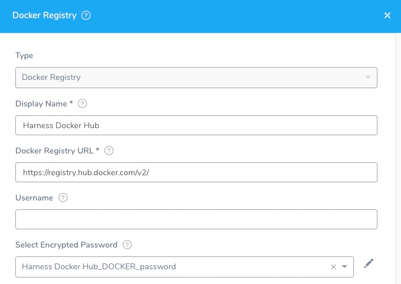

Connect your Docker Registry artifact servers with Harness.

## Before You Begin

* See [Harness Key Concepts](../../../starthere-firstgen/harness-key-concepts.md).

## Visual Summary

Here's an example of the Docker Registry Artifact Source addition.

## Review: Docker Registry Permissions

Make sure the connected user account has the following permissions.

* Read permission for all repositories.

The user needs access and permissions to the following:

* List images and tags
* Pull images

See [Docker Permissions](https://docs.docker.com/datacenter/dtr/2.0/user-management/permission-levels/).

:::note
If you are using anonymous access to a Docker registry for a Kubernetes deployment, then `imagePullSecrets` should be removed from the container specification. This is standard Kubernetes behavior and not related to Harness specifically.
:::

## Limitations

* Some registry providers, such as [Quay](http://quay.io/), will not list images unless authenticated, even if the repo is public.

## Step 1: Select Docker Registry Artifact Server

To connect to an artifact server, do the following:

1. Click **Setup**.
2. Click **Connectors**.
3. Click **Artifact Servers**.
4. Click **Add Artifact Server**.
5. In **Type**, select **Docker Registry**.

## Step 2: Display Name

Enter a name for the Docker Registry Server. This is the name you will use to identify this connection when adding an Artifact Source to a Harness Service.

## Step 3: Docker Registry URL

Enter the URL of the Docker Registry.

The Docker Registry URL for Docker Hub is `https://registry.hub.docker.com/v2/` or `https://index.docker.io/v2/` depending on the provider.

For Docker registry v1 API, use `index.docker.io/v1/`.

For Docker registry v2 API, specify a URL such as `https://registry.hub.docker.com/v2`. This is default on most providers.

## Step 4: Enter the Credentials

Optionally, enter the credentials. The Docker Registry Artifact Server does not require a username and password because you might use it to connect to a public repo.

For secrets and other sensitive settings, select or create a new [Harness Encrypted Text secret](../../security/secrets-management/use-encrypted-text-secrets.md).

Usage Scope is determined by the secret you selected.

## Step 5: Delegate Selector

Select the Delegate Selector(s) of the Delegate(s) you want this Connector to use.

When Harness needs to run a task, it makes a connection to a resource via its Delegates. Harness selects the best Delegate according to its history or it round robins between Delegates. See [How Does Harness Manager Pick Delegates?](../manage-delegates/delegate-installation.md#how-does-harness-manager-pick-delegates).

In a few cases, you might want Harness to select specific Delegates. In these cases, you can use Delegate Selectors.

See [Select Delegates with Selectors](../manage-delegates/select-delegates-for-specific-tasks-with-selectors.md).

