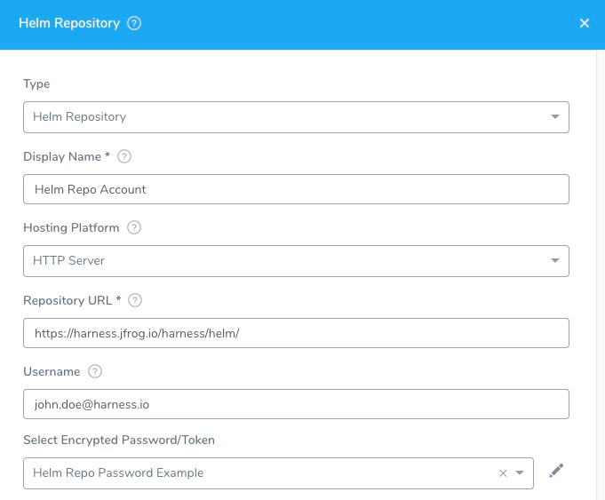
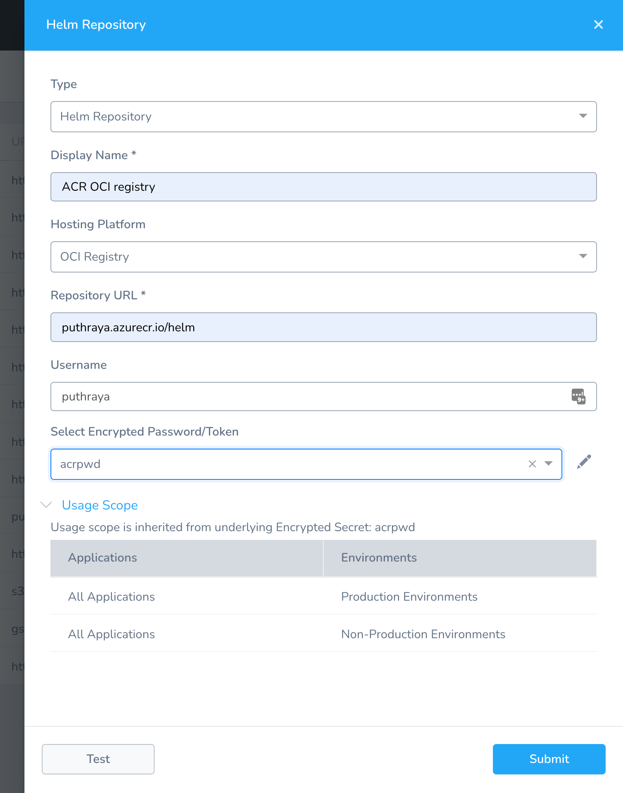

You can add a Helm Chart Repository as an Artifact Server and then use it in Harness Kubernetes and Helm Services. See [Kubernetes Deployments](../../../continuous-delivery/kubernetes-deployments/use-a-helm-repository-with-kubernetes.md) and [Helm Deployments](../../../continuous-delivery/helm-deployment/2-helm-services.md#add-the-helm-chart).

A Helm chart repository is an HTTP server that houses an **index.yaml** file and, if needed, packaged charts. For details, see [The Chart Repository Guide](https://helm.sh/docs/topics/chart_repository/) from Helm.

From Helm:

:::note 
For Helm 2.0.0, chart repositories do not have any intrinsic authentication. There is an issue tracking progress in GitHub.

 Because a chart repository can be any HTTP server that can serve YAML and tar files and can answer GET requests, you have a plethora of options when it comes down to hosting your own chart repository. For example, you can use a Google Cloud Storage (GCS) bucket, Amazon S3 bucket, Github Pages, or even create your own web server.
 
:::
## Before You Begin

* See [Harness Key Concepts](../../../starthere-firstgen/harness-key-concepts.md).

## Visual Summary

Here's an example of Helm Repository Artifact Source configuration.

The Helm Repository dialog has the following fields.

## Step 1: Select Helm Repository

To connect to an artifact server, do the following:

1. Click **Setup**.
2. Click **Connectors**.
3. Click **Artifact Servers**.
4. Click **Add Artifact Server**.
5. In **Type**, click **Helm Repository**.

## Step 2: Display Name

This is the name you will use to select this Artifact Server in you Kubernetes and Helm Services.

## Step 3: Hosting Platform

The type of server where the repo is hosted.

If you select an option other than **HTTP Server**, such as **Amazon S3** or **GCS** (Google Cloud Storage), you will need a Cloud Provider for that account. For more information, see [Add Cloud Providers](cloud-providers.md).

### OCI Registry

Harness supports [OCI registry](https://helm.sh/docs/topics/registries/) for Helm charts using the Helm Repository Artifact Server.

[Helm Registry support](https://helm.sh/docs/topics/registries/) is officially for Helm version 3.8 and above and experimental with version below 3.8.

## Step 4: Repository URL

The URL of the chart repo.

Helm Hub at `https://hub.helm.sh` is not a Helm repo. It is a website for discovery and documentation. While it does list charts for deployments such cluster-autoscaler, the actual Helm repo for this and most charts is `https://kubernetes-charts.storage.googleapis.com`**.**

### OCI Registry

Harness supports [OCI registry](https://helm.sh/docs/topics/registries/) for Helm charts using the Helm Repository Artifact Server.

**Repository URL** should contain the full path except the chart name.

For example, suppose a chart with the name **test-chart** is present in a **helm/charts/** directory.

In **Repository URL**, you would enter `[registry-name].azurecr.io/helm/charts/`.

## Step 5: Username and Password

If the charts are backed by HTTP basic authentication, you can also supply the username and password. See [Share your charts with others](https://helm.sh/docs/topics/chart_repository/#share-your-charts-with-others) from Helm.

For **Amazon S3** and **GCS**, the **Base Path** setting has moved to the Harness Service **Chart Specification** settings.For secrets and other sensitive settings, select or create a new [Harness Encrypted Text secret](../../security/secrets-management/use-encrypted-text-secrets.md).

Usage Scope is determined by the secret you selected.

Click **Submit**.

### GCR authentication supported

For GCR as an OCI registry, Harness support authentication using the following:

* Access token
* A JSON key file where username is `_json_key_base64` and password is base64-encoded JSON key file content.

Harness does not support a username of `_json_key` and password as unencrypted JSON key file content.

#### AWS ECR authentication supported

For **Helm Repository URL**, enter the URL for the repo in the format `https://<aws_account_id>.dkr.ecr.<region>.amazonaws.com`. 

For example, something like `https://0838475738302113.dkr.ecr.us-west-2.amazonaws.com`.

For **Username**, enter `AWS`.

For **Password**, create a new Harness text secret.

Use the following command to retrieve the password from AWS ECR:

`aws ecr get-login-password --region <region>`

For example: `aws ecr get-login-password --region us-west-2`

Copy the password and paste it into a Harness text secret.

## Next Steps

* [Use a Helm Repository with Kubernetes](../../../continuous-delivery/kubernetes-deployments/use-a-helm-repository-with-kubernetes.md)

