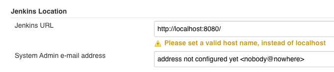

Connect your Jenkins artifact servers with Harness.

In this topic:

* [Before You Begin](#before-you-begin)
* [Limitations](#limitations)
* [Review: Jenkins Permissions](#review-jenkins-permissions)
* [Step 1: Select Jenkins Artifact Server](#step-1-select-jenkins-artifact-server)
* [Step 2: Display Name](#step-2-display-name)
* [Step 3: Jenkins URL](#step-3-jenkins-url)
* [Option: Use this URL for Job Execution](#option-use-this-url-for-job-execution)
* [Step 4: Authentication Mechanism](#step-4-authentication-mechanism)

## Before You Begin

* See [Harness Key Concepts](../../../starthere-firstgen/harness-key-concepts.md).

## Limitations

* Harness does support SAML authentication for Jenkins connections.
* Later, you will use this Jenkins Artifact Server to pull jobs in a Harness Service Artifact Source. If a build parameter name contains a dot (for example `function.zip`) Harness fails artifact collection and **Manually pull artifact** (in **Artifact History**) does not work.

## Review: Jenkins Permissions

Make sure the user account for this connection has the following required permissions in the Jenkins Server.

* Overall: Read.
* Job: Build (if you plan to trigger a build as part of your workflow)

For token-based authentication, go to **http://Jenkins-IP-address/jobs/me/configure** to check and change your API access token. The token is added as part of the HTTP header.

See [Jenkins Matrix-based security](https://wiki.jenkins.io/display/JENKINS/Matrix-based+security).

:::note
If you add Jenkins as an Artifact Server, it is automatically added as a Verification Provider, and is a single account. Changes made to the Jenkins Artifact Server settings, such as username or Display Name, will also apply to the Jenkins Verification Provider settings, and vice versa.
:::

### Okta or Two-Factor Authentication

If you use Okta or 2FA for connections to Jenkins, use the Jenkins API token for **Authentication Mechanism** in the Harness Jenkins Artifact Server.

## Step 1: Select Jenkins Artifact Server

To connect to an artifact server, do the following:

1. Click **Setup**.
2. Click **Connectors**.
3. Click **Artifact Servers**.
4. Click **Add Artifact Server**.
5. In **Type**, select **Jenkins**.

## Step 2: Display Name

Enter a name for the Jenkins Server. This is the name you will use to identify this connection when adding an Artifact Source to a Harness Service.

## Step 3: Jenkins URL

Enter the URL of the Jenkins server. If you are using the Jenkins SaaS (cloud) edition, the URL is in your browser's location field. If you are using the standalone edition of Jenkins, the URL is located in **Manage Jenkins**, **Jenkins Location**:

## Option: Use this URL for Job Execution

Select this option to have Harness use this URL when executing jobs in the [Jenkins Workflow step](../../../continuous-delivery/model-cd-pipeline/workflows/using-the-jenkins-command.md). In most cases, you will not need to select this option.

In some cases, the Jenkins server and Jenkins job(s) have different URLs. The server URL is typically what you see in the **Jenkins Location** settings.

When selected, instead of using the internal URL returned by Jenkins, the URL you enter here in the Jenkins Artifact Server is used for job execution.

## Step 4: Authentication Mechanism
:::note
If you use Okta or 2FA for connections to Jenkins, use the Jenkins API token for **Authentication Mechanism** in the Harness Jenkins Artifact Server.
:::

Enter the credentials to authenticate with the server.

* **Username** — Enter the user account username.
* **Select Encrypted Password/Token** — Select/create a Harness Encrypted Text secret using the Jenkins API token or password in the Password field.
* **Bearer Token (HTTP Header)** — Select/create a Harness Encrypted Text secret using the OpenShift OAuth Access Token in **Select Encrypted Bearer Token(HTTP Header)**.

The **Bearer Token (HTTP Header)** option is only for Jenkins servers hosted/embedded in an OpenShift cluster and using this authentication method.For more information, see [Authentication](https://docs.openshift.com/container-platform/3.7/architecture/additional_concepts/authentication.html) from OpenShift. For token-based authentication, go to **http://Jenkins-IP-address/jobs/me/configure** to check and change your API access token. The token is added as part of the HTTP header.

For secrets and other sensitive settings, select or create a new [Harness Encrypted Text secret](../../security/secrets-management/use-encrypted-text-secrets.md).

Usage Scope is determined by the secret you selected.

Click **Submit**.

