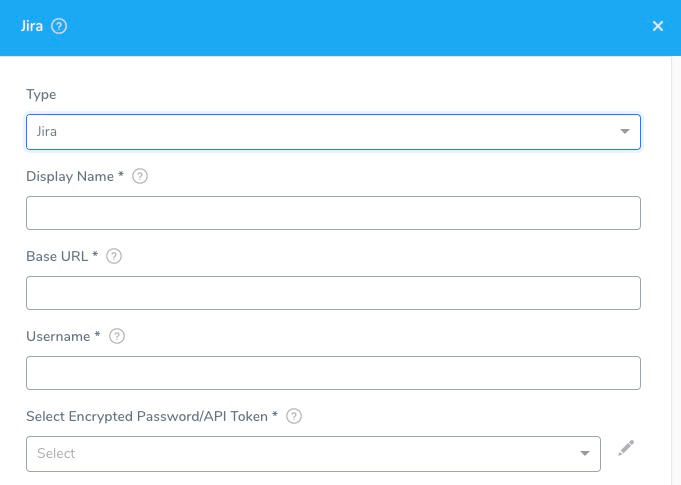

Add Jira as a Harness Collaboration Provider, to enable deployment notifications, approvals, and tracking through Jira.

## Before You Begin

* [Add Collaboration Providers](collaboration-providers.md)

## Limitations

* Your Jira REST API account must have permissions to create and edit issues in the relevant Jira projects. The **Administer Jira** permission includes all relevant permissions (as does the **Administrator** or **Member** permission on [Jira next-gen](https://confluence.atlassian.com/jirasoftwarecloud/overview-of-permissions-in-next-gen-projects-959283605.html)).  
For details, see Atlassian's documentation on [Operation Permissions](https://developer.atlassian.com/cloud/jira/platform/rest/v3/?utm_source=%2Fcloud%2Fjira%2Fplatform%2Frest%2F&utm_medium=302#permissions), [Issues](https://developer.atlassian.com/cloud/jira/platform/rest/v3/?utm_source=%2Fcloud%2Fjira%2Fplatform%2Frest%2F&utm_medium=302#api-group-Issues), and [Managing Project Permissions](https://confluence.atlassian.com/adminjiracloud/managing-project-permissions-776636362.html#Managingprojectpermissions-Projectpermissionsoverview).
* When you set up the Jira Connector, **Username** requires the **full email address** you use to log into Jira.

## Step 1: Add Collaboration Provider

Start adding a Collaboration Provider to Harness as follows:

1. Click **Setup**.
2. Click **Connectors**.
3. Click **Collaboration Providers**.
4. Click **Add Collaboration Provider**. This opens the default Collaboration Provider settings, which you will configure in the following steps.

## Step 2: Type

Select **Jira**. The Jira settings appear.

## Step 3: Display Name

In **Display Name**, enter a unique name to identify this Jira account connection. When you add Jira steps to Workflows or Pipelines, you will select the appropriate Jira account using this name.

## Step 4: Base URL

In **Base URL**, enter the base URL by which your users access your Jira applications. For example: `https://mycompany.atlassian.net`.

:::tip
In Jira, the base URL is set to the same URL that Web browsers use to view your Jira instance. For details, see [Configuring the Base URL](https://confluence.atlassian.com/adminjiraserver071/configuring-the-base-url-802593107.html) from Atlassian.
:::
:::note
If you are using on-premises Jira server with HTTPS redirects enabled, use the HTTPS URL to ensure the [JIRA client follows redirects](https://confluence.atlassian.com/adminjiraserver/running-jira-applications-over-ssl-or-https-938847764.html#:~:text=If%20you%20want%20to%20only,to%20the%20corresponding%20HTTPS%20URLs.).
:::

## Step 5: Username

In **Username**, enter the **full email address** you use to log into Jira.

## Step 6: Password/API Token

In **Select Encrypted Password/API Token**, select or create a new [Harness Encrypted Text secret](../../security/secrets-management/use-encrypted-text-secrets.md) containing the password or API Token to use for the Jira account.

For more information, see [API tokens](https://confluence.atlassian.com/cloud/api-tokens-938839638.html) from Atlassian.

## Step 7: Usage Scope

Usage scope is inherited from the secret entered in **Select Encrypted Password/API Token.**

## Step 8: Test and Save

1. Click **Test** to check your configuration.
2. When the test is successful, click **Submit** to save your Jira Collaboration Provider.

## Next Steps

* To use Jira in a Workflow or Pipeline, see [Jira Integration](../../../continuous-delivery/model-cd-pipeline/workflows/jira-integration.md).
* To integrate Jira with Harness Verification features, see [File Jira Tickets on Verification Events](../../../continuous-delivery/continuous-verification/tuning-tracking-verification/jira-cv-ticket.md)

