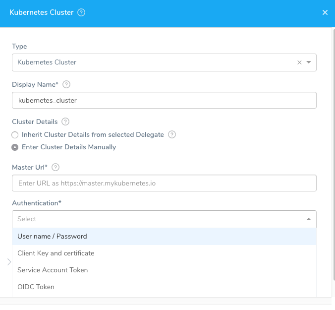
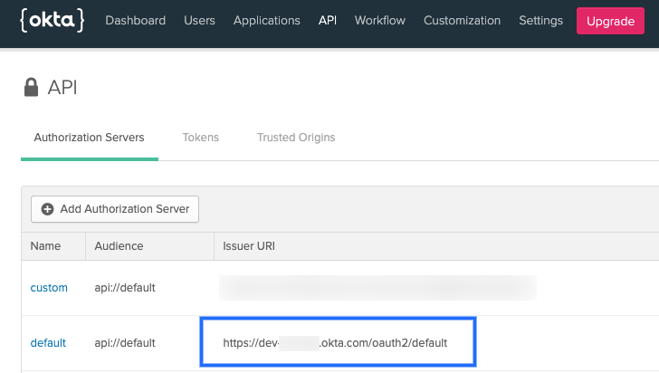
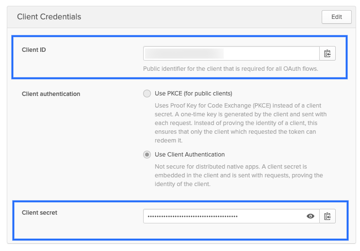
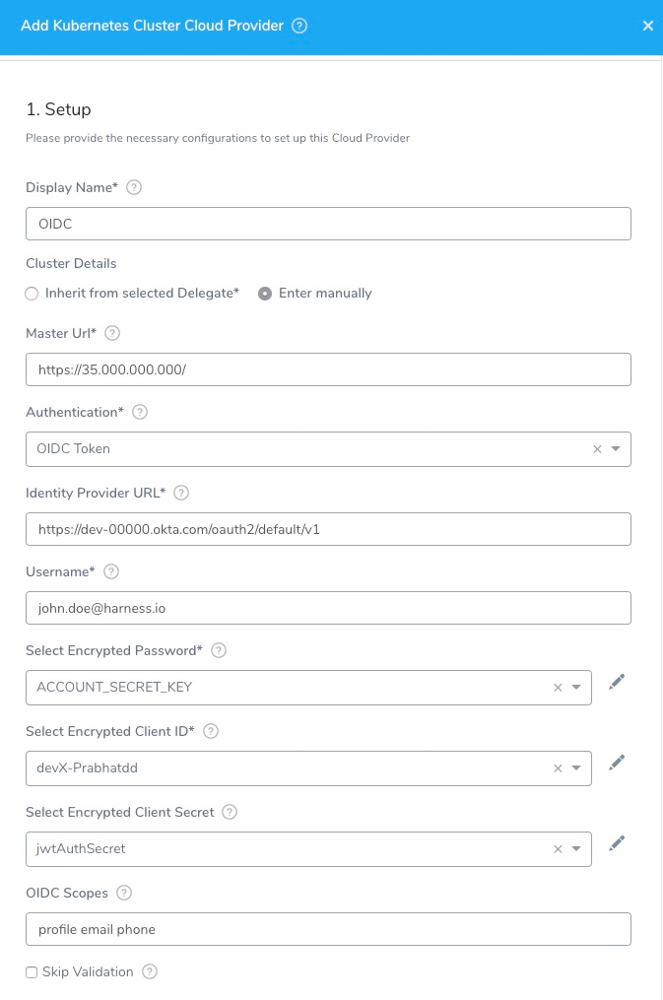

When you create a Kubernetes cluster, you specify its authentication method. In Harness, you use this method to connect to the cluster using a Kubernetes Cluster Cloud Provider.

For more information, see [Authenticating](https://kubernetes.io/docs/reference/access-authn-authz/authentication/) from Kubernetes.

In this topic:

* [Before You Begin](#before-you-begin)
* [Visual Summary](#visual-summary)
* [Review: Using a Delegate Inside or Outside of the Target Cluster](#review-using-a-delegate-inside-or-outside-of-the-target-cluster)
* [Review: Kubernetes Cluster Cloud Provider vs Platform Cloud Providers](#review-kubernetes-cluster-cloud-provider-vs-platform-cloud-providers)
* [Step 1: Add the Cloud Provider](#step-1-add-the-cloud-provider)
* [Step 2: Cluster Details](#step-2-cluster-details)
* [Option 1: Inherit from selected Delegate](#option-1-inherit-from-selected-delegate)
* [Option 2: Enter manually](#option-2-enter-manually)
* [Step 3: Skip Validation](#step-3-skip-validation)
* [Step 4: Credential Validation](#step-4-credential-validation)
* [Review: Permissions Required](#review-permissions-required)
* [Option: Amazon AWS EKS Support](#option-amazon-aws-eks-support)
* [Option: OpenShift Support](#option-open-shift-support)

## Before You Begin

* See  [Harness Key Concepts](../../../starthere-firstgen/harness-key-concepts.md).

## Visual Summary

Here's an overview of the settings required to add a Kubernetes Cluster as Cloud Provider.




## Review: Using a Delegate Inside or Outside of the Target Cluster

Typically, you install the Harness Kubernetes Delegate inside your target cluster and then add a Kubernetes Cluster Cloud Provider that inherits its credentials from the Delegate.

You can also install the Kubernetes Delegate outside of the target cluster (anywhere in your environment).

In this case, the Kubernetes Cluster Cloud Provider will not inherit credentials from the Delegate, but use the target cluster master URL and some authentication method (Service Account Token, etc).

### Using Non-Kubernetes Delegates

You can also use a non-Kubernetes Delegate type (Helm, Docker, Shell Script) with a Kubernetes Cluster Cloud Provider.

In this case, the Kubernetes Cluster Cloud Provider will not inherit credentials from the Delegate, but use the cluster master URL and some authentication method (Service Account Token, etc).

## Review: Kubernetes Cluster Cloud Provider vs Platform Cloud Providers

The Kubernetes Cluster Cloud Provider is platform-agnostic. Use it to access a cluster on any platform.

It cannot also access platform-specific services and resources. For those, use a platform Cloud Provider like Google Cloud Platform or Amazon Web Services.

For example, let's say you have a GKE Kubernetes cluster hosted in Google Cloud Platform (GCP). You can use the Kubernetes Cluster Cloud Provider to connect Harness to the cluster in GCP. The Kubernetes Cluster Cloud Provider cannot also access Google Container Registry (GCR).

In this case, you have two options:

1. Use a Google Cloud Platform Cloud Provider to access the GKE cluster and all other GCP resources you need.
2. Set up a Kubernetes Cluster Cloud Provider for the GKE cluster. Next, set up a Google Cloud Platform Cloud Provider for all other GCP services and resources.

When you set up a deployment in Harness, you will specify Cloud Providers to use for the artifact and target cluster. If we use option 2 above, you will select a Google Cloud Platform Cloud Provider for the GCR container. Next, you will select Kubernetes Cluster Cloud Provider for the target cluster.

Which option you choose will depend on how your teams use Harness.

Related topics: [Connect to Your Target Kubernetes Platform](../../../continuous-delivery/kubernetes-deployments/connect-to-your-target-kubernetes-platform.md) and [Target Delegates to Specific Namespaces](../manage-delegates/enable-delegate-to-deploy-to-multiple-kubernetes-namespaces.md).

## Review: Permissions for the Kubernetes Role

You can use different methods for authenticating with the Kubernetes cluster, but all of them use a Kubernetes Role.

The Role used must have either the `cluster-admin` permission in the target cluster or admin permissions in the target namespace.

If you don’t want to use `resources: [“*”]` for the Role, you can list out the resources you want to grant. Harness needs `configMap`, `secret`, `event`, `deployment`, and `pod` at a minimum. Beyond that, it depends on the resources you are deploying via Harness.

If you don’t want to use `verbs: [“*”]` for the Role, you can list out all of the verbs (`create`, `delete`, `get`, `list`, `patch`, `update`, `watch`).

The YAML provided for the Harness Delegate defaults to `cluster-admin` because that ensures anything could be applied. Any restriction must take into account the actual manifests to be deployed.

## Step 1: Add the Cloud Provider

To add a cloud provider to your Harness account, do the following:

1. Click **Setup**, and then click **Cloud Providers**.
2. Click **Add Cloud Provider** and select **Kubernetes Cluster**.

The **Add Kubernetes Cluster Cloud Provider** dialog appears.

The authentication strategy for the Kubernetes cluster is used to fill in the dialog.

**What does the Test button do?** The **Test** button tests the credentials to ensure that the Harness Delegate can authenticate with the Kubernetes cluster. The Harness Delegate(s) performs all Harness operations in the cluster.

The **Kubernetes Cluster** settings support the following authentication strategies:

* **Inherit from selected Delegate**. Use this option if you installed the Harness delegate in your cluster. This is the most common method and works great for platforms such Amazon EKS.
* Username and password.
* Custom: CA certificate, client certificate, and client key. Key passphrase and key algorithm are optional.
* Kubernetes Service Account Token.
* OIDC Token (OpenID Connect). For information on OIDC, see [Identity, Claims, & Tokens – An OpenID Connect Primer](https://developer.okta.com/blog/2017/07/25/oidc-primer-part-1) from Okta.

The **Kubernetes Cluster** dialog has the following fields.

## Step 2: Cluster Details

There are two ways to enter cluster authentication settings:

## Option 1: Inherit from selected Delegate

Select this option if the Harness Delegate is installed in the deployment target Kubernetes cluster.

When you select this option, the Harness Delegate will inherit the Kubernetes service account associated with the Delegate pod.

The service account associated with the Delegate pod must have the Kubernetes **cluster-admin** role.

You select the Delegate by selecting the Selector(s) of the Delegate. For information on adding Selectors to Delegates, see [Delegate Installation](../manage-delegates/delegate-installation.md).

Custom Selectors can be applied to multiple Delegates. If you use Custom Selectors in the Cloud Provider, you can select multiple Delegates.

:::note
In the case of some Kubernetes providers, such as OpenShift, the Delegate should be installed outside of the cluster.
:::

## Option 2: Enter manually

If you want to enter specific credentials manually, there are several options.

### Master URL

The Kubernetes master node URL. The easiest method to obtain the master URL is using kubectl:

`kubectl cluster-info`

### Username and Password

Username and password for the Kubernetes cluster. For example, **admin** or **john@example.com**, and a Basic authentication password.

You can use an inline username or a Harness [Encrypted Text secret](../../security/secrets-management/use-encrypted-text-secrets.md).

For the password, select or create a new Harness Encrypted Text secret.

:::note
This is not used, typically. Some cloud providers have Basic authentication disabled by default. The cluster would need Basic authentication enabled and a specific username and password configured for authentication.
:::
:::tip
For OpenShift or any other platform, this is not the username/password for the platform. It is the username/password for the cluster.
:::

### Service Account Token

Add the service account token for the service account. The token must be pasted in decoded in the Encrypted Text secret you create/select.

To use a Kubernetes Service Account (SA) and token, you will need to either use an existing SA that has the `cluster-admin` permission (or namespace `admin`) or create a new SA and grant it the `cluster-admin` permission (or namespace `admin`).

For example, here's a manifest that creates a new SA named `harness-service-account` in the `default` namespace.


:::note

The Kubernetes SA token is not automatically generated if the SAs are provisioned under Kubernetes versions 1.24 or later. Create a new SA token and decode it to the `base64` format.

:::


```
# harness-service-account.yml  
apiVersion: v1  
kind: ServiceAccount  
metadata:  
  name: harness-service-account  
  namespace: default
```
Next, you apply the SA.


```
kubectl apply -f harness-service-account.yml
```
Next, grant the SA the `cluster-admin` permission.


```
# harness-clusterrolebinding.yml  
apiVersion: rbac.authorization.k8s.io/v1beta1  
kind: ClusterRoleBinding  
metadata:  
  name: harness-admin  
roleRef:  
  apiGroup: rbac.authorization.k8s.io  
  kind: ClusterRole  
  name: cluster-admin  
subjects:  
- kind: ServiceAccount  
  name: harness-service-account  
  namespace: default
```
Next, apply the ClusterRoleBinding.


```
kubectl apply -f harness-clusterrolebinding.yml
```
Once you have the SA added, you can gets its token using the following commands.


```
SERVICE_ACCOUNT_NAME={SA name}  
  
NAMESPACE={target namespace}  
  
SECRET_NAME=$(kubectl get sa "${SERVICE_ACCOUNT_NAME}" --namespace "${NAMESPACE}" -o=jsonpath='{.secrets[].name}')  
  
TOKEN=$(kubectl get secret "${SECRET_NAME}" --namespace "${NAMESPACE}" -o=jsonpath='{.data.token}' | base64 -d)  
  
echo $TOKEN
```
The `| base64 -d` piping decodes the token. You can now enter it into Harness.

#### Encrypted CA Certificate (Deprecated)

To support some legacy configurations, the Encrypted CA Certificate setting is available as an option here.

### Custom

This option is used for older Harness accounts.

#### CA Certificate

Add the Certificate authority root certificate used to validate client certificates presented to the API server. For more information, see [Authenticating](https://kubernetes.io/docs/reference/access-authn-authz/authentication/) from Kubernetes.

#### Client Certificate

Add the client certificate for the cluster. The client certificate may be used in conjunction with or in place of Basic authentication. The public client certificate is generated along with the private client key used to authenticate.The certificate can be pasted in either Base64 encoded or decoded.

#### Client Key

Add the client key for the client certificate. The key can be pasted in either Base64 encoded or decoded.

#### Client Key Passphrase

Add the client key passphrase. The passphrase can be pasted in either Base64 encoded or decoded.

#### Client Key Algorithm

Specify the encryption algorithm used when the certificate was created. Typically, RSA.

### OIDC Token

These settings come from the OIDC provider authorization server you have set up and others come from the provider app you are using to log in with.

First let's look at the authorization server-related settings:

* **Identity Provider URL:** The issuer URI for the provider authentication server.

For example, in Okta, this is the Issuer URL for the [Authorization Server](https://developer.okta.com/docs/concepts/auth-servers/):



Providers use different API versions. If you want to identify the version also, you can obtain it from the token endpoint.

In Okta, in the authentication server **Settings**, click the **Metadata URI**. Locate the **token\_endpoint**. Use the **token\_endpoint** URL except for the **/token** part. For example, you would use `https://dev-00000.okta.com/oauth2/default/v1` from the following endpoint:


```
"token_endpoint":"https://dev-00000.okta.com/oauth2/default/v1/token"
```
* **OIDC Scopes:** OIDC scopes are used by an application during authentication to authorize access to a user's details, like name and picture. In Okta, you can find them in the Authorization Server **Scopes** tab:


If you enter multiple scopes, separate them using spaces.

The remaining OIDC Token settings are part of the provider app you are using to log in.

* **Username and password:** Login credentials for a user assigned to the provider app.
* **Client ID:** Public identifier for the client that is required for all OAuth flows. In Okta, this is located in the **Client Credentials** for the app:



* **Client Secret:** The client secret for the app. For Okta, you can see this in the above picture.

Here is an example of OIDC credentials in the Kubernetes Cluster Cloud Provider:




## Step 3: Skip Validation

:::note
This setting affects credential validation only. Harness will always verify network connectivity.Enable this option during *creation* of the Cloud Provider only.
:::

When you create a service infrastructure as part of your production Harness setup, Harness will need to validate its credentials.

Until Harness has a specific namespace for the Kubernetes cluster, it tries to validate credentials in the **default** namespace.

If you have a cluster without a default namespace, or the credentials entered in this dialog do not have permission in the default namespace, you can disable validation initially.

## Step 4: Credential Validation

When you click **Submit**, Harness uses the provided credentials to list controllers in the **default** namespace in order to validate the credentials. If validation fails, Harness does not save the Cloud Provider and the **Submit** fails.

If your cluster does not have a **default** namespace, or your credentials do not have permission in the **default** namespace, then you can check **Skip Validation** to skip this check and saving your Cloud Provider settings. You do not need to come back and uncheck **Skip Validation**.

Later, when you create a Harness Infrastructure Definition using this Cloud Provider, you will also specify a specific namespace. During deployment, Harness uses this namespace rather than the **default** namespace.

When Harness saves the Infrastructure Definition it performs validation even if **Skip Validation** was checked.

Related topic:  [Target Delegates to Specific Namespaces](../manage-delegates/enable-delegate-to-deploy-to-multiple-kubernetes-namespaces.md).

## Review: Permissions Required

A Kubernetes service account with permission to create entities in the target namespace is required.

The set of permissions should include list, get, create, and delete permissions for each of the entity types Harness uses. In general, cluster admin permission or namespace admin permission is sufficient.

When you use the **Inherit from selected Delegate** option (an in-cluster Delegate) or a the **Service Account Token** setting, Kubernetes RBAC applies. The service account you use must have the Kubernetes `cluster-admin` role.

For more information, see [User-Facing Roles](https://kubernetes.io/docs/reference/access-authn-authz/rbac/#user-facing-roles) from Kubernetes.

### Kubernetes Permissions Depend in What You Are Deploying

The Kubernetes RBAC needed by Harness depends entirely on what you are deploying and where.

The minimum permissions Harness needs are list, get, create, update, and delete ConfigMaps and Secrets in the target namespace. Harness also needs to read events.

Any other Kubernetes permissions depends on what is in your manifests.

[Kubernetes RBAC](https://kubernetes.io/docs/reference/access-authn-authz/rbac/) is documented by Kubernetes.

:::note
The exact API versions depends on the Kubernetes cluster version that evolves over time as entity types get promoted. For example, the [API for v1.20](https://kubernetes.io/docs/reference/generated/kubernetes-api/v1.20/).
:::

## Option: AWS EKS Support

Harness does not support the STS assume role (`"Action": "sts:AssumeRole"`) for [IAM for Service Accounts](https://docs.aws.amazon.com/eks/latest/userguide/iam-roles-for-service-accounts.html) in the Kubernetes Cluster Cloud Provider at the time. You can use the [AWS Cloud Provider](add-amazon-web-services-cloud-provider.md) for STS assume role.AWS EKS is supported using the **Inherit from selected Delegate** option in the Kubernetes Cluster Cloud Provider settings.

The process is as follows:

1. Install a Harness Kubernetes Delegate in your EKS cluster. Give it a name that you can recognize as an EKS cluster Delegate. For information on installing a Kubernetes Delegate, see [Connect to Your Target Kubernetes Platform](../../../continuous-delivery/kubernetes-deployments/connect-to-your-target-kubernetes-platform.md).
2. Add a Kubernetes Cluster Cloud Provider. In the Cloud Provider settings, do the following:
	1. In **Type**, click **Kubernetes Cluster**.
	2. Select **Inherit from selected Delegate**.
	3. In **Delegate Name**, select the name of the Kubernetes Delegate you installed in the EKS cluster.
3. Click **Submit**.

When setting up the EKS cluster as a Harness Infrastructure Definition in a Harness Environment, you simply select the Kubernetes Cluster Cloud Provider. For example:


Using the EKS-based Environment in a Workflow is no different than using any Kubernetes cluster. You simply select the Environment and Infrastructure Provisioner as part of setting up the Workflow.

## Option: OpenShift Support

This section describes how to support OpenShift using a Delegate running externally to the Kubernetes cluster. Harness does support running Delegates internally for OpenShift 3.11 or greater, but the cluster must be configured to allow images to run as root inside the container in order to write to the filesystem.Typically, OpenShift is supported through an external Delegate installation (shell script installation of the Delegate outside of the Kubernetes cluster) and a service account token, entered in the **Service Account Token** setting. You only need to use the **Master URL** and **Service Account Token** setting in the **Kubernetes Cluster Cloud Provider** dialog.

The following shell script is a quick method for obtaining the service account token. Run this script wherever you run kubectl to access the cluster.

Set the `SERVICE_ACCOUNT_NAME` and `NAMESPACE` values to the values in your infrastructure.


```
SERVICE_ACCOUNT_NAME=default  
NAMESPACE=mynamepace  
SECRET_NAME=$(kubectl get sa "${SERVICE_ACCOUNT_NAME}" --namespace "${NAMESPACE}" -o json | jq -r '.secrets[].name')  
TOKEN=$(kubectl get secret "${SECRET_NAME}" --namespace "${NAMESPACE}" -o json | jq -r '.data["token"]' | base64 -D)  
echo $TOKEN
```
Once configured, OpenShift is used by Harness as a typical Kubernetes cluster.

#### OpenShift Notes

* If you decide to use a username/password for credentials in the Harness Kubernetes Cluster Cloud Provider, do not use the username/password for the OpenShift platform. Use the username/password for the **cluster**.
* Harness supports [DeploymentConfig](https://docs.openshift.com/container-platform/4.1/applications/deployments/what-deployments-are.html), [Route](https://docs.openshift.com/enterprise/3.0/architecture/core_concepts/routes.html), and [ImageStream](https://docs.openshift.com/enterprise/3.2/architecture/core_concepts/builds_and_image_streams.html#image-streams) across Canary, Blue Green, and Rolling deployment strategies. Please use `apiVersion: apps.openshift.io/v1` and not `apiVersion: v1`.
* The token does not need to have global read permissions. The token can be scoped to the namespace.
* The Kubernetes containers must be OpenShift-compatible containers. If you are already using OpenShift, then this is already configured. But be aware that OpenShift cannot simply deploy any Kubernetes container. You can get OpenShift images from the following public repos: <https://hub.docker.com/u/openshift> and <https://access.redhat.com/containers>.
* Useful articles for setting up a local OpenShift cluster for testing: [How To Setup Local OpenShift Origin (OKD) Cluster on CentOS 7](https://computingforgeeks.com/setup-openshift-origin-local-cluster-on-centos/), [OpenShift Console redirects to 127.0.0.1](https://chrisphillips-cminion.github.io/kubernetes/2019/07/08/OpenShift-Redirect.html).

For information on installing the delegate, see [Delegate Installation](../manage-delegates/delegate-installation.md).

